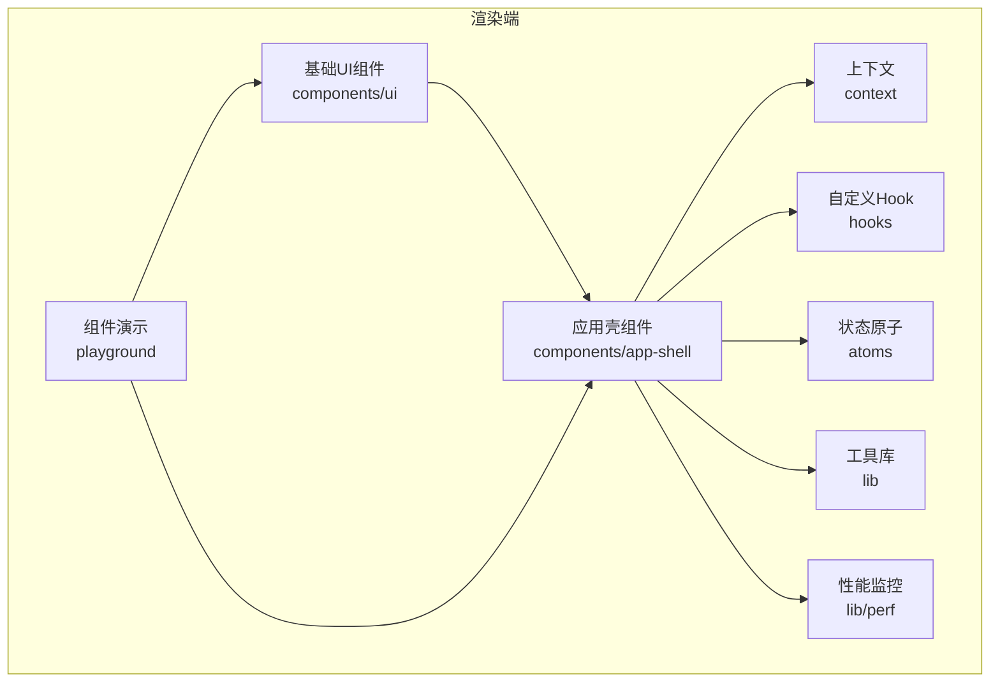
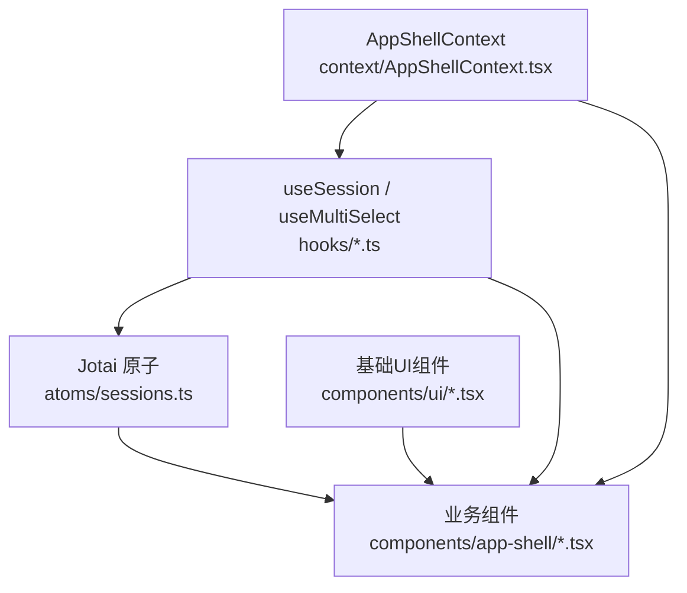
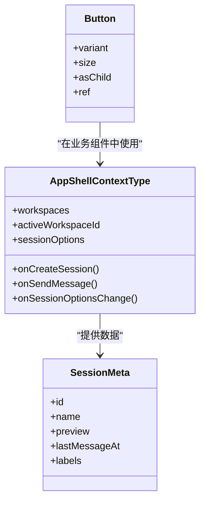
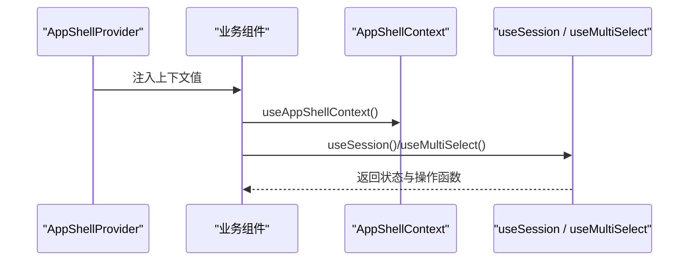
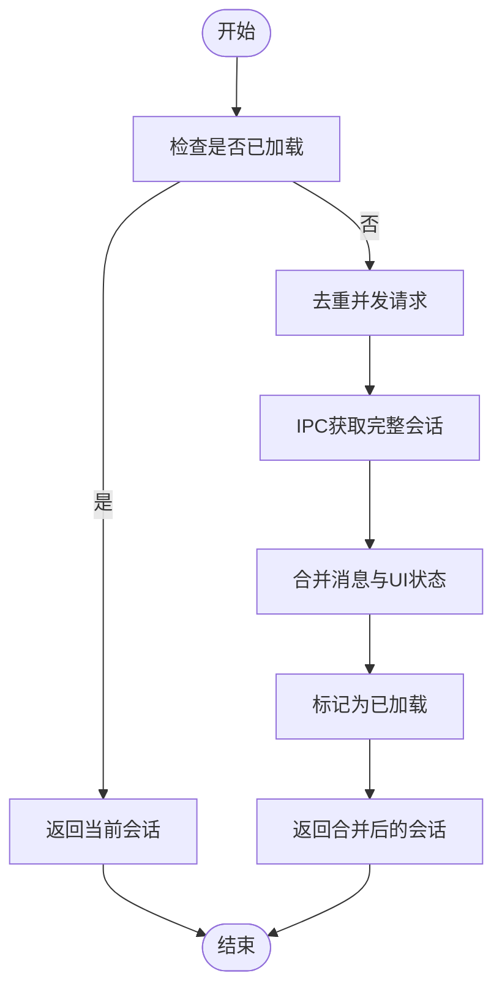
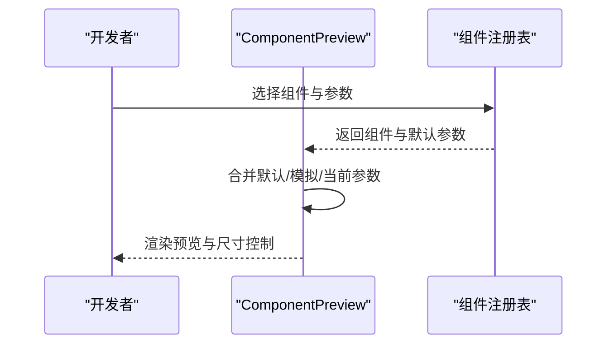
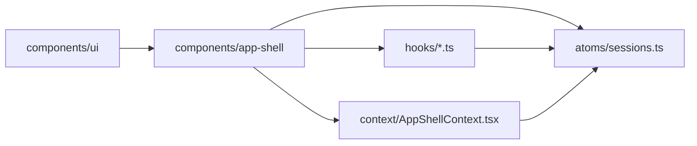
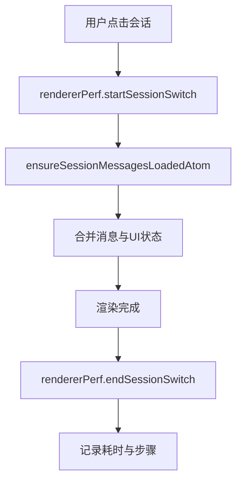
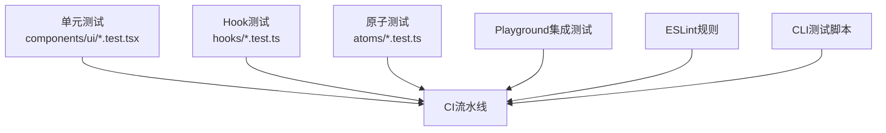

# 组件开发指南

<cite>
**本文档引用的文件**
- [apps/electron/src/renderer/components/app-shell/AppShell.tsx](file://apps/electron/src/renderer/components/app-shell/AppShell.tsx)
- [apps/electron/src/renderer/context/AppShellContext.tsx](file://apps/electron/src/renderer/context/AppShellContext.tsx)
- [apps/electron/src/renderer/hooks/useSession.ts](file://apps/electron/src/renderer/hooks/useSession.ts)
- [apps/electron/src/renderer/atoms/sessions.ts](file://apps/electron/src/renderer/atoms/sessions.ts)
- [apps/electron/src/renderer/lib/utils.ts](file://apps/electron/src/renderer/lib/utils.ts)
- [apps/electron/src/renderer/components/ui/button.tsx](file://apps/electron/src/renderer/components/ui/button.tsx)
- [apps/electron/src/renderer/hooks/useMultiSelect.ts](file://apps/electron/src/renderer/hooks/useMultiSelect.ts)
- [apps/electron/src/renderer/lib/perf.ts](file://apps/electron/src/renderer/lib/perf.ts)
- [apps/electron/src/renderer/playground/ComponentPreview.tsx](file://apps/electron/src/renderer/playground/ComponentPreview.tsx)
- [apps/electron/eslint.config.mjs](file://apps/electron/eslint.config.mjs)
- [apps/cli/package.json](file://apps/cli/package.json)
</cite>

## 目录
1. [简介](#简介)
2. [项目结构](#项目结构)
3. [核心组件](#核心组件)
4. [架构总览](#架构总览)
5. [详细组件分析](#详细组件分析)
6. [依赖关系分析](#依赖关系分析)
7. [性能考虑](#性能考虑)
8. [测试策略](#测试策略)
9. [故障排查指南](#故障排查指南)
10. [结论](#结论)
11. [附录](#附录)

## 简介
本指南面向新加入的前端开发者，系统化介绍如何在本项目中进行组件开发与维护。内容涵盖：组件设计原则、接口定义与属性传递模式、状态管理与上下文使用、测试策略（单元与集成）、性能优化与内存管理、常见组件模式与复用策略、以及完整的开发工作流程与质量保证标准。

## 项目结构
本项目采用多应用与多包的组织方式，组件开发主要集中在 Electron 渲染端的组件库与业务组件中。核心路径如下：
- 应用层：apps/electron/src/renderer/components 为业务组件集合
- 基础UI库：apps/electron/src/renderer/components/ui 为基础组件
- 状态管理：apps/electron/src/renderer/atoms 为基于 Jotai 的原子化状态
- 上下文：apps/electron/src/renderer/context 提供跨层级数据传递
- 工具函数：apps/electron/src/renderer/lib 提供通用工具
- 性能监控：apps/electron/src/renderer/lib/perf 提供渲染性能指标
- 演示与预览：apps/electron/src/renderer/playground 提供组件演示环境
- 质量保障：apps/electron/eslint.config.mjs 定义代码规范与限制规则

**图表来源**
- [apps/electron/src/renderer/components/app-shell/AppShell.tsx:483-490](file://apps/electron/src/renderer/components/app-shell/AppShell.tsx#L483-L490)
- [apps/electron/src/renderer/context/AppShellContext.tsx:178-186](file://apps/electron/src/renderer/context/AppShellContext.tsx#L178-L186)
- [apps/electron/src/renderer/atoms/sessions.ts:122-125](file://apps/electron/src/renderer/atoms/sessions.ts#L122-L125)

**章节来源**
- [apps/electron/src/renderer/components/app-shell/AppShell.tsx:483-490](file://apps/electron/src/renderer/components/app-shell/AppShell.tsx#L483-L490)
- [apps/electron/src/renderer/context/AppShellContext.tsx:178-186](file://apps/electron/src/renderer/context/AppShellContext.tsx#L178-L186)
- [apps/electron/src/renderer/atoms/sessions.ts:122-125](file://apps/electron/src/renderer/atoms/sessions.ts#L122-L125)

## 核心组件
本节聚焦于组件开发的关键构件：应用壳、上下文、状态原子、基础UI组件与工具函数。

- 应用壳组件 AppShell
  - 职责：承载三栏布局、会话列表过滤与分组、侧边栏与导航器控制、主题与焦点模式等
  - 设计要点：通过 AppShellContextType 将数据与回调集中注入，避免深层属性传递；使用 Jotai 原子隔离会话状态，防止流式更新导致的全局重渲染
  - 关键实现参考：[AppShellProps 接口:156-165](file://apps/electron/src/renderer/components/app-shell/AppShell.tsx#L156-L165)，[AppShellContent 主体逻辑:496-502](file://apps/electron/src/renderer/components/app-shell/AppShell.tsx#L496-L502)

- 上下文 AppShellContext
  - 职责：提供会话、工作区、权限、凭证、选项等统一数据源与回调入口
  - 设计要点：将“数据”与“回调”分离，仅暴露必要字段；通过 useAppShellContext/useOptionalAppShellContext 使用，确保类型安全与可选消费
  - 关键实现参考：[AppShellContextType 接口:33-174](file://apps/electron/src/renderer/context/AppShellContext.tsx#L33-L174)，[useSessionOptionsFor 钩子:244-281](file://apps/electron/src/renderer/context/AppShellContext.tsx#L244-L281)

- 状态原子 sessions.ts
  - 职责：以 atomFamily 为每个会话创建独立原子，实现按需加载与隔离更新
  - 设计要点：提取轻量元数据用于列表展示；对流式更新进行保护，避免与主进程状态不同步
  - 关键实现参考：[sessionAtomFamily:122-125](file://apps/electron/src/renderer/atoms/sessions.ts#L122-L125)，[ensureSessionMessagesLoadedAtom:658-663](file://apps/electron/src/renderer/atoms/sessions.ts#L658-L663)

- 基础UI组件 Button
  - 职责：提供变体与尺寸的按钮组件，支持语义化数据槽
  - 设计要点：使用 cva 定义变体，cn 合并样式，forwardRef 支持外部 ref
  - 关键实现参考：[Button 组件:42-54](file://apps/electron/src/renderer/components/ui/button.tsx#L42-L54)

- 工具函数 utils.ts
  - 职责：合并 Tailwind 类名，避免冲突
  - 关键实现参考：[cn 函数:4-6](file://apps/electron/src/renderer/lib/utils.ts#L4-L6)

**章节来源**
- [apps/electron/src/renderer/components/app-shell/AppShell.tsx:156-165](file://apps/electron/src/renderer/components/app-shell/AppShell.tsx#L156-L165)
- [apps/electron/src/renderer/context/AppShellContext.tsx:33-174](file://apps/electron/src/renderer/context/AppShellContext.tsx#L33-L174)
- [apps/electron/src/renderer/atoms/sessions.ts:122-125](file://apps/electron/src/renderer/atoms/sessions.ts#L122-L125)
- [apps/electron/src/renderer/components/ui/button.tsx:42-54](file://apps/electron/src/renderer/components/ui/button.tsx#L42-L54)
- [apps/electron/src/renderer/lib/utils.ts:4-6](file://apps/electron/src/renderer/lib/utils.ts#L4-L6)

## 架构总览
组件开发遵循“上下文-原子-组件”的分层架构：
- 上下文层：集中提供数据与回调，避免属性钻取
- 状态层：Jotai 原子家族实现会话级隔离，配合懒加载与消息合并
- 组件层：基础UI组件与业务组件，通过上下文与钩子组合使用

**图表来源**
- [apps/electron/src/renderer/context/AppShellContext.tsx:178-186](file://apps/electron/src/renderer/context/AppShellContext.tsx#L178-L186)
- [apps/electron/src/renderer/hooks/useSession.ts:25-36](file://apps/electron/src/renderer/hooks/useSession.ts#L25-L36)
- [apps/electron/src/renderer/hooks/useMultiSelect.ts:36-43](file://apps/electron/src/renderer/hooks/useMultiSelect.ts#L36-L43)
- [apps/electron/src/renderer/atoms/sessions.ts:122-125](file://apps/electron/src/renderer/atoms/sessions.ts#L122-L125)
- [apps/electron/src/renderer/components/app-shell/AppShell.tsx:483-490](file://apps/electron/src/renderer/components/app-shell/AppShell.tsx#L483-L490)

## 详细组件分析

### 组件设计原则与接口定义
- 单一职责：每个组件聚焦一个功能域，如按钮、会话列表、侧边栏等
- 只读输入：通过 props 传入只读数据，避免在组件内直接修改
- 上下文优先：复杂数据与回调通过 AppShellContext 注入，减少属性传递
- 变体与尺寸：基础UI组件通过变体与尺寸参数实现风格统一

**图表来源**
- [apps/electron/src/renderer/context/AppShellContext.tsx:33-174](file://apps/electron/src/renderer/context/AppShellContext.tsx#L33-L174)
- [apps/electron/src/renderer/components/ui/button.tsx:36-40](file://apps/electron/src/renderer/components/ui/button.tsx#L36-L40)
- [apps/electron/src/renderer/atoms/sessions.ts:20-78](file://apps/electron/src/renderer/atoms/sessions.ts#L20-L78)

**章节来源**
- [apps/electron/src/renderer/context/AppShellContext.tsx:33-174](file://apps/electron/src/renderer/context/AppShellContext.tsx#L33-L174)
- [apps/electron/src/renderer/components/ui/button.tsx:36-40](file://apps/electron/src/renderer/components/ui/button.tsx#L36-L40)
- [apps/electron/src/renderer/atoms/sessions.ts:20-78](file://apps/electron/src/renderer/atoms/sessions.ts#L20-L78)

### 属性传递模式与上下文使用
- 通过 AppShellProvider 将上下文值注入到组件树
- 使用 useAppShellContext 获取上下文，或 useOptionalAppShellContext 在演示环境中安全消费
- 会话选择与多选通过 useSession 与 useMultiSelect 钩子管理

**图表来源**
- [apps/electron/src/renderer/context/AppShellContext.tsx:178-186](file://apps/electron/src/renderer/context/AppShellContext.tsx#L178-L186)
- [apps/electron/src/renderer/hooks/useSession.ts:25-36](file://apps/electron/src/renderer/hooks/useSession.ts#L25-L36)
- [apps/electron/src/renderer/hooks/useMultiSelect.ts:36-43](file://apps/electron/src/renderer/hooks/useMultiSelect.ts#L36-L43)

**章节来源**
- [apps/electron/src/renderer/context/AppShellContext.tsx:178-186](file://apps/electron/src/renderer/context/AppShellContext.tsx#L178-L186)
- [apps/electron/src/renderer/hooks/useSession.ts:25-36](file://apps/electron/src/renderer/hooks/useSession.ts#L25-L36)
- [apps/electron/src/renderer/hooks/useMultiSelect.ts:36-43](file://apps/electron/src/renderer/hooks/useMultiSelect.ts#L36-L43)

### 复杂逻辑组件：会话状态与懒加载
- 会话原子族：每个会话拥有独立原子，避免全局重渲染
- 元数据提取：仅在列表显示需要时使用轻量元数据
- 懒加载与消息合并：首次仅加载空消息，打开时再拉取完整历史；合并时保留乐观更新字段

**图表来源**
- [apps/electron/src/renderer/atoms/sessions.ts:550-663](file://apps/electron/src/renderer/atoms/sessions.ts#L550-L663)

**章节来源**
- [apps/electron/src/renderer/atoms/sessions.ts:550-663](file://apps/electron/src/renderer/atoms/sessions.ts#L550-L663)

### 组件演示与预览：Playground
- ComponentPreview 提供交互式预览，支持拖拽调整尺寸、合并默认与模拟数据
- 适合快速验证组件外观与行为，便于回归测试

**图表来源**
- [apps/electron/src/renderer/playground/ComponentPreview.tsx:35-50](file://apps/electron/src/renderer/playground/ComponentPreview.tsx#L35-L50)

**章节来源**
- [apps/electron/src/renderer/playground/ComponentPreview.tsx:35-50](file://apps/electron/src/renderer/playground/ComponentPreview.tsx#L35-L50)

## 依赖关系分析
- 组件间耦合：业务组件依赖上下文与钩子，基础UI组件被广泛复用
- 状态依赖：会话状态通过 Jotai 原子族隔离，避免跨会话影响
- 外部依赖：Radix UI、Tailwind、Lucide 图标、motion 动画库

**图表来源**
- [apps/electron/src/renderer/components/ui/button.tsx:42-54](file://apps/electron/src/renderer/components/ui/button.tsx#L42-L54)
- [apps/electron/src/renderer/components/app-shell/AppShell.tsx:483-490](file://apps/electron/src/renderer/components/app-shell/AppShell.tsx#L483-L490)
- [apps/electron/src/renderer/context/AppShellContext.tsx:178-186](file://apps/electron/src/renderer/context/AppShellContext.tsx#L178-L186)
- [apps/electron/src/renderer/atoms/sessions.ts:122-125](file://apps/electron/src/renderer/atoms/sessions.ts#L122-L125)

**章节来源**
- [apps/electron/src/renderer/components/ui/button.tsx:42-54](file://apps/electron/src/renderer/components/ui/button.tsx#L42-L54)
- [apps/electron/src/renderer/components/app-shell/AppShell.tsx:483-490](file://apps/electron/src/renderer/components/app-shell/AppShell.tsx#L483-L490)
- [apps/electron/src/renderer/context/AppShellContext.tsx:178-186](file://apps/electron/src/renderer/context/AppShellContext.tsx#L178-L186)
- [apps/electron/src/renderer/atoms/sessions.ts:122-125](file://apps/electron/src/renderer/atoms/sessions.ts#L122-L125)

## 性能考虑
- 渲染隔离：使用 Jotai atomFamily 为每个会话创建独立原子，避免流式更新引发的全局重渲染
- 懒加载：会话消息初始为空，打开时再加载，显著降低内存占用
- 性能追踪：rendererPerf 提供从点击到渲染完成的性能指标记录，便于定位瓶颈
- 样式合并：使用 cn 合并类名，避免重复与冲突，减少样式计算开销

**图表来源**
- [apps/electron/src/renderer/lib/perf.ts:63-126](file://apps/electron/src/renderer/lib/perf.ts#L63-L126)
- [apps/electron/src/renderer/atoms/sessions.ts:658-663](file://apps/electron/src/renderer/atoms/sessions.ts#L658-L663)

**章节来源**
- [apps/electron/src/renderer/lib/perf.ts:63-126](file://apps/electron/src/renderer/lib/perf.ts#L63-L126)
- [apps/electron/src/renderer/atoms/sessions.ts:658-663](file://apps/electron/src/renderer/atoms/sessions.ts#L658-L663)

## 测试策略
- 单元测试
  - 基础UI组件：验证变体与尺寸渲染一致性
  - 自定义Hook：验证状态变更与副作用触发
  - 状态原子：验证懒加载、消息合并与隔离更新
- 集成测试
  - 组件演示：通过 Playground 验证组件在真实场景下的表现
  - 导航与上下文：验证上下文注入与消费的一致性
- 质量保障
  - ESLint 规则：限制直接导航状态、本地存储、平台检测硬编码等风险点
  - CLI 应用：提供终端客户端测试脚本与类型检查

**图表来源**
- [apps/electron/eslint.config.mjs:94-144](file://apps/electron/eslint.config.mjs#L94-L144)
- [apps/cli/package.json:11-14](file://apps/cli/package.json#L11-L14)

**章节来源**
- [apps/electron/eslint.config.mjs:94-144](file://apps/electron/eslint.config.mjs#L94-L144)
- [apps/cli/package.json:11-14](file://apps/cli/package.json#L11-L14)

## 故障排查指南
- 会话切换卡顿
  - 检查 rendererPerf 日志，确认是否存在长时间的消息合并或 UI 状态更新
  - 确认 ensureSessionMessagesLoadedAtom 是否正确去重并发请求
- 内存占用过高
  - 确认会话消息是否按需加载，未打开的会话不应持有完整消息数组
  - 检查是否误将完整会话数组写入全局状态
- 样式异常
  - 使用 cn 合并类名，避免重复覆盖
  - 遵循 z-index 与阴影令牌规范，避免硬编码
- 导航与上下文问题
  - 确保在 AppShellProvider 下使用 useAppShellContext
  - 避免直接访问导航状态，统一通过集中式导航工具

**章节来源**
- [apps/electron/src/renderer/lib/perf.ts:63-126](file://apps/electron/src/renderer/lib/perf.ts#L63-L126)
- [apps/electron/src/renderer/atoms/sessions.ts:550-663](file://apps/electron/src/renderer/atoms/sessions.ts#L550-L663)
- [apps/electron/eslint.config.mjs:115-134](file://apps/electron/eslint.config.mjs#L115-L134)

## 结论
本指南总结了组件开发的核心流程与最佳实践：以上下文与原子为核心，结合基础UI组件与自定义Hook，构建高内聚、低耦合的组件体系。通过性能监控与严格的质量规则，确保组件在复杂业务场景中的稳定性与可维护性。建议在新组件开发中遵循本文档的设计原则与测试策略，持续提升整体开发效率与质量。

## 附录
- 开发工作流程
  - 设计阶段：明确组件职责与接口，定义 Props 与事件
  - 实现阶段：优先使用基础UI组件与上下文，避免硬编码
  - 测试阶段：补充单元测试与 Playground 预览
  - 质量阶段：通过 ESLint 规则与 CI 流水线
- 常见组件模式
  - 包装器模式：通过 Wrapper 统一样式与交互
  - 变体模式：通过变体与尺寸参数扩展风格
  - 钩子模式：将复杂逻辑封装为可复用的 Hook
- 扩展方法
  - 新增基础UI组件时，遵循 cva 与 cn 的约定
  - 新增业务组件时，尽量通过上下文与原子获取数据，避免直接依赖全局状态