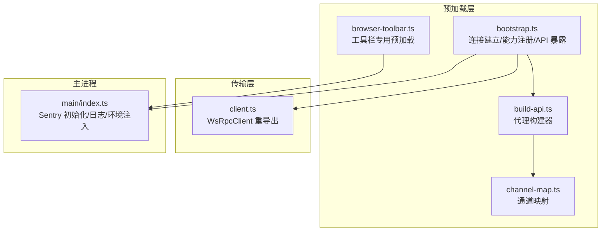
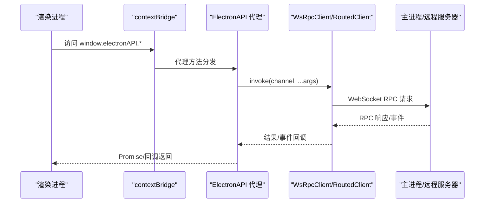
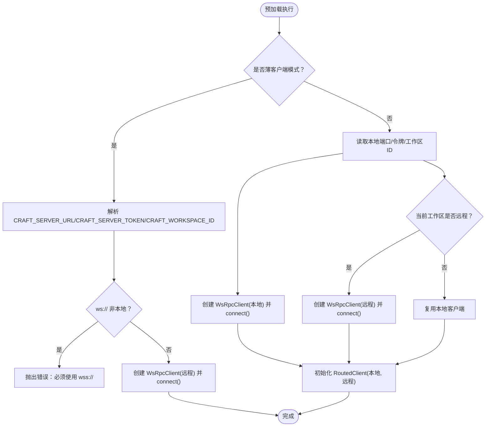
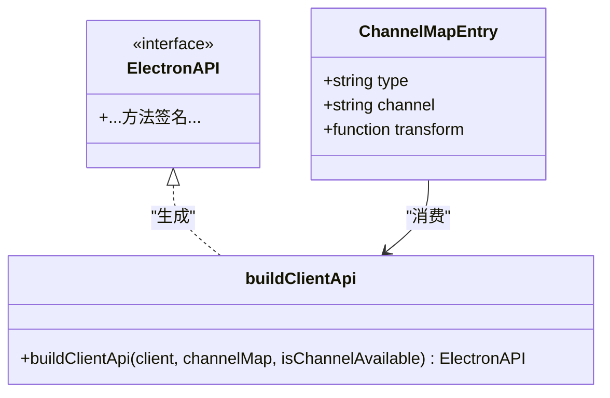
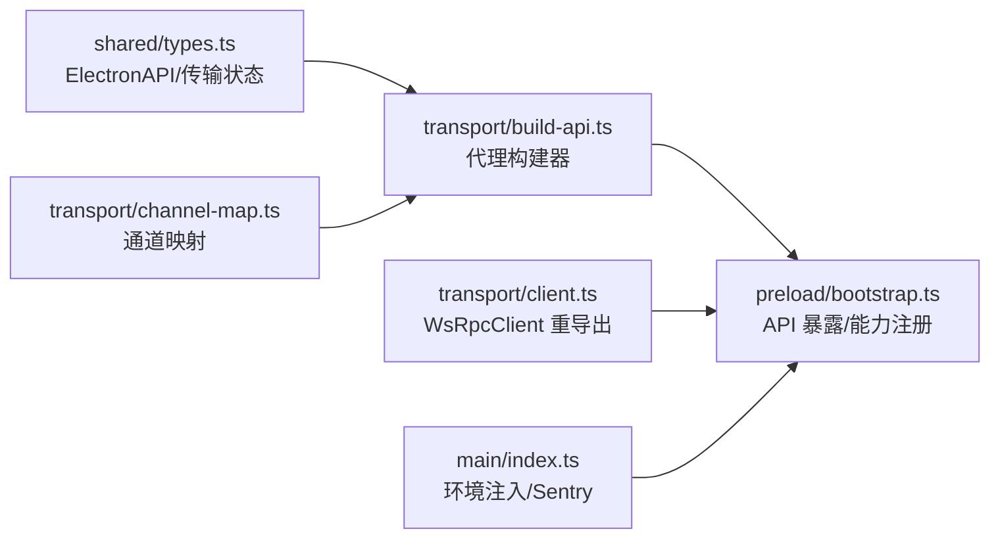

# 预加载脚本开发

<cite>
**本文引用的文件**
- [apps/electron/src/preload/bootstrap.ts](file://apps/electron/src/preload/bootstrap.ts)
- [apps/electron/src/preload/browser-toolbar.ts](file://apps/electron/src/preload/browser-toolbar.ts)
- [apps/electron/src/transport/build-api.ts](file://apps/electron/src/transport/build-api.ts)
- [apps/electron/src/transport/channel-map.ts](file://apps/electron/src/transport/channel-map.ts)
- [apps/electron/src/transport/client.ts](file://apps/electron/src/transport/client.ts)
- [apps/electron/src/shared/types.ts](file://apps/electron/src/shared/types.ts)
- [apps/electron/src/main/index.ts](file://apps/electron/src/main/index.ts)
</cite>

## 目录
1. [简介](#简介)
2. [项目结构](#项目结构)
3. [核心组件](#核心组件)
4. [架构总览](#架构总览)
5. [详细组件分析](#详细组件分析)
6. [依赖关系分析](#依赖关系分析)
7. [性能考量](#性能考量)
8. [故障排查指南](#故障排查指南)
9. [结论](#结论)
10. [附录](#附录)

## 简介
本文件面向需要理解或扩展预加载功能的开发者，系统性阐述该 Electron 应用中预加载脚本的安全上下文、API 暴露机制、上下文桥接模式，以及与主进程通信、渲染进程 API 访问、环境变量注入的具体实现。文档同时覆盖安全策略实施、API 权限控制、敏感信息保护，并提供安全最佳实践、调试方法与性能优化技巧。

## 项目结构
预加载脚本位于 Electron 主进程侧，负责在渲染进程可访问的全局命名空间中暴露受控 API，并通过 WebSocket RPC 客户端与主进程（或远程服务器）进行通信。关键模块包括：
- 预加载入口：负责连接建立、能力注册、API 构建与暴露
- 通道映射：定义 ElectronAPI 方法到 RPC 通道的单源映射
- 代理构建器：根据通道映射动态生成类型安全的客户端 API
- 浏览器工具栏专用预加载：最小化 API 暴露，仅面向工具栏窗口
- 类型与协议：统一 ElectronAPI 接口定义与传输状态模型

**图表来源**
- [apps/electron/src/preload/bootstrap.ts:1-439](file://apps/electron/src/preload/bootstrap.ts#L1-L439)
- [apps/electron/src/transport/build-api.ts:1-66](file://apps/electron/src/transport/build-api.ts#L1-L66)
- [apps/electron/src/transport/channel-map.ts:1-421](file://apps/electron/src/transport/channel-map.ts#L1-L421)
- [apps/electron/src/transport/client.ts:1-18](file://apps/electron/src/transport/client.ts#L1-L18)
- [apps/electron/src/main/index.ts:1-200](file://apps/electron/src/main/index.ts#L1-L200)

**章节来源**
- [apps/electron/src/preload/bootstrap.ts:1-439](file://apps/electron/src/preload/bootstrap.ts#L1-L439)
- [apps/electron/src/transport/channel-map.ts:1-421](file://apps/electron/src/transport/channel-map.ts#L1-L421)
- [apps/electron/src/transport/build-api.ts:1-66](file://apps/electron/src/transport/build-api.ts#L1-L66)
- [apps/electron/src/transport/client.ts:1-18](file://apps/electron/src/transport/client.ts#L1-L18)
- [apps/electron/src/main/index.ts:1-200](file://apps/electron/src/main/index.ts#L1-L200)

## 核心组件
- 连接与路由
  - 支持薄客户端模式（直接连接远程服务器）与本地-远程混合模式（按工作区路由）
  - 在本地模式下，使用本地 WsRpcClient；在远程模式下，按工作区配置切换到远程 WsRpcClient
- 能力注册
  - 注册客户端侧能力（如打开外部链接、打开路径、显示文件夹、确认对话框、文件对话框），由服务端调用
- API 构建与暴露
  - 基于通道映射构建 ElectronAPI 代理，支持嵌套命名空间（如 browserPane.*）
  - 通过 contextBridge 将 electronAPI 暴露到渲染进程全局命名空间
- 工具栏专用预加载
  - 仅暴露浏览器工具栏所需最小 API，避免过度暴露
- 传输状态与日志
  - 暴露传输连接状态查询与变更监听，记录远程连接状态到主进程日志

**章节来源**
- [apps/electron/src/preload/bootstrap.ts:55-154](file://apps/electron/src/preload/bootstrap.ts#L55-L154)
- [apps/electron/src/preload/bootstrap.ts:158-177](file://apps/electron/src/preload/bootstrap.ts#L158-L177)
- [apps/electron/src/preload/bootstrap.ts:183-186](file://apps/electron/src/preload/bootstrap.ts#L183-L186)
- [apps/electron/src/preload/bootstrap.ts:208-244](file://apps/electron/src/preload/bootstrap.ts#L208-L244)
- [apps/electron/src/preload/browser-toolbar.ts:1-54](file://apps/electron/src/preload/browser-toolbar.ts#L1-L54)
- [apps/electron/src/transport/build-api.ts:25-65](file://apps/electron/src/transport/build-api.ts#L25-L65)
- [apps/electron/src/transport/channel-map.ts:19-421](file://apps/electron/src/transport/channel-map.ts#L19-L421)

## 架构总览
预加载脚本采用“上下文桥接 + 通道映射 + 传输客户端”的三层设计：
- 上下文桥接：通过 contextBridge.exposeInMainWorld 将 API 暴露给渲染进程
- 通道映射：集中定义方法名到 RPC 通道的映射，确保类型安全与一致性
- 传输客户端：统一的 WsRpcClient 抽象，支持本地/远程模式与自动重连

**图表来源**
- [apps/electron/src/preload/bootstrap.ts:183-186](file://apps/electron/src/preload/bootstrap.ts#L183-L186)
- [apps/electron/src/transport/build-api.ts:25-65](file://apps/electron/src/transport/build-api.ts#L25-L65)
- [apps/electron/src/transport/client.ts:8-17](file://apps/electron/src/transport/client.ts#L8-L17)

## 详细组件分析

### 组件一：连接与路由（bootstrap.ts）
- 模式选择
  - 薄客户端模式：当存在 CRAFT_SERVER_URL 时，直接连接远程服务器，所有通道走远程
  - 混合模式：本地启动本地服务器，按工作区决定路由到本地或远程
- 安全策略
  - 对非本地 ws:// 连接强制要求 wss://，防止明文传输令牌
  - 通过环境变量注入（CRAFT_SERVER_URL、CRAFT_SERVER_TOKEN、CRAFT_WORKSPACE_ID）控制连接参数
- 能力注册
  - 注册客户端侧能力（打开外部链接、打开路径、显示文件夹、确认对话框、文件对话框）
- 传输状态
  - 暴露 getTransportConnectionState/onTransportConnectionStateChanged/reconnectTransport
  - 远程连接状态变化时，同步日志到主进程

**图表来源**
- [apps/electron/src/preload/bootstrap.ts:55-154](file://apps/electron/src/preload/bootstrap.ts#L55-L154)
- [apps/electron/src/preload/bootstrap.ts:65-77](file://apps/electron/src/preload/bootstrap.ts#L65-L77)

**章节来源**
- [apps/electron/src/preload/bootstrap.ts:55-154](file://apps/electron/src/preload/bootstrap.ts#L55-L154)
- [apps/electron/src/preload/bootstrap.ts:65-77](file://apps/electron/src/preload/bootstrap.ts#L65-L77)

### 组件二：API 构建与暴露（build-api.ts + channel-map.ts）
- 通道映射
  - 以 RPC_CHANNELS 为依据，集中维护方法名到通道的映射
  - 支持带转换器的 invoke（transform）与监听器（listener）
- 代理构建器
  - 动态生成 ElectronAPI 代理，支持点号分隔的嵌套命名空间
  - 提供 isChannelAvailable 用于 GUI 可用性判断
- 类型约束
  - ElectronAPI 接口定义了完整的方法签名，确保编译期类型安全

**图表来源**
- [apps/electron/src/transport/build-api.ts:15-65](file://apps/electron/src/transport/build-api.ts#L15-L65)
- [apps/electron/src/transport/channel-map.ts:11-17](file://apps/electron/src/transport/channel-map.ts#L11-L17)
- [apps/electron/src/shared/types.ts:216-704](file://apps/electron/src/shared/types.ts#L216-L704)

**章节来源**
- [apps/electron/src/transport/build-api.ts:25-65](file://apps/electron/src/transport/build-api.ts#L25-L65)
- [apps/electron/src/transport/channel-map.ts:19-421](file://apps/electron/src/transport/channel-map.ts#L19-L421)
- [apps/electron/src/shared/types.ts:216-704](file://apps/electron/src/shared/types.ts#L216-L704)

### 组件三：工具栏专用预加载（browser-toolbar.ts）
- 作用域限定
  - 仅暴露浏览器工具栏窗口所需的导航与状态更新 API
  - 使用独立的 IPC 通道集，避免污染全局 API
- 实现要点
  - 通过 contextBridge.exposeInMainWorld 暴露 browserToolbar 对象
  - 通过 ipcRenderer.invoke/监听通道与主进程交互

**章节来源**
- [apps/electron/src/preload/browser-toolbar.ts:1-54](file://apps/electron/src/preload/browser-toolbar.ts#L1-L54)

### 组件四：传输客户端与状态（client.ts + types.ts）
- 客户端抽象
  - 通过重导出 WsRpcClient，统一本地/远程模式下的 RPC 行为
- 传输状态模型
  - 定义 TransportMode、TransportConnectionStatus、TransportConnectionError、TransportCloseInfo、TransportConnectionState 等
  - 预加载层通过 onConnectionStateChanged 监听状态变化并上报主进程

**章节来源**
- [apps/electron/src/transport/client.ts:8-17](file://apps/electron/src/transport/client.ts#L8-L17)
- [apps/electron/src/shared/types.ts:130-169](file://apps/electron/src/shared/types.ts#L130-L169)
- [apps/electron/src/preload/bootstrap.ts:208-244](file://apps/electron/src/preload/bootstrap.ts#L208-L244)

## 依赖关系分析
- 预加载脚本依赖
  - 通道映射：集中管理方法到通道的映射，保证一致性
  - 传输客户端：统一 RPC 抽象，支持本地/远程与自动重连
  - 类型定义：ElectronAPI 接口确保编译期类型安全
- 主进程集成
  - 环境变量注入：通过主进程设置 CRAFT_* 系列变量，预加载脚本据此决定连接行为
  - 错误追踪：Sentry 初始化与敏感数据脱敏，保障日志安全

**图表来源**
- [apps/electron/src/shared/types.ts:216-704](file://apps/electron/src/shared/types.ts#L216-L704)
- [apps/electron/src/transport/build-api.ts:25-65](file://apps/electron/src/transport/build-api.ts#L25-L65)
- [apps/electron/src/transport/channel-map.ts:19-421](file://apps/electron/src/transport/channel-map.ts#L19-L421)
- [apps/electron/src/transport/client.ts:8-17](file://apps/electron/src/transport/client.ts#L8-L17)
- [apps/electron/src/preload/bootstrap.ts:1-439](file://apps/electron/src/preload/bootstrap.ts#L1-L439)
- [apps/electron/src/main/index.ts:1-200](file://apps/electron/src/main/index.ts#L1-L200)

**章节来源**
- [apps/electron/src/shared/types.ts:216-704](file://apps/electron/src/shared/types.ts#L216-L704)
- [apps/electron/src/transport/build-api.ts:25-65](file://apps/electron/src/transport/build-api.ts#L25-L65)
- [apps/electron/src/transport/channel-map.ts:19-421](file://apps/electron/src/transport/channel-map.ts#L19-L421)
- [apps/electron/src/transport/client.ts:8-17](file://apps/electron/src/transport/client.ts#L8-L17)
- [apps/electron/src/preload/bootstrap.ts:1-439](file://apps/electron/src/preload/bootstrap.ts#L1-L439)
- [apps/electron/src/main/index.ts:1-200](file://apps/electron/src/main/index.ts#L1-L200)

## 性能考量
- 连接建立
  - 预加载脚本在渲染进程初始化前即建立连接，确保渲染进程首次调用 API 时连接已就绪
- 通道映射与代理
  - 通过集中映射减少重复样板代码，提升维护效率与运行时性能
- 自动重连
  - 传输客户端支持自动重连与退避策略，降低网络抖动对用户体验的影响
- 日志与诊断
  - 远程连接状态日志同步至主进程，便于快速定位问题

[本节为通用性能建议，不直接分析具体文件]

## 故障排查指南
- 连接失败
  - 检查 CRAFT_SERVER_URL 是否为 wss://（非本地）
  - 查看主进程日志中的传输状态上报，定位错误原因（认证、协议、超时、网络、服务器、未知）
- OAuth 流程异常
  - 确认回调服务器端口与路径正确，检查服务端 flow 存储与取消逻辑
- 能力调用失败
  - 确认服务端已注册对应能力（如打开外部链接、打开路径等）
- 环境变量问题
  - 确认主进程已注入必要的 CRAFT_* 环境变量，预加载脚本据此决定连接行为

**章节来源**
- [apps/electron/src/preload/bootstrap.ts:65-77](file://apps/electron/src/preload/bootstrap.ts#L65-L77)
- [apps/electron/src/preload/bootstrap.ts:208-244](file://apps/electron/src/preload/bootstrap.ts#L208-L244)
- [apps/electron/src/main/index.ts:1-200](file://apps/electron/src/main/index.ts#L1-L200)

## 结论
该预加载脚本通过“上下文桥接 + 通道映射 + 传输客户端”的设计，在保证类型安全与一致性的前提下，实现了灵活的连接模式与最小化的 API 暴露。结合主进程的环境注入与安全策略（如 TLS 强制、Sentry 敏感数据脱敏），有效提升了系统的安全性与可观测性。建议在扩展新能力时遵循现有模式，保持通道映射集中管理与类型接口一致。

[本节为总结性内容，不直接分析具体文件]

## 附录

### 安全最佳实践
- 强制 TLS：非本地 ws:// 必须升级为 wss://，防止令牌明文泄露
- 最小权限：仅暴露必要 API，工具栏等特定窗口使用专用预加载
- 敏感数据脱敏：日志与错误上报中避免泄露令牌、密钥、凭据等
- 环境变量注入：通过主进程集中注入，避免在渲染进程直接硬编码敏感信息

**章节来源**
- [apps/electron/src/preload/bootstrap.ts:65-77](file://apps/electron/src/preload/bootstrap.ts#L65-L77)
- [apps/electron/src/main/index.ts:28-58](file://apps/electron/src/main/index.ts#L28-L58)

### 调试方法
- 启用调试：开发模式下开启调试与性能统计
- 观察传输状态：使用 getTransportConnectionState/onTransportConnectionStateChanged 获取实时状态
- 日志上报：远程连接状态变化会同步到主进程日志，便于定位问题

**章节来源**
- [apps/electron/src/main/index.ts:112-117](file://apps/electron/src/main/index.ts#L112-L117)
- [apps/electron/src/preload/bootstrap.ts:208-244](file://apps/electron/src/preload/bootstrap.ts#L208-L244)