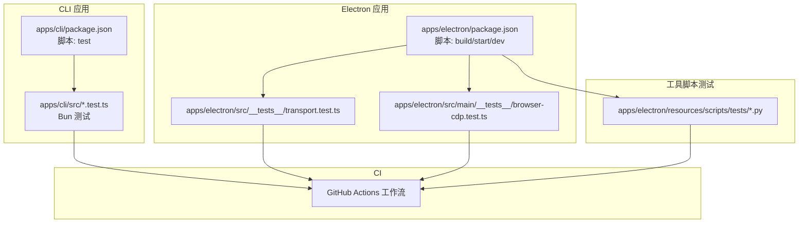
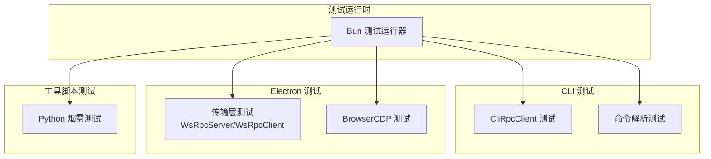
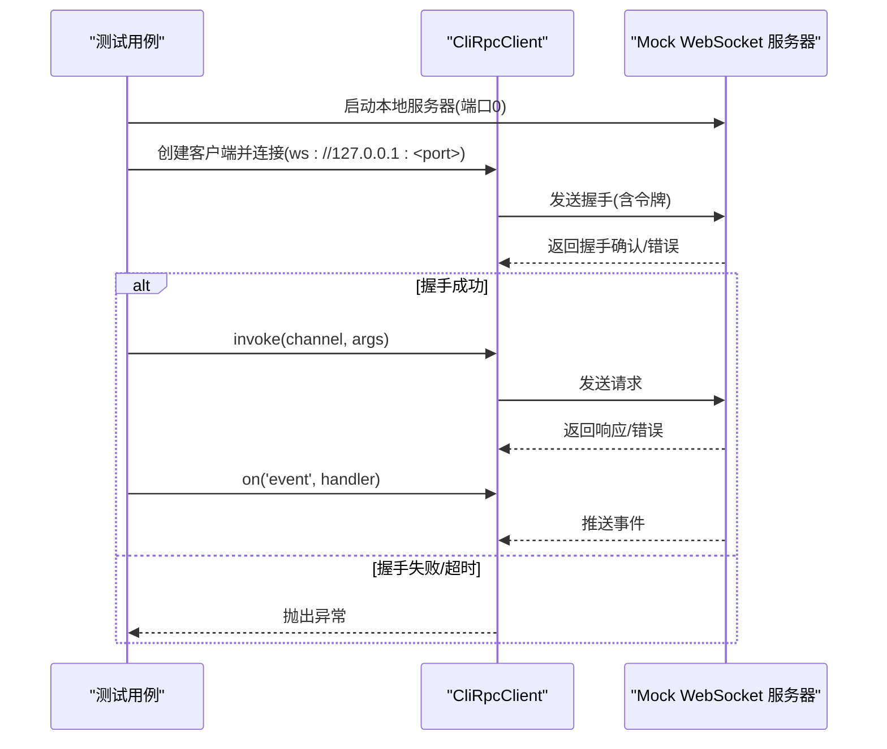
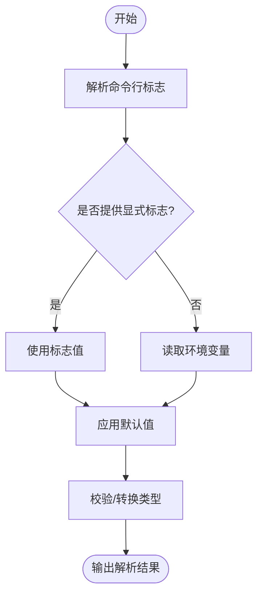
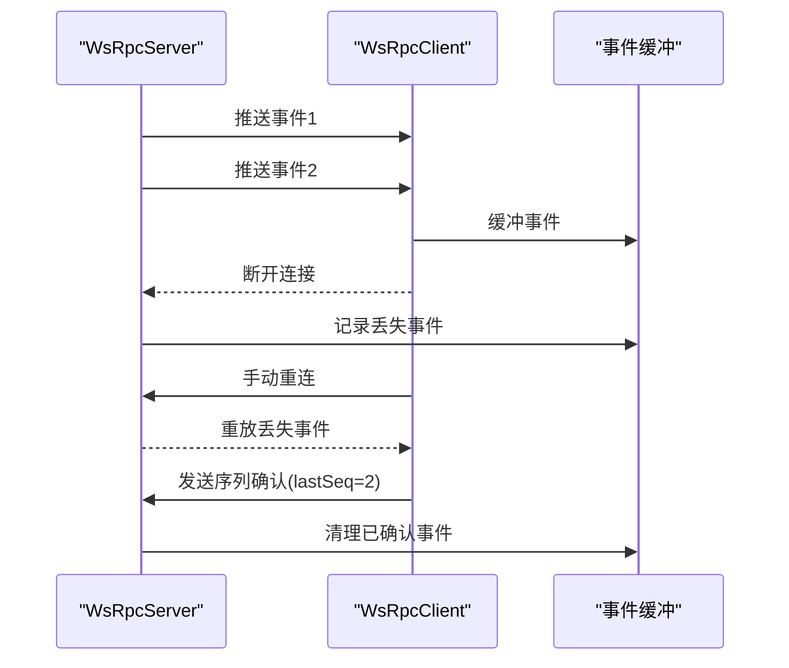
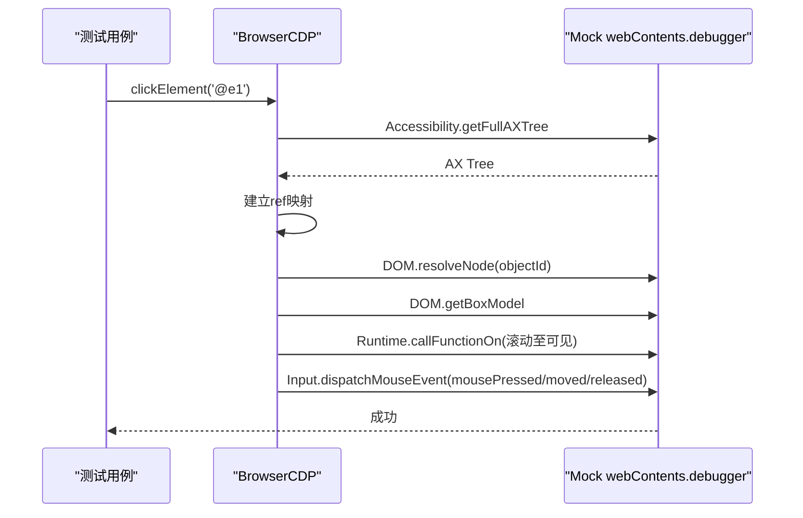
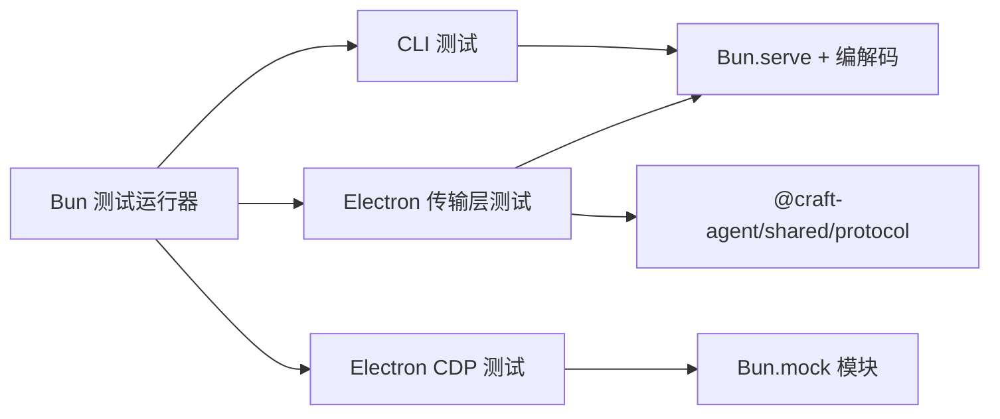

# 测试和质量保证

<cite>
**本文引用的文件**   
- [apps/cli/package.json](file://apps/cli/package.json)
- [apps/cli/src/client.test.ts](file://apps/cli/src/client.test.ts)
- [apps/cli/src/commands.test.ts](file://apps/cli/src/commands.test.ts)
- [apps/electron/package.json](file://apps/electron/package.json)
- [apps/electron/src/__tests__/transport.test.ts](file://apps/electron/src/__tests__/transport.test.ts)
- [apps/electron/src/main/__tests__/browser-cdp.test.ts](file://apps/electron/src/main/__tests__/browser-cdp.test.ts)
- [.github/workflows](file://.github/workflows)
</cite>

## 目录
1. [简介](#简介)
2. [项目结构](#项目结构)
3. [核心组件](#核心组件)
4. [架构总览](#架构总览)
5. [详细组件分析](#详细组件分析)
6. [依赖关系分析](#依赖关系分析)
7. [性能考虑](#性能考虑)
8. [故障排查指南](#故障排查指南)
9. [结论](#结论)
10. [附录](#附录)

## 简介
本文件面向需要确保代码质量和稳定性的开发团队，系统化梳理本仓库的测试与质量保证体系，覆盖单元测试框架、集成测试策略、端到端测试流程、覆盖率要求、测试数据管理、模拟环境配置、性能测试方法、回归测试自动化、持续集成配置、最佳实践、调试技巧、测试报告生成以及质量门禁设置。内容以仓库现有实现为基础，结合可扩展建议，帮助团队建立可持续的质量保障闭环。

## 项目结构
本仓库采用多包（monorepo）结构，测试主要分布在以下位置：
- CLI 应用：apps/cli 下的 Bun 测试套件，覆盖客户端连接、握手、请求响应、事件推送、TLS 场景等。
- Electron 应用：apps/electron 下的 Bun 测试套件，覆盖传输层（WsRpcServer/WsRpcClient）、浏览器 CDP 工具链、主进程功能等。
- Python 脚本测试：apps/electron/resources/scripts/tests 下的工具烟雾测试脚本，用于验证桌面工具链的端到端可用性。
- 持续集成：.github/workflows 下的工作流定义，驱动自动化测试与构建。

图表来源
- [apps/cli/package.json:11-15](file://apps/cli/package.json#L11-L15)
- [apps/electron/package.json:17-36](file://apps/electron/package.json#L17-L36)
- [apps/cli/src/client.test.ts:1-410](file://apps/cli/src/client.test.ts#L1-L410)
- [apps/cli/src/commands.test.ts:1-404](file://apps/cli/src/commands.test.ts#L1-L404)
- [apps/electron/src/__tests__/transport.test.ts:1-869](file://apps/electron/src/__tests__/transport.test.ts#L1-L869)
- [apps/electron/src/main/__tests__/browser-cdp.test.ts:1-488](file://apps/electron/src/main/__tests__/browser-cdp.test.ts#L1-L488)

章节来源
- [apps/cli/package.json:11-15](file://apps/cli/package.json#L11-L15)
- [apps/electron/package.json:17-36](file://apps/electron/package.json#L17-L36)

## 核心组件
- 单元测试框架
  - CLI 应用使用 Bun 测试运行器，覆盖客户端连接、握手、请求/响应、错误处理、TLS、事件订阅等场景。
  - Electron 应用同样使用 Bun 测试运行器，覆盖传输层（服务端/客户端）、可靠投递、认证、连接状态、边缘情况、双向 RPC 等。
- 集成测试策略
  - 通过在测试中启动本地 WebSocket 服务器或使用真实 Electron 进程，对跨模块交互进行集成验证。
- 端到端测试流程
  - Python 烟雾测试脚本对桌面工具链进行端到端验证，覆盖文档、表格、PDF、图片、日历等工具的典型操作路径。
- 覆盖率与报告
  - 当前未发现内置覆盖率统计配置；建议在 CI 中启用覆盖率收集与报告生成。
- 测试数据管理
  - 使用内存中的 mock 服务器、临时端口、随机 ID 与最小化外部依赖，确保测试隔离与可重复性。
- 模拟环境配置
  - 通过环境变量注入参数（如 TLS CA、服务器地址、令牌），并通过 Bun 的模块 mock 能力替换日志等依赖。
- 性能测试方法
  - 在传输层测试中包含并发请求、二进制负载、事件缓冲上限等场景，可作为性能基准参考。
- 回归测试自动化
  - 建议在 CI 中固定运行所有测试套件，并对关键路径增加稳定性检查。
- 持续集成配置
  - 通过 GitHub Actions 工作流触发测试与构建任务，建议补充覆盖率阈值与报告输出。

章节来源
- [apps/cli/src/client.test.ts:1-410](file://apps/cli/src/client.test.ts#L1-L410)
- [apps/cli/src/commands.test.ts:1-404](file://apps/cli/src/commands.test.ts#L1-L404)
- [apps/electron/src/__tests__/transport.test.ts:1-869](file://apps/electron/src/__tests__/transport.test.ts#L1-L869)
- [apps/electron/src/main/__tests__/browser-cdp.test.ts:1-488](file://apps/electron/src/main/__tests__/browser-cdp.test.ts#L1-L488)

## 架构总览
下图展示测试体系在不同应用中的分布与交互：

图表来源
- [apps/cli/src/client.test.ts:1-410](file://apps/cli/src/client.test.ts#L1-L410)
- [apps/cli/src/commands.test.ts:1-404](file://apps/cli/src/commands.test.ts#L1-L404)
- [apps/electron/src/__tests__/transport.test.ts:1-869](file://apps/electron/src/__tests__/transport.test.ts#L1-L869)
- [apps/electron/src/main/__tests__/browser-cdp.test.ts:1-488](file://apps/electron/src/main/__tests__/browser-cdp.test.ts#L1-L488)

## 详细组件分析

### CLI 客户端测试（Bun）
- 覆盖点
  - 握手与认证：校验握手消息、令牌传递、鉴权失败与超时处理。
  - 请求/响应：参数透传、结果回显、错误返回码。
  - 超时控制：连接超时、请求超时、销毁后拒绝调用。
  - 事件推送：订阅/退订、事件去重、断线重连后的事件重放。
  - TLS 支持：自签名证书生成与 wss 连接。
- 关键流程（握手+请求+事件）

图表来源
- [apps/cli/src/client.test.ts:171-384](file://apps/cli/src/client.test.ts#L171-L384)

章节来源
- [apps/cli/src/client.test.ts:1-410](file://apps/cli/src/client.test.ts#L1-L410)

### CLI 命令解析测试（Bun）
- 覆盖点
  - 参数解析：URL、令牌、工作区、超时、JSON 输出、TLS CA。
  - 环境变量优先级：CRAFT_SERVER_URL、CRAFT_SERVER_TOKEN、CRAFT_TLS_CA。
  - 子命令与运行参数：session、run 的标志位与默认值。
  - 提供商密钥解析与 LLM 连接策略。
  - 服务器健康检查步骤清单：按生命周期顺序组织的验证步骤。
- 关键流程（参数解析）

图表来源
- [apps/cli/src/commands.test.ts:8-233](file://apps/cli/src/commands.test.ts#L8-L233)

章节来源
- [apps/cli/src/commands.test.ts:1-404](file://apps/cli/src/commands.test.ts#L1-L404)

### Electron 传输层测试（Bun）
- 覆盖点
  - 握手：协议版本缺失被拒绝。
  - RPC：简单调用、参数透传、上下文携带、未知通道、处理器错误、自定义错误码、并发独立解决、二进制负载往返。
  - 推送事件：全局/工作区目标、退订、二进制事件参数。
  - 可靠投递：手动重连保留身份、重放丢失事件、缓冲上限导致“陈旧”重连、序列确认清理缓冲、安全发送。
  - 认证：requireAuth 开关、有效/无效令牌、关闭连接时的错误分类。
  - 连接状态：连接成功、鉴权失败、自动重连、握手失败的关闭码记录。
  - 边界情况：握手完成前排队调用、无显式 connect 自动发起、断开后调用抛错、void/null 返回值处理、重复注册处理器。
  - 双向 RPC：服务端调用客户端能力、缺失能力立即返回、断开客户端立即返回。
- 关键流程（可靠投递与重连）

图表来源
- [apps/electron/src/__tests__/transport.test.ts:365-532](file://apps/electron/src/__tests__/transport.test.ts#L365-L532)

章节来源
- [apps/electron/src/__tests__/transport.test.ts:1-869](file://apps/electron/src/__tests__/transport.test.ts#L1-L869)

### Electron 浏览器 CDP 工具测试（Bun）
- 覆盖点
  - 生命周期：首次调用自动附加、重复调用跳过、已附加错误容错、仅注册一次 detach 监听。
  - 可访问性快照：AX Tree 解析、节点引用稳定、过滤规则（交互/内容）、节点上限、角色大小写归一化、回退选择策略。
  - 元素操作：点击（resolveNode/DOM.getBoxModel/Runtime.callFunctionOn/Input.dispatchMouseEvent）、输入（聚焦/清空/按键）、选项选择（设置值与事件）、拖拽（按下/移动/释放）。
  - 安全分离：即使中间步骤失败也尝试释放鼠标按键。
  - 模块 mock：通过 Bun.mock 替换日志模块，避免副作用。
- 关键流程（点击元素）

图表来源
- [apps/electron/src/main/__tests__/browser-cdp.test.ts:300-344](file://apps/electron/src/main/__tests__/browser-cdp.test.ts#L300-L344)

章节来源
- [apps/electron/src/main/__tests__/browser-cdp.test.ts:1-488](file://apps/electron/src/main/__tests__/browser-cdp.test.ts#L1-L488)

### Python 工具烟雾测试（端到端）
- 覆盖点
  - 文档差异、docx、pdf、图片、日历、xlsx、pptx、markitdown 等工具的典型操作路径。
- 建议
  - 在 CI 中以 headless 或最小化环境运行，确保工具链可用性与回归稳定性。

章节来源
- [apps/electron/resources/scripts/tests/test_docx_tool_smoke.py](file://apps/electron/resources/scripts/tests/test_docx_tool_smoke.py)
- [apps/electron/resources/scripts/tests/test_pdf_tool_smoke.py](file://apps/electron/resources/scripts/tests/test_pdf_tool_smoke.py)
- [apps/electron/resources/scripts/tests/test_markitdown_smoke.py](file://apps/electron/resources/scripts/tests/test_markitdown_smoke.py)

## 依赖关系分析
- 测试运行器
  - CLI 与 Electron 均使用 Bun 测试运行器，具备快速启动与内建断言能力。
- 外部依赖
  - CLI 测试依赖 WebSocket 服务器（Bun.serve）与消息编解码工具。
  - Electron 传输层测试依赖 ws 库与内部协议编解码。
  - CDP 测试依赖 Electron webContents.debugger 的 mock。
- 模块间耦合
  - 测试通过最小接口与 mock 降低耦合，提升可维护性。
- 潜在循环依赖
  - 测试文件位于各自应用目录的 __tests__ 下，遵循分层组织，未见循环依赖迹象。

图表来源
- [apps/cli/src/client.test.ts:1-410](file://apps/cli/src/client.test.ts#L1-L410)
- [apps/electron/src/__tests__/transport.test.ts:1-869](file://apps/electron/src/__tests__/transport.test.ts#L1-L869)
- [apps/electron/src/main/__tests__/browser-cdp.test.ts:1-488](file://apps/electron/src/main/__tests__/browser-cdp.test.ts#L1-L488)

章节来源
- [apps/cli/src/client.test.ts:1-410](file://apps/cli/src/client.test.ts#L1-L410)
- [apps/electron/src/__tests__/transport.test.ts:1-869](file://apps/electron/src/__tests__/transport.test.ts#L1-L869)
- [apps/electron/src/main/__tests__/browser-cdp.test.ts:1-488](file://apps/electron/src/main/__tests__/browser-cdp.test.ts#L1-L488)

## 性能考虑
- 并发与吞吐
  - 传输层测试包含并发请求独立解决与二进制负载往返，可作为性能基线参考。
- 事件缓冲与重放
  - 事件缓冲上限与序列确认机制影响重连时的重放行为与内存占用。
- 超时与重连
  - 合理设置连接/请求超时与最大重连延迟，避免资源泄露与抖动。
- 建议
  - 在 CI 中引入性能回归检测（如关键测试耗时阈值），并结合火焰图定位热点。

## 故障排查指南
- 常见问题
  - 握手失败：检查令牌、协议版本、服务器地址与 TLS 配置。
  - 请求超时：检查网络连通性、服务器负载与超时参数。
  - 事件未达：确认目标工作区、监听注册时机与退订逻辑。
  - CDP 操作失败：确认页面可交互、节点引用稳定、命令序列正确。
- 调试技巧
  - 使用最小化 mock 与固定端口，便于复现与定位。
  - 在关键路径添加日志（或使用 Bun 的调试模式），观察序列号与缓冲状态。
  - 对并发场景使用断言确保顺序与完整性。
- 质量门禁
  - 建议在 CI 中设置失败即停、失败重试、覆盖率阈值与报告上传。

章节来源
- [apps/cli/src/client.test.ts:192-204](file://apps/cli/src/client.test.ts#L192-L204)
- [apps/electron/src/__tests__/transport.test.ts:538-595](file://apps/electron/src/__tests__/transport.test.ts#L538-L595)
- [apps/electron/src/main/__tests__/browser-cdp.test.ts:447-465](file://apps/electron/src/main/__tests__/browser-cdp.test.ts#L447-L465)

## 结论
本仓库已建立起完善的单元与集成测试体系，覆盖 CLI 客户端、Electron 传输层与浏览器 CDP 工具链，并通过 Python 脚本进行端到端验证。建议在现有基础上补充覆盖率统计、报告生成与质量门禁，完善 CI 中的稳定性与性能回归检测，形成可持续的质量保障闭环。

## 附录

### 测试与质量保证最佳实践
- 测试命名与组织
  - 使用语义化命名与分层目录，便于定位与维护。
- Mock 与隔离
  - 尽可能使用内存服务器与最小化外部依赖，避免跨进程/网络耦合。
- 超时与重试
  - 为网络相关测试设置合理超时与重试策略，避免 flaky。
- 覆盖率与报告
  - 引入覆盖率统计与报告上传，设定阈值门禁。
- 回归与冒烟
  - 将关键路径纳入回归矩阵，Python 烟雾测试作为端到端守卫。

### 测试用例编写指南
- 分层设计
  - 单元：纯函数与小对象，关注边界与错误分支。
  - 集成：模块间接口，关注握手、序列、事件与错误传播。
  - 端到端：工具链与用户场景，关注可用性与一致性。
- 断言策略
  - 使用明确的断言与错误码，避免模糊匹配。
  - 对并发与异步场景，使用等待条件与时间片断言。

### 持续集成配置建议
- 工作流触发
  - 推荐在 pull_request 与 main 分支触发测试与构建。
- 步骤建议
  - 安装依赖、类型检查、单元/集成测试、覆盖率统计、报告上传、工件归档。
- 质量门禁
  - 设置失败即停、覆盖率阈值、关键测试必须通过。