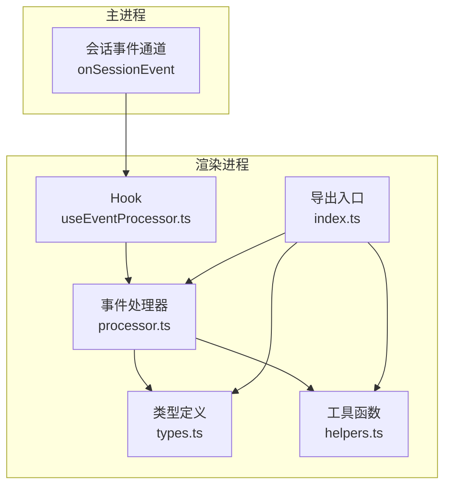
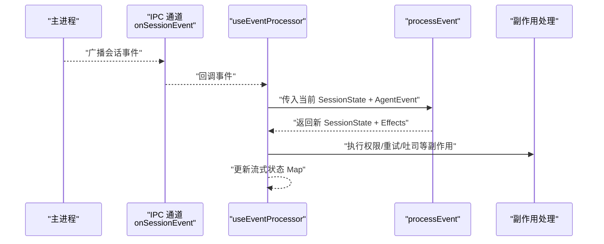
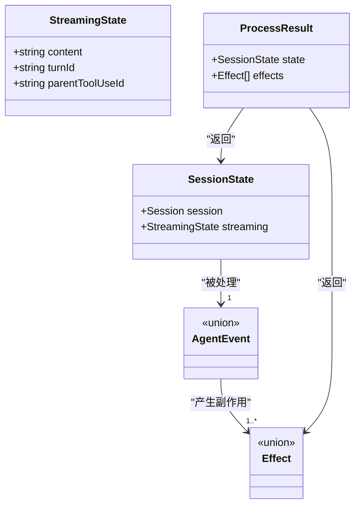
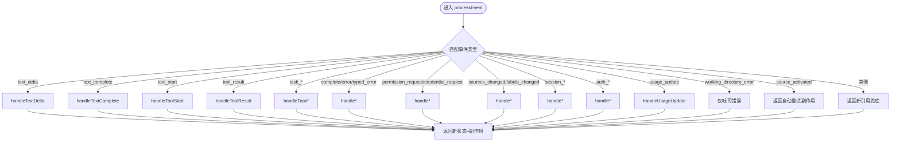
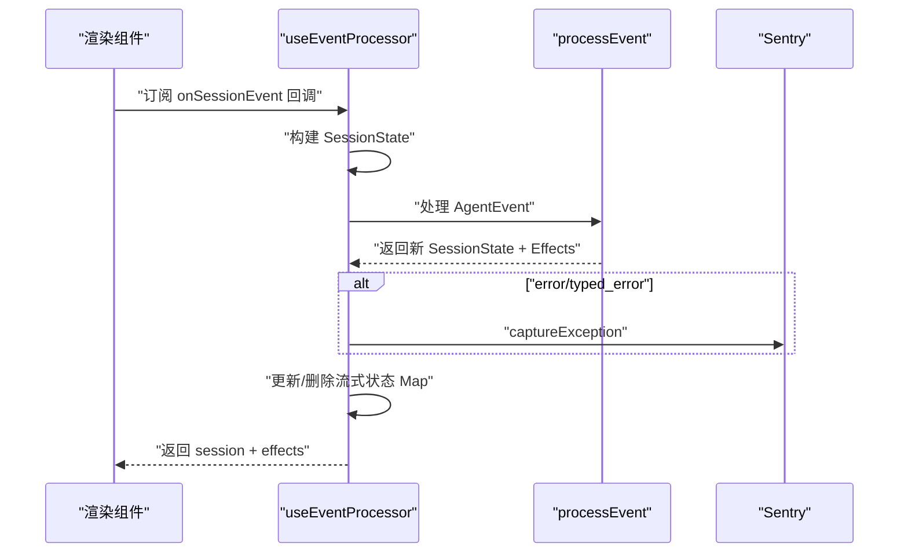
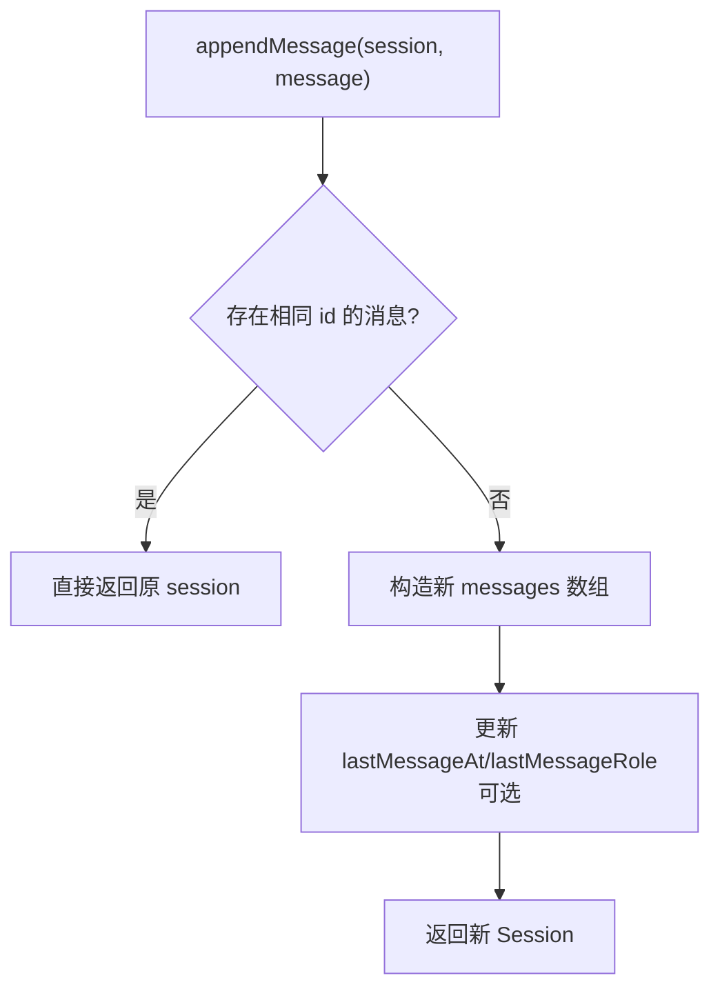
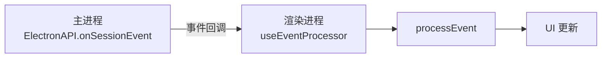
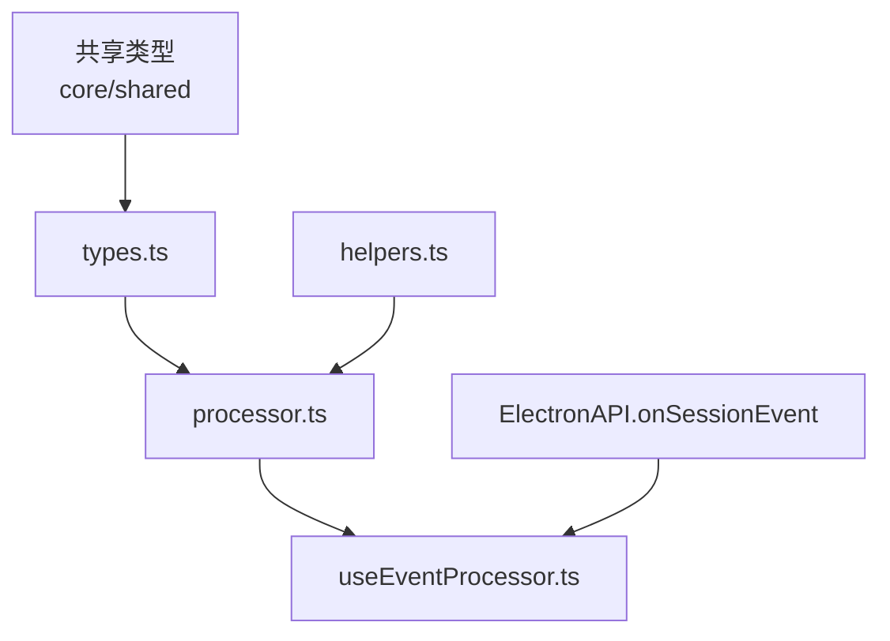
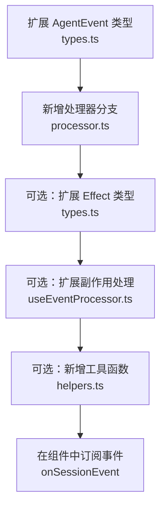

# 事件处理器

<cite>
**本文引用的文件**
- [apps/electron/src/renderer/event-processor/index.ts](file://apps/electron/src/renderer/event-processor/index.ts)
- [apps/electron/src/renderer/event-processor/processor.ts](file://apps/electron/src/renderer/event-processor/processor.ts)
- [apps/electron/src/renderer/event-processor/useEventProcessor.ts](file://apps/electron/src/renderer/event-processor/useEventProcessor.ts)
- [apps/electron/src/renderer/event-processor/helpers.ts](file://apps/electron/src/renderer/event-processor/helpers.ts)
- [apps/electron/src/renderer/event-processor/types.ts](file://apps/electron/src/renderer/event-processor/types.ts)
- [apps/electron/src/shared/types.ts](file://apps/electron/src/shared/types.ts)
- [packages/core/src/types/message.ts](file://packages/core/src/types/message.ts)
</cite>

## 目录
1. [简介](#简介)
2. [项目结构](#项目结构)
3. [核心组件](#核心组件)
4. [架构总览](#架构总览)
5. [详细组件分析](#详细组件分析)
6. [依赖关系分析](#依赖关系分析)
7. [性能考量](#性能考量)
8. [故障排查指南](#故障排查指南)
9. [结论](#结论)
10. [附录：注册自定义事件处理器示例](#附录注册自定义事件处理器示例)

## 简介
本文件系统性阐述事件处理器的设计与实现，覆盖以下主题：
- 事件订阅机制：通过 Electron 主进程提供的会话事件通道统一接收事件，渲染进程使用事件处理器集中处理。
- 处理器注册流程：将事件类型映射到纯函数处理器，统一入口 processEvent 负责分发。
- 异步事件处理模式：基于纯函数与副作用分离（effects），确保状态更新可预测且无竞态。
- 与 Electron 主进程通信：通过 onSessionEvent 订阅事件，再由 useEventProcessor 驱动事件处理器。
- 错误处理与重试：捕获 typed_error/error 并上报 Sentry；对 source_activated 等场景触发自动重试。
- 批量处理、去重与状态同步：按消息 ID 查找与更新，避免位置依赖；去重通过消息 ID 检测；状态同步通过新引用保证原子更新。
- 性能优化与内存管理：使用 Map 维护每会话流式状态，避免 React 状态抖动；纯函数减少不必要的重渲染。
- 调试工具：提供获取/清理流式状态的辅助接口，便于测试与调试。

## 项目结构
事件处理器位于渲染进程的 event-processor 子模块，核心文件如下：
- types.ts：定义事件类型、状态类型与副作用类型
- processor.ts：统一的事件处理入口，按类型分发到具体处理器
- useEventProcessor.ts：React Hook，负责订阅主进程事件并驱动处理器
- helpers.ts：消息查找与更新的纯函数工具
- index.ts：导出处理器与类型，供上层组件使用

**图表来源**
- [apps/electron/src/renderer/event-processor/processor.ts:62-229](file://apps/electron/src/renderer/event-processor/processor.ts#L62-L229)
- [apps/electron/src/renderer/event-processor/useEventProcessor.ts:78-130](file://apps/electron/src/renderer/event-processor/useEventProcessor.ts#L78-L130)
- [apps/electron/src/renderer/event-processor/types.ts:13-537](file://apps/electron/src/renderer/event-processor/types.ts#L13-L537)
- [apps/electron/src/renderer/event-processor/helpers.ts:1-172](file://apps/electron/src/renderer/event-processor/helpers.ts#L1-L172)
- [apps/electron/src/renderer/event-processor/index.ts:1-40](file://apps/electron/src/renderer/event-processor/index.ts#L1-L40)

**章节来源**
- [apps/electron/src/renderer/event-processor/index.ts:1-40](file://apps/electron/src/renderer/event-processor/index.ts#L1-L40)
- [apps/electron/src/renderer/event-processor/processor.ts:1-230](file://apps/electron/src/renderer/event-processor/processor.ts#L1-L230)
- [apps/electron/src/renderer/event-processor/useEventProcessor.ts:1-131](file://apps/electron/src/renderer/event-processor/useEventProcessor.ts#L1-L131)
- [apps/electron/src/renderer/event-processor/helpers.ts:1-172](file://apps/electron/src/renderer/event-processor/helpers.ts#L1-L172)
- [apps/electron/src/renderer/event-processor/types.ts:1-538](file://apps/electron/src/renderer/event-processor/types.ts#L1-L538)

## 核心组件
- 事件类型与状态
  - SessionState：会话状态 + 流式状态
  - AgentEvent：所有事件类型的联合
  - Effect：副作用清单（权限请求、自动重试、恢复输入、吐司提示等）
- 处理器入口
  - processEvent：纯函数，根据事件类型调用对应处理器，返回新状态与副作用
- Hook
  - useEventProcessor：订阅主进程事件，维护每会话流式状态，执行副作用（如错误上报）
- 工具函数
  - 基于消息 ID 的查找与更新：findMessageByTurnId、findStreamingMessage、findAssistantMessage、findToolMessage
  - 消息增删改：appendMessage、insertMessageAt、updateMessageAt
  - 创建空会话：createEmptySession
  - 去重：appendMessage 内部按消息 ID 去重

**章节来源**
- [apps/electron/src/renderer/event-processor/types.ts:13-537](file://apps/electron/src/renderer/event-processor/types.ts#L13-L537)
- [apps/electron/src/renderer/event-processor/processor.ts:62-229](file://apps/electron/src/renderer/event-processor/processor.ts#L62-L229)
- [apps/electron/src/renderer/event-processor/useEventProcessor.ts:78-130](file://apps/electron/src/renderer/event-processor/useEventProcessor.ts#L78-L130)
- [apps/electron/src/renderer/event-processor/helpers.ts:19-171](file://apps/electron/src/renderer/event-processor/helpers.ts#L19-L171)

## 架构总览
事件从主进程经 IPC 到达渲染进程，由 Hook 订阅后交由处理器统一处理。处理器为纯函数，保证状态变更可预测；副作用通过 Effect 分离并在 Hook 中执行，避免污染纯函数。

**图表来源**
- [apps/electron/src/shared/types.ts:297-299](file://apps/electron/src/shared/types.ts#L297-L299)
- [apps/electron/src/renderer/event-processor/useEventProcessor.ts:82-115](file://apps/electron/src/renderer/event-processor/useEventProcessor.ts#L82-L115)
- [apps/electron/src/renderer/event-processor/processor.ts:62-229](file://apps/electron/src/renderer/event-processor/processor.ts#L62-L229)

## 详细组件分析

### 组件一：事件类型与状态模型
- StreamingState：记录当前正在流式的文本内容及关联的 turnId、父工具调用 ID
- SessionState：组合当前 Session 与 StreamingState
- AgentEvent：覆盖文本、工具、任务、权限、认证、标题、工作目录、连接、标签、归档/标记、使用统计等事件
- Effect：权限请求、凭据请求、生成标题、权限模式变更、自动重试、恢复输入、吐司错误

**图表来源**
- [apps/electron/src/renderer/event-processor/types.ts:13-537](file://apps/electron/src/renderer/event-processor/types.ts#L13-L537)

**章节来源**
- [apps/electron/src/renderer/event-processor/types.ts:13-537](file://apps/electron/src/renderer/event-processor/types.ts#L13-L537)

### 组件二：处理器入口（processEvent）
- 设计要点
  - 纯函数：无副作用，总是返回新引用，保证原子同步
  - 单一更新路径：所有事件通过 switch 分发到具体处理器
  - 完整覆盖：包含文本、工具、任务、权限、认证、标题、工作目录、连接、标签、归档/标记、使用统计等事件
  - 未知事件兜底：返回新引用以触发 UI 同步
- 特殊事件
  - working_directory_error：仅吐司错误，不改变状态
  - source_activated：触发自动重试副作用，携带原始消息与源标识

**图表来源**
- [apps/electron/src/renderer/event-processor/processor.ts:62-229](file://apps/electron/src/renderer/event-processor/processor.ts#L62-L229)

**章节来源**
- [apps/electron/src/renderer/event-processor/processor.ts:62-229](file://apps/electron/src/renderer/event-processor/processor.ts#L62-L229)

### 组件三：Hook（useEventProcessor）
- 职责
  - 订阅主进程 onSessionEvent，构建 SessionState（含流式状态）
  - 调用 processEvent 获取新状态与副作用
  - 在纯函数之外执行副作用：错误上报 Sentry、更新流式状态 Map
  - 提供清理与查询流式状态的接口
- 流式状态管理
  - 使用 Map 保存每个 sessionId 的 StreamingState，避免写入 React 状态导致的抖动
- 错误上报
  - 对 error/typed_error 事件调用 Sentry.captureException 上报

**图表来源**
- [apps/electron/src/renderer/event-processor/useEventProcessor.ts:78-130](file://apps/electron/src/renderer/event-processor/useEventProcessor.ts#L78-L130)
- [apps/electron/src/shared/types.ts:297-299](file://apps/electron/src/shared/types.ts#L297-L299)

**章节来源**
- [apps/electron/src/renderer/event-processor/useEventProcessor.ts:1-131](file://apps/electron/src/renderer/event-processor/useEventProcessor.ts#L1-L131)

### 组件四：消息操作工具（helpers）
- 查找类
  - findMessageByTurnId：按 turnId 查找消息（可限定角色）
  - findStreamingMessage/findAssistantMessage：查找流式助手消息
  - findToolMessage：按 toolUseId 查找工具消息
- 更新类
  - updateMessageAt：按索引更新消息并返回新 Session
  - appendMessage：追加消息，按消息 ID 去重
  - insertMessageAt：插入消息
- 其他
  - generateMessageId：生成唯一消息 ID
  - createEmptySession：创建空会话

**图表来源**
- [apps/electron/src/renderer/event-processor/helpers.ts:116-138](file://apps/electron/src/renderer/event-processor/helpers.ts#L116-L138)

**章节来源**
- [apps/electron/src/renderer/event-processor/helpers.ts:1-172](file://apps/electron/src/renderer/event-processor/helpers.ts#L1-L172)

### 组件五：与主进程通信与事件订阅
- 主进程通过 ElectronAPI.onSessionEvent 暴露事件监听能力
- 渲染进程通过 useEventProcessor 订阅该回调，将事件交由处理器处理
- 事件类型来源于共享协议中的 AgentEvent 与 SessionEvent

**图表来源**
- [apps/electron/src/shared/types.ts:297-299](file://apps/electron/src/shared/types.ts#L297-L299)
- [apps/electron/src/renderer/event-processor/useEventProcessor.ts:82-115](file://apps/electron/src/renderer/event-processor/useEventProcessor.ts#L82-L115)

**章节来源**
- [apps/electron/src/shared/types.ts:176-704](file://apps/electron/src/shared/types.ts#L176-L704)
- [packages/core/src/types/message.ts:544-577](file://packages/core/src/types/message.ts#L544-L577)

## 依赖关系分析
- 类型依赖
  - types.ts 依赖共享类型（Session、Message、PermissionRequest、CredentialRequest、TypedError 等）
  - 共享类型来自 core 包与 shared 包
- 处理器依赖
  - processor.ts 依赖各事件处理器（文本、工具、会话状态等）
  - useEventProcessor.ts 依赖 processor.ts 与 helpers.ts
- IPC 依赖
  - useEventProcessor.ts 依赖 ElectronAPI.onSessionEvent

**图表来源**
- [apps/electron/src/renderer/event-processor/types.ts:8-537](file://apps/electron/src/renderer/event-processor/types.ts#L8-L537)
- [apps/electron/src/renderer/event-processor/processor.ts:15-50](file://apps/electron/src/renderer/event-processor/processor.ts#L15-L50)
- [apps/electron/src/renderer/event-processor/useEventProcessor.ts:10-13](file://apps/electron/src/renderer/event-processor/useEventProcessor.ts#L10-L13)
- [apps/electron/src/shared/types.ts:11-73](file://apps/electron/src/shared/types.ts#L11-L73)
- [packages/core/src/types/message.ts:11-54](file://packages/core/src/types/message.ts#L11-L54)

**章节来源**
- [apps/electron/src/renderer/event-processor/types.ts:8-537](file://apps/electron/src/renderer/event-processor/types.ts#L8-L537)
- [apps/electron/src/renderer/event-processor/processor.ts:15-50](file://apps/electron/src/renderer/event-processor/processor.ts#L15-L50)
- [apps/electron/src/renderer/event-processor/useEventProcessor.ts:10-13](file://apps/electron/src/renderer/event-processor/useEventProcessor.ts#L10-L13)
- [apps/electron/src/shared/types.ts:11-73](file://apps/electron/src/shared/types.ts#L11-L73)
- [packages/core/src/types/message.ts:11-54](file://packages/core/src/types/message.ts#L11-L54)

## 性能考量
- 纯函数与不可变更新
  - 所有状态更新均返回新引用，避免共享引用导致的同步问题
- 流式状态本地化
  - 使用 Map 存储每会话的 StreamingState，不在 React 状态中存储，降低渲染抖动
- 去重与查找优化
  - appendMessage 基于消息 ID 去重，避免重复渲染
  - 查找函数基于 ID（turnId/toolUseId）而非位置，提升稳定性
- 副作用分离
  - 将错误上报、自动重试等副作用从纯函数中剥离，在 Hook 中执行，保持处理器纯净

[本节为通用性能建议，无需特定文件引用]

## 故障排查指南
- 错误上报
  - error/typed_error 事件会在 Hook 中上报 Sentry，便于定位异常堆栈与上下文
- 自动重试
  - source_activated 事件会触发自动重试副作用，携带原始消息与源标识，便于回放
- 吐司提示
  - working_directory_error 事件仅吐司错误，不改变状态，便于用户感知但不影响会话数据
- 调试接口
  - getStreamingState/clearStreamingState：用于调试与测试，可查看或清理某会话的流式状态

**章节来源**
- [apps/electron/src/renderer/event-processor/useEventProcessor.ts:21-44](file://apps/electron/src/renderer/event-processor/useEventProcessor.ts#L21-L44)
- [apps/electron/src/renderer/event-processor/processor.ts:137-142](file://apps/electron/src/renderer/event-processor/processor.ts#L137-L142)
- [apps/electron/src/renderer/event-processor/processor.ts:204-214](file://apps/electron/src/renderer/event-processor/processor.ts#L204-L214)
- [apps/electron/src/renderer/event-processor/useEventProcessor.ts:121-123](file://apps/electron/src/renderer/event-processor/useEventProcessor.ts#L121-L123)

## 结论
事件处理器通过“纯函数 + 副作用分离”的设计，实现了：
- 可预测的状态流转
- 易于测试与维护的模块化结构
- 与主进程 IPC 的稳定集成
- 面向未来的扩展点（新增事件类型只需在 types.ts 与 processor.ts 中注册）

[本节为总结性内容，无需特定文件引用]

## 附录：注册自定义事件处理器示例
以下步骤展示如何为新的 AgentEvent 类型添加处理器：
1. 在 types.ts 中扩展 AgentEvent 联合类型，加入新事件接口
2. 在 processor.ts 的 switch 分支中新增对应事件的处理逻辑，并返回新状态与副作用
3. 在 useEventProcessor.ts 中根据需要扩展副作用处理分支（如新的 Effect 类型）
4. 如需消息查找或更新，请在 helpers.ts 中补充相应工具函数
5. 在渲染组件中通过 ElectronAPI.onSessionEvent 订阅事件，交由 useEventProcessor 处理

**图表来源**
- [apps/electron/src/renderer/event-processor/types.ts:475-517](file://apps/electron/src/renderer/event-processor/types.ts#L475-L517)
- [apps/electron/src/renderer/event-processor/processor.ts:66-229](file://apps/electron/src/renderer/event-processor/processor.ts#L66-L229)
- [apps/electron/src/renderer/event-processor/useEventProcessor.ts:46-70](file://apps/electron/src/renderer/event-processor/useEventProcessor.ts#L46-L70)
- [apps/electron/src/renderer/event-processor/helpers.ts:19-87](file://apps/electron/src/renderer/event-processor/helpers.ts#L19-L87)