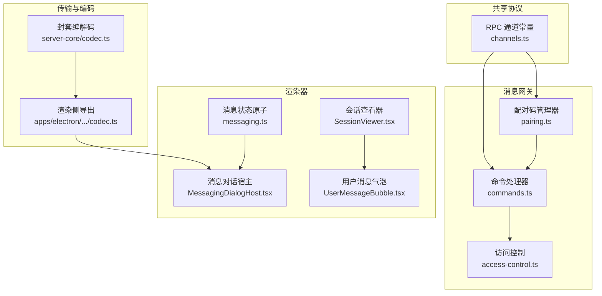
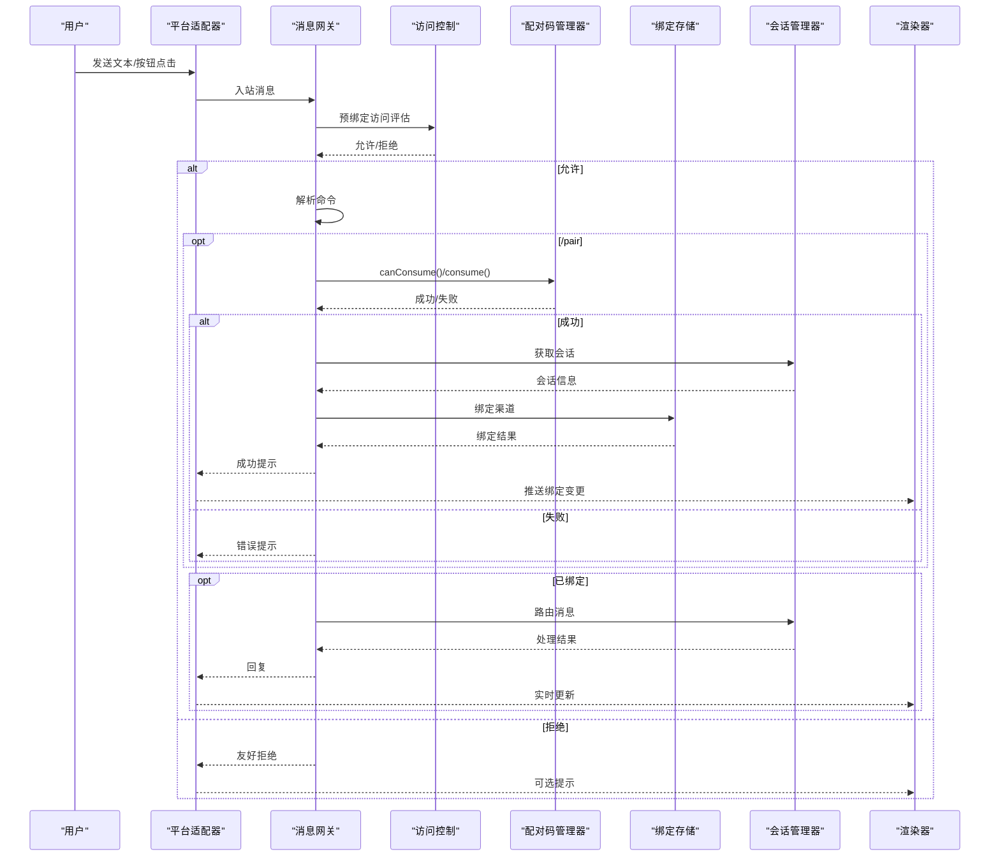
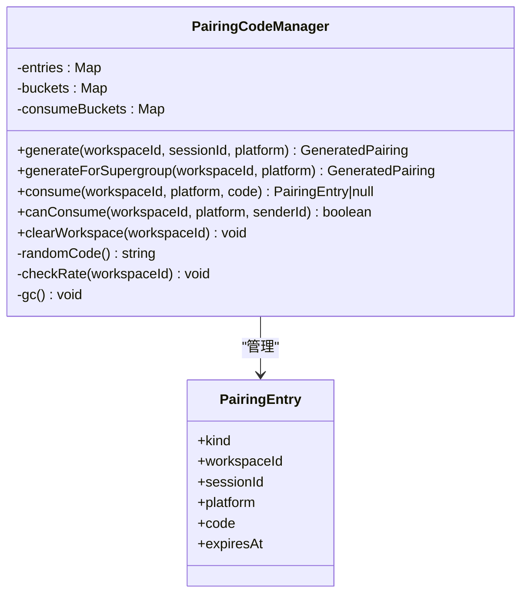
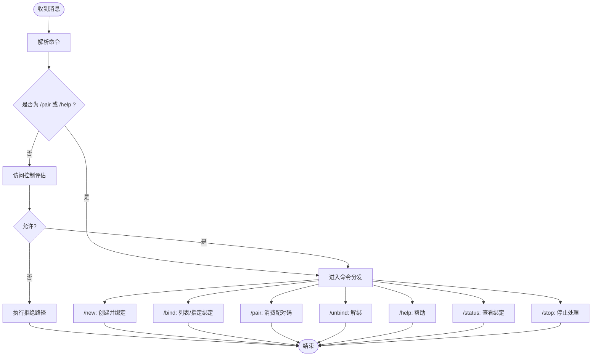
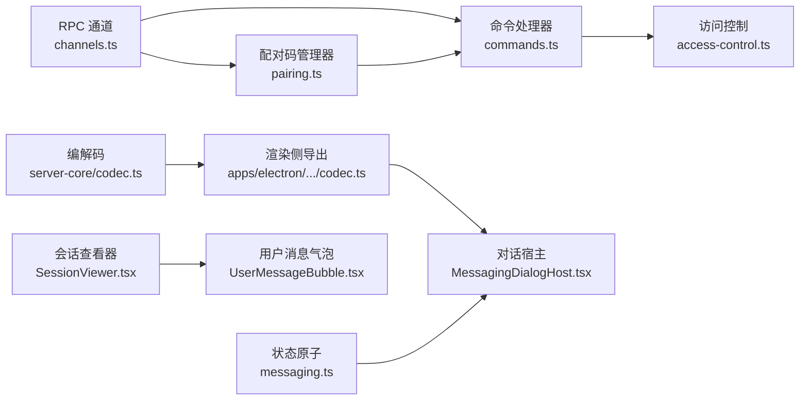

# 实时通信

<cite>
**本文引用的文件**
- [channels.ts](file://packages/shared/src/protocol/channels.ts)
- [pairing.ts](file://packages/messaging-gateway/src/pairing.ts)
- [commands.ts](file://packages/messaging-gateway/src/commands.ts)
- [access-control.ts](file://packages/messaging-gateway/src/access-control.ts)
- [codec.ts](file://packages/server-core/src/transport/codec.ts)
- [codec.ts](file://apps/electron/src/transport/codec.ts)
- [MessagingDialogHost.tsx](file://apps/electron/src/renderer/components/messaging/MessagingDialogHost.tsx)
- [messaging.ts](file://apps/electron/src/renderer/atoms/messaging.ts)
- [SessionViewer.tsx](file://packages/ui/src/components/chat/SessionViewer.tsx)
- [UserMessageBubble.tsx](file://packages/ui/src/components/chat/UserMessageBubble.tsx)
- [en.json](file://packages/shared/src/i18n/locales/en.json)
- [zh-Hans.json](file://packages/shared/src/i18n/locales/zh-Hans.json)
- [pool-server.ts](file://packages/shared/src/mcp/pool-server.ts)
- [validation.ts](file://packages/shared/src/sessions/validation.ts)
</cite>

## 目录
1. [简介](#简介)
2. [项目结构](#项目结构)
3. [核心组件](#核心组件)
4. [架构总览](#架构总览)
5. [详细组件分析](#详细组件分析)
6. [依赖关系分析](#依赖关系分析)
7. [性能考虑](#性能考虑)
8. [故障排除指南](#故障排除指南)
9. [结论](#结论)
10. [附录](#附录)

## 简介
本文件面向实时通信系统，聚焦以下主题：
- 消息配对机制（PairingCodeManager）：配对码生成、校验、过期清理、速率限制与安全策略
- 命令系统（Commands）：命令解析、执行流程、访问控制与拒绝反馈
- 渲染器（Renderer）：实时消息显示、状态更新、用户交互响应
- 安全机制：访问控制、会话安全、传输编码与最小暴露设计
- 性能优化：速率限制、缓存与重连、UI 帧稳定性
- 故障排除：常见问题定位与修复建议

## 项目结构
该仓库采用多包（monorepo）组织方式，实时通信涉及的关键模块分布如下：
- 协议与通道定义：共享协议层提供稳定的 RPC 通道名
- 网关与适配：消息网关负责命令解析、配对码消费、访问控制
- 传输与编码：服务端核心提供消息封套序列化/反序列化与校验
- 渲染器：Electron 渲染侧负责对话展示、对话框与状态管理
- UI 组件：通用 UI 提供聊天视图与消息气泡组件

图表来源
- [channels.ts:1-449](file://packages/shared/src/protocol/channels.ts#L1-L449)
- [pairing.ts:1-195](file://packages/messaging-gateway/src/pairing.ts#L1-L195)
- [commands.ts:1-683](file://packages/messaging-gateway/src/commands.ts#L1-L683)
- [access-control.ts:1-240](file://packages/messaging-gateway/src/access-control.ts#L1-L240)
- [codec.ts:1-157](file://packages/server-core/src/transport/codec.ts#L1-L157)
- [codec.ts:1-6](file://apps/electron/src/transport/codec.ts#L1-L6)
- [MessagingDialogHost.tsx:1-127](file://apps/electron/src/renderer/components/messaging/MessagingDialogHost.tsx#L1-L127)
- [messaging.ts:1-76](file://apps/electron/src/renderer/atoms/messaging.ts#L1-L76)
- [SessionViewer.tsx:111-178](file://packages/ui/src/components/chat/SessionViewer.tsx#L111-L178)
- [UserMessageBubble.tsx:312-348](file://packages/ui/src/components/chat/UserMessageBubble.tsx#L312-L348)

章节来源
- [channels.ts:1-449](file://packages/shared/src/protocol/channels.ts#L1-L449)
- [pairing.ts:1-195](file://packages/messaging-gateway/src/pairing.ts#L1-L195)
- [commands.ts:1-683](file://packages/messaging-gateway/src/commands.ts#L1-L683)
- [access-control.ts:1-240](file://packages/messaging-gateway/src/access-control.ts#L1-L240)
- [codec.ts:1-157](file://packages/server-core/src/transport/codec.ts#L1-L157)
- [codec.ts:1-6](file://apps/electron/src/transport/codec.ts#L1-L6)
- [MessagingDialogHost.tsx:1-127](file://apps/electron/src/renderer/components/messaging/MessagingDialogHost.tsx#L1-L127)
- [messaging.ts:1-76](file://apps/electron/src/renderer/atoms/messaging.ts#L1-L76)
- [SessionViewer.tsx:111-178](file://packages/ui/src/components/chat/SessionViewer.tsx#L111-L178)
- [UserMessageBubble.tsx:312-348](file://packages/ui/src/components/chat/UserMessageBubble.tsx#L312-L348)

## 核心组件
- 配对码管理器（PairingCodeManager）
  - 生成：6 位十进制随机数，5 分钟 TTL；按工作区限流（默认每分钟 10 次）
  - 消费：一次性原子消费，过期自动清理；支持会话级与工作区超级群组两种配对类型
  - 速率限制：每分钟最多 5 次“尝试配对”（错误输入也计入预算）
- 命令系统（Commands）
  - 解析：支持带 @BotName 的命令形式；区分预绑定命令与路由到会话的命令
  - 执行：/new、/bind、/pair、/unbind、/help、/status、/stop；未绑定时引导帮助
  - 访问控制：预绑定命令需通过访问控制评估；拒绝路径统一友好提示与冷却
- 访问控制（Access Control）
  - 平台级模式：开放（open）、仅所有者（owner-only）
  - 绑定级模式：开放（open）、允许名单（allow-list）、继承（inherit）
  - 拒绝回复：冷却窗口避免刷屏；可记录待审核发送者
- 传输与编码（Codec）
  - 封套类型：握手、请求、响应、事件、错误、序列确认
  - 编解码：二进制透明编码为 Base64；校验封套形状与字段
- 渲染器（Renderer）
  - 对话框：全局托管配对码与 WhatsApp 连接对话框，自动关闭与成功提示
  - 状态：Jotai 原子维护启用的绑定列表，按会话聚合
  - 视图：会话查看器与消息气泡组件负责消息渲染与交互

章节来源
- [pairing.ts:58-195](file://packages/messaging-gateway/src/pairing.ts#L58-L195)
- [commands.ts:120-683](file://packages/messaging-gateway/src/commands.ts#L120-L683)
- [access-control.ts:59-240](file://packages/messaging-gateway/src/access-control.ts#L59-L240)
- [codec.ts:146-157](file://packages/server-core/src/transport/codec.ts#L146-L157)
- [MessagingDialogHost.tsx:22-127](file://apps/electron/src/renderer/components/messaging/MessagingDialogHost.tsx#L22-L127)
- [messaging.ts:30-76](file://apps/electron/src/renderer/atoms/messaging.ts#L30-L76)
- [SessionViewer.tsx:111-178](file://packages/ui/src/components/chat/SessionViewer.tsx#L111-L178)
- [UserMessageBubble.tsx:332-348](file://packages/ui/src/components/chat/UserMessageBubble.tsx#L332-L348)

## 架构总览
实时通信链路由“平台适配器 → 网关命令与配对 → 访问控制 → 会话管理 → 渲染器”构成。

图表来源
- [commands.ts:140-188](file://packages/messaging-gateway/src/commands.ts#L140-L188)
- [access-control.ts:59-114](file://packages/messaging-gateway/src/access-control.ts#L59-L114)
- [pairing.ts:120-130](file://packages/messaging-gateway/src/pairing.ts#L120-L130)
- [channels.ts:381-431](file://packages/shared/src/protocol/channels.ts#L381-L431)

## 详细组件分析

### 配对码管理器（PairingCodeManager）
- 设计要点
  - 内存态：仅驻留内存，不持久化，降低泄露面
  - TTL 与 GC：过期即删，保证短期可用性
  - 限流策略：生成限流（每分钟 N 次）与尝试限流（每分钟 M 次）
  - 原子消费：一次性消费并删除，防止重复使用
  - 会话与工作区超群组两种配对类型，分别用于会话绑定与工作区论坛注册
- 关键接口
  - generate/generateForSupergroup：生成配对码与过期时间
  - consume：一次性消费并返回条目
  - canConsume：按工作区+平台+发送者维度的尝试预算检查
  - clearWorkspace：断开平台时清空工作区所有配对码
- 安全与鲁棒性
  - 短 TTL + 6 位十进制码（百万级空间）抵御暴力破解
  - 尝试预算进一步限制枚举收益
  - 严格键空间：platform:code，避免跨平台混淆

图表来源
- [pairing.ts:58-195](file://packages/messaging-gateway/src/pairing.ts#L58-L195)

章节来源
- [pairing.ts:58-195](file://packages/messaging-gateway/src/pairing.ts#L58-L195)

### 命令系统（Commands）
- 命令解析
  - 支持带 @BotName 的命令（如 /pair@MyBot 123456）
  - 统一转小写，避免大小写差异导致的匹配失败
- 执行流程
  - 预绑定门禁：除 /pair 与 /help 外，所有命令均需通过访问控制
  - 命令分发：/new 创建并绑定；/bind 列表选择或直接绑定；/pair 消费配对码；/unbind 解绑；/help 展示帮助；/status 查看绑定；/stop 停止当前处理
  - 未绑定自由文本：引导至帮助
- 访问控制集成
  - 拒绝路径统一调用 executeRejection，确保一致的友好提示与冷却
  - 种子首任所有者：首次成功配对的发送者自动加入平台所有者列表（若为空）

图表来源
- [commands.ts:140-248](file://packages/messaging-gateway/src/commands.ts#L140-L248)
- [access-control.ts:165-224](file://packages/messaging-gateway/src/access-control.ts#L165-L224)

章节来源
- [commands.ts:113-248](file://packages/messaging-gateway/src/commands.ts#L113-L248)
- [access-control.ts:59-114](file://packages/messaging-gateway/src/access-control.ts#L59-L114)

### 访问控制（Access Control）
- 平台级模式
  - open：开放访问
  - owner-only：仅所有者可执行预绑定命令
- 绑定级模式
  - open：开放
  - allow-list：仅允许名单内用户
  - inherit：继承工作区策略（兼容旧配置）
- 拒绝反馈
  - 友好文案：针对“非所有者”“不在允许名单”两类
  - 冷却窗口：每（平台+发送者）每小时仅一次提示
  - 待审核记录：非机器人拒绝将被记录，便于后续审核

章节来源
- [access-control.ts:59-240](file://packages/messaging-gateway/src/access-control.ts#L59-L240)

### 传输与编码（Codec）
- 封套类型与字段
  - handshake/handshake_ack：握手与确认
  - request/response：请求与响应
  - event/error：事件与错误
  - sequence_ack：序列确认
- 编解码策略
  - 二进制透明编码为 Base64 字段，保持跨运行时兼容
  - 递归遍历对象与数组，仅对字节数组进行编码
- 形状校验
  - 强制校验 id、type、channel、clientId 等字段存在性与类型
  - 对错误对象进行结构化校验，避免畸形封套

章节来源
- [codec.ts:146-157](file://packages/server-core/src/transport/codec.ts#L146-L157)
- [codec.ts:68-114](file://packages/server-core/src/transport/codec.ts#L68-L114)

### 渲染器（Renderer）
- 全局对话宿主
  - 托管配对码与 WhatsApp 连接对话框，等待用户完成配对后自动关闭并提示成功
  - 监听绑定变更推送，一旦目标会话在对应平台启用绑定，立即关闭对话框
- 状态管理
  - Jotai 原子维护启用的绑定列表，并按会话聚合，便于 UI 快速查询
- 实时消息显示
  - 会话查看器负责消息区域滚动与遮罩渐变
  - 用户消息气泡支持“排队中”最小可见时长，避免闪烁

章节来源
- [MessagingDialogHost.tsx:22-127](file://apps/electron/src/renderer/components/messaging/MessagingDialogHost.tsx#L22-L127)
- [messaging.ts:30-76](file://apps/electron/src/renderer/atoms/messaging.ts#L30-L76)
- [SessionViewer.tsx:111-178](file://packages/ui/src/components/chat/SessionViewer.tsx#L111-L178)
- [UserMessageBubble.tsx:332-348](file://packages/ui/src/components/chat/UserMessageBubble.tsx#L332-L348)

## 依赖关系分析
- 通道契约
  - RPC 通道常量集中定义，作为网关与适配器之间的稳定契约
- 组件耦合
  - Commands 依赖 PairingCodeConsumer、BindingStore、SessionManager、AccessControl
  - PairingCodeManager 与 Commands 通过 PairingCodeConsumer 接口解耦
  - 渲染器通过全局对话宿主与 IPC 与网关交互
- 外部依赖
  - 传输层依赖共享协议的封套类型
  - 渲染器依赖 Jotai 状态管理与 i18n 文案

图表来源
- [channels.ts:1-449](file://packages/shared/src/protocol/channels.ts#L1-L449)
- [pairing.ts:58-195](file://packages/messaging-gateway/src/pairing.ts#L58-L195)
- [commands.ts:120-138](file://packages/messaging-gateway/src/commands.ts#L120-L138)
- [access-control.ts:59-114](file://packages/messaging-gateway/src/access-control.ts#L59-L114)
- [codec.ts:146-157](file://packages/server-core/src/transport/codec.ts#L146-L157)
- [codec.ts:1-6](file://apps/electron/src/transport/codec.ts#L1-6)
- [MessagingDialogHost.tsx:22-127](file://apps/electron/src/renderer/components/messaging/MessagingDialogHost.tsx#L22-L127)
- [messaging.ts:30-76](file://apps/electron/src/renderer/atoms/messaging.ts#L30-L76)
- [SessionViewer.tsx:111-178](file://packages/ui/src/components/chat/SessionViewer.tsx#L111-L178)
- [UserMessageBubble.tsx:332-348](file://packages/ui/src/components/chat/UserMessageBubble.tsx#L332-L348)

章节来源
- [channels.ts:1-449](file://packages/shared/src/protocol/channels.ts#L1-L449)
- [commands.ts:120-138](file://packages/messaging-gateway/src/commands.ts#L120-L138)
- [access-control.ts:59-114](file://packages/messaging-gateway/src/access-control.ts#L59-L114)
- [codec.ts:146-157](file://packages/server-core/src/transport/codec.ts#L146-L157)
- [MessagingDialogHost.tsx:22-127](file://apps/electron/src/renderer/components/messaging/MessagingDialogHost.tsx#L22-L127)
- [messaging.ts:30-76](file://apps/electron/src/renderer/atoms/messaging.ts#L30-L76)
- [SessionViewer.tsx:111-178](file://packages/ui/src/components/chat/SessionViewer.tsx#L111-L178)
- [UserMessageBubble.tsx:332-348](file://packages/ui/src/components/chat/UserMessageBubble.tsx#L332-L348)

## 性能考虑
- 速率限制
  - 生成限流：每分钟 N 次，防止滥用
  - 尝试限流：每分钟 M 次，限制暴力枚举
- 内存与 GC
  - 配对码仅驻内存，过期即删，复杂度 O(n)，n 通常很小
- UI 帧稳定性
  - “排队中”最小可见时长避免频繁闪烁
  - 渐变遮罩与滚动容器分离，减少重绘范围
- 传输效率
  - 二进制透明编码，避免不必要的拷贝
  - 封套形状校验前置，快速失败

## 故障排除指南
- 配对码无效或已过期
  - 现象：/pair 返回无效或过期提示
  - 排查：确认配对码是否在 5 分钟内；检查生成端是否抛出速率限制
  - 参考
    - [pairing.ts:120-130](file://packages/messaging-gateway/src/pairing.ts#L120-L130)
    - [en.json:339-350](file://packages/shared/src/i18n/locales/en.json#L339-L350)
    - [zh-Hans.json:339-350](file://packages/shared/src/i18n/locales/zh-Hans.json#L339-L350)
- 频繁提示“请稍后再试”
  - 现象：/pair 返回“尝试过多”
  - 排查：确认尝试限流是否触发；检查客户端是否反复输入格式错误
  - 参考
    - [commands.ts:403-417](file://packages/messaging-gateway/src/commands.ts#L403-L417)
    - [pairing.ts:148-159](file://packages/messaging-gateway/src/pairing.ts#L148-L159)
- 无会话绑定但输入自由文本
  - 现象：收到帮助提示
  - 处理：使用 /new、/bind 或 /pair 完成绑定
  - 参考
    - [commands.ts:175-187](file://packages/messaging-gateway/src/commands.ts#L175-L187)
- 访问被拒绝
  - 现象：友好提示“私有机器人”或“不在允许名单”
  - 处理：联系所有者添加或调整工作区/绑定策略
  - 参考
    - [access-control.ts:230-239](file://packages/messaging-gateway/src/access-control.ts#L230-L239)
- 传输封套错误
  - 现象：反序列化失败或字段缺失
  - 处理：检查封套类型与字段；确保二进制正确编码
  - 参考
    - [codec.ts:122-144](file://packages/server-core/src/transport/codec.ts#L122-L144)
- 会话 ID 安全校验失败
  - 现象：安全错误（路径穿越或格式非法）
  - 处理：确保会话 ID 仅含字母数字、短横线与下划线
  - 参考
    - [validation.ts:24-41](file://packages/shared/src/sessions/validation.ts#L24-L41)
- MCP 池服务器连接问题
  - 现象：本地 MCP 服务无法启动或端口冲突
  - 处理：检查端口占用与调试日志；确认 Stateless 模式配置
  - 参考
    - [pool-server.ts:61-80](file://packages/shared/src/mcp/pool-server.ts#L61-L80)

章节来源
- [pairing.ts:120-130](file://packages/messaging-gateway/src/pairing.ts#L120-L130)
- [commands.ts:175-187](file://packages/messaging-gateway/src/commands.ts#L175-L187)
- [access-control.ts:230-239](file://packages/messaging-gateway/src/access-control.ts#L230-L239)
- [codec.ts:122-144](file://packages/server-core/src/transport/codec.ts#L122-L144)
- [validation.ts:24-41](file://packages/shared/src/sessions/validation.ts#L24-L41)
- [pool-server.ts:61-80](file://packages/shared/src/mcp/pool-server.ts#L61-L80)
- [en.json:339-350](file://packages/shared/src/i18n/locales/en.json#L339-L350)
- [zh-Hans.json:339-350](file://packages/shared/src/i18n/locales/zh-Hans.json#L339-L350)

## 结论
本系统通过“内存态配对码 + 短 TTL + 速率限制 + 访问控制”的组合，在保障易用性的同时强化了安全性；命令系统与渲染器解耦清晰，传输层采用强校验与透明编码，确保跨平台一致性与稳定性。建议在生产环境中结合会话安全校验与 MCP 服务监控，持续优化配对与传输体验。

## 附录
- 配置示例（概念性说明）
  - 工作区访问模式：open 或 owner-only
  - 平台所有者：按平台维护允许的初始所有者列表
  - 绑定访问模式：inherit、open、allow-list
  - 会话配对：通过渲染器对话框生成配对码，用户在机器人中输入 /pair <code> 完成绑定
- 用户体验优化
  - 配对对话框自动关闭与成功提示
  - “排队中”最小可见时长避免闪烁
  - 渐变遮罩与滚动容器分离提升滚动流畅度