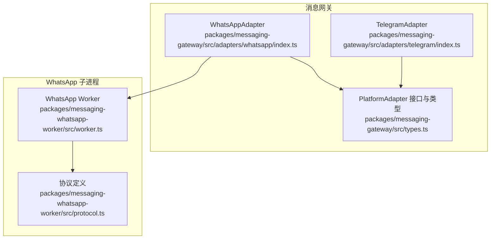
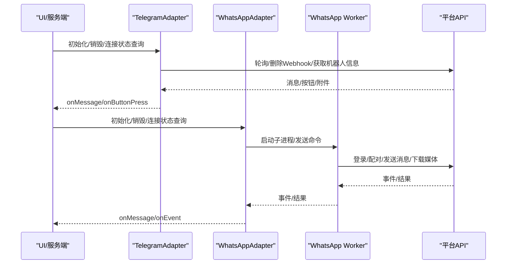
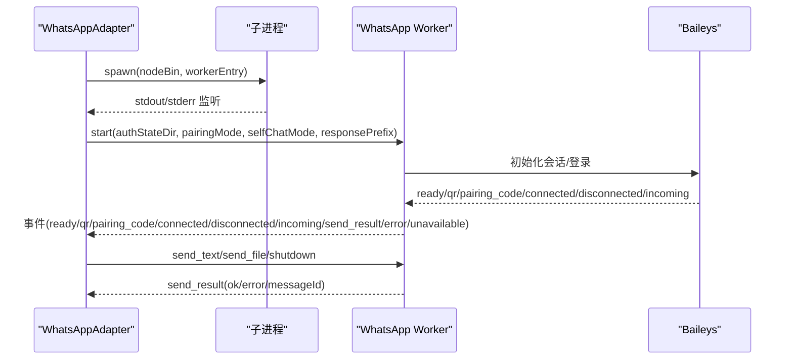
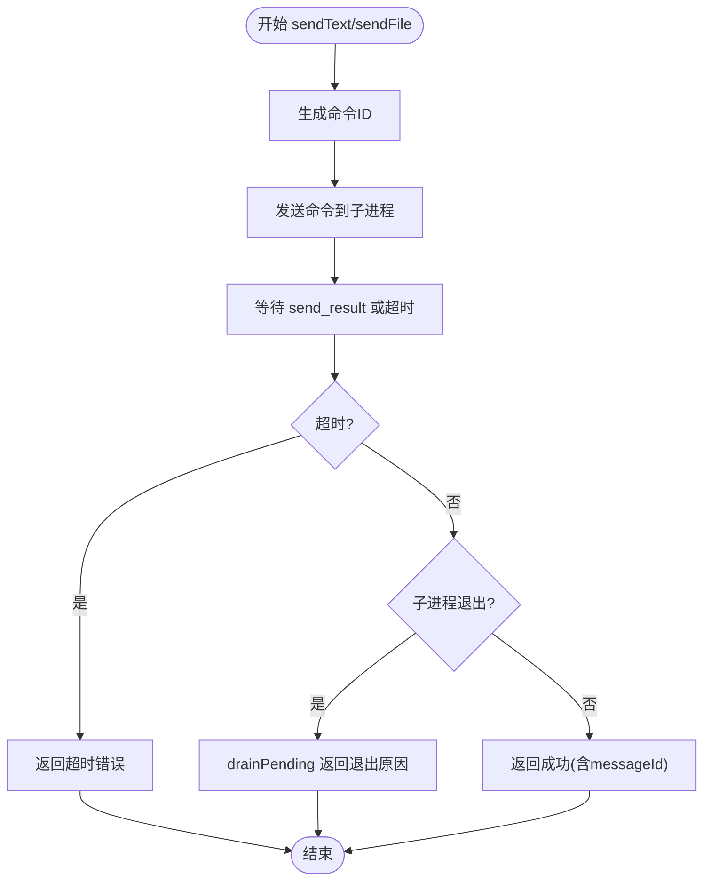
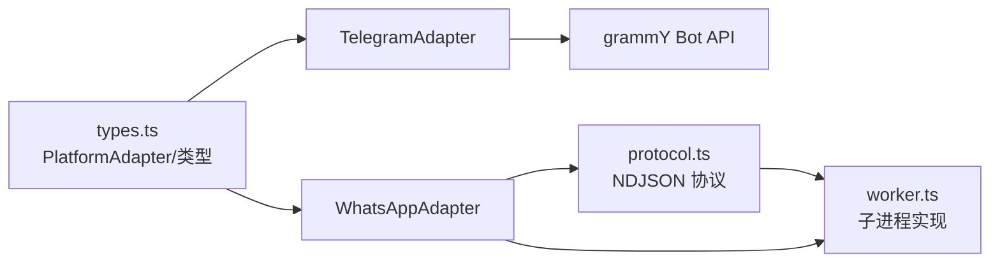

# 平台适配器

<cite>
**本文引用的文件**
- [packages/messaging-gateway/src/adapters/telegram/index.ts](file://packages/messaging-gateway/src/adapters/telegram/index.ts)
- [packages/messaging-gateway/src/adapters/telegram/format.ts](file://packages/messaging-gateway/src/adapters/telegram/format.ts)
- [packages/messaging-gateway/src/adapters/whatsapp/index.ts](file://packages/messaging-gateway/src/adapters/whatsapp/index.ts)
- [packages/messaging-whatsapp-worker/src/worker.ts](file://packages/messaging-whatsapp-worker/src/worker.ts)
- [packages/messaging-whatsapp-worker/src/protocol.ts](file://packages/messaging-whatsapp-worker/src/protocol.ts)
- [packages/messaging-gateway/src/types.ts](file://packages/messaging-gateway/src/types.ts)
- [packages/shared/src/protocol/channels.ts](file://packages/shared/src/protocol/channels.ts)
- [packages/messaging-gateway/src/adapters/whatsapp/lifecycle.test.ts](file://packages/messaging-gateway/src/adapters/whatsapp/lifecycle.test.ts)
</cite>

## 目录
1. [简介](#简介)
2. [项目结构](#项目结构)
3. [核心组件](#核心组件)
4. [架构总览](#架构总览)
5. [详细组件分析](#详细组件分析)
6. [依赖关系分析](#依赖关系分析)
7. [性能考量](#性能考量)
8. [故障排除指南](#故障排除指南)
9. [结论](#结论)
10. [附录：扩展新平台适配器指南](#附录扩展新平台适配器指南)

## 简介
本文件系统性阐述平台适配器的设计与实现，重点覆盖 Telegram 与 WhatsApp 两大平台的适配器（TelegramAdapter、WhatsAppAdapter）。内容涵盖：
- 适配器基类与接口设计（PlatformAdapter）
- 平台特有消息处理逻辑（富文本、多媒体、内联按钮）
- 认证与连接管理（轮询/子进程、重连策略）
- 生命周期管理、错误重试、超时控制、消息状态跟踪
- 配置示例与故障排除建议
- 扩展指南：如何为新平台创建适配器

## 项目结构
平台适配器位于消息网关包中，Telegram 与 WhatsApp 分别实现各自的适配器，并通过统一的 PlatformAdapter 接口对外暴露能力。



图表来源
- [packages/messaging-gateway/src/adapters/telegram/index.ts:144-791](file://packages/messaging-gateway/src/adapters/telegram/index.ts#L144-L791)
- [packages/messaging-gateway/src/adapters/whatsapp/index.ts:112-514](file://packages/messaging-gateway/src/adapters/whatsapp/index.ts#L112-L514)
- [packages/messaging-gateway/src/types.ts:185-228](file://packages/messaging-gateway/src/types.ts#L185-L228)
- [packages/messaging-whatsapp-worker/src/worker.ts:1-538](file://packages/messaging-whatsapp-worker/src/worker.ts#L1-L538)
- [packages/messaging-whatsapp-worker/src/protocol.ts:1-213](file://packages/messaging-whatsapp-worker/src/protocol.ts#L1-L213)

章节来源
- [packages/messaging-gateway/src/adapters/telegram/index.ts:1-803](file://packages/messaging-gateway/src/adapters/telegram/index.ts#L1-L803)
- [packages/messaging-gateway/src/adapters/whatsapp/index.ts:1-514](file://packages/messaging-gateway/src/adapters/whatsapp/index.ts#L1-L514)
- [packages/messaging-gateway/src/types.ts:1-519](file://packages/messaging-gateway/src/types.ts#L1-L519)
- [packages/messaging-whatsapp-worker/src/worker.ts:1-538](file://packages/messaging-whatsapp-worker/src/worker.ts#L1-L538)
- [packages/messaging-whatsapp-worker/src/protocol.ts:1-213](file://packages/messaging-whatsapp-worker/src/protocol.ts#L1-L213)

## 核心组件
- PlatformAdapter 接口：定义平台适配器的统一能力边界，包括初始化、销毁、连接状态、消息与按钮事件回调、发送文本/编辑/按钮/文件、可选的清除按钮等。
- AdapterCapabilities：描述平台能力，如是否支持内联按钮、最大消息长度、Markdown 版本、是否支持 Webhook 等。
- IncomingMessage/IncomingAttachment/SentMessage/InlineButton/ButtonPress：跨平台消息与附件的数据结构。
- TelegramAdapter：基于 grammY 的 Telegram 适配器，支持轮询、DM 与论坛主题、内联按钮、多媒体下载到本地临时路径。
- WhatsAppAdapter：基于子进程的 WhatsApp 适配器，通过 NDJSON 协议与 worker 通信，负责生命周期、事件分发、超时与失败恢复。

章节来源
- [packages/messaging-gateway/src/types.ts:68-228](file://packages/messaging-gateway/src/types.ts#L68-L228)
- [packages/messaging-gateway/src/adapters/telegram/index.ts:144-791](file://packages/messaging-gateway/src/adapters/telegram/index.ts#L144-L791)
- [packages/messaging-gateway/src/adapters/whatsapp/index.ts:112-514](file://packages/messaging-gateway/src/adapters/whatsapp/index.ts#L112-L514)

## 架构总览
Telegram 采用 in-process 轮询模式；WhatsApp 采用 out-of-process 子进程模式，二者均通过统一的 PlatformAdapter 接口对外提供能力。



图表来源
- [packages/messaging-gateway/src/adapters/telegram/index.ts:249-471](file://packages/messaging-gateway/src/adapters/telegram/index.ts#L249-L471)
- [packages/messaging-gateway/src/adapters/whatsapp/index.ts:135-214](file://packages/messaging-gateway/src/adapters/whatsapp/index.ts#L135-L214)
- [packages/messaging-whatsapp-worker/src/worker.ts:411-502](file://packages/messaging-whatsapp-worker/src/worker.ts#L411-L502)

## 详细组件分析

### TelegramAdapter 组件分析
- 设计模式与职责
  - 基于 grammY 的 Bot 实例进行轮询，注册多种事件处理器（文本、照片、文档、语音、视频、音频、回调）。
  - 通过本地临时目录下载并缓存附件，确保路由层能以统一方式处理文件。
  - 支持论坛主题（Supergroup Topic），通过 threadId 将消息路由到对应话题。
- 关键流程
  - 初始化：清理旧 Webhook、调用 getMe 校验令牌、启动轮询。
  - 入站消息：按事件类型解析为 IncomingMessage，必要时下载附件。
  - 出站消息：发送文本、编辑文本、发送按钮、发送文件、清除按钮、打字状态、创建论坛主题。
  - 连接管理：轮询失败自动指数退避重连，避免多实例竞争。
- 平台特性
  - 富文本：当前版本在 Telegram 上发送纯文本（保留 MarkdownV2 转义工具以便后续启用）。
  - 多媒体：支持图片、文档、语音、视频、音频，统一写入本地临时路径。
  - 内联按钮：支持回调数据，回传 ButtonPress。
  - 认证与配对：通过 SuperGroup 论坛配对码绑定工作区，运行时可更新接受的 SuperGroup ChatId。
- 错误处理与超时
  - 使用 withTimeout 包装关键 API（deleteWebhook、bot.init），避免静默重试导致的假死。
  - 日志结构化，记录被拒绝的聊天、回调接收/处理耗时等诊断信息。
- 生命周期
  - initialize/destroy、isConnected、onMessage/onButtonPress 注册。
  - setAcceptedSupergroupChatId 运行时更新接受范围。

```mermaid
classDiagram
class TelegramAdapter {
+platform
+capabilities
+initialize(config)
+destroy()
+isConnected() bool
+onMessage(handler)
+onButtonPress(handler)
+sendText(channelId, text, opts) SentMessage
+editMessage(channelId, messageId, text, opts)
+sendButtons(channelId, text, buttons, opts) SentMessage
+sendTyping(channelId, opts)
+sendFile(channelId, file, filename, caption, opts) SentMessage
+clearButtons(channelId, messageId, opts)
+createForumTopic(chatId, name) {threadId, name}
+setAcceptedSupergroupChatId(chatId)
-emitAttachmentMessage(ctx, meta)
-downloadToTemp(fileId, fallbackName, mimeType)
-startPolling()
-scheduleReconnect(err)
}
```

图表来源
- [packages/messaging-gateway/src/adapters/telegram/index.ts:144-791](file://packages/messaging-gateway/src/adapters/telegram/index.ts#L144-L791)

章节来源
- [packages/messaging-gateway/src/adapters/telegram/index.ts:1-803](file://packages/messaging-gateway/src/adapters/telegram/index.ts#L1-L803)
- [packages/messaging-gateway/src/adapters/telegram/format.ts:1-23](file://packages/messaging-gateway/src/adapters/telegram/format.ts#L1-L23)

### WhatsAppAdapter 组件分析
- 设计模式与职责
  - 通过子进程运行 WhatsApp Worker（Baileys），主进程仅负责生命周期与事件转发。
  - 使用 NDJSON 在 stdin/stdout 传输命令与事件，保证协议简洁与健壮。
  - 对外暴露 onMessage/onEvent 回调，内部维护 pending 发送队列与超时。
- 关键流程
  - 初始化：校验参数，spawn 子进程，监听 stdout/stderr，发送 start 命令。
  - 事件分发：将 worker 的 ready/qr/pairing_code/connected/disconnected/incoming/send_result/error/unavailable 映射为适配器事件。
  - 发送流程：生成命令 ID，等待 send_result，超时或退出时统一 drainPending。
  - 销毁：优雅关闭子进程，若无响应则强制 SIGKILL。
- 平台特性
  - 富文本：使用自定义 markdown 标记（whatsapp）。
  - 多媒体：Worker 下载媒体到本地临时文件，返回绝对路径供路由层处理。
  - 内联按钮：不直接支持，通过编号列表形式模拟按钮。
  - 自聊模式：可将其他设备发往自 JID 的消息作为输入路由。
- 错误处理与超时
  - 默认每条发送超时 30 秒，可通过配置缩短；worker 退出或 destroy 时 drainPending。
  - 重连：worker 内部指数退避最多 10 次，超过上限发出 unavailable 事件。
- 生命周期
  - initialize/destroy、isConnected、onMessage/onEvent、requestPairingCode。



图表来源
- [packages/messaging-gateway/src/adapters/whatsapp/index.ts:135-214](file://packages/messaging-gateway/src/adapters/whatsapp/index.ts#L135-L214)
- [packages/messaging-whatsapp-worker/src/worker.ts:411-502](file://packages/messaging-whatsapp-worker/src/worker.ts#L411-L502)
- [packages/messaging-whatsapp-worker/src/protocol.ts:18-181](file://packages/messaging-whatsapp-worker/src/protocol.ts#L18-L181)

章节来源
- [packages/messaging-gateway/src/adapters/whatsapp/index.ts:1-514](file://packages/messaging-gateway/src/adapters/whatsapp/index.ts#L1-L514)
- [packages/messaging-whatsapp-worker/src/worker.ts:1-538](file://packages/messaging-whatsapp-worker/src/worker.ts#L1-L538)
- [packages/messaging-whatsapp-worker/src/protocol.ts:1-213](file://packages/messaging-whatsapp-worker/src/protocol.ts#L1-L213)

### 复杂逻辑流程图：WhatsApp 发送生命周期


图表来源
- [packages/messaging-gateway/src/adapters/whatsapp/index.ts:353-385](file://packages/messaging-gateway/src/adapters/whatsapp/index.ts#L353-L385)
- [packages/messaging-gateway/src/adapters/whatsapp/index.ts:392-404](file://packages/messaging-gateway/src/adapters/whatsapp/index.ts#L392-L404)

章节来源
- [packages/messaging-gateway/src/adapters/whatsapp/index.ts:279-340](file://packages/messaging-gateway/src/adapters/whatsapp/index.ts#L279-L340)
- [packages/messaging-gateway/src/adapters/whatsapp/lifecycle.test.ts:78-123](file://packages/messaging-gateway/src/adapters/whatsapp/lifecycle.test.ts#L78-L123)

## 依赖关系分析
- TelegramAdapter 依赖 grammY Bot 与 Telegram Bot API，负责轮询、Webhook 清理、附件下载、按钮回调处理。
- WhatsAppAdapter 依赖子进程 worker，通过 NDJSON 协议通信；worker 内部依赖 Baileys。
- 两者均实现 PlatformAdapter 接口，共享 IncomingMessage/Attachment/SentMessage 等类型。
- 通道与 UI 交互通过 RPC 通道（如 WA_START_CONNECT、WA_SUBMIT_PHONE、WA_UI_EVENT）进行。



图表来源
- [packages/messaging-gateway/src/types.ts:185-228](file://packages/messaging-gateway/src/types.ts#L185-L228)
- [packages/messaging-gateway/src/adapters/telegram/index.ts:11-24](file://packages/messaging-gateway/src/adapters/telegram/index.ts#L11-L24)
- [packages/messaging-gateway/src/adapters/whatsapp/index.ts:19-38](file://packages/messaging-gateway/src/adapters/whatsapp/index.ts#L19-L38)
- [packages/messaging-whatsapp-worker/src/protocol.ts:1-213](file://packages/messaging-whatsapp-worker/src/protocol.ts#L1-L213)
- [packages/messaging-whatsapp-worker/src/worker.ts:1-538](file://packages/messaging-whatsapp-worker/src/worker.ts#L1-L538)

章节来源
- [packages/shared/src/protocol/channels.ts:412-431](file://packages/shared/src/protocol/channels.ts#L412-L431)

## 性能考量
- Telegram
  - 轮询模式下，网络抖动与并发竞争可能导致阻塞；通过 withTimeout 与结构化日志定位问题。
  - 附件下载采用本地临时文件，避免内存峰值；设置大小上限防止大文件占用资源。
- WhatsApp
  - 子进程隔离避免崩溃影响主进程；默认每条发送超时 30 秒，可根据网络环境调整。
  - worker 内部指数退避重连，最多尝试 10 次；超过上限发出 unavailable 事件，便于上层感知。
- 通用
  - 适配器统一返回 SentMessage，便于上层进行消息状态跟踪与去重。
  - 日志上下文包含平台、频道、绑定等字段，便于问题定位。

## 故障排除指南
- Telegram
  - 症状：机器人无响应或未收到消息
    - 排查：确认已删除旧 Webhook；检查 bot.init 是否超时；查看被拒绝聊天日志。
    - 参考：withTimeout(deleteWebhook/init)、logRejectedChat、startPolling/scheduleReconnect。
  - 症状：附件过大或下载失败
    - 排查：检查 MAX_ATTACHMENT_BYTES 限制；确认 file_path 与 MIME 映射；查看下载错误日志。
    - 参考：emitAttachmentMessage/downloadToTemp。
- WhatsApp
  - 症状：发送卡住或长时间无响应
    - 排查：检查 sendTimeoutMs 设置；确认子进程是否正常；查看 drainPending 行为。
    - 参考：sendWithResult/drainPending、生命周期测试。
  - 症状：worker 退出或不可用
    - 排查：查看 unavailable 事件原因（baileys_load_failed/auth_state_error/reconnect_exhausted）；检查 authStateDir 权限。
    - 参考：worker 启动与事件分发、协议定义。
- 通用
  - 症状：按钮点击无响应
    - 排查：确认按钮回调已注册；检查 isAcceptedChat 过滤；查看回调接收/处理耗时日志。
    - 参考：Telegram 回调处理、WhatsApp 事件映射。

章节来源
- [packages/messaging-gateway/src/adapters/telegram/index.ts:444-465](file://packages/messaging-gateway/src/adapters/telegram/index.ts#L444-L465)
- [packages/messaging-gateway/src/adapters/telegram/index.ts:482-548](file://packages/messaging-gateway/src/adapters/telegram/index.ts#L482-L548)
- [packages/messaging-gateway/src/adapters/whatsapp/index.ts:353-404](file://packages/messaging-gateway/src/adapters/whatsapp/index.ts#L353-L404)
- [packages/messaging-whatsapp-worker/src/worker.ts:204-229](file://packages/messaging-whatsapp-worker/src/worker.ts#L204-L229)
- [packages/messaging-whatsapp-worker/src/protocol.ts:168-181](file://packages/messaging-whatsapp-worker/src/protocol.ts#L168-L181)

## 结论
Telegram 与 WhatsApp 适配器分别采用“轮询 + in-process”和“子进程 + NDJSON”的架构，统一通过 PlatformAdapter 接口对外提供能力。Telegram 更偏向原生平台能力（内联按钮、论坛主题、多媒体直传），WhatsApp 则通过 worker 抽象实现稳定运行与隔离。两者均具备完善的错误处理、超时与重试机制，并通过结构化日志与运行时状态帮助运维与开发快速定位问题。

## 附录：扩展新平台适配器指南
- 必备步骤
  - 实现 PlatformAdapter 接口：initialize/destroy/isConnected/onMessage/onButtonPress/sendText/sendFile 等。
  - 定义 AdapterCapabilities：明确平台能力（编辑、内联按钮、最大长度、Markdown 类型、Webhook 支持）。
  - 数据模型：遵循 IncomingMessage/IncomingAttachment/SentMessage/InlineButton/ButtonPress。
  - 生命周期：实现连接建立、断开、重连、销毁。
  - 错误与超时：为关键操作设置超时包装，统一错误上报与日志上下文。
- 参考实现
  - TelegramAdapter：轮询、附件下载、按钮回调、论坛主题。
  - WhatsAppAdapter：子进程、NDJSON 协议、超时与 drainPending、worker 事件映射。
- 配置与 UI
  - 通过 PlatformConfig 传递令牌、路径、模式等参数。
  - 若涉及配对流程（如 WA），参考 RPC 通道命名约定（WA_START_CONNECT、WA_SUBMIT_PHONE、WA_UI_EVENT）。

章节来源
- [packages/messaging-gateway/src/types.ts:185-228](file://packages/messaging-gateway/src/types.ts#L185-L228)
- [packages/messaging-gateway/src/adapters/telegram/index.ts:144-791](file://packages/messaging-gateway/src/adapters/telegram/index.ts#L144-L791)
- [packages/messaging-gateway/src/adapters/whatsapp/index.ts:112-514](file://packages/messaging-gateway/src/adapters/whatsapp/index.ts#L112-L514)
- [packages/shared/src/protocol/channels.ts:412-431](file://packages/shared/src/protocol/channels.ts#L412-L431)