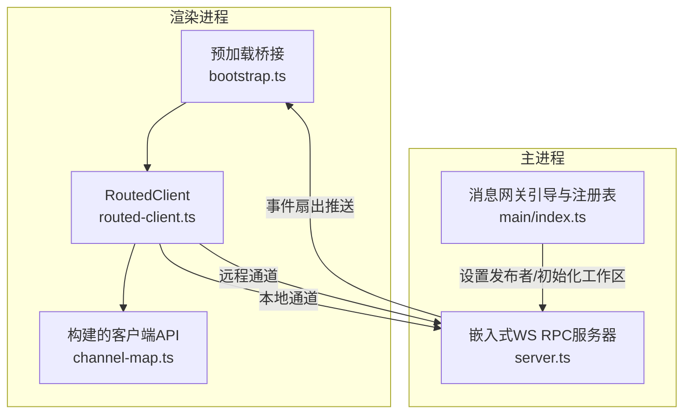
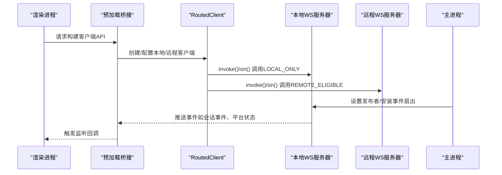
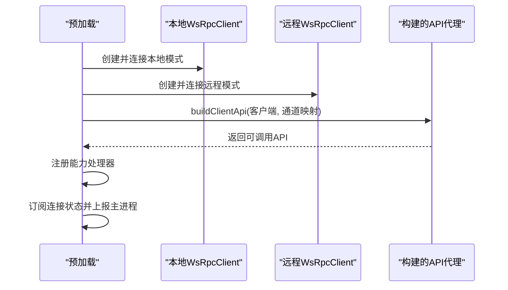
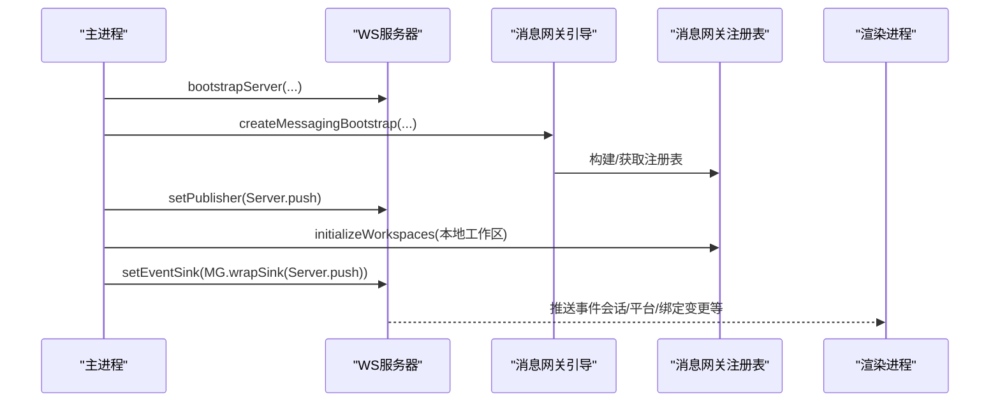
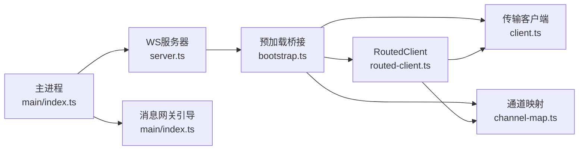

# 消息处理系统

<cite>
**本文引用的文件**
- [apps/electron/src/transport/index.ts](file://apps/electron/src/transport/index.ts)
- [apps/electron/src/transport/client.ts](file://apps/electron/src/transport/client.ts)
- [apps/electron/src/transport/server.ts](file://apps/electron/src/transport/server.ts)
- [apps/electron/src/transport/routed-client.ts](file://apps/electron/src/transport/routed-client.ts)
- [apps/electron/src/transport/channel-map.ts](file://apps/electron/src/transport/channel-map.ts)
- [apps/electron/src/transport/codec.ts](file://apps/electron/src/transport/codec.ts)
- [apps/electron/src/preload/bootstrap.ts](file://apps/electron/src/preload/bootstrap.ts)
- [apps/electron/src/main/index.ts](file://apps/electron/src/main/index.ts)
</cite>

## 目录
1. [简介](#简介)
2. [项目结构](#项目结构)
3. [核心组件](#核心组件)
4. [架构总览](#架构总览)
5. [详细组件分析](#详细组件分析)
6. [依赖关系分析](#依赖关系分析)
7. [性能考虑](#性能考虑)
8. [故障排查指南](#故障排查指南)
9. [结论](#结论)
10. [附录](#附录)

## 简介
本文件为消息处理系统的综合技术文档，聚焦于消息网关的路由机制、事件分发、连接管理；事件处理器的注册、订阅与异步处理模式；消息流式传输、实时更新与错误重试机制；以及消息序列化、压缩优化与网络故障恢复等关键技术细节。文档同时提供性能调优、监控指标与调试工具的使用指南，帮助开发者扩展消息功能或集成自定义消息源。

## 项目结构
消息处理系统由三部分组成：
- 传输层（Transport）：基于 WebSocket 的 RPC 客户端与服务端实现，负责消息路由、连接状态管理与能力注册。
- 预加载桥接层（Preload）：在渲染进程中构建客户端代理，支持本地/远程双栈路由与工作区切换。
- 主进程集成层（Main）：启动嵌入式服务器、初始化消息网关、安装事件扇出分发器，并将消息推送回渲染端。



图表来源
- [apps/electron/src/preload/bootstrap.ts:1-154](file://apps/electron/src/preload/bootstrap.ts#L1-L154)
- [apps/electron/src/transport/routed-client.ts:40-251](file://apps/electron/src/transport/routed-client.ts#L40-L251)
- [apps/electron/src/transport/channel-map.ts:19-398](file://apps/electron/src/transport/channel-map.ts#L19-L398)
- [apps/electron/src/transport/server.ts:1-2](file://apps/electron/src/transport/server.ts#L1-L2)
- [apps/electron/src/main/index.ts:642-741](file://apps/electron/src/main/index.ts#L642-L741)

章节来源
- [apps/electron/src/transport/index.ts:1-6](file://apps/electron/src/transport/index.ts#L1-L6)
- [apps/electron/src/transport/client.ts:1-18](file://apps/electron/src/transport/client.ts#L1-L18)
- [apps/electron/src/transport/server.ts:1-2](file://apps/electron/src/transport/server.ts#L1-L2)
- [apps/electron/src/transport/routed-client.ts:1-252](file://apps/electron/src/transport/routed-client.ts#L1-L252)
- [apps/electron/src/transport/channel-map.ts:1-399](file://apps/electron/src/transport/channel-map.ts#L1-L399)
- [apps/electron/src/transport/codec.ts:1-6](file://apps/electron/src/transport/codec.ts#L1-L6)
- [apps/electron/src/preload/bootstrap.ts:1-439](file://apps/electron/src/preload/bootstrap.ts#L1-L439)
- [apps/electron/src/main/index.ts:1-1194](file://apps/electron/src/main/index.ts#L1-L1194)

## 核心组件
- 传输接口与导出
  - 传输层统一导出 RPC 客户端/服务端、通道映射与类型，便于跨包复用。
- WebSocket RPC 客户端
  - 封装连接建立、自动重连、能力注册、事件监听与通道可用性检测。
- 路由客户端（RoutedClient）
  - 在本地与远程工作区之间透明切换，维护 REMOTE_ELIGIBLE 订阅与能力处理器的迁移。
- 通道映射（ChannelMap）
  - 将高层方法名映射到具体 RPC 通道，支持“invoke”与“listener”两类条目。
- 预加载桥接
  - 构建渲染侧 API 代理，注入连接状态日志、能力回调与工作区切换逻辑。
- 主进程消息网关
  - 初始化嵌入式服务器，创建消息网关引导句柄，安装事件扇出分发器，将消息推送到渲染端。

章节来源
- [apps/electron/src/transport/index.ts:1-6](file://apps/electron/src/transport/index.ts#L1-L6)
- [apps/electron/src/transport/client.ts:1-18](file://apps/electron/src/transport/client.ts#L1-L18)
- [apps/electron/src/transport/routed-client.ts:40-251](file://apps/electron/src/transport/routed-client.ts#L40-L251)
- [apps/electron/src/transport/channel-map.ts:19-398](file://apps/electron/src/transport/channel-map.ts#L19-L398)
- [apps/electron/src/preload/bootstrap.ts:1-439](file://apps/electron/src/preload/bootstrap.ts#L1-L439)
- [apps/electron/src/main/index.ts:642-741](file://apps/electron/src/main/index.ts#L642-L741)

## 架构总览
消息处理系统采用“预加载桥接 + 路由客户端 + 嵌入式WS服务器 + 消息网关”的分层设计：
- 渲染进程通过预加载脚本创建本地或远程的 WsRpcClient，或使用 RoutedClient 统一路由。
- RoutedClient 将 LOCAL_ONLY 通道定向至本地嵌入式服务器，将 REMOTE_ELIGIBLE 通道定向至当前工作区所属的服务器。
- 主进程启动嵌入式 WS 服务器，初始化消息网关，将事件通过扇出分发器推送回渲染端。
- 通道映射定义了所有可调用的方法与其对应的 RPC 通道，确保调用与监听的一致性。



图表来源
- [apps/electron/src/preload/bootstrap.ts:60-154](file://apps/electron/src/preload/bootstrap.ts#L60-L154)
- [apps/electron/src/transport/routed-client.ts:95-146](file://apps/electron/src/transport/routed-client.ts#L95-L146)
- [apps/electron/src/main/index.ts:718-741](file://apps/electron/src/main/index.ts#L718-L741)

## 详细组件分析

### 路由客户端（RoutedClient）分析
RoutedClient 是消息网关路由的核心，负责：
- 本地/远程通道区分：根据通道属性决定目标客户端。
- 工作区切换：在本地与远程工作区间无缝切换，保持 REMOTE_ELIGIBLE 订阅与能力处理器的迁移。
- 连接状态委托：将远程客户端的连接状态广播给上层监听者。
- 参数映射：在远程调用时将本地工作区ID替换为远程工作区ID，保证远端解析正确。

```mermaid
classDiagram
class RoutedClient {
-workspaceClient : WsRpcClient
-remoteListeners : Map
-capabilities : Map
-connectionStateListeners : Set
-clientFactory : WorkspaceClientFactory
-workspaceIdMapping : {localId, remoteId}
+invoke(channel, ...args) Promise
+on(channel, callback) () => void
+handleCapability(channel, handler) void
+isChannelAvailable(channel) boolean
+getConnectionState() TransportConnectionState
+onConnectionStateChanged(cb) () => void
+reconnectNow() void
-handleWorkspaceSwitch(result) void
-swapWorkspaceClient(newClient) void
-bindConnectionState() void
}
class WsRpcClient {
+connect() void
+destroy() void
+invoke(channel, ...args) Promise
+on(channel, callback) () => void
+handleCapability(channel, handler) void
+isChannelAvailable(channel) boolean
+getConnectionState() TransportConnectionState
+onConnectionStateChanged(cb) () => void
+emitReconnected(stale) void
}
RoutedClient --> WsRpcClient : "本地/远程客户端"
```

图表来源
- [apps/electron/src/transport/routed-client.ts:40-251](file://apps/electron/src/transport/routed-client.ts#L40-L251)
- [apps/electron/src/transport/client.ts:8-17](file://apps/electron/src/transport/client.ts#L8-L17)

章节来源
- [apps/electron/src/transport/routed-client.ts:1-252](file://apps/electron/src/transport/routed-client.ts#L1-L252)

### 预加载桥接（Preload）分析
预加载桥接负责：
- 根据运行模式（本地/远程）创建单一或双栈客户端。
- 注册客户端能力处理器（如打开外部链接、文件对话框等）。
- 构建 ElectronAPI 代理，暴露方法与事件监听。
- 将远程连接状态上报至主进程，便于日志与诊断。



图表来源
- [apps/electron/src/preload/bootstrap.ts:60-154](file://apps/electron/src/preload/bootstrap.ts#L60-L154)
- [apps/electron/src/preload/bootstrap.ts:183-256](file://apps/electron/src/preload/bootstrap.ts#L183-L256)

章节来源
- [apps/electron/src/preload/bootstrap.ts:1-439](file://apps/electron/src/preload/bootstrap.ts#L1-L439)

### 通道映射（ChannelMap）分析
通道映射将高层方法名映射到 RPC 通道，支持两类条目：
- invoke：用于请求-响应式调用。
- listener：用于事件订阅。

该映射是构建客户端 API 的“单源事实”，确保调用与监听一致。

章节来源
- [apps/electron/src/transport/channel-map.ts:19-398](file://apps/electron/src/transport/channel-map.ts#L19-L398)

### 主进程消息网关集成分析
主进程负责：
- 启动嵌入式 WS RPC 服务器。
- 创建消息网关引导句柄，初始化本地工作区的消息目录。
- 安装事件扇出分发器，将服务器推送与消息网关事件合并后回推到渲染端。
- 在远程工作区场景下，通过工厂函数动态创建远程客户端并完成订阅迁移。



图表来源
- [apps/electron/src/main/index.ts:642-741](file://apps/electron/src/main/index.ts#L642-L741)

章节来源
- [apps/electron/src/main/index.ts:642-741](file://apps/electron/src/main/index.ts#L642-L741)

## 依赖关系分析
- 预加载桥接依赖传输层的客户端与通道映射，以构建渲染侧 API。
- RoutedClient 依赖 WsRpcClient 与通道判定工具，实现本地/远程路由与工作区切换。
- 主进程依赖传输层的服务器实现与消息网关引导模块，完成事件扇出与推送。
- 通道映射作为契约层，贯穿预加载与主进程，确保调用一致性。



图表来源
- [apps/electron/src/preload/bootstrap.ts:20-24](file://apps/electron/src/preload/bootstrap.ts#L20-L24)
- [apps/electron/src/transport/routed-client.ts:13-16](file://apps/electron/src/transport/routed-client.ts#L13-L16)
- [apps/electron/src/transport/channel-map.ts:8-9](file://apps/electron/src/transport/channel-map.ts#L8-L9)
- [apps/electron/src/transport/server.ts:1-2](file://apps/electron/src/transport/server.ts#L1-L2)
- [apps/electron/src/main/index.ts:80-81](file://apps/electron/src/main/index.ts#L80-L81)

章节来源
- [apps/electron/src/preload/bootstrap.ts:1-439](file://apps/electron/src/preload/bootstrap.ts#L1-L439)
- [apps/electron/src/transport/routed-client.ts:1-252](file://apps/electron/src/transport/routed-client.ts#L1-L252)
- [apps/electron/src/transport/channel-map.ts:1-399](file://apps/electron/src/transport/channel-map.ts#L1-L399)
- [apps/electron/src/transport/server.ts:1-2](file://apps/electron/src/transport/server.ts#L1-L2)
- [apps/electron/src/main/index.ts:1-1194](file://apps/electron/src/main/index.ts#L1-L1194)

## 性能考虑
- 连接复用与透明切换
  - RoutedClient 在工作区切换时采用“先新后旧”的订阅迁移策略，避免消息丢失。
  - 对于远程工作区，首次连接即建立专用客户端，减少不必要的本地通道往返。
- 事件扇出与推送
  - 主进程将消息网关事件与 RPC 事件合并后推送，降低渲染端重复订阅成本。
- 日志与诊断
  - 预加载桥接将远程连接状态上报主进程，便于在终端与日志中快速定位问题。
- 调优建议
  - 合理设置自动重连参数（重试间隔、最大尝试次数），平衡稳定性与资源消耗。
  - 对高频事件采用去抖/节流策略，避免渲染端过载。
  - 使用通道映射中的“transform”选项对返回数据进行轻量裁剪，减少序列化开销。

## 故障排查指南
- 远程连接失败
  - 确认 ws/wss 协议与证书校验策略：非本地远程连接应使用 wss 并启用 TLS。
  - 查看主进程日志中的连接状态上报，定位错误码与关闭原因。
- 工作区切换异常
  - 检查 RoutedClient 的工作区映射是否正确设置；确认工厂函数能成功创建远程客户端。
  - 关注“__transport:reconnected”事件触发时机，确保远程客户端连接稳定后再刷新会话。
- 事件未到达
  - 核对通道映射中对应事件的监听项是否正确；确认 REMOTE_ELIGIBLE 事件在切换后已重新订阅。
- 序列化与编解码
  - 若出现协议不匹配，检查传输层的序列化/反序列化与包体校验逻辑。

章节来源
- [apps/electron/src/preload/bootstrap.ts:208-244](file://apps/electron/src/preload/bootstrap.ts#L208-L244)
- [apps/electron/src/transport/routed-client.ts:184-240](file://apps/electron/src/transport/routed-client.ts#L184-L240)
- [apps/electron/src/transport/codec.ts:1-6](file://apps/electron/src/transport/codec.ts#L1-L6)
- [apps/electron/src/main/index.ts:481-512](file://apps/electron/src/main/index.ts#L481-L512)

## 结论
本消息处理系统通过“预加载桥接 + 路由客户端 + 嵌入式WS服务器 + 消息网关”的架构，实现了本地与远程工作区的统一路由、事件的可靠分发与连接的智能恢复。通道映射确保了调用契约的一致性，而主进程的事件扇出机制则提升了整体的实时性与可扩展性。开发者可在此基础上扩展新的消息源、优化性能与监控指标，并结合内置的调试工具快速定位问题。

## 附录
- 开发者扩展建议
  - 新增消息源：在消息网关引导处注册适配器，遵循通道映射命名规范，确保 invoke 与 listener 成对出现。
  - 自定义事件：在通道映射中添加 listener 条目，并在主进程安装相应事件处理器，最后通过扇出分发器推送。
  - 性能优化：对大对象采用分块传输（参考会话转移流程中的分块策略），并对热点事件进行缓存与去重。
- 监控与调试
  - 使用预加载桥接的连接状态上报功能，结合主进程日志定位网络问题。
  - 利用 Sentry 集成捕获异常，配合通道映射与事件名称进行问题归因。