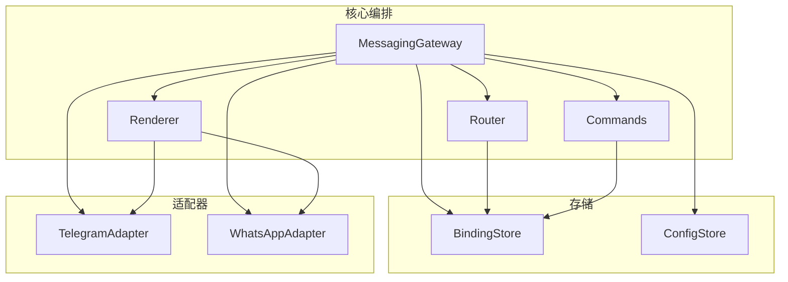
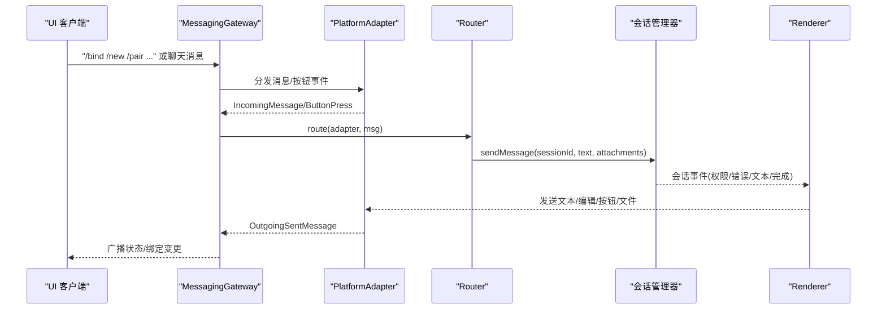
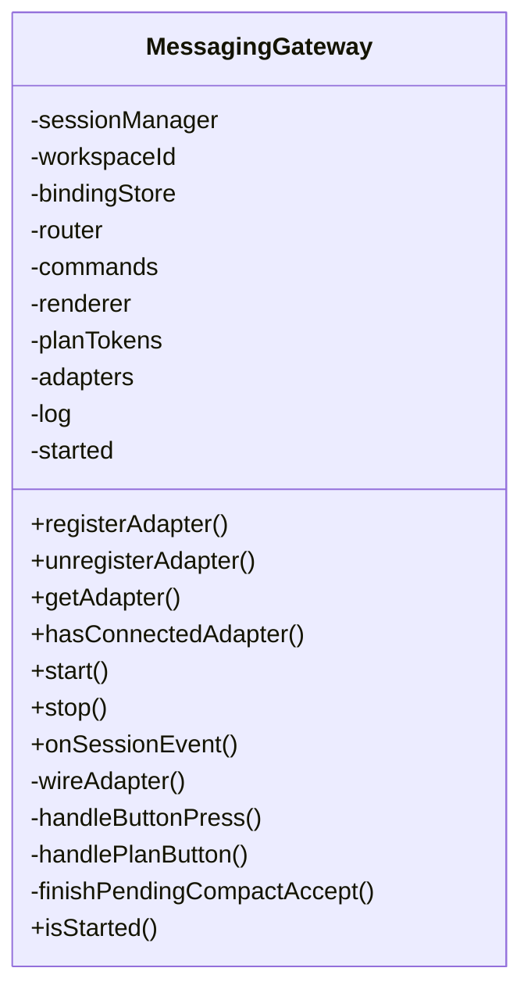
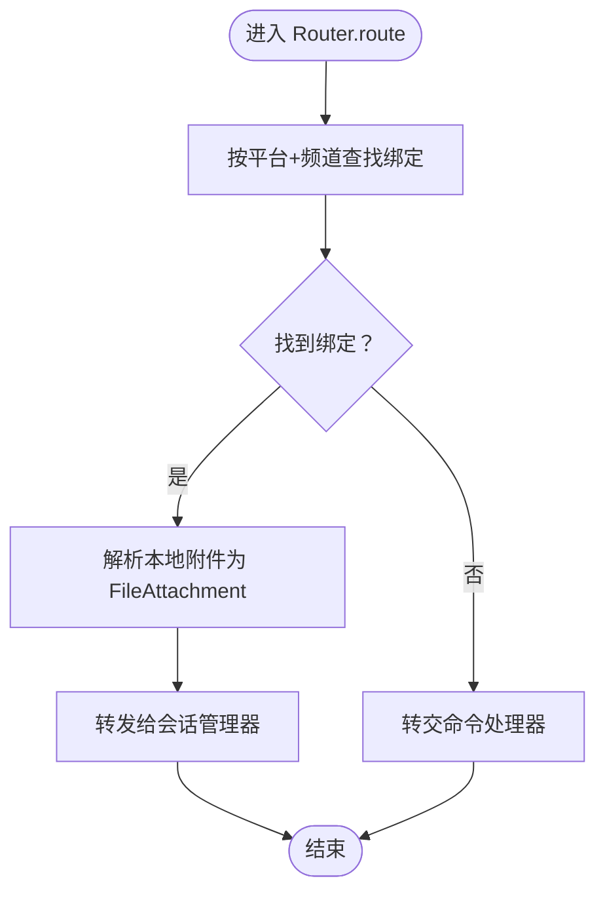
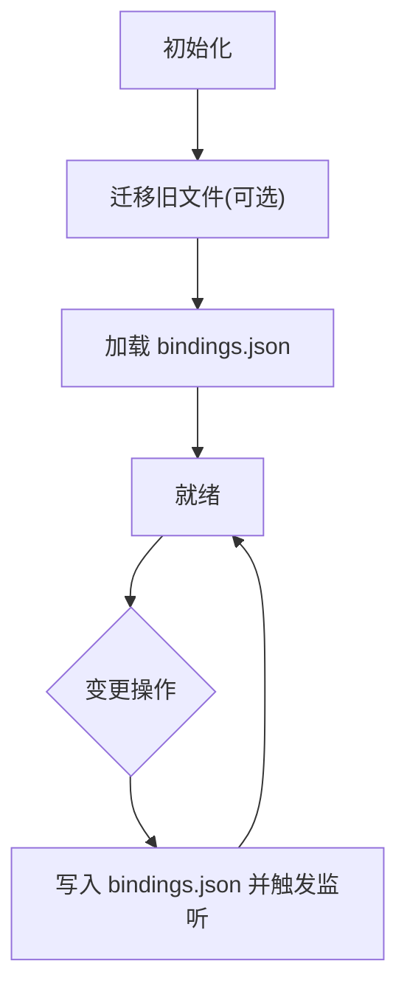
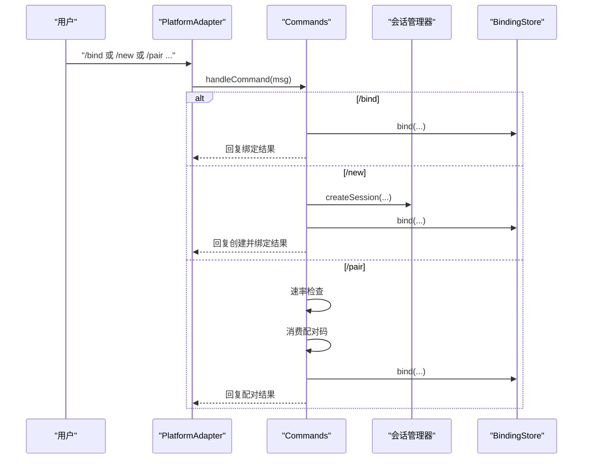
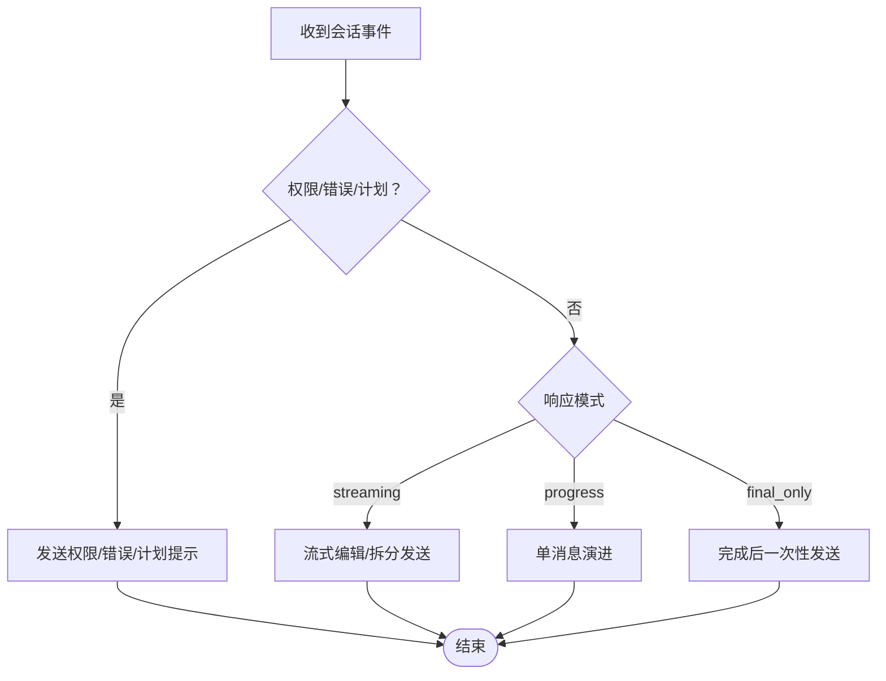
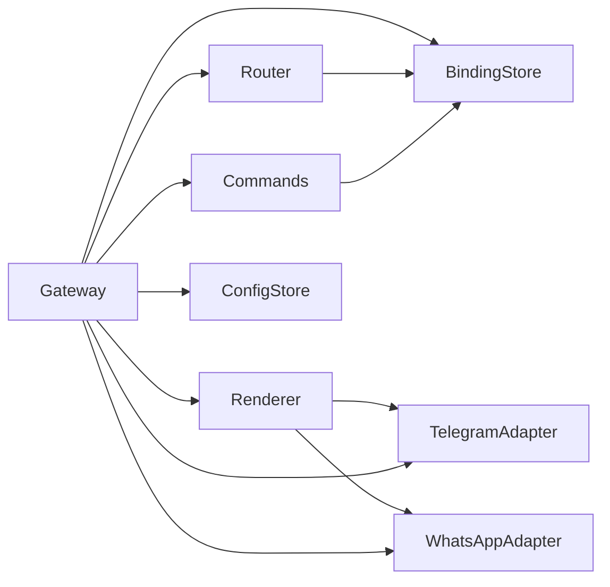

# 消息网关

<cite>
**本文引用的文件**
- [packages/messaging-gateway/src/index.ts](file://packages/messaging-gateway/src/index.ts)
- [packages/messaging-gateway/src/gateway.ts](file://packages/messaging-gateway/src/gateway.ts)
- [packages/messaging-gateway/src/router.ts](file://packages/messaging-gateway/src/router.ts)
- [packages/messaging-gateway/src/binding-store.ts](file://packages/messaging-gateway/src/binding-store.ts)
- [packages/messaging-gateway/src/config-store.ts](file://packages/messaging-gateway/src/config-store.ts)
- [packages/messaging-gateway/src/adapters/telegram/index.ts](file://packages/messaging-gateway/src/adapters/telegram/index.ts)
- [packages/messaging-gateway/src/adapters/whatsapp/index.ts](file://packages/messaging-gateway/src/adapters/whatsapp/index.ts)
- [packages/messaging-gateway/src/types.ts](file://packages/messaging-gateway/src/types.ts)
- [packages/messaging-gateway/src/commands.ts](file://packages/messaging-gateway/src/commands.ts)
- [packages/messaging-gateway/src/renderer.ts](file://packages/messaging-gateway/src/renderer.ts)
- [packages/messaging-gateway/src/pairing.ts](file://packages/messaging-gateway/src/pairing.ts)
- [packages/shared/src/protocol/channels.ts](file://packages/shared/src/protocol/channels.ts)
</cite>

## 目录
1. [简介](#简介)
2. [项目结构](#项目结构)
3. [核心组件](#核心组件)
4. [架构总览](#架构总览)
5. [详细组件分析](#详细组件分析)
6. [依赖关系分析](#依赖关系分析)
7. [性能考量](#性能考量)
8. [故障排查指南](#故障排查指南)
9. [结论](#结论)
10. [附录](#附录)

## 简介
本文件系统性阐述消息网关的设计与实现，覆盖路由器的消息路由机制、绑定存储的通道绑定管理、配置存储的动态配置更新；详解多平台适配器（Telegram 与 WhatsApp）的统一接入方式；给出启动流程、生命周期管理、错误处理与重连策略；并提供配置项、性能调优参数与监控指标使用指南，最后附带扩展新平台适配器的实践路径。

## 项目结构
消息网关位于 packages/messaging-gateway，采用“核心编排 + 平台适配器 + 存储层”的分层组织：
- 核心编排：Gateway 负责注册/销毁适配器、转发消息、处理按钮事件、驱动渲染器
- 路由层：Router 将入站消息按绑定路由至会话管理器，并处理附件转换
- 存储层：BindingStore 持久化通道绑定；ConfigStore 持久化消息配置
- 渲染层：Renderer 将会话事件按响应模式渲染为聊天消息
- 适配器层：TelegramAdapter（轮询）、WhatsAppAdapter（子进程）
- 命令层：Commands 处理 /bind、/new、/pair、/unbind、/help、/status、/stop 等命令
- 配对管理：PairingCodeManager 提供一次性配对码的签发与消费

图表来源
- [packages/messaging-gateway/src/gateway.ts:77-135](file://packages/messaging-gateway/src/gateway.ts#L77-L135)
- [packages/messaging-gateway/src/router.ts:25-31](file://packages/messaging-gateway/src/router.ts#L25-L31)
- [packages/messaging-gateway/src/binding-store.ts:31-49](file://packages/messaging-gateway/src/binding-store.ts#L31-L49)
- [packages/messaging-gateway/src/config-store.ts:25-37](file://packages/messaging-gateway/src/config-store.ts#L25-L37)
- [packages/messaging-gateway/src/adapters/telegram/index.ts:114-127](file://packages/messaging-gateway/src/adapters/telegram/index.ts#L114-L127)
- [packages/messaging-gateway/src/adapters/whatsapp/index.ts:110-119](file://packages/messaging-gateway/src/adapters/whatsapp/index.ts#L110-L119)

章节来源
- [packages/messaging-gateway/src/index.ts:1-59](file://packages/messaging-gateway/src/index.ts#L1-L59)

## 核心组件
- MessagingGateway：网关核心，负责适配器注册/销毁、消息与按钮事件入口、会话事件广播、计划审批与紧凑执行等
- Router：根据绑定将入站消息路由到会话管理器，处理本地附件转 FileAttachment
- BindingStore：工作区范围内的通道绑定持久化，支持 bind/unbind/unbindById/unbindSession 查询与变更
- ConfigStore：工作区范围内的消息配置持久化，支持 get/update
- Commands：聊天命令处理，支持 /new、/bind、/pair、/unbind、/help、/status、/stop
- Renderer：将会话事件渲染为聊天消息，支持 streaming/progress/final_only 三种模式
- TelegramAdapter：基于 grammY 的 Telegram 轮询适配器，支持文本、图片、文档、语音、视频、内联按钮
- WhatsAppAdapter：通过子进程运行 Baileys 的 WhatsApp 适配器，支持 QR/手机号配对、自对话模式、超时控制
- PairingCodeManager：一次性配对码签发与消费，含速率限制与过期清理

章节来源
- [packages/messaging-gateway/src/gateway.ts:77-135](file://packages/messaging-gateway/src/gateway.ts#L77-L135)
- [packages/messaging-gateway/src/router.ts:25-104](file://packages/messaging-gateway/src/router.ts#L25-L104)
- [packages/messaging-gateway/src/binding-store.ts:31-248](file://packages/messaging-gateway/src/binding-store.ts#L31-L248)
- [packages/messaging-gateway/src/config-store.ts:25-112](file://packages/messaging-gateway/src/config-store.ts#L25-L112)
- [packages/messaging-gateway/src/commands.ts:45-384](file://packages/messaging-gateway/src/commands.ts#L45-L384)
- [packages/messaging-gateway/src/renderer.ts:101-720](file://packages/messaging-gateway/src/renderer.ts#L101-L720)
- [packages/messaging-gateway/src/adapters/telegram/index.ts:114-571](file://packages/messaging-gateway/src/adapters/telegram/index.ts#L114-L571)
- [packages/messaging-gateway/src/adapters/whatsapp/index.ts:110-491](file://packages/messaging-gateway/src/adapters/whatsapp/index.ts#L110-L491)
- [packages/messaging-gateway/src/pairing.ts:44-162](file://packages/messaging-gateway/src/pairing.ts#L44-L162)

## 架构总览
消息网关在工作区内单实例运行，编排适配器、路由器、渲染器与绑定存储协同工作。适配器负责从平台拉取/推送消息，路由器按绑定路由到会话管理器，渲染器将会话事件渲染为聊天消息，绑定存储持久化通道绑定，配置存储持久化消息配置。

图表来源
- [packages/messaging-gateway/src/gateway.ts:220-239](file://packages/messaging-gateway/src/gateway.ts#L220-L239)
- [packages/messaging-gateway/src/router.ts:33-79](file://packages/messaging-gateway/src/router.ts#L33-L79)
- [packages/messaging-gateway/src/renderer.ts:134-168](file://packages/messaging-gateway/src/renderer.ts#L134-L168)

## 详细组件分析

### 组件一：MessagingGateway（网关核心）
- 角色与职责
  - 注册/替换/注销适配器，维护连接状态
  - 将适配器消息事件转交命令处理器或路由器
  - 处理按钮点击（绑定、权限、计划审批/紧凑执行）
  - 接收会话事件并通过渲染器输出到聊天
  - 管理计划令牌与紧凑执行队列
- 关键流程
  - 启动：wireAdapter 注册适配器回调
  - 停止：逐个销毁适配器
  - 按钮处理：区分 bind/perm/plan 三类
  - 计划处理：accept/compact 两种路径，compact 支持会话压缩后执行
- 生命周期
  - start()/stop() 控制适配器生命周期
  - isConnected()/hasConnectedAdapter() 查询连接状态
- 错误处理
  - 适配器销毁失败记录告警
  - 路由失败向聊天回显错误信息
  - 渲染失败记录日志并继续

图表来源
- [packages/messaging-gateway/src/gateway.ts:77-482](file://packages/messaging-gateway/src/gateway.ts#L77-L482)

章节来源
- [packages/messaging-gateway/src/gateway.ts:77-482](file://packages/messaging-gateway/src/gateway.ts#L77-L482)

### 组件二：Router（路由器）
- 功能
  - 根据 (platform, channelId) 查找绑定
  - 若绑定存在：解析本地附件为 FileAttachment，转发给会话管理器
  - 若绑定不存在：转交命令处理器处理 /bind、/new 等
- 附件处理
  - 仅当 IncomingAttachment.localPath 存在时才转发
  - 使用 readFileAttachment 转换为 FileAttachment
- 错误处理
  - 路由失败向聊天回显错误信息

图表来源
- [packages/messaging-gateway/src/router.ts:33-102](file://packages/messaging-gateway/src/router.ts#L33-L102)

章节来源
- [packages/messaging-gateway/src/router.ts:25-104](file://packages/messaging-gateway/src/router.ts#L25-L104)

### 组件三：BindingStore（绑定存储）
- 功能
  - bind：按频道唯一性绑定，自动驱逐旧绑定
  - unbind/unbindById/unbindSession：解绑
  - findByChannel/findBySession/getAll：查询
  - onChange：变更监听回调
  - 持久化：bindings.json，支持迁移
- 迁移
  - 兼容旧目录 bindings.json 的一次性迁移

图表来源
- [packages/messaging-gateway/src/binding-store.ts:174-235](file://packages/messaging-gateway/src/binding-store.ts#L174-L235)

章节来源
- [packages/messaging-gateway/src/binding-store.ts:31-248](file://packages/messaging-gateway/src/binding-store.ts#L31-L248)

### 组件四：ConfigStore（配置存储）
- 功能
  - get：获取当前配置快照
  - update：部分更新配置并持久化
  - 持久化：config.json，支持迁移
- 默认值
  - 基于 DEFAULT_MESSAGING_CONFIG

章节来源
- [packages/messaging-gateway/src/config-store.ts:25-112](file://packages/messaging-gateway/src/config-store.ts#L25-L112)

### 组件五：Commands（命令处理器）
- 支持命令
  - /new：创建会话并绑定
  - /bind：绑定现有会话（支持索引/ID）
  - /pair：消费一次性配对码
  - /unbind：解绑
  - /help：帮助
  - /status：查看当前绑定
  - /stop：取消当前处理
- 速率限制
  - PairingCodeConsumer 对 /pair 消费进行速率限制

图表来源
- [packages/messaging-gateway/src/commands.ts:58-301](file://packages/messaging-gateway/src/commands.ts#L58-L301)

章节来源
- [packages/messaging-gateway/src/commands.ts:45-384](file://packages/messaging-gateway/src/commands.ts#L45-L384)

### 组件六：Renderer（渲染器）
- 响应模式
  - streaming：逐块编辑（Telegram），多消息
  - progress：单条演进消息，首活动发“💭 thinking…”，工具阶段显示“🔧 工具…”
  - final_only：仅在完成时发送最终文本
- 权限/错误/计划
  - 权限请求：支持内联按钮（Telegram）或桌面批准（WhatsApp）
  - 错误：统一以“❌”前缀提示
  - 计划：Telegram 支持内联“接受/紧凑”按钮，记录消息ID用于禁用重复点击
- 编辑退避
  - 遇到 429 自动指数退避，上限保护

图表来源
- [packages/messaging-gateway/src/renderer.ts:134-168](file://packages/messaging-gateway/src/renderer.ts#L134-L168)
- [packages/messaging-gateway/src/renderer.ts:579-603](file://packages/messaging-gateway/src/renderer.ts#L579-L603)

章节来源
- [packages/messaging-gateway/src/renderer.ts:101-720](file://packages/messaging-gateway/src/renderer.ts#L101-L720)

### 组件七：TelegramAdapter（Telegram 适配器）
- 特性
  - 轮询模式（grammY Bot#start），私聊过滤
  - 文本、图片、文档、语音、视频附件下载到临时目录
  - 内联按钮回调、消息编辑、发送文件
  - 超时保护：bot.init/deleteWebhook 增加超时包装
- 附件大小限制与扩展名推断
- 日志增强：描述 grammY 错误链路

章节来源
- [packages/messaging-gateway/src/adapters/telegram/index.ts:114-571](file://packages/messaging-gateway/src/adapters/telegram/index.ts#L114-L571)

### 组件八：WhatsAppAdapter（WhatsApp 适配器）
- 特性
  - 子进程运行 Baileys，隔离崩溃与内存风险
  - 支持 QR 与手机号配对两种模式
  - 自对话模式（selfChatMode）与响应前缀
  - 发送超时控制与挂起发送的清理
  - 事件广播：qr/pairing_code/connected/disconnected/unavailable/error
- 生命周期
  - initialize：启动子进程、发送 start 命令
  - destroy：优雅关闭，超时强制 kill

章节来源
- [packages/messaging-gateway/src/adapters/whatsapp/index.ts:110-491](file://packages/messaging-gateway/src/adapters/whatsapp/index.ts#L110-L491)

### 组件九：PairingCodeManager（配对码管理）
- 一次性配对码
  - 6 位十进制数，5 分钟 TTL
  - 内存存储，不落盘
- 速率限制
  - 每分钟最多生成 N 个（防御泄漏 token 的暴力枚举）
  - 每分钟最多消费 M 次（/pair 消费速率限制）
- 原子消费
  - 成功消费后立即删除，避免重放

章节来源
- [packages/messaging-gateway/src/pairing.ts:44-162](file://packages/messaging-gateway/src/pairing.ts#L44-L162)

## 依赖关系分析
- 组件耦合
  - Gateway 依赖 Router/Commands/Renderer/BindingStore/ConfigStore/适配器
  - Router 依赖 BindingStore 与会话管理器
  - Renderer 依赖适配器能力与绑定配置
  - Commands 依赖 BindingStore 与会话管理器
- 外部依赖
  - Telegram：grammY
  - WhatsApp：子进程 + @craft-agent/messaging-whatsapp-worker 协议
  - 共享协议：RPC 通道定义

图表来源
- [packages/messaging-gateway/src/gateway.ts:11-15](file://packages/messaging-gateway/src/gateway.ts#L11-L15)
- [packages/messaging-gateway/src/router.ts:11-16](file://packages/messaging-gateway/src/router.ts#L11-L16)
- [packages/messaging-gateway/src/renderer.ts:28-35](file://packages/messaging-gateway/src/renderer.ts#L28-L35)
- [packages/messaging-gateway/src/commands.ts:13-21](file://packages/messaging-gateway/src/commands.ts#L13-L21)

章节来源
- [packages/shared/src/protocol/channels.ts:380-408](file://packages/shared/src/protocol/channels.ts#L380-L408)

## 性能考量
- 编辑节流与退避
  - Telegram 编辑间隔默认 3500ms，遇 429 指数退避，上限 15 秒，30 秒后恢复
- 文本拆分
  - 超长文本按最大长度拆分发送，优先在段落/行/空格处切分
- 附件处理
  - 仅转发本地路径存在的附件，避免无效 IO
  - Telegram 附件大小硬上限 20MB，提前拒绝
- 会话事件广播
  - 仅对已绑定且已连接的适配器广播，减少无效 IO
- 适配器超时
  - Telegram 初始化/删除 webhook 超时保护
  - WhatsApp 发送超时默认 30 秒，可配置

章节来源
- [packages/messaging-gateway/src/renderer.ts:77-79](file://packages/messaging-gateway/src/renderer.ts#L77-L79)
- [packages/messaging-gateway/src/renderer.ts:579-603](file://packages/messaging-gateway/src/renderer.ts#L579-L603)
- [packages/messaging-gateway/src/renderer.ts:677-696](file://packages/messaging-gateway/src/renderer.ts#L677-L696)
- [packages/messaging-gateway/src/adapters/telegram/index.ts:31-32](file://packages/messaging-gateway/src/adapters/telegram/index.ts#L31-L32)
- [packages/messaging-gateway/src/adapters/telegram/index.ts:64-75](file://packages/messaging-gateway/src/adapters/telegram/index.ts#L64-L75)
- [packages/messaging-gateway/src/adapters/whatsapp/index.ts:54-59](file://packages/messaging-gateway/src/adapters/whatsapp/index.ts#L54-L59)

## 故障排查指南
- Telegram 无消息
  - 检查 webhook 是否残留：初始化前先删除 webhook
  - 检查 bot.init 是否超时：增加日志定位网络/令牌问题
  - 检查私聊过滤：非私聊会被忽略
- WhatsApp 无响应
  - 检查子进程是否退出：查看 stderr 日志与退出码
  - 检查配对流程：QR/手机号配对是否完成
  - 检查发送超时：默认 30 秒，必要时缩短以快速暴露问题
- 编辑失败/429
  - 渲染器自动退避，等待恢复；可降低编辑频率
- 附件过大/下载失败
  - Telegram 会直接回显“过大”或“下载失败”，不会转发给会话
- 绑定/解绑异常
  - 检查 bindings.json 是否成功写入，确认 onChange 监听是否触发

章节来源
- [packages/messaging-gateway/src/adapters/telegram/index.ts:300-357](file://packages/messaging-gateway/src/adapters/telegram/index.ts#L300-L357)
- [packages/messaging-gateway/src/adapters/telegram/index.ts:382-406](file://packages/messaging-gateway/src/adapters/telegram/index.ts#L382-L406)
- [packages/messaging-gateway/src/adapters/whatsapp/index.ts:183-201](file://packages/messaging-gateway/src/adapters/whatsapp/index.ts#L183-L201)
- [packages/messaging-gateway/src/renderer.ts:579-603](file://packages/messaging-gateway/src/renderer.ts#L579-L603)
- [packages/messaging-gateway/src/binding-store.ts:218-235](file://packages/messaging-gateway/src/binding-store.ts#L218-L235)

## 结论
消息网关通过清晰的分层与强约束的适配器接口，实现了 Telegram 与 WhatsApp 的统一接入。BindingStore 与 ConfigStore 提供可靠的持久化；Router 与 Renderer 在消息路由与渲染上兼顾兼容性与用户体验；Commands 与 PairingCodeManager 提供安全便捷的绑定与配对能力。整体设计具备良好的可扩展性与可观测性，便于后续扩展更多平台适配器。

## 附录

### 启动流程与生命周期
- 启动
  - 创建 BindingStore/ConfigStore/Router/Commands/Renderer
  - 注册适配器，wireAdapter 设置消息/按钮回调
  - start 标记启动完成
- 停止
  - 逐个销毁适配器，清空适配器表
  - stop 标记停止完成

章节来源
- [packages/messaging-gateway/src/gateway.ts:91-218](file://packages/messaging-gateway/src/gateway.ts#L91-L218)

### 配置选项与默认值
- MessagingConfig
  - enabled：是否启用消息功能
  - platforms.telegram.enabled：Telegram 开关
  - platforms.whatsapp.enabled：WhatsApp 开关
  - platforms.whatsapp.selfChatMode：自对话模式开关（默认开启）
- BindingConfig
  - responseMode：响应模式（streaming/progress/final_only）
  - showToolActivity：显示工具活动摘要
  - approvalChannel：审批渠道（chat/app）
  - editIntervalMs：Telegram 编辑间隔（默认 3500ms）

章节来源
- [packages/messaging-gateway/src/types.ts:257-281](file://packages/messaging-gateway/src/types.ts#L257-L281)
- [packages/messaging-gateway/src/types.ts:192-239](file://packages/messaging-gateway/src/types.ts#L192-L239)

### 监控指标与日志字段
- 通用日志上下文
  - component/workspaceId/sessionId/platform/channelId/bindingId/event
- 关键事件
  - gateway_started、adapter_registered/adapter_stopped、adapter_destroy_failed
  - message_routed/message_route_failed、binding_created/binding_removed
  - plan_accept_failed/plan_compact_failed/plan_post_compact_accept_failed
  - telegram_non_private_dropped、whatsapp_worker_exited、whatsapp_send_timeout
- 建议采集
  - 每分钟 /pair 消费次数、绑定/解绑次数、路由失败次数、渲染退避次数

章节来源
- [packages/messaging-gateway/src/gateway.ts:24-36](file://packages/messaging-gateway/src/gateway.ts#L24-L36)
- [packages/messaging-gateway/src/gateway.ts:195-218](file://packages/messaging-gateway/src/gateway.ts#L195-L218)
- [packages/messaging-gateway/src/router.ts:54-68](file://packages/messaging-gateway/src/router.ts#L54-L68)
- [packages/messaging-gateway/src/binding-store.ts:105-147](file://packages/messaging-gateway/src/binding-store.ts#L105-L147)
- [packages/messaging-gateway/src/renderer.ts:595-600](file://packages/messaging-gateway/src/renderer.ts#L595-L600)
- [packages/messaging-gateway/src/adapters/whatsapp/index.ts:351-358](file://packages/messaging-gateway/src/adapters/whatsapp/index.ts#L351-L358)

### 扩展新平台适配器（实践路径）
- 实现 PlatformAdapter 接口
  - initialize/configure：建立连接（轮询/长连接/WebHook）
  - onMessage/onButtonPress：注册回调
  - sendText/sendButtons/sendFile/sendTyping：消息发送能力
  - isConnected/destroy：连接状态与资源释放
  - 可选：clearButtons、handleWebhook
- 在网关中注册
  - new 你的适配器实例
  - gateway.registerAdapter(adapter)
  - 确保 start()/stop() 生命周期正确
- 集成命令与渲染
  - Commands 会自动识别适配器能力（如 inlineButtons）
  - Renderer 依据适配器能力选择最佳渲染策略
- 测试与验证
  - 覆盖绑定/解绑、消息收发、按钮交互、权限/错误/计划场景
  - 关注日志与错误回显，确保用户体验一致

章节来源
- [packages/messaging-gateway/src/types.ts:144-171](file://packages/messaging-gateway/src/types.ts#L144-L171)
- [packages/messaging-gateway/src/gateway.ts:141-175](file://packages/messaging-gateway/src/gateway.ts#L141-L175)
- [packages/messaging-gateway/src/commands.ts:208-232](file://packages/messaging-gateway/src/commands.ts#L208-L232)
- [packages/messaging-gateway/src/renderer.ts:160-168](file://packages/messaging-gateway/src/renderer.ts#L160-L168)