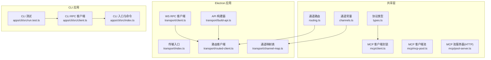
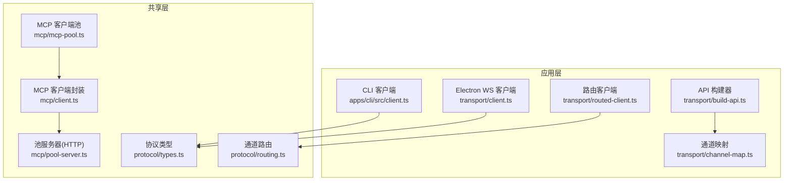
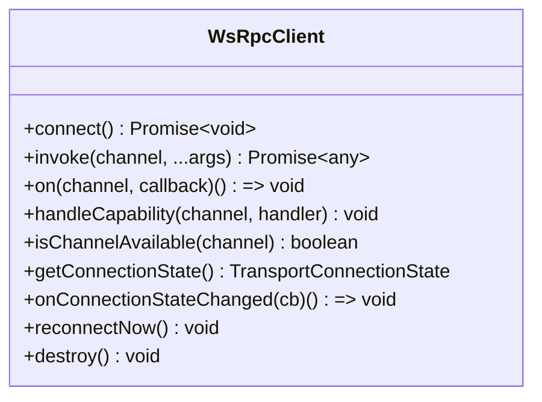
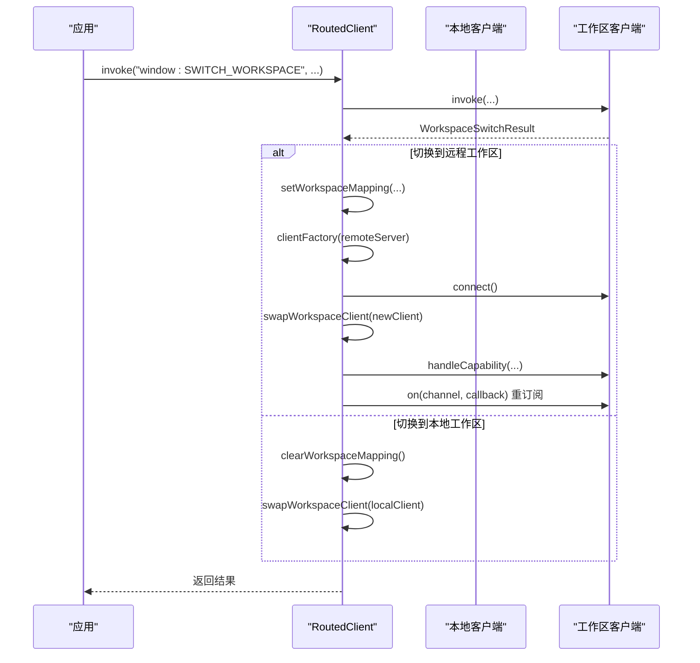
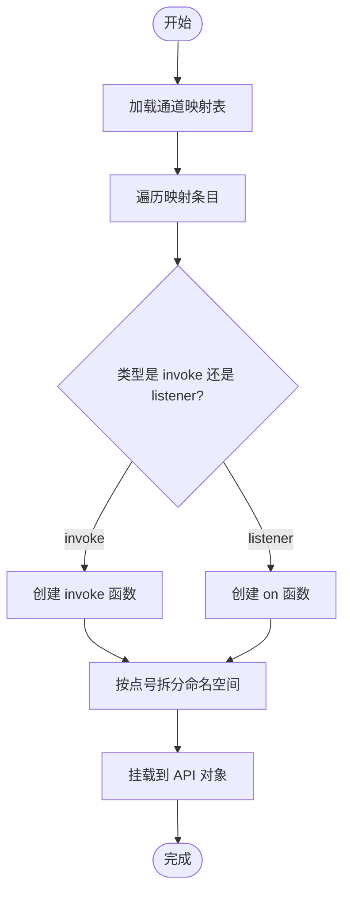
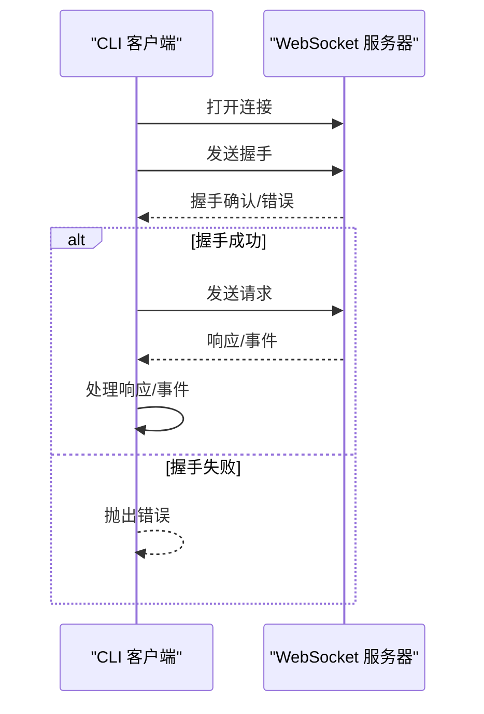
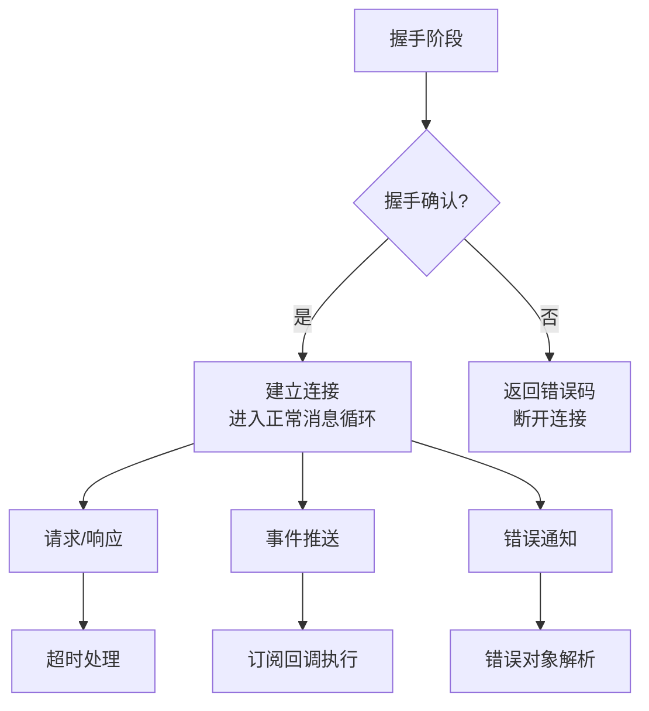
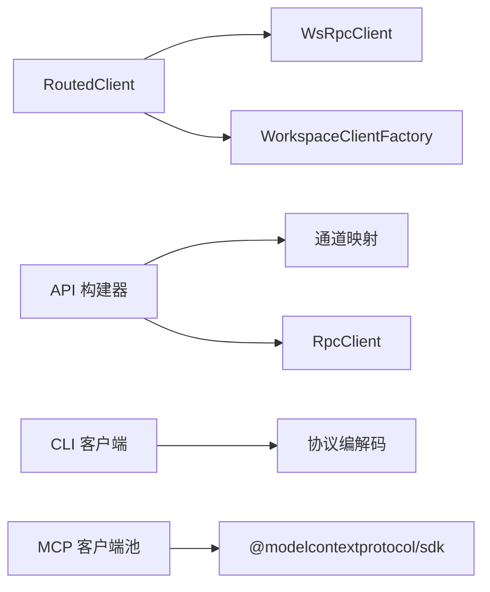

# MCP 客户端实现

<cite>
**本文档引用的文件**
- [apps/cli/src/client.ts](file://apps/cli/src/client.ts)
- [apps/cli/src/index.ts](file://apps/cli/src/index.ts)
- [apps/cli/src/run.test.ts](file://apps/cli/src/run.test.ts)
- [apps/electron/src/transport/client.ts](file://apps/electron/src/transport/client.ts)
- [apps/electron/src/transport/routed-client.ts](file://apps/electron/src/transport/routed-client.ts)
- [apps/electron/src/transport/build-api.ts](file://apps/electron/src/transport/build-api.ts)
- [apps/electron/src/transport/channel-map.ts](file://apps/electron/src/transport/channel-map.ts)
- [apps/electron/src/transport/index.ts](file://apps/electron/src/transport/index.ts)
- [apps/electron/src/transport/codec.ts](file://apps/electron/src/transport/codec.ts)
- [packages/shared/src/protocol/types.ts](file://packages/shared/src/protocol/types.ts)
- [packages/shared/src/protocol/routing.ts](file://packages/shared/src/protocol/routing.ts)
- [packages/shared/src/protocol/channels.ts](file://packages/shared/src/protocol/channels.ts)
- [packages/shared/src/mcp/client.ts](file://packages/shared/src/mcp/client.ts)
- [packages/shared/src/mcp/mcp-pool.ts](file://packages/shared/src/mcp/mcp-pool.ts)
- [packages/shared/src/mcp/pool-server.ts](file://packages/shared/src/mcp/pool-server.ts)
- [packages/shared/src/mcp/validation.ts](file://packages/shared/src/mcp/validation.ts)
</cite>

## 目录
1. [简介](#简介)
2. [项目结构](#项目结构)
3. [核心组件](#核心组件)
4. [架构总览](#架构总览)
5. [详细组件分析](#详细组件分析)
6. [依赖关系分析](#依赖关系分析)
7. [性能考虑](#性能考虑)
8. [故障排除指南](#故障排除指南)
9. [结论](#结论)
10. [附录](#附录)

## 简介
本文件为 MCP（Model Context Protocol）客户端实现的技术文档，面向需要在应用中集成 MCP 客户端功能的开发者。文档覆盖以下主题：
- MCP 客户端的核心架构与职责边界
- 初始化流程与连接管理机制
- 客户端生命周期管理、连接建立过程、工具注册流程
- 与 MCP 服务器的通信协议、消息格式、事件处理机制
- 错误处理策略、重连机制、超时管理
- 客户端配置选项、认证流程、性能优化技巧
- 使用示例、最佳实践指南、常见问题解决方案

## 项目结构
该仓库采用多包/多应用结构，MCP 客户端能力主要分布在共享包与应用层：
- 共享协议与 MCP 客户端：位于 packages/shared，定义了 MCP 客户端 SDK 封装、客户端池、HTTP/stdio 传输、工具代理等
- Electron 应用传输层：apps/electron/src/transport 提供基于 WebSocket 的 RPC 客户端、路由客户端、通道映射与 API 构建器
- CLI 应用：apps/cli/src 提供最小化的 WebSocket RPC 客户端与命令行工具，演示 MCP 工具调用与会话流式输出
- 协议类型与通道路由：packages/shared/src/protocol 定义消息信封、通道分类与路由规则



**图表来源**
- [packages/shared/src/protocol/types.ts:11-63](file://packages/shared/src/protocol/types.ts#L11-L63)
- [packages/shared/src/protocol/routing.ts:17-211](file://packages/shared/src/protocol/routing.ts#L17-L211)
- [packages/shared/src/protocol/channels.ts:440-448](file://packages/shared/src/protocol/channels.ts#L440-L448)
- [packages/shared/src/mcp/client.ts:72-164](file://packages/shared/src/mcp/client.ts#L72-L164)
- [packages/shared/src/mcp/mcp-pool.ts:101-460](file://packages/shared/src/mcp/mcp-pool.ts#L101-L460)
- [packages/shared/src/mcp/pool-server.ts:35-80](file://packages/shared/src/mcp/pool-server.ts#L35-L80)
- [apps/electron/src/transport/index.ts:1-6](file://apps/electron/src/transport/index.ts#L1-L6)
- [apps/electron/src/transport/client.ts:1-18](file://apps/electron/src/transport/client.ts#L1-L18)
- [apps/electron/src/transport/routed-client.ts:40-256](file://apps/electron/src/transport/routed-client.ts#L40-L256)
- [apps/electron/src/transport/build-api.ts:25-66](file://apps/electron/src/transport/build-api.ts#L25-L66)
- [apps/electron/src/transport/channel-map.ts:19-421](file://apps/electron/src/transport/channel-map.ts#L19-L421)
- [apps/cli/src/client.ts:38-240](file://apps/cli/src/client.ts#L38-L240)
- [apps/cli/src/index.ts:1-2076](file://apps/cli/src/index.ts#L1-L2076)
- [apps/cli/src/run.test.ts:1-429](file://apps/cli/src/run.test.ts#L1-L429)

**章节来源**
- [apps/electron/src/transport/index.ts:1-6](file://apps/electron/src/transport/index.ts#L1-L6)
- [apps/electron/src/transport/client.ts:1-18](file://apps/electron/src/transport/client.ts#L1-L18)
- [apps/electron/src/transport/routed-client.ts:40-256](file://apps/electron/src/transport/routed-client.ts#L40-L256)
- [apps/electron/src/transport/build-api.ts:25-66](file://apps/electron/src/transport/build-api.ts#L25-L66)
- [apps/electron/src/transport/channel-map.ts:19-421](file://apps/electron/src/transport/channel-map.ts#L19-L421)
- [apps/cli/src/client.ts:38-240](file://apps/cli/src/client.ts#L38-L240)
- [apps/cli/src/index.ts:1-2076](file://apps/cli/src/index.ts#L1-L2076)
- [apps/cli/src/run.test.ts:1-429](file://apps/cli/src/run.test.ts#L1-L429)
- [packages/shared/src/protocol/types.ts:11-63](file://packages/shared/src/protocol/types.ts#L11-L63)
- [packages/shared/src/protocol/routing.ts:17-211](file://packages/shared/src/protocol/routing.ts#L17-L211)
- [packages/shared/src/protocol/channels.ts:440-448](file://packages/shared/src/protocol/channels.ts#L440-L448)
- [packages/shared/src/mcp/client.ts:72-164](file://packages/shared/src/mcp/client.ts#L72-L164)
- [packages/shared/src/mcp/mcp-pool.ts:101-460](file://packages/shared/src/mcp/mcp-pool.ts#L101-L460)
- [packages/shared/src/mcp/pool-server.ts:35-80](file://packages/shared/src/mcp/pool-server.ts#L35-L80)

## 核心组件
本节概述 MCP 客户端实现中的关键组件及其职责。

- WebSocket RPC 客户端（Electron）
  - 提供稳定的 WebSocket 连接、请求/响应编解码、事件订阅与连接状态监听
  - 支持能力注册、通道可用性检查、连接状态委托与即时重连触发
  - 参考：[apps/electron/src/transport/client.ts:8-17](file://apps/electron/src/transport/client.ts#L8-L17)

- 路由客户端（RoutedClient）
  - 在本地嵌入式服务与工作区远程服务之间进行通道路由
  - 自动处理工作区切换、监听者重订阅、能力重新注册、连接状态转发
  - 参考：[apps/electron/src/transport/routed-client.ts:40-256](file://apps/electron/src/transport/routed-client.ts#L40-L256)

- 通道映射与 API 构建器
  - 将 RPC 通道映射为前端 API 方法，支持命名空间化方法与监听器绑定
  - 参考：[apps/electron/src/transport/build-api.ts:25-66](file://apps/electron/src/transport/build-api.ts#L25-L66)、[apps/electron/src/transport/channel-map.ts:19-421](file://apps/electron/src/transport/channel-map.ts#L19-L421)

- CLI RPC 客户端
  - 最小化 WebSocket RPC 客户端，用于 CLI 场景
  - 支持握手、请求超时、连接超时、事件订阅与销毁
  - 参考：[apps/cli/src/client.ts:38-240](file://apps/cli/src/client.ts#L38-L240)

- MCP 客户端封装与客户端池
  - 基于官方 SDK 的 HTTP/stdio 传输封装
  - 统一管理多个 MCP 源，提供工具发现、代理工具名生成、结果处理与大响应保护
  - 参考：[packages/shared/src/mcp/client.ts:72-164](file://packages/shared/src/mcp/client.ts#L72-L164)、[packages/shared/src/mcp/mcp-pool.ts:101-460](file://packages/shared/src/mcp/mcp-pool.ts#L101-L460)

- 协议与通道
  - 定义消息信封、错误码、通道分类与路由规则
  - 参考：[packages/shared/src/protocol/types.ts:11-80](file://packages/shared/src/protocol/types.ts#L11-L80)、[packages/shared/src/protocol/routing.ts:17-211](file://packages/shared/src/protocol/routing.ts#L17-L211)、[packages/shared/src/protocol/channels.ts:440-448](file://packages/shared/src/protocol/channels.ts#L440-L448)

**章节来源**
- [apps/electron/src/transport/client.ts:8-17](file://apps/electron/src/transport/client.ts#L8-L17)
- [apps/electron/src/transport/routed-client.ts:40-256](file://apps/electron/src/transport/routed-client.ts#L40-L256)
- [apps/electron/src/transport/build-api.ts:25-66](file://apps/electron/src/transport/build-api.ts#L25-L66)
- [apps/electron/src/transport/channel-map.ts:19-421](file://apps/electron/src/transport/channel-map.ts#L19-L421)
- [apps/cli/src/client.ts:38-240](file://apps/cli/src/client.ts#L38-L240)
- [packages/shared/src/mcp/client.ts:72-164](file://packages/shared/src/mcp/client.ts#L72-L164)
- [packages/shared/src/mcp/mcp-pool.ts:101-460](file://packages/shared/src/mcp/mcp-pool.ts#L101-L460)
- [packages/shared/src/protocol/types.ts:11-80](file://packages/shared/src/protocol/types.ts#L11-L80)
- [packages/shared/src/protocol/routing.ts:17-211](file://packages/shared/src/protocol/routing.ts#L17-L211)
- [packages/shared/src/protocol/channels.ts:440-448](file://packages/shared/src/protocol/channels.ts#L440-L448)

## 架构总览
下图展示了 MCP 客户端在不同运行环境下的整体架构与交互关系：



**图表来源**
- [apps/cli/src/client.ts:38-240](file://apps/cli/src/client.ts#L38-L240)
- [apps/electron/src/transport/client.ts:8-17](file://apps/electron/src/transport/client.ts#L8-L17)
- [apps/electron/src/transport/routed-client.ts:40-256](file://apps/electron/src/transport/routed-client.ts#L40-L256)
- [apps/electron/src/transport/build-api.ts:25-66](file://apps/electron/src/transport/build-api.ts#L25-L66)
- [apps/electron/src/transport/channel-map.ts:19-421](file://apps/electron/src/transport/channel-map.ts#L19-L421)
- [packages/shared/src/protocol/types.ts:11-63](file://packages/shared/src/protocol/types.ts#L11-L63)
- [packages/shared/src/protocol/routing.ts:17-211](file://packages/shared/src/protocol/routing.ts#L17-L211)
- [packages/shared/src/mcp/client.ts:72-164](file://packages/shared/src/mcp/client.ts#L72-L164)
- [packages/shared/src/mcp/mcp-pool.ts:101-460](file://packages/shared/src/mcp/mcp-pool.ts#L101-L460)
- [packages/shared/src/mcp/pool-server.ts:35-80](file://packages/shared/src/mcp/pool-server.ts#L35-L80)

## 详细组件分析

### WebSocket RPC 客户端（Electron）
- 职责
  - 建立与维护 WebSocket 连接
  - 编解码消息信封，处理请求/响应、事件与错误
  - 提供能力注册、通道可用性检查、连接状态监听与即时重连触发
- 关键特性
  - 握手阶段携带协议版本、工作区 ID 与令牌
  - 请求超时与连接超时控制
  - 事件订阅与回调执行隔离
  - 销毁时清理挂起请求与连接
- 参考实现路径
  - [apps/electron/src/transport/client.ts:8-17](file://apps/electron/src/transport/client.ts#L8-L17)



**图表来源**
- [apps/electron/src/transport/client.ts:8-17](file://apps/electron/src/transport/client.ts#L8-L17)

**章节来源**
- [apps/electron/src/transport/client.ts:8-17](file://apps/electron/src/transport/client.ts#L8-L17)

### 路由客户端（RoutedClient）
- 职责
  - 在本地嵌入式服务与工作区远程服务之间进行通道路由
  - 自动处理工作区切换、监听者重订阅、能力重新注册、连接状态转发
- 关键流程
  - invoke：根据通道类型选择本地或远程客户端；必要时替换工作区 ID 参数
  - on：对远程可路由通道进行监听注册与重订阅
  - handleCapability：在两个客户端上注册能力
  - 工作区切换：创建新客户端、交换当前客户端、重绑连接状态、触发“过期重连”事件
- 参考实现路径
  - [apps/electron/src/transport/routed-client.ts:40-256](file://apps/electron/src/transport/routed-client.ts#L40-L256)



**图表来源**
- [apps/electron/src/transport/routed-client.ts:184-244](file://apps/electron/src/transport/routed-client.ts#L184-L244)

**章节来源**
- [apps/electron/src/transport/routed-client.ts:40-256](file://apps/electron/src/transport/routed-client.ts#L40-L256)

### 通道映射与 API 构建器
- 职责
  - 将 RPC 通道映射为前端 API 方法，支持命名空间化方法与监听器绑定
  - 提供通道可用性检查，便于 UI 侧动态启用/禁用
- 关键点
  - ChannelMapEntry 定义 invoke 或 listener 类型
  - buildClientApi 动态构建 API 对象，支持嵌套命名空间
- 参考实现路径
  - [apps/electron/src/transport/build-api.ts:25-66](file://apps/electron/src/transport/build-api.ts#L25-L66)
  - [apps/electron/src/transport/channel-map.ts:19-421](file://apps/electron/src/transport/channel-map.ts#L19-L421)



**图表来源**
- [apps/electron/src/transport/build-api.ts:25-66](file://apps/electron/src/transport/build-api.ts#L25-L66)
- [apps/electron/src/transport/channel-map.ts:19-421](file://apps/electron/src/transport/channel-map.ts#L19-L421)

**章节来源**
- [apps/electron/src/transport/build-api.ts:25-66](file://apps/electron/src/transport/build-api.ts#L25-L66)
- [apps/electron/src/transport/channel-map.ts:19-421](file://apps/electron/src/transport/channel-map.ts#L19-L421)

### CLI RPC 客户端
- 职责
  - 最小化 WebSocket RPC 客户端，适用于 CLI 场景
  - 支持握手、请求/响应、事件订阅、连接超时与请求超时
- 关键流程
  - connect：建立 WebSocket，发送握手，等待握手确认或错误
  - invoke：构造请求信封，等待响应或错误
  - on：订阅事件通道，回调执行隔离
  - destroy：关闭连接并拒绝所有挂起请求
- 参考实现路径
  - [apps/cli/src/client.ts:38-240](file://apps/cli/src/client.ts#L38-L240)



**图表来源**
- [apps/cli/src/client.ts:61-129](file://apps/cli/src/client.ts#L61-L129)

**章节来源**
- [apps/cli/src/client.ts:38-240](file://apps/cli/src/client.ts#L38-L240)

### MCP 客户端封装与客户端池
- 职责
  - 基于官方 SDK 的 HTTP/stdio 传输封装
  - 统一管理多个 MCP 源，提供工具发现、代理工具名生成、结果处理与大响应保护
- 关键流程
  - connect/connectInProcess：连接 MCP 源，缓存工具列表，生成代理工具名映射
  - sync：同步源集合，断开移除的源，重连配置变更的源
  - callTool：通过代理工具名定位源，调用工具并处理文本/二进制内容块
  - pool-server：提供无状态 HTTP MCP 服务器，供外部客户端连接
- 参考实现路径
  - [packages/shared/src/mcp/client.ts:72-164](file://packages/shared/src/mcp/client.ts#L72-L164)
  - [packages/shared/src/mcp/mcp-pool.ts:101-460](file://packages/shared/src/mcp/mcp-pool.ts#L101-L460)
  - [packages/shared/src/mcp/pool-server.ts:35-80](file://packages/shared/src/mcp/pool-server.ts#L35-L80)

```mermaid
classDiagram
class CraftMcpClient {
-client Client
-transport Transport
-connected bool
+connect() Promise~void~
+listTools() Promise~Tool[]~
+callTool(name, args) Promise~any~
+getServerInfo() {name, version}?
+close() Promise~void~
}
class McpClientPool {
-clients Map~slug, PoolClient~
-activeConfigs Map~slug, SdkMcpServerConfig~
-toolCache Map~slug, Tool[]~
-proxyTools Map~proxyName, {slug, originalName}~
+connect(slug, config) Promise~void~
+connectInProcess(slug, server) Promise~void~
+disconnect(slug) Promise~void~
+disconnectAll() Promise~void~
+sync(mcpServers, apiServers) Promise~string[]~
+getTools(slug) Tool[]
+getProxyToolDefs(slugs?) ProxyToolDef[]
+callTool(proxyName, args) Promise~McpToolResult~
+isProxyTool(toolName) bool
}
McpClientPool --> CraftMcpClient : "管理"
```

**图表来源**
- [packages/shared/src/mcp/client.ts:72-164](file://packages/shared/src/mcp/client.ts#L72-L164)
- [packages/shared/src/mcp/mcp-pool.ts:101-460](file://packages/shared/src/mcp/mcp-pool.ts#L101-L460)

**章节来源**
- [packages/shared/src/mcp/client.ts:72-164](file://packages/shared/src/mcp/client.ts#L72-L164)
- [packages/shared/src/mcp/mcp-pool.ts:101-460](file://packages/shared/src/mcp/mcp-pool.ts#L101-L460)
- [packages/shared/src/mcp/pool-server.ts:35-80](file://packages/shared/src/mcp/pool-server.ts#L35-L80)

### 协议与通道
- 消息信封
  - 包含 id、type、channel、args、result、error、协议版本、工作区 ID、令牌等字段
  - 支持可靠投递序列号与断线重连标识
- 通道分类
  - LOCAL_ONLY：始终在本地嵌入式服务运行
  - REMOTE_ELIGIBLE：在拥有工作区的服务器上运行
- 错误码
  - HANDLER_ERROR、CHANNEL_NOT_FOUND、AUTH_FAILED、PROTOCOL_VERSION_UNSUPPORTED、SESSION_NOT_IDLE 等
- 参考实现路径
  - [packages/shared/src/protocol/types.ts:11-80](file://packages/shared/src/protocol/types.ts#L11-L80)
  - [packages/shared/src/protocol/routing.ts:17-211](file://packages/shared/src/protocol/routing.ts#L17-L211)
  - [packages/shared/src/protocol/channels.ts:440-448](file://packages/shared/src/protocol/channels.ts#L440-L448)



**图表来源**
- [packages/shared/src/protocol/types.ts:11-80](file://packages/shared/src/protocol/types.ts#L11-L80)
- [packages/shared/src/protocol/routing.ts:17-211](file://packages/shared/src/protocol/routing.ts#L17-L211)

**章节来源**
- [packages/shared/src/protocol/types.ts:11-80](file://packages/shared/src/protocol/types.ts#L11-L80)
- [packages/shared/src/protocol/routing.ts:17-211](file://packages/shared/src/protocol/routing.ts#L17-L211)
- [packages/shared/src/protocol/channels.ts:440-448](file://packages/shared/src/protocol/channels.ts#L440-L448)

## 依赖关系分析
- 组件耦合
  - RoutedClient 依赖 WsRpcClient 并持有工厂函数以创建远程客户端
  - API 构建器依赖通道映射表与 RpcClient 接口
  - CLI 客户端依赖共享协议编解码模块
  - MCP 客户端池依赖 MCP SDK 与工具缓存
- 外部依赖
  - @modelcontextprotocol/sdk（MCP 客户端封装）
  - WebSocket（Electron/CLI 传输）
  - Bun（CLI 测试与运行）



**图表来源**
- [apps/electron/src/transport/routed-client.ts:63-74](file://apps/electron/src/transport/routed-client.ts#L63-L74)
- [apps/electron/src/transport/build-api.ts:25-66](file://apps/electron/src/transport/build-api.ts#L25-L66)
- [apps/cli/src/client.ts:8-15](file://apps/cli/src/client.ts#L8-L15)
- [packages/shared/src/mcp/mcp-pool.ts:16-21](file://packages/shared/src/mcp/mcp-pool.ts#L16-L21)

**章节来源**
- [apps/electron/src/transport/routed-client.ts:63-74](file://apps/electron/src/transport/routed-client.ts#L63-L74)
- [apps/electron/src/transport/build-api.ts:25-66](file://apps/electron/src/transport/build-api.ts#L25-L66)
- [apps/cli/src/client.ts:8-15](file://apps/cli/src/client.ts#L8-L15)
- [packages/shared/src/mcp/mcp-pool.ts:16-21](file://packages/shared/src/mcp/mcp-pool.ts#L16-L21)

## 性能考虑
- 连接与握手
  - 合理设置连接超时与请求超时，避免长时间阻塞
  - 在 CLI 场景中，握手后立即切换到常规消息处理器，减少首包延迟
- 事件处理
  - 订阅回调中避免抛出异常，确保事件处理不影响客户端稳定性
- MCP 工具调用
  - 对大响应进行保护与摘要，必要时保存为文件并返回路径
  - 二进制内容块进行 base64 解码与扩展名检测，避免内存峰值
- 通道路由
  - 本地通道直连，远程通道透明代理，减少不必要的网络往返
- 资源清理
  - 销毁客户端时清理挂起请求与连接，防止内存泄漏

[本节为通用指导，无需特定文件来源]

## 故障排除指南
- 连接失败
  - 检查握手阶段是否收到错误码，如 AUTH_FAILED、PROTOCOL_VERSION_UNSUPPORTED
  - 确认 token、workspaceId、协议版本与服务器期望一致
- 请求超时
  - 调整 requestTimeout 配置，关注网络延迟与服务器负载
- 事件未到达
  - 确认订阅通道正确且未被取消
  - 检查订阅回调中是否有异常被吞掉
- MCP 工具调用失败
  - 检查工具名称是否为代理工具名（mcp__{slug}__{toolName}）
  - 确认源已连接且工具列表可用
- 工作区切换异常
  - 确保 RoutedClient 的工作区映射正确，监听者在新客户端上重新订阅

**章节来源**
- [apps/cli/src/client.ts:61-129](file://apps/cli/src/client.ts#L61-L129)
- [apps/electron/src/transport/routed-client.ts:184-244](file://apps/electron/src/transport/routed-client.ts#L184-L244)
- [packages/shared/src/protocol/types.ts:65-80](file://packages/shared/src/protocol/types.ts#L65-L80)
- [packages/shared/src/mcp/mcp-pool.ts:368-451](file://packages/shared/src/mcp/mcp-pool.ts#L368-L451)

## 结论
本技术文档系统梳理了 MCP 客户端在 Electron 与 CLI 场景下的实现方式，包括 WebSocket RPC 客户端、路由客户端、通道映射与 API 构建器，以及基于官方 SDK 的 MCP 客户端封装与客户端池。通过明确的消息协议、通道分类与错误码体系，结合超时管理、事件处理与资源清理策略，开发者可以稳定地在应用中集成 MCP 客户端功能，并在复杂的工作区与多源场景下保持良好的性能与可靠性。

[本节为总结性内容，无需特定文件来源]

## 附录

### 使用示例与最佳实践
- CLI 使用示例
  - 连接服务器并发送消息，实时流式输出事件
  - 参考：[apps/cli/src/index.ts:402-470](file://apps/cli/src/index.ts#L402-L470)
- Electron API 构建
  - 通过通道映射表构建前端 API，支持命名空间化方法
  - 参考：[apps/electron/src/transport/build-api.ts:25-66](file://apps/electron/src/transport/build-api.ts#L25-L66)
- MCP 工具调用
  - 使用代理工具名调用工具，自动处理文本与二进制内容块
  - 参考：[packages/shared/src/mcp/mcp-pool.ts:368-451](file://packages/shared/src/mcp/mcp-pool.ts#L368-L451)

**章节来源**
- [apps/cli/src/index.ts:402-470](file://apps/cli/src/index.ts#L402-L470)
- [apps/electron/src/transport/build-api.ts:25-66](file://apps/electron/src/transport/build-api.ts#L25-L66)
- [packages/shared/src/mcp/mcp-pool.ts:368-451](file://packages/shared/src/mcp/mcp-pool.ts#L368-L451)

### 配置选项与认证流程
- 客户端配置
  - 连接超时、请求超时、工作区 ID、令牌等
  - 参考：[apps/cli/src/client.ts:27-57](file://apps/cli/src/client.ts#L27-L57)
- 认证流程
  - 握手阶段携带 token 与 workspaceId
  - MCP 客户端封装支持 HTTP 传输的自定义头部
  - 参考：[packages/shared/src/mcp/client.ts:15-29](file://packages/shared/src/mcp/client.ts#L15-L29)

**章节来源**
- [apps/cli/src/client.ts:27-57](file://apps/cli/src/client.ts#L27-L57)
- [packages/shared/src/mcp/client.ts:15-29](file://packages/shared/src/mcp/client.ts#L15-L29)

### 协议与消息格式
- 消息信封字段与语义
  - 参考：[packages/shared/src/protocol/types.ts:20-63](file://packages/shared/src/protocol/types.ts#L20-L63)
- 通道分类与路由规则
  - 参考：[packages/shared/src/protocol/routing.ts:17-211](file://packages/shared/src/protocol/routing.ts#L17-L211)
- 通道常量
  - 参考：[packages/shared/src/protocol/channels.ts:440-448](file://packages/shared/src/protocol/channels.ts#L440-L448)

**章节来源**
- [packages/shared/src/protocol/types.ts:20-63](file://packages/shared/src/protocol/types.ts#L20-L63)
- [packages/shared/src/protocol/routing.ts:17-211](file://packages/shared/src/protocol/routing.ts#L17-L211)
- [packages/shared/src/protocol/channels.ts:440-448](file://packages/shared/src/protocol/channels.ts#L440-L448)