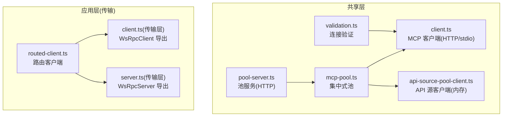
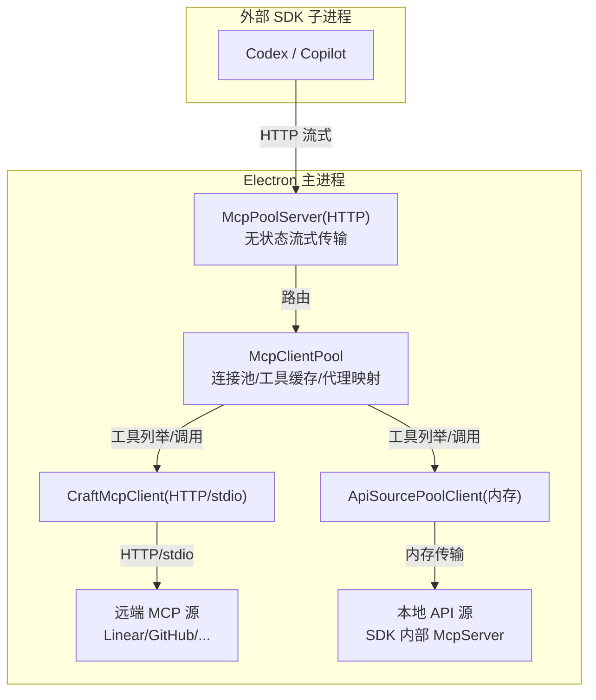
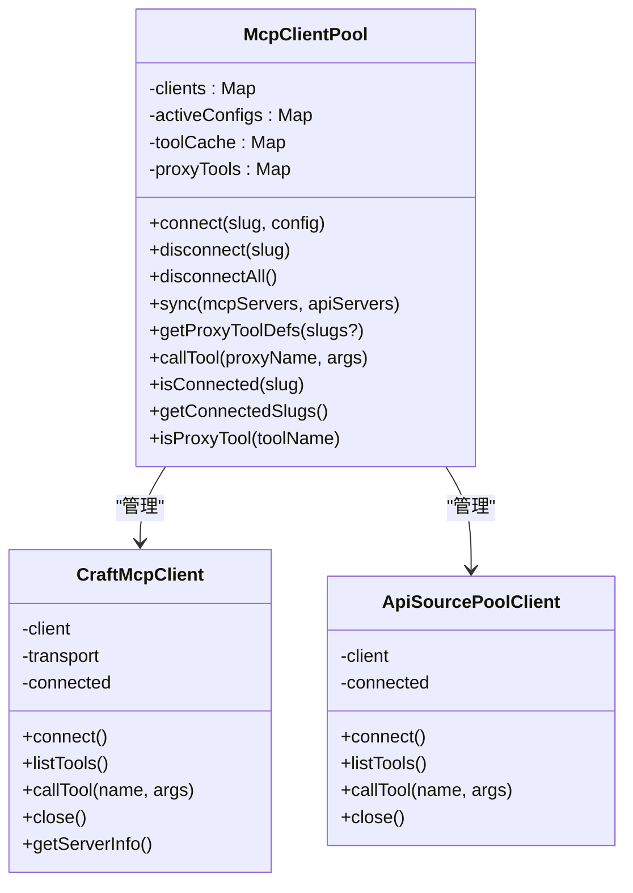
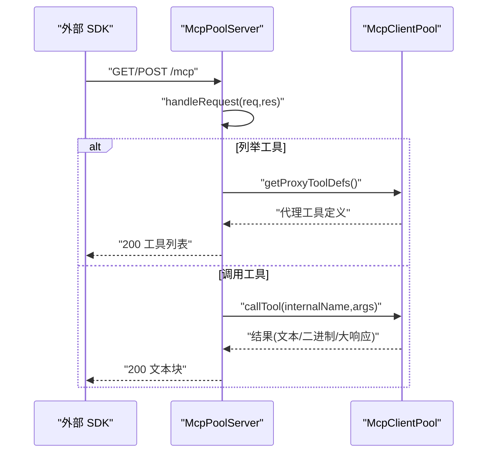
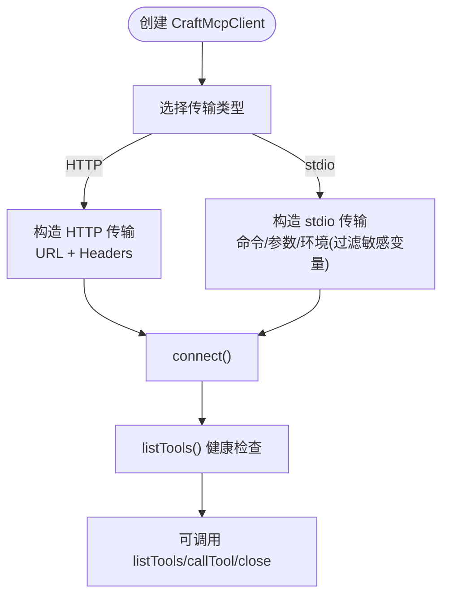
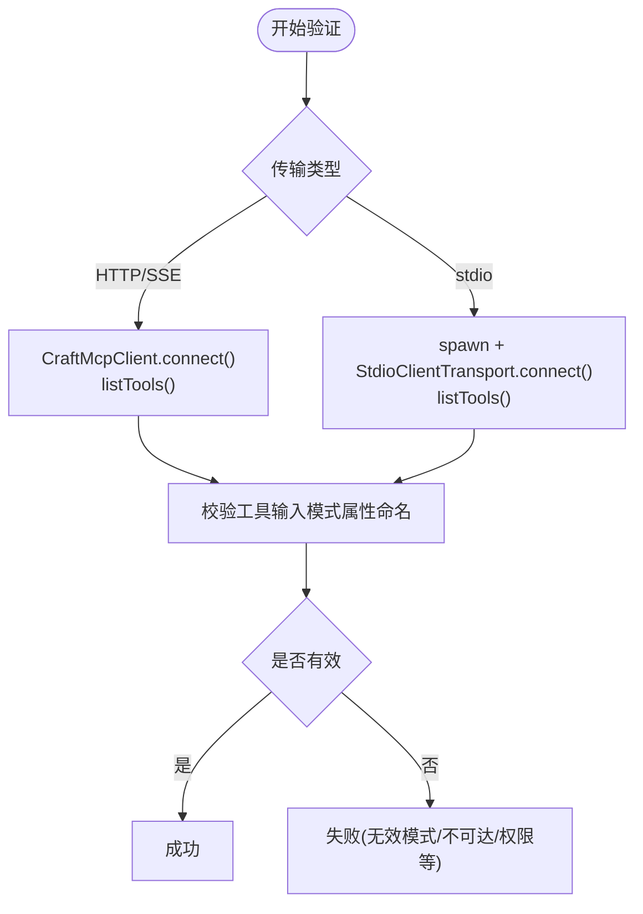
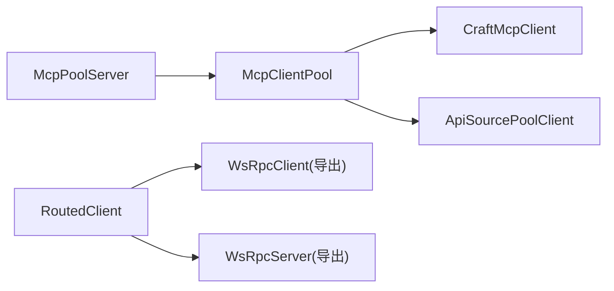

# MCP 服务器池管理

<cite>
**本文引用的文件**
- [mcp-pool.ts](file://packages/shared/src/mcp/mcp-pool.ts)
- [pool-server.ts](file://packages/shared/src/mcp/pool-server.ts)
- [client.ts](file://packages/shared/src/mcp/client.ts)
- [api-source-pool-client.ts](file://packages/shared/src/mcp/api-source-pool-client.ts)
- [validation.ts](file://packages/shared/src/mcp/validation.ts)
- [routed-client.ts](file://apps/electron/src/transport/routed-client.ts)
- [client.ts（传输层）](file://apps/electron/src/transport/client.ts)
- [server.ts（传输层）](file://apps/electron/src/transport/server.ts)
- [mcp-pool.test.ts](file://packages/shared/tests/mcp-pool.test.ts)
</cite>

## 目录
1. [简介](#简介)
2. [项目结构](#项目结构)
3. [核心组件](#核心组件)
4. [架构总览](#架构总览)
5. [详细组件分析](#详细组件分析)
6. [依赖关系分析](#依赖关系分析)
7. [性能考量](#性能考量)
8. [故障排查指南](#故障排查指南)
9. [结论](#结论)
10. [附录](#附录)

## 简介
本技术文档围绕 MCP（Model Context Protocol）服务器池管理展开，面向需要在企业级场景中统一管理多个 MCP 服务器实例的开发者。文档系统性阐述了以下主题：
- 架构设计：集中式池化、代理工具命名、状态无关的流式 HTTP 传输
- 资源管理：连接生命周期、工具缓存与代理映射、本地/远程与 API 源混合接入
- 负载均衡与路由：通过单一入口暴露工具集合，按代理名分发到具体源
- 初始化流程：池同步、工具发现、代理定义生成
- 动态变更：新增/移除源、凭据刷新触发重连、配置变更检测
- 健康检查与故障转移：连接健康检查、错误分类、失败回退
- 连接复用与安全：HTTP/stdio 传输、敏感环境变量过滤、内存内传输
- 配置管理、性能监控与资源限制：会话路径与大响应处理、超时与清理
- 扩展性与并发：多源并行、工具缓存、事件回调通知
- 运维监控与调优：验证工具、错误消息友好化、日志与调试

## 项目结构
本仓库中与 MCP 服务器池相关的核心代码位于共享包的 mcp 子目录，并在应用层的传输模块中提供了路由与连接管理能力。

**图表来源**
- [mcp-pool.ts:101-460](file://packages/shared/src/mcp/mcp-pool.ts#L101-L460)
- [pool-server.ts:32-179](file://packages/shared/src/mcp/pool-server.ts#L32-L179)
- [client.ts:72-164](file://packages/shared/src/mcp/client.ts#L72-L164)
- [api-source-pool-client.ts:15-53](file://packages/shared/src/mcp/api-source-pool-client.ts#L15-L53)
- [validation.ts:146-217](file://packages/shared/src/mcp/validation.ts#L146-L217)
- [routed-client.ts:40-256](file://apps/electron/src/transport/routed-client.ts#L40-L256)
- [client.ts（传输层）:8-17](file://apps/electron/src/transport/client.ts#L8-L17)
- [server.ts（传输层）:1-2](file://apps/electron/src/transport/server.ts#L1-L2)

**章节来源**
- [mcp-pool.ts:1-460](file://packages/shared/src/mcp/mcp-pool.ts#L1-L460)
- [pool-server.ts:1-179](file://packages/shared/src/mcp/pool-server.ts#L1-L179)
- [client.ts:1-164](file://packages/shared/src/mcp/client.ts#L1-L164)
- [api-source-pool-client.ts:1-53](file://packages/shared/src/mcp/api-source-pool-client.ts#L1-L53)
- [validation.ts:1-459](file://packages/shared/src/mcp/validation.ts#L1-L459)
- [routed-client.ts:1-256](file://apps/electron/src/transport/routed-client.ts#L1-L256)
- [client.ts（传输层）:1-18](file://apps/electron/src/transport/client.ts#L1-L18)
- [server.ts（传输层）:1-2](file://apps/electron/src/transport/server.ts#L1-L2)

## 核心组件
- 集中式 MCP 客户端池（McpClientPool）
  - 统一管理所有 MCP 源连接，支持远程 HTTP/SSE/stdio 与本地 API 源
  - 工具缓存与代理映射，按“mcp__{slug}__{toolName}”命名
  - 同步接口：根据目标配置连接/断开/重连，触发工具变更回调
- 池服务（McpPoolServer）
  - 在本进程内启动 HTTP 服务，使用流式 HTTP 传输，无会话状态
  - 将池内工具列表与调用请求转发至池
- MCP 客户端（CraftMcpClient）
  - 支持 HTTP 与 stdio 两种传输
  - 连接健康检查、工具列举、工具调用、关闭
- API 源池客户端（ApiSourcePoolClient）
  - 通过内存传输连接到本地 McpServer 实例
- 连接验证（validateMcpConnection / validateStdioMcpConnection）
  - HTTP/SSE：直接连接并列举工具，校验输入模式属性命名
  - stdio：实际启动子进程，连接后校验工具与模式
- 应用层路由客户端（RoutedClient）
  - 在渲染进程中根据通道类型选择本地或远程客户端
  - 工作区切换时透明替换远程客户端并重订阅监听

**章节来源**
- [mcp-pool.ts:101-460](file://packages/shared/src/mcp/mcp-pool.ts#L101-L460)
- [pool-server.ts:32-179](file://packages/shared/src/mcp/pool-server.ts#L32-L179)
- [client.ts:72-164](file://packages/shared/src/mcp/client.ts#L72-L164)
- [api-source-pool-client.ts:15-53](file://packages/shared/src/mcp/api-source-pool-client.ts#L15-L53)
- [validation.ts:146-428](file://packages/shared/src/mcp/validation.ts#L146-L428)
- [routed-client.ts:40-256](file://apps/electron/src/transport/routed-client.ts#L40-L256)

## 架构总览
下图展示了 MCP 服务器池的整体架构：外部 SDK 子进程通过单一 HTTP 入口访问池中的工具；池内部维护多个 MCP 源连接，按代理名进行路由与执行。

**图表来源**
- [pool-server.ts:57-96](file://packages/shared/src/mcp/pool-server.ts#L57-L96)
- [mcp-pool.ts:155-222](file://packages/shared/src/mcp/mcp-pool.ts#L155-L222)
- [client.ts:72-164](file://packages/shared/src/mcp/client.ts#L72-L164)
- [api-source-pool-client.ts:15-53](file://packages/shared/src/mcp/api-source-pool-client.ts#L15-L53)

## 详细组件分析

### 组件一：集中式 MCP 客户端池（McpClientPool）
- 设计要点
  - 使用 Map 维护已连接客户端、活动配置、工具缓存与代理映射
  - 代理工具命名规则：mcp__{slug}__{toolName}，便于外部识别与路由
  - 支持本地 MCP（stdio）与远程 MCP（http/sse），以及本地 API 源（内存）
- 关键流程
  - 注册客户端：连接、列举工具、写入缓存与映射
  - 连接/断开/全部断开：幂等操作，避免重复连接
  - 同步（sync）：对比目标配置与当前状态，执行新增/移除/重连
  - 工具发现：返回清洗后的代理工具定义（去除 AJV 不兼容的 $schema）
  - 工具执行：按代理名解析源与原始工具名，调用对应客户端，处理文本/二进制/大响应
- 错误处理
  - 连接失败捕获并记录，返回失败列表
  - 工具执行异常包装为统一结果，携带来源标识
  - 大响应与二进制内容落地到会话目录，必要时触发摘要回调

**图表来源**
- [mcp-pool.ts:101-460](file://packages/shared/src/mcp/mcp-pool.ts#L101-L460)
- [client.ts:72-164](file://packages/shared/src/mcp/client.ts#L72-L164)
- [api-source-pool-client.ts:15-53](file://packages/shared/src/mcp/api-source-pool-client.ts#L15-L53)

**章节来源**
- [mcp-pool.ts:101-460](file://packages/shared/src/mcp/mcp-pool.ts#L101-L460)

### 组件二：池服务（McpPoolServer）
- 设计要点
  - 在本进程内创建 HTTP 服务器，监听随机端口，仅开放 /mcp 路径
  - 使用流式 HTTP 服务器传输，无会话状态，适配外部 SDK 的 POST JSON-RPC
  - 请求处理器：ListTools 返回清洗后的工具名（去前缀），CallTool 将名称还原为内部代理名后路由
- 生命周期
  - start：创建传输与服务器，绑定 /mcp 路由，监听端口
  - stop：关闭传输、服务器与连接，清理端口
  - notifyToolsChanged：无状态模式下提示客户端下次连接时重新发现

**图表来源**
- [pool-server.ts:61-96](file://packages/shared/src/mcp/pool-server.ts#L61-L96)
- [pool-server.ts:107-143](file://packages/shared/src/mcp/pool-server.ts#L107-L143)
- [mcp-pool.ts:368-451](file://packages/shared/src/mcp/mcp-pool.ts#L368-L451)

**章节来源**
- [pool-server.ts:32-179](file://packages/shared/src/mcp/pool-server.ts#L32-L179)

### 组件三：MCP 客户端（CraftMcpClient）
- 传输支持
  - HTTP：基于流式 HTTP 客户端传输，支持自定义请求头
  - stdio：本地子进程传输，合并进程环境变量并过滤敏感变量
- 健康检查
  - 连接后立即列举工具以验证可用性
- 工具调用
  - 自动建立连接，封装调用结果，暴露服务器信息

**图表来源**
- [client.ts:72-164](file://packages/shared/src/mcp/client.ts#L72-L164)

**章节来源**
- [client.ts:72-164](file://packages/shared/src/mcp/client.ts#L72-L164)

### 组件四：API 源池客户端（ApiSourcePoolClient）
- 传输方式
  - 通过内存传输（InMemoryTransport）连接本地 McpServer
- 作用
  - 将本地 API 源无缝接入池接口，统一对外暴露工具与调用

**章节来源**
- [api-source-pool-client.ts:15-53](file://packages/shared/src/mcp/api-source-pool-client.ts#L15-L53)

### 组件五：连接验证（validateMcpConnection / validateStdioMcpConnection）
- HTTP/SSE
  - 直接使用 CraftMcpClient 连接并列举工具，校验工具输入模式属性命名
- stdio
  - 动态导入 SDK stdio 传输，实际启动子进程，连接后校验工具与模式
- 错误分类
  - 认证失败、不可达、超时、进程错误、无效模式等

**图表来源**
- [validation.ts:146-217](file://packages/shared/src/mcp/validation.ts#L146-L217)
- [validation.ts:236-428](file://packages/shared/src/mcp/validation.ts#L236-L428)

**章节来源**
- [validation.ts:146-428](file://packages/shared/src/mcp/validation.ts#L146-L428)

### 组件六：应用层路由客户端（RoutedClient）
- 路由策略
  - 本地通道（LOCAL_ONLY）走本地客户端
  - 其他通道走工作区客户端（远程或本地）
- 工作区切换
  - 透明替换远程客户端，重注册能力处理函数与监听器
  - 触发“已切换到新客户端”的连接状态事件，驱动会话恢复逻辑

**章节来源**
- [routed-client.ts:40-256](file://apps/electron/src/transport/routed-client.ts#L40-L256)

## 依赖关系分析
- 组件耦合
  - McpClientPool 依赖 CraftMcpClient 与 ApiSourcePoolClient，统一通过 PoolClient 接口管理
  - McpPoolServer 依赖 McpClientPool 提供工具与调用能力
  - 应用层 RoutedClient 与传输层导出的 WsRpcClient/WsRpcServer 协同，支撑工作区切换与通道路由
- 外部依赖
  - @modelcontextprotocol/sdk：MCP 官方 SDK，提供客户端/服务器与传输实现
  - Node 内置 http 与 child_process：HTTP 服务与 stdio 子进程

**图表来源**
- [mcp-pool.ts:101-460](file://packages/shared/src/mcp/mcp-pool.ts#L101-L460)
- [pool-server.ts:32-179](file://packages/shared/src/mcp/pool-server.ts#L32-L179)
- [client.ts（传输层）:8-17](file://apps/electron/src/transport/client.ts#L8-L17)
- [server.ts（传输层）:1-2](file://apps/electron/src/transport/server.ts#L1-L2)

**章节来源**
- [mcp-pool.ts:101-460](file://packages/shared/src/mcp/mcp-pool.ts#L101-L460)
- [pool-server.ts:32-179](file://packages/shared/src/mcp/pool-server.ts#L32-L179)
- [client.ts（传输层）:1-18](file://apps/electron/src/transport/client.ts#L1-L18)
- [server.ts（传输层）:1-2](file://apps/electron/src/transport/server.ts#L1-L2)

## 性能考量
- 连接复用与缓存
  - 工具列表与代理映射缓存，减少重复列举与解析成本
  - 远程/本地连接持久化，避免频繁握手
- 并发与调度
  - 多源并行：同步阶段对新增/重连任务并行执行
  - 工具调用：按代理名路由到具体源，避免全局锁竞争
- 大响应与二进制处理
  - 二进制内容落地到会话目录，结合大小保护策略与摘要回调，降低内存峰值
- 传输优化
  - 流式 HTTP 无状态传输，适合外部 SDK 的一次性请求模型
  - stdio 传输仅用于本地可信源，避免网络开销与跨进程复杂度

[本节为通用性能建议，不直接分析具体文件]

## 故障排查指南
- 常见问题与定位
  - 连接失败：检查 URL/凭据/网络；查看连接验证结果与错误类型
  - 工具不可用：确认代理名格式（mcp__{slug}__{toolName}）、源是否已连接
  - 无效模式属性：工具输入 schema 中属性名需满足命名规范
  - 本地 stdio 启动失败：检查命令是否存在、权限、超时与 stderr 输出
- 参考测试用例
  - 配置变更检测：授权头变化触发重连，其他头部变化不应导致重连
  - 移除源：从配置移除后应断开连接且不再暴露工具
  - 单次同步中同时处理新增/移除/刷新

**章节来源**
- [mcp-pool.test.ts:69-151](file://packages/shared/tests/mcp-pool.test.ts#L69-L151)
- [validation.ts:128-217](file://packages/shared/src/mcp/validation.ts#L128-L217)
- [validation.ts:434-459](file://packages/shared/src/mcp/validation.ts#L434-L459)

## 结论
该 MCP 服务器池通过集中式连接管理、代理工具命名与流式 HTTP 无状态传输，实现了对多源 MCP 的统一接入与高效路由。配合连接验证、缓存与大响应处理机制，能够在企业级场景中稳定地支撑多后端工具集成与运行时动态调整。应用层的路由客户端进一步增强了工作区切换与通道路由的灵活性。

[本节为总结性内容，不直接分析具体文件]

## 附录

### 配置管理与示例
- 远程 MCP 源配置
  - 类型：http 或 sse
  - URL：MCP 服务地址
  - Headers：认证与自定义请求头（Authorization 优先）
- 本地 MCP 源配置
  - 类型：stdio
  - 命令与参数：子进程启动命令与参数
  - 环境变量：过滤敏感变量后注入
- API 源配置
  - 类型：sdk
  - 实例：本地 McpServer 实例（内存传输）

[本节为配置说明，不直接分析具体文件]

### 性能调优指南
- 连接与缓存
  - 合理设置工具缓存与代理映射，减少重复列举
  - 对高频调用的源保持长连接，避免频繁握手
- 大响应与二进制
  - 使用会话路径保存二进制与大文本，启用摘要回调以缩短文本长度
- 传输选择
  - 外部 SDK 适配流式 HTTP；本地可信源使用 stdio
- 超时与清理
  - 设置合理的连接与调用超时，确保异常时及时释放资源

[本节为通用调优建议，不直接分析具体文件]

### 运维监控方案
- 日志与调试
  - 通过池与服务的 debug 回调输出关键事件（连接/断开/工具变更/调用）
- 健康检查
  - 定期运行连接验证，监控工具可用性与模式有效性
- 错误分类与告警
  - 基于验证结果的错误类型（认证失败/不可达/无效模式/超时）建立告警策略

[本节为运维建议，不直接分析具体文件]