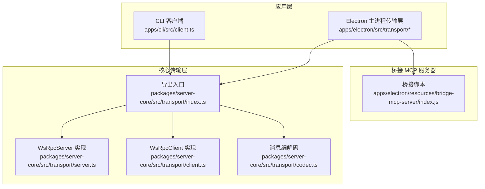
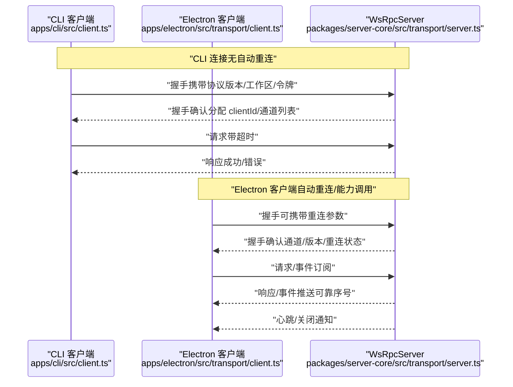
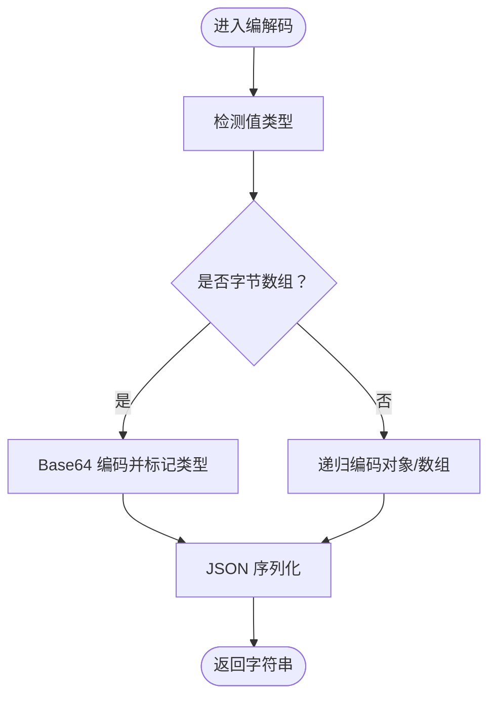
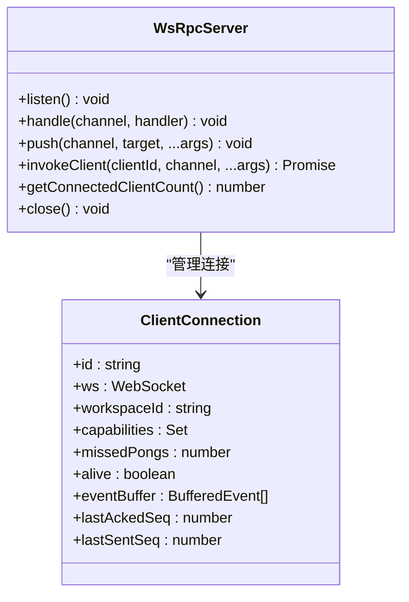
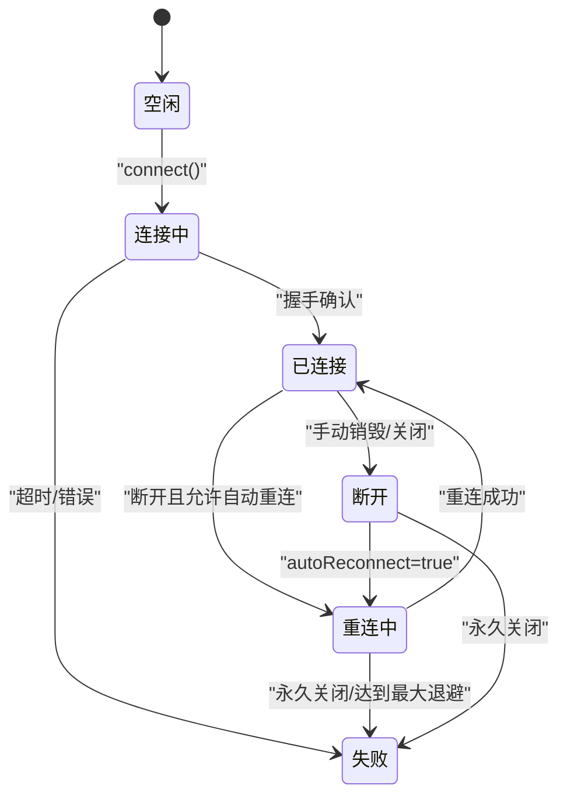
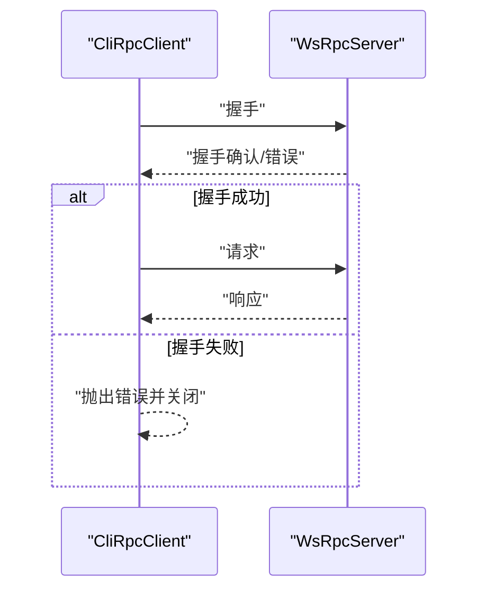
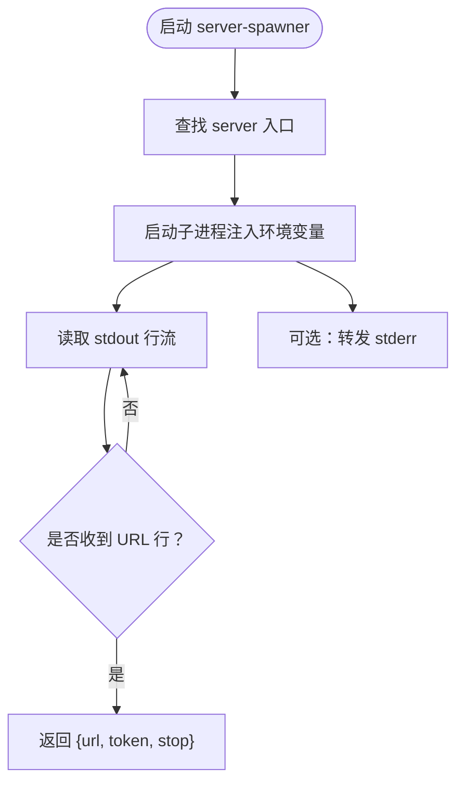
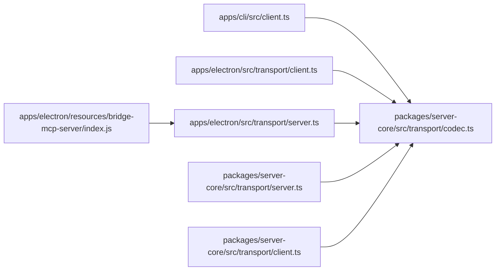

# MCP 服务器集成

<cite>
**本文引用的文件**
- [README.md](file://README.md)
- [apps/cli/src/client.ts](file://apps/cli/src/client.ts)
- [apps/cli/src/server-spawner.ts](file://apps/cli/src/server-spawner.ts)
- [apps/electron/resources/bridge-mcp-server/index.js](file://apps/electron/resources/bridge-mcp-server/index.js)
- [apps/electron/src/transport/server.ts](file://apps/electron/src/transport/server.ts)
- [apps/electron/src/transport/client.ts](file://apps/electron/src/transport/client.ts)
- [packages/server-core/src/transport/index.ts](file://packages/server-core/src/transport/index.ts)
- [packages/server-core/src/transport/server.ts](file://packages/server-core/src/transport/server.ts)
- [packages/server-core/src/transport/client.ts](file://packages/server-core/src/transport/client.ts)
- [packages/server-core/src/transport/codec.ts](file://packages/server-core/src/transport/codec.ts)
</cite>

## 目录
1. [简介](#简介)
2. [项目结构](#项目结构)
3. [核心组件](#核心组件)
4. [架构总览](#架构总览)
5. [详细组件分析](#详细组件分析)
6. [依赖关系分析](#依赖关系分析)
7. [性能考量](#性能考量)
8. [故障排查指南](#故障排查指南)
9. [结论](#结论)
10. [附录](#附录)

## 简介
本技术文档围绕 MCP（Model Context Protocol）在 Craft Agents 中的集成与使用，系统阐述协议工作原理、客户端实现机制、服务器池化与重连策略、验证与错误处理、超时管理、服务器发现与自动配置、认证握手流程，以及自定义 MCP 服务器开发与调试实践。目标是帮助开发者快速理解并集成 MCP 服务器，或基于现有框架开发自定义工具与服务。

## 项目结构
该项目采用多包（monorepo）组织方式，核心传输层位于 server-core 包，桌面应用与 CLI 分别通过 re-export 的 transport 层进行通信；同时包含一个桥接型 MCP 服务器脚本用于本地/外部 MCP 服务接入。

**图表来源**
- [packages/server-core/src/transport/index.ts:1-7](file://packages/server-core/src/transport/index.ts#L1-L7)
- [packages/server-core/src/transport/server.ts:1-869](file://packages/server-core/src/transport/server.ts#L1-L869)
- [packages/server-core/src/transport/client.ts:1-983](file://packages/server-core/src/transport/client.ts#L1-L983)
- [packages/server-core/src/transport/codec.ts:1-157](file://packages/server-core/src/transport/codec.ts#L1-L157)
- [apps/electron/src/transport/server.ts:1-2](file://apps/electron/src/transport/server.ts#L1-L2)
- [apps/electron/src/transport/client.ts:1-18](file://apps/electron/src/transport/client.ts#L1-L18)
- [apps/cli/src/client.ts:1-240](file://apps/cli/src/client.ts#L1-L240)
- [apps/cli/src/server-spawner.ts:1-150](file://apps/cli/src/server-spawner.ts#L1-L150)
- [apps/electron/resources/bridge-mcp-server/index.js:1-800](file://apps/electron/resources/bridge-mcp-server/index.js#L1-L800)

**章节来源**
- [README.md:343-366](file://README.md#L343-L366)
- [packages/server-core/src/transport/index.ts:1-7](file://packages/server-core/src/transport/index.ts#L1-L7)

## 核心组件
- 传输编解码器：负责消息封包、序列化与反序列化，支持二进制数据的透明传输。
- 服务器端（WsRpcServer）：管理连接生命周期、握手、心跳、认证、请求分发、事件推送与重放、断线保留与重连。
- 客户端（WsRpcClient）：支持本地/远程模式、握手、请求响应关联、事件订阅、能力调用、指数退避重连。
- CLI 客户端（CliRpcClient）：轻量级 WebSocket RPC 客户端，无自动重连与能力特性，适合一次性任务。
- 服务器启动器（server-spawner）：在 CLI 中自动探测并启动 headless 服务器，读取输出中的连接信息。
- 桥接 MCP 服务器：提供本地/外部 MCP 服务的桥接入口，便于统一接入。

**章节来源**
- [packages/server-core/src/transport/codec.ts:1-157](file://packages/server-core/src/transport/codec.ts#L1-L157)
- [packages/server-core/src/transport/server.ts:1-869](file://packages/server-core/src/transport/server.ts#L1-L869)
- [packages/server-core/src/transport/client.ts:1-983](file://packages/server-core/src/transport/client.ts#L1-L983)
- [apps/cli/src/client.ts:1-240](file://apps/cli/src/client.ts#L1-L240)
- [apps/cli/src/server-spawner.ts:1-150](file://apps/cli/src/server-spawner.ts#L1-L150)
- [apps/electron/resources/bridge-mcp-server/index.js:1-800](file://apps/electron/resources/bridge-mcp-server/index.js#L1-L800)

## 架构总览
下图展示从 CLI/Electron 到服务器端的完整交互路径，包括握手、认证、心跳、RPC 调用与事件推送。

**图表来源**
- [apps/cli/src/client.ts:61-129](file://apps/cli/src/client.ts#L61-L129)
- [packages/server-core/src/transport/server.ts:355-581](file://packages/server-core/src/transport/server.ts#L355-L581)
- [packages/server-core/src/transport/client.ts:346-447](file://packages/server-core/src/transport/client.ts#L346-L447)

## 详细组件分析

### 传输编解码（Codec）
- 支持的消息类型：handshake、handshake_ack、request、response、event、error、sequence_ack。
- 对二进制数据进行 Base64 编码，确保跨平台传输安全。
- 提供封包形状校验，保证消息结构正确性。

**图表来源**
- [packages/server-core/src/transport/codec.ts:68-114](file://packages/server-core/src/transport/codec.ts#L68-L114)

**章节来源**
- [packages/server-core/src/transport/codec.ts:1-157](file://packages/server-core/src/transport/codec.ts#L1-L157)

### 服务器端（WsRpcServer）
- 握手阶段：校验协议版本、可选认证（令牌或会话 Cookie）、分配 clientId、记录能力集。
- 心跳与断线：周期性 ping，missedPongs 达阈值则终止连接；断线后保留缓冲以支持重连重放。
- 请求分发：按通道查找处理器，执行并返回响应；设置处理器超时。
- 事件推送：为每个客户端分配递增序号，维护环形缓冲，支持重放与 ACK 清理。
- 重连策略：支持 reconnectClientId + lastSeq 参数进行幂等重连；若缓冲过期则提示刷新。

**图表来源**
- [packages/server-core/src/transport/server.ts:40-800](file://packages/server-core/src/transport/server.ts#L40-L800)

**章节来源**
- [packages/server-core/src/transport/server.ts:1-869](file://packages/server-core/src/transport/server.ts#L1-L869)

### 客户端（WsRpcClient）
- 连接状态机：idle → connecting → connected/reconnecting → disconnected/failed。
- 自动重连：指数退避，最大延迟可配置；支持手动触发重连。
- 可靠交付：维护 lastSeenSeq，定期发送 sequence_ack；支持 server:shuttingDown 关闭信号。
- 能力调用：注册 capability 处理器，接收来自服务器的请求并返回结果。
- TLS 选项：Node 环境下可禁用证书校验（仅限主进程），浏览器环境使用全局 WebSocket。

**图表来源**
- [packages/server-core/src/transport/client.ts:37-74](file://packages/server-core/src/transport/client.ts#L37-L74)
- [packages/server-core/src/transport/client.ts:778-800](file://packages/server-core/src/transport/client.ts#L778-L800)

**章节来源**
- [packages/server-core/src/transport/client.ts:1-983](file://packages/server-core/src/transport/client.ts#L1-L983)

### CLI 客户端（CliRpcClient）
- 一次性连接：无自动重连、无能力特性，适合命令行脚本。
- 握手与错误：握手成功后切换到常规消息处理；握手失败或连接异常直接报错。
- 请求超时：每请求独立超时控制；断开时拒绝所有挂起请求。

**图表来源**
- [apps/cli/src/client.ts:61-129](file://apps/cli/src/client.ts#L61-L129)
- [packages/server-core/src/transport/server.ts:396-433](file://packages/server-core/src/transport/server.ts#L396-L433)

**章节来源**
- [apps/cli/src/client.ts:1-240](file://apps/cli/src/client.ts#L1-L240)

### 服务器启动器（server-spawner）
- 自动探测 server 入口：向上遍历目录寻找 packages/server/src/index.ts。
- 启动子进程：注入 CRAFT_SERVER_TOKEN、绑定 127.0.0.1:0，捕获 stdout/stderr。
- 输出解析：等待 CRAFT_SERVER_URL=CRAFT_SERVER_TOKEN 行，确认就绪后返回停止函数。
- 超时与清理：超时或进程退出时清理并报错。

**图表来源**
- [apps/cli/src/server-spawner.ts:55-149](file://apps/cli/src/server-spawner.ts#L55-L149)

**章节来源**
- [apps/cli/src/server-spawner.ts:1-150](file://apps/cli/src/server-spawner.ts#L1-L150)

### 桥接 MCP 服务器（bridge-mcp-server）
- 作为本地/外部 MCP 服务的桥接入口，统一接入到 Craft Agents 的传输层。
- 通过 Electron 主进程加载，支持与桌面应用的无缝协作。

**章节来源**
- [apps/electron/resources/bridge-mcp-server/index.js:1-800](file://apps/electron/resources/bridge-mcp-server/index.js#L1-L800)

## 依赖关系分析
- Electron 主进程通过 re-export 使用 server-core 的传输层，保持跨包一致性。
- CLI 与 Electron 均依赖统一的编解码器与协议常量，确保消息格式一致。
- 服务器端与客户端均实现心跳、ACK、缓冲与重放机制，保障可靠性。

**图表来源**
- [apps/electron/src/transport/server.ts:1-2](file://apps/electron/src/transport/server.ts#L1-L2)
- [apps/electron/src/transport/client.ts:1-18](file://apps/electron/src/transport/client.ts#L1-L18)
- [packages/server-core/src/transport/index.ts:1-7](file://packages/server-core/src/transport/index.ts#L1-L7)
- [packages/server-core/src/transport/codec.ts:1-157](file://packages/server-core/src/transport/codec.ts#L1-L157)

**章节来源**
- [apps/electron/src/transport/server.ts:1-2](file://apps/electron/src/transport/server.ts#L1-L2)
- [apps/electron/src/transport/client.ts:1-18](file://apps/electron/src/transport/client.ts#L1-L18)
- [packages/server-core/src/transport/index.ts:1-7](file://packages/server-core/src/transport/index.ts#L1-L7)

## 性能考量
- 事件缓冲与 TTL：服务器端为每个客户端维护环形缓冲，结合 TTL 与最大容量限制，避免内存膨胀。
- 心跳与断线检测：通过 ping/pong 与最大错过次数控制，及时剔除不健康连接。
- 请求超时与处理器超时：客户端与服务器端分别设置超时，防止阻塞与资源占用。
- 二进制数据优化：编解码器对字节数组进行 Base64 编码，减少跨语言传输问题。
- 重连退避：指数退避上限可配置，降低风暴式重连风险。

[本节为通用指导，无需具体文件分析]

## 故障排查指南
- 握手失败
  - 协议版本不匹配：检查客户端/服务器协议版本，确保主版本一致。
  - 认证失败：确认令牌有效或会话 Cookie 正确；必要时启用会话 Cookie 验证。
- 连接超时
  - 客户端握手超时：检查 connectTimeout 设置与网络状况。
  - 服务器端握手超时：默认 5 秒，确认服务器未阻塞。
- 请求超时
  - 客户端请求超时：检查 requestTimeout 与服务器处理器执行时间。
  - 服务器端处理器超时：默认 60 秒，建议优化长耗时操作或拆分任务。
- 断线与重连
  - 心跳失败：检查网络稳定性与服务器负载。
  - 重连失败：确认 reconnectClientId 与 lastSeq 传递正确；缓冲过期需全量刷新。
- 编解码错误
  - 封包形状校验失败：检查消息字段完整性与类型。
- TLS 证书问题
  - Node 环境可临时禁用校验（仅限开发），生产环境请使用受信证书或反向代理终止 TLS。

**章节来源**
- [packages/server-core/src/transport/server.ts:396-433](file://packages/server-core/src/transport/server.ts#L396-L433)
- [packages/server-core/src/transport/client.ts:379-447](file://packages/server-core/src/transport/client.ts#L379-L447)
- [packages/server-core/src/transport/codec.ts:122-144](file://packages/server-core/src/transport/codec.ts#L122-L144)

## 结论
本项目通过统一的传输层与编解码器，实现了 MCP 服务器的稳定接入与扩展。服务器端提供可靠的握手、心跳、认证、事件推送与重放机制；客户端支持自动重连、能力调用与 TLS 适配。CLI 与 Electron 场景分别满足一次性任务与持续交互需求。结合桥接 MCP 服务器，可无缝整合本地/外部 MCP 服务，形成统一的工具生态。

[本节为总结，无需具体文件分析]

## 附录

### MCP 协议工作原理与握手流程
- 版本协商：客户端在握手时声明 protocolVersion，服务器校验主版本兼容性。
- 认证：可选令牌或会话 Cookie；服务器端可配置验证回调。
- 能力与通道：客户端声明 clientCapabilities，服务器返回已注册通道列表。
- 重连：客户端携带 reconnectClientId 与 lastSeq，服务器根据缓冲与序号决定重放或刷新。

**章节来源**
- [packages/server-core/src/transport/server.ts:396-581](file://packages/server-core/src/transport/server.ts#L396-L581)
- [packages/server-core/src/transport/client.ts:402-413](file://packages/server-core/src/transport/client.ts#L402-L413)

### 客户端初始化与连接建立
- CLI 客户端：构造后立即发起握手，超时即失败；成功后切换消息处理。
- Electron 客户端：支持自动重连与能力调用；TLS 选项按运行环境选择。

**章节来源**
- [apps/cli/src/client.ts:61-129](file://apps/cli/src/client.ts#L61-L129)
- [packages/server-core/src/transport/client.ts:346-447](file://packages/server-core/src/transport/client.ts#L346-L447)

### 工具注册与能力调用
- 客户端侧：通过 handleCapability 注册能力处理器，接收服务器发起的请求并返回结果。
- 服务器侧：通过 push 广播事件，支持按工作区/客户端筛选；invokeClient 向特定客户端发起请求。

**章节来源**
- [packages/server-core/src/transport/client.ts:223-225](file://packages/server-core/src/transport/client.ts#L223-L225)
- [packages/server-core/src/transport/server.ts:189-201](file://packages/server-core/src/transport/server.ts#L189-L201)

### 服务器池化与负载均衡
- 当前实现：单实例监听，支持最大客户端数量限制与断线缓冲。
- 扩展建议：多实例部署 + 反向代理/负载均衡；共享会话状态与事件源；客户端支持多地址轮询与故障转移。

[本节为概念性建议，无需具体文件分析]

### 验证机制与错误处理
- 错误分类：认证、协议、超时、网络、服务器、未知。
- 服务器端：统一错误封装与关闭码；客户端根据关闭码与错误码分类处理。
- 超时管理：握手、请求、处理器三类超时，避免资源泄漏。

**章节来源**
- [packages/server-core/src/transport/client.ts:53-57](file://packages/server-core/src/transport/client.ts#L53-L57)
- [packages/server-core/src/transport/server.ts:621-664](file://packages/server-core/src/transport/server.ts#L621-L664)

### 服务器发现与自动配置
- CLI 自动启动：server-spawner 自动探测入口、注入令牌、监听输出、返回连接信息。
- Electron 桥接：通过桥接脚本接入本地/外部 MCP 服务，统一由传输层管理。

**章节来源**
- [apps/cli/src/server-spawner.ts:55-149](file://apps/cli/src/server-spawner.ts#L55-L149)
- [apps/electron/resources/bridge-mcp-server/index.js:1-800](file://apps/electron/resources/bridge-mcp-server/index.js#L1-L800)

### 自定义 MCP 服务器开发指南
- 选择运行模式：本地（127.0.0.1）或远程（0.0.0.0），按需开启 TLS。
- 实现握手与认证：遵循协议版本与令牌/会话验证流程。
- 注册通道与处理器：handle(channel, handler)，注意处理器超时与错误码。
- 事件推送与重放：合理设置事件缓冲与 TTL，确保断线重连后的顺序一致性。
- 客户端对接：提供清晰的通道命名与参数规范，便于工具注册与调用。

**章节来源**
- [packages/server-core/src/transport/server.ts:182-187](file://packages/server-core/src/transport/server.ts#L182-L187)
- [packages/server-core/src/transport/server.ts:621-664](file://packages/server-core/src/transport/server.ts#L621-L664)

### 调试技巧
- 开启调试日志：参考 README 的调试模式与日志位置。
- 观察连接状态：使用 Electron 客户端的连接状态监听接口，定位重连与错误原因。
- 编解码验证：在客户端/服务器两端打印封包内容，核对字段与类型。
- TLS 排查：区分 Node 与浏览器环境的 WebSocket 行为差异，必要时临时放宽校验进行测试。

**章节来源**
- [README.md:581-606](file://README.md#L581-L606)
- [packages/server-core/src/transport/client.ts:242-248](file://packages/server-core/src/transport/client.ts#L242-L248)