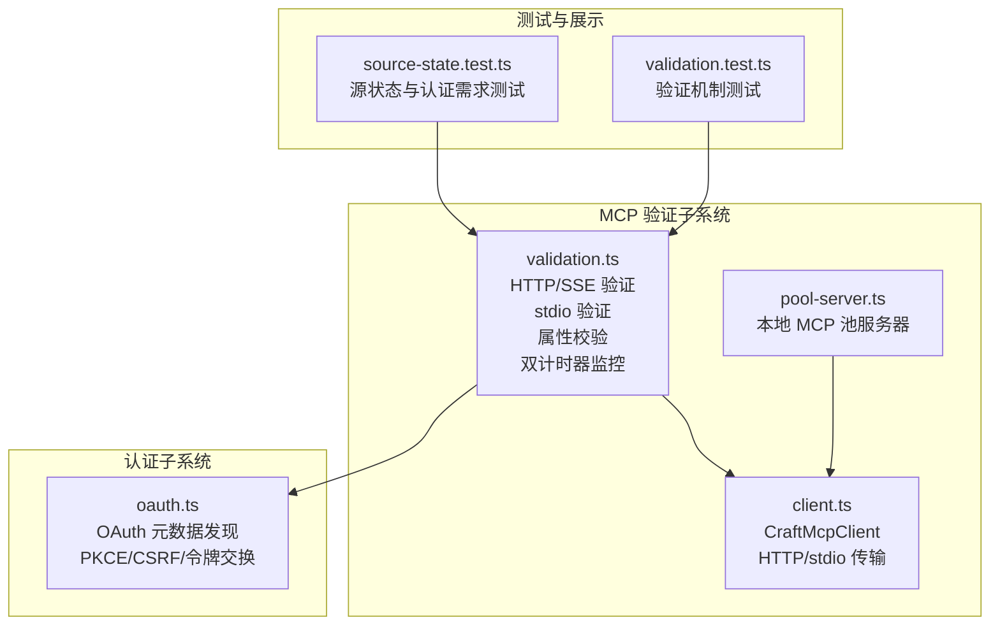
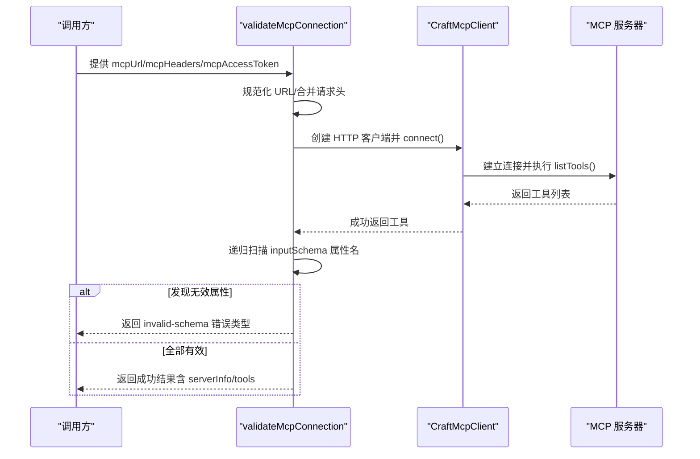
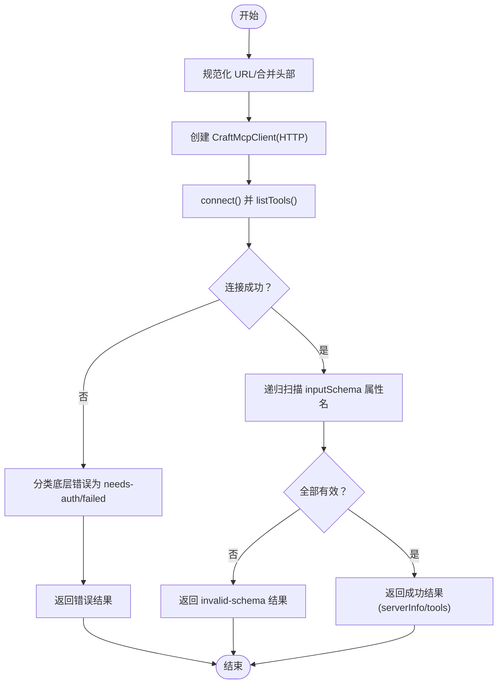
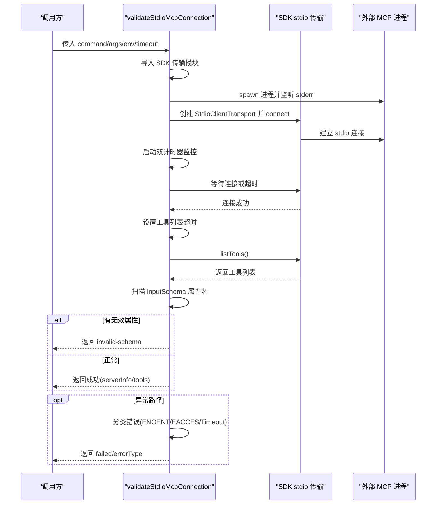
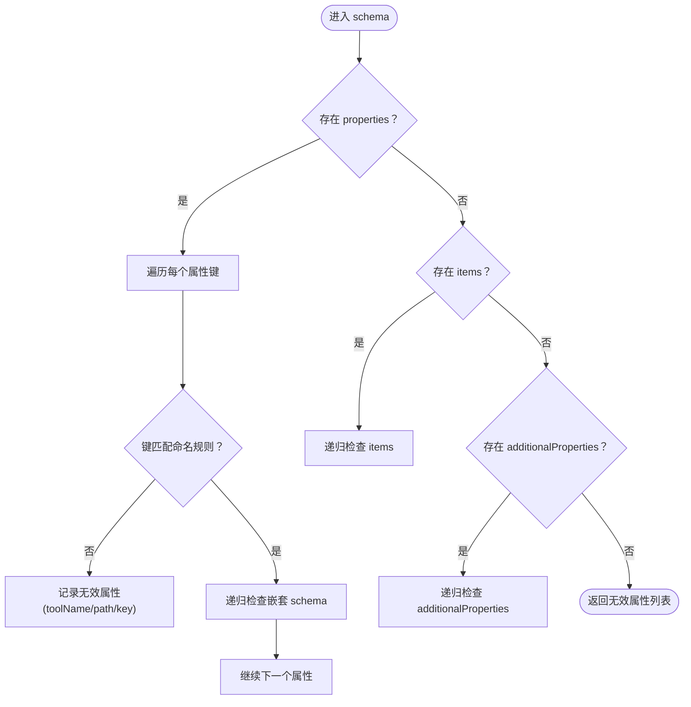
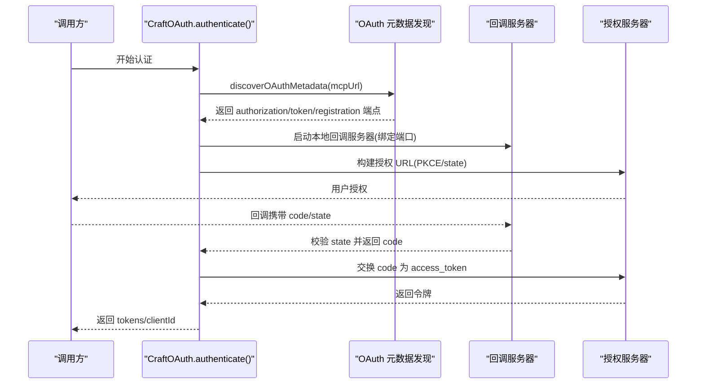
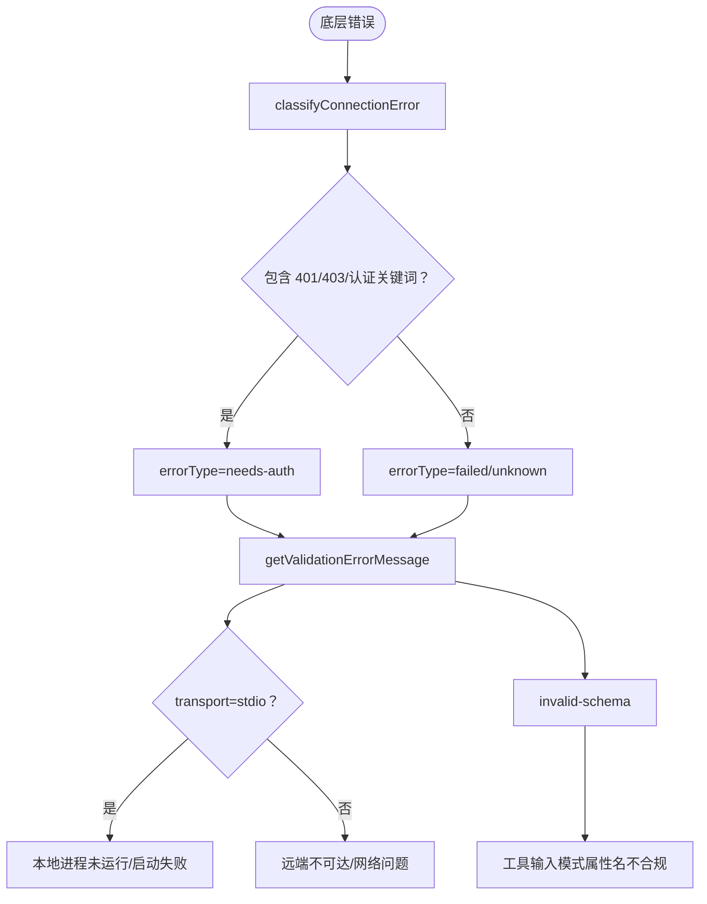
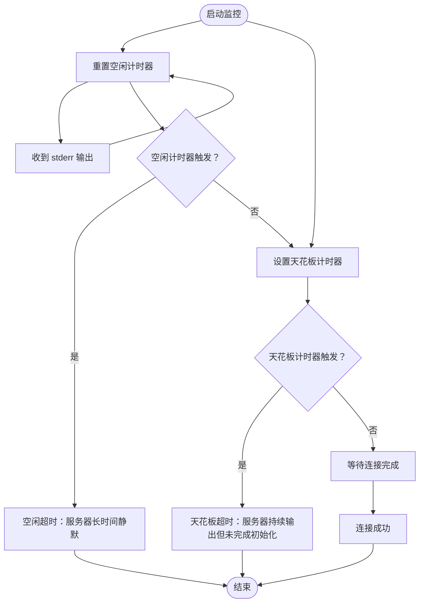
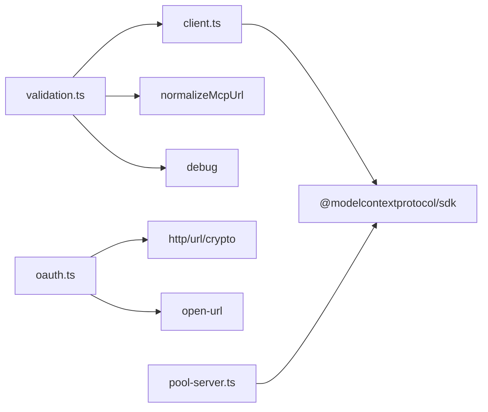

# MCP 验证机制

<cite>
**本文档引用的文件**
- [packages/shared/src/mcp/validation.ts](file://packages/shared/src/mcp/validation.ts)
- [packages/shared/src/mcp/client.ts](file://packages/shared/src/mcp/client.ts)
- [packages/shared/src/mcp/pool-server.ts](file://packages/shared/src/mcp/pool-server.ts)
- [packages/shared/src/mcp/index.ts](file://packages/shared/src/mcp/index.ts)
- [packages/shared/src/auth/oauth.ts](file://packages/shared/src/auth/oauth.ts)
- [packages/shared/src/agent/__tests__/source-state.test.ts](file://packages/shared/src/agent/__tests__/source-state.test.ts)
- [packages/shared/src/mcp/__tests__/validation.test.ts](file://packages/shared/src/mcp/__tests__/validation.test.ts)
</cite>

## 更新摘要
**变更内容**
- 新增双计时器连接监控（watchdog）机制，显著改善 stdio 连接验证的可靠性和诊断能力
- 增强 schema 验证功能，提供更详细的属性名错误报告
- 改进错误报告系统，包含更丰富的诊断信息和用户友好的错误消息
- 优化超时控制策略，分离连接阶段和工具列表阶段的超时处理
- 增强 stdio 进程监控，包括 stderr 输出截断和连接阶段状态跟踪

## 目录
1. [简介](#简介)
2. [项目结构](#项目结构)
3. [核心组件](#核心组件)
4. [架构总览](#架构总览)
5. [详细组件分析](#详细组件分析)
6. [依赖关系分析](#依赖关系分析)
7. [性能考虑](#性能考虑)
8. [故障排查指南](#故障排查指南)
9. [结论](#结论)
10. [附录](#附录)

## 简介
本文件系统性阐述 MCP（Model Context Protocol）验证机制的设计与实现，覆盖以下方面：
- 验证体系：基于官方 SDK 的 HTTP/SSE 与 stdio 两种传输方式的连接验证
- 数据完整性检查：工具输入模式属性名校验（符合特定命名约束）
- 安全认证流程：OAuth 元数据发现、PKCE、CSRF 保护、令牌刷新与 SSRF 防护
- 规则定义与执行：属性命名规则、错误分类与用户提示映射
- 错误处理与恢复：超时、进程退出、权限错误、网络不可达等场景的分类与恢复策略
- 自定义验证规则：如何扩展属性校验、添加新规则
- 性能优化与调试：最小化依赖加载、超时控制、日志与诊断
- 使用示例与最佳实践：不同传输与认证场景下的推荐做法

## 项目结构
围绕 MCP 验证的核心代码位于共享包的 mcp 子模块与 auth 子模块中，主要文件如下：
- mcp/validation.ts：HTTP/SSE 连接验证、stdio 进程验证、工具输入模式属性校验、错误分类与用户提示
- mcp/client.ts：统一的 MCP 客户端封装，支持 HTTP 与 stdio 传输，并内置健康检查
- mcp/pool-server.ts：本地 MCP 池服务器（HTTP），用于测试或内部集成
- auth/oauth.ts：OAuth 流程与元数据发现、PKCE、CSRF、令牌刷新、SSRF 防护
- agent/__tests__/source-state.test.ts：源状态与认证需求的测试用例，体现验证结果对 UI 展示的影响

**图表来源**
- [packages/shared/src/mcp/validation.ts:146-217](file://packages/shared/src/mcp/validation.ts#L146-L217)
- [packages/shared/src/mcp/client.ts:72-164](file://packages/shared/src/mcp/client.ts#L72-L164)
- [packages/shared/src/mcp/pool-server.ts:61-80](file://packages/shared/src/mcp/pool-server.ts#L61-L80)
- [packages/shared/src/auth/oauth.ts:189-210](file://packages/shared/src/auth/oauth.ts#L189-L210)
- [packages/shared/src/agent/__tests__/source-state.test.ts:35-145](file://packages/shared/src/agent/__tests__/source-state.test.ts#L35-L145)
- [packages/shared/src/mcp/__tests__/validation.test.ts:1-122](file://packages/shared/src/mcp/__tests__/validation.test.ts#L1-L122)

**章节来源**
- [packages/shared/src/mcp/validation.ts:1-579](file://packages/shared/src/mcp/validation.ts#L1-L579)
- [packages/shared/src/mcp/client.ts:1-164](file://packages/shared/src/mcp/client.ts#L1-L164)
- [packages/shared/src/mcp/pool-server.ts:1-179](file://packages/shared/src/mcp/pool-server.ts#L1-L179)
- [packages/shared/src/auth/oauth.ts:1-987](file://packages/shared/src/auth/oauth.ts#L1-L987)
- [packages/shared/src/agent/__tests__/source-state.test.ts:1-348](file://packages/shared/src/agent/__tests__/source-state.test.ts#L1-L348)
- [packages/shared/src/mcp/__tests__/validation.test.ts:1-122](file://packages/shared/src/mcp/__tests__/validation.test.ts#L1-L122)

## 核心组件
- HTTP/SSE 连接验证：通过 CraftMcpClient 建立连接并列出工具，若失败则根据底层错误消息进行分类
- stdio 进程验证：动态导入 SDK stdio 传输，启动外部进程，捕获 stderr 并在超时后清理
- 工具输入模式属性校验：递归扫描 inputSchema，匹配属性命名正则，收集无效属性清单
- OAuth 认证：元数据发现、PKCE、CSRF 校验、令牌交换与刷新、SSRF 防护
- 错误分类与用户提示：将底层错误映射为 needs-auth、invalid-schema、failed 等类型，并提供友好提示
- **新增** 双计时器连接监控：智能监控 stdio 连接过程，区分连接超时和工具列表超时

**章节来源**
- [packages/shared/src/mcp/validation.ts:146-217](file://packages/shared/src/mcp/validation.ts#L146-L217)
- [packages/shared/src/mcp/validation.ts:236-428](file://packages/shared/src/mcp/validation.ts#L236-L428)
- [packages/shared/src/mcp/validation.ts:54-111](file://packages/shared/src/mcp/validation.ts#L54-L111)
- [packages/shared/src/auth/oauth.ts:189-210](file://packages/shared/src/auth/oauth.ts#L189-L210)
- [packages/shared/src/mcp/validation.ts:434-458](file://packages/shared/src/mcp/validation.ts#L434-L458)

## 架构总览
MCP 验证由"客户端封装 + 传输层 + 认证层 + 校验层 + 错误处理"构成，整体流程如下：

**图表来源**
- [packages/shared/src/mcp/validation.ts:146-217](file://packages/shared/src/mcp/validation.ts#L146-L217)
- [packages/shared/src/mcp/client.ts:111-136](file://packages/shared/src/mcp/client.ts#L111-L136)

**章节来源**
- [packages/shared/src/mcp/validation.ts:146-217](file://packages/shared/src/mcp/validation.ts#L146-L217)
- [packages/shared/src/mcp/client.ts:72-164](file://packages/shared/src/mcp/client.ts#L72-L164)

## 详细组件分析

### 组件一：HTTP/SSE 连接验证（validateMcpConnection）
- 功能要点
  - 规范化 MCP URL，合并自定义头部与访问令牌
  - 使用 CraftMcpClient 建立 HTTP 连接并执行 listTools 健康检查
  - 递归扫描工具 inputSchema，校验属性命名是否满足约束
  - 将底层错误映射为 needs-auth、failed 等类型
- 关键行为
  - 失败时返回 errorType 与 error 字段，便于 UI 显示与引导
  - 成功时返回 serverInfo 与工具名称列表
- 典型错误类型
  - needs-auth：包含 401/403 或认证相关关键词
  - invalid-schema：发现无效属性名
  - failed：其他网络/连接问题

**图表来源**
- [packages/shared/src/mcp/validation.ts:146-217](file://packages/shared/src/mcp/validation.ts#L146-L217)
- [packages/shared/src/mcp/validation.ts:128-139](file://packages/shared/src/mcp/validation.ts#L128-L139)

**章节来源**
- [packages/shared/src/mcp/validation.ts:146-217](file://packages/shared/src/mcp/validation.ts#L146-L217)

### 组件二：stdio 进程验证（validateStdioMcpConnection）- **已更新**
- 功能要点
  - 动态导入 SDK stdio 传输，启动外部进程并建立连接
  - 捕获 stderr 输出，限制内存占用（最多保留最后 10000 字符）
  - **新增** 双计时器连接监控：空闲计时器和天花板计时器协同工作
  - **新增** 连接阶段状态跟踪：区分 connect 和 list-tools 阶段
  - 超时控制与进程清理（SIGTERM/SIGKILL 双重保障）
  - 对命令不存在、权限不足、超时等场景进行分类
- 关键行为
  - 成功：返回工具列表与 serverInfo（命令与参数）
  - 失败：返回 errorType 与可读错误消息，包含详细的诊断信息
- **新增** 双计时器机制
  - 空闲计时器：在 stderr 静默期间触发，检测"初始化未完成"问题
  - 天花板计时器：无条件在创建后触发，防止服务器无限期占用连接阶段
  - 智能超时分配：连接阶段和工具列表阶段分别计算超时时间

**图表来源**
- [packages/shared/src/mcp/validation.ts:236-428](file://packages/shared/src/mcp/validation.ts#L236-L428)

**章节来源**
- [packages/shared/src/mcp/validation.ts:236-428](file://packages/shared/src/mcp/validation.ts#L236-L428)

### 组件三：工具输入模式属性校验（findInvalidProperties）- **已更新**
- 规则定义
  - 属性名必须匹配长度 1-64 的字母、数字、下划线、点、连字符
  - 该规则来自服务端约束（Anthropic API），非 MCP 规范强制
- 执行逻辑
  - 递归遍历 properties/items/additionalProperties
  - 收集所有不合规属性及其路径与工具名
  - **新增** 返回详细的 InvalidProperty 结构，包含 toolName、propertyPath、propertyKey
- 输出
  - invalidProperties 列表，用于错误报告与 UI 展示

**图表来源**
- [packages/shared/src/mcp/validation.ts:54-111](file://packages/shared/src/mcp/validation.ts#L54-L111)

**章节来源**
- [packages/shared/src/mcp/validation.ts:54-111](file://packages/shared/src/mcp/validation.ts#L54-L111)

### 组件四：OAuth 认证与安全防护（CraftOAuth）
- 元数据发现与 OAuth 授权
  - Progressive discovery：尝试多种候选 URL 获取 OAuth 元数据
  - PKCE：生成 code_verifier 与 code_challenge，提升安全性
  - CSRF：state 参数校验，防止跨站攻击
  - 回调服务器：绑定本地端口，避免 TOCTOU 竞态
- 令牌管理
  - 令牌交换与刷新，设置默认过期时间
- SSRF 防护
  - URL 安全性检查：仅允许 HTTPS，拒绝 localhost 与私网 IP
  - 从 WWW-Authenticate 头解析 resource_metadata，遵循 RFC 9728

**图表来源**
- [packages/shared/src/auth/oauth.ts:213-302](file://packages/shared/src/auth/oauth.ts#L213-L302)
- [packages/shared/src/auth/oauth.ts:316-432](file://packages/shared/src/auth/oauth.ts#L316-L432)
- [packages/shared/src/auth/oauth.ts:654-774](file://packages/shared/src/auth/oauth.ts#L654-L774)

**章节来源**
- [packages/shared/src/auth/oauth.ts:189-210](file://packages/shared/src/auth/oauth.ts#L189-L210)
- [packages/shared/src/auth/oauth.ts:213-302](file://packages/shared/src/auth/oauth.ts#L213-L302)
- [packages/shared/src/auth/oauth.ts:316-432](file://packages/shared/src/auth/oauth.ts#L316-L432)
- [packages/shared/src/auth/oauth.ts:654-774](file://packages/shared/src/auth/oauth.ts#L654-L774)

### 组件五：错误分类与用户提示（classifyConnectionError/getValidationErrorMessage）
- 错误分类
  - needs-auth：包含 401/403 或认证相关关键词
  - invalid-schema：工具输入模式属性名不合规
  - failed：其他网络/连接/进程错误
- 用户提示
  - 根据 errorType 与 transport 类型输出友好消息
  - 优先使用 SDK 返回的 error 字段作为具体原因

**图表来源**
- [packages/shared/src/mcp/validation.ts:128-139](file://packages/shared/src/mcp/validation.ts#L128-L139)
- [packages/shared/src/mcp/validation.ts:434-458](file://packages/shared/src/mcp/validation.ts#L434-L458)

**章节来源**
- [packages/shared/src/mcp/validation.ts:128-139](file://packages/shared/src/mcp/validation.ts#L128-L139)
- [packages/shared/src/mcp/validation.ts:434-458](file://packages/shared/src/mcp/validation.ts#L434-L458)

### 组件六：双计时器连接监控系统（ConnectWatchdog）- **新增**
- 设计目标
  - 区分"服务器长时间静默但未完成初始化"和"服务器持续输出但从未完成初始化"两种情况
  - 提供精确的超时诊断信息，帮助用户快速定位问题
- 实现机制
  - 空闲计时器：在 stderr 静默期间触发，检测"初始化未完成"问题
  - 天花板计时器：无条件在创建后触发，防止服务器无限期占用连接阶段
  - 智能重置：每次收到 stderr 输出时重置空闲计时器
- 诊断信息
  - 空闲超时：提供 MCP 初始化未确认的详细诊断
  - 天花板超时：提供服务器保持启动输出但从未完成初始化的诊断
  - 区分连接阶段和工具列表阶段的不同超时行为

**图表来源**
- [packages/shared/src/mcp/validation.ts:241-301](file://packages/shared/src/mcp/validation.ts#L241-L301)

**章节来源**
- [packages/shared/src/mcp/validation.ts:241-301](file://packages/shared/src/mcp/validation.ts#L241-L301)

## 依赖关系分析
- validation.ts 依赖 client.ts（统一客户端）、normalizeMcpUrl（URL 规范化）、debug（日志）
- client.ts 依赖 @modelcontextprotocol/sdk 的 HTTP/stdio 传输
- oauth.ts 依赖 http 模块、URL、crypto、open-url、回调页面生成器
- pool-server.ts 依赖 StreamableHTTPServerTransport，用于本地测试

**图表来源**
- [packages/shared/src/mcp/validation.ts:1-14](file://packages/shared/src/mcp/validation.ts#L1-L14)
- [packages/shared/src/mcp/client.ts:6-11](file://packages/shared/src/mcp/client.ts#L6-L11)
- [packages/shared/src/mcp/pool-server.ts:6-12](file://packages/shared/src/mcp/pool-server.ts#L6-L12)
- [packages/shared/src/auth/oauth.ts:1-7](file://packages/shared/src/auth/oauth.ts#L1-L7)

**章节来源**
- [packages/shared/src/mcp/validation.ts:1-14](file://packages/shared/src/mcp/validation.ts#L1-L14)
- [packages/shared/src/mcp/client.ts:6-11](file://packages/shared/src/mcp/client.ts#L6-L11)
- [packages/shared/src/mcp/pool-server.ts:6-12](file://packages/shared/src/mcp/pool-server.ts#L6-L12)
- [packages/shared/src/auth/oauth.ts:1-7](file://packages/shared/src/auth/oauth.ts#L1-L7)

## 性能考虑
- 最小化依赖加载：stdio 验证在运行时动态导入 SDK，避免不必要的开销
- 超时控制：HTTP 验证使用 SDK 内置超时；stdio 验证显式设置超时并清理资源
- 日志与诊断：debug 函数按需输出，避免在生产环境产生过多日志
- 进程安全：stdio 传输过滤敏感环境变量，降低泄露风险
- 错误快速失败：对明显失败场景（如命令不存在、权限不足）尽早返回，减少等待
- **新增** 内存优化：stderr 输出截断至 10000 字符，防止内存泄漏
- **新增** 智能超时分配：连接阶段和工具列表阶段分别计算超时时间，避免超时浪费

[本节为通用指导，无需特定文件来源]

## 故障排查指南
- 远端 MCP 不可达
  - 现象：返回 failed，提示网络问题
  - 排查：确认 URL、代理、防火墙；查看日志中的底层错误
- 需要认证
  - 现象：返回 needs-auth
  - 排查：检查 access_token 是否过期或被撤销；重新触发 OAuth 流程
- 工具输入模式属性名不合规
  - 现象：返回 invalid-schema，包含无效属性清单
  - 排查：修正 inputSchema 中的属性名，确保符合命名规则
- 本地 stdio 进程问题
  - 现象：stdio 验证失败，可能为命令不存在、权限不足、超时
  - 排查：确认命令路径与权限；增大超时；查看 stderr 输出
- OAuth 回调失败
  - 现象：state 不匹配、无授权码、端口占用
  - 排查：检查 CSRF state；确认回调端口可用；浏览器是否拦截弹窗
- **新增** stdio 连接超时问题
  - 现象：连接阶段超时，错误消息包含"stderr silence"或"ceiling"字样
  - 排查：检查服务器是否正确实现 MCP 协议；确认使用换行分隔的 JSON-RPC 格式
  - 诊断：空闲超时通常表示服务器未完成初始化握手，天花板超时表示服务器持续输出但从未完成初始化

**章节来源**
- [packages/shared/src/mcp/validation.ts:434-458](file://packages/shared/src/mcp/validation.ts#L434-L458)
- [packages/shared/src/mcp/validation.ts:409-418](file://packages/shared/src/mcp/validation.ts#L409-L418)
- [packages/shared/src/auth/oauth.ts:316-432](file://packages/shared/src/auth/oauth.ts#L316-L432)

## 结论
本验证机制以官方 SDK 为基础，结合服务端约束与安全最佳实践，提供了：
- 可靠的连接验证（HTTP/SSE 与 stdio）
- 严谨的数据完整性检查（属性命名规则）
- 安全的认证流程（OAuth 元数据发现、PKCE、CSRF、SSRF 防护）
- 清晰的错误分类与用户提示
- 可扩展的自定义验证与调试能力
- **新增** 智能的双计时器监控系统，显著提升 stdio 连接验证的可靠性

建议在生产环境中：
- 优先使用 HTTP 传输并启用 OAuth
- 对工具输入模式严格遵守属性命名规范
- 配置合理的超时与重试策略
- 在本地开发时使用 stdio 验证辅助调试
- **新增** 利用改进的错误报告系统快速定位连接问题

[本节为总结，无需特定文件来源]

## 附录

### 使用示例与最佳实践
- HTTP/SSE 验证
  - 场景：远程 MCP 服务器
  - 建议：提供 Authorization 头；使用 getValidationErrorMessage 显示用户提示
- stdio 验证
  - 场景：本地脚本/二进制
  - 建议：设置合理超时；捕获 stderr；避免传递敏感环境变量
  - **新增** 利用双计时器监控系统：空闲超时通常表示协议问题，天花板超时表示服务器配置问题
- OAuth 流程
  - 场景：需要授权的 MCP 服务器
  - 建议：使用 prepareMcpOAuth 预构建授权 URL；动态注册客户端；妥善处理刷新令牌

**章节来源**
- [packages/shared/src/mcp/validation.ts:146-217](file://packages/shared/src/mcp/validation.ts#L146-L217)
- [packages/shared/src/mcp/validation.ts:236-428](file://packages/shared/src/mcp/validation.ts#L236-L428)
- [packages/shared/src/auth/oauth.ts:548-601](file://packages/shared/src/auth/oauth.ts#L548-L601)

### 常见验证场景
- 源状态显示
  - 无认证需求：始终显示"未激活"，不提示"需要认证"
  - OAuth/bearer 需要：未认证时显示"需要认证"
  - stdio 本地：忽略认证需求，显示"未激活"
- 错误恢复
  - needs-auth：引导用户重新登录或刷新令牌
  - invalid-schema：修复工具输入模式属性名
  - failed：检查网络与 URL，必要时切换到 stdio 验证定位问题
  - **新增** stdio 连接失败：根据错误消息中的"stderr silence"或"ceiling"字样判断问题类型

**章节来源**
- [packages/shared/src/agent/__tests__/source-state.test.ts:35-145](file://packages/shared/src/agent/__tests__/source-state.test.ts#L35-L145)

### 改进特性详解
- **双计时器监控系统**
  - 空闲计时器：检测服务器长时间静默但未完成初始化的问题
  - 天花板计时器：防止服务器无限期占用连接阶段
  - 智能重置：每次 stderr 输出都会重置空闲计时器
- **增强的错误报告**
  - stderr 输出截断：最多保留最后 10000 字符，防止内存泄漏
  - 详细诊断信息：区分连接阶段和工具列表阶段的超时
  - 用户友好消息：提供具体的解决方案建议
- **改进的 schema 验证**
  - 详细的属性名错误报告：包含工具名、属性路径、属性键
  - 递归验证：支持复杂嵌套 schema 的属性名检查
  - 标准化输出格式：便于 UI 展示和错误处理

**章节来源**
- [packages/shared/src/mcp/validation.ts:241-301](file://packages/shared/src/mcp/validation.ts#L241-L301)
- [packages/shared/src/mcp/validation.ts:54-111](file://packages/shared/src/mcp/validation.ts#L54-L111)
- [packages/shared/src/mcp/__tests__/validation.test.ts:1-122](file://packages/shared/src/mcp/__tests__/validation.test.ts#L1-L122)