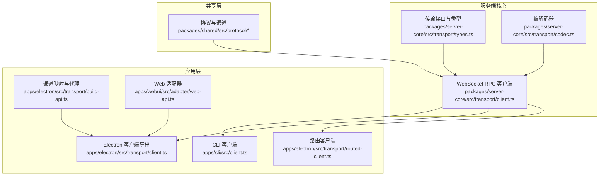
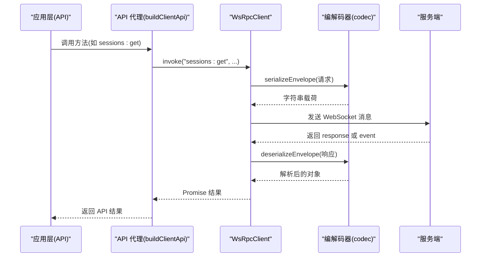
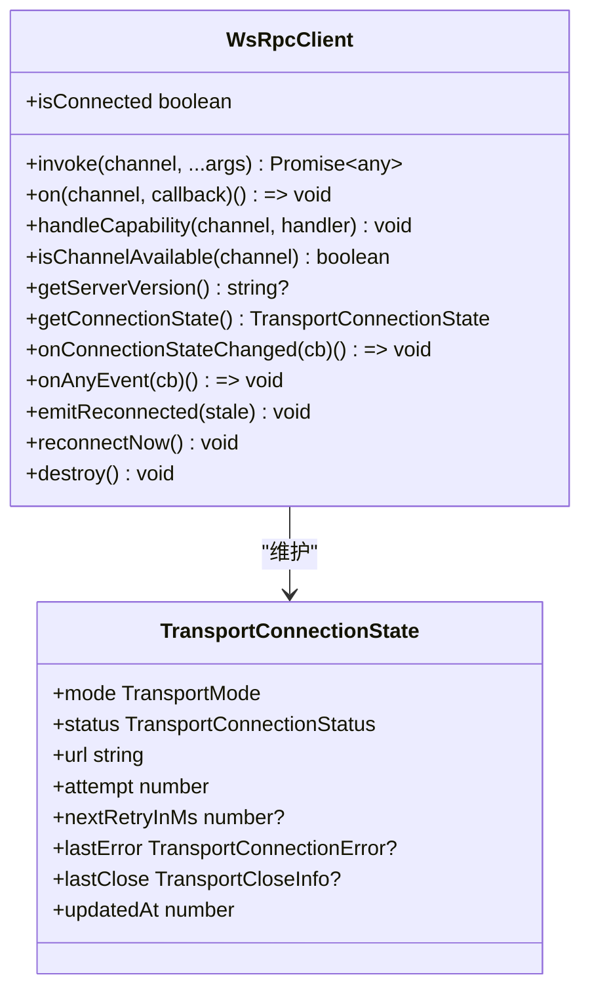
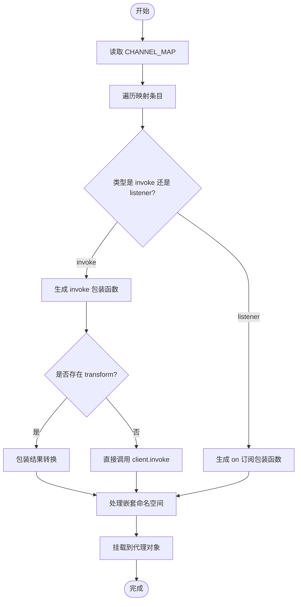
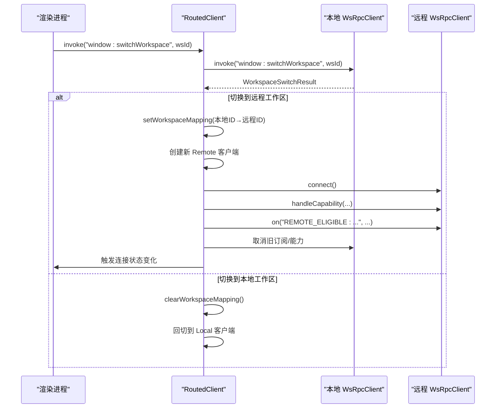
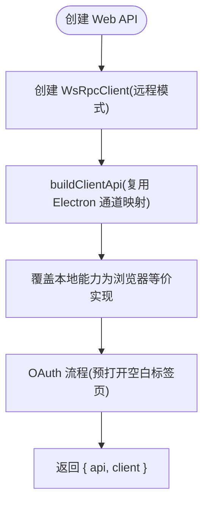
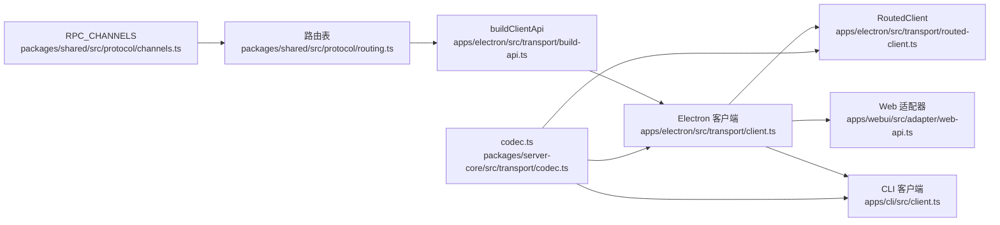
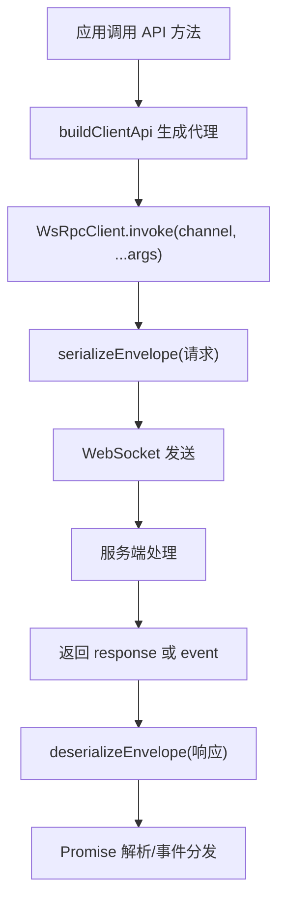

# API 客户端设计

<cite>
**本文档引用的文件**
- [apps/cli/src/client.ts](file://apps/cli/src/client.ts)
- [apps/cli/src/index.ts](file://apps/cli/src/index.ts)
- [apps/electron/src/transport/client.ts](file://apps/electron/src/transport/client.ts)
- [apps/electron/src/transport/build-api.ts](file://apps/electron/src/transport/build-api.ts)
- [apps/electron/src/transport/routed-client.ts](file://apps/electron/src/transport/routed-client.ts)
- [apps/webui/src/adapter/web-api.ts](file://apps/webui/src/adapter/web-api.ts)
- [packages/server-core/src/transport/client.ts](file://packages/server-core/src/transport/client.ts)
- [packages/server-core/src/transport/codec.ts](file://packages/server-core/src/transport/codec.ts)
- [packages/server-core/src/transport/types.ts](file://packages/server-core/src/transport/types.ts)
- [packages/shared/src/protocol/channels.ts](file://packages/shared/src/protocol/channels.ts)
- [packages/shared/src/protocol/routing.ts](file://packages/shared/src/protocol/routing.ts)
- [packages/shared/src/protocol/types.ts](file://packages/shared/src/protocol/types.ts)
</cite>

## 目录
1. [简介](#简介)
2. [项目结构](#项目结构)
3. [核心组件](#核心组件)
4. [架构总览](#架构总览)
5. [详细组件分析](#详细组件分析)
6. [依赖关系分析](#依赖关系分析)
7. [性能考虑](#性能考虑)
8. [故障排查指南](#故障排查指南)
9. [结论](#结论)
10. [附录](#附录)

## 简介
本文件系统性阐述该仓库中 API 客户端的设计与实现，覆盖 WebSocket 基础 RPC 客户端、通道路由与代理、事件订阅与可靠投递、错误与重连机制、以及在不同运行环境（CLI、Electron、Web）中的适配方案。文档重点解释：
- 整体架构：基于统一协议的 WebSocket RPC 层，抽象出 RpcClient 接口，上层通过通道映射构建 API 代理。
- 请求构建与响应处理：消息编解码、请求超时、错误码映射、状态码处理。
- 初始化配置：连接超时、请求超时、自动重连、TLS 选项等。
- 扩展能力：自定义客户端适配器、中间件扩展机制、请求链路追踪。

## 项目结构
该客户端体系横跨多个应用与共享包：
- 共享协议与通道命名：定义 RPC 通道、路由表、消息类型与错误码。
- 服务器核心传输层：通用 WebSocket RPC 客户端实现，支持可靠投递、重连与能力调用。
- 应用层适配：CLI、Electron、Web 三端分别复用同一传输层，通过通道映射生成 API 代理，并按需替换本地能力。

**图表来源**
- [packages/shared/src/protocol/channels.ts:1-449](file://packages/shared/src/protocol/channels.ts#L1-L449)
- [packages/server-core/src/transport/types.ts:1-29](file://packages/server-core/src/transport/types.ts#L1-L29)
- [packages/server-core/src/transport/client.ts:1-983](file://packages/server-core/src/transport/client.ts#L1-L983)
- [packages/server-core/src/transport/codec.ts:1-157](file://packages/server-core/src/transport/codec.ts#L1-L157)
- [apps/cli/src/client.ts:1-240](file://apps/cli/src/client.ts#L1-L240)
- [apps/electron/src/transport/client.ts:1-18](file://apps/electron/src/transport/client.ts#L1-L18)
- [apps/electron/src/transport/build-api.ts:1-66](file://apps/electron/src/transport/build-api.ts#L1-L66)
- [apps/electron/src/transport/routed-client.ts:1-256](file://apps/electron/src/transport/routed-client.ts#L1-L256)
- [apps/webui/src/adapter/web-api.ts:1-337](file://apps/webui/src/adapter/web-api.ts#L1-L337)

**章节来源**
- [packages/shared/src/protocol/channels.ts:1-449](file://packages/shared/src/protocol/channels.ts#L1-L449)
- [packages/server-core/src/transport/client.ts:1-983](file://packages/server-core/src/transport/client.ts#L1-L983)
- [apps/cli/src/client.ts:1-240](file://apps/cli/src/client.ts#L1-L240)
- [apps/electron/src/transport/build-api.ts:1-66](file://apps/electron/src/transport/build-api.ts#L1-L66)
- [apps/electron/src/transport/routed-client.ts:1-256](file://apps/electron/src/transport/routed-client.ts#L1-L256)
- [apps/webui/src/adapter/web-api.ts:1-337](file://apps/webui/src/adapter/web-api.ts#L1-L337)

## 核心组件
- WebSocket RPC 客户端（通用）
  - 支持握手、请求/响应关联、事件订阅、可靠投递（序列号）、能力调用、自动重连与指数退避。
  - 提供连接状态监听、通道可用性检查、手动重连触发。
- 通道映射与 API 代理
  - 将“方法名 → 通道”的映射转换为可调用的 API 对象，支持嵌套命名空间与结果变换。
- 路由客户端（Electron）
  - 在本地嵌入服务与远程工作区之间透明路由，支持工作区切换时的监听重订阅与能力注册迁移。
- Web 适配器
  - 复用 Electron 的通道映射与客户端，替换本地能力（如窗口管理、对话框、系统主题等）为浏览器等价实现。
- CLI 客户端
  - 精简版 RPC 客户端，无自动重连与能力，专注命令行场景。

**章节来源**
- [packages/server-core/src/transport/client.ts:1-983](file://packages/server-core/src/transport/client.ts#L1-L983)
- [apps/electron/src/transport/build-api.ts:1-66](file://apps/electron/src/transport/build-api.ts#L1-L66)
- [apps/electron/src/transport/routed-client.ts:1-256](file://apps/electron/src/transport/routed-client.ts#L1-L256)
- [apps/webui/src/adapter/web-api.ts:1-337](file://apps/webui/src/adapter/web-api.ts#L1-L337)
- [apps/cli/src/client.ts:1-240](file://apps/cli/src/client.ts#L1-L240)

## 架构总览
下图展示从应用到传输层的调用路径与职责边界：

**图表来源**
- [apps/electron/src/transport/build-api.ts:25-65](file://apps/electron/src/transport/build-api.ts#L25-L65)
- [packages/server-core/src/transport/client.ts:175-205](file://packages/server-core/src/transport/client.ts#L175-L205)
- [packages/server-core/src/transport/codec.ts:146-156](file://packages/server-core/src/transport/codec.ts#L146-L156)
- [packages/shared/src/protocol/types.ts:20-63](file://packages/shared/src/protocol/types.ts#L20-L63)

**章节来源**
- [apps/electron/src/transport/build-api.ts:1-66](file://apps/electron/src/transport/build-api.ts#L1-L66)
- [packages/server-core/src/transport/client.ts:175-205](file://packages/server-core/src/transport/client.ts#L175-L205)
- [packages/server-core/src/transport/codec.ts:1-157](file://packages/server-core/src/transport/codec.ts#L1-L157)
- [packages/shared/src/protocol/types.ts:1-80](file://packages/shared/src/protocol/types.ts#L1-L80)

## 详细组件分析

### 组件一：WebSocket RPC 客户端（通用）
- 角色与职责
  - 实现 RpcClient 接口，负责连接生命周期、消息编解码、请求/响应关联、事件分发、可靠投递与重连。
- 关键特性
  - 握手与认证：支持协议版本、工作区 ID、令牌、能力声明、重连上下文。
  - 可靠投递：跟踪事件序列号，定期发送序列确认，断线后根据 lastSeq 与 server:stale 判断是否需要全量刷新。
  - 自动重连：指数退避，最大延迟可配置；支持手动重连触发。
  - 错误分类：网络、超时、协议、认证、服务器等错误类型，连接状态中携带 lastError 与 lastClose。
  - 能力调用：支持服务端向客户端发起能力调用（capability），客户端注册处理器返回响应。
- 配置项
  - 连接超时、请求超时、最大重连延迟、自动重连开关、模式（本地/远程）、TLS 选项（仅 Node 环境）。
- 事件与状态
  - 连接状态变更回调、任意事件通配监听、重连完成事件（用于触发“过期恢复”逻辑）。

**图表来源**
- [packages/server-core/src/transport/client.ts:107-500](file://packages/server-core/src/transport/client.ts#L107-L500)
- [packages/server-core/src/transport/types.ts:15-29](file://packages/server-core/src/transport/types.ts#L15-L29)

**章节来源**
- [packages/server-core/src/transport/client.ts:1-983](file://packages/server-core/src/transport/client.ts#L1-L983)
- [packages/server-core/src/transport/types.ts:1-29](file://packages/server-core/src/transport/types.ts#L1-L29)

### 组件二：通道映射与 API 代理
- 设计目标
  - 将 ElectronAPI 的方法名映射到稳定的 RPC 通道字符串，构建运行时代理以替代原有的 preload。
- 实现要点
  - ChannelMapEntry 支持两类条目：invoke（调用）与 listener（订阅）。
  - 支持 transform 函数对结果进行转换（如 onboarding:getSetupNeeds 只取返回对象的特定字段）。
  - 嵌套方法名（如 "browserPane.create"）被拆分为命名空间对象，便于调用。
  - 提供 isChannelAvailable 检查，避免调用未注册通道。
- 使用方式
  - 传入 WsRpcClient、通道映射、通道可用性检查函数，生成 ElectronAPI 类型安全的代理对象。

**图表来源**
- [apps/electron/src/transport/build-api.ts:25-65](file://apps/electron/src/transport/build-api.ts#L25-L65)
- [apps/electron/src/transport/channel-map.ts:19-421](file://apps/electron/src/transport/channel-map.ts#L19-L421)

**章节来源**
- [apps/electron/src/transport/build-api.ts:1-66](file://apps/electron/src/transport/build-api.ts#L1-L66)
- [apps/electron/src/transport/channel-map.ts:1-421](file://apps/electron/src/transport/channel-map.ts#L1-L421)

### 组件三：路由客户端（Electron）
- 场景需求
  - Electron 渲染进程需要同时访问本地嵌入服务与远程工作区服务，且支持工作区切换。
- 路由策略
  - LOCAL_ONLY 通道始终路由到本地客户端；其他通道路由到当前工作区对应的客户端。
  - 工作区切换时，透明地创建新客户端、迁移能力注册与监听订阅，确保事件不丢失。
- 关键行为
  - 参数映射：当路由到远程工作区时，将本地工作区 ID 替换为远程工作区 ID，保证远程处理器能正确解析。
  - 监听迁移：REMOTE_ELIGIBLE 监听在新旧客户端间重新订阅，采用“先新后旧”的 make-before-break 策略。
  - 连接状态委托：将工作区客户端的连接状态变化转发给上层监听者。
  - 过期恢复：新客户端连接成功后，触发合成的 __transport:reconnected 事件，驱动 UI 进行过期状态刷新。

**图表来源**
- [apps/electron/src/transport/routed-client.ts:95-244](file://apps/electron/src/transport/routed-client.ts#L95-L244)
- [packages/shared/src/protocol/routing.ts:17-211](file://packages/shared/src/protocol/routing.ts#L17-L211)

**章节来源**
- [apps/electron/src/transport/routed-client.ts:1-256](file://apps/electron/src/transport/routed-client.ts#L1-L256)
- [packages/shared/src/protocol/routing.ts:1-216](file://packages/shared/src/protocol/routing.ts#L1-L216)

### 组件四：Web 适配器
- 目标
  - 在浏览器环境中复用 Electron 的通道映射与客户端，替换本地能力为浏览器等价实现。
- 适配点
  - 文件选择器：使用原生 <input type="file">。
  - 主题检测：使用 prefers-color-scheme 媒体查询。
  - 系统信息：返回浏览器用户代理与固定占位信息。
  - 窗口管理：无窗口概念，提供空实现或等价行为（如在新标签页打开会话）。
  - OAuth 流程：通过 RPC 启动授权，预打开空白标签页并在授权完成后跳转，兼容移动端弹窗限制。
  - 通知：使用浏览器 Web Notifications API。
  - 传输状态：透传底层客户端的连接状态。
- 优势
  - 保持 API 表面一致，降低前端差异成本。

**图表来源**
- [apps/webui/src/adapter/web-api.ts:66-336](file://apps/webui/src/adapter/web-api.ts#L66-L336)

**章节来源**
- [apps/webui/src/adapter/web-api.ts:1-337](file://apps/webui/src/adapter/web-api.ts#L1-L337)

### 组件五：CLI 客户端
- 特点
  - 精简实现，无自动重连、无能力、无连接状态监听，专注于一次性命令执行。
  - 支持握手、请求/响应、事件订阅与销毁清理。
- 典型用法
  - 连接 → 调用若干 RPC → 订阅事件流式输出 → 销毁客户端。

**章节来源**
- [apps/cli/src/client.ts:1-240](file://apps/cli/src/client.ts#L1-L240)
- [apps/cli/src/index.ts:247-784](file://apps/cli/src/index.ts#L247-L784)

## 依赖关系分析
- 协议与通道
  - RPC_CHANNELS 定义稳定通道字符串，routing.ts 提供 LOCAL_ONLY 与 REMOTE_ELIGIBLE 分类，确保每个通道唯一归属。
- 传输层
  - server-core 的 WsRpcClient 作为通用实现，被 CLI、Electron、Web 三端复用。
- 应用层
  - Electron 通过 build-api 与 channel-map 构建 API 代理；routed-client 实现混合本地/远程路由。
  - Web 适配器复用 Electron 的映射与客户端，替换本地能力。
- 编解码
  - codec.ts 负责消息体的 JSON 序列化与二进制数组的 Base64 编解码，确保跨语言传输一致性。

**图表来源**
- [packages/shared/src/protocol/channels.ts:1-449](file://packages/shared/src/protocol/channels.ts#L1-L449)
- [packages/shared/src/protocol/routing.ts:1-216](file://packages/shared/src/protocol/routing.ts#L1-L216)
- [apps/electron/src/transport/build-api.ts:1-66](file://apps/electron/src/transport/build-api.ts#L1-L66)
- [apps/electron/src/transport/client.ts:1-18](file://apps/electron/src/transport/client.ts#L1-L18)
- [apps/electron/src/transport/routed-client.ts:1-256](file://apps/electron/src/transport/routed-client.ts#L1-L256)
- [apps/webui/src/adapter/web-api.ts:1-337](file://apps/webui/src/adapter/web-api.ts#L1-L337)
- [apps/cli/src/client.ts:1-240](file://apps/cli/src/client.ts#L1-L240)
- [packages/server-core/src/transport/codec.ts:1-157](file://packages/server-core/src/transport/codec.ts#L1-L157)

**章节来源**
- [packages/shared/src/protocol/channels.ts:1-449](file://packages/shared/src/protocol/channels.ts#L1-L449)
- [packages/shared/src/protocol/routing.ts:1-216](file://packages/shared/src/protocol/routing.ts#L1-L216)
- [apps/electron/src/transport/build-api.ts:1-66](file://apps/electron/src/transport/build-api.ts#L1-L66)
- [apps/electron/src/transport/routed-client.ts:1-256](file://apps/electron/src/transport/routed-client.ts#L1-L256)
- [apps/webui/src/adapter/web-api.ts:1-337](file://apps/webui/src/adapter/web-api.ts#L1-L337)
- [apps/cli/src/client.ts:1-240](file://apps/cli/src/client.ts#L1-L240)
- [packages/server-core/src/transport/codec.ts:1-157](file://packages/server-core/src/transport/codec.ts#L1-L157)

## 性能考虑
- 连接与重连
  - 指数退避上限可配置，避免风暴重连；稳定连接后延时重置退避，减少抖动。
  - 连接超时与请求超时分离，避免握手超时影响业务请求。
- 可靠投递
  - 事件序列号与序列确认降低丢包风险；断线后根据 server:stale 决定全量刷新，平衡一致性与性能。
- 编解码优化
  - 二进制数组通过 Base64 编解码，避免大对象深拷贝开销；在 Node 环境优先使用 Buffer。
- 并发控制
  - 当前实现未内置全局并发上限；可通过上层调用侧进行限流或队列化处理。

[本节为通用指导，无需具体文件分析]

## 故障排查指南
- 连接失败
  - 检查连接超时、握手拒绝（协议版本不支持、认证失败）、网络错误与关闭码。
  - 查看 lastError 与 lastClose 信息，定位是网络、协议还是服务器原因。
- 请求超时
  - 调整 requestTimeout；检查服务端处理耗时与事件阻塞。
- 通道不可用
  - 使用 isChannelAvailable 检查；若服务端未提供已注册通道列表，则默认视为可用。
- 重连异常
  - 观察重连尝试次数与下次重连时间；确认服务端是否主动关闭（server:shuttingDown）。
- 事件丢失或乱序
  - 检查事件序列号 gap 与 lastSeq；必要时触发“过期恢复”刷新。
- Web 端 OAuth 弹窗被拦截
  - 确保在用户手势内同步打开空白标签页并立即跳转授权 URL；降级为同窗口跳转。

**章节来源**
- [packages/server-core/src/transport/client.ts:504-776](file://packages/server-core/src/transport/client.ts#L504-L776)
- [packages/server-core/src/transport/codec.ts:122-156](file://packages/server-core/src/transport/codec.ts#L122-L156)
- [apps/webui/src/adapter/web-api.ts:238-331](file://apps/webui/src/adapter/web-api.ts#L238-L331)

## 结论
该客户端体系以统一协议与通用传输层为核心，结合通道映射与代理机制，在 CLI、Electron、Web 三端实现一致的 API 表面与行为。通过路由客户端与可靠投递、错误分类与重连策略，满足复杂场景下的稳定性与可扩展性需求。建议在扩展新功能时遵循以下原则：
- 严格遵守通道分类（LOCAL_ONLY vs REMOTE_ELIGIBLE）。
- 使用通道映射与代理，避免硬编码通道字符串。
- 在服务端实现中暴露通道注册清单，提升客户端可用性检查的准确性。
- 对于高并发或长耗时操作，结合上层限流与队列化策略，配合可靠的超时与重试配置。

[本节为总结，无需具体文件分析]

## 附录

### 请求构建与响应处理流程

**图表来源**
- [apps/electron/src/transport/build-api.ts:25-65](file://apps/electron/src/transport/build-api.ts#L25-L65)
- [packages/server-core/src/transport/client.ts:175-205](file://packages/server-core/src/transport/client.ts#L175-L205)
- [packages/server-core/src/transport/codec.ts:146-156](file://packages/server-core/src/transport/codec.ts#L146-L156)

### 请求参数序列化与 URL 构建
- 参数序列化
  - 通过 codec.encodeWireValue 与 JSON.stringify 实现；二进制数组转换为带标记的 Base64 对象，确保跨语言一致性。
- URL 构建
  - 客户端构造 WebSocket URL（ws:// 或 wss://），在 Node 环境可配置 TLS 选项；浏览器端使用全局 WebSocket。
- HTTP 方法封装
  - 本项目基于 WebSocket RPC，不涉及 HTTP 方法封装；如需 HTTP 适配，可在应用层新增适配器并复用通道映射。

**章节来源**
- [packages/server-core/src/transport/codec.ts:68-114](file://packages/server-core/src/transport/codec.ts#L68-L114)
- [packages/server-core/src/transport/client.ts:328-344](file://packages/server-core/src/transport/client.ts#L328-L344)

### 响应数据解析与错误码映射
- 响应解析
  - 通过 deserializeEnvelope 与 decodeWireValue 解析；校验消息体形状 validateEnvelopeShape。
- 错误码映射
  - 协议层定义错误码类型（如 HANDLER_ERROR、CHANNEL_NOT_FOUND、AUTH_FAILED、PROTOCOL_VERSION_UNSUPPORTED、SESSION_NOT_IDLE 等）。
  - 客户端将错误码映射到 Error 对象的 code 与 data 字段，便于上层处理。

**章节来源**
- [packages/server-core/src/transport/codec.ts:122-156](file://packages/server-core/src/transport/codec.ts#L122-L156)
- [packages/shared/src/protocol/types.ts:65-80](file://packages/shared/src/protocol/types.ts#L65-L80)

### 请求超时、重试策略与并发控制
- 请求超时
  - 可配置 requestTimeout；超时后拒绝 Promise 并清理 pending。
- 重试策略
  - 自动重连：指数退避，上限可配置；支持手动重连触发。
  - 重连上下文：握手时携带 reconnectClientId 与 lastSeq，服务端识别后可恢复会话。
- 并发控制
  - 未内置全局并发上限；建议在应用层进行调用侧限流或队列化。

**章节来源**
- [packages/server-core/src/transport/client.ts:175-205](file://packages/server-core/src/transport/client.ts#L175-L205)
- [packages/server-core/src/transport/client.ts:691-798](file://packages/server-core/src/transport/client.ts#L691-L798)

### 自定义客户端适配器开发指南
- 适配器职责
  - 在不同运行环境（如小程序、Unity、Flutter）中复用通道映射与传输层，替换本地能力为对应平台实现。
- 开发步骤
  - 引入 WsRpcClient 与 buildClientApi。
  - 定义本地能力替换映射（如文件对话框、系统主题、通知等）。
  - 通过 Electron 的 CHANNEL_MAP 保持 API 表面一致。
- 中间件扩展机制
  - 可在应用层对 API 代理进行二次包装，注入日志、埋点、鉴权等横切关注点。
- 请求链路追踪
  - 建议在应用层为每次 invoke 注入 traceId，并在服务端记录；客户端可记录请求/响应时间与错误信息。

**章节来源**
- [apps/electron/src/transport/build-api.ts:25-65](file://apps/electron/src/transport/build-api.ts#L25-L65)
- [apps/webui/src/adapter/web-api.ts:87-235](file://apps/webui/src/adapter/web-api.ts#L87-L235)