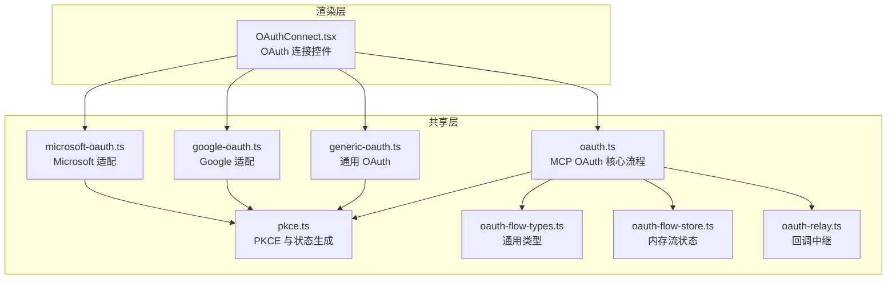
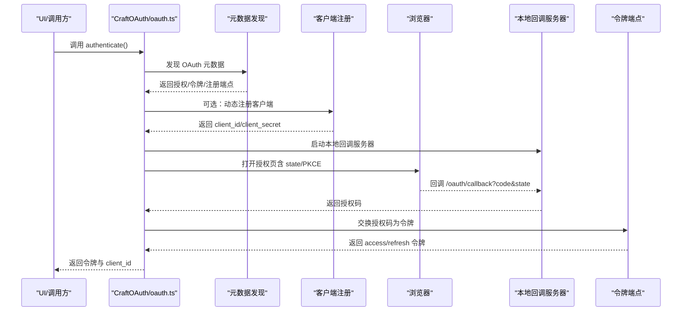
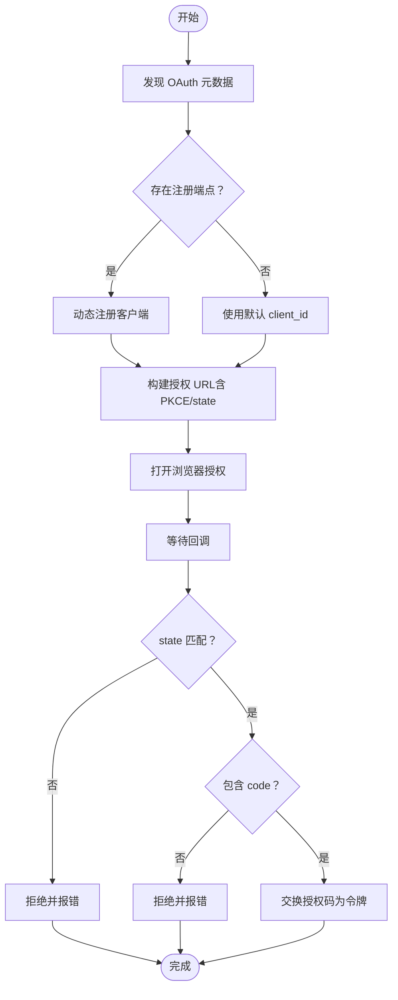
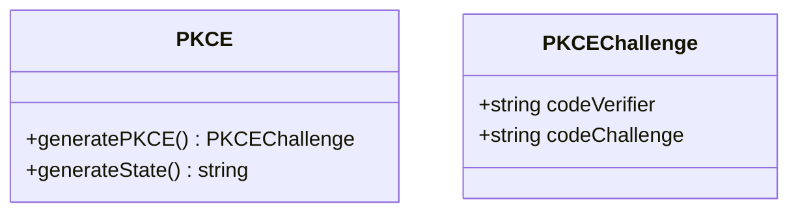
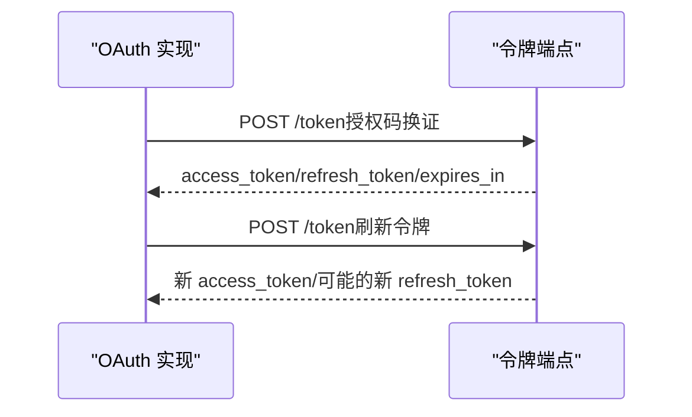
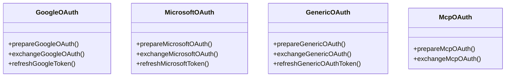
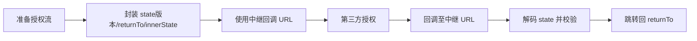
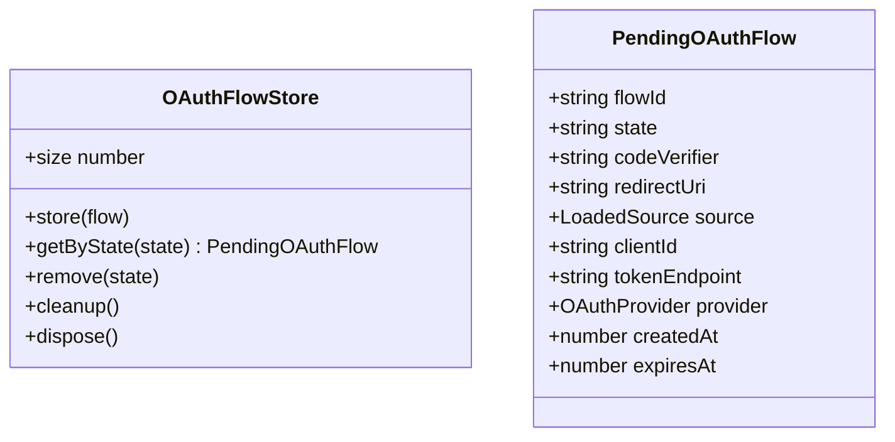
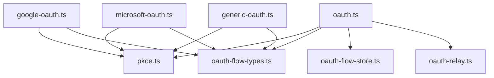

# OAuth 认证流程

<cite>
**本文档引用的文件**
- [oauth.ts](file://packages/shared/src/auth/oauth.ts)
- [pkce.ts](file://packages/shared/src/auth/pkce.ts)
- [oauth-flow-types.ts](file://packages/shared/src/auth/oauth-flow-types.ts)
- [generic-oauth.ts](file://packages/shared/src/auth/generic-oauth.ts)
- [google-oauth.ts](file://packages/shared/src/auth/google-oauth.ts)
- [microsoft-oauth.ts](file://packages/shared/src/auth/microsoft-oauth.ts)
- [oauth-relay.ts](file://packages/shared/src/auth/oauth-relay.ts)
- [oauth-flow-store.ts](file://packages/shared/src/auth/oauth-flow-store.ts)
- [OAuthConnect.tsx](file://apps/electron/src/renderer/components/apisetup/OAuthConnect.tsx)
</cite>

## 目录
1. [简介](#简介)
2. [项目结构](#项目结构)
3. [核心组件](#核心组件)
4. [架构总览](#架构总览)
5. [详细组件分析](#详细组件分析)
6. [依赖关系分析](#依赖关系分析)
7. [性能考量](#性能考量)
8. [故障排除指南](#故障排除指南)
9. [结论](#结论)
10. [附录](#附录)

## 简介
本文件系统性阐述该代码库中的 OAuth 2.0 认证实现，覆盖授权码流程、令牌交换机制、端点发现与回调处理、状态验证、PKCE 安全增强、一次性令牌生成、浏览器安全考虑、令牌存储与自动刷新、过期处理、多提供商适配、自定义认证适配器开发、错误处理与重试策略，并提供第三方服务集成示例、调试工具与安全最佳实践。目标读者为需要实现 OAuth 认证或集成第三方服务的开发者。

## 项目结构
OAuth 相关代码主要位于共享包的 auth 目录中，按功能模块化组织：
- 核心流程：oauth.ts（MCP 服务器 OAuth）、pkce.ts（PKCE 工具）
- 多提供商适配：google-oauth.ts、microsoft-oauth.ts、generic-oauth.ts
- 流程编排：oauth-flow-types.ts（类型）、oauth-flow-store.ts（内存流状态）、oauth-relay.ts（跨域回调中继）
- UI 集成：apps/electron/src/renderer/components/apisetup/OAuthConnect.tsx（OAuth 连接控件）

**图表来源**
- [oauth.ts](file://packages/shared/src/auth/oauth.ts)
- [pkce.ts](file://packages/shared/src/auth/pkce.ts)
- [oauth-flow-types.ts](file://packages/shared/src/auth/oauth-flow-types.ts)
- [oauth-flow-store.ts](file://packages/shared/src/auth/oauth-flow-store.ts)
- [oauth-relay.ts](file://packages/shared/src/auth/oauth-relay.ts)
- [generic-oauth.ts](file://packages/shared/src/auth/generic-oauth.ts)
- [google-oauth.ts](file://packages/shared/src/auth/google-oauth.ts)
- [microsoft-oauth.ts](file://packages/shared/src/auth/microsoft-oauth.ts)
- [OAuthConnect.tsx](file://apps/electron/src/renderer/components/apisetup/OAuthConnect.tsx)

**章节来源**
- [oauth.ts](file://packages/shared/src/auth/oauth.ts)
- [pkce.ts](file://packages/shared/src/auth/pkce.ts)
- [oauth-flow-types.ts](file://packages/shared/src/auth/oauth-flow-types.ts)
- [oauth-flow-store.ts](file://packages/shared/src/auth/oauth-flow-store.ts)
- [oauth-relay.ts](file://packages/shared/src/auth/oauth-relay.ts)
- [generic-oauth.ts](file://packages/shared/src/auth/generic-oauth.ts)
- [google-oauth.ts](file://packages/shared/src/auth/google-oauth.ts)
- [microsoft-oauth.ts](file://packages/shared/src/auth/microsoft-oauth.ts)
- [OAuthConnect.tsx](file://apps/electron/src/renderer/components/apisetup/OAuthConnect.tsx)

## 核心组件
- OAuth 元数据发现与端点解析：支持 RFC 9728 受保护资源元数据与 RFC 8414 标准发现路径，内置超时与 SSRF 限制。
- 授权码流程：动态客户端注册（可选）、PKCE、状态参数校验、本地回调服务器、浏览器打开授权页。
- 令牌交换：统一的授权码换证流程，支持 JSON 与表单响应解析。
- 自动刷新：基于 refresh_token 的令牌刷新，返回新的 access_token 与可能的刷新令牌轮换。
- 多提供商适配：Google、Microsoft、通用 OAuth 提供商，以及 MCP 专用流程。
- 存储与会话：内存流状态管理（5 分钟 TTL），回调中继（跨域场景）。
- UI 集成：OAuthConnect 控件支持手动粘贴授权码与状态反馈。

**章节来源**
- [oauth.ts](file://packages/shared/src/auth/oauth.ts)
- [oauth-flow-types.ts](file://packages/shared/src/auth/oauth-flow-types.ts)
- [oauth-flow-store.ts](file://packages/shared/src/auth/oauth-flow-store.ts)
- [oauth-relay.ts](file://packages/shared/src/auth/oauth-relay.ts)
- [generic-oauth.ts](file://packages/shared/src/auth/generic-oauth.ts)
- [google-oauth.ts](file://packages/shared/src/auth/google-oauth.ts)
- [microsoft-oauth.ts](file://packages/shared/src/auth/microsoft-oauth.ts)
- [OAuthConnect.tsx](file://apps/electron/src/renderer/components/apisetup/OAuthConnect.tsx)

## 架构总览
下图展示从发起到完成的 OAuth 授权码流程，涵盖端点发现、动态注册、回调处理、令牌交换与刷新。

**图表来源**
- [oauth.ts](file://packages/shared/src/auth/oauth.ts)

## 详细组件分析

### 1) 授权码流程与回调处理
- 端点发现：优先使用 RFC 9728 受保护资源元数据，其次尝试标准发现路径；带超时与日志。
- 动态注册：在存在注册端点时进行客户端注册，避免硬编码凭据；若返回 401/403 则回退默认 client_id。
- 回调服务器：在 8914–8924 端口范围内绑定，消除 TOCTOU 风险；仅接受 /oauth/callback 路径；校验 state，拒绝无 code 或含 error 的回调；成功后返回深链以回到会话。
- 状态验证：严格比对 state，防止 CSRF 攻击；超时控制（5 分钟）。
- 浏览器安全：URL 安全检查（HTTPS、非私网地址），SSRF 防护。

**图表来源**
- [oauth.ts](file://packages/shared/src/auth/oauth.ts)

**章节来源**
- [oauth.ts](file://packages/shared/src/auth/oauth.ts)

### 2) PKCE 扩展与一次性令牌
- PKCE 生成：随机 base64url 字符串作为 verifier，SHA256 哈希后 base64url 作为 challenge，满足 RFC 7636。
- 状态参数：随机 base64url 字符串用于 CSRF 防护。
- 一次性令牌：授权码仅能使用一次，且必须携带正确的 code_verifier 才能换取令牌。

**图表来源**
- [pkce.ts](file://packages/shared/src/auth/pkce.ts)

**章节来源**
- [pkce.ts](file://packages/shared/src/auth/pkce.ts)

### 3) 令牌交换机制与自动刷新
- 交换流程：向令牌端点发送授权码、verifier、redirect_uri、grant_type 等参数，解析 JSON 或表单响应。
- 刷新流程：使用 refresh_token 换取新 access_token，必要时更新 refresh_token（轮换）。
- 过期处理：若未返回 expires_in，默认按 1 小时计算，确保后续刷新逻辑可用。

**图表来源**
- [oauth.ts](file://packages/shared/src/auth/oauth.ts)
- [generic-oauth.ts](file://packages/shared/src/auth/generic-oauth.ts)

**章节来源**
- [oauth.ts](file://packages/shared/src/auth/oauth.ts)
- [generic-oauth.ts](file://packages/shared/src/auth/generic-oauth.ts)

### 4) 多提供商适配
- Google OAuth：预置服务范围集合，要求 client_secret（桌面应用），支持离线访问与同意提示，返回用户邮箱。
- Microsoft OAuth：使用 Azure AD common 租户，支持委托权限与 offline_access，返回邮箱或 UPN。
- 通用 OAuth：通过配置文件指定授权/令牌端点、client_id、scopes、audience、extraParams，支持任意 OAuth 2.0 提供商。
- MCP OAuth：专用于 Craft MCP 服务器，支持动态注册与元数据发现。

**图表来源**
- [google-oauth.ts](file://packages/shared/src/auth/google-oauth.ts)
- [microsoft-oauth.ts](file://packages/shared/src/auth/microsoft-oauth.ts)
- [generic-oauth.ts](file://packages/shared/src/auth/generic-oauth.ts)
- [oauth.ts](file://packages/shared/src/auth/oauth.ts)

**章节来源**
- [google-oauth.ts](file://packages/shared/src/auth/google-oauth.ts)
- [microsoft-oauth.ts](file://packages/shared/src/auth/microsoft-oauth.ts)
- [generic-oauth.ts](file://packages/shared/src/auth/generic-oauth.ts)
- [oauth.ts](file://packages/shared/src/auth/oauth.ts)

### 5) 回调中继与跨域场景
- 中继回调：通过固定回调 URL 与版本化 state 包裹 returnTo 地址，解决跨域回调问题。
- 状态封装：state 包含版本号、返回地址与内部 state，解码时进行严格校验。

**图表来源**
- [oauth-relay.ts](file://packages/shared/src/auth/oauth-relay.ts)

**章节来源**
- [oauth-relay.ts](file://packages/shared/src/auth/oauth-relay.ts)

### 6) 流程状态管理与 UI 集成
- 内存流状态：以 state 为键的 PendingOAuthFlow，5 分钟 TTL，惰性清理与周期清理。
- UI 控件：OAuthConnect 支持“等待授权码”与错误信息展示，便于在设置或引导流程中集成。

**图表来源**
- [oauth-flow-store.ts](file://packages/shared/src/auth/oauth-flow-store.ts)

**章节来源**
- [oauth-flow-store.ts](file://packages/shared/src/auth/oauth-flow-store.ts)
- [OAuthConnect.tsx](file://apps/electron/src/renderer/components/apisetup/OAuthConnect.tsx)

## 依赖关系分析
- 模块内聚：各提供商适配器独立封装，复用 PKCE 与通用类型。
- 外部依赖：fetch、crypto、http（本地回调服务器）、URL（查询参数解析）。
- 耦合点：oauth.ts 作为核心协调者，依赖 PKCE、类型、元数据发现、回调页面生成与深链构建；提供商适配器通过通用类型与交换函数对接。

**图表来源**
- [oauth.ts](file://packages/shared/src/auth/oauth.ts)
- [pkce.ts](file://packages/shared/src/auth/pkce.ts)
- [oauth-flow-types.ts](file://packages/shared/src/auth/oauth-flow-types.ts)
- [oauth-flow-store.ts](file://packages/shared/src/auth/oauth-flow-store.ts)
- [oauth-relay.ts](file://packages/shared/src/auth/oauth-relay.ts)
- [google-oauth.ts](file://packages/shared/src/auth/google-oauth.ts)
- [microsoft-oauth.ts](file://packages/shared/src/auth/microsoft-oauth.ts)
- [generic-oauth.ts](file://packages/shared/src/auth/generic-oauth.ts)

**章节来源**
- [oauth.ts](file://packages/shared/src/auth/oauth.ts)
- [google-oauth.ts](file://packages/shared/src/auth/google-oauth.ts)
- [microsoft-oauth.ts](file://packages/shared/src/auth/microsoft-oauth.ts)
- [generic-oauth.ts](file://packages/shared/src/auth/generic-oauth.ts)

## 性能考量
- 端口绑定：本地回调服务器在 8914–8924 范围内顺序尝试，避免竞争与 TOCTOU；建议在高并发场景下预留更多端口。
- 元数据发现：带超时（默认 5 秒），减少阻塞；优先 RFC 9728，降低网络往返。
- 内存流状态：Map 结构 O(1) 查找，定期清理降低内存占用。
- 令牌刷新：尽量在后台静默执行，避免频繁刷新导致请求峰值。

## 故障排除指南
- 回调无响应：检查本地端口是否被占用、防火墙放行、浏览器是否拦截弹窗；确认回调路径与期望 state 一致。
- 状态不匹配：严格校验 state，防止 CSRF；如使用中继回调，确认 state 包裹与解码正确。
- 令牌交换失败：检查授权码是否过期（仅一次有效）、verifier 是否匹配、redirect_uri 是否一致；查看提供商返回的错误描述。
- 刷新失败：确认 refresh_token 是否存在、是否被撤销；部分提供商（如 Google）刷新时需 client_secret。
- SSRF/URL 安全：确保授权/令牌端点为 HTTPS，非私网地址；如使用自定义端点，遵循安全策略。

**章节来源**
- [oauth.ts](file://packages/shared/src/auth/oauth.ts)
- [generic-oauth.ts](file://packages/shared/src/auth/generic-oauth.ts)
- [google-oauth.ts](file://packages/shared/src/auth/google-oauth.ts)
- [microsoft-oauth.ts](file://packages/shared/src/auth/microsoft-oauth.ts)

## 结论
该实现以模块化方式覆盖了 OAuth 2.0 授权码流程的关键环节：端点发现、动态注册、PKCE、状态校验、回调处理、令牌交换与刷新。通过多提供商适配与内存流状态管理，既保证了安全性，又提供了良好的扩展性与可维护性。建议在生产环境中结合严格的 URL 安全策略、完善的错误处理与可观测性监控，持续优化用户体验与系统稳定性。

## 附录

### A. 第三方服务集成示例
- Google：通过服务枚举或自定义 scopes，启用 offline_access 获取刷新令牌；返回用户邮箱。
- Microsoft：使用 common 租户端点，支持委托权限与 offline_access；返回邮箱或 UPN。
- 通用提供商：在配置中提供授权/令牌端点、client_id、scopes、audience、extraParams，即可快速接入。

**章节来源**
- [google-oauth.ts](file://packages/shared/src/auth/google-oauth.ts)
- [microsoft-oauth.ts](file://packages/shared/src/auth/microsoft-oauth.ts)
- [generic-oauth.ts](file://packages/shared/src/auth/generic-oauth.ts)

### B. 自定义认证适配器开发指南
- 步骤
  1) 定义提供商类型与配置接口，参考 OAuthProvider 与 ApiOAuthConfig。
  2) 实现 prepareXxxOAuth：生成 PKCE、state，构造授权 URL，返回 PreparedOAuthFlow。
  3) 实现 exchangeXxxOAuth：调用令牌端点，解析响应，返回 OAuthExchangeResult。
  4) 如需刷新，实现 refreshXxxToken：使用 refresh_token 换取新令牌。
  5) 在服务端路由中调用 exchangeAndStore，持久化令牌与相关元数据。
- 注意事项
  - 严格校验 state 与 code_verifier。
  - 对表单与 JSON 响应均做兼容解析。
  - 处理提供商特有的错误码与错误描述。
  - 若支持动态注册，注意 401/403 回退策略。

**章节来源**
- [oauth-flow-types.ts](file://packages/shared/src/auth/oauth-flow-types.ts)
- [generic-oauth.ts](file://packages/shared/src/auth/generic-oauth.ts)
- [oauth.ts](file://packages/shared/src/auth/oauth.ts)

### C. 安全最佳实践
- 使用 PKCE（S256）与 CSRF state。
- 仅使用 HTTPS 与受信任域名。
- 限制本地回调端口范围，避免暴露过多端口。
- 对令牌与密钥进行最小化存储与加密保护。
- 定期轮换 refresh_token，监控异常登录与令牌滥用。