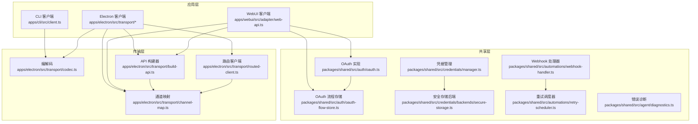
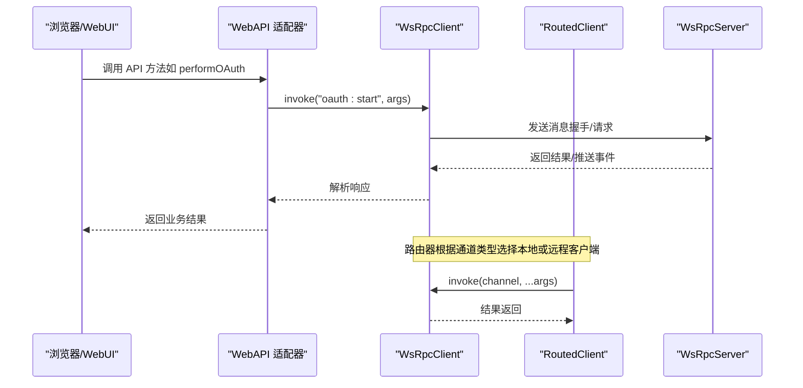
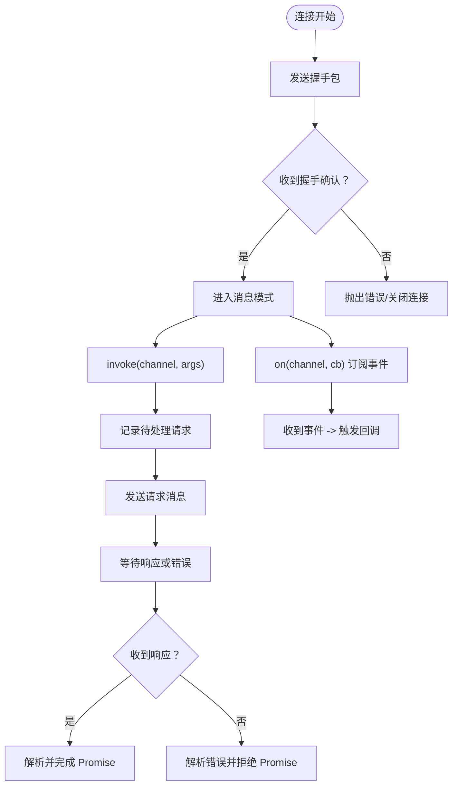
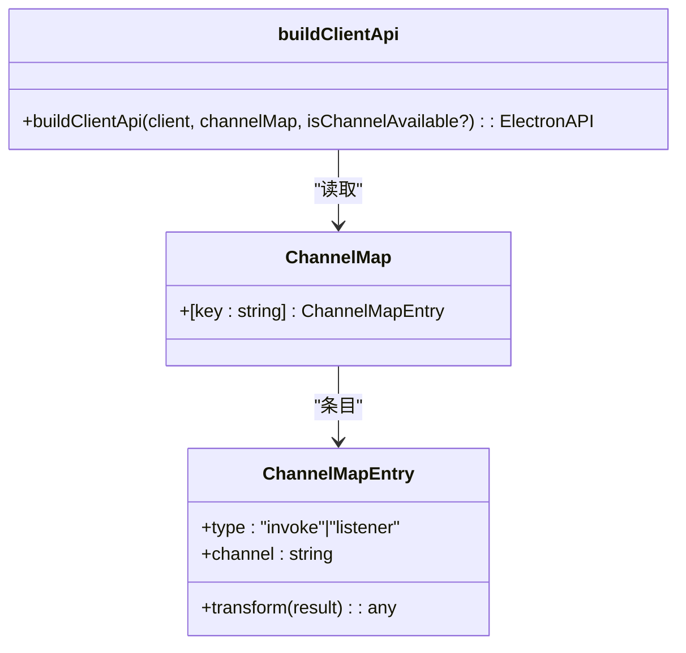
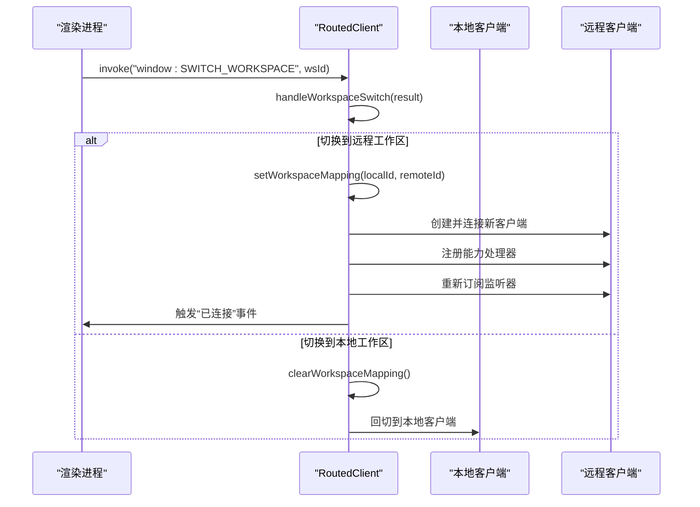
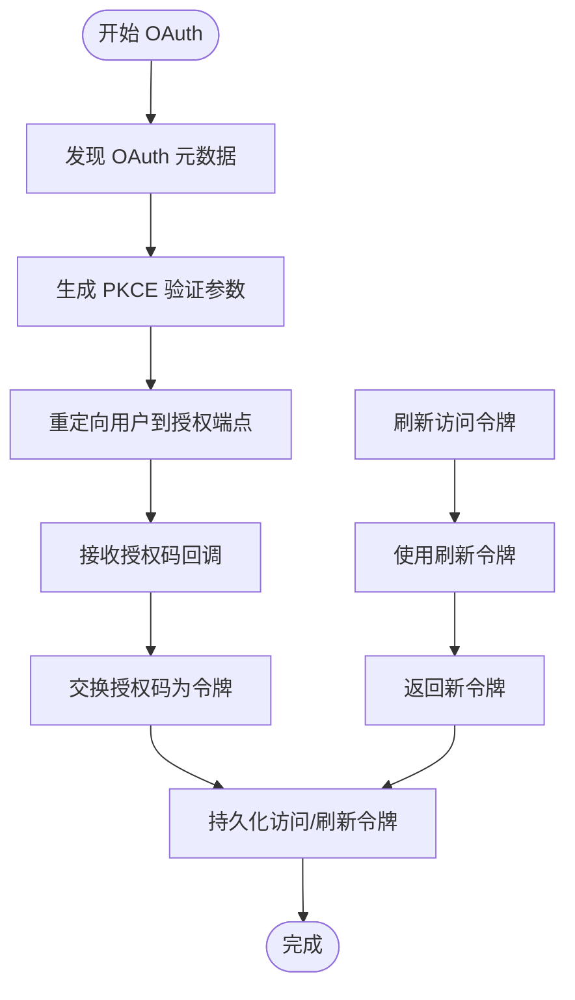
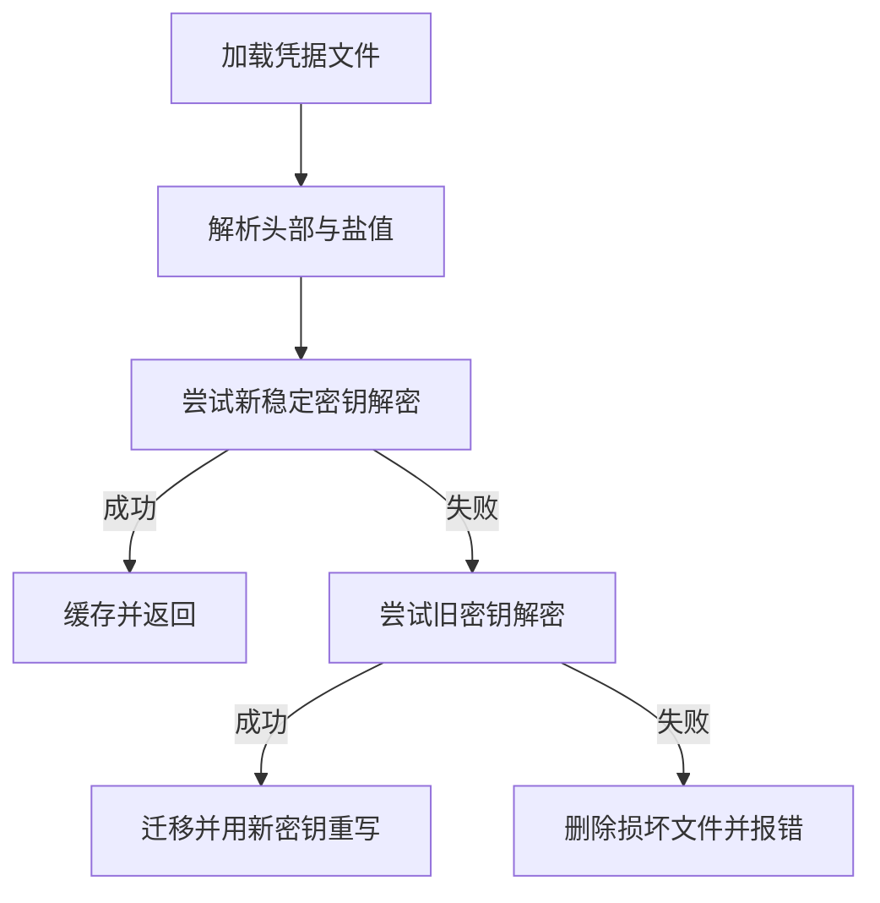
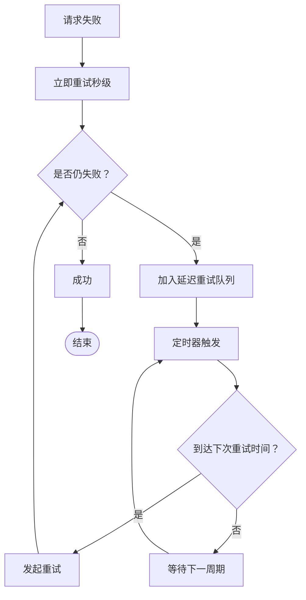
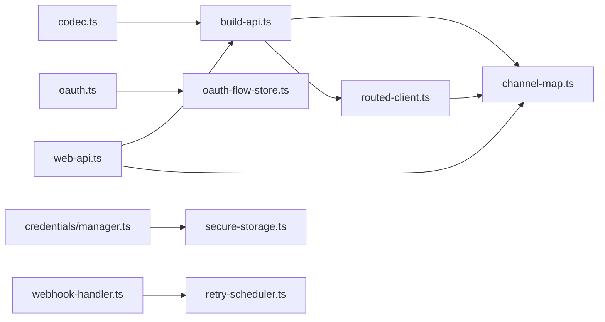

# REST API 集成

<cite>
**本文引用的文件**
- [apps/cli/src/client.ts](file://apps/cli/src/client.ts)
- [apps/electron/src/transport/build-api.ts](file://apps/electron/src/transport/build-api.ts)
- [apps/electron/src/transport/client.ts](file://apps/electron/src/transport/client.ts)
- [apps/electron/src/transport/routed-client.ts](file://apps/electron/src/transport/routed-client.ts)
- [apps/electron/src/transport/index.ts](file://apps/electron/src/transport/index.ts)
- [apps/electron/src/transport/server.ts](file://apps/electron/src/transport/server.ts)
- [apps/electron/src/transport/codec.ts](file://apps/electron/src/transport/codec.ts)
- [apps/webui/src/adapter/web-api.ts](file://apps/webui/src/adapter/web-api.ts)
- [apps/electron/src/transport/channel-map.ts](file://apps/electron/src/transport/channel-map.ts)
- [packages/shared/src/credentials/backends/secure-storage.ts](file://packages/shared/src/credentials/backends/secure-storage.ts)
- [packages/shared/src/credentials/manager.ts](file://packages/shared/src/credentials/manager.ts)
- [packages/shared/src/auth/oauth.ts](file://packages/shared/src/auth/oauth.ts)
- [packages/shared/src/auth/oauth-flow-store.ts](file://packages/shared/src/auth/oauth-flow-store.ts)
- [packages/shared/src/automations/retry-scheduler.ts](file://packages/shared/src/automations/retry-scheduler.ts)
- [packages/shared/src/automations/webhook-handler.ts](file://packages/shared/src/automations/webhook-handler.ts)
- [packages/shared/src/agent/diagnostics.ts](file://packages/shared/src/agent/diagnostics.ts)
- [README.md](file://README.md)
</cite>

## 目录
1. [简介](#简介)
2. [项目结构](#项目结构)
3. [核心组件](#核心组件)
4. [架构总览](#架构总览)
5. [详细组件分析](#详细组件分析)
6. [依赖关系分析](#依赖关系分析)
7. [性能考量](#性能考量)
8. [故障排查指南](#故障排查指南)
9. [结论](#结论)
10. [附录](#附录)

## 简介
本文件面向需要集成外部 REST 服务或开发 API 客户端的开发者，系统化阐述本项目的 REST API 集成设计与实现。内容涵盖：
- API 客户端架构与请求/响应模型
- OAuth 认证流程、令牌管理与自动刷新策略
- 凭据存储方案（加密保护）、安全传输（TLS）
- API 版本管理、错误重试机制、超时配置
- 第三方 API 集成示例、自定义认证适配器开发思路
- 速率限制处理、响应缓存策略、数据转换与批量操作优化

## 项目结构
本项目采用多应用与多包的分层组织方式：
- 应用层：CLI、Electron 桌面端、WebUI
- 传输层：基于 WebSocket 的 RPC 客户端/服务端与通道路由
- 共享层：认证、凭据、自动化与诊断等通用能力

图表来源
- [apps/cli/src/client.ts:1-240](file://apps/cli/src/client.ts#L1-L240)
- [apps/electron/src/transport/build-api.ts:1-66](file://apps/electron/src/transport/build-api.ts#L1-L66)
- [apps/electron/src/transport/routed-client.ts:1-256](file://apps/electron/src/transport/routed-client.ts#L1-L256)
- [apps/webui/src/adapter/web-api.ts:1-337](file://apps/webui/src/adapter/web-api.ts#L1-L337)
- [packages/shared/src/auth/oauth.ts:35-331](file://packages/shared/src/auth/oauth.ts#L35-L331)
- [packages/shared/src/auth/oauth-flow-store.ts:45-106](file://packages/shared/src/auth/oauth-flow-store.ts#L45-L106)
- [packages/shared/src/credentials/backends/secure-storage.ts:1-358](file://packages/shared/src/credentials/backends/secure-storage.ts#L1-L358)
- [packages/shared/src/automations/retry-scheduler.ts:1-247](file://packages/shared/src/automations/retry-scheduler.ts#L1-L247)
- [packages/shared/src/automations/webhook-handler.ts:62-111](file://packages/shared/src/automations/webhook-handler.ts#L62-L111)

章节来源
- [README.md:347-369](file://README.md#L347-L369)

## 核心组件
- WebSocket RPC 客户端与服务端：统一的请求/响应模型，支持握手、事件推送、连接状态监听与重连。
- 通道路由与代理：将方法名映射到通道，支持本地/远程工作区切换与透明重订阅。
- OAuth 与凭据管理：动态注册客户端、PKCE 授权码交换、令牌刷新、持久化存储与迁移。
- 错误诊断与重试：按状态分类诊断、指数退避与延迟队列重试、速率限制防护。

章节来源
- [apps/cli/src/client.ts:38-240](file://apps/cli/src/client.ts#L38-L240)
- [apps/electron/src/transport/routed-client.ts:40-256](file://apps/electron/src/transport/routed-client.ts#L40-L256)
- [apps/electron/src/transport/build-api.ts:25-66](file://apps/electron/src/transport/build-api.ts#L25-L66)
- [apps/webui/src/adapter/web-api.ts:66-337](file://apps/webui/src/adapter/web-api.ts#L66-L337)
- [packages/shared/src/auth/oauth.ts:43-331](file://packages/shared/src/auth/oauth.ts#L43-L331)
- [packages/shared/src/credentials/backends/secure-storage.ts:111-358](file://packages/shared/src/credentials/backends/secure-storage.ts#L111-L358)
- [packages/shared/src/automations/retry-scheduler.ts:1-247](file://packages/shared/src/automations/retry-scheduler.ts#L1-L247)

## 架构总览
下图展示从浏览器到服务器的完整调用链路，包括认证、通道路由与事件订阅。

图表来源
- [apps/webui/src/adapter/web-api.ts:240-331](file://apps/webui/src/adapter/web-api.ts#L240-L331)
- [apps/electron/src/transport/routed-client.ts:95-123](file://apps/electron/src/transport/routed-client.ts#L95-L123)
- [apps/electron/src/transport/build-api.ts:25-66](file://apps/electron/src/transport/build-api.ts#L25-L66)

## 详细组件分析

### WebSocket RPC 客户端（CLI 与 Electron/WebUI）
- 连接与握手：建立 WebSocket，发送握手包携带协议版本、工作区与令牌；握手确认后切换到消息处理。
- 请求/响应：每个请求分配唯一 ID，等待响应或错误；支持超时与断开清理。
- 事件订阅：通过通道订阅推送事件，回调异常不中断客户端。
- 断线与销毁：断开时拒绝待处理请求，销毁时清理资源。

图表来源
- [apps/cli/src/client.ts:61-129](file://apps/cli/src/client.ts#L61-L129)
- [apps/cli/src/client.ts:132-154](file://apps/cli/src/client.ts#L132-L154)
- [apps/cli/src/client.ts:196-238](file://apps/cli/src/client.ts#L196-L238)

章节来源
- [apps/cli/src/client.ts:38-240](file://apps/cli/src/client.ts#L38-L240)

### 通道映射与 API 代理
- 通道映射：将高层 API 方法名映射到底层 RPC 通道，支持嵌套命名空间与监听器。
- 代理构建：运行时生成 API 对象，支持转换器与监听器包装。
- 通道可用性：暴露通道可用性检查，便于 UI 动态控制。

图表来源
- [apps/electron/src/transport/build-api.ts:15-66](file://apps/electron/src/transport/build-api.ts#L15-L66)
- [apps/electron/src/transport/channel-map.ts:19-421](file://apps/electron/src/transport/channel-map.ts#L19-L421)

章节来源
- [apps/electron/src/transport/build-api.ts:25-66](file://apps/electron/src/transport/build-api.ts#L25-L66)
- [apps/electron/src/transport/channel-map.ts:19-421](file://apps/electron/src/transport/channel-map.ts#L19-L421)

### 工作区路由与远程切换
- 本地/远程通道区分：本地通道仅在本地客户端执行，其他通道路由至当前工作区客户端。
- 工作区切换：保存/恢复能力处理器与监听器，透明替换远程客户端并重新订阅。
- ID 映射：将本地工作区 ID 替换为远程 ID，确保远端正确解析。

图表来源
- [apps/electron/src/transport/routed-client.ts:184-244](file://apps/electron/src/transport/routed-client.ts#L184-L244)

章节来源
- [apps/electron/src/transport/routed-client.ts:40-256](file://apps/electron/src/transport/routed-client.ts#L40-L256)

### OAuth 认证与令牌管理
- 授权码流程：动态发现元数据、PKCE 验证、授权码交换、令牌持久化。
- 刷新策略：若服务器未返回过期时间，默认按 1 小时处理，确保可刷新。
- 流程存储：以状态为键存储待完成流程，带过期清理与并发安全。
- WebUI 适配：浏览器环境使用预打开窗口与同窗回跳，兼容移动端弹窗限制。

图表来源
- [packages/shared/src/auth/oauth.ts:56-146](file://packages/shared/src/auth/oauth.ts#L56-L146)
- [packages/shared/src/auth/oauth.ts:148-302](file://packages/shared/src/auth/oauth.ts#L148-L302)
- [packages/shared/src/auth/oauth-flow-store.ts:47-106](file://packages/shared/src/auth/oauth-flow-store.ts#L47-L106)
- [apps/webui/src/adapter/web-api.ts:237-331](file://apps/webui/src/adapter/web-api.ts#L237-L331)

章节来源
- [packages/shared/src/auth/oauth.ts:43-331](file://packages/shared/src/auth/oauth.ts#L43-L331)
- [packages/shared/src/auth/oauth-flow-store.ts:45-106](file://packages/shared/src/auth/oauth-flow-store.ts#L45-L106)
- [apps/webui/src/adapter/web-api.ts:237-331](file://apps/webui/src/adapter/web-api.ts#L237-L331)

### 凭据存储与安全传输
- 加密存储：AES-256-GCM 有认证加密，密钥派生自硬件稳定标识（跨主机名变化）。
- 文件格式：魔数头 + 盐 + 随机 IV + 认证标签 + 密文，支持旧版迁移。
- 后端优先级：按可用性排序，写入使用最高优先级后端。
- 传输安全：推荐 wss://，支持自签名证书与反向代理。

图表来源
- [packages/shared/src/credentials/backends/secure-storage.ts:203-248](file://packages/shared/src/credentials/backends/secure-storage.ts#L203-L248)
- [packages/shared/src/credentials/backends/secure-storage.ts:269-305](file://packages/shared/src/credentials/backends/secure-storage.ts#L269-L305)
- [packages/shared/src/credentials/manager.ts:50-76](file://packages/shared/src/credentials/manager.ts#L50-L76)

章节来源
- [packages/shared/src/credentials/backends/secure-storage.ts:111-358](file://packages/shared/src/credentials/backends/secure-storage.ts#L111-L358)
- [packages/shared/src/credentials/manager.ts:35-79](file://packages/shared/src/credentials/manager.ts#L35-L79)
- [README.md:198-222](file://README.md#L198-L222)

### 错误重试与速率限制
- 速率限制：Webhook 处理器内置每分钟限速，超过阈值直接拒绝。
- 延迟重试：重试调度器持久化队列，按 5 分钟、30 分钟、1 小时递增延迟。
- 失败归档：最终失败写入历史，保留错误信息与耗时统计。

图表来源
- [packages/shared/src/automations/webhook-handler.ts:107-111](file://packages/shared/src/automations/webhook-handler.ts#L107-L111)
- [packages/shared/src/automations/retry-scheduler.ts:77-97](file://packages/shared/src/automations/retry-scheduler.ts#L77-L97)
- [packages/shared/src/automations/retry-scheduler.ts:128-245](file://packages/shared/src/automations/retry-scheduler.ts#L128-L245)

章节来源
- [packages/shared/src/automations/webhook-handler.ts:62-111](file://packages/shared/src/automations/webhook-handler.ts#L62-L111)
- [packages/shared/src/automations/retry-scheduler.ts:1-247](file://packages/shared/src/automations/retry-scheduler.ts#L1-L247)

### API 版本管理与超时配置
- 协议版本：握手阶段携带协议版本号，用于兼容性校验。
- 超时配置：连接超时与请求超时可配置，默认 10 秒；CLI 提供独立选项。
- 服务端版本：WebUI 可通过客户端查询服务器版本信息。

章节来源
- [apps/cli/src/client.ts:52-58](file://apps/cli/src/client.ts#L52-L58)
- [apps/cli/src/client.ts:61-129](file://apps/cli/src/client.ts#L61-L129)
- [apps/webui/src/adapter/web-api.ts:66-84](file://apps/webui/src/adapter/web-api.ts#L66-L84)

### 第三方 API 集成示例与自定义认证适配
- 第三方提供商：通过自定义 base_url 与 API Key/OAuth 连接，支持 OpenRouter、Vercel AI Gateway、Ollama 等。
- OAuth 适配：遵循 PKCE 授权码流程，动态注册客户端，持久化令牌与刷新逻辑。
- WebUI 适配：浏览器环境使用预打开窗口与同窗回跳，兼容移动端弹窗限制。

章节来源
- [README.md:459-482](file://README.md#L459-L482)
- [apps/webui/src/adapter/web-api.ts:237-331](file://apps/webui/src/adapter/web-api.ts#L237-L331)
- [packages/shared/src/auth/oauth.ts:316-331](file://packages/shared/src/auth/oauth.ts#L316-L331)

### 数据转换与批量操作优化
- 通道转换器：在代理层对结果进行转换，便于 UI 使用。
- 批量导出/导入：资源导出/导入通道支持跨工作区迁移。
- 会话与工具：批量列出、变更监听、权限与标签管理等。

章节来源
- [apps/electron/src/transport/build-api.ts:37-42](file://apps/electron/src/transport/build-api.ts#L37-L42)
- [apps/electron/src/transport/channel-map.ts:384-387](file://apps/electron/src/transport/channel-map.ts#L384-L387)
- [apps/electron/src/transport/channel-map.ts:207-246](file://apps/electron/src/transport/channel-map.ts#L207-L246)

## 依赖关系分析
- 组件耦合：传输层通过编解码与通道映射解耦具体业务；路由层负责工作区与通道策略。
- 外部依赖：Node.js fetch、WebSocket、文件系统；浏览器环境通过 Web Notifications 与 URL API。
- 循环依赖：未见循环依赖迹象；模块职责清晰，接口契约明确。

图表来源
- [apps/electron/src/transport/codec.ts:1-6](file://apps/electron/src/transport/codec.ts#L1-L6)
- [apps/electron/src/transport/build-api.ts:1-66](file://apps/electron/src/transport/build-api.ts#L1-L66)
- [apps/electron/src/transport/routed-client.ts:1-256](file://apps/electron/src/transport/routed-client.ts#L1-L256)
- [apps/webui/src/adapter/web-api.ts:1-337](file://apps/webui/src/adapter/web-api.ts#L1-L337)
- [packages/shared/src/auth/oauth.ts:1-331](file://packages/shared/src/auth/oauth.ts#L1-L331)
- [packages/shared/src/auth/oauth-flow-store.ts:1-106](file://packages/shared/src/auth/oauth-flow-store.ts#L1-L106)
- [packages/shared/src/credentials/manager.ts:1-79](file://packages/shared/src/credentials/manager.ts#L1-L79)
- [packages/shared/src/credentials/backends/secure-storage.ts:1-358](file://packages/shared/src/credentials/backends/secure-storage.ts#L1-L358)
- [packages/shared/src/automations/webhook-handler.ts:1-111](file://packages/shared/src/automations/webhook-handler.ts#L1-L111)
- [packages/shared/src/automations/retry-scheduler.ts:1-247](file://packages/shared/src/automations/retry-scheduler.ts#L1-L247)

## 性能考量
- 连接复用：单连接承载多通道 RPC，减少握手与上下文切换成本。
- 超时与背压：请求超时与事件订阅回调隔离，避免阻塞主循环。
- 缓存与降噪：错误诊断与重试策略降低无效重试，提升整体吞吐。
- 传输优化：wss:// 加密通道，结合 TLS 证书与反向代理部署，兼顾安全与性能。

## 故障排查指南
- 连接问题：检查握手超时、网络可达性与 TLS 配置；查看连接状态回调与日志。
- 认证问题：核对 OAuth 流程状态、PKCE 参数、授权码回调与令牌存储；必要时清理流程存储。
- 速率限制：监控每分钟请求数，启用延迟重试队列；观察失败历史与错误码。
- 诊断工具：使用错误诊断函数识别 401/402/429/5xx 等常见错误，并给出修复建议。

章节来源
- [apps/cli/src/client.ts:61-129](file://apps/cli/src/client.ts#L61-L129)
- [packages/shared/src/auth/oauth-flow-store.ts:68-91](file://packages/shared/src/auth/oauth-flow-store.ts#L68-L91)
- [packages/shared/src/automations/webhook-handler.ts:62-111](file://packages/shared/src/automations/webhook-handler.ts#L62-L111)
- [packages/shared/src/agent/diagnostics.ts:64-118](file://packages/shared/src/agent/diagnostics.ts#L64-L118)

## 结论
本项目通过统一的 WebSocket RPC 抽象，实现了跨平台、可路由、可观测的 API 客户端体系。结合 OAuth 令牌管理、凭据加密存储与完善的错误诊断/重试机制，能够稳定地对接第三方 REST 服务与 MCP 服务器。建议在生产环境中启用 wss://、严格管理凭据与令牌生命周期，并利用通道映射与路由策略实现灵活的多工作区与多服务器场景。

## 附录
- 环境变量与部署：参考根目录 README 的环境变量与 Docker 部署说明。
- CLI 使用：参考 README 的 CLI 命令与示例，便于脚本化与自动化集成。

章节来源
- [README.md:186-246](file://README.md#L186-L246)
- [README.md:248-345](file://README.md#L248-L345)