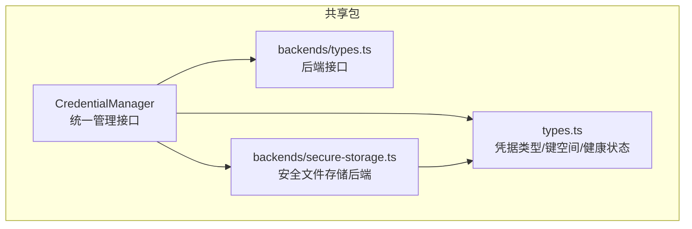
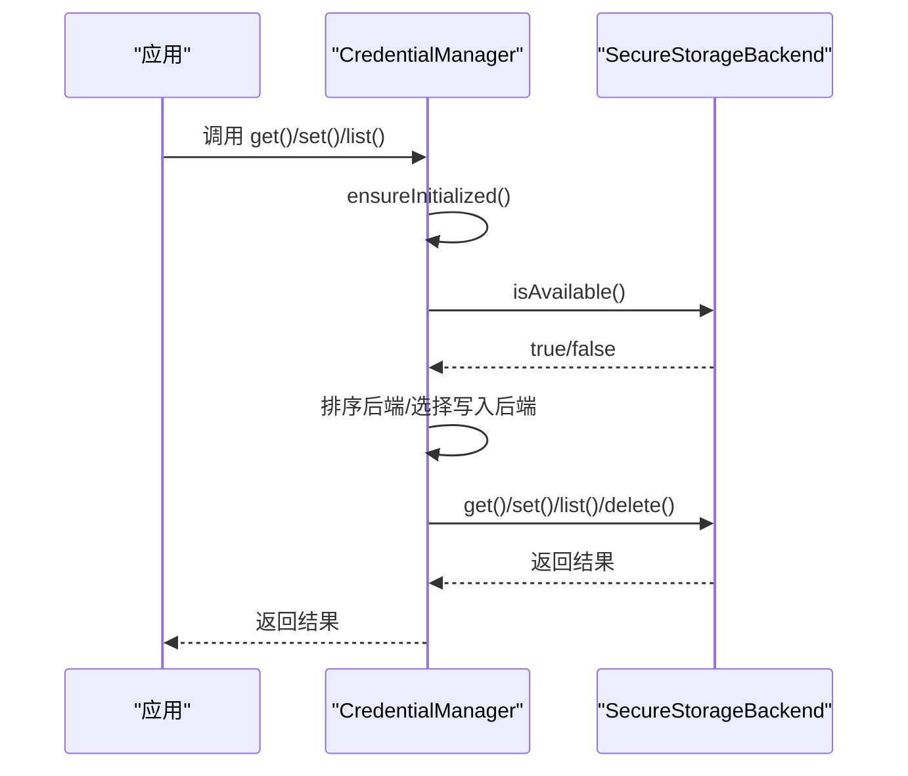
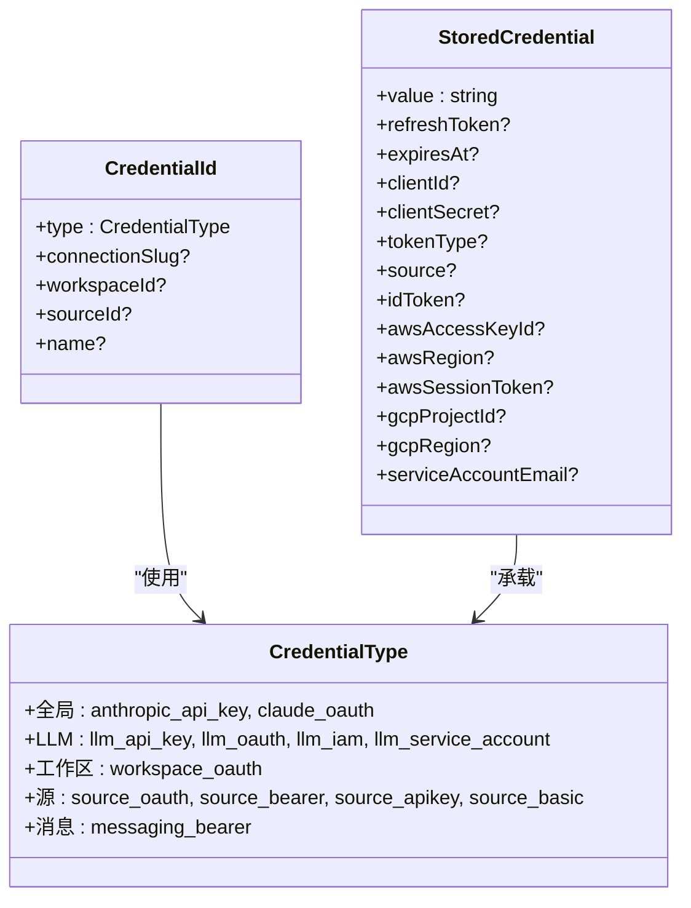
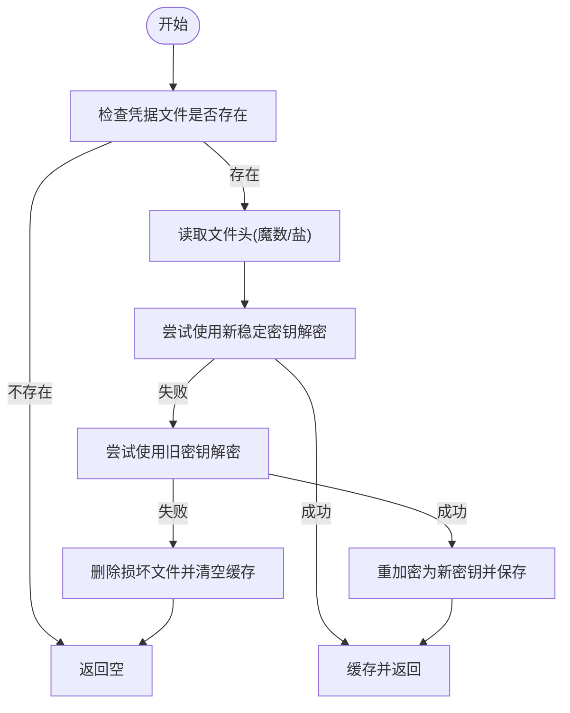
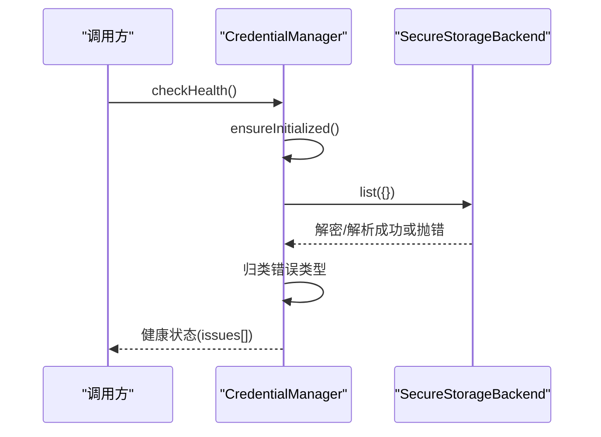
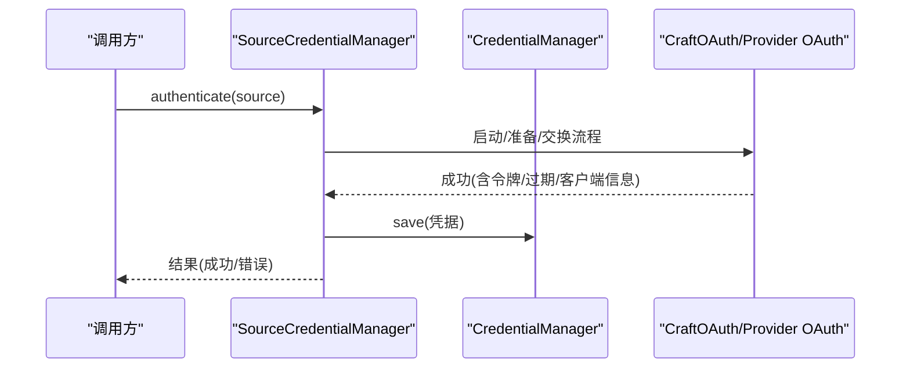
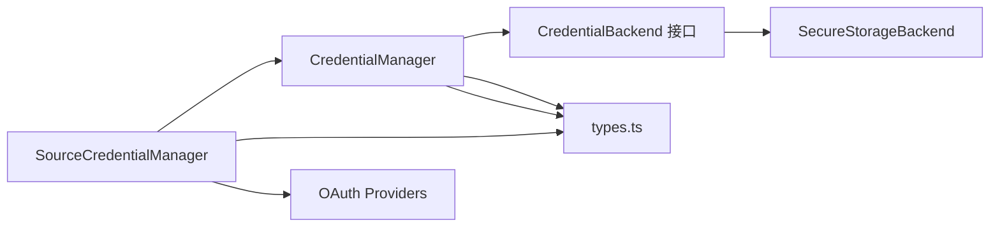

# 凭据管理

<cite>
**本文档引用的文件**
- [packages/shared/src/credentials/index.ts](file://packages/shared/src/credentials/index.ts)
- [packages/shared/src/credentials/manager.ts](file://packages/shared/src/credentials/manager.ts)
- [packages/shared/src/credentials/types.ts](file://packages/shared/src/credentials/types.ts)
- [packages/shared/src/credentials/backends/types.ts](file://packages/shared/src/credentials/backends/types.ts)
- [packages/shared/src/credentials/backends/secure-storage.ts](file://packages/shared/src/credentials/backends/secure-storage.ts)
- [packages/shared/src/sources/credential-manager.ts](file://packages/shared/src/sources/credential-manager.ts)
- [packages/shared/src/config/llm-connections.ts](file://packages/shared/src/config/llm-connections.ts)
</cite>

## 目录
1. [简介](#简介)
2. [项目结构](#项目结构)
3. [核心组件](#核心组件)
4. [架构总览](#架构总览)
5. [详细组件分析](#详细组件分析)
6. [依赖关系分析](#依赖关系分析)
7. [性能考量](#性能考量)
8. [故障排查指南](#故障排查指南)
9. [结论](#结论)
10. [附录](#附录)

## 简介
本文件面向需要安全存储和管理各类凭据（API 密钥、OAuth 令牌、IAM 凭证、服务账号等）的开发者，系统性阐述凭据管理模块的设计与实现。内容涵盖：
- 凭据存储机制与加密保护策略
- 安全传输方案与敏感信息防护
- 凭据类型定义、存储后端选择与访问控制
- 凭据轮换策略、过期检测与自动清理
- 凭据缓存优化、批量操作与并发安全
- 自定义凭据适配器开发、凭据同步与备份恢复
- 审计日志与健康检查

## 项目结构
凭据管理位于共享包中，采用“管理器 + 后端接口 + 具体后端”的分层设计：
- 管理器：统一对外接口，负责初始化、路由到后端、健康检查与便利方法
- 类型系统：定义凭据类型、键空间与健康状态
- 后端接口：抽象存储后端能力，支持优先级与可用性
- 具体后端：当前实现为“安全文件存储”，基于硬件稳定标识派生密钥并使用 AEAD 加密

图表来源
- [packages/shared/src/credentials/manager.ts:14-76](file://packages/shared/src/credentials/manager.ts#L14-L76)
- [packages/shared/src/credentials/backends/types.ts:10-31](file://packages/shared/src/credentials/backends/types.ts#L10-L31)
- [packages/shared/src/credentials/backends/secure-storage.ts:111-122](file://packages/shared/src/credentials/backends/secure-storage.ts#L111-L122)
- [packages/shared/src/credentials/types.ts:18-128](file://packages/shared/src/credentials/types.ts#L18-L128)

章节来源
- [packages/shared/src/credentials/index.ts:1-28](file://packages/shared/src/credentials/index.ts#L1-L28)
- [packages/shared/src/credentials/manager.ts:14-76](file://packages/shared/src/credentials/manager.ts#L14-L76)
- [packages/shared/src/credentials/types.ts:1-128](file://packages/shared/src/credentials/types.ts#L1-L128)
- [packages/shared/src/credentials/backends/types.ts:1-31](file://packages/shared/src/credentials/backends/types.ts#L1-L31)
- [packages/shared/src/credentials/backends/secure-storage.ts:1-120](file://packages/shared/src/credentials/backends/secure-storage.ts#L1-L120)

## 核心组件
- 凭据管理器（CredentialManager）
  - 提供统一的凭据存取、列举、删除与健康检查
  - 支持多后端回退与写入后端选择
  - 内置便利方法：API Key、OAuth、LLM 连接、IAM、服务账号等
- 凭据类型系统（types.ts）
  - 统一的凭据类型枚举与键空间格式
  - 健康问题类型与状态结构
- 后端接口（backends/types.ts）
  - 定义后端能力：可用性、读取、写入、删除、列举
  - 通过优先级决定首选写入后端
- 安全文件存储后端（SecureStorageBackend）
  - 使用 AES-256-GCM 的带认证加密
  - 基于硬件稳定标识派生密钥，支持迁移
  - 文件头含盐值，每次写入生成新随机 IV

章节来源
- [packages/shared/src/credentials/manager.ts:87-168](file://packages/shared/src/credentials/manager.ts#L87-L168)
- [packages/shared/src/credentials/types.ts:18-128](file://packages/shared/src/credentials/types.ts#L18-L128)
- [packages/shared/src/credentials/backends/types.ts:10-31](file://packages/shared/src/credentials/backends/types.ts#L10-L31)
- [packages/shared/src/credentials/backends/secure-storage.ts:111-152](file://packages/shared/src/credentials/backends/secure-storage.ts#L111-L152)

## 架构总览
凭据管理采用“单例管理器 + 多后端”模式。初始化时探测可用后端，按优先级排序，首个可用后端作为写入后端；读取时遍历所有后端以兼容迁移或混合部署。

图表来源
- [packages/shared/src/credentials/manager.ts:33-76](file://packages/shared/src/credentials/manager.ts#L33-L76)
- [packages/shared/src/credentials/backends/secure-storage.ts:119-122](file://packages/shared/src/credentials/backends/secure-storage.ts#L119-L122)

## 详细组件分析

### 凭据类型与键空间
- 类型覆盖范围
  - 全局类：Anthropic API Key、Claude OAuth
  - LLM 连接类：API Key/OAuth/IAM/服务账号（按连接 slug）
  - 工作区类：MCP OAuth
  - 源类：OAuth/Bearer/API Key/Basic（按工作区与源）
  - 消息类：平台令牌（按工作区与平台）
- 键空间格式
  - 使用双冒号分隔的命名空间，避免路径字符冲突
  - 支持全局、连接 slug、工作区、源、平台等多级作用域
- 健康状态
  - 文件损坏、解密失败、默认连接缺凭据等

图表来源
- [packages/shared/src/credentials/types.ts:18-128](file://packages/shared/src/credentials/types.ts#L18-L128)

章节来源
- [packages/shared/src/credentials/types.ts:18-280](file://packages/shared/src/credentials/types.ts#L18-L280)

### 安全文件存储后端（AES-256-GCM）
- 加密与密钥派生
  - 使用 PBKDF2（固定迭代次数）从“硬件稳定标识 + 盐值”派生 32 字节密钥
  - 每次写入生成新的随机 12 字节 IV，认证标签长度 16 字节
  - 文件头含“魔数 + 标志 + 盐”，便于版本识别与迁移
- 可靠性与迁移
  - 首次加载尝试新稳定密钥，失败则回退旧主机名派生密钥并自动重加密
  - 文件损坏时自动删除并清空缓存
- 平台标识
  - macOS：IOPlatformUUID
  - Windows：MachineGuid
  - Linux：dbus 或 /etc/machine-id

图表来源
- [packages/shared/src/credentials/backends/secure-storage.ts:190-248](file://packages/shared/src/credentials/backends/secure-storage.ts#L190-L248)

章节来源
- [packages/shared/src/credentials/backends/secure-storage.ts:1-359](file://packages/shared/src/credentials/backends/secure-storage.ts#L1-L359)

### 凭据管理器（统一接口与便利方法）
- 初始化与并发
  - 单例懒加载，内部防重复初始化 Promise
  - 读取时遍历后端，写入时使用首选写入后端
- 健康检查
  - 尝试列举凭据以触发解密，捕获错误并归类为“文件损坏/解密失败/默认连接缺凭据”
- 便利方法
  - API Key、OAuth、LLM 连接凭据、IAM、服务账号等
  - 过期判断：OAuth 在到期前 5 分钟视为需刷新，无 expiresAt 且有 refreshToken 则强制刷新

图表来源
- [packages/shared/src/credentials/manager.ts:582-652](file://packages/shared/src/credentials/manager.ts#L582-L652)

章节来源
- [packages/shared/src/credentials/manager.ts:14-664](file://packages/shared/src/credentials/manager.ts#L14-L664)

### 源凭据管理（SourceCredentialManager）
- 统一源凭据 CRUD、OAuth 流程与过期处理
- MCP 源支持 OAuth 与 Bearer 两种凭据，自动回退
- 并发刷新去重：同一源的刷新请求串行化，避免竞态（尤其微软刷新会轮换刷新令牌）
- 认证流程：根据源类型选择对应 OAuth 实现，交换后保存并标记已认证

图表来源
- [packages/shared/src/sources/credential-manager.ts:537-561](file://packages/shared/src/sources/credential-manager.ts#L537-L561)
- [packages/shared/src/sources/credential-manager.ts:124-200](file://packages/shared/src/sources/credential-manager.ts#L124-L200)

章节来源
- [packages/shared/src/sources/credential-manager.ts:123-1356](file://packages/shared/src/sources/credential-manager.ts#L123-L1356)

### LLM 连接与凭据映射
- 认证类型与凭据存储类型的映射
  - API Key/Bearer：单令牌
  - OAuth：访问/刷新令牌与过期时间
  - IAM：Access Key/Secret Key/Region/Session Token
  - 服务账号：完整 JSON
- 默认模型与提供商偏好
  - 通过提供商类型与 Pi 认证提供商筛选默认模型
- 中断发送行为与本地连接判定
  - 不同提供商默认中断发送策略不同
  - 本地回环地址连接被视为本地模型

章节来源
- [packages/shared/src/config/llm-connections.ts:371-387](file://packages/shared/src/config/llm-connections.ts#L371-L387)
- [packages/shared/src/config/llm-connections.ts:595-610](file://packages/shared/src/config/llm-connections.ts#L595-L610)
- [packages/shared/src/config/llm-connections.ts:464-483](file://packages/shared/src/config/llm-connections.ts#L464-L483)
- [packages/shared/src/config/llm-connections.ts:433-442](file://packages/shared/src/config/llm-connections.ts#L433-L442)

## 依赖关系分析
- 管理器依赖类型系统与后端接口，具体后端实现为安全文件存储
- 源凭据管理器依赖管理器进行持久化，并集成多种 OAuth 提供商
- LLM 连接配置与凭据类型映射解耦，便于扩展新的认证方式

图表来源
- [packages/shared/src/sources/credential-manager.ts:28-63](file://packages/shared/src/sources/credential-manager.ts#L28-L63)
- [packages/shared/src/credentials/manager.ts:50-76](file://packages/shared/src/credentials/manager.ts#L50-L76)
- [packages/shared/src/credentials/backends/types.ts:10-31](file://packages/shared/src/credentials/backends/types.ts#L10-L31)
- [packages/shared/src/credentials/backends/secure-storage.ts:111-122](file://packages/shared/src/credentials/backends/secure-storage.ts#L111-L122)

章节来源
- [packages/shared/src/sources/credential-manager.ts:1-200](file://packages/shared/src/sources/credential-manager.ts#L1-L200)
- [packages/shared/src/credentials/manager.ts:14-76](file://packages/shared/src/credentials/manager.ts#L14-L76)

## 性能考量
- 缓存策略
  - 后端在内存缓存解密后的凭据存储，减少重复解密开销
  - 清理缓存可强制重新加载（用于测试或迁移场景）
- 批量操作
  - 列举时对后端结果去重合并，避免重复条目
- 并发安全
  - 初始化过程使用 Promise 防止并发初始化
  - 源凭据刷新使用 Map 记录进行去重，避免同一源并发刷新
- 加密成本
  - PBKDF2 迭代次数平衡安全性与启动时间
  - 每次写入生成新 IV，符合 AEAD 最佳实践

章节来源
- [packages/shared/src/credentials/backends/secure-storage.ts:115-117](file://packages/shared/src/credentials/backends/secure-storage.ts#L115-L117)
- [packages/shared/src/credentials/manager.ts:146-168](file://packages/shared/src/credentials/manager.ts#L146-L168)
- [packages/shared/src/sources/credential-manager.ts:124-126](file://packages/shared/src/sources/credential-manager.ts#L124-L126)

## 故障排查指南
- 健康检查
  - 若提示“解密失败”，通常表示跨机器迁移导致密钥不匹配，需重新认证
  - 若提示“文件损坏”，删除凭据文件后重新录入
  - 若提示“默认连接缺凭据”，请为默认连接配置相应凭据
- 常见症状与定位
  - OAuth 令牌过期：检查 expiresAt，若在 5 分钟内或已过期则触发刷新
  - 源凭据缺失：确认源是否启用、是否需要认证、是否已保存凭据
  - 并发刷新异常：关注同一源的多次刷新请求，确保去重逻辑生效

章节来源
- [packages/shared/src/credentials/manager.ts:582-652](file://packages/shared/src/credentials/manager.ts#L582-L652)
- [packages/shared/src/sources/credential-manager.ts:124-200](file://packages/shared/src/sources/credential-manager.ts#L124-L200)

## 结论
该凭据管理模块通过“统一管理器 + 可插拔后端 + 明确类型系统”的设计，在保证跨平台一致性的同时提供了强健的安全性与可维护性。AES-256-GCM 的带认证加密、硬件稳定标识派生密钥、以及完善的健康检查与迁移策略，使得凭据在不同环境间具备良好的可移植性与可靠性。对于开发者而言，遵循现有接口与类型规范即可快速扩展新的凭据类型与后端实现。

## 附录

### 凭据类型与存储映射速查
- 全局类
  - anthropic_api_key → 存储为 value
  - claude_oauth → 存储为 value/refreshToken/expiresAt/source
- LLM 连接类（按连接 slug）
  - llm_api_key → 存储为 value
  - llm_oauth → 存储为 value/refreshToken/expiresAt/clientId/clientSecret/tokenType/idToken
  - llm_iam → 存储为 value/awsAccessKeyId/awsRegion/awsSessionToken
  - llm_service_account → 存储为 value/gcpProjectId/gcpRegion/serviceAccountEmail
- 工作区类
  - workspace_oauth → 存储为 value/tokenType/clientId
- 源类（按工作区与源）
  - source_oauth → 存储为 value/refreshToken/expiresAt/clientId/clientSecret
  - source_bearer → 存储为 value
  - source_apikey → 存储为 value
  - source_basic → 存储为 value（Base64 用户名:密码）
- 消息类（按工作区与平台）
  - messaging_bearer → 存储为 value

章节来源
- [packages/shared/src/credentials/types.ts:86-128](file://packages/shared/src/credentials/types.ts#L86-L128)
- [packages/shared/src/config/llm-connections.ts:371-387](file://packages/shared/src/config/llm-connections.ts#L371-L387)

### 自定义凭据后端开发指南
- 实现 CredentialBackend 接口
  - name/priority：名称与优先级（数值越大越先尝试）
  - isAvailable：返回当前平台是否可用
  - get/set/delete/list：完成凭据的读写删与列举
- 注意事项
  - 保持幂等与线程安全
  - 对错误进行分类记录，便于健康检查识别
  - 与类型系统配合，确保键空间与 StoredCredential 字段一致

章节来源
- [packages/shared/src/credentials/backends/types.ts:10-31](file://packages/shared/src/credentials/backends/types.ts#L10-L31)

### 凭据轮换、过期检测与自动清理
- 轮换策略
  - OAuth：优先使用 refreshToken 刷新；若无则提示重新授权
  - 源凭据：MCP OAuth 支持刷新，失败时标记需要重新认证
- 过期检测
  - OAuth 在到期前 5 分钟视为即将过期，触发刷新
  - 无 expiresAt 但有 refreshToken 的 OAuth 视为已过期，强制刷新
- 自动清理
  - 文件损坏时自动删除并清空缓存，引导用户重新录入

章节来源
- [packages/shared/src/credentials/manager.ts:549-565](file://packages/shared/src/credentials/manager.ts#L549-L565)
- [packages/shared/src/sources/credential-manager.ts:1200-1239](file://packages/shared/src/sources/credential-manager.ts#L1200-L1239)

### 安全传输与敏感信息保护
- 传输层
  - Electron 预加载层阻止向非本地服务器发起明文 ws:// 连接，防止令牌明文泄露
- 存储层
  - 文件权限限制为仅所有者可读写
  - AEAD 加密，确保机密性与完整性
- 认证层
  - OAuth 流程由受信 OAuth 提供商颁发令牌，避免明文 API Key 长期暴露

章节来源
- [packages/shared/src/credentials/backends/secure-storage.ts:302-304](file://packages/shared/src/credentials/backends/secure-storage.ts#L302-L304)
- [packages/shared/src/sources/credential-manager.ts:537-561](file://packages/shared/src/sources/credential-manager.ts#L537-L561)

### 审计日志与健康检查
- 日志
  - 关键操作（保存/删除/列举/刷新）均输出调试日志，便于追踪
- 健康检查
  - 启动时自动验证文件可读与可解密，并检查默认连接凭据完整性

章节来源
- [packages/shared/src/credentials/manager.ts:87-118](file://packages/shared/src/credentials/manager.ts#L87-L118)
- [packages/shared/src/credentials/manager.ts:582-652](file://packages/shared/src/credentials/manager.ts#L582-L652)