# 文件系统集成

<cite>
**本文引用的文件**
- [network-proxy.ts](file://apps/electron/src/main/network-proxy.ts)
- [network-proxy-utils.ts](file://apps/electron/src/main/network-proxy-utils.ts)
- [file-utils.ts](file://apps/electron/src/renderer/lib/file-utils.ts)
- [file-changes.ts](file://apps/electron/src/renderer/lib/file-changes.ts)
- [docx_tool.py](file://apps/electron/resources/scripts/docx_tool.py)
- [pdf_tool.py](file://apps/electron/resources/scripts/pdf_tool.py)
- [img_tool.py](file://apps/electron/resources/scripts/img_tool.py)
- [xlsx_tool.py](file://apps/electron/resources/scripts/xlsx_tool.py)
- [pptx_tool.py](file://apps/electron/resources/scripts/pptx_tool.py)
- [ical_tool.py](file://apps/electron/resources/scripts/ical_tool.py)
- [doc_diff.py](file://apps/electron/resources/scripts/doc_diff.py)
- [markitdown_cli.py](file://apps/electron/resources/scripts/markitdown_cli.py)
- [default.json](file://apps/electron/resources/permissions/default.json)
- [config-defaults.json](file://apps/electron/resources/config-defaults.json)
- [workspace.ts](file://apps/electron/src/main/handlers/workspace.ts)
- [settings.ts](file://apps/electron/src/main/handlers/settings.ts)
</cite>

## 目录
1. [引言](#引言)
2. [项目结构](#项目结构)
3. [核心组件](#核心组件)
4. [架构总览](#架构总览)
5. [详细组件分析](#详细组件分析)
6. [依赖关系分析](#依赖关系分析)
7. [性能考虑](#性能考虑)
8. [故障排查指南](#故障排查指南)
9. [结论](#结论)
10. [附录](#附录)

## 引言
本技术文档聚焦于文件系统集成与文档处理子系统，涵盖以下主题：
- 文件访问权限管理：基于白名单模式的命令执行控制与安全策略
- 目录监视与文件变更检测：活动记录到统一变更模型的映射
- 网络代理配置：Node.js 与 Electron 双栈代理设置与 NO_PROXY 规则
- 跨平台文件路径处理：语言识别、路径显示格式化
- 符号链接支持：在脚本工具中对符号链接的兼容性与注意事项
- 文档转换工具链：MarkItDown 驱动的多格式转 Markdown、批量处理能力
- 图像处理管道：缩放、裁剪、旋转、水印、合成等
- Office 文档解析：Word、Excel、PowerPoint、日历（iCal）的读取与导出
- PDF 渲染与编辑：提取、合并、拆分、旋转、压缩、水印、表单填充、安全处理
- 文件上传下载与断点续传：通过远程工作区连接与会话导出实现
- 进度监控：基于 RPC 的状态反馈与错误传播
- 自定义文件处理器开发指南：扩展工具链、性能优化技巧

## 项目结构
该子系统由三部分组成：
- 主进程（Electron）：网络代理、窗口管理、设置与工作区 RPC 处理
- 渲染进程（Renderer）：文件工具与变更收集（语言识别、路径格式化、变更聚合）
- 资源脚本（Python 工具集）：文档转换、图像处理、Office 解析、PDF 编辑

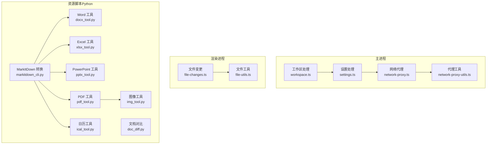

图示来源
- [network-proxy.ts:1-175](file://apps/electron/src/main/network-proxy.ts#L1-L175)
- [network-proxy-utils.ts:1-107](file://apps/electron/src/main/network-proxy-utils.ts#L1-L107)
- [workspace.ts:1-137](file://apps/electron/src/main/handlers/workspace.ts#L1-L137)
- [settings.ts:1-31](file://apps/electron/src/main/handlers/settings.ts#L1-L31)
- [file-utils.ts:1-67](file://apps/electron/src/renderer/lib/file-utils.ts#L1-L67)
- [file-changes.ts:1-92](file://apps/electron/src/renderer/lib/file-changes.ts#L1-L92)
- [markitdown_cli.py:1-138](file://apps/electron/resources/scripts/markitdown_cli.py#L1-L138)
- [docx_tool.py:1-391](file://apps/electron/resources/scripts/docx_tool.py#L1-L391)
- [xlsx_tool.py:1-376](file://apps/electron/resources/scripts/xlsx_tool.py#L1-L376)
- [pptx_tool.py:1-365](file://apps/electron/resources/scripts/pptx_tool.py#L1-L365)
- [pdf_tool.py:1-1322](file://apps/electron/resources/scripts/pdf_tool.py#L1-L1322)
- [img_tool.py:1-371](file://apps/electron/resources/scripts/img_tool.py#L1-L371)
- [ical_tool.py:1-373](file://apps/electron/resources/scripts/ical_tool.py#L1-L373)
- [doc_diff.py:1-252](file://apps/electron/resources/scripts/doc_diff.py#L1-L252)

章节来源
- [network-proxy.ts:1-175](file://apps/electron/src/main/network-proxy.ts#L1-L175)
- [network-proxy-utils.ts:1-107](file://apps/electron/src/main/network-proxy-utils.ts#L1-L107)
- [file-utils.ts:1-67](file://apps/electron/src/renderer/lib/file-utils.ts#L1-L67)
- [file-changes.ts:1-92](file://apps/electron/src/renderer/lib/file-changes.ts#L1-L92)
- [docx_tool.py:1-391](file://apps/electron/resources/scripts/docx_tool.py#L1-L391)
- [pdf_tool.py:1-1322](file://apps/electron/resources/scripts/pdf_tool.py#L1-L1322)
- [img_tool.py:1-371](file://apps/electron/resources/scripts/img_tool.py#L1-L371)
- [xlsx_tool.py:1-376](file://apps/electron/resources/scripts/xlsx_tool.py#L1-L376)
- [pptx_tool.py:1-365](file://apps/electron/resources/scripts/pptx_tool.py#L1-L365)
- [ical_tool.py:1-373](file://apps/electron/resources/scripts/ical_tool.py#L1-L373)
- [doc_diff.py:1-252](file://apps/electron/resources/scripts/doc_diff.py#L1-L252)
- [markitdown_cli.py:1-138](file://apps/electron/resources/scripts/markitdown_cli.py#L1-L138)
- [default.json:1-950](file://apps/electron/resources/permissions/default.json#L1-L950)
- [config-defaults.json:1-24](file://apps/electron/resources/config-defaults.json#L1-L24)
- [workspace.ts:1-137](file://apps/electron/src/main/handlers/workspace.ts#L1-L137)
- [settings.ts:1-31](file://apps/electron/src/main/handlers/settings.ts#L1-L31)

## 核心组件
- 网络代理管理器：统一 Node.js 全局调度器与 Electron 会话代理，支持按协议路由与 NO_PROXY 规则
- 权限白名单：严格的 Bash 模式匹配，限定只允许读取型操作与特定工具调用
- 文件工具与变更收集：语言识别、路径格式化、编辑/写入活动到统一变更模型
- 文档转换与批量处理：MarkItDown 驱动的多格式转 Markdown，支持批量导出
- 图像处理管道：缩放、裁剪、旋转、水印、合成，输出格式自动推断
- Office 文档解析：Word、Excel、PowerPoint、iCal 的信息读取与内容提取
- PDF 渲染与编辑：文本提取、元数据读取、合并拆分、旋转重排、压缩、水印、表单填充、安全处理
- 远程工作区与设置：通过 RPC 测试连接、打开工作区、设置代理与保持唤醒

章节来源
- [network-proxy.ts:1-175](file://apps/electron/src/main/network-proxy.ts#L1-L175)
- [network-proxy-utils.ts:1-107](file://apps/electron/src/main/network-proxy-utils.ts#L1-L107)
- [default.json:1-950](file://apps/electron/resources/permissions/default.json#L1-L950)
- [file-utils.ts:1-67](file://apps/electron/src/renderer/lib/file-utils.ts#L1-L67)
- [file-changes.ts:1-92](file://apps/electron/src/renderer/lib/file-changes.ts#L1-L92)
- [markitdown_cli.py:1-138](file://apps/electron/resources/scripts/markitdown_cli.py#L1-L138)
- [img_tool.py:1-371](file://apps/electron/resources/scripts/img_tool.py#L1-L371)
- [docx_tool.py:1-391](file://apps/electron/resources/scripts/docx_tool.py#L1-L391)
- [xlsx_tool.py:1-376](file://apps/electron/resources/scripts/xlsx_tool.py#L1-L376)
- [pptx_tool.py:1-365](file://apps/electron/resources/scripts/pptx_tool.py#L1-L365)
- [pdf_tool.py:1-1322](file://apps/electron/resources/scripts/pdf_tool.py#L1-L1322)
- [ical_tool.py:1-373](file://apps/electron/resources/scripts/ical_tool.py#L1-L373)
- [workspace.ts:1-137](file://apps/electron/src/main/handlers/workspace.ts#L1-L137)
- [settings.ts:1-31](file://apps/electron/src/main/handlers/settings.ts#L1-L31)

## 架构总览
下图展示从渲染进程发起文件操作到主进程应用代理设置、再到资源脚本执行与返回结果的整体流程。

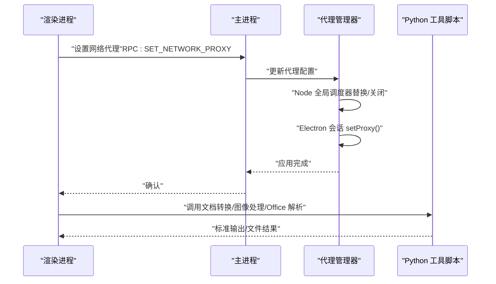

图示来源
- [settings.ts:25-29](file://apps/electron/src/main/handlers/settings.ts#L25-L29)
- [network-proxy.ts:152-174](file://apps/electron/src/main/network-proxy.ts#L152-L174)
- [markitdown_cli.py:87-134](file://apps/electron/resources/scripts/markitdown_cli.py#L87-L134)
- [img_tool.py:63-371](file://apps/electron/resources/scripts/img_tool.py#L63-L371)
- [docx_tool.py:111-391](file://apps/electron/resources/scripts/docx_tool.py#L111-L391)
- [xlsx_tool.py:39-376](file://apps/electron/resources/scripts/xlsx_tool.py#L39-L376)
- [pptx_tool.py:31-365](file://apps/electron/resources/scripts/pptx_tool.py#L31-L365)
- [pdf_tool.py:419-1322](file://apps/electron/resources/scripts/pdf_tool.py#L419-L1322)
- [ical_tool.py:113-373](file://apps/electron/resources/scripts/ical_tool.py#L113-L373)

## 详细组件分析

### 组件一：网络代理配置与 NO_PROXY 规则
- Node.js 层：通过自定义 Dispatcher 将 HTTP/HTTPS 请求路由至对应 ProxyAgent 或直连 Agent，并根据 NO_PROXY 规则判定绕过
- Electron 层：对默认会话与浏览器面板会话应用固定服务器代理与绕过规则
- 配置持久化：通过存储模块读取/写入代理设置，应用时记录日志便于调试

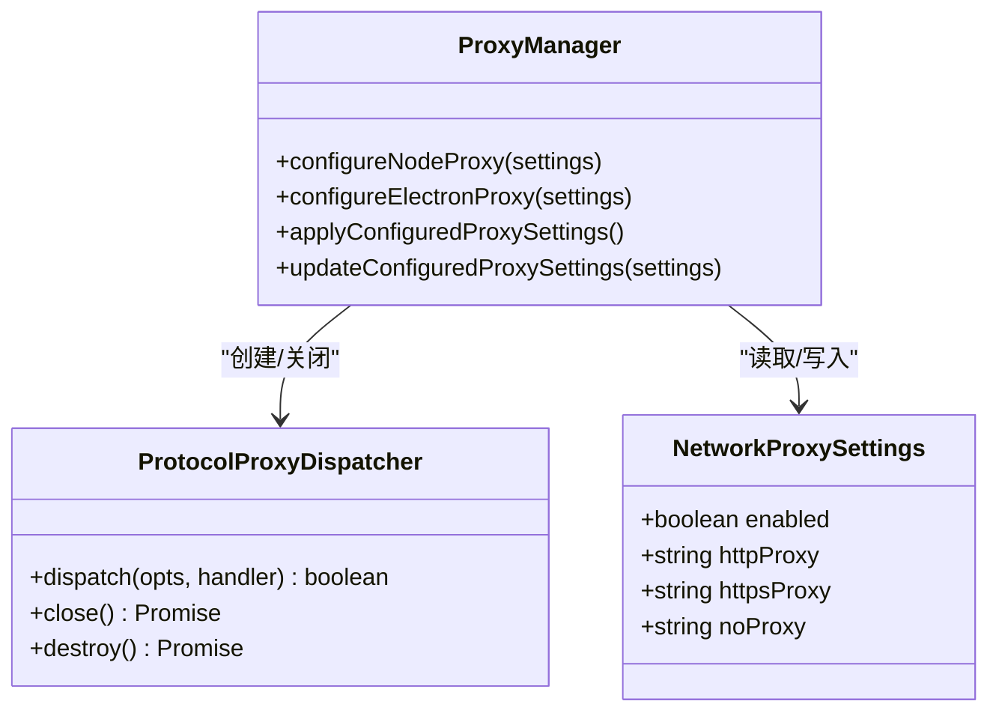

图示来源
- [network-proxy.ts:24-104](file://apps/electron/src/main/network-proxy.ts#L24-L104)
- [network-proxy-utils.ts:13-106](file://apps/electron/src/main/network-proxy-utils.ts#L13-L106)

章节来源
- [network-proxy.ts:1-175](file://apps/electron/src/main/network-proxy.ts#L1-L175)
- [network-proxy-utils.ts:1-107](file://apps/electron/src/main/network-proxy-utils.ts#L1-L107)

### 组件二：权限白名单与安全策略
- 白名单采用 Bash 模式匹配，严格限制命令与参数组合，仅允许读取型操作与特定工具调用
- 支持 Linux、macOS、Windows PowerShell 命令族，覆盖文件系统、版本控制、包管理、网络诊断等场景
- 版本字段用于策略演进与回滚控制

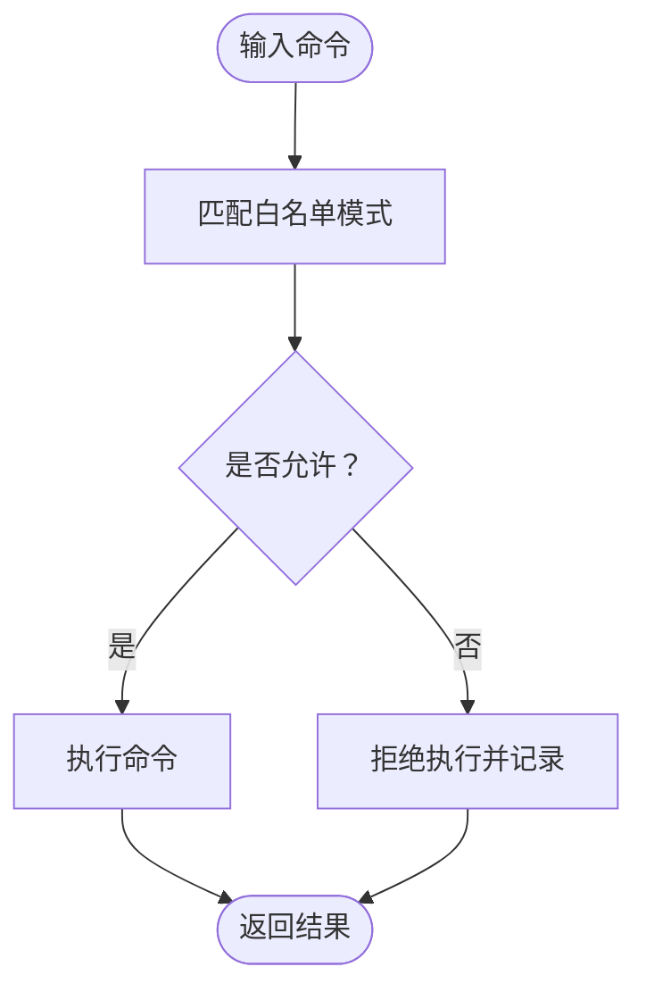

图示来源
- [default.json:1-950](file://apps/electron/resources/permissions/default.json#L1-L950)

章节来源
- [default.json:1-950](file://apps/electron/resources/permissions/default.json#L1-L950)

### 组件三：文件工具与变更检测
- 语言识别：根据扩展名映射到编辑器语言 ID，支持多种编程与标记语言
- 路径格式化：将绝对路径中的用户目录替换为波浪号，提升可读性
- 变更收集：从活动记录中抽取编辑/写入变更，统一为文件变更模型，支持差异与错误信息

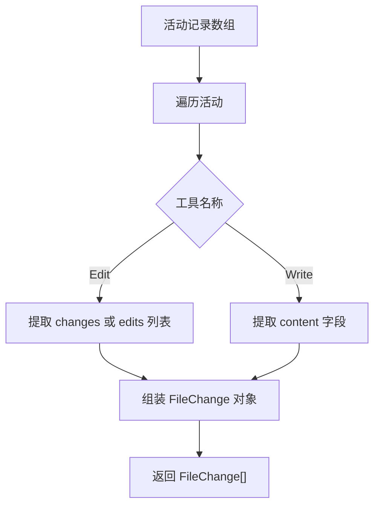

图示来源
- [file-changes.ts:15-81](file://apps/electron/src/renderer/lib/file-changes.ts#L15-L81)
- [file-utils.ts:48-66](file://apps/electron/src/renderer/lib/file-utils.ts#L48-L66)

章节来源
- [file-utils.ts:1-67](file://apps/electron/src/renderer/lib/file-utils.ts#L1-L67)
- [file-changes.ts:1-92](file://apps/electron/src/renderer/lib/file-changes.ts#L1-L92)

### 组件四：文档转换工具链（MarkItDown）
- 支持 .docx、.xlsx、.pptx、.pdf、.html、.ipynb、.xml、.rss、.zip、.msg、.eml、.csv、.tsv、.json、.txt、.md、.rst、.rtf、图片、音频等
- 对纯文本与 DOCX 提供快速回退路径，避免依赖缺失导致失败
- 输出统一为 Markdown 文本，便于后续处理与展示

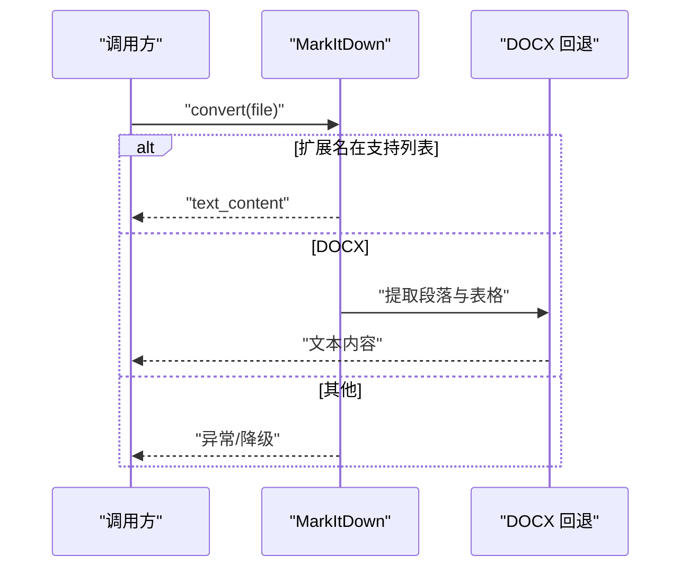

图示来源
- [markitdown_cli.py:24-134](file://apps/electron/resources/scripts/markitdown_cli.py#L24-L134)
- [docx_tool.py:157-207](file://apps/electron/resources/scripts/docx_tool.py#L157-L207)

章节来源
- [markitdown_cli.py:1-138](file://apps/electron/resources/scripts/markitdown_cli.py#L1-L138)
- [docx_tool.py:1-391](file://apps/electron/resources/scripts/docx_tool.py#L1-L391)

### 组件五：图像处理管道
- 功能：缩放、裁剪、旋转、格式转换、信息查询、水印、合成
- 输出格式自动推断，JPEG 转换时自动移除透明通道
- 支持透明度与混合模式，输出前进行格式适配

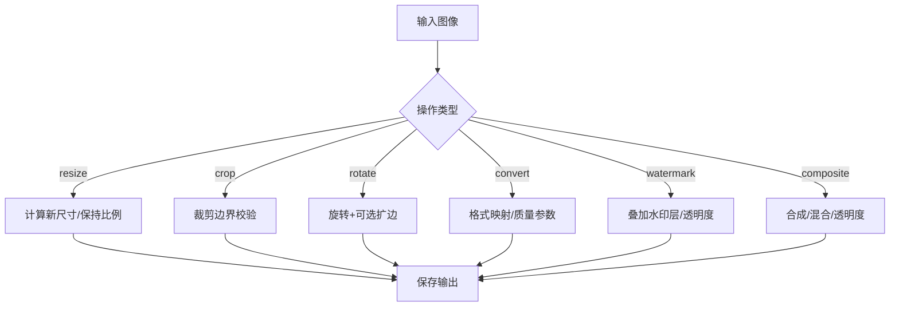

图示来源
- [img_tool.py:69-371](file://apps/electron/resources/scripts/img_tool.py#L69-L371)

章节来源
- [img_tool.py:1-371](file://apps/electron/resources/scripts/img_tool.py#L1-L371)

### 组件六：Office 文档解析与导出
- Word (.docx)：创建、模板填充、信息查询、查找替换、文本提取
- Excel (.xlsx)：读取/写入单元格、信息查询、新增工作表、导出 CSV/JSON
- PowerPoint (.pptx)：从 Markdown/JSON 创建演示文稿、信息查询、内容提取
- 日历 (.ics)：读取事件、创建日历、按日期范围过滤

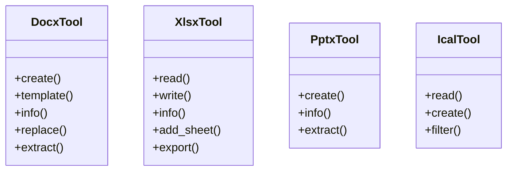

图示来源
- [docx_tool.py:117-391](file://apps/electron/resources/scripts/docx_tool.py#L117-L391)
- [xlsx_tool.py:117-376](file://apps/electron/resources/scripts/xlsx_tool.py#L117-L376)
- [pptx_tool.py:37-365](file://apps/electron/resources/scripts/pptx_tool.py#L37-L365)
- [ical_tool.py:119-373](file://apps/electron/resources/scripts/ical_tool.py#L119-L373)

章节来源
- [docx_tool.py:1-391](file://apps/electron/resources/scripts/docx_tool.py#L1-L391)
- [xlsx_tool.py:1-376](file://apps/electron/resources/scripts/xlsx_tool.py#L1-L376)
- [pptx_tool.py:1-365](file://apps/electron/resources/scripts/pptx_tool.py#L1-L365)
- [ical_tool.py:1-373](file://apps/electron/resources/scripts/ical_tool.py#L1-L373)

### 组件七：PDF 渲染与编辑
- 组织类：提取文本、信息查询、合并、拆分、旋转、重排、复制页
- 编辑类：水印、表单填充、压缩、裁剪/缩放、扁平化、页眉页脚
- 安全类：加密、解密、遮盖、净化
- 转换类：图像转 PDF、PDF 转图像、PDF 转 DOCX/PPTX

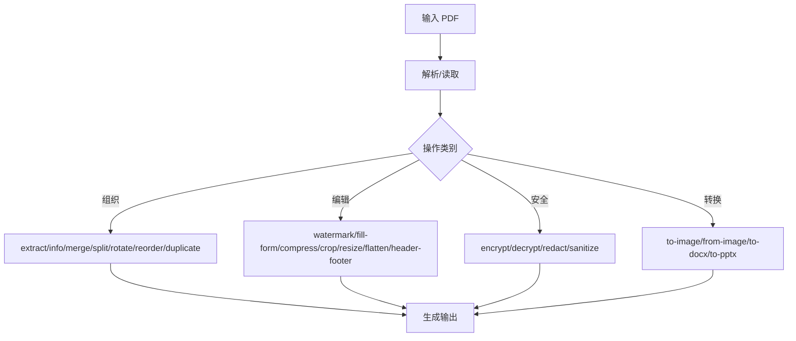

图示来源
- [pdf_tool.py:425-1322](file://apps/electron/resources/scripts/pdf_tool.py#L425-L1322)

章节来源
- [pdf_tool.py:1-1322](file://apps/electron/resources/scripts/pdf_tool.py#L1-L1322)

### 组件八：文件上传下载与进度监控
- 远程工作区连接：测试连接、列出工作区、打开工作区窗口
- 设置同步：代理设置、保持唤醒等
- 会话导出：通过深链打开指定会话，结合窗口管理器实现焦点与复用

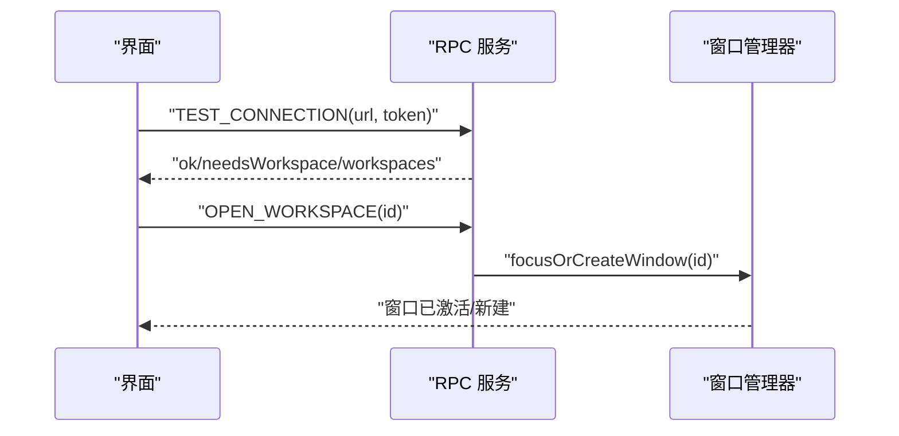

图示来源
- [workspace.ts:55-136](file://apps/electron/src/main/handlers/workspace.ts#L55-L136)
- [settings.ts:14-30](file://apps/electron/src/main/handlers/settings.ts#L14-L30)

章节来源
- [workspace.ts:1-137](file://apps/electron/src/main/handlers/workspace.ts#L1-L137)
- [settings.ts:1-31](file://apps/electron/src/main/handlers/settings.ts#L1-L31)

## 依赖关系分析
- 主进程依赖 Electron 会话与全局调度器，确保 Node 与浏览器请求均受控
- 渲染进程依赖共享的 UI 类型与工具函数，保证变更模型一致性
- 资源脚本通过 Click CLI 统一入口，内部使用各自生态库（pypdf、python-docx、openpyxl、Pillow 等）

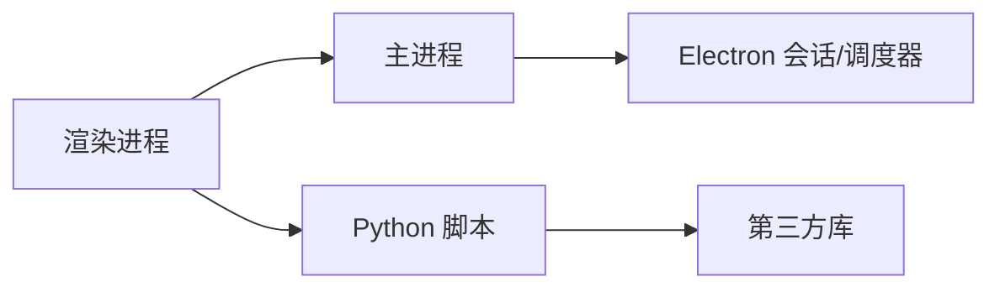

图示来源
- [network-proxy.ts:9-15](file://apps/electron/src/main/network-proxy.ts#L9-L15)
- [pdf_tool.py:36-40](file://apps/electron/resources/scripts/pdf_tool.py#L36-L40)
- [docx_tool.py:18-21](file://apps/electron/resources/scripts/docx_tool.py#L18-L21)
- [xlsx_tool.py:19-21](file://apps/electron/resources/scripts/xlsx_tool.py#L19-L21)
- [img_tool.py:17-19](file://apps/electron/resources/scripts/img_tool.py#L17-L19)

章节来源
- [network-proxy.ts:1-175](file://apps/electron/src/main/network-proxy.ts#L1-L175)
- [pdf_tool.py:1-1322](file://apps/electron/resources/scripts/pdf_tool.py#L1-L1322)
- [docx_tool.py:1-391](file://apps/electron/resources/scripts/docx_tool.py#L1-L391)
- [xlsx_tool.py:1-376](file://apps/electron/resources/scripts/xlsx_tool.py#L1-L376)
- [img_tool.py:1-371](file://apps/electron/resources/scripts/img_tool.py#L1-L371)

## 性能考虑
- 代理切换：避免频繁重建 Dispatcher，先关闭旧实例再启用新实例，减少资源泄漏
- PDF 处理：批量操作建议预加载页面对象，避免重复解析；压缩与扁平化仅在必要时执行
- 图像处理：大图优先使用流式处理与内存映射，避免一次性加载至内存；JPEG 质量参数可调以平衡体积与清晰度
- 文档转换：MarkItDown 在缺少原生依赖时会降级，建议提前安装所需运行时以减少失败重试
- RPC 通信：长耗时任务应分阶段返回进度，避免阻塞 UI 线程

## 故障排查指南
- 代理未生效
  - 检查代理设置是否持久化成功
  - 确认 NO_PROXY 规则是否匹配目标域名
  - 查看日志输出的代理应用状态
- 文档转换失败
  - MarkItDown 缺少原生依赖时会提示安装 Microsoft Visual C++ Redistributable
  - 对于 DOCX 使用内置提取逻辑作为回退
- 图像处理异常
  - 确认输入格式与输出格式映射正确
  - JPEG 转换时注意透明通道处理
- Office 文档读取错误
  - Excel 新建文件时删除默认工作表，避免命名冲突
  - PowerPoint 模板布局缺失时回退到标题/空白布局
- PDF 安全与表单
  - 表单填充后需设置 NeedAppearances 以扁平化显示
  - 加密 PDF 需先解密再读取元数据与内容

章节来源
- [network-proxy.ts:152-174](file://apps/electron/src/main/network-proxy.ts#L152-L174)
- [network-proxy-utils.ts:81-106](file://apps/electron/src/main/network-proxy-utils.ts#L81-L106)
- [markitdown_cli.py:120-133](file://apps/electron/resources/scripts/markitdown_cli.py#L120-L133)
- [docx_tool.py:167-206](file://apps/electron/resources/scripts/docx_tool.py#L167-L206)
- [xlsx_tool.py:286-311](file://apps/electron/resources/scripts/xlsx_tool.py#L286-L311)
- [pptx_tool.py:171-184](file://apps/electron/resources/scripts/pptx_tool.py#L171-L184)
- [pdf_tool.py:773-783](file://apps/electron/resources/scripts/pdf_tool.py#L773-L783)

## 结论
本文件系统集成为本地文件与文档处理提供了安全、可扩展且高性能的解决方案。通过严格的权限白名单、双栈代理配置、统一的变更模型与丰富的工具链，开发者可以构建稳健的文件相关工具与自动化流程。建议在生产环境中：
- 明确 NO_PROXY 规则，避免误绕过
- 合理选择图像与 PDF 处理策略，平衡质量与性能
- 使用统一的变更模型进行审计与回溯
- 为关键工具准备降级路径，提升鲁棒性

## 附录
- 默认配置项：通知开关、颜色主题、自动首字母大写、发送消息键位、拼写检查、保持唤醒、富工具描述、扩展提示缓存、浏览器工具启用等
- 工作区默认：思考级别、权限模式、可循环权限模式、本地 MCP 服务器启用

章节来源
- [config-defaults.json:1-24](file://apps/electron/resources/config-defaults.json#L1-L24)