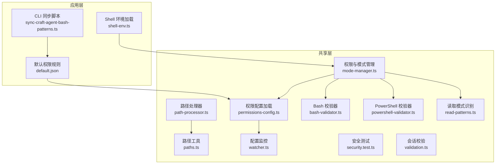
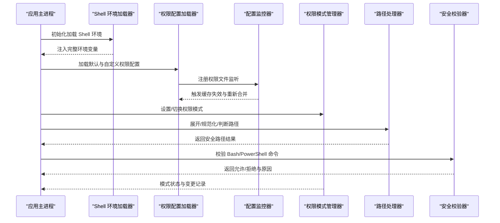
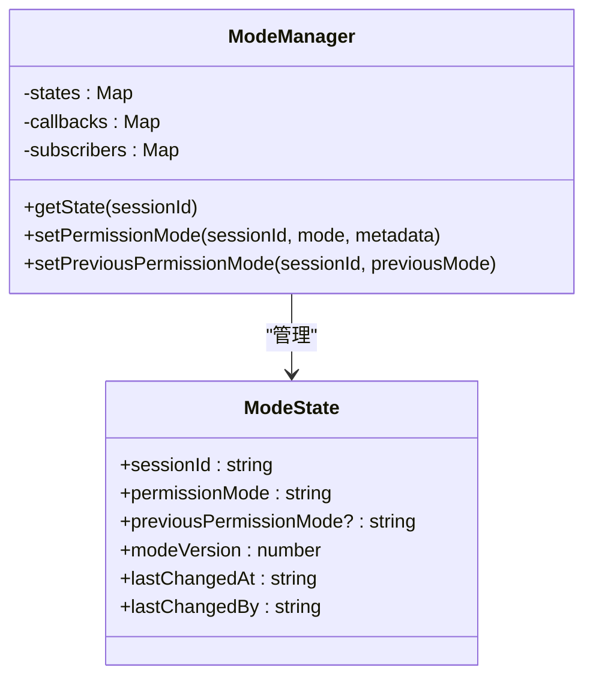
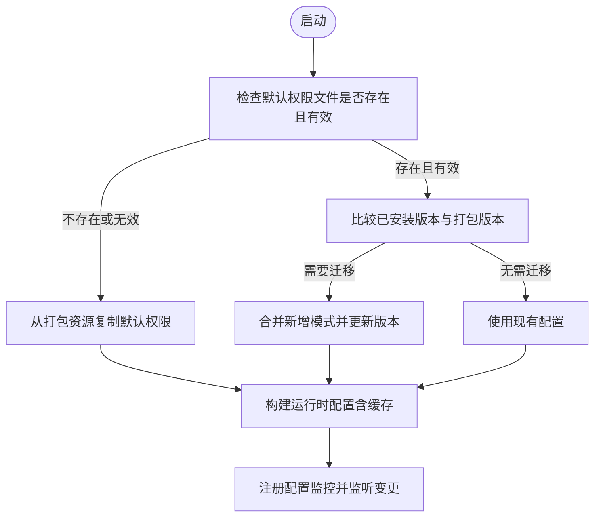
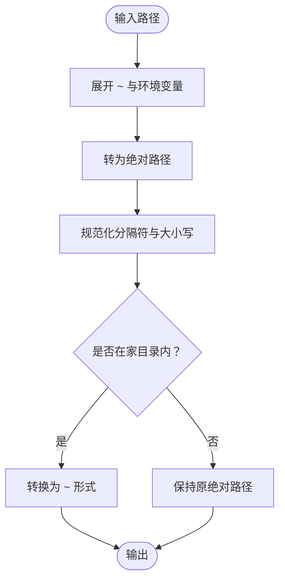
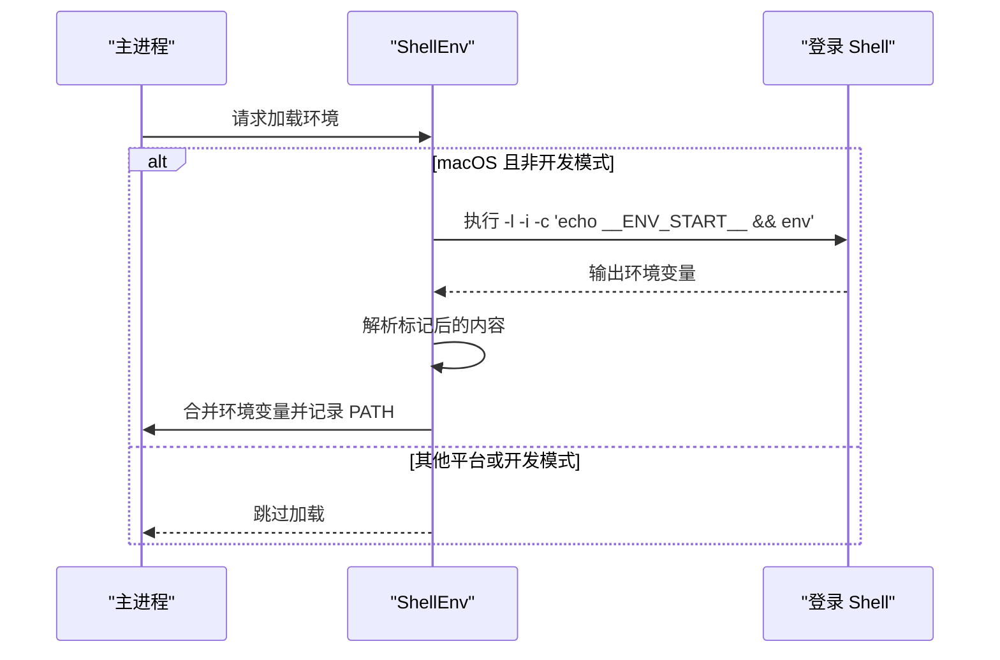
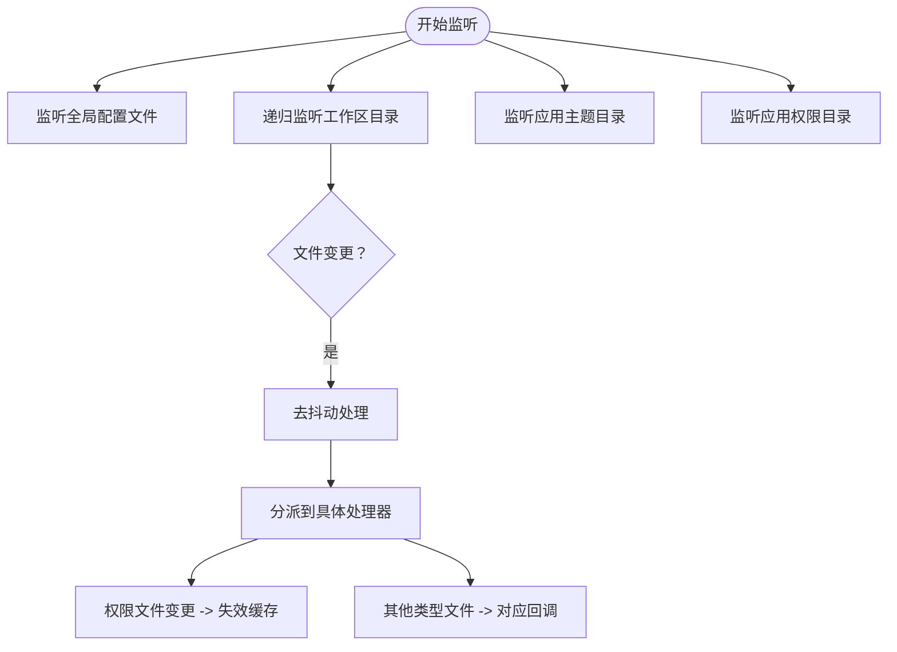
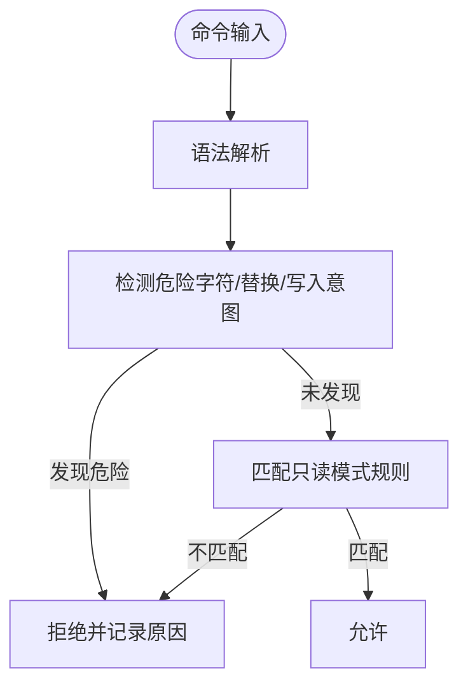
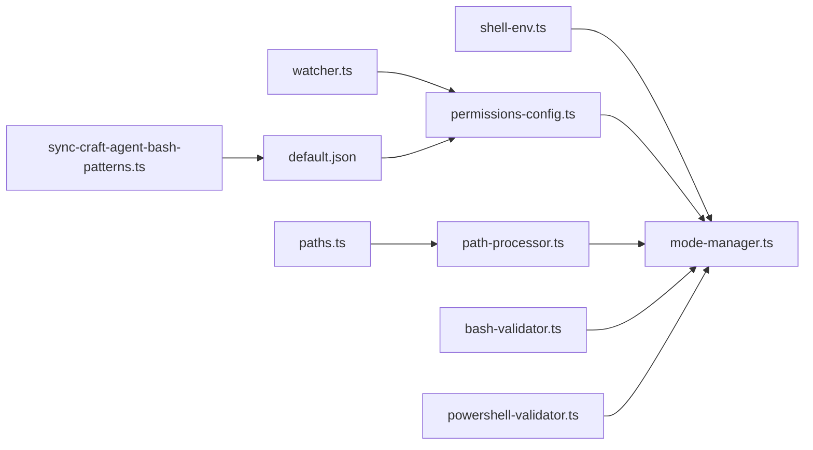

# 文件访问权限管理

<cite>
**本文档引用的文件**
- [mode-manager.ts](file://packages/shared/src/agent/mode-manager.ts)
- [permissions-config.ts](file://packages/shared/src/agent/permissions-config.ts)
- [paths.ts](file://packages/shared/src/utils/paths.ts)
- [path-processor.ts](file://packages/shared/src/agent/core/path-processor.ts)
- [shell-env.ts](file://apps/electron/src/main/shell-env.ts)
- [watcher.ts](file://packages/shared/src/config/watcher.ts)
- [default.json](file://apps/electron/resources/permissions/default.json)
- [security.test.ts](file://packages/shared/src/automations/security.test.ts)
- [validation.ts](file://packages/shared/src/sessions/validation.ts)
- [read-patterns.ts](file://packages/shared/src/agent/backend/read-patterns.ts)
- [sync-craft-agent-bash-patterns.ts](file://packages/shared/src/config/sync-craft-agent-bash-patterns.ts)
- [bash-validator.ts](file://packages/shared/src/agent/bash-validator.ts)
- [powershell-validator.ts](file://packages/shared/src/agent/powershell-validator.ts)
</cite>

## 目录
1. [简介](#简介)
2. [项目结构](#项目结构)
3. [核心组件](#核心组件)
4. [架构总览](#架构总览)
5. [详细组件分析](#详细组件分析)
6. [依赖关系分析](#依赖关系分析)
7. [性能考量](#性能考量)
8. [故障排查指南](#故障排查指南)
9. [结论](#结论)
10. [附录](#附录)

## 简介
本技术文档围绕文件访问权限管理展开，系统阐述了该代码库中实现的安全模型：包括文件系统访问控制机制、权限验证流程、安全沙箱设计；覆盖跨平台文件路径处理、符号链接解析与相对路径转换；解释环境变量注入与 shell 环境配置、进程隔离机制；并介绍文件操作审计日志、访问时间记录与权限变更追踪。同时提供文件系统监控、实时权限检查与异常访问检测方案，并给出权限配置最佳实践、安全边界设置与合规性要求。

## 项目结构
本项目在共享包中实现了统一的权限与路径处理能力，在应用层（Electron 主进程）负责环境加载与监控集成。关键模块分布如下：
- 权限与模式管理：mode-manager.ts、permissions-config.ts
- 路径工具与处理器：paths.ts、path-processor.ts
- Shell 环境加载：shell-env.ts
- 配置文件监控：watcher.ts
- 默认权限规则：apps/electron/resources/permissions/default.json
- 安全测试与工具：security.test.ts、bash-validator.ts、powershell-validator.ts
- 会话与读取模式识别：validation.ts、read-patterns.ts
- CLI 同步脚本：sync-craft-agent-bash-patterns.ts

**图表来源**
- [mode-manager.ts](file://packages/shared/src/agent/mode-manager.ts)
- [permissions-config.ts](file://packages/shared/src/agent/permissions-config.ts)
- [paths.ts](file://packages/shared/src/utils/paths.ts)
- [path-processor.ts](file://packages/shared/src/agent/core/path-processor.ts)
- [shell-env.ts](file://apps/electron/src/main/shell-env.ts)
- [watcher.ts](file://packages/shared/src/config/watcher.ts)
- [default.json](file://apps/electron/resources/permissions/default.json)
- [security.test.ts](file://packages/shared/src/automations/security.test.ts)
- [bash-validator.ts](file://packages/shared/src/agent/bash-validator.ts)
- [powershell-validator.ts](file://packages/shared/src/agent/powershell-validator.ts)
- [read-patterns.ts](file://packages/shared/src/agent/backend/read-patterns.ts)
- [sync-craft-agent-bash-patterns.ts](file://packages/shared/src/config/sync-craft-agent-bash-patterns.ts)

**章节来源**
- [mode-manager.ts](file://packages/shared/src/agent/mode-manager.ts)
- [permissions-config.ts](file://packages/shared/src/agent/permissions-config.ts)
- [paths.ts](file://packages/shared/src/utils/paths.ts)
- [path-processor.ts](file://packages/shared/src/agent/core/path-processor.ts)
- [shell-env.ts](file://apps/electron/src/main/shell-env.ts)
- [watcher.ts](file://packages/shared/src/config/watcher.ts)
- [default.json](file://apps/electron/resources/permissions/default.json)
- [security.test.ts](file://packages/shared/src/automations/security.test.ts)
- [bash-validator.ts](file://packages/shared/src/agent/bash-validator.ts)
- [powershell-validator.ts](file://packages/shared/src/agent/powershell-validator.ts)
- [read-patterns.ts](file://packages/shared/src/agent/backend/read-patterns.ts)
- [sync-craft-agent-bash-patterns.ts](file://packages/shared/src/config/sync-craft-agent-bash-patterns.ts)

## 核心组件
- 权限模式管理器：维护每个会话的权限状态、模式版本与变更历史，支持安全模式下的命令与工具限制。
- 权限配置加载器：从应用级与工作区级加载默认与自定义权限配置，合并并缓存，支持热更新。
- 路径工具与处理器：提供跨平台路径展开、规范化、便携化与目录包含判断，防止符号链接逃逸。
- Shell 环境加载器：在 macOS 上通过登录 shell 注入完整环境变量，确保外部工具可用。
- 配置文件监控器：递归监听配置与权限文件变化，触发回调并清理缓存以保证权限规则即时生效。
- 安全校验器：对 Bash 与 PowerShell 命令进行语法解析与模式匹配，阻断危险写入与执行。
- 读取模式识别：从命令中提取读取目标，用于事件适配与 UI 展示。

**章节来源**
- [mode-manager.ts](file://packages/shared/src/agent/mode-manager.ts)
- [permissions-config.ts](file://packages/shared/src/agent/permissions-config.ts)
- [paths.ts](file://packages/shared/src/utils/paths.ts)
- [path-processor.ts](file://packages/shared/src/agent/core/path-processor.ts)
- [shell-env.ts](file://apps/electron/src/main/shell-env.ts)
- [watcher.ts](file://packages/shared/src/config/watcher.ts)
- [security.test.ts](file://packages/shared/src/automations/security.test.ts)
- [bash-validator.ts](file://packages/shared/src/agent/bash-validator.ts)
- [powershell-validator.ts](file://packages/shared/src/agent/powershell-validator.ts)
- [read-patterns.ts](file://packages/shared/src/agent/backend/read-patterns.ts)

## 架构总览
下图展示了权限管理在系统中的交互关系：主进程加载 Shell 环境，权限配置由配置监控器驱动热更新，模式管理器在运行时根据配置与上下文进行权限判定，路径处理器保障路径安全，安全校验器拦截危险命令。

**图表来源**
- [shell-env.ts](file://apps/electron/src/main/shell-env.ts)
- [permissions-config.ts](file://packages/shared/src/agent/permissions-config.ts)
- [watcher.ts](file://packages/shared/src/config/watcher.ts)
- [mode-manager.ts](file://packages/shared/src/agent/mode-manager.ts)
- [path-processor.ts](file://packages/shared/src/agent/core/path-processor.ts)
- [bash-validator.ts](file://packages/shared/src/agent/bash-validator.ts)
- [powershell-validator.ts](file://packages/shared/src/agent/powershell-validator.ts)

## 详细组件分析

### 权限模式管理器（ModeManager）
- 会话级权限状态：每个会话独立持有权限模式、前一模式、版本号、变更时间与变更者。
- 模式切换与版本演进：支持用户、系统、自动化等不同来源的模式变更，记录版本号与时间戳，便于审计与回溯。
- 危险字符与替换检测：阻断包含危险控制字符与命令/进程替换模式的命令，避免任意代码执行。
- 工具与命令白名单：结合 Bash 正则模式与 MCP 模式，仅允许只读工具与命令。

**图表来源**
- [mode-manager.ts](file://packages/shared/src/agent/mode-manager.ts)

**章节来源**
- [mode-manager.ts](file://packages/shared/src/agent/mode-manager.ts)

### 权限配置加载器（PermissionsConfig）
- 应用级默认权限：从打包资源复制默认权限到用户目录，自动迁移与版本比较，保证规则一致性。
- 工作区与源级自定义：支持工作区与源级 permissions.json，按需扩展只读模式规则。
- 缓存与失效：基于上下文（工作区根路径与活动源列表）构建缓存键，文件变化时精确失效并重建。
- 合并策略：默认规则 + 工作区自定义 + 源级自定义，形成最终运行时配置。

**图表来源**
- [permissions-config.ts](file://packages/shared/src/agent/permissions-config.ts)
- [watcher.ts](file://packages/shared/src/config/watcher.ts)

**章节来源**
- [permissions-config.ts](file://packages/shared/src/agent/permissions-config.ts)
- [watcher.ts](file://packages/shared/src/config/watcher.ts)

### 路径工具与处理器（Paths & PathProcessor）
- 跨平台路径展开：支持 ~、${HOME}、$HOME 变量展开，相对路径解析与绝对化。
- 路径规范化：统一斜杠分隔符，Windows 下大小写不敏感比较。
- 便携化路径：将家目录内路径转换为 ~ 前缀形式，便于显示与存储。
- 安全包含判断：通过真实路径解析与最近存在的祖先节点判断，防止符号链接逃逸。

**图表来源**
- [paths.ts](file://packages/shared/src/utils/paths.ts)
- [path-processor.ts](file://packages/shared/src/agent/core/path-processor.ts)

**章节来源**
- [paths.ts](file://packages/shared/src/utils/paths.ts)
- [path-processor.ts](file://packages/shared/src/agent/core/path-processor.ts)

### Shell 环境加载器（ShellEnv）
- 平台差异处理：仅在 macOS 上通过登录 shell 注入完整环境，避免开发模式干扰。
- 环境变量过滤：排除开发期变量，合并 PATH 与其它变量。
- 回退策略：若加载失败，添加常见路径作为回退，保证工具可用性。

**图表来源**
- [shell-env.ts](file://apps/electron/src/main/shell-env.ts)

**章节来源**
- [shell-env.ts](file://apps/electron/src/main/shell-env.ts)

### 配置文件监控器（ConfigWatcher）
- 监听范围：全局配置、主题、工作区目录（递归）、权限文件、会话元数据等。
- 去抖动与重复检测：对频繁事件去抖动，注册活跃监视器以避免同一目录树重复递归监听导致事件循环卡死。
- 缓存失效：权限文件变化时调用权限配置缓存的失效方法，确保规则即时生效。

**图表来源**
- [watcher.ts](file://packages/shared/src/config/watcher.ts)
- [permissions-config.ts](file://packages/shared/src/agent/permissions-config.ts)

**章节来源**
- [watcher.ts](file://packages/shared/src/config/watcher.ts)

### 安全校验器（Bash/PowerShell）
- Bash 校验：解析命令语法，检测危险替换与控制字符，识别重定向与管道中的写入意图。
- PowerShell 校验：识别危险 Cmdlet（如写入/删除），在可用时进行语法解析与模式匹配。
- 统一拒绝原因：提供可读的拒绝原因，便于 UI 提示与审计。

**图表来源**
- [bash-validator.ts](file://packages/shared/src/agent/bash-validator.ts)
- [powershell-validator.ts](file://packages/shared/src/agent/powershell-validator.ts)

**章节来源**
- [bash-validator.ts](file://packages/shared/src/agent/bash-validator.ts)
- [powershell-validator.ts](file://packages/shared/src/agent/powershell-validator.ts)

### 读取模式识别（Read Patterns）
- 从命令中提取读取目标（文件路径、行号范围），用于事件适配与 UI 展示“读取”工具事件。
- 结合 Bash 解析器与 PowerShell 分析，正确处理包装器、引号与转义。

**章节来源**
- [read-patterns.ts](file://packages/shared/src/agent/backend/read-patterns.ts)

### 默认权限规则（default.json）
- 包含大量只读 Bash 模式与工具模式，涵盖文件系统浏览、内容查看、统计分析、版本控制、包管理器、网络诊断等场景。
- 支持 craft-agent 自身命令的只读子命令与参数组合，确保代理在探索模式下仅能执行安全操作。

**章节来源**
- [default.json](file://apps/electron/resources/permissions/default.json)

### CLI 同步脚本（sync-craft-agent-bash-patterns.ts）
- 将生成的 craft-agent 只读 Bash 模式插入默认权限配置，保证新版本工具命令的只读能力随版本同步。

**章节来源**
- [sync-craft-agent-bash-patterns.ts](file://packages/shared/src/config/sync-craft-agent-bash-patterns.ts)

## 依赖关系分析
- 权限配置加载器依赖配置监控器进行缓存失效与热更新。
- 权限模式管理器依赖权限配置加载器提供的运行时配置。
- 路径处理器依赖路径工具进行展开与规范化。
- Shell 环境加载器在主进程早期初始化，影响后续工具可用性。
- 安全校验器在模式管理器中被调用，作为权限判定的关键环节。

**图表来源**
- [shell-env.ts](file://apps/electron/src/main/shell-env.ts)
- [permissions-config.ts](file://packages/shared/src/agent/permissions-config.ts)
- [watcher.ts](file://packages/shared/src/config/watcher.ts)
- [paths.ts](file://packages/shared/src/utils/paths.ts)
- [path-processor.ts](file://packages/shared/src/agent/core/path-processor.ts)
- [mode-manager.ts](file://packages/shared/src/agent/mode-manager.ts)
- [bash-validator.ts](file://packages/shared/src/agent/bash-validator.ts)
- [powershell-validator.ts](file://packages/shared/src/agent/powershell-validator.ts)
- [default.json](file://apps/electron/resources/permissions/default.json)
- [sync-craft-agent-bash-patterns.ts](file://packages/shared/src/config/sync-craft-agent-bash-patterns.ts)

**章节来源**
- [shell-env.ts](file://apps/electron/src/main/shell-env.ts)
- [permissions-config.ts](file://packages/shared/src/agent/permissions-config.ts)
- [watcher.ts](file://packages/shared/src/config/watcher.ts)
- [paths.ts](file://packages/shared/src/utils/paths.ts)
- [path-processor.ts](file://packages/shared/src/agent/core/path-processor.ts)
- [mode-manager.ts](file://packages/shared/src/agent/mode-manager.ts)
- [bash-validator.ts](file://packages/shared/src/agent/bash-validator.ts)
- [powershell-validator.ts](file://packages/shared/src/agent/powershell-validator.ts)
- [default.json](file://apps/electron/resources/permissions/default.json)
- [sync-craft-agent-bash-patterns.ts](file://packages/shared/src/config/sync-craft-agent-bash-patterns.ts)

## 性能考量
- 去抖动与批量处理：配置监控器对频繁事件进行去抖动，降低回调频率与解析成本。
- 缓存策略：权限配置采用多级缓存（默认、工作区、源级、运行时合并），文件变更时精确失效，避免全量重建。
- 路径处理：规范化与比较操作在内存中完成，避免频繁 I/O；Windows 下大小写不敏感比较减少额外转换。
- 递归监听限制：通过活跃监视器注册表避免同一目录树重复递归监听，防止事件循环卡死。

[本节为通用指导，无需特定文件引用]

## 故障排查指南
- Shell 环境缺失：在 macOS 上 GUI 启动时可能缺少 PATH 等变量，需确认 ShellEnv 是否成功加载并合并环境变量。
- 权限规则未生效：检查配置监控器是否监听到权限文件变更，确认权限配置缓存是否被正确失效与重建。
- 命令被误判：若命令被拒绝，查看拒绝原因（危险字符/替换/写入意图），核对 Bash/PowerShell 校验器的规则匹配。
- 符号链接逃逸：确认路径处理器使用真实路径解析与最近存在祖先节点判断，避免通过符号链接越权访问。
- 会话 ID 安全：确保会话 ID 经过验证，防止路径遍历攻击。

**章节来源**
- [shell-env.ts](file://apps/electron/src/main/shell-env.ts)
- [watcher.ts](file://packages/shared/src/config/watcher.ts)
- [permissions-config.ts](file://packages/shared/src/agent/permissions-config.ts)
- [mode-manager.ts](file://packages/shared/src/agent/mode-manager.ts)
- [paths.ts](file://packages/shared/src/utils/paths.ts)
- [validation.ts](file://packages/shared/src/sessions/validation.ts)

## 结论
该系统通过“默认只读规则 + 工作区/源级扩展 + 运行时缓存 + 实时监控”的组合，构建了跨平台、可扩展、可观测的文件访问权限管理体系。路径处理与安全校验贯穿命令执行链路，Shell 环境加载确保工具可用性，配置监控保障权限规则的即时生效。建议在生产环境中启用严格模式、定期审查权限规则、结合审计日志进行合规性检查。

[本节为总结性内容，无需特定文件引用]

## 附录

### 最佳实践
- 默认最小权限：仅启用必要的只读工具与命令，避免过度放权。
- 分层配置：优先在工作区与源级进行细粒度配置，保留应用级默认规则作为基线。
- 变更审计：记录权限模式变更、命令拒绝原因与路径判定结果，便于追溯。
- 环境隔离：在 macOS 上通过登录 shell 注入完整环境，避免工具不可用导致的降级行为。
- 监控与告警：对异常访问（拒绝次数激增、危险命令尝试）建立告警机制。

### 安全边界与合规
- 路径安全：始终使用路径处理器进行展开与包含判断，防止符号链接逃逸与路径遍历。
- 命令安全：严格限制重定向、替换与管道中的写入意图，阻断任意代码执行。
- 环境安全：过滤开发期变量，避免泄露本地开发服务地址；在失败时提供安全回退。
- 合规要求：保留审计日志与权限变更记录，满足内部审计与外部合规需求。

[本节为通用指导，无需特定文件引用]