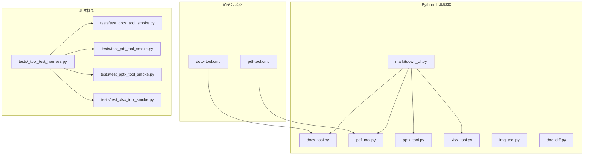
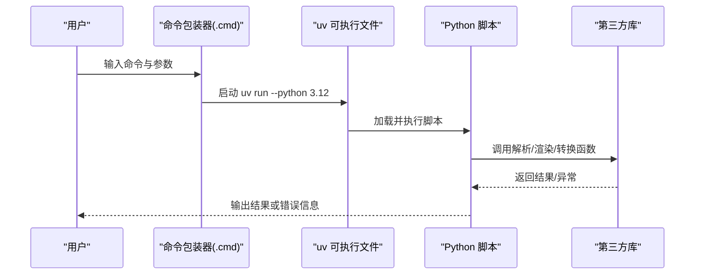
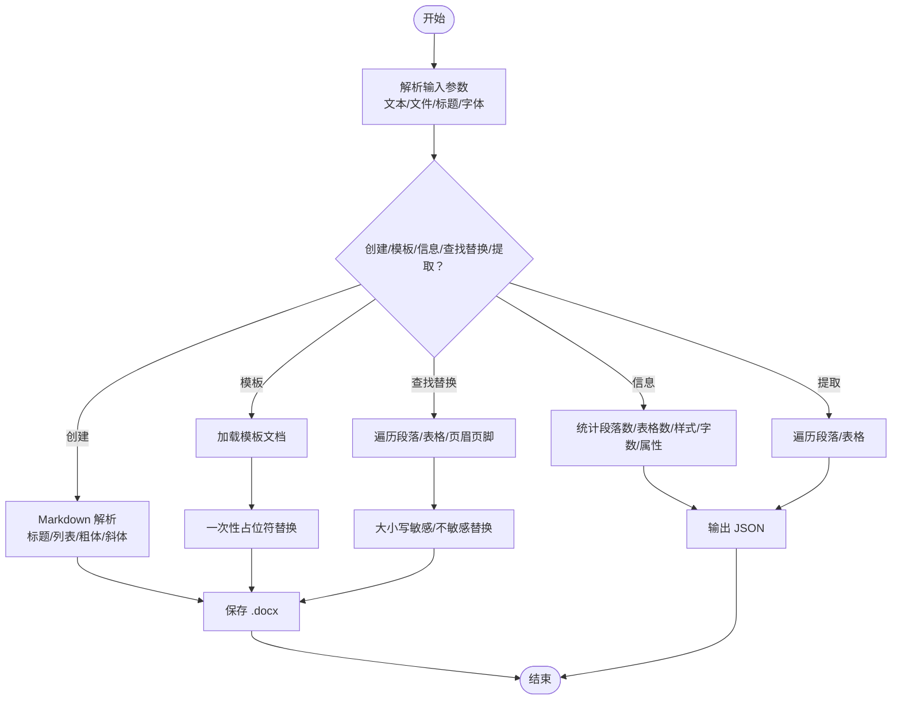
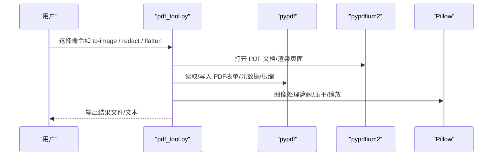
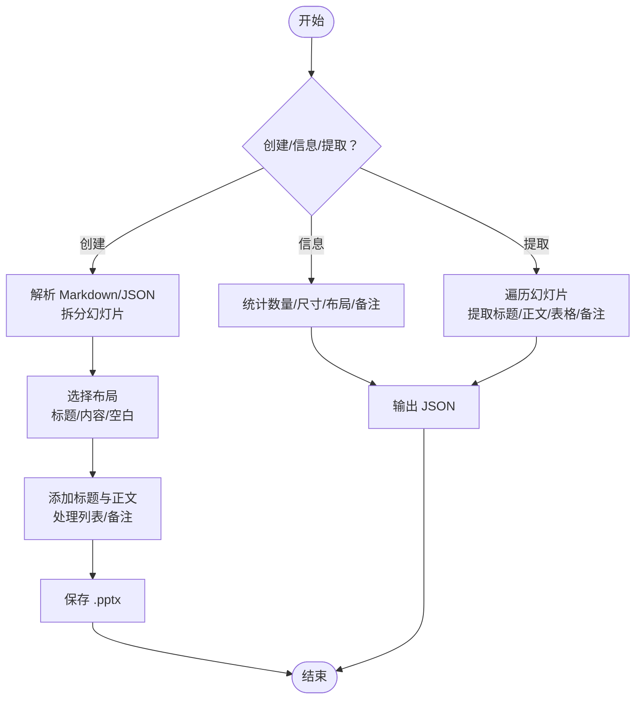
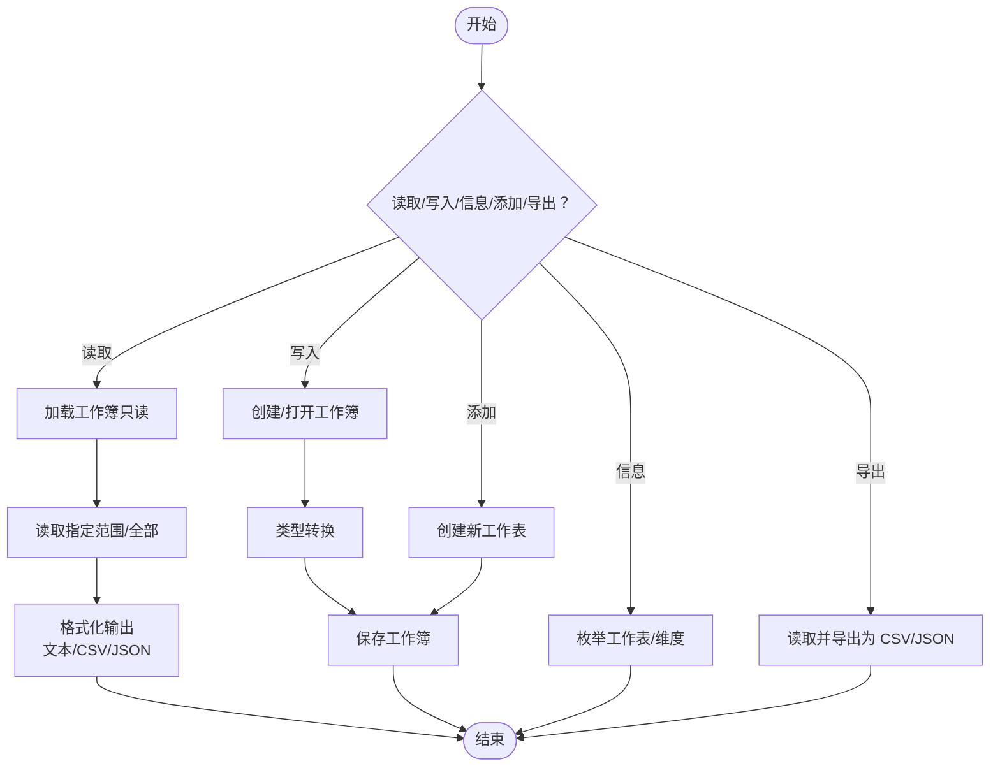
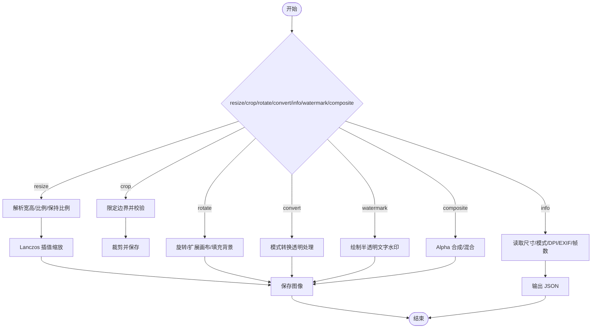
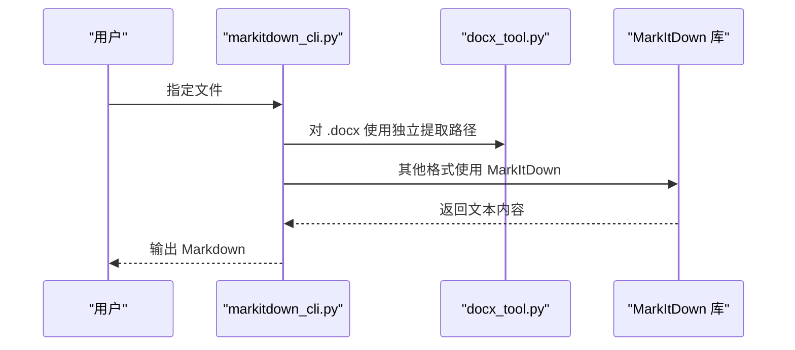
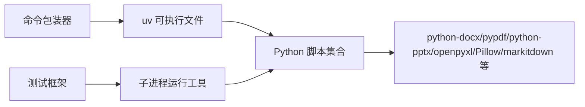

# 文档转换工具链

<cite>
**本文引用的文件**
- [docx_tool.py](file://apps/electron/resources/scripts/docx_tool.py)
- [pdf_tool.py](file://apps/electron/resources/scripts/pdf_tool.py)
- [pptx_tool.py](file://apps/electron/resources/scripts/pptx_tool.py)
- [xlsx_tool.py](file://apps/electron/resources/scripts/xlsx_tool.py)
- [img_tool.py](file://apps/electron/resources/scripts/img_tool.py)
- [markitdown_cli.py](file://apps/electron/resources/scripts/markitdown_cli.py)
- [doc_diff.py](file://apps/electron/resources/scripts/doc_diff.py)
- [_tool_test_harness.py](file://apps/electron/resources/scripts/tests/_tool_test_harness.py)
- [test_docx_tool_smoke.py](file://apps/electron/resources/scripts/tests/test_docx_tool_smoke.py)
- [test_pdf_tool_smoke.py](file://apps/electron/resources/scripts/tests/test_pdf_tool_smoke.py)
- [test_pptx_tool_smoke.py](file://apps/electron/resources/scripts/tests/test_pptx_tool_smoke.py)
- [test_xlsx_tool_smoke.py](file://apps/electron/resources/scripts/tests/test_xlsx_tool_smoke.py)
- [docx-tool.cmd](file://apps/electron/resources/bin/docx-tool.cmd)
- [pdf-tool.cmd](file://apps/electron/resources/bin/pdf-tool.cmd)
- [index.ts](file://apps/cli/src/index.ts)
</cite>

## 目录
1. [简介](#简介)
2. [项目结构](#项目结构)
3. [核心组件](#核心组件)
4. [架构总览](#架构总览)
5. [详细组件分析](#详细组件分析)
6. [依赖关系分析](#依赖关系分析)
7. [性能考虑](#性能考虑)
8. [故障排查指南](#故障排查指南)
9. [结论](#结论)
10. [附录](#附录)

## 简介
本技术文档面向需要处理多种文档格式转换与批处理的开发者，系统性阐述该文档转换工具链的 Python 脚本架构、文档格式解析与转换流程控制。文档覆盖 DOCX、PDF、PPTX、XLSX、图片（IMG）等格式的处理机制，包括：
- 元数据提取与信息展示
- 内容转换与文本抽取
- 图像处理管道与 PDF 渲染引擎
- Office 文档解析与模板填充
- 批量转换、并发处理与内存优化策略
- 格式兼容性、编码处理与错误恢复机制
- 自定义转换器开发指南与性能调优建议

## 项目结构
工具链由一组独立的 Python 命令行工具组成，通过跨平台命令包装器统一入口调用。每个工具专注于特定文档类型或任务域，具备清晰的子命令与参数体系。

图表来源
- [docx-tool.cmd:1-3](file://apps/electron/resources/bin/docx-tool.cmd#L1-L3)
- [pdf-tool.cmd:1-3](file://apps/electron/resources/bin/pdf-tool.cmd#L1-L3)
- [docx_tool.py:1-391](file://apps/electron/resources/scripts/docx_tool.py#L1-L391)
- [pdf_tool.py:1-1322](file://apps/electron/resources/scripts/pdf_tool.py#L1-L1322)
- [pptx_tool.py:1-365](file://apps/electron/resources/scripts/pptx_tool.py#L1-L365)
- [xlsx_tool.py:1-376](file://apps/electron/resources/scripts/xlsx_tool.py#L1-L376)
- [img_tool.py:1-371](file://apps/electron/resources/scripts/img_tool.py#L1-L371)
- [markitdown_cli.py:1-138](file://apps/electron/resources/scripts/markitdown_cli.py#L1-L138)
- [doc_diff.py:1-252](file://apps/electron/resources/scripts/doc_diff.py#L1-L252)
- [_tool_test_harness.py:1-83](file://apps/electron/resources/scripts/tests/_tool_test_harness.py#L1-L83)
- [test_docx_tool_smoke.py:1-91](file://apps/electron/resources/scripts/tests/test_docx_tool_smoke.py#L1-L91)
- [test_pdf_tool_smoke.py:1-127](file://apps/electron/resources/scripts/tests/test_pdf_tool_smoke.py#L1-L127)
- [test_pptx_tool_smoke.py:1-61](file://apps/electron/resources/scripts/tests/test_pptx_tool_smoke.py#L1-L61)
- [test_xlsx_tool_smoke.py:1-84](file://apps/electron/resources/scripts/tests/test_xlsx_tool_smoke.py#L1-L84)

章节来源
- [docx-tool.cmd:1-3](file://apps/electron/resources/bin/docx-tool.cmd#L1-L3)
- [pdf-tool.cmd:1-3](file://apps/electron/resources/bin/pdf-tool.cmd#L1-L3)
- [docx_tool.py:1-391](file://apps/electron/resources/scripts/docx_tool.py#L1-L391)
- [pdf_tool.py:1-1322](file://apps/electron/resources/scripts/pdf_tool.py#L1-L1322)
- [pptx_tool.py:1-365](file://apps/electron/resources/scripts/pptx_tool.py#L1-L365)
- [xlsx_tool.py:1-376](file://apps/electron/resources/scripts/xlsx_tool.py#L1-L376)
- [img_tool.py:1-371](file://apps/electron/resources/scripts/img_tool.py#L1-L371)
- [markitdown_cli.py:1-138](file://apps/electron/resources/scripts/markitdown_cli.py#L1-L138)
- [doc_diff.py:1-252](file://apps/electron/resources/scripts/doc_diff.py#L1-L252)
- [_tool_test_harness.py:1-83](file://apps/electron/resources/scripts/tests/_tool_test_harness.py#L1-L83)

## 核心组件
- DOCX 工具：支持创建、模板填充、信息查询、查找替换、文本提取；内置基础 Markdown 到 DOCX 的转换。
- PDF 工具：提供组织（提取、合并、拆分、旋转、重排、复制）、编辑（水印、填表单、压缩、裁剪、缩放、压平等）、安全（加密、解密、遮蔽、清理）、转换（到图片、从图片、到 DOCX、到 PPTX）等能力。
- PPTX 工具：支持从 Markdown/JSON 创建演示文稿、信息查询、内容提取。
- XLSX 工具：支持读取、写入、信息查询、添加工作表、导出为 CSV/JSON。
- 图片工具：支持尺寸调整、裁剪、旋转、格式转换、元数据查询、水印、合成。
- 通用转换器：基于 markitdown 的多格式到 Markdown 转换与差异比较工具。
- 测试框架：统一的工具运行环境与测试夹具，确保跨平台一致性。

章节来源
- [docx_tool.py:111-391](file://apps/electron/resources/scripts/docx_tool.py#L111-L391)
- [pdf_tool.py:419-1322](file://apps/electron/resources/scripts/pdf_tool.py#L419-L1322)
- [pptx_tool.py:31-365](file://apps/electron/resources/scripts/pptx_tool.py#L31-L365)
- [xlsx_tool.py:39-376](file://apps/electron/resources/scripts/xlsx_tool.py#L39-L376)
- [img_tool.py:63-371](file://apps/electron/resources/scripts/img_tool.py#L63-L371)
- [markitdown_cli.py:1-138](file://apps/electron/resources/scripts/markitdown_cli.py#L1-L138)
- [doc_diff.py:1-252](file://apps/electron/resources/scripts/doc_diff.py#L1-L252)

## 架构总览
工具链采用“命令包装器 + Python 脚本”的分层设计：
- 命令包装器负责定位 uv 可执行文件与脚本目录，统一传参。
- Python 脚本使用 Click 定义命令组与子命令，实现模块化功能。
- 外部库（如 pypdfium2、python-docx、python-pptx、openpyxl、Pillow、markitdown 等）提供底层解析与渲染能力。
- 测试框架通过子进程调用工具，验证边界条件与错误恢复。

图表来源
- [docx-tool.cmd:1-3](file://apps/electron/resources/bin/docx-tool.cmd#L1-L3)
- [pdf-tool.cmd:1-3](file://apps/electron/resources/bin/pdf-tool.cmd#L1-L3)
- [_tool_test_harness.py:71-83](file://apps/electron/resources/scripts/tests/_tool_test_harness.py#L71-L83)

## 详细组件分析

### DOCX 工具（docx_tool.py）
- 功能要点
  - 创建：从文本或 Markdown 创建新文档，支持标题、字体大小设置。
  - 模板：对包含占位符的模板文档进行一次性替换，保留段落格式。
  - 信息：统计段落数、表格数、样式使用、字数、核心属性与模板占位符。
  - 查找替换：支持大小写敏感/不敏感，逐段重建 runs 保持格式。
  - 提取：按段落与表格抽取文本，保留标题层级标记。
- 关键算法
  - Markdown 到 DOCX：正则匹配标题、列表、粗体/斜体、分页符，逐段应用样式与内联格式。
  - 占位符替换：单次遍历替换，避免二次替换导致的级联问题。
  - 查找替换：根据大小写选项选择全量替换或忽略大小写的正则替换，重建 runs。
- 错误处理
  - 参数校验失败时直接退出并输出错误信息。
  - JSON 解析失败时提示错误并退出。
- 性能与内存
  - 使用 python-docx 的 Document 对象逐段处理，避免一次性加载大文档的内存峰值。
  - 替换后仅保留必要的 runs，减少对象数量。

图表来源
- [docx_tool.py:111-391](file://apps/electron/resources/scripts/docx_tool.py#L111-L391)

章节来源
- [docx_tool.py:111-391](file://apps/electron/resources/scripts/docx_tool.py#L111-L391)

### PDF 工具（pdf_tool.py）
- 功能要点
  - 组织：提取、信息（含加密状态、元数据、页面尺寸、表单字段）、合并、拆分、旋转、重排、复制。
  - 编辑：水印、填表单、压缩、裁剪、缩放、压平（将交互元素转为静态图像）、页眉页脚叠加。
  - 安全：加密、解密、遮蔽（文本/区域）、清理（清空标准元数据并压缩内容流）。
  - 转换：PDF 到图片（PNG/JPG）、从图片到 PDF、PDF 到 DOCX、PDF 到 PPTX。
- 关键算法
  - 页面范围解析：严格解析“1-3,5,7-9”等格式，校验页码范围与重复，抛出明确错误。
  - 水印生成：构建最小 PDF，包含内容流、资源字典与透明度状态，再与页面合并。
  - 遮蔽：基于文本搜索定位字符盒，转换为像素坐标，绘制黑色矩形覆盖。
  - 压平：以高 DPI 渲染页面为图像，生成单页图像 PDF 并缩放到原始点尺寸。
  - 文本叠加：计算文本位置与旋转矩阵，生成内容流并合并到页面。
- 渲染引擎
  - 使用 pypdfium2 进行页面渲染与文本页提取，Pillow 进行图像处理，pypdf 进行 PDF 读写与表单操作。
- 错误处理
  - 输入输出路径相同、非法页码、互斥参数等场景均显式报错并退出。
  - 压缩与清理阶段对内容流进行压缩，降低文件体积。

图表来源
- [pdf_tool.py:419-1322](file://apps/electron/resources/scripts/pdf_tool.py#L419-L1322)

章节来源
- [pdf_tool.py:419-1322](file://apps/electron/resources/scripts/pdf_tool.py#L419-L1322)

### PPTX 工具（pptx_tool.py）
- 功能要点
  - 创建：从 Markdown 或 JSON 结构创建幻灯片，支持标题幻灯片与内容布局。
  - 信息：统计幻灯片数量、尺寸、布局名称、备注存在情况。
  - 提取：按幻灯片提取标题、正文、列表层级、表格内容与备注。
- 关键算法
  - Markdown 解析：以“---”分隔幻灯片，首行标题作为标题，其余作为正文。
  - 布局适配：根据是否存在标题/正文选择合适的布局（标题与内容、标题、空白）。
  - 列表处理：识别有序/无序列表与缩进层级，设置段落级别。
- 错误处理
  - 模板缺少布局、无效幻灯片编号等场景返回错误并退出。

图表来源
- [pptx_tool.py:31-365](file://apps/electron/resources/scripts/pptx_tool.py#L31-L365)

章节来源
- [pptx_tool.py:31-365](file://apps/electron/resources/scripts/pptx_tool.py#L31-L365)

### XLSX 工具（xlsx_tool.py）
- 功能要点
  - 读取：支持指定工作表、全部工作表、单元格区域，输出文本/CSV/JSON。
  - 写入：在不存在时创建工作簿，支持字符串/数字/布尔值类型转换。
  - 信息：列出工作表名、维度、行列范围。
  - 添加工作表：创建新工作表并插入。
  - 导出：将工作表导出为 CSV/JSON。
- 关键算法
  - 行列读取：使用 openpyxl 的只读模式与 data_only，避免公式重算。
  - 记录构建：将首行作为表头，后续行构建字典记录。
  - 类型转换：根据 --type 选项将字符串转换为整数/浮点/布尔。
- 错误处理
  - 互斥参数（如 --all-sheets 与 --sheet）显式报错。
  - 未找到工作表时返回可用列表并退出。

图表来源
- [xlsx_tool.py:39-376](file://apps/electron/resources/scripts/xlsx_tool.py#L39-L376)

章节来源
- [xlsx_tool.py:39-376](file://apps/electron/resources/scripts/xlsx_tool.py#L39-L376)

### 图像工具（img_tool.py）
- 功能要点
  - 尺寸调整：支持固定宽高、比例缩放、保持纵横比。
  - 裁剪：限定边界并校验区域有效性。
  - 旋转：可选扩展画布与背景色。
  - 转换：支持常见格式（PNG/JPEG/GIF/BMP/TIFF/WEBP），自动处理透明度。
  - 元数据：读取尺寸、模式、DPI、EXIF、帧数（动画）。
  - 水印：在指定位置绘制半透明文字水印。
  - 合成：支持叠加图层与混合。
- 关键算法
  - 格式推断：根据扩展名映射 Pillow 支持的格式。
  - JPEG 透明处理：RGBA/LA/P 模式转换为 RGB。
  - 水印绘制：尝试系统字体，回退至默认字体；计算文本边界框并定位。
  - 合成：Alpha 合成或等比混合，必要时调整尺寸。
- 错误处理
  - 非法参数（负尺寸、无效区域、颜色解析失败）直接报错。

图表来源
- [img_tool.py:63-371](file://apps/electron/resources/scripts/img_tool.py#L63-L371)

章节来源
- [img_tool.py:63-371](file://apps/electron/resources/scripts/img_tool.py#L63-L371)

### 通用转换器与差异比较（markitdown_cli.py、doc_diff.py）
- 通用转换器
  - 支持多种文档格式（DOCX/XLSX/PPTX/PDF/HTML/IPYNB/XML/RSS/ZIP/MSG/EMl/CSV/TSV/JSON/TXT/MD/RST/RTF/JPG/JPEG/PNG/GIF/BMP/TIFF/WAV/MP3 等）转换为 Markdown。
  - 对于纯文本类扩展名直接读取；对 DOCX 提供独立的 python-docx 提取路径，避免 MarkItDown 的可选原生依赖问题。
  - 对非文本格式优先使用 MarkItDown，若失败则提示安装 Microsoft Visual C++ Redistributable。
- 差异比较
  - 将两个文档分别转换为文本/Markdown，支持统一差异、并排对比与摘要统计。
  - 使用 difflib 与 diff-match-patch 实现行级与语义级差异分析。

图表来源
- [markitdown_cli.py:1-138](file://apps/electron/resources/scripts/markitdown_cli.py#L1-L138)
- [docx_tool.py:59-76](file://apps/electron/resources/scripts/docx_tool.py#L59-L76)

章节来源
- [markitdown_cli.py:1-138](file://apps/electron/resources/scripts/markitdown_cli.py#L1-L138)
- [doc_diff.py:1-252](file://apps/electron/resources/scripts/doc_diff.py#L1-L252)

## 依赖关系分析
- 命令包装器
  - Windows 下通过 .cmd 文件调用 uv run，Linux/macOS 使用可执行脚本，统一注入 CRAFT_UV 与 CRAFT_SCRIPTS 环境变量。
- Python 工具
  - DOCX：python-docx、click。
  - PDF：pypdfium2、pypdf、img2pdf、Pillow、click、python-docx、python-pptx。
  - PPTX：python-pptx、click。
  - XLSX：openpyxl、click。
  - 图像：Pillow、click。
  - 通用转换：markitdown、python-docx、diff-match-patch、click。
- 测试框架
  - 通过 _tool_test_harness.py 解析平台键、查找 uv 可执行文件与工具包装器，构造环境并以子进程方式运行各工具，断言返回码与输出。

图表来源
- [_tool_test_harness.py:37-83](file://apps/electron/resources/scripts/tests/_tool_test_harness.py#L37-L83)
- [docx-tool.cmd:1-3](file://apps/electron/resources/bin/docx-tool.cmd#L1-L3)
- [pdf-tool.cmd:1-3](file://apps/electron/resources/bin/pdf-tool.cmd#L1-L3)

章节来源
- [_tool_test_harness.py:1-83](file://apps/electron/resources/scripts/tests/_tool_test_harness.py#L1-L83)
- [docx-tool.cmd:1-3](file://apps/electron/resources/bin/docx-tool.cmd#L1-L3)
- [pdf-tool.cmd:1-3](file://apps/electron/resources/bin/pdf-tool.cmd#L1-L3)

## 性能考虑
- 解析与渲染
  - PDF 使用 pypdfium2 进行页面渲染与文本页提取，避免复杂图形路径的高成本；图像处理采用 Pillow 的高效插值与压缩。
  - DOCX/PPTX/XLSX 使用官方库的只读/增量处理模式，减少内存占用。
- 批量与并发
  - 当前脚本为单进程命令行工具，适合流水线编排；建议在上层通过外部进程池或并行调度器实现多文件并发处理。
- 内存优化
  - 逐段/逐页处理，避免一次性加载完整文档；对临时图像缓冲区及时释放。
- I/O 与编码
  - 统一使用 UTF-8 编码读写文本；对二进制格式直接按字节处理，避免不必要的解码/编码开销。

## 故障排查指南
- 常见错误与对策
  - 输出路径与输入路径相同：工具会拒绝覆盖，需修改输出路径。
  - 非法页码范围或越界：严格解析规则会立即报错，检查页码格式与总数。
  - 互斥参数冲突：如 --all-sheets 与 --sheet 同时使用，或 --order 与 --reverse 同时使用，工具会提示并退出。
  - JSON 解析失败：模板/表单/日历等命令要求 JSON 数据，格式错误会报错。
  - MarkItDown 原生依赖缺失：提示安装 Microsoft Visual C++ Redistributable。
- 测试驱动验证
  - 通过测试夹具运行工具，覆盖边界条件（越界页码、无效参数、错误 JSON、无效工作表名等），确保错误恢复行为一致。

章节来源
- [test_docx_tool_smoke.py:1-91](file://apps/electron/resources/scripts/tests/test_docx_tool_smoke.py#L1-L91)
- [test_pdf_tool_smoke.py:1-127](file://apps/electron/resources/scripts/tests/test_pdf_tool_smoke.py#L1-L127)
- [test_pptx_tool_smoke.py:1-61](file://apps/electron/resources/scripts/tests/test_pptx_tool_smoke.py#L1-L61)
- [test_xlsx_tool_smoke.py:1-84](file://apps/electron/resources/scripts/tests/test_xlsx_tool_smoke.py#L1-L84)

## 结论
该工具链以模块化设计实现了多格式文档的解析、转换与批处理能力，结合严格的参数校验与错误恢复机制，能够稳定地支撑复杂文档处理场景。通过统一的命令包装器与测试框架，保证了跨平台一致性与可维护性。对于大规模转换需求，建议在上层引入并行调度与缓存策略，进一步提升吞吐与稳定性。

## 附录
- 开发者指南
  - 新增命令：参考现有 Click 命令模式，定义 group 与 command，使用 write_output 统一输出。
  - 处理大文件：优先使用只读/增量模式，避免一次性加载；对图像处理使用临时缓冲并在完成后释放。
  - 错误处理：对所有外部依赖进行 try/except 包裹，提供明确的错误消息与返回码。
  - 测试：新增命令后补充对应的 smoke 测试，覆盖正常路径与异常路径。
- 性能调优
  - 合理设置 DPI（PDF 转图片/压平）与压缩等级（JPEG），在质量与体积间平衡。
  - 在上层使用进程池并行处理不同文件类型，避免阻塞等待。
  - 对重复转换的结果进行缓存，减少重复解析成本。