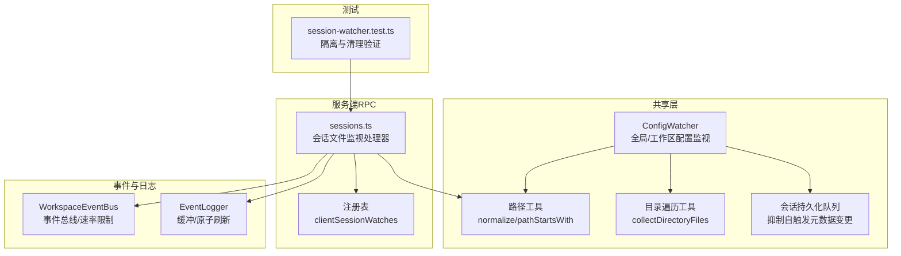
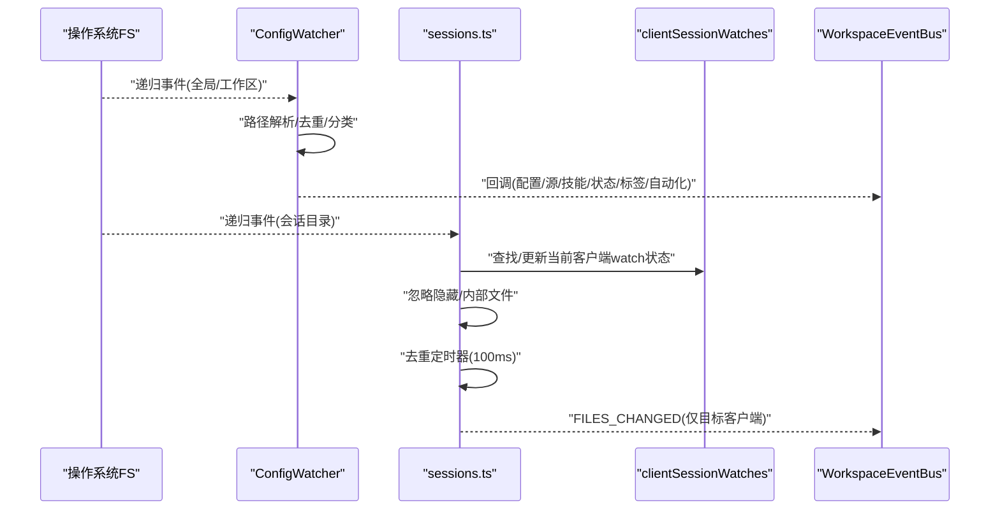
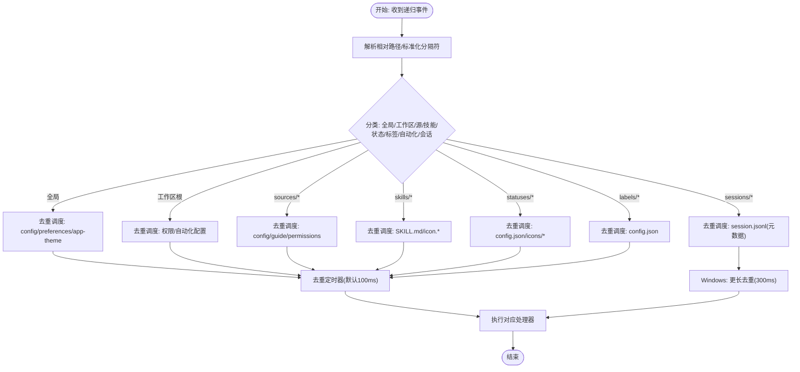
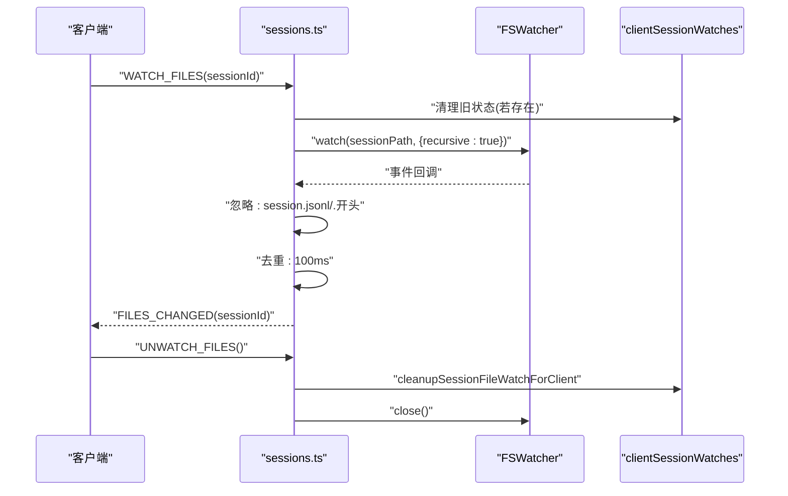
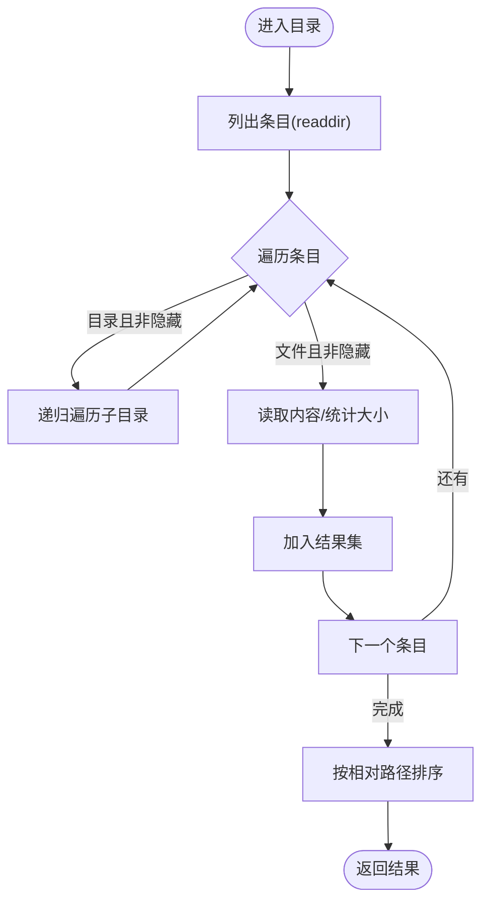
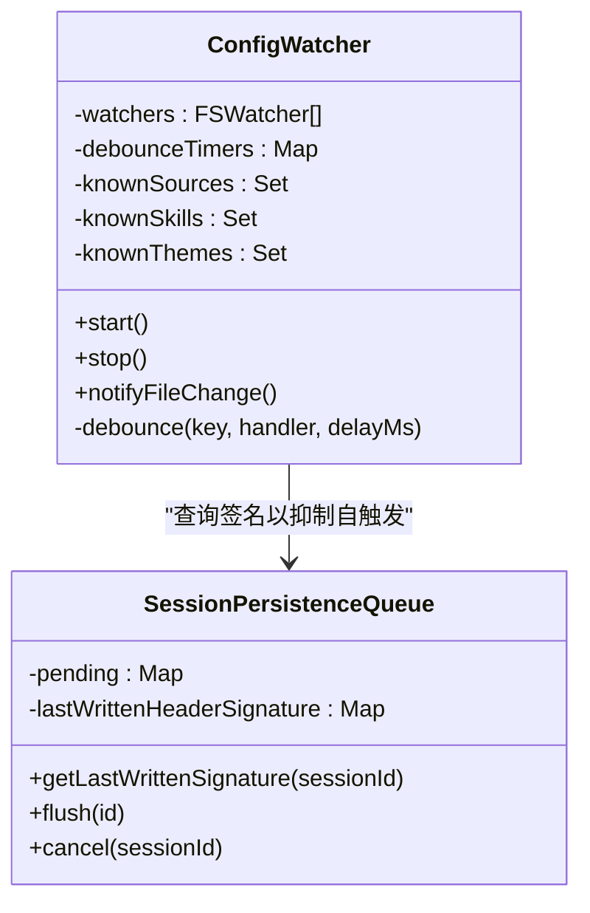
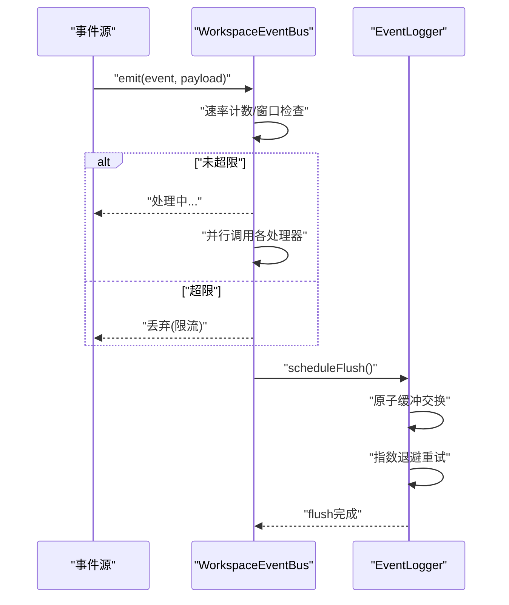
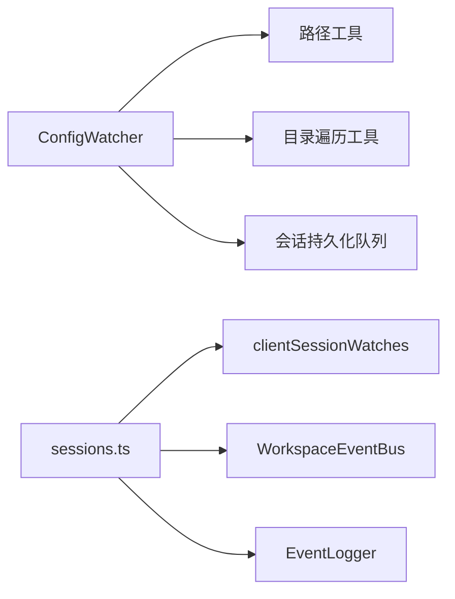

# 目录监视机制

<cite>
**本文引用的文件**
- [packages/shared/src/config/watcher.ts](file://packages/shared/src/config/watcher.ts)
- [packages/server-core/src/handlers/rpc/sessions.ts](file://packages/server-core/src/handlers/rpc/sessions.ts)
- [apps/electron/src/main/handlers/__tests__/session-watcher.test.ts](file://apps/electron/src/main/handlers/__tests__/session-watcher.test.ts)
- [packages/shared/src/utils/bundle-files.ts](file://packages/shared/src/utils/bundle-files.ts)
- [packages/shared/src/utils/paths.ts](file://packages/shared/src/utils/paths.ts)
- [packages/shared/src/sessions/persistence-queue.ts](file://packages/shared/src/sessions/persistence-queue.ts)
- [packages/shared/src/automations/event-bus.ts](file://packages/shared/src/automations/event-bus.ts)
- [packages/shared/src/automations/event-bus.test.ts](file://packages/shared/src/automations/event-bus.test.ts)
- [packages/shared/src/automations/event-logger.ts](file://packages/shared/src/automations/event-logger.ts)
</cite>

## 目录索引
1. [简介](#简介)
2. [项目结构](#项目结构)
3. [核心组件](#核心组件)
4. [架构总览](#架构总览)
5. [详细组件分析](#详细组件分析)
6. [依赖关系分析](#依赖关系分析)
7. [性能考量](#性能考量)
8. [故障排除指南](#故障排除指南)
9. [结论](#结论)
10. [附录](#附录)

## 简介
本技术文档围绕“目录监视机制”展开，聚焦于文件系统事件监听、目录树遍历、变更检测算法，以及事件去重、批量优化、递归监视、忽略规则、跨平台兼容性、文件锁定处理、网络驱动器支持、性能调优与长时运行稳定性等主题。文档以实际代码为依据，结合序列图与流程图，帮助开发者实现可靠的实时文件同步或变更通知。

## 项目结构
本仓库中与目录监视直接相关的核心模块包括：
- 全局配置与工作区监视：在共享包中实现，覆盖全局配置、工作区源/技能/状态/标签/自动化等目录的递归监听与变更分发。
- 会话文件监视：在服务端 RPC 处理器中实现，针对每个客户端独立的会话目录进行递归监听，并进行去重与过滤。
- 工具与路径：提供跨平台路径规范化、目录遍历收集与安全校验等基础能力。
- 事件总线与日志：提供事件速率限制、缓冲落盘与原子刷新等机制，保障稳定性与可观测性。

图表来源
- [packages/shared/src/config/watcher.ts:198-305](file://packages/shared/src/config/watcher.ts#L198-L305)
- [packages/server-core/src/handlers/rpc/sessions.ts:14-58](file://packages/server-core/src/handlers/rpc/sessions.ts#L14-L58)
- [packages/shared/src/utils/bundle-files.ts:120-165](file://packages/shared/src/utils/bundle-files.ts#L120-L165)
- [packages/shared/src/utils/paths.ts:124-160](file://packages/shared/src/utils/paths.ts#L124-L160)
- [packages/shared/src/sessions/persistence-queue.ts:224-244](file://packages/shared/src/sessions/persistence-queue.ts#L224-L244)
- [packages/shared/src/automations/event-bus.ts:162-190](file://packages/shared/src/automations/event-bus.ts#L162-L190)
- [packages/shared/src/automations/event-logger.ts:101-127](file://packages/shared/src/automations/event-logger.ts#L101-L127)

章节来源
- [packages/shared/src/config/watcher.ts:1-1130](file://packages/shared/src/config/watcher.ts#L1-L1130)
- [packages/server-core/src/handlers/rpc/sessions.ts:1-577](file://packages/server-core/src/handlers/rpc/sessions.ts#L1-L577)

## 核心组件
- ConfigWatcher（全局/工作区配置监视）
  - 负责递归监听全局配置目录与工作区目录，按文件类型分派到具体处理器；内置去重定时器与已知集合，用于检测新增/删除项与列表级变更。
  - 关键特性：重复监视检测（注册表）、debounce 去重、平台差异处理（Windows 会话元数据更长去重窗口）、手动通知以修复特定平台问题。
- 会话文件监视（sessions.ts）
  - 每个客户端独立维护一个 FSWatcher，递归监听其会话目录；忽略内部文件与隐藏文件，使用去重定时器合并高频变更；提供清理钩子防止泄漏。
- 路径与遍历工具
  - 提供跨平台路径规范化、目录树递归遍历、跳过隐藏/指定文件/目录、确定性排序与安全校验（防路径逃逸）。
- 事件总线与日志
  - 事件总线具备速率限制与并发错误捕获；事件日志采用缓冲+原子交换+指数退避写入，确保高吞吐下的稳定性。

章节来源
- [packages/shared/src/config/watcher.ts:202-305](file://packages/shared/src/config/watcher.ts#L202-L305)
- [packages/server-core/src/handlers/rpc/sessions.ts:455-497](file://packages/server-core/src/handlers/rpc/sessions.ts#L455-L497)
- [packages/shared/src/utils/bundle-files.ts:120-165](file://packages/shared/src/utils/bundle-files.ts#L120-L165)
- [packages/shared/src/automations/event-bus.ts:162-190](file://packages/shared/src/automations/event-bus.ts#L162-L190)
- [packages/shared/src/automations/event-logger.ts:101-127](file://packages/shared/src/automations/event-logger.ts#L101-L127)

## 架构总览
下图展示两类监视器的交互与职责边界：ConfigWatcher 聚焦配置与资源变更，sessions.ts 聚焦会话输出文件变更。

图表来源
- [packages/shared/src/config/watcher.ts:394-410](file://packages/shared/src/config/watcher.ts#L394-L410)
- [packages/server-core/src/handlers/rpc/sessions.ts:455-497](file://packages/server-core/src/handlers/rpc/sessions.ts#L455-L497)
- [packages/shared/src/automations/event-bus.ts:178-190](file://packages/shared/src/automations/event-bus.ts#L178-L190)

## 详细组件分析

### ConfigWatcher 组件分析
- 递归监视与事件分派
  - 对全局配置目录与工作区根目录启用递归监听；对不同子路径（sources/skills/statuses/labels/automations/sessions）进行精确匹配与分类处理。
  - 使用去重定时器按键聚合同类事件，避免抖动与风暴。
- 变更检测算法
  - 对目录级变更（如新增/删除源/技能目录），通过扫描当前目录与已知集合比对，识别增删项并触发相应回调。
  - 对列表级变更（如 sources 列表变化），先计算当前集合，再与已知集合对比，触发列表回调。
- 平台差异与兼容性
  - Windows 上对会话元数据变更采用更长去重窗口，以适配原子写入导致的多次事件。
  - 针对特定平台（Linux）的递归监听问题，提供手动通知接口以补偿。
- 事件去重与内存管理
  - 使用 Map 存储去重定时器句柄，stop 时统一清理；停止后清空已知集合，释放内存。
- 错误处理与健壮性
  - 所有扫描与回调均包裹 try/catch 并记录调试信息；对不可读文件采取跳过策略，不中断整体流程。

图表来源
- [packages/shared/src/config/watcher.ts:394-521](file://packages/shared/src/config/watcher.ts#L394-L521)
- [packages/shared/src/config/watcher.ts:526-538](file://packages/shared/src/config/watcher.ts#L526-L538)

章节来源
- [packages/shared/src/config/watcher.ts:202-305](file://packages/shared/src/config/watcher.ts#L202-L305)
- [packages/shared/src/config/watcher.ts:394-521](file://packages/shared/src/config/watcher.ts#L394-L521)
- [packages/shared/src/config/watcher.ts:526-538](file://packages/shared/src/config/watcher.ts#L526-L538)

### 会话文件监视组件分析
- 客户端隔离与生命周期
  - 每个客户端维护独立的 FSWatcher 实例，清理函数在断开连接时调用，避免 watcher 泄漏。
- 忽略规则与批量优化
  - 显式忽略内部文件（如 session.jsonl）与隐藏文件（. 开头），减少无关事件。
  - 使用 100ms 去重定时器合并高频变更，降低通知风暴。
- 事件推送
  - 仅向触发变更的客户端推送 FILES_CHANGED，避免广播带来的干扰。

图表来源
- [packages/server-core/src/handlers/rpc/sessions.ts:455-497](file://packages/server-core/src/handlers/rpc/sessions.ts#L455-L497)
- [apps/electron/src/main/handlers/__tests__/session-watcher.test.ts:105-156](file://apps/electron/src/main/handlers/__tests__/session-watcher.test.ts#L105-L156)

章节来源
- [packages/server-core/src/handlers/rpc/sessions.ts:455-497](file://packages/server-core/src/handlers/rpc/sessions.ts#L455-L497)
- [apps/electron/src/main/handlers/__tests__/session-watcher.test.ts:105-156](file://apps/electron/src/main/handlers/__tests__/session-watcher.test.ts#L105-L156)

### 目录树遍历与忽略规则
- 递归遍历
  - 从给定目录开始，遍历所有非隐藏文件与非忽略目录，收集文件统计信息与内容摘要。
- 忽略规则
  - 默认跳过隐藏文件/目录（名称以 . 开头）；支持通过选项跳过指定文件名与目录名。
- 安全与一致性
  - 输出路径统一为正斜杠分隔的便携路径；对不可读文件进行日志记录并跳过；最终结果按相对路径排序，保证可重复性。
- 跨平台路径处理
  - 规范化路径分隔符与大小写（Windows 大小写不敏感），便于比较与匹配。

图表来源
- [packages/shared/src/utils/bundle-files.ts:120-165](file://packages/shared/src/utils/bundle-files.ts#L120-L165)
- [packages/shared/src/utils/paths.ts:124-160](file://packages/shared/src/utils/paths.ts#L124-L160)

章节来源
- [packages/shared/src/utils/bundle-files.ts:120-165](file://packages/shared/src/utils/bundle-files.ts#L120-L165)
- [packages/shared/src/utils/paths.ts:124-160](file://packages/shared/src/utils/paths.ts#L124-L160)

### 事件去重与内存管理
- 去重策略
  - ConfigWatcher 使用键控去重定时器，同类事件在指定窗口内被合并；会话监视器同样采用 100ms 去重窗口。
- 内存管理
  - 停止监视器时，清除所有去重定时器、关闭所有 FSWatcher、清空已知集合，避免内存泄漏。
- 会话持久化抑制
  - 会话持久化队列记录最后一次写入的头部签名，ConfigWatcher 在检测到外部元数据变更时，可利用该签名抑制自身触发的元数据变更事件，避免循环。

图表来源
- [packages/shared/src/config/watcher.ts:202-305](file://packages/shared/src/config/watcher.ts#L202-L305)
- [packages/shared/src/sessions/persistence-queue.ts:224-244](file://packages/shared/src/sessions/persistence-queue.ts#L224-L244)

章节来源
- [packages/shared/src/config/watcher.ts:202-305](file://packages/shared/src/config/watcher.ts#L202-L305)
- [packages/shared/src/sessions/persistence-queue.ts:224-244](file://packages/shared/src/sessions/persistence-queue.ts#L224-L244)

### 事件总线与日志稳定性
- 事件总线
  - 提供速率限制（默认每分钟 10 次，调度器事件每分钟 60 次），窗口重置后允许继续触发；并发处理器错误被捕获并记录。
- 事件日志
  - 采用缓冲+原子交换+指数退避写入，避免竞争条件与磁盘压力峰值；支持重试与防抖。

图表来源
- [packages/shared/src/automations/event-bus.ts:178-190](file://packages/shared/src/automations/event-bus.ts#L178-L190)
- [packages/shared/src/automations/event-logger.ts:101-127](file://packages/shared/src/automations/event-logger.ts#L101-L127)

章节来源
- [packages/shared/src/automations/event-bus.ts:162-190](file://packages/shared/src/automations/event-bus.ts#L162-L190)
- [packages/shared/src/automations/event-bus.test.ts:219-266](file://packages/shared/src/automations/event-bus.test.ts#L219-L266)
- [packages/shared/src/automations/event-logger.ts:101-127](file://packages/shared/src/automations/event-logger.ts#L101-L127)

## 依赖关系分析
- ConfigWatcher 依赖
  - 路径工具：用于跨平台路径规范化与目录前缀判断。
  - 目录遍历工具：用于首次扫描与构建已知集合。
  - 会话持久化队列：用于抑制自触发元数据变更。
- 会话监视器依赖
  - 客户端状态注册表：维护 per-client 的 watcher 生命周期。
  - 事件总线：将变更事件推送给渲染层。
  - 日志：记录事件流与错误。

图表来源
- [packages/shared/src/config/watcher.ts:202-305](file://packages/shared/src/config/watcher.ts#L202-L305)
- [packages/server-core/src/handlers/rpc/sessions.ts:14-58](file://packages/server-core/src/handlers/rpc/sessions.ts#L14-L58)
- [packages/shared/src/utils/bundle-files.ts:120-165](file://packages/shared/src/utils/bundle-files.ts#L120-L165)
- [packages/shared/src/utils/paths.ts:124-160](file://packages/shared/src/utils/paths.ts#L124-L160)
- [packages/shared/src/sessions/persistence-queue.ts:224-244](file://packages/shared/src/sessions/persistence-queue.ts#L224-L244)

章节来源
- [packages/shared/src/config/watcher.ts:202-305](file://packages/shared/src/config/watcher.ts#L202-L305)
- [packages/server-core/src/handlers/rpc/sessions.ts:14-58](file://packages/server-core/src/handlers/rpc/sessions.ts#L14-L58)

## 性能考量
- 去重与批处理
  - 两类监视器均采用去重定时器，有效降低高频事件的处理压力。
- 跳过无关文件
  - 会话监视器显式忽略内部文件与隐藏文件，减少无效事件。
- 平台差异化
  - Windows 会话元数据变更采用更长去重窗口，适配原子写入行为。
- I/O 与内存
  - 监视器停止时统一清理定时器与 FSWatcher，避免资源泄漏；目录遍历工具对不可读文件采取跳过策略，保证稳定性。
- 事件速率限制
  - 事件总线对高频事件进行速率限制，防止事件风暴影响系统稳定性。

[本节为通用性能建议，无需引用具体文件]

## 故障排除指南
- 重复监视导致事件风暴
  - 现象：同一工作区目录被多个监视器同时监听，导致事件风暴或死锁。
  - 排查：检查 activeWatchers 注册表，确认同一工作区目录只存在一个监视器实例。
  - 解决：确保在启动新监视器前清理旧实例，或复用现有实例。
- 会话监视器泄漏
  - 现象：客户端断开后仍收到会话文件变更通知。
  - 排查：确认断开钩子是否调用了清理函数，清理注册表中的 watcher。
  - 解决：在断开连接时调用清理函数，确保 close() 与注册表移除。
- Windows 原子写入导致的重复事件
  - 现象：会话元数据频繁触发变更。
  - 排查：确认是否处于 Windows 平台，且使用了更长去重窗口。
  - 解决：保持默认更长去重窗口，或在业务侧对元数据变更进行幂等处理。
- 事件风暴与性能下降
  - 现象：大量文件变更导致 CPU 占用飙升。
  - 排查：检查是否遗漏忽略规则（隐藏文件/内部文件），确认去重窗口是否合理。
  - 解决：增加忽略规则，适当提高去重窗口，必要时引入速率限制。
- 文件锁定与不可读
  - 现象：遍历时出现部分文件读取失败。
  - 排查：确认文件是否被其他进程锁定或权限不足。
  - 解决：遍历工具会跳过不可读文件并记录日志，可在后续重试或告警。

章节来源
- [packages/shared/src/config/watcher.ts:258-263](file://packages/shared/src/config/watcher.ts#L258-L263)
- [packages/server-core/src/handlers/rpc/sessions.ts:47-58](file://packages/server-core/src/handlers/rpc/sessions.ts#L47-L58)
- [apps/electron/src/main/handlers/__tests__/session-watcher.test.ts:105-156](file://apps/electron/src/main/handlers/__tests__/session-watcher.test.ts#L105-L156)
- [packages/shared/src/utils/bundle-files.ts:151-154](file://packages/shared/src/utils/bundle-files.ts#L151-L154)

## 结论
本目录监视机制通过“递归监听 + 分类处理 + 去重合并 + 忽略规则 + 平台差异化 + 事件总线/日志稳定性”等手段，实现了对全局配置与会话输出文件的可靠变更感知。开发者在实现类似功能时，应重点关注：
- 合理设置去重窗口与忽略规则；
- 在断开连接或异常场景下确保清理；
- 针对平台差异调整策略；
- 引入速率限制与缓冲写入以提升稳定性。

[本节为总结性内容，无需引用具体文件]

## 附录
- 配置指南（面向使用者）
  - 全局配置目录：确保 config.json、preferences.json、theme.json 等文件位于约定目录，以便监视器自动发现。
  - 工作区目录：确保 sources/skills/statuses/labels/automations/sessions 等子目录结构符合预期，以便正确识别变更。
  - 会话目录：仅关注输出文件，内部文件与隐藏文件会被自动忽略。
- 性能监控方法
  - 使用性能标记（span）记录监视器启动阶段关键节点耗时。
  - 观察事件总线速率限制触发次数，评估是否需要调整去重窗口或忽略规则。
- 故障排除清单
  - 检查 activeWatchers 注册表，避免重复监视。
  - 断开连接后调用清理函数，确保 watcher 释放。
  - Windows 平台注意会话元数据的更长去重窗口。
  - 对不可读文件与锁定文件采取跳过策略，避免阻塞遍历。

[本节为补充说明，无需引用具体文件]