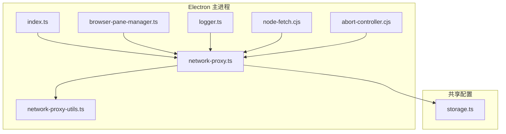
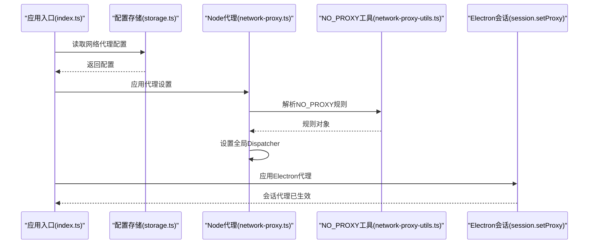
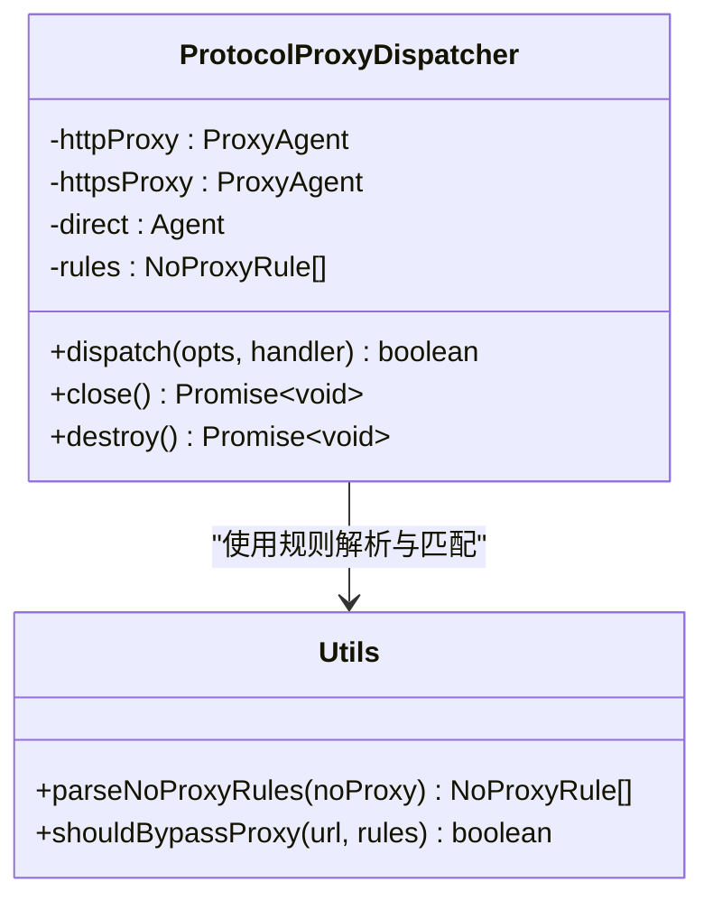
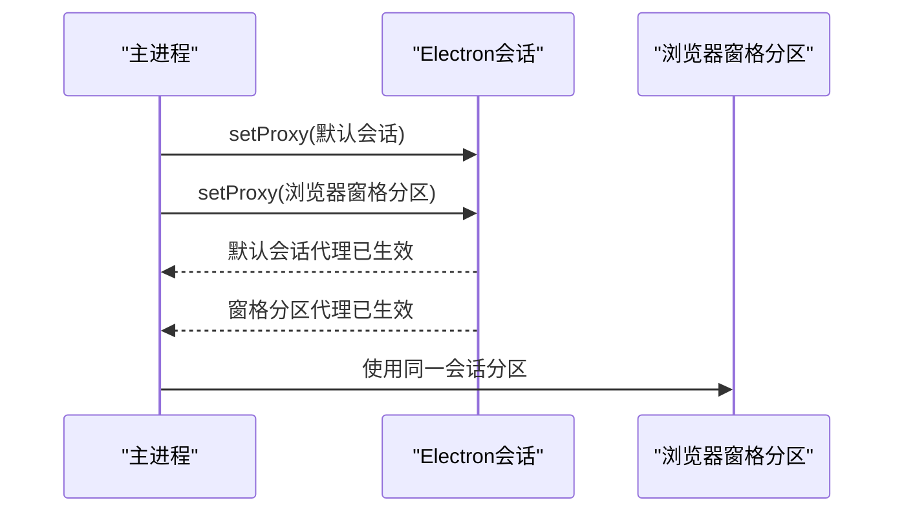
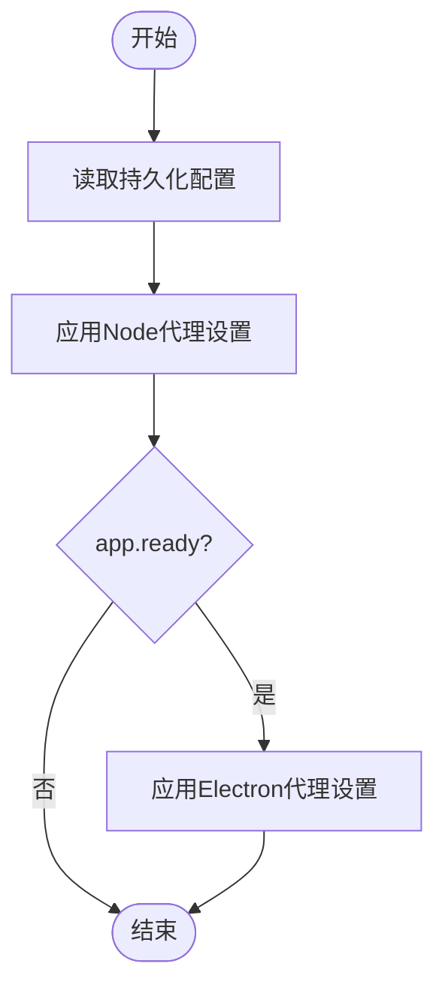
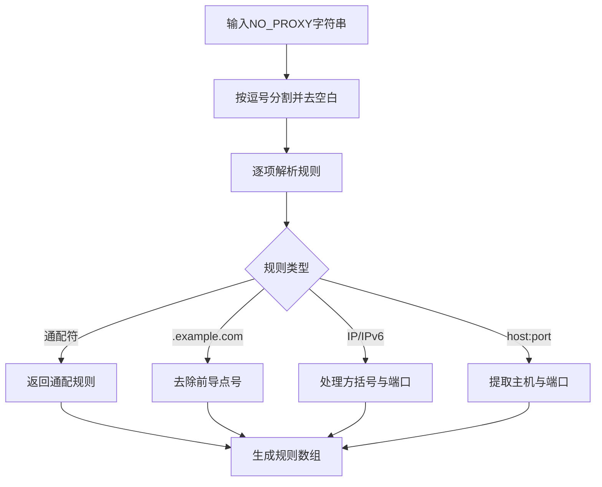
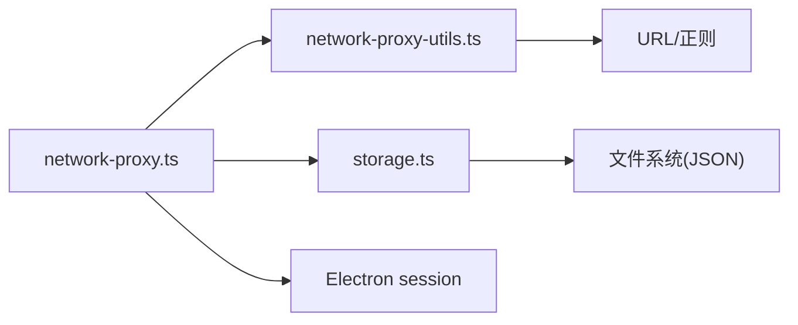

# 网络代理配置

<cite>
**本文档引用的文件**
- [network-proxy.ts](file://apps/electron/src/main/network-proxy.ts)
- [network-proxy-utils.ts](file://apps/electron/src/main/network-proxy-utils.ts)
- [browser-pane-manager.ts](file://apps/electron/src/main/browser-pane-manager.ts)
- [index.ts](file://apps/electron/src/main/index.ts)
- [storage.ts](file://packages/shared/src/config/storage.ts)
- [logger.ts](file://apps/electron/src/main/logger.ts)
- [node-fetch.cjs](file://apps/electron/src/main/shims/node-fetch.cjs)
- [abort-controller.cjs](file://apps/electron/src/main/shims/abort-controller.cjs)
- [network-proxy.test.ts](file://apps/electron/src/main/__tests__/network-proxy.test.ts)
- [browser-pane-manager.test.ts](file://apps/electron/src/main/__tests__/browser-pane-manager.test.ts)
</cite>

## 目录
1. [简介](#简介)
2. [项目结构](#项目结构)
3. [核心组件](#核心组件)
4. [架构总览](#架构总览)
5. [详细组件分析](#详细组件分析)
6. [依赖关系分析](#依赖关系分析)
7. [性能考量](#性能考量)
8. [故障排查指南](#故障排查指南)
9. [结论](#结论)
10. [附录](#附录)

## 简介
本技术文档聚焦于该代码库中的网络代理配置体系，系统性阐述基于 Node.js 与 Electron 的双层代理架构：Node.js 层通过全局 undici 调度器实现 HTTP/HTTPS 协议路由与 NO_PROXY 规则匹配；Electron 层通过会话级 setProxy 配置浏览器渲染进程的网络请求。文档涵盖代理链路管理、动态切换、连接池与超时重试、持久化与热更新、企业环境适配与安全连接处理，并提供最佳实践与故障诊断建议。

## 项目结构
围绕代理配置的关键模块分布如下：
- Electron 主进程
  - 代理主控：network-proxy.ts（Node 全局调度器与 Electron 会话代理配置）
  - 代理工具：network-proxy-utils.ts（NO_PROXY 解析与匹配）
  - 浏览器窗格：browser-pane-manager.ts（共享会话分区与窗口生命周期）
  - 应用入口：index.ts（启动阶段应用代理设置）
  - 日志：logger.ts（调试模式与专用日志）
  - 适配 shim：node-fetch.cjs、abort-controller.cjs（原生 fetch 与 AbortController 替换）
- 共享配置
  - 存储：storage.ts（配置持久化，含 networkProxy 字段）

**图表来源**
- [network-proxy.ts:1-175](file://apps/electron/src/main/network-proxy.ts#L1-L175)
- [network-proxy-utils.ts:1-107](file://apps/electron/src/main/network-proxy-utils.ts#L1-L107)
- [browser-pane-manager.ts:1-3157](file://apps/electron/src/main/browser-pane-manager.ts#L1-L3157)
- [index.ts:1-1194](file://apps/electron/src/main/index.ts#L1-L1194)
- [storage.ts:1-2948](file://packages/shared/src/config/storage.ts#L1-L2948)
- [logger.ts:1-218](file://apps/electron/src/main/logger.ts#L1-L218)
- [node-fetch.cjs:1-18](file://apps/electron/src/main/shims/node-fetch.cjs#L1-L18)
- [abort-controller.cjs:1-13](file://apps/electron/src/main/shims/abort-controller.cjs#L1-L13)

**章节来源**
- [network-proxy.ts:1-175](file://apps/electron/src/main/network-proxy.ts#L1-L175)
- [network-proxy-utils.ts:1-107](file://apps/electron/src/main/network-proxy-utils.ts#L1-L107)
- [browser-pane-manager.ts:1-3157](file://apps/electron/src/main/browser-pane-manager.ts#L1-L3157)
- [index.ts:1-1194](file://apps/electron/src/main/index.ts#L1-L1194)
- [storage.ts:1-2948](file://packages/shared/src/config/storage.ts#L1-L2948)
- [logger.ts:1-218](file://apps/electron/src/main/logger.ts#L1-L218)
- [node-fetch.cjs:1-18](file://apps/electron/src/main/shims/node-fetch.cjs#L1-L18)
- [abort-controller.cjs:1-13](file://apps/electron/src/main/shims/abort-controller.cjs#L1-L13)

## 核心组件
- Node.js 全局调度器（ProtocolProxyDispatcher）
  - 基于 undici Dispatcher，按协议路由到 httpProxy 或 httpsProxy，或回退直连 Agent
  - 支持 NO_PROXY 规则解析与匹配，精确控制绕过范围
- Electron 会话代理
  - 在 app.ready 后对默认会话与浏览器窗格会话分区调用 setProxy
  - 支持固定服务器规则与绕过规则（proxyBypassRules）
- 代理配置持久化与热更新
  - 通过存储接口保存 networkProxy 设置，应用入口与启动后再次应用
- 浏览器窗格与会话分区
  - 统一的会话分区确保渲染进程共享 Cookie/缓存，同时受主进程代理策略影响
- 安全连接与证书绕过
  - 对自签名服务端进行证书错误处理，仅针对指定 origin 绕过校验

**章节来源**
- [network-proxy.ts:24-104](file://apps/electron/src/main/network-proxy.ts#L24-L104)
- [network-proxy-utils.ts:13-106](file://apps/electron/src/main/network-proxy-utils.ts#L13-L106)
- [browser-pane-manager.ts:117-118](file://apps/electron/src/main/browser-pane-manager.ts#L117-L118)
- [index.ts:222-261](file://apps/electron/src/main/index.ts#L222-L261)
- [storage.ts:82-83](file://packages/shared/src/config/storage.ts#L82-L83)

## 架构总览
双层代理架构在 Node.js 与 Electron 渲染进程之间建立统一的网络策略：
- Node.js 层：全局 undici 调度器拦截所有 Node 网络请求，按协议与 NO_PROXY 规则选择代理或直连
- Electron 层：通过 session.setProxy 为浏览器窗口与窗格会话应用代理，覆盖页面内资源加载与 WebSocket 连接
- 配置流：从持久化存储读取设置，应用到 Node 与 Electron，支持运行时热更新

**图表来源**
- [index.ts:222-261](file://apps/electron/src/main/index.ts#L222-L261)
- [network-proxy.ts:152-174](file://apps/electron/src/main/network-proxy.ts#L152-L174)
- [network-proxy-utils.ts:32-73](file://apps/electron/src/main/network-proxy-utils.ts#L32-L73)
- [storage.ts:82-83](file://packages/shared/src/config/storage.ts#L82-L83)

## 详细组件分析

### Node.js 全局调度器与协议路由
- ProtocolProxyDispatcher
  - 维护 httpProxy、httpsProxy 与 direct 三个 Agent 实例
  - dispatch 中根据 URL 协议与 NO_PROXY 规则决定使用代理或直连
  - 提供 close/destroy 并行关闭内部资源
- configureNodeProxy
  - 在启用代理时创建 ProtocolProxyDispatcher 并 setGlobalDispatcher
  - 未启用或无代理地址时恢复直连 Agent
- NO_PROXY 规则解析
  - 支持通配符、子域后缀、IP 与 IPv6、带端口规则
  - shouldBypassProxy 按协议默认端口与显式端口匹配

**图表来源**
- [network-proxy.ts:24-76](file://apps/electron/src/main/network-proxy.ts#L24-L76)
- [network-proxy-utils.ts:13-106](file://apps/electron/src/main/network-proxy-utils.ts#L13-L106)

**章节来源**
- [network-proxy.ts:24-104](file://apps/electron/src/main/network-proxy.ts#L24-L104)
- [network-proxy-utils.ts:32-106](file://apps/electron/src/main/network-proxy-utils.ts#L32-L106)

### Electron 会话代理与浏览器窗格
- configureElectronProxy
  - 在 app.ready 后对默认会话与浏览器窗格分区会话调用 setProxy
  - 构建 proxyRules 与 proxyBypassRules，支持 http/https 分别配置
- BROWSER_PANE_SESSION_PARTITION
  - 浏览器窗格使用独立会话分区，确保多实例隔离与共享 Cookie/缓存
- 安全连接与证书绕过
  - 对自定义远程服务器 origin（ws/wss 正规化为 https/http）在 certificate-error 事件中允许

**图表来源**
- [network-proxy.ts:110-146](file://apps/electron/src/main/network-proxy.ts#L110-L146)
- [browser-pane-manager.ts:358-360](file://apps/electron/src/main/browser-pane-manager.ts#L358-L360)
- [index.ts:240-261](file://apps/electron/src/main/index.ts#L240-L261)

**章节来源**
- [network-proxy.ts:110-146](file://apps/electron/src/main/network-proxy.ts#L110-L146)
- [browser-pane-manager.ts:117-118](file://apps/electron/src/main/browser-pane-manager.ts#L117-L118)
- [index.ts:240-261](file://apps/electron/src/main/index.ts#L240-L261)

### 配置持久化与热更新
- 存储接口
  - 存储结构包含 networkProxy 字段，用于持久化代理设置
- 应用入口与启动后应用
  - 启动前应用一次 Node 代理设置
  - app.ready 后再次应用以启用 Electron 会话代理
- 动态更新
  - updateConfiguredProxySettings 写入新配置并立即应用

**图表来源**
- [index.ts:222-261](file://apps/electron/src/main/index.ts#L222-L261)
- [network-proxy.ts:152-174](file://apps/electron/src/main/network-proxy.ts#L152-L174)
- [storage.ts:82-83](file://packages/shared/src/config/storage.ts#L82-L83)

**章节来源**
- [storage.ts:82-83](file://packages/shared/src/config/storage.ts#L82-L83)
- [index.ts:222-261](file://apps/electron/src/main/index.ts#L222-L261)
- [network-proxy.ts:152-174](file://apps/electron/src/main/network-proxy.ts#L152-L174)

### NO_PROXY 规则解析与匹配算法
- 规则格式支持
  - 通配符 "*"、精确主机名、子域后缀（.example.com）、IPv4/IPv6、带端口
- 匹配逻辑
  - 忽略大小写，去除前导点号
  - 未显式端口时按协议默认端口判断
  - IPv6 地址去除方括号并支持可选端口
- 测试覆盖
  - 包含多种边界场景的单元测试，确保解析与匹配正确性

**图表来源**
- [network-proxy-utils.ts:32-73](file://apps/electron/src/main/network-proxy-utils.ts#L32-L73)

**章节来源**
- [network-proxy-utils.ts:32-106](file://apps/electron/src/main/network-proxy-utils.ts#L32-L106)
- [network-proxy.test.ts:1-93](file://apps/electron/src/main/__tests__/network-proxy.test.ts#L1-L93)

### 原生 fetch 与 AbortController 适配
- node-fetch.cjs
  - 将 node-fetch 重定向到全局 fetch，消除第三方 polyfill 冲突
- abort-controller.cjs
  - 将 abort-controller 指向全局 AbortController/AbortSignal，避免类名不匹配问题
- 作用
  - 保证基于原生 undici 的 fetch 行为一致，提升性能与兼容性

**章节来源**
- [node-fetch.cjs:1-18](file://apps/electron/src/main/shims/node-fetch.cjs#L1-L18)
- [abort-controller.cjs:1-13](file://apps/electron/src/main/shims/abort-controller.cjs#L1-L13)

## 依赖关系分析
- 组件耦合
  - network-proxy.ts 依赖 network-proxy-utils.ts 进行 NO_PROXY 解析
  - 依赖 storage.ts 读取/写入配置
  - 依赖 Electron session API 进行会话代理配置
- 外部依赖
  - undici（Agent、ProxyAgent、Dispatcher）
  - Electron（app、session、BrowserWindow/BrowserView）
- 潜在循环依赖
  - 通过 shim 文件避免第三方库与全局对象冲突，降低循环依赖风险

**图表来源**
- [network-proxy.ts:1-175](file://apps/electron/src/main/network-proxy.ts#L1-L175)
- [network-proxy-utils.ts:1-107](file://apps/electron/src/main/network-proxy-utils.ts#L1-L107)
- [storage.ts:1-2948](file://packages/shared/src/config/storage.ts#L1-L2948)

**章节来源**
- [network-proxy.ts:1-175](file://apps/electron/src/main/network-proxy.ts#L1-L175)
- [network-proxy-utils.ts:1-107](file://apps/electron/src/main/network-proxy-utils.ts#L1-L107)
- [storage.ts:1-2948](file://packages/shared/src/config/storage.ts#L1-L2948)

## 性能考量
- 连接池与并发
  - 使用 undici 的内置连接池与 keep-alive，减少握手开销
  - 通过全局 Dispatcher 统一管理，避免重复创建 Agent 实例
- 路由与匹配
  - NO_PROXY 规则解析在配置阶段完成，运行时仅做快速匹配
- 资源释放
  - 关闭旧 Dispatcher 与 Agent，防止内存泄漏
- 日志与可观测性
  - 调试模式下输出结构化日志，便于定位代理异常

[本节为通用性能讨论，无需特定文件引用]

## 故障排查指南
- 代理未生效
  - 检查是否在 app.ready 后调用 Electron 代理配置
  - 确认配置已持久化且读取成功
- NO_PROXY 不生效
  - 核对规则格式（通配符、子域、IP/IPv6、端口）
  - 使用单元测试覆盖的边界场景验证
- 证书错误
  - 自签名服务端仅对指定 origin 绕过校验，确认 origin 正规化
- 日志定位
  - 开启调试模式查看 main.log 与专用 messaging-gateway.log
  - 关注代理应用与会话代理设置的日志条目

**章节来源**
- [index.ts:222-261](file://apps/electron/src/main/index.ts#L222-L261)
- [logger.ts:1-218](file://apps/electron/src/main/logger.ts#L1-L218)
- [network-proxy.test.ts:1-93](file://apps/electron/src/main/__tests__/network-proxy.test.ts#L1-L93)

## 结论
该代理系统通过 Node.js 全局调度器与 Electron 会话代理形成双层防护，结合完善的 NO_PROXY 规则解析与持久化配置，满足企业受限网络环境下的复杂代理需求。配合原生 fetch 适配与日志体系，具备良好的稳定性与可观测性。建议在生产环境启用调试日志与规则测试，持续监控代理行为与性能表现。

[本节为总结性内容，无需特定文件引用]

## 附录

### 最佳实践
- 企业网络
  - 明确内网域名与 IP 段，配置 NO_PROXY 以减少不必要的代理转发
  - HTTPS 与 HTTP 代理分别配置，避免混用导致连接失败
- 安全
  - 仅对可信的自定义服务器绕过证书校验
  - 定期审查代理配置，避免泄露敏感流量
- 性能
  - 合理设置超时与重试策略（如需扩展），避免阻塞主线程
  - 利用连接池与 keep-alive，减少握手次数

[本节为通用建议，无需特定文件引用]