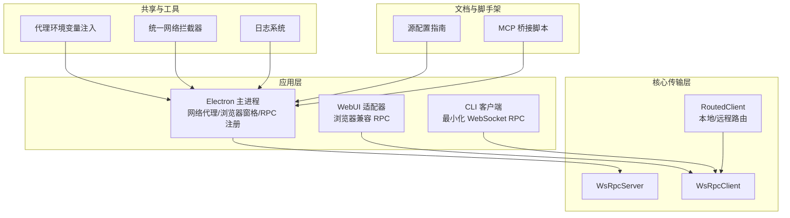
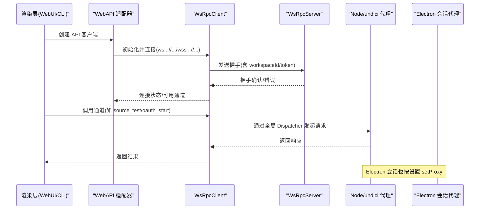
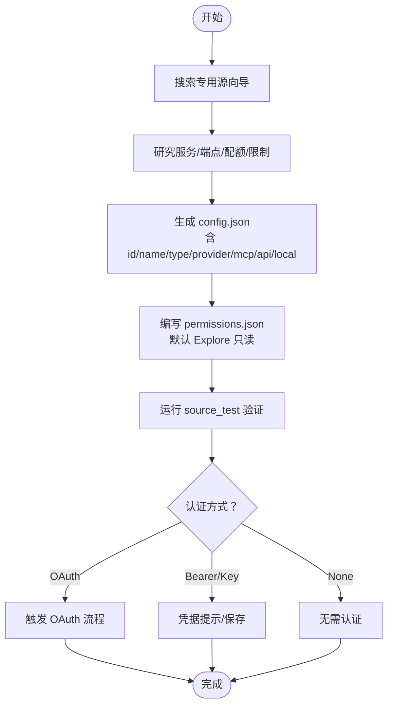
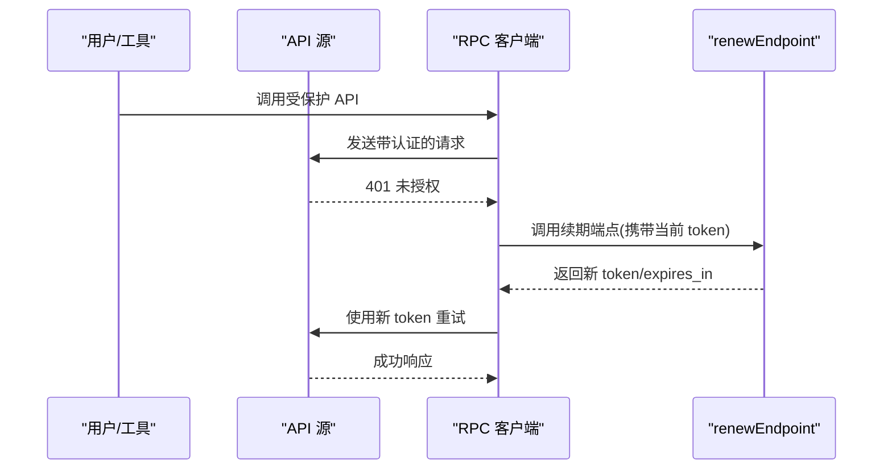
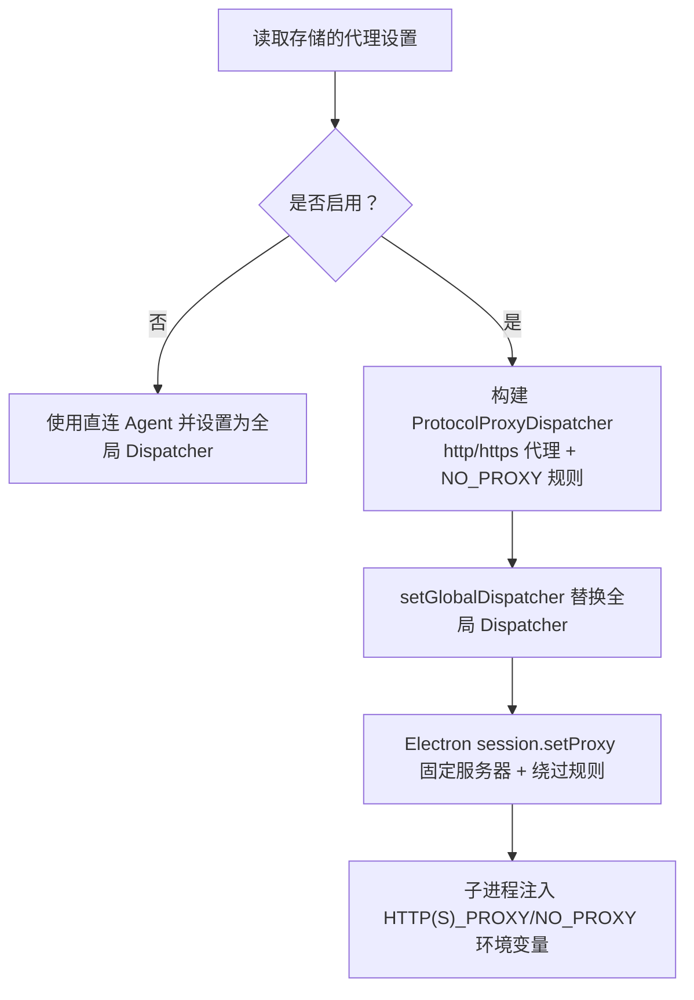
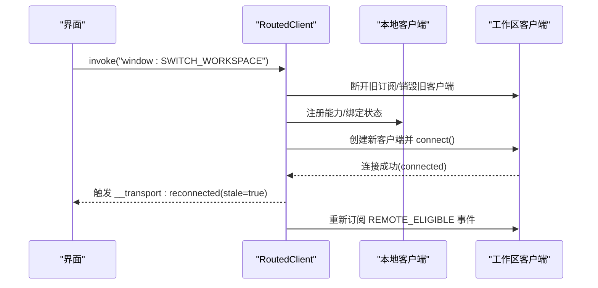
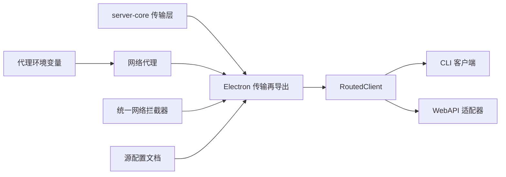

# 源集成系统

<cite>
**本文引用的文件**
- [apps/electron/resources/bridge-mcp-server/index.js](file://apps/electron/resources/bridge-mcp-server/index.js)
- [apps/electron/src/main/network-proxy.ts](file://apps/electron/src/main/network-proxy.ts)
- [apps/electron/src/main/network-proxy-utils.ts](file://apps/electron/src/main/network-proxy-utils.ts)
- [apps/cli/src/client.ts](file://apps/cli/src/client.ts)
- [apps/webui/src/adapter/web-api.ts](file://apps/webui/src/adapter/web-api.ts)
- [apps/electron/src/transport/server.ts](file://apps/electron/src/transport/server.ts)
- [apps/electron/src/transport/client.ts](file://apps/electron/src/transport/client.ts)
- [apps/electron/src/transport/routed-client.ts](file://apps/electron/src/transport/routed-client.ts)
- [apps/electron/src/main/handlers/index.ts](file://apps/electron/src/main/handlers/index.ts)
- [apps/electron/src/main/browser-pane-manager.ts](file://apps/electron/src/main/browser-pane-manager.ts)
- [apps/electron/src/main/logger.ts](file://apps/electron/src/main/logger.ts)
- [apps/electron/resources/docs/sources.md](file://apps/electron/resources/docs/sources.md)
- [packages/server-core/src/transport/index.ts](file://packages/server-core/src/transport/index.ts)
- [packages/shared/src/unified-network-interceptor.ts](file://packages/shared/src/unified-network-interceptor.ts)
- [packages/shared/src/config/proxy-env.ts](file://packages/shared/src/config/proxy-env.ts)
</cite>

## 目录
1. [简介](#简介)
2. [项目结构](#项目结构)
3. [核心组件](#核心组件)
4. [架构总览](#架构总览)
5. [详细组件分析](#详细组件分析)
6. [依赖关系分析](#依赖关系分析)
7. [性能考虑](#性能考虑)
8. [故障排查指南](#故障排查指南)
9. [结论](#结论)
10. [附录](#附录)

## 简介
本技术文档面向需要添加新数据源或扩展现有集成的开发者，系统性阐述源集成系统的以下能力与机制：
- MCP 服务器集成：本地/远程命令行、HTTP/SSE、OAuth/Bearer 认证、自动配置与测试
- REST API 集成：多认证模式（Bearer/Header/Query/Basic/OAuth）、请求体定制、令牌续期
- 文件系统访问：本地目录映射、权限控制与路径校验
- 源发现与自动配置：基于“专用源向导”的引导流程、Explore 模式权限默认开放
- 认证管理策略：OAuth 流程、Bearer/多头/基本认证、令牌刷新与续期
- 网络代理配置：Node/undici 与 Electron 会话双栈代理、NO_PROXY 规则解析
- SSL/TLS 与跨域：浏览器会话 Cookie 自动携带、WebSocket 升级时的认证传递
- 性能监控与连接池：连接状态监听、重连触发、工作区切换时的客户端平滑切换
- 故障转移：远程工作区切换时的 make-before-break 订阅迁移
- 自定义源开发指南与第三方服务集成示例
- 安全配置最佳实践

## 项目结构
该系统采用多包/多应用分层组织：
- 应用层：Electron 主进程（网络代理、浏览器窗格、RPC 通道）、WebUI（浏览器兼容适配）
- 核心传输层：统一的 WebSocket RPC 客户端/服务端、路由客户端、通道映射
- 共享与工具：代理环境变量注入、统一网络拦截器、日志与调试开关
- 文档与脚手架：源配置指南、桥接 MCP 服务器脚本

图示来源
- [apps/electron/src/main/network-proxy.ts:1-175](file://apps/electron/src/main/network-proxy.ts#L1-L175)
- [apps/electron/src/transport/server.ts:1-2](file://apps/electron/src/transport/server.ts#L1-L2)
- [apps/electron/src/transport/client.ts:1-18](file://apps/electron/src/transport/client.ts#L1-L18)
- [apps/electron/src/transport/routed-client.ts:1-252](file://apps/electron/src/transport/routed-client.ts#L1-L252)
- [apps/webui/src/adapter/web-api.ts:1-301](file://apps/webui/src/adapter/web-api.ts#L1-L301)
- [apps/cli/src/client.ts:1-240](file://apps/cli/src/client.ts#L1-L240)
- [packages/shared/src/config/proxy-env.ts:1-25](file://packages/shared/src/config/proxy-env.ts#L1-L25)
- [packages/shared/src/unified-network-interceptor.ts:35-70](file://packages/shared/src/unified-network-interceptor.ts#L35-L70)
- [apps/electron/resources/docs/sources.md:1-800](file://apps/electron/resources/docs/sources.md#L1-L800)
- [apps/electron/resources/bridge-mcp-server/index.js:1-800](file://apps/electron/resources/bridge-mcp-server/index.js#L1-L800)

章节来源
- [apps/electron/src/main/network-proxy.ts:1-175](file://apps/electron/src/main/network-proxy.ts#L1-L175)
- [apps/electron/src/transport/server.ts:1-2](file://apps/electron/src/transport/server.ts#L1-L2)
- [apps/electron/src/transport/client.ts:1-18](file://apps/electron/src/transport/client.ts#L1-L18)
- [apps/electron/src/transport/routed-client.ts:1-252](file://apps/electron/src/transport/routed-client.ts#L1-L252)
- [apps/webui/src/adapter/web-api.ts:1-301](file://apps/webui/src/adapter/web-api.ts#L1-L301)
- [apps/cli/src/client.ts:1-240](file://apps/cli/src/client.ts#L1-L240)
- [packages/shared/src/config/proxy-env.ts:1-25](file://packages/shared/src/config/proxy-env.ts#L1-L25)
- [packages/shared/src/unified-network-interceptor.ts:35-70](file://packages/shared/src/unified-network-interceptor.ts#L35-L70)
- [apps/electron/resources/docs/sources.md:1-800](file://apps/electron/resources/docs/sources.md#L1-L800)
- [apps/electron/resources/bridge-mcp-server/index.js:1-800](file://apps/electron/resources/bridge-mcp-server/index.js#L1-L800)

## 核心组件
- 传输与路由
  - WsRpcServer/WsRpcClient：统一的 WebSocket RPC 通道，支持握手、请求/响应、事件推送、连接状态与错误类型
  - RoutedClient：在本地 Electron 内嵌服务与远程工作区之间透明路由，支持工作区切换时的 make-before-break 订阅迁移
- 网络代理
  - Node/undici 层：ProtocolProxyDispatcher 基于协议选择代理或直连，并尊重 NO_PROXY 规则
  - Electron 层：session.setProxy 配置固定服务器代理与绕过规则
- 源配置与认证
  - 源类型：MCP（HTTP/SSE/stdio）、API（REST）、本地文件系统
  - 认证：OAuth、Bearer、Header、Query、Basic、多头、续期端点
  - 权限：Explore 模式默认读权限，可按源扩展
- WebUI 适配
  - 使用相同 CHANNEL_MAP 构建 API，覆盖本地方法（如打开 URL、文件对话框）为浏览器等价实现
- 日志与调试
  - 结构化日志、消息网关专用日志、按运行时决定输出级别

章节来源
- [packages/server-core/src/transport/index.ts:1-7](file://packages/server-core/src/transport/index.ts#L1-L7)
- [apps/electron/src/transport/routed-client.ts:1-252](file://apps/electron/src/transport/routed-client.ts#L1-L252)
- [apps/electron/src/main/network-proxy.ts:1-175](file://apps/electron/src/main/network-proxy.ts#L1-L175)
- [apps/electron/resources/docs/sources.md:1-800](file://apps/electron/resources/docs/sources.md#L1-L800)
- [apps/webui/src/adapter/web-api.ts:1-301](file://apps/webui/src/adapter/web-api.ts#L1-L301)
- [apps/electron/src/main/logger.ts:1-218](file://apps/electron/src/main/logger.ts#L1-L218)

## 架构总览
系统通过统一的 RPC 通道连接各组件，主进程负责网络代理与浏览器窗格，渲染层通过 WebAPI 或 CLI 客户端接入；源配置由文档化的向导驱动，认证与权限在源层面集中管理。

图示来源
- [apps/webui/src/adapter/web-api.ts:66-85](file://apps/webui/src/adapter/web-api.ts#L66-L85)
- [apps/cli/src/client.ts:61-129](file://apps/cli/src/client.ts#L61-L129)
- [apps/electron/src/transport/server.ts:1-2](file://apps/electron/src/transport/server.ts#L1-L2)
- [apps/electron/src/transport/client.ts:1-18](file://apps/electron/src/transport/client.ts#L1-L18)
- [apps/electron/src/main/network-proxy.ts:81-104](file://apps/electron/src/main/network-proxy.ts#L81-L104)

## 详细组件分析

### MCP 服务器集成
- 支持类型
  - HTTP/SSE 工具服务器（推荐 OAuth/Bearer）
  - 本地命令行(stdio)：npx/命令+参数+环境变量
- 认证与测试
  - OAuth：通用 OAuth 或特定提供商(OAuth 触发器)
  - Bearer：Authorization 头
  - 测试：source_test 工具验证配置、图标下载、连接性与自动启用
- 源向导与最佳实践
  - 优先搜索专用向导，按“Setup Hints”执行
  - Explore 模式默认允许只读操作，避免误授权
- 桥接脚本
  - 提供 MCP 桥接入口，便于本地/外部 MCP 服务接入

图示来源
- [apps/electron/resources/docs/sources.md:13-164](file://apps/electron/resources/docs/sources.md#L13-L164)
- [apps/electron/resources/bridge-mcp-server/index.js:1-800](file://apps/electron/resources/bridge-mcp-server/index.js#L1-L800)

章节来源
- [apps/electron/resources/docs/sources.md:304-400](file://apps/electron/resources/docs/sources.md#L304-L400)
- [apps/electron/resources/docs/sources.md:400-580](file://apps/electron/resources/docs/sources.md#L400-L580)
- [apps/electron/resources/docs/sources.md:580-686](file://apps/electron/resources/docs/sources.md#L580-L686)
- [apps/electron/resources/bridge-mcp-server/index.js:1-800](file://apps/electron/resources/bridge-mcp-server/index.js#L1-L800)

### REST API 集成
- 认证模式
  - Bearer/Header/Query/Basic/OAuth（含 RFC 9728 自动发现与显式配置）
  - 多头认证：headerNames 数组，分别输入并合并到请求头
  - 基本认证可选密码（passwordRequired:false）
- 请求定制
  - 默认将 params JSON 序列化；如需非 JSON 请求体，使用 _rawBody/_contentType
- 测试与续期
  - 必须配置 testEndpoint 以验证凭据
  - renewEndpoint 支持非 OAuth 的自定义令牌续期（可替换 {{token}}）
- 示例
  - Datadog 多头、GitHub/Linear 显式 OAuth、Jira/Amplitude 基本认证等

图示来源
- [apps/electron/resources/docs/sources.md:400-686](file://apps/electron/resources/docs/sources.md#L400-L686)

章节来源
- [apps/electron/resources/docs/sources.md:400-686](file://apps/electron/resources/docs/sources.md#L400-L686)

### 文件系统访问
- 类型：local.path 指定目录
- 权限：Explore 模式默认允许只读命令集合（ls/cat/head/tail/grep/find/tree）
- 测试：source_test 校验路径存在与可访问
- 路径校验：主进程侧使用工作区允许目录进行安全约束

章节来源
- [apps/electron/resources/docs/sources.md:688-774](file://apps/electron/resources/docs/sources.md#L688-L774)
- [apps/electron/src/main/browser-pane-manager.ts:1-800](file://apps/electron/src/main/browser-pane-manager.ts#L1-L800)

### 认证管理策略
- OAuth
  - 通用 OAuth：自动发现或显式授权/令牌端点
  - 特定提供商：Google/Slack/Microsoft 专用触发器
- Bearer/多头/基本
  - 凭据提示工具按模式弹窗收集并存储
- 令牌续期
  - 非 OAuth 的 renewEndpoint 自动刷新
- 会话 Cookie
  - WebUI 通过浏览器会话 Cookie 在 WebSocket 升级时自动携带，无需手动 token

章节来源
- [apps/webui/src/adapter/web-api.ts:76-77](file://apps/webui/src/adapter/web-api.ts#L76-L77)
- [apps/electron/resources/docs/sources.md:527-581](file://apps/electron/resources/docs/sources.md#L527-L581)
- [apps/electron/resources/docs/sources.md:633-686](file://apps/electron/resources/docs/sources.md#L633-L686)

### 网络代理配置与 NO_PROXY 解析
- Node/undici
  - ProtocolProxyDispatcher：根据协议选择 httpProxy/httpsProxy 或直连；匹配 NO_PROXY 规则绕过
- Electron
  - session.setProxy：固定服务器代理与绕过规则
- 环境变量注入
  - 将存储的代理设置转换为 HTTPS_PROXY/HTTP_PROXY/NO_PROXY 等环境变量，供子进程使用
- 统一拦截器
  - 从环境变量读取代理与 NO_PROXY，用于 fetch 等场景

图示来源
- [apps/electron/src/main/network-proxy.ts:81-104](file://apps/electron/src/main/network-proxy.ts#L81-L104)
- [apps/electron/src/main/network-proxy.ts:110-123](file://apps/electron/src/main/network-proxy.ts#L110-L123)
- [apps/electron/src/main/network-proxy-utils.ts:32-73](file://apps/electron/src/main/network-proxy-utils.ts#L32-L73)
- [packages/shared/src/config/proxy-env.ts:1-25](file://packages/shared/src/config/proxy-env.ts#L1-L25)
- [packages/shared/src/unified-network-interceptor.ts:35-70](file://packages/shared/src/unified-network-interceptor.ts#L35-L70)

章节来源
- [apps/electron/src/main/network-proxy.ts:1-175](file://apps/electron/src/main/network-proxy.ts#L1-L175)
- [apps/electron/src/main/network-proxy-utils.ts:1-107](file://apps/electron/src/main/network-proxy-utils.ts#L1-L107)
- [packages/shared/src/config/proxy-env.ts:1-25](file://packages/shared/src/config/proxy-env.ts#L1-L25)
- [packages/shared/src/unified-network-interceptor.ts:35-70](file://packages/shared/src/unified-network-interceptor.ts#L35-L70)

### SSL/TLS 与跨域请求管理
- SSL/TLS
  - 通过标准 Node/undici 与 Electron 会话处理，遵循系统证书链
- 跨域与 Cookie
  - 浏览器会话 Cookie 在 WebSocket 升级时自动发送，简化跨域认证
- CORS
  - API 源的跨域行为由目标服务端 CORS 策略决定；系统不强制注入额外头

章节来源
- [apps/webui/src/adapter/web-api.ts:7-9](file://apps/webui/src/adapter/web-api.ts#L7-L9)
- [apps/electron/src/main/network-proxy.ts:1-175](file://apps/electron/src/main/network-proxy.ts#L1-L175)

### 性能监控与连接池管理
- 连接状态
  - RoutedClient 暴露 getConnectionState/onConnectionStateChanged，支持重连触发
- 工作区切换
  - make-before-break 订阅迁移，确保无断点切换
- 连接池
  - 通过全局 Dispatcher/Agent 管理底层连接复用与超时

图示来源
- [apps/electron/src/transport/routed-client.ts:184-240](file://apps/electron/src/transport/routed-client.ts#L184-L240)

章节来源
- [apps/electron/src/transport/routed-client.ts:1-252](file://apps/electron/src/transport/routed-client.ts#L1-L252)

### 故障转移机制
- 远程工作区切换
  - 当返回 remoteServer 时，建立新客户端并立即 connect，随后迁移订阅与能力
  - 切换完成后发出“stale reconnect”，触发界面刷新逻辑
- 本地回切
  - 清除映射并回退到本地客户端

章节来源
- [apps/electron/src/transport/routed-client.ts:184-240](file://apps/electron/src/transport/routed-client.ts#L184-L240)

### 自定义源开发指南
- 步骤
  - 搜索专用向导 → 研究 → 生成 config.json → 编写 permissions.json → source_test → 触发认证
- 最佳实践
  - 优先使用 OAuth；为公共 API 提供 testEndpoint；合理设置 renewEndpoint
  - Explore 模式默认只读，仅在必要时放行写操作
- 示例
  - Datadog 多头、GitHub/Linear 显式 OAuth、Jira/Amplitude 基本认证

章节来源
- [apps/electron/resources/docs/sources.md:13-164](file://apps/electron/resources/docs/sources.md#L13-L164)
- [apps/electron/resources/docs/sources.md:400-686](file://apps/electron/resources/docs/sources.md#L400-L686)

### 第三方服务集成示例
- MCP：Airbnb/Brave Search 等 stdio 本地命令行
- API：Exa/Datadog/OpenAI/Jira/GitHub 等
- 本地：Obsidian 等本地目录

章节来源
- [apps/electron/resources/docs/sources.md:351-398](file://apps/electron/resources/docs/sources.md#L351-L398)
- [apps/electron/resources/docs/sources.md:420-520](file://apps/electron/resources/docs/sources.md#L420-L520)
- [apps/electron/resources/docs/sources.md:688-700](file://apps/electron/resources/docs/sources.md#L688-L700)

### 安全配置最佳实践
- 代理
  - 启用代理时务必配置 NO_PROXY，避免内部域名被错误代理
  - 子进程通过环境变量继承代理设置
- 认证
  - 优先 OAuth；Bearer 使用强密钥；多头认证分别输入并安全存储
  - 为非 OAuth API 配置 renewEndpoint，减少人工续期
- 权限
  - Explore 模式默认只读；仅在源内扩展允许的模式，避免越权
- 日志
  - 生产关闭文件/控制台日志；调试模式下保留结构化日志

章节来源
- [apps/electron/src/main/network-proxy-utils.ts:32-73](file://apps/electron/src/main/network-proxy-utils.ts#L32-L73)
- [packages/shared/src/config/proxy-env.ts:1-25](file://packages/shared/src/config/proxy-env.ts#L1-L25)
- [apps/electron/resources/docs/sources.md:90-132](file://apps/electron/resources/docs/sources.md#L90-L132)
- [apps/electron/src/main/logger.ts:36-68](file://apps/electron/src/main/logger.ts#L36-L68)

## 依赖关系分析
- 传输层
  - server-core 导出 WsRpcServer/WsRpcClient，Electron 仅做再导出与平台适配
- 代理与网络
  - 主进程使用 undici 与 Electron 会话双栈；共享层提供环境变量与拦截器
- 源与认证
  - 源配置文档驱动；认证工具与权限规则集中管理

图示来源
- [packages/server-core/src/transport/index.ts:1-7](file://packages/server-core/src/transport/index.ts#L1-L7)
- [apps/electron/src/transport/client.ts:1-18](file://apps/electron/src/transport/client.ts#L1-L18)
- [apps/electron/src/transport/routed-client.ts:1-252](file://apps/electron/src/transport/routed-client.ts#L1-L252)
- [apps/cli/src/client.ts:1-240](file://apps/cli/src/client.ts#L1-L240)
- [apps/webui/src/adapter/web-api.ts:1-301](file://apps/webui/src/adapter/web-api.ts#L1-L301)
- [apps/electron/src/main/network-proxy.ts:1-175](file://apps/electron/src/main/network-proxy.ts#L1-L175)
- [packages/shared/src/config/proxy-env.ts:1-25](file://packages/shared/src/config/proxy-env.ts#L1-L25)
- [packages/shared/src/unified-network-interceptor.ts:35-70](file://packages/shared/src/unified-network-interceptor.ts#L35-L70)
- [apps/electron/resources/docs/sources.md:1-800](file://apps/electron/resources/docs/sources.md#L1-L800)

章节来源
- [packages/server-core/src/transport/index.ts:1-7](file://packages/server-core/src/transport/index.ts#L1-L7)
- [apps/electron/src/transport/client.ts:1-18](file://apps/electron/src/transport/client.ts#L1-L18)
- [apps/electron/src/transport/routed-client.ts:1-252](file://apps/electron/src/transport/routed-client.ts#L1-L252)
- [apps/cli/src/client.ts:1-240](file://apps/cli/src/client.ts#L1-L240)
- [apps/webui/src/adapter/web-api.ts:1-301](file://apps/webui/src/adapter/web-api.ts#L1-L301)
- [apps/electron/src/main/network-proxy.ts:1-175](file://apps/electron/src/main/network-proxy.ts#L1-L175)
- [packages/shared/src/config/proxy-env.ts:1-25](file://packages/shared/src/config/proxy-env.ts#L1-L25)
- [packages/shared/src/unified-network-interceptor.ts:35-70](file://packages/shared/src/unified-network-interceptor.ts#L35-L70)
- [apps/electron/resources/docs/sources.md:1-800](file://apps/electron/resources/docs/sources.md#L1-L800)

## 性能考虑
- 连接复用
  - 通过全局 Dispatcher/Agent 管理底层连接，减少握手开销
- 订阅迁移
  - make-before-break 确保远程工作区切换时无断点
- 日志级别
  - 生产关闭文件/控制台日志，降低 I/O 影响
- 代理绕过
  - 正确配置 NO_PROXY，避免不必要的代理链路延迟

## 故障排查指南
- 代理相关
  - 检查代理设置与 NO_PROXY 规则；确认 Electron 会话已 setProxy
  - 查看统一拦截器对代理/NO_PROXY 的解析
- 认证失败
  - 使用 source_test 验证配置与连接；检查 OAuth 授权回调与令牌续期
- 连接问题
  - 通过 getConnectionState/onConnectionStateChanged 监控状态
  - 触发 reconnectNow 重连；查看日志定位错误
- 日志定位
  - 主进程日志、消息网关专用日志；按作用域过滤

章节来源
- [apps/electron/src/main/network-proxy.ts:152-175](file://apps/electron/src/main/network-proxy.ts#L152-L175)
- [apps/electron/src/main/network-proxy-utils.ts:81-107](file://apps/electron/src/main/network-proxy-utils.ts#L81-L107)
- [apps/electron/src/transport/routed-client.ts:166-178](file://apps/electron/src/transport/routed-client.ts#L166-L178)
- [apps/electron/src/main/logger.ts:141-218](file://apps/electron/src/main/logger.ts#L141-L218)

## 结论
该源集成系统以统一的 RPC 通道为核心，结合完善的代理、认证与权限体系，提供了 MCP、REST API 与本地文件系统的一站式集成方案。通过专用向导与自动化测试，显著降低了源配置门槛；通过工作区路由与故障转移，保障了复杂场景下的稳定性与连续性。建议在生产中严格遵循代理与认证最佳实践，并充分利用 Explore 模式的只读默认策略，确保安全与合规。

## 附录
- 关键流程参考
  - 源测试与认证触发：[apps/electron/resources/docs/sources.md:142-164](file://apps/electron/resources/docs/sources.md#L142-L164)
  - 代理应用与更新：[apps/electron/src/main/network-proxy.ts:152-175](file://apps/electron/src/main/network-proxy.ts#L152-L175)
  - 连接状态与重连：[apps/electron/src/transport/routed-client.ts:166-178](file://apps/electron/src/transport/routed-client.ts#L166-L178)
  - WebUI 认证传递：[apps/webui/src/adapter/web-api.ts:7-9](file://apps/webui/src/adapter/web-api.ts#L7-L9)