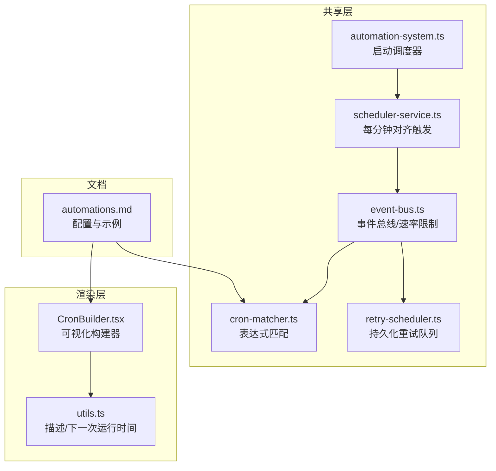
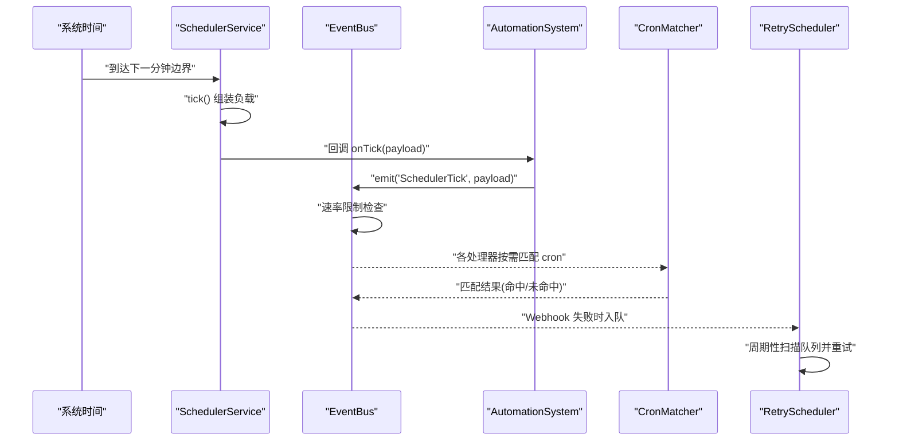
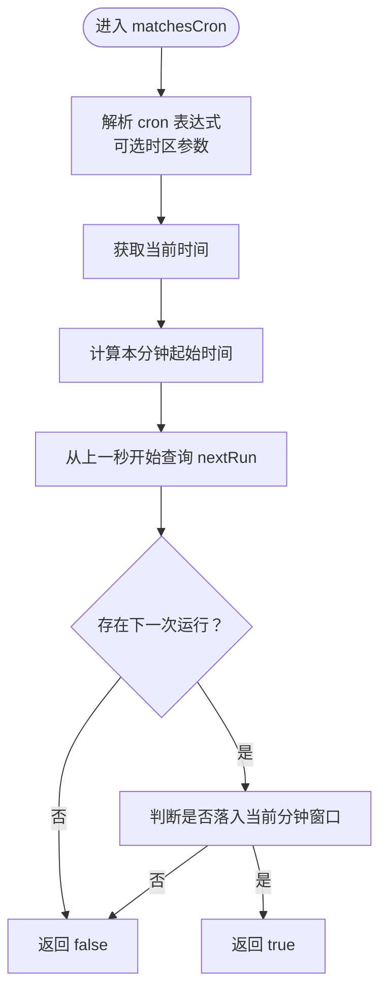
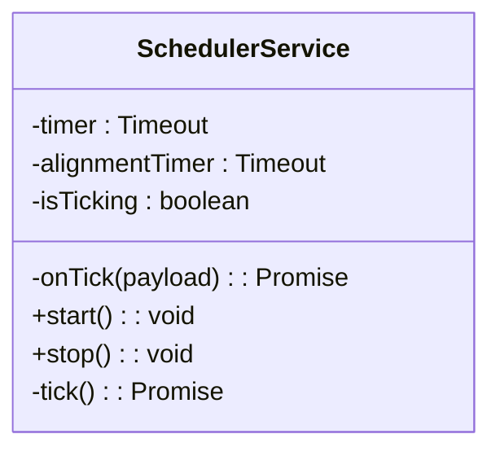
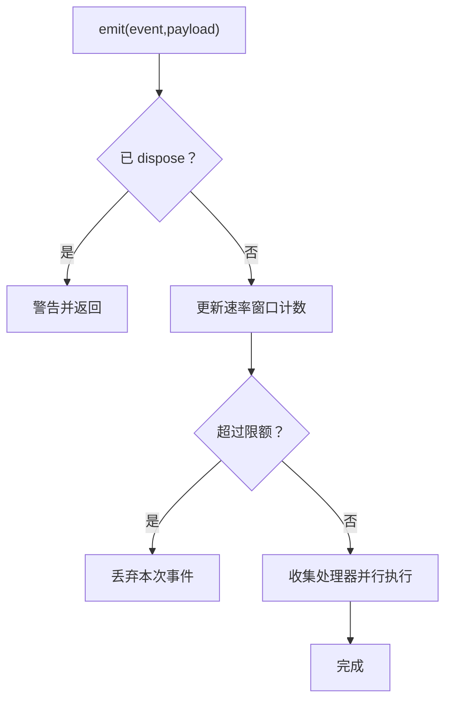
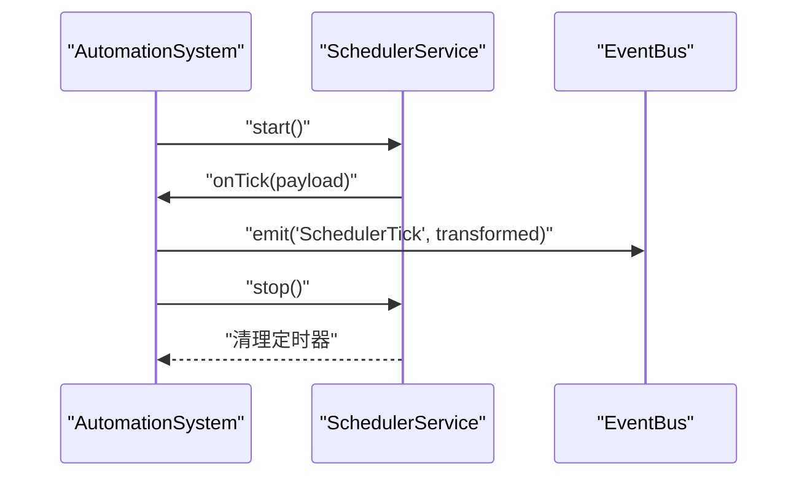
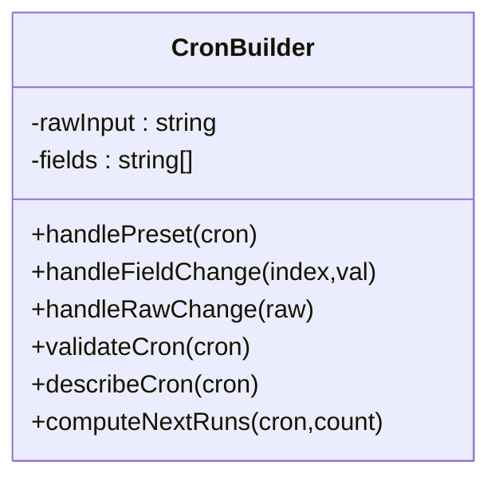
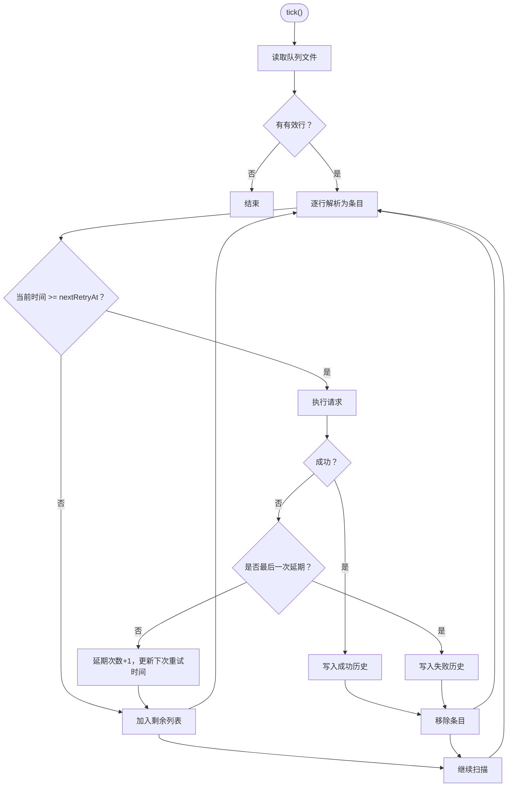
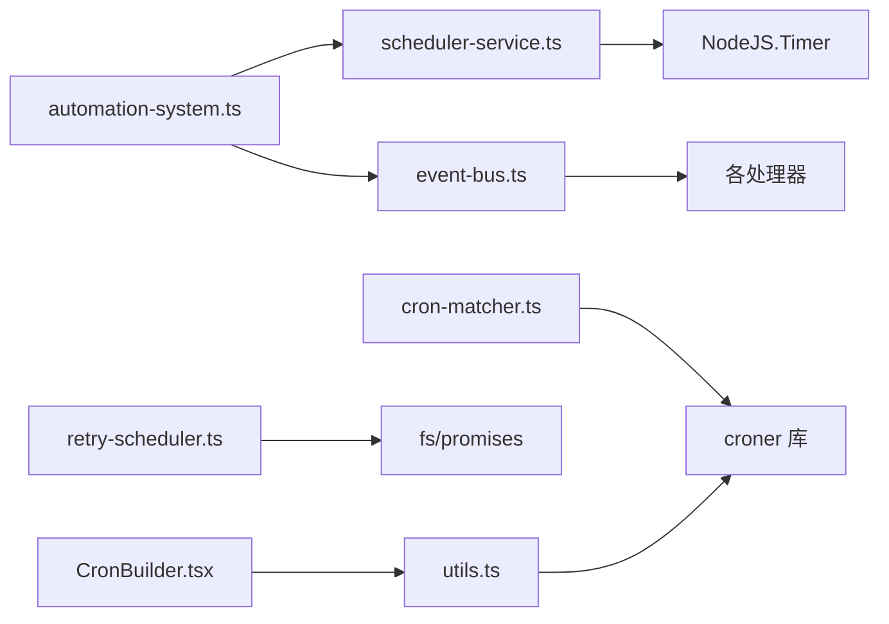

# Cron 调度

<cite>
**本文引用的文件**
- [packages/shared/src/automations/cron-matcher.ts](file://packages/shared/src/automations/cron-matcher.ts)
- [packages/shared/src/automations/cron-matcher.test.ts](file://packages/shared/src/automations/cron-matcher.test.ts)
- [packages/shared/src/scheduler/scheduler-service.ts](file://packages/shared/src/scheduler/scheduler-service.ts)
- [packages/shared/src/automations/automation-system.ts](file://packages/shared/src/automations/automation-system.ts)
- [packages/shared/src/automations/event-bus.ts](file://packages/shared/src/automations/event-bus.ts)
- [packages/shared/src/automations/retry-scheduler.ts](file://packages/shared/src/automations/retry-scheduler.ts)
- [apps/electron/src/renderer/components/automations/CronBuilder.tsx](file://apps/electron/src/renderer/components/automations/CronBuilder.tsx)
- [apps/electron/src/renderer/components/automations/utils.ts](file://apps/electron/src/renderer/components/automations/utils.ts)
- [apps/electron/resources/docs/automations.md](file://apps/electron/resources/docs/automations.md)
</cite>

## 目录
1. [简介](#简介)
2. [项目结构](#项目结构)
3. [核心组件](#核心组件)
4. [架构总览](#架构总览)
5. [详细组件分析](#详细组件分析)
6. [依赖关系分析](#依赖关系分析)
7. [性能考量](#性能考量)
8. [故障排查指南](#故障排查指南)
9. [结论](#结论)
10. [附录](#附录)

## 简介
本技术文档聚焦于仓库中的 Cron 调度系统，涵盖 Cron 表达式解析与匹配、调度器实现原理、重试调度器设计、调度精度与性能优化、内存管理最佳实践、调试与可视化工具、复杂场景解决方案以及监控与故障排除方法。读者可据此理解从“每分钟触发”的调度事件到“基于 Cron 的条件匹配”再到“失败重试队列”的完整链路。

## 项目结构
围绕 Cron 调度的关键模块分布如下：
- 核心匹配与调度
  - Cron 表达式匹配：packages/shared/src/automations/cron-matcher.ts
  - 定时调度服务：packages/shared/src/scheduler/scheduler-service.ts
  - 自动化系统集成：packages/shared/src/automations/automation-system.ts
  - 事件总线与速率限制：packages/shared/src/automations/event-bus.ts
  - 失败重试调度器：packages/shared/src/automations/retry-scheduler.ts
- 可视化与调试
  - Cron 构建器（UI）：apps/electron/src/renderer/components/automations/CronBuilder.tsx
  - Cron 工具函数（描述/预览）：apps/electron/src/renderer/components/automations/utils.ts
  - 配置与使用文档：apps/electron/resources/docs/automations.md

**图表来源**
- [packages/shared/src/automations/cron-matcher.ts:1-58](file://packages/shared/src/automations/cron-matcher.ts#L1-L58)
- [packages/shared/src/scheduler/scheduler-service.ts:1-89](file://packages/shared/src/scheduler/scheduler-service.ts#L1-L89)
- [packages/shared/src/automations/automation-system.ts:289-314](file://packages/shared/src/automations/automation-system.ts#L289-L314)
- [packages/shared/src/automations/event-bus.ts:120-319](file://packages/shared/src/automations/event-bus.ts#L120-L319)
- [packages/shared/src/automations/retry-scheduler.ts:1-247](file://packages/shared/src/automations/retry-scheduler.ts#L1-L247)
- [apps/electron/src/renderer/components/automations/CronBuilder.tsx:1-287](file://apps/electron/src/renderer/components/automations/CronBuilder.tsx#L1-L287)
- [apps/electron/src/renderer/components/automations/utils.ts:1-64](file://apps/electron/src/renderer/components/automations/utils.ts#L1-L64)
- [apps/electron/resources/docs/automations.md:1-800](file://apps/electron/resources/docs/automations.md#L1-L800)

**章节来源**
- [packages/shared/src/automations/cron-matcher.ts:1-58](file://packages/shared/src/automations/cron-matcher.ts#L1-L58)
- [packages/shared/src/scheduler/scheduler-service.ts:1-89](file://packages/shared/src/scheduler/scheduler-service.ts#L1-L89)
- [packages/shared/src/automations/automation-system.ts:289-314](file://packages/shared/src/automations/automation-system.ts#L289-L314)
- [packages/shared/src/automations/event-bus.ts:120-319](file://packages/shared/src/automations/event-bus.ts#L120-L319)
- [packages/shared/src/automations/retry-scheduler.ts:1-247](file://packages/shared/src/automations/retry-scheduler.ts#L1-L247)
- [apps/electron/src/renderer/components/automations/CronBuilder.tsx:1-287](file://apps/electron/src/renderer/components/automations/CronBuilder.tsx#L1-L287)
- [apps/electron/src/renderer/components/automations/utils.ts:1-64](file://apps/electron/src/renderer/components/automations/utils.ts#L1-L64)
- [apps/electron/resources/docs/automations.md:1-800](file://apps/electron/resources/docs/automations.md#L1-L800)

## 核心组件
- Cron 表达式匹配器：基于第三方库进行表达式解析，并在当前分钟窗口内判断是否命中。
- 每分钟调度器：对齐至分钟边界，稳定地发出 SchedulerTick 事件。
- 事件总线：统一派发事件，内置速率限制，避免事件风暴。
- 自动化系统：负责启动/停止调度器并将调度事件注入事件总线。
- 可视化 Cron 构建器：提供常见预设、字段编辑与表达式校验，展示人类可读描述与下一次运行时间。
- 失败重试调度器：针对 Webhook 失败，采用固定延迟序列持久化重试，支持跨进程重启恢复。

**章节来源**
- [packages/shared/src/automations/cron-matcher.ts:13-57](file://packages/shared/src/automations/cron-matcher.ts#L13-L57)
- [packages/shared/src/scheduler/scheduler-service.ts:23-88](file://packages/shared/src/scheduler/scheduler-service.ts#L23-L88)
- [packages/shared/src/automations/event-bus.ts:120-319](file://packages/shared/src/automations/event-bus.ts#L120-L319)
- [packages/shared/src/automations/automation-system.ts:289-314](file://packages/shared/src/automations/automation-system.ts#L289-L314)
- [apps/electron/src/renderer/components/automations/CronBuilder.tsx:1-287](file://apps/electron/src/renderer/components/automations/CronBuilder.tsx#L1-L287)
- [packages/shared/src/automations/retry-scheduler.ts:1-247](file://packages/shared/src/automations/retry-scheduler.ts#L1-L247)

## 架构总览
Cron 调度系统以“每分钟触发 + 条件匹配 + 事件总线 + 可视化构建 + 失败重试”为主线，形成闭环：

**图表来源**
- [packages/shared/src/scheduler/scheduler-service.ts:58-87](file://packages/shared/src/scheduler/scheduler-service.ts#L58-L87)
- [packages/shared/src/automations/automation-system.ts:292-299](file://packages/shared/src/automations/automation-system.ts#L292-L299)
- [packages/shared/src/automations/event-bus.ts:178-229](file://packages/shared/src/automations/event-bus.ts#L178-L229)
- [packages/shared/src/automations/cron-matcher.ts:25-57](file://packages/shared/src/automations/cron-matcher.ts#L25-L57)
- [packages/shared/src/automations/retry-scheduler.ts:103-123](file://packages/shared/src/automations/retry-scheduler.ts#L103-L123)

## 详细组件分析

### Cron 表达式解析与匹配
- 支持标准 5 字段格式：分钟、小时、月内日、月份、周内日（周日=0）
- 支持扩展语法：步进（如 */5）、范围（如 1-5）、枚举（如 1,3,5）
- 时区处理：通过传入 IANA 时区名，转换到目标时区后进行匹配
- 匹配策略：在当前分钟起始前 1 秒开始查询下一次运行时间，若落在当前分钟窗口则命中
- 错误处理：捕获异常并返回不匹配，同时记录错误日志

**图表来源**
- [packages/shared/src/automations/cron-matcher.ts:25-57](file://packages/shared/src/automations/cron-matcher.ts#L25-L57)

**章节来源**
- [packages/shared/src/automations/cron-matcher.ts:13-57](file://packages/shared/src/automations/cron-matcher.ts#L13-L57)
- [packages/shared/src/automations/cron-matcher.test.ts:1-98](file://packages/shared/src/automations/cron-matcher.test.ts#L1-L98)

### 调度器实现原理
- 对齐策略：计算到下一分钟边界剩余毫秒数，先触发一次再以 60 秒间隔循环
- 并发控制：内部状态标记防止上一次 tick 尚未完成时重复触发
- 负载封装：生成包含 UTC 时间戳、本地时间、星期等信息的负载
- 生命周期：提供 start/stop，确保资源释放

**图表来源**
- [packages/shared/src/scheduler/scheduler-service.ts:23-88](file://packages/shared/src/scheduler/scheduler-service.ts#L23-L88)

**章节来源**
- [packages/shared/src/scheduler/scheduler-service.ts:33-87](file://packages/shared/src/scheduler/scheduler-service.ts#L33-L87)

### 事件总线与速率限制
- 速率限制：SchedulerTick 事件默认每分钟上限 60 次；其他事件默认每分钟 10 次
- 并行执行：事件处理器并行调用，异常被捕获并记录，不影响其他处理器
- 资源清理：dispose 后禁止继续发射，清理所有处理器与计数

**图表来源**
- [packages/shared/src/automations/event-bus.ts:178-229](file://packages/shared/src/automations/event-bus.ts#L178-L229)

**章节来源**
- [packages/shared/src/automations/event-bus.ts:120-319](file://packages/shared/src/automations/event-bus.ts#L120-L319)

### 自动化系统与调度集成
- 启动流程：创建 SchedulerService 实例并注册 onTick 回调，将负载转换为事件总线事件
- 停止流程：停止调度器并置空引用，避免悬挂定时器

**图表来源**
- [packages/shared/src/automations/automation-system.ts:289-314](file://packages/shared/src/automations/automation-system.ts#L289-L314)
- [packages/shared/src/scheduler/scheduler-service.ts:29-31](file://packages/shared/src/scheduler/scheduler-service.ts#L29-L31)
- [packages/shared/src/scheduler/scheduler-service.ts:40-44](file://packages/shared/src/scheduler/scheduler-service.ts#L40-L44)

**章节来源**
- [packages/shared/src/automations/automation-system.ts:289-314](file://packages/shared/src/automations/automation-system.ts#L289-L314)

### 可视化 Cron 构建器与调试工具
- 三层交互：
  - 预设按钮：快速选择常用周期
  - 可视化字段：分别编辑 5 个字段
  - 高级输入：直接编辑原始表达式
- 校验与提示：基本语法校验，错误时高亮输入框
- 描述与预览：将表达式转为人类可读描述，并列出未来若干次运行时间
- 时区显示：展示当前选择的时区或系统默认

**图表来源**
- [apps/electron/src/renderer/components/automations/CronBuilder.tsx:128-174](file://apps/electron/src/renderer/components/automations/CronBuilder.tsx#L128-L174)
- [apps/electron/src/renderer/components/automations/utils.ts:30-63](file://apps/electron/src/renderer/components/automations/utils.ts#L30-L63)

**章节来源**
- [apps/electron/src/renderer/components/automations/CronBuilder.tsx:1-287](file://apps/electron/src/renderer/components/automations/CronBuilder.tsx#L1-L287)
- [apps/electron/src/renderer/components/automations/utils.ts:1-64](file://apps/electron/src/renderer/components/automations/utils.ts#L1-L64)

### 重试调度器设计
- 目标：当立即重试（秒级）失败后，将失败条目写入持久化队列文件
- 策略：固定延迟序列（5 分钟、30 分钟、1 小时），最多三次延期尝试
- 扫描周期：每分钟扫描一次队列文件，仅处理到期条目
- 结果处理：成功则记录历史并移除；最终失败也记录历史并移除
- 容错：跳过格式错误行，保持队列文件整洁

**图表来源**
- [packages/shared/src/automations/retry-scheduler.ts:128-245](file://packages/shared/src/automations/retry-scheduler.ts#L128-L245)

**章节来源**
- [packages/shared/src/automations/retry-scheduler.ts:1-247](file://packages/shared/src/automations/retry-scheduler.ts#L1-L247)

## 依赖关系分析
- cron-matcher.ts 依赖第三方库进行表达式解析与下一次运行时间计算
- scheduler-service.ts 依赖 NodeJS 定时器 API
- automation-system.ts 依赖 scheduler-service.ts 并通过事件总线对外派发
- event-bus.ts 提供统一事件通道与速率限制
- retry-scheduler.ts 依赖文件系统进行持久化队列管理
- CronBuilder.tsx 与 utils.ts 依赖第三方库进行表达式解析与运行时间预测

**图表来源**
- [packages/shared/src/automations/cron-matcher.ts:8-8](file://packages/shared/src/automations/cron-matcher.ts#L8-L8)
- [packages/shared/src/scheduler/scheduler-service.ts:24-25](file://packages/shared/src/scheduler/scheduler-service.ts#L24-L25)
- [packages/shared/src/automations/automation-system.ts:292-299](file://packages/shared/src/automations/automation-system.ts#L292-L299)
- [packages/shared/src/automations/event-bus.ts:162-167](file://packages/shared/src/automations/event-bus.ts#L162-L167)
- [packages/shared/src/automations/retry-scheduler.ts:15-19](file://packages/shared/src/automations/retry-scheduler.ts#L15-L19)
- [apps/electron/src/renderer/components/automations/CronBuilder.tsx:17-17](file://apps/electron/src/renderer/components/automations/CronBuilder.tsx#L17-L17)
- [apps/electron/src/renderer/components/automations/utils.ts:8-8](file://apps/electron/src/renderer/components/automations/utils.ts#L8-L8)

**章节来源**
- [packages/shared/src/automations/cron-matcher.ts:8-8](file://packages/shared/src/automations/cron-matcher.ts#L8-L8)
- [packages/shared/src/scheduler/scheduler-service.ts:24-25](file://packages/shared/src/scheduler/scheduler-service.ts#L24-L25)
- [packages/shared/src/automations/automation-system.ts:292-299](file://packages/shared/src/automations/automation-system.ts#L292-L299)
- [packages/shared/src/automations/event-bus.ts:162-167](file://packages/shared/src/automations/event-bus.ts#L162-L167)
- [packages/shared/src/automations/retry-scheduler.ts:15-19](file://packages/shared/src/automations/retry-scheduler.ts#L15-L19)
- [apps/electron/src/renderer/components/automations/CronBuilder.tsx:17-17](file://apps/electron/src/renderer/components/automations/CronBuilder.tsx#L17-L17)
- [apps/electron/src/renderer/components/automations/utils.ts:8-8](file://apps/electron/src/renderer/components/automations/utils.ts#L8-L8)

## 性能考量
- 调度精度
  - 使用“对齐到下一分钟边界”的策略，保证触发点稳定且可预期
  - 在 tick 中仅做轻量负载组装与事件派发，避免阻塞
- 并发与吞吐
  - 事件总线并行执行处理器，提升整体吞吐
  - SchedulerTick 事件速率限制为 60 次/分钟，避免过载
- 内存与 IO
  - Cron 表达式匹配每次新建解析对象，建议复用或缓存热点表达式（在业务侧考虑）
  - 重试队列采用追加写与整文件覆盖，建议定期归档或压缩历史
- 时区与日期
  - 匹配前进行时区转换，避免跨时区导致的误判
  - 计算分钟窗口时精确到秒级，减少边界误差

[本节为通用性能建议，无需特定文件引用]

## 故障排查指南
- Cron 表达式无效
  - 现象：匹配返回 false，控制台输出错误日志
  - 排查：使用 CronBuilder 的校验提示与人类可读描述核对表达式
  - 参考
    - [packages/shared/src/automations/cron-matcher.ts:53-56](file://packages/shared/src/automations/cron-matcher.ts#L53-L56)
    - [packages/shared/src/automations/cron-matcher.test.ts:82-86](file://packages/shared/src/automations/cron-matcher.test.ts#L82-L86)
- 未触发或提前触发
  - 现象：表达式看似正确但未在预期时间触发
  - 排查：确认系统时区设置、夏令时影响；使用 CronBuilder 预览下一次运行时间
  - 参考
    - [apps/electron/src/renderer/components/automations/utils.ts:56-63](file://apps/electron/src/renderer/components/automations/utils.ts#L56-L63)
    - [apps/electron/src/renderer/components/automations/CronBuilder.tsx:252-276](file://apps/electron/src/renderer/components/automations/CronBuilder.tsx#L252-L276)
- 调度器未启动或重复触发
  - 现象：SchedulerTick 不出现或重复
  - 排查：检查 start/stop 生命周期；查看并发控制日志（上一次 tick 仍在运行会跳过）
  - 参考
    - [packages/shared/src/scheduler/scheduler-service.ts:58-62](file://packages/shared/src/scheduler/scheduler-service.ts#L58-L62)
    - [packages/shared/src/scheduler/scheduler-service.ts:40-44](file://packages/shared/src/scheduler/scheduler-service.ts#L40-L44)
- 事件风暴或丢失
  - 现象：处理器过多导致卡顿或被限流丢弃
  - 排查：降低处理器数量或调整速率限制；检查 any-handler 是否过多
  - 参考
    - [packages/shared/src/automations/event-bus.ts:126-132](file://packages/shared/src/automations/event-bus.ts#L126-L132)
    - [packages/shared/src/automations/event-bus.ts:184-199](file://packages/shared/src/automations/event-bus.ts#L184-L199)
- Webhook 失败未重试
  - 现象：立即重试失败后无后续动作
  - 排查：确认重试调度器已启动；检查队列文件是否存在与可写；查看日志中“Enqueued/Failed/永久失败”记录
  - 参考
    - [packages/shared/src/automations/retry-scheduler.ts:80-97](file://packages/shared/src/automations/retry-scheduler.ts#L80-L97)
    - [packages/shared/src/automations/retry-scheduler.ts:128-245](file://packages/shared/src/automations/retry-scheduler.ts#L128-L245)

**章节来源**
- [packages/shared/src/automations/cron-matcher.ts:53-56](file://packages/shared/src/automations/cron-matcher.ts#L53-L56)
- [packages/shared/src/automations/cron-matcher.test.ts:82-86](file://packages/shared/src/automations/cron-matcher.test.ts#L82-L86)
- [apps/electron/src/renderer/components/automations/utils.ts:56-63](file://apps/electron/src/renderer/components/automations/utils.ts#L56-L63)
- [apps/electron/src/renderer/components/automations/CronBuilder.tsx:252-276](file://apps/electron/src/renderer/components/automations/CronBuilder.tsx#L252-L276)
- [packages/shared/src/scheduler/scheduler-service.ts:58-62](file://packages/shared/src/scheduler/scheduler-service.ts#L58-L62)
- [packages/shared/src/scheduler/scheduler-service.ts:40-44](file://packages/shared/src/scheduler/scheduler-service.ts#L40-L44)
- [packages/shared/src/automations/event-bus.ts:126-132](file://packages/shared/src/automations/event-bus.ts#L126-L132)
- [packages/shared/src/automations/event-bus.ts:184-199](file://packages/shared/src/automations/event-bus.ts#L184-L199)
- [packages/shared/src/automations/retry-scheduler.ts:80-97](file://packages/shared/src/automations/retry-scheduler.ts#L80-L97)
- [packages/shared/src/automations/retry-scheduler.ts:128-245](file://packages/shared/src/automations/retry-scheduler.ts#L128-L245)

## 结论
该 Cron 调度系统以“对齐分钟边界 + 条件匹配 + 事件总线 + 可视化构建 + 持久化重试”为核心，具备良好的稳定性与可观测性。通过 CronBuilder 的可视化与预览能力，用户可以高效构建与验证表达式；通过事件总线的速率限制与重试调度器的固定延迟序列，系统在可靠性与性能之间取得平衡。建议在生产环境中结合日志与历史记录进行持续监控，并根据实际负载调整速率限制与处理器策略。

[本节为总结性内容，无需特定文件引用]

## 附录
- 配置与示例参考
  - [apps/electron/resources/docs/automations.md:308-340](file://apps/electron/resources/docs/automations.md#L308-L340)
  - [apps/electron/resources/docs/automations.md:522-573](file://apps/electron/resources/docs/automations.md#L522-L573)
- Cron 语法与示例
  - [apps/electron/resources/docs/automations.md:322-338](file://apps/electron/resources/docs/automations.md#L322-L338)
- UI 与工具
  - [apps/electron/src/renderer/components/automations/CronBuilder.tsx:1-287](file://apps/electron/src/renderer/components/automations/CronBuilder.tsx#L1-L287)
  - [apps/electron/src/renderer/components/automations/utils.ts:27-63](file://apps/electron/src/renderer/components/automations/utils.ts#L27-L63)

**章节来源**
- [apps/electron/resources/docs/automations.md:308-340](file://apps/electron/resources/docs/automations.md#L308-L340)
- [apps/electron/resources/docs/automations.md:522-573](file://apps/electron/resources/docs/automations.md#L522-L573)
- [apps/electron/resources/docs/automations.md:322-338](file://apps/electron/resources/docs/automations.md#L322-L338)
- [apps/electron/src/renderer/components/automations/CronBuilder.tsx:1-287](file://apps/electron/src/renderer/components/automations/CronBuilder.tsx#L1-L287)
- [apps/electron/src/renderer/components/automations/utils.ts:27-63](file://apps/electron/src/renderer/components/automations/utils.ts#L27-L63)