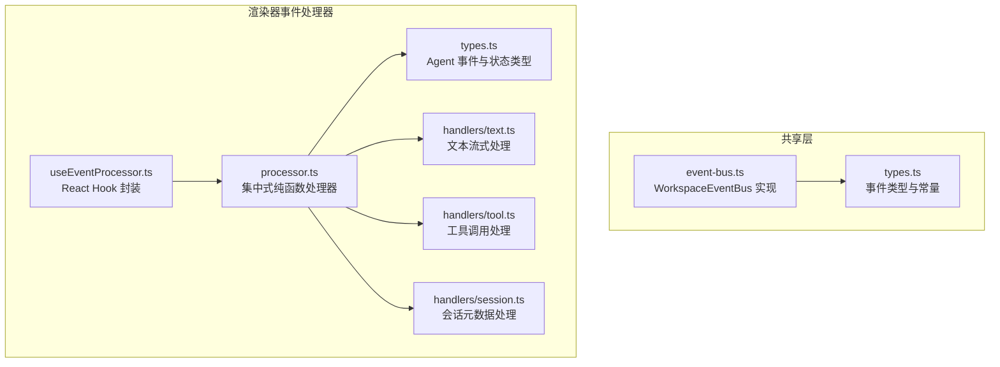
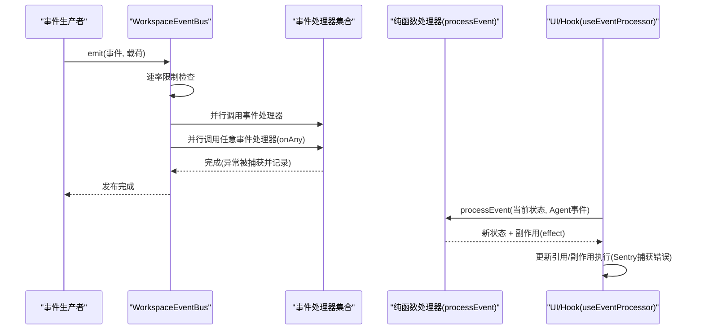
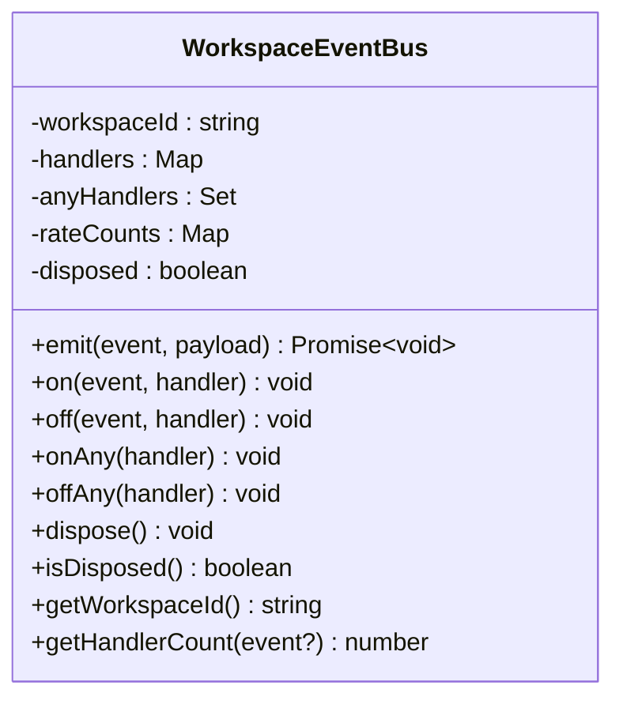
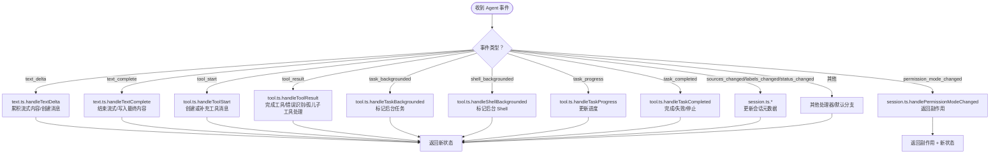
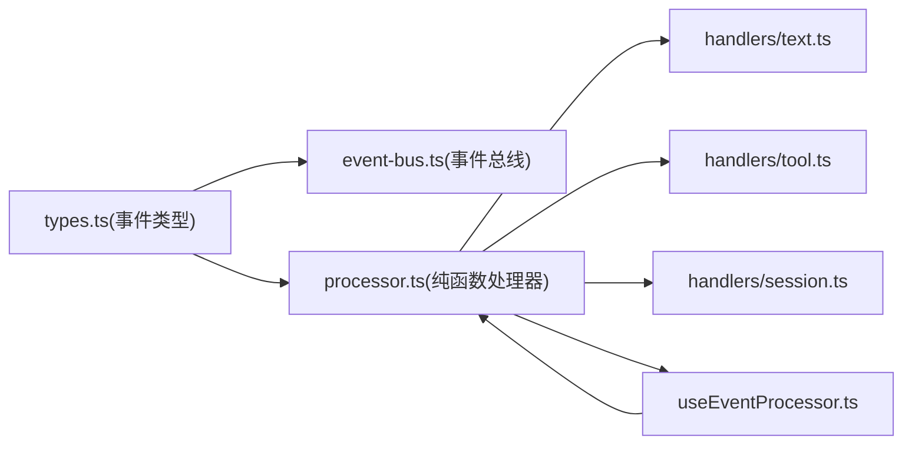

# 事件系统

<cite>
**本文引用的文件**
- [packages/shared/src/automations/event-bus.ts](file://packages/shared/src/automations/event-bus.ts)
- [packages/shared/src/automations/types.ts](file://packages/shared/src/automations/types.ts)
- [apps/electron/src/renderer/event-processor/processor.ts](file://apps/electron/src/renderer/event-processor/processor.ts)
- [apps/electron/src/renderer/event-processor/types.ts](file://apps/electron/src/renderer/event-processor/types.ts)
- [apps/electron/src/renderer/event-processor/index.ts](file://apps/electron/src/renderer/event-processor/index.ts)
- [apps/electron/src/renderer/event-processor/useEventProcessor.ts](file://apps/electron/src/renderer/event-processor/useEventProcessor.ts)
- [apps/electron/src/renderer/event-processor/handlers/text.ts](file://apps/electron/src/renderer/event-processor/handlers/text.ts)
- [apps/electron/src/renderer/event-processor/handlers/tool.ts](file://apps/electron/src/renderer/event-processor/handlers/tool.ts)
- [apps/electron/src/renderer/event-processor/handlers/session.ts](file://apps/electron/src/renderer/event-processor/handlers/session.ts)
- [packages/shared/src/automations/event-bus.test.ts](file://packages/shared/src/automations/event-bus.test.ts)
</cite>

## 目录
1. [简介](#简介)
2. [项目结构](#项目结构)
3. [核心组件](#核心组件)
4. [架构总览](#架构总览)
5. [详细组件分析](#详细组件分析)
6. [依赖关系分析](#依赖关系分析)
7. [性能考量](#性能考量)
8. [故障排除指南](#故障排除指南)
9. [结论](#结论)
10. [附录](#附录)

## 简介
本文件系统性阐述事件驱动架构在本项目中的设计与实现，重点覆盖以下方面：
- 事件类型定义：区分应用事件（APP_EVENTS）与代理事件（AGENT_EVENTS），明确事件负载结构与映射关系。
- 事件传播机制：基于 WorkspaceEventBus 的订阅/发布模型，支持任意事件处理器与速率限制，确保事件安全、有序传播。
- 事件处理器体系：集中式纯函数处理器（processor.ts）与按功能拆分的子处理器（text.ts、tool.ts、session.ts），统一处理会话状态变更、文本流式渲染、工具调用与后台任务等。
- 生命周期与内存保护：通过 bus 的销毁与计数接口、处理器的纯函数特性与 React Hook 的引用管理，避免内存泄漏与竞态。
- 性能优化与调试：速率限制策略、并行执行与错误隔离、日志与 Sentry 集成，以及测试与可观测性实践。

## 项目结构
事件系统主要分布在共享包与 Electron 渲染器两部分：
- 共享包（packages/shared）：定义事件类型、事件总线与速率限制策略，提供跨进程/模块复用的事件基础设施。
- 渲染器（apps/electron/renderer/event-processor）：定义 Agent 事件类型与会话状态，提供纯函数处理器与 Hook，负责 UI 层面的状态更新与副作用处理。

图表来源
- [packages/shared/src/automations/event-bus.ts:162-320](file://packages/shared/src/automations/event-bus.ts#L162-L320)
- [packages/shared/src/automations/types.ts:14-51](file://packages/shared/src/automations/types.ts#L14-L51)
- [apps/electron/src/renderer/event-processor/processor.ts:62-229](file://apps/electron/src/renderer/event-processor/processor.ts#L62-L229)
- [apps/electron/src/renderer/event-processor/types.ts:475-537](file://apps/electron/src/renderer/event-processor/types.ts#L475-L537)
- [apps/electron/src/renderer/event-processor/useEventProcessor.ts:78-130](file://apps/electron/src/renderer/event-processor/useEventProcessor.ts#L78-L130)
- [apps/electron/src/renderer/event-processor/handlers/text.ts:24-148](file://apps/electron/src/renderer/event-processor/handlers/text.ts#L24-L148)
- [apps/electron/src/renderer/event-processor/handlers/tool.ts:24-280](file://apps/electron/src/renderer/event-processor/handlers/tool.ts#L24-L280)
- [apps/electron/src/renderer/event-processor/handlers/session.ts:53-800](file://apps/electron/src/renderer/event-processor/handlers/session.ts#L53-L800)

章节来源
- [packages/shared/src/automations/event-bus.ts:1-321](file://packages/shared/src/automations/event-bus.ts#L1-L321)
- [packages/shared/src/automations/types.ts:1-346](file://packages/shared/src/automations/types.ts#L1-L346)
- [apps/electron/src/renderer/event-processor/processor.ts:1-230](file://apps/electron/src/renderer/event-processor/processor.ts#L1-L230)
- [apps/electron/src/renderer/event-processor/types.ts:1-538](file://apps/electron/src/renderer/event-processor/types.ts#L1-L538)
- [apps/electron/src/renderer/event-processor/index.ts:1-40](file://apps/electron/src/renderer/event-processor/index.ts#L1-L40)
- [apps/electron/src/renderer/event-processor/useEventProcessor.ts:1-131](file://apps/electron/src/renderer/event-processor/useEventProcessor.ts#L1-L131)
- [apps/electron/src/renderer/event-processor/handlers/text.ts:1-149](file://apps/electron/src/renderer/event-processor/handlers/text.ts#L1-L149)
- [apps/electron/src/renderer/event-processor/handlers/tool.ts:1-281](file://apps/electron/src/renderer/event-processor/handlers/tool.ts#L1-L281)
- [apps/electron/src/renderer/event-processor/handlers/session.ts:1-950](file://apps/electron/src/renderer/event-processor/handlers/session.ts#L1-L950)

## 核心组件
- WorkspaceEventBus：每个工作区独立拥有的事件总线，支持事件订阅、发布、任意事件监听、速率限制与资源清理。
- 事件类型与负载：通过 EventPayloadMap 将事件类型与负载结构绑定，保证类型安全；同时定义 Agent 事件联合类型与会话状态结构。
- 事件处理器：集中式纯函数处理器 processEvent，按事件类型路由到具体处理器；配套 Hook useEventProcessor 提供 React 集成与副作用处理。

章节来源
- [packages/shared/src/automations/event-bus.ts:162-320](file://packages/shared/src/automations/event-bus.ts#L162-L320)
- [packages/shared/src/automations/types.ts:14-51](file://packages/shared/src/automations/types.ts#L14-L51)
- [apps/electron/src/renderer/event-processor/processor.ts:62-229](file://apps/electron/src/renderer/event-processor/processor.ts#L62-L229)
- [apps/electron/src/renderer/event-processor/types.ts:475-537](file://apps/electron/src/renderer/event-processor/types.ts#L475-L537)
- [apps/electron/src/renderer/event-processor/useEventProcessor.ts:78-130](file://apps/electron/src/renderer/event-processor/useEventProcessor.ts#L78-L130)

## 架构总览
事件系统采用“事件总线 + 纯函数处理器”的双层架构：
- 事件总线层：WorkspaceEventBus 负责事件的收集、速率限制与并发分发，支持 on/onAny/off/offAny/dispose 等生命周期管理。
- 处理器层：processor.ts 将 Agent 事件转换为新的会话状态，各子处理器（text/tool/session）专注单一职责，保持无副作用与可测试性。

图表来源
- [packages/shared/src/automations/event-bus.ts:178-229](file://packages/shared/src/automations/event-bus.ts#L178-L229)
- [apps/electron/src/renderer/event-processor/processor.ts:62-229](file://apps/electron/src/renderer/event-processor/processor.ts#L62-L229)
- [apps/electron/src/renderer/event-processor/useEventProcessor.ts:82-114](file://apps/electron/src/renderer/event-processor/useEventProcessor.ts#L82-L114)

## 详细组件分析

### WorkspaceEventBus 实现与事件传播
- 订阅/取消订阅：on/off 支持按事件类型注册与注销处理器；onAny/offAny 支持全事件监听。
- 发布机制：emit 并行执行事件处理器与任意事件处理器，异常被捕获并记录，不中断整体流程。
- 速率限制：按事件类型维护每分钟计数窗口，SchedulerTick 使用更高限额，其他事件默认限额，防止事件风暴。
- 生命周期：dispose 清空所有处理器并标记为已销毁；isDisposed/getHandlerCount 提供运行时诊断能力。

图表来源
- [packages/shared/src/automations/event-bus.ts:162-320](file://packages/shared/src/automations/event-bus.ts#L162-L320)

章节来源
- [packages/shared/src/automations/event-bus.ts:178-229](file://packages/shared/src/automations/event-bus.ts#L178-L229)
- [packages/shared/src/automations/event-bus.ts:234-256](file://packages/shared/src/automations/event-bus.ts#L234-L256)
- [packages/shared/src/automations/event-bus.ts:262-278](file://packages/shared/src/automations/event-bus.ts#L262-L278)
- [packages/shared/src/automations/event-bus.ts:283-291](file://packages/shared/src/automations/event-bus.ts#L283-L291)
- [packages/shared/src/automations/event-bus.ts:296-320](file://packages/shared/src/automations/event-bus.ts#L296-L320)

### 事件类型与负载结构
- 事件类型：APP_EVENTS（如标签增删、权限模式切换、会话状态变化、调度器滴答）与 AGENT_EVENTS（如工具前后置事件、通知、会话生命周期事件等）。
- 负载结构：BaseEventPayload 作为通用基类，派生出 LabelEventPayload、PermissionModeChangePayload、SessionStatusChangePayload、SchedulerTickPayload 等；EventPayloadMap 将事件类型与负载类型强绑定。
- Agent 事件：集中定义于 types.ts 中的 AgentEvent 联合类型，包含文本流、工具调用、会话元数据、权限请求、认证请求等丰富事件形态。

章节来源
- [packages/shared/src/automations/types.ts:14-51](file://packages/shared/src/automations/types.ts#L14-L51)
- [packages/shared/src/automations/event-bus.ts:24-102](file://packages/shared/src/automations/event-bus.ts#L24-L102)
- [apps/electron/src/renderer/event-processor/types.ts:475-537](file://apps/electron/src/renderer/event-processor/types.ts#L475-L537)

### 事件处理器注册与生命周期管理
- 注册流程：通过 WorkspaceEventBus.on/onAny 注册处理器；处理器内部可选择性地进行过滤与优先级排序（由调用方自行组织）。
- 生命周期：useEventProcessor 维护每个会话的流式状态引用，processEvent 返回新状态与副作用；错误事件通过 Sentry 捕获异常，保持处理器纯度。
- 内存泄漏防护：bus.dispose 清空所有处理器；Hook 在组件卸载时应配合 bus 或自身逻辑清理；处理器为纯函数，避免持有外部引用导致闭包泄漏。

章节来源
- [apps/electron/src/renderer/event-processor/useEventProcessor.ts:78-130](file://apps/electron/src/renderer/event-processor/useEventProcessor.ts#L78-L130)
- [apps/electron/src/renderer/event-processor/processor.ts:62-229](file://apps/electron/src/renderer/event-processor/processor.ts#L62-L229)

### 事件处理器分类与职责
- 文本处理器（text.ts）：处理 text_delta 与 text_complete，维护流式内容累积与消息创建/更新，确保按 turnId 精确匹配。
- 工具处理器（tool.ts）：处理 tool_start/tool_result 与后台任务相关事件，支持父任务自动完成孤儿子工具、持久化输出识别等健壮性处理。
- 会话处理器（session.ts）：处理会话元数据变更（标签、状态、归档/取消归档、名称、权限模式、模型/连接变更等），并生成副作用（如权限请求、自动重试等）。

图表来源
- [apps/electron/src/renderer/event-processor/processor.ts:66-228](file://apps/electron/src/renderer/event-processor/processor.ts#L66-L228)
- [apps/electron/src/renderer/event-processor/handlers/text.ts:24-148](file://apps/electron/src/renderer/event-processor/handlers/text.ts#L24-L148)
- [apps/electron/src/renderer/event-processor/handlers/tool.ts:24-280](file://apps/electron/src/renderer/event-processor/handlers/tool.ts#L24-L280)
- [apps/electron/src/renderer/event-processor/handlers/session.ts:53-800](file://apps/electron/src/renderer/event-processor/handlers/session.ts#L53-L800)

章节来源
- [apps/electron/src/renderer/event-processor/handlers/text.ts:24-148](file://apps/electron/src/renderer/event-processor/handlers/text.ts#L24-L148)
- [apps/electron/src/renderer/event-processor/handlers/tool.ts:24-280](file://apps/electron/src/renderer/event-processor/handlers/tool.ts#L24-L280)
- [apps/electron/src/renderer/event-processor/handlers/session.ts:53-800](file://apps/electron/src/renderer/event-processor/handlers/session.ts#L53-L800)

### 事件处理器注册流程与优先级
- 注册入口：通过 WorkspaceEventBus.on/onAny 注册处理器；onAny 可用于全局日志/监控。
- 优先级与过滤：事件总线未内置优先级队列，优先级与过滤应在处理器内部实现或由调用方在注册顺序上做控制（后注册的处理器可视为更高优先级的覆盖逻辑）。
- 并发与隔离：emit 对事件处理器与任意处理器分别收集并并行执行，异常被捕获记录，不影响其他处理器。

章节来源
- [packages/shared/src/automations/event-bus.ts:207-226](file://packages/shared/src/automations/event-bus.ts#L207-L226)
- [packages/shared/src/automations/event-bus.ts:262-278](file://packages/shared/src/automations/event-bus.ts#L262-L278)

### 事件生命周期管理与内存泄漏防护
- 生命周期：useEventProcessor 维护每个会话的流式状态引用（Map），在事件处理后更新或删除；processEvent 始终返回新引用，避免相等性问题。
- 错误处理：Sentry 捕获 error/typed_error 事件，保留堆栈与上下文信息，便于定位问题。
- 资源清理：bus.dispose 清空所有处理器与速率计数；组件卸载时应确保不再向已销毁的 bus 发布事件。

章节来源
- [apps/electron/src/renderer/event-processor/useEventProcessor.ts:21-44](file://apps/electron/src/renderer/event-processor/useEventProcessor.ts#L21-L44)
- [apps/electron/src/renderer/event-processor/useEventProcessor.ts:117-123](file://apps/electron/src/renderer/event-processor/useEventProcessor.ts#L117-L123)
- [packages/shared/src/automations/event-bus.ts:283-291](file://packages/shared/src/automations/event-bus.ts#L283-L291)

### 各类事件类型与使用场景
- 应用事件（APP_EVENTS）
  - 标签变更：LabelAdd/LabelRemove，用于会话标签的增删，适合自动化打标与筛选。
  - 权限模式切换：PermissionModeChange，用于动态调整会话权限策略。
  - 会话状态变化：SessionStatusChange，用于外部元数据变更或工具触发的状态迁移。
  - 标记/取消标记：FlagChange，用于标记重要会话。
  - 标签配置变更：LabelConfigChange，用于刷新可用标签集。
  - 调度器滴答：SchedulerTick，用于周期性任务触发。
- 代理事件（AGENT_EVENTS）
  - 工具前后置事件：PreToolUse/PostToolUse/PostToolUseFailure，用于工具调用前后的自动化扩展。
  - 通知与用户提示：Notification/UserPromptSubmit，用于向用户展示信息或收集输入。
  - 会话生命周期：SessionStart/SessionEnd/Stop/SubagentStart/SubagentStop/PreCompact，用于自动化编排与资源回收。
  - 权限请求：PermissionRequest，用于交互式授权。
  - 设置阶段：Setup，用于初始化阶段的自动化动作。

章节来源
- [packages/shared/src/automations/types.ts:14-51](file://packages/shared/src/automations/types.ts#L14-L51)
- [packages/shared/src/automations/event-bus.ts:78-102](file://packages/shared/src/automations/event-bus.ts#L78-L102)

## 依赖关系分析
- WorkspaceEventBus 依赖事件类型定义与日志工具，提供事件分发与速率限制。
- 处理器层依赖事件类型定义与共享类型，通过纯函数实现状态转换。
- useEventProcessor 依赖处理器与副作用（Sentry），提供 React 集成与错误上报。

图表来源
- [packages/shared/src/automations/types.ts:14-51](file://packages/shared/src/automations/types.ts#L14-L51)
- [packages/shared/src/automations/event-bus.ts:162-320](file://packages/shared/src/automations/event-bus.ts#L162-L320)
- [apps/electron/src/renderer/event-processor/processor.ts:62-229](file://apps/electron/src/renderer/event-processor/processor.ts#L62-L229)
- [apps/electron/src/renderer/event-processor/useEventProcessor.ts:78-130](file://apps/electron/src/renderer/event-processor/useEventProcessor.ts#L78-L130)

章节来源
- [packages/shared/src/automations/types.ts:1-346](file://packages/shared/src/automations/types.ts#L1-L346)
- [packages/shared/src/automations/event-bus.ts:1-321](file://packages/shared/src/automations/event-bus.ts#L1-L321)
- [apps/electron/src/renderer/event-processor/processor.ts:1-230](file://apps/electron/src/renderer/event-processor/processor.ts#L1-L230)
- [apps/electron/src/renderer/event-processor/useEventProcessor.ts:1-131](file://apps/electron/src/renderer/event-processor/useEventProcessor.ts#L1-L131)

## 性能考量
- 速率限制：默认每分钟 10 次，SchedulerTick 为 60 次，防止事件风暴与递归回路；可通过扩展 getRateLimit 适配不同事件。
- 并行执行：事件处理器与任意处理器并行执行，提升吞吐；异常隔离避免单点故障。
- 状态不可变：处理器始终返回新状态引用，减少不必要的重渲染与竞态。
- 流式处理：文本事件按 turnId 精确匹配，避免位置依赖引发的错乱与重复创建。
- 后台任务：工具结果与后台任务状态分离，避免阻塞主线程。

## 故障排除指南
- 事件未触发
  - 检查 bus 是否已 dispose；确认 on/off/onAny/offAny 注册是否正确。
  - 使用 getHandlerCount(event?) 查看处理器数量与类型。
- 事件风暴或卡顿
  - 观察速率限制日志；必要时提高 SchedulerTick 限额或降低其他事件频率。
- 处理器异常
  - emit 内部已捕获并记录异常；可在处理器内补充更详细的日志与断言。
- 状态未更新
  - 确认处理器返回的是新引用；检查 useEventProcessor 是否正确更新 streamingStates 引用。
- 错误上报
  - error/typed_error 事件会通过 Sentry 上报，检查 tags 与 extra 字段以定位问题。

章节来源
- [packages/shared/src/automations/event-bus.ts:178-229](file://packages/shared/src/automations/event-bus.ts#L178-L229)
- [packages/shared/src/automations/event-bus.test.ts:26-173](file://packages/shared/src/automations/event-bus.test.ts#L26-L173)
- [apps/electron/src/renderer/event-processor/useEventProcessor.ts:21-44](file://apps/electron/src/renderer/event-processor/useEventProcessor.ts#L21-L44)

## 结论
本事件系统通过 WorkspaceEventBus 提供类型安全、可扩展的事件总线，结合集中式纯函数处理器与细粒度子处理器，实现了从文本流式渲染到工具调用、会话元数据管理的完整闭环。速率限制、异常隔离与不可变状态设计共同保障了系统的稳定性与可维护性。配合 Sentry 与测试用例，能够快速定位问题并持续演进。

## 附录
- 快速参考
  - 事件类型：APP_EVENTS 与 AGENT_EVENTS 的枚举与用途。
  - 负载映射：EventPayloadMap 映射事件到负载类型。
  - 处理器入口：processEvent 与 useEventProcessor 的集成方式。
  - 调试工具：getHandlerCount、日志与 Sentry。

章节来源
- [packages/shared/src/automations/types.ts:42-51](file://packages/shared/src/automations/types.ts#L42-L51)
- [packages/shared/src/automations/event-bus.ts:78-102](file://packages/shared/src/automations/event-bus.ts#L78-L102)
- [apps/electron/src/renderer/event-processor/index.ts:8-28](file://apps/electron/src/renderer/event-processor/index.ts#L8-L28)