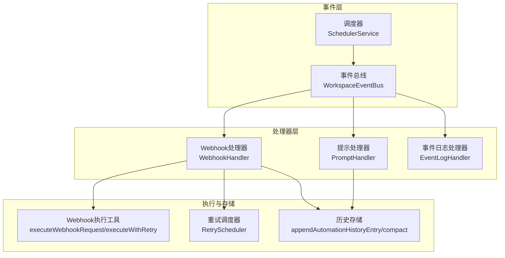
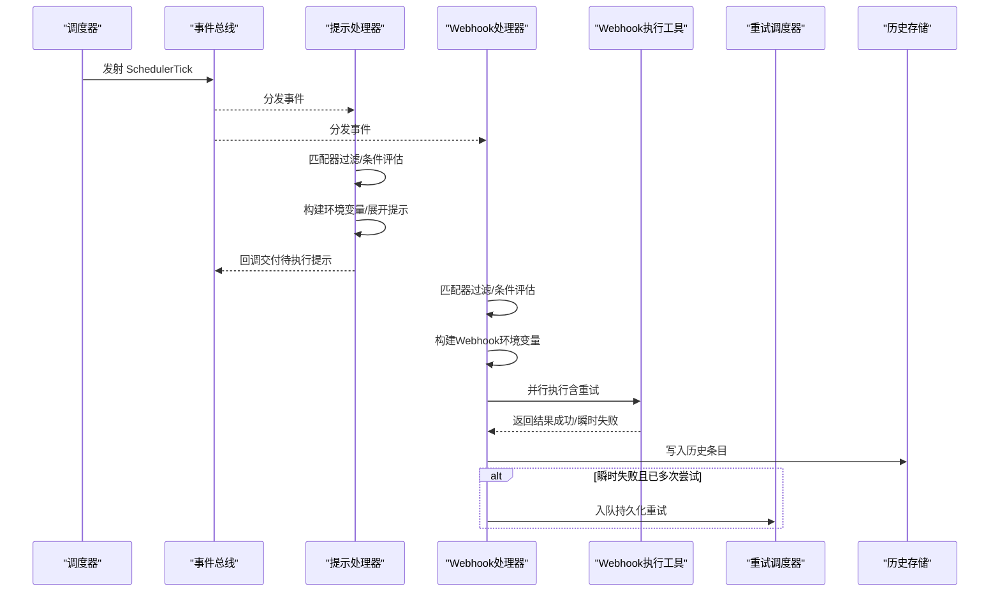
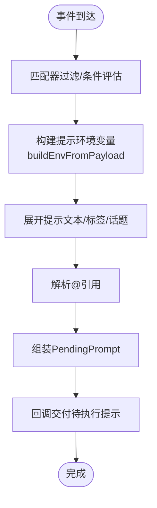
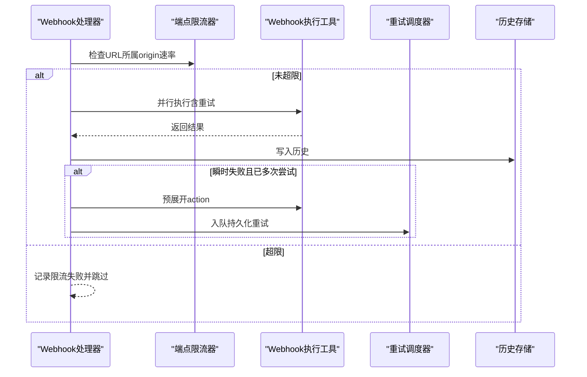
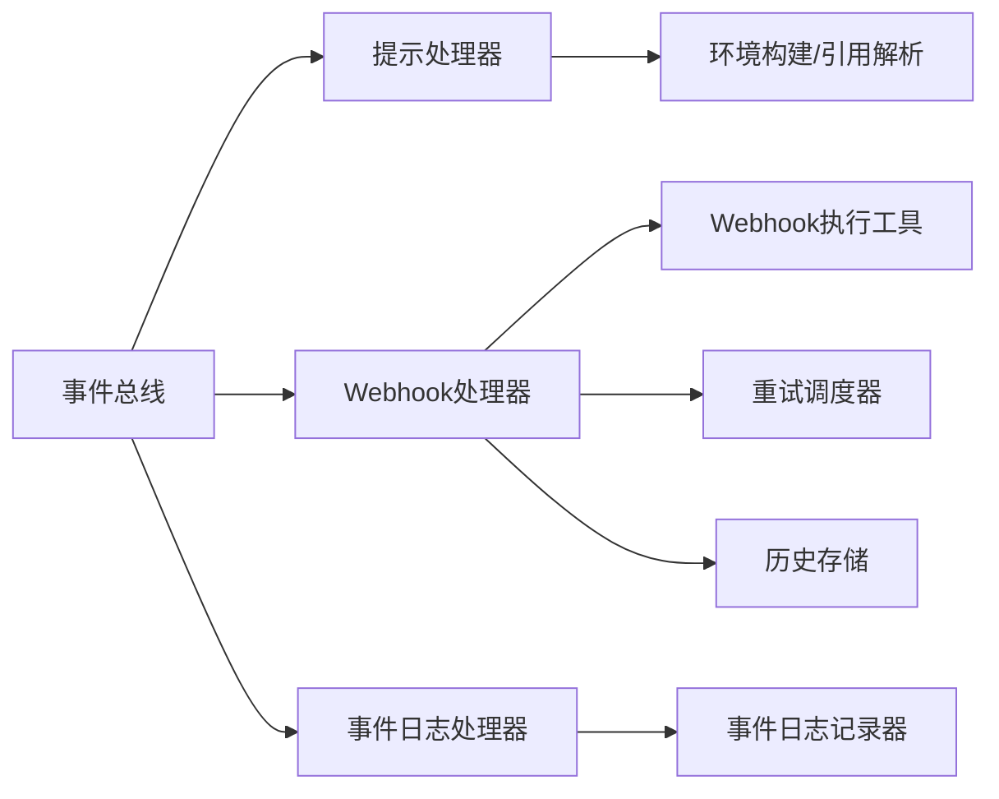

# 动作执行

<cite>
**本文引用的文件**
- [packages/shared/src/automations/types.ts](file://packages/shared/src/automations/types.ts)
- [packages/shared/src/automations/schemas.ts](file://packages/shared/src/automations/schemas.ts)
- [packages/shared/src/automations/utils.ts](file://packages/shared/src/automations/utils.ts)
- [packages/shared/src/automations/webhook-utils.ts](file://packages/shared/src/automations/webhook-utils.ts)
- [packages/shared/src/automations/handlers/webhook-handler.ts](file://packages/shared/src/automations/handlers/webhook-handler.ts)
- [packages/shared/src/automations/handlers/prompt-handler.ts](file://packages/shared/src/automations/handlers/prompt-handler.ts)
- [packages/shared/src/automations/handlers/event-log-handler.ts](file://packages/shared/src/automations/handlers/event-log-handler.ts)
- [packages/shared/src/automations/retry-scheduler.ts](file://packages/shared/src/automations/retry-scheduler.ts)
- [packages/shared/src/automations/history-store.ts](file://packages/shared/src/automations/history-store.ts)
- [packages/shared/src/automations/constants.ts](file://packages/shared/src/automations/constants.ts)
- [packages/shared/src/automations/event-bus.ts](file://packages/shared/src/automations/event-bus.ts)
- [packages/shared/src/automations/automation-system.ts](file://packages/shared/src/automations/automation-system.ts)
- [packages/shared/src/scheduler/scheduler-service.ts](file://packages/shared/src/scheduler/scheduler-service.ts)
</cite>

## 目录
1. [简介](#简介)
2. [项目结构](#项目结构)
3. [核心组件](#核心组件)
4. [架构总览](#架构总览)
5. [详细组件分析](#详细组件分析)
6. [依赖关系分析](#依赖关系分析)
7. [性能考量](#性能考量)
8. [故障排查指南](#故障排查指南)
9. [结论](#结论)
10. [附录](#附录)

## 简介
本技术文档围绕动作执行系统进行深入解析，重点覆盖以下方面：
- 动作类型定义与执行机制：提示动作（PromptAction）、Webhook动作、事件日志动作（EventLog）。
- 动作执行流程：参数解析、环境变量注入、安全验证、执行上下文管理。
- Webhook执行工具：HTTP请求构建、重试机制、超时处理、响应验证。
- 结果处理、错误恢复、执行历史记录。
- 安全性考虑：Shell命令安全、环境变量注入风险防护。
- 调试工具、性能监控、批量执行优化策略。

## 项目结构
动作执行系统位于共享包中，采用“事件总线 + 多处理器”的架构模式：
- 事件总线负责事件分发与速率限制。
- 各处理器订阅感兴趣事件并执行对应动作。
- 历史记录与重试队列持久化，保障可观测性与可靠性。

图表来源
- [packages/shared/src/automations/event-bus.ts:162-320](file://packages/shared/src/automations/event-bus.ts#L162-L320)
- [packages/shared/src/automations/automation-system.ts:264-310](file://packages/shared/src/automations/automation-system.ts#L264-L310)
- [packages/shared/src/automations/handlers/prompt-handler.ts:22-146](file://packages/shared/src/automations/handlers/prompt-handler.ts#L22-L146)
- [packages/shared/src/automations/handlers/webhook-handler.ts:107-275](file://packages/shared/src/automations/handlers/webhook-handler.ts#L107-L275)
- [packages/shared/src/automations/handlers/event-log-handler.ts:20-87](file://packages/shared/src/automations/handlers/event-log-handler.ts#L20-L87)
- [packages/shared/src/automations/webhook-utils.ts:153-294](file://packages/shared/src/automations/webhook-utils.ts#L153-L294)
- [packages/shared/src/automations/retry-scheduler.ts:68-248](file://packages/shared/src/automations/retry-scheduler.ts#L68-L248)
- [packages/shared/src/automations/history-store.ts:57-143](file://packages/shared/src/automations/history-store.ts#L57-L143)

章节来源
- [packages/shared/src/automations/automation-system.ts:264-310](file://packages/shared/src/automations/automation-system.ts#L264-L310)
- [packages/shared/src/automations/event-bus.ts:162-320](file://packages/shared/src/automations/event-bus.ts#L162-L320)

## 核心组件
- 动作类型与结果
  - 提示动作（PromptAction）：用于向代理发送提示词，支持连接、模型、思考层级等配置。
  - Webhook动作（WebhookAction）：用于发送HTTP请求，支持方法、头、体格式、认证、响应体捕获等。
  - 动作结果（ActionExecutionResult/PendingPrompt）：统一描述动作执行结果与待执行提示的元数据。
- 匹配器与条件
  - 匹配器（AutomationMatcher）：基于正则或Cron表达式匹配事件，并可附加条件组合。
- 环境变量与安全
  - 环境变量构建：按动作类型分别构建，避免敏感信息泄露；提示动作对用户输入进行Shell安全转义。
  - 变量展开：支持${VAR}与$VAR两种语法，用于URL、头、体、认证等字段。
- 历史与重试
  - 历史记录：写入JSONL文件，带两层保留策略（每ID上限与全局上限），并提供异步/同步压缩。
  - 重试队列：持久化失败Webhook，按固定间隔延迟重试，最多三次。

章节来源
- [packages/shared/src/automations/types.ts:57-102](file://packages/shared/src/automations/types.ts#L57-L102)
- [packages/shared/src/automations/types.ts:151-183](file://packages/shared/src/automations/types.ts#L151-L183)
- [packages/shared/src/automations/utils.ts:267-312](file://packages/shared/src/automations/utils.ts#L267-L312)
- [packages/shared/src/automations/webhook-utils.ts:84-119](file://packages/shared/src/automations/webhook-utils.ts#L84-L119)
- [packages/shared/src/automations/history-store.ts:57-143](file://packages/shared/src/automations/history-store.ts#L57-L143)
- [packages/shared/src/automations/retry-scheduler.ts:41-58](file://packages/shared/src/automations/retry-scheduler.ts#L41-L58)

## 架构总览
系统通过事件总线驱动，处理器在收到事件后根据匹配器筛选动作并执行。Webhook处理器具备速率限制、并发执行、瞬时失败自动重试与持久化重试队列能力；提示处理器负责收集并扩展提示内容，交由调用方执行；事件日志处理器记录事件与耗时，便于审计与回放。

图表来源
- [packages/shared/src/automations/automation-system.ts:289-303](file://packages/shared/src/automations/automation-system.ts#L289-L303)
- [packages/shared/src/automations/event-bus.ts:178-229](file://packages/shared/src/automations/event-bus.ts#L178-L229)
- [packages/shared/src/automations/handlers/prompt-handler.ts:46-132](file://packages/shared/src/automations/handlers/prompt-handler.ts#L46-L132)
- [packages/shared/src/automations/handlers/webhook-handler.ts:135-259](file://packages/shared/src/automations/handlers/webhook-handler.ts#L135-L259)
- [packages/shared/src/automations/webhook-utils.ts:321-365](file://packages/shared/src/automations/webhook-utils.ts#L321-L365)
- [packages/shared/src/automations/retry-scheduler.ts:103-123](file://packages/shared/src/automations/retry-scheduler.ts#L103-L123)
- [packages/shared/src/automations/history-store.ts:57-74](file://packages/shared/src/automations/history-store.ts#L57-L74)

## 详细组件分析

### 提示动作（PromptAction）执行机制
- 参数解析与引用提取
  - 对提示文本进行@引用解析，识别来源与技能引用，供调用方进一步解析。
- 环境变量注入与安全
  - 使用buildEnvFromPayload构建基础环境变量，并对会话名与用户可控字段进行Shell安全转义，防止命令注入。
- 执行上下文管理
  - 支持权限模式、标签、LLM连接、模型、思考层级等上下文参数，统一打包为PendingPrompt，交由调用方执行。

图表来源
- [packages/shared/src/automations/handlers/prompt-handler.ts:46-132](file://packages/shared/src/automations/handlers/prompt-handler.ts#L46-L132)
- [packages/shared/src/automations/utils.ts:267-312](file://packages/shared/src/automations/utils.ts#L267-L312)
- [packages/shared/src/automations/utils.ts:58-75](file://packages/shared/src/automations/utils.ts#L58-L75)

章节来源
- [packages/shared/src/automations/handlers/prompt-handler.ts:22-146](file://packages/shared/src/automations/handlers/prompt-handler.ts#L22-L146)
- [packages/shared/src/automations/utils.ts:267-312](file://packages/shared/src/automations/utils.ts#L267-L312)
- [packages/shared/src/automations/types.ts:57-70](file://packages/shared/src/automations/types.ts#L57-L70)

### Webhook动作执行机制
- 参数解析与环境变量注入
  - 使用buildWebhookEnv构建仅包含CRAFT_*系统变量与CRAFT_WH_*用户变量的环境，避免泄漏完整进程环境。
  - expandWebhookAction在入队持久化重试前预展开所有可变字段，确保重试时无需原始事件环境。
- HTTP请求构建
  - 支持GET/POST/PUT/PATCH/DELETE；根据bodyFormat生成Content-Type与请求体（json/form/raw）。
  - 支持basic/bearer认证，优先应用内置auth再合并自定义头。
- 超时与响应处理
  - 默认30秒超时，使用AbortController控制；消费响应体以释放连接并可选截断捕获响应体。
- 重试机制
  - 瞬时失败（5xx/超时/连接错误）在处理器内进行指数退避+抖动重试（最多2次）。
  - 持久化重试：超过立即重试次数后，入队RetryScheduler，按5分钟、30分钟、1小时三档延迟重试。
- 历史记录
  - 每次执行写入历史条目，包含方法、URL、状态码、耗时、尝试次数、错误与响应体（可选截断）。

图表来源
- [packages/shared/src/automations/handlers/webhook-handler.ts:164-252](file://packages/shared/src/automations/handlers/webhook-handler.ts#L164-L252)
- [packages/shared/src/automations/webhook-utils.ts:153-294](file://packages/shared/src/automations/webhook-utils.ts#L153-L294)
- [packages/shared/src/automations/webhook-utils.ts:321-365](file://packages/shared/src/automations/webhook-utils.ts#L321-L365)
- [packages/shared/src/automations/retry-scheduler.ts:103-123](file://packages/shared/src/automations/retry-scheduler.ts#L103-L123)
- [packages/shared/src/automations/history-store.ts:57-74](file://packages/shared/src/automations/history-store.ts#L57-L74)

章节来源
- [packages/shared/src/automations/handlers/webhook-handler.ts:107-275](file://packages/shared/src/automations/handlers/webhook-handler.ts#L107-L275)
- [packages/shared/src/automations/webhook-utils.ts:153-294](file://packages/shared/src/automations/webhook-utils.ts#L153-L294)
- [packages/shared/src/automations/webhook-utils.ts:321-365](file://packages/shared/src/automations/webhook-utils.ts#L321-L365)
- [packages/shared/src/automations/retry-scheduler.ts:68-248](file://packages/shared/src/automations/retry-scheduler.ts#L68-L248)

### 事件日志动作（EventLog）
- 订阅所有事件，记录事件类型、会话ID、工作区ID、载荷与耗时，结果单独记录。
- 日志文件路径由处理器维护，支持事件丢失回调转发。

章节来源
- [packages/shared/src/automations/handlers/event-log-handler.ts:20-87](file://packages/shared/src/automations/handlers/event-log-handler.ts#L20-L87)

### 执行上下文与匹配器
- 匹配器过滤
  - 基于enabled标志、正则（regex）或Cron表达式（SchedulerTick）进行匹配。
  - 条件评估：支持时间条件与状态条件的逻辑组合。
- 环境变量构建
  - 提示动作：合并完整process.env并进行Shell安全转义。
  - Webhook动作：仅注入CRAFT_WH_*用户变量，不泄漏完整进程环境。

章节来源
- [packages/shared/src/automations/utils.ts:167-204](file://packages/shared/src/automations/utils.ts#L167-L204)
- [packages/shared/src/automations/utils.ts:267-312](file://packages/shared/src/automations/utils.ts#L267-L312)

## 依赖关系分析
- 组件耦合
  - Webhook处理器依赖Webhook执行工具、重试调度器与历史存储；提示处理器依赖环境构建与引用解析；事件日志处理器依赖事件日志记录器。
- 外部依赖
  - fetch用于HTTP请求；AbortController用于超时控制；文件系统用于历史与重试队列持久化。
- 循环依赖
  - 无直接循环依赖；各模块通过接口与常量文件解耦。

图表来源
- [packages/shared/src/automations/handlers/webhook-handler.ts:107-119](file://packages/shared/src/automations/handlers/webhook-handler.ts#L107-L119)
- [packages/shared/src/automations/webhook-utils.ts:153-294](file://packages/shared/src/automations/webhook-utils.ts#L153-L294)
- [packages/shared/src/automations/retry-scheduler.ts:68-97](file://packages/shared/src/automations/retry-scheduler.ts#L68-L97)
- [packages/shared/src/automations/history-store.ts:57-74](file://packages/shared/src/automations/history-store.ts#L57-L74)
- [packages/shared/src/automations/handlers/prompt-handler.ts:22-41](file://packages/shared/src/automations/handlers/prompt-handler.ts#L22-L41)
- [packages/shared/src/automations/handlers/event-log-handler.ts:20-44](file://packages/shared/src/automations/handlers/event-log-handler.ts#L20-L44)

## 性能考量
- 并发与限流
  - Webhook处理器对每个URL的origin进行滑动窗口限流，防止单目标过载。
  - 事件总线对同一事件类型进行速率限制，避免事件风暴导致的资源竞争。
- 执行优化
  - Webhook动作在处理器内并行执行，减少整体等待时间。
  - 响应体消费与截断，避免内存占用过高。
- 存储与压缩
  - 历史文件采用JSONL增量追加，达到阈值后触发压缩，限制每ID与全局条目数量。
- 调度与对齐
  - 调度器在分钟边界对齐，保证Cron表达式的稳定执行。

章节来源
- [packages/shared/src/automations/handlers/webhook-handler.ts:46-101](file://packages/shared/src/automations/handlers/webhook-handler.ts#L46-L101)
- [packages/shared/src/automations/event-bus.ts:178-229](file://packages/shared/src/automations/event-bus.ts#L178-L229)
- [packages/shared/src/automations/history-store.ts:83-114](file://packages/shared/src/automations/history-store.ts#L83-L114)
- [packages/shared/src/scheduler/scheduler-service.ts:33-45](file://packages/shared/src/scheduler/scheduler-service.ts#L33-L45)

## 故障排查指南
- Webhook失败定位
  - 查看历史条目中的错误与响应体（若启用捕获），确认状态码与错误消息。
  - 若为瞬时失败，检查是否已进入持久化重试队列。
- 重试队列检查
  - 检查重试队列文件是否存在未到期条目，确认下一次重试时间与已尝试次数。
- 环境变量问题
  - 提示动作：确认用户输入已在构建环境时被安全转义。
  - Webhook动作：确认CRAFT_WH_*变量是否正确设置，URL/头/体是否包含有效变量模板。
- 事件丢失与日志
  - 事件日志处理器提供事件丢失回调，可用于监控与告警。

章节来源
- [packages/shared/src/automations/history-store.ts:57-74](file://packages/shared/src/automations/history-store.ts#L57-L74)
- [packages/shared/src/automations/retry-scheduler.ts:128-245](file://packages/shared/src/automations/retry-scheduler.ts#L128-L245)
- [packages/shared/src/automations/utils.ts:267-312](file://packages/shared/src/automations/utils.ts#L267-L312)
- [packages/shared/src/automations/handlers/event-log-handler.ts:31-33](file://packages/shared/src/automations/handlers/event-log-handler.ts#L31-L33)

## 结论
该动作执行系统通过清晰的事件驱动架构、严格的环境变量注入策略与完善的持久化历史与重试机制，实现了高可靠、可观测的动作执行。Webhook动作具备完善的HTTP执行工具链与重试策略，提示动作在安全与上下文管理上提供了稳健支持，事件日志为审计与排障提供了基础。建议在生产环境中结合历史压缩与重试队列监控，持续优化执行性能与稳定性。

## 附录
- 关键常量
  - 文件名与默认行为：配置文件、历史文件、重试队列文件、默认HTTP方法、历史字段最大长度、每ID与全局历史上限。
- 调试与监控建议
  - 开启处理器回调与历史写入，结合事件日志与重试队列监控，建立告警与巡检机制。
  - 对高频Webhook端点实施更严格的限流与重试策略，必要时引入外部队列中间件。

章节来源
- [packages/shared/src/automations/constants.ts:1-21](file://packages/shared/src/automations/constants.ts#L1-L21)