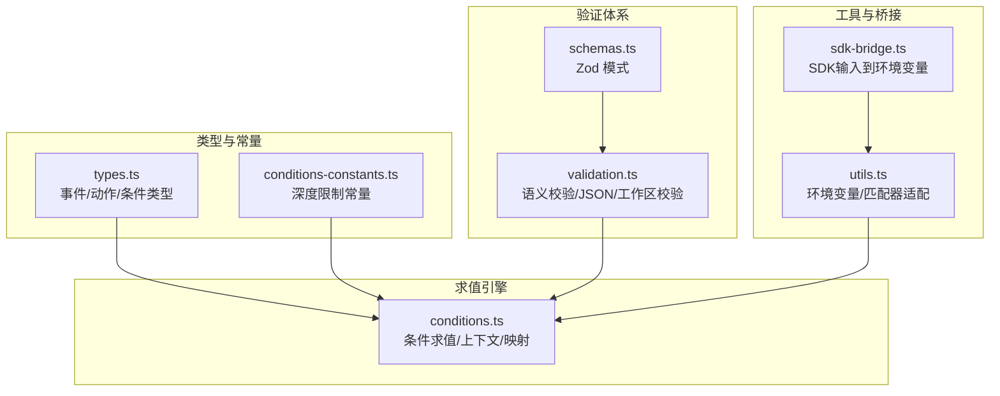
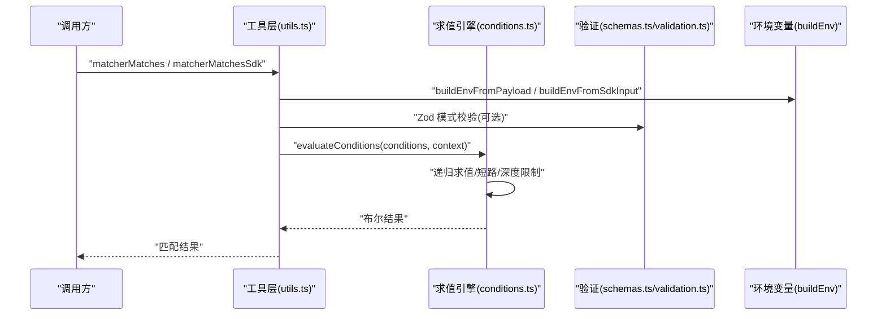
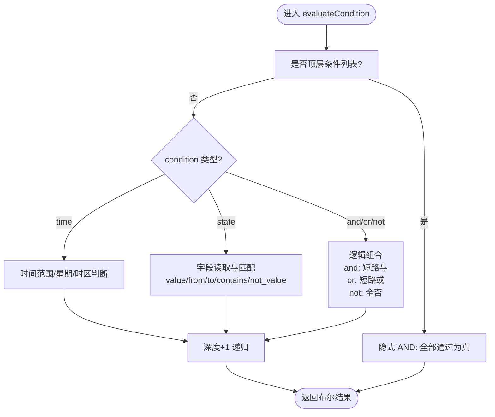
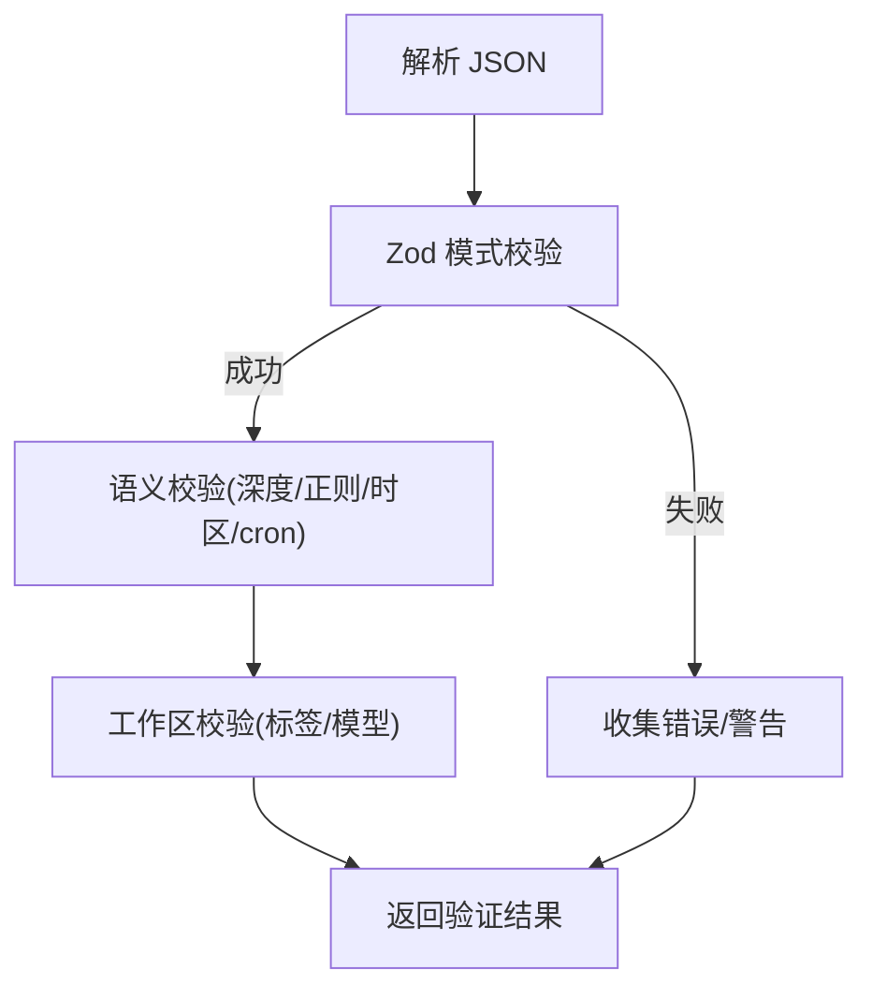
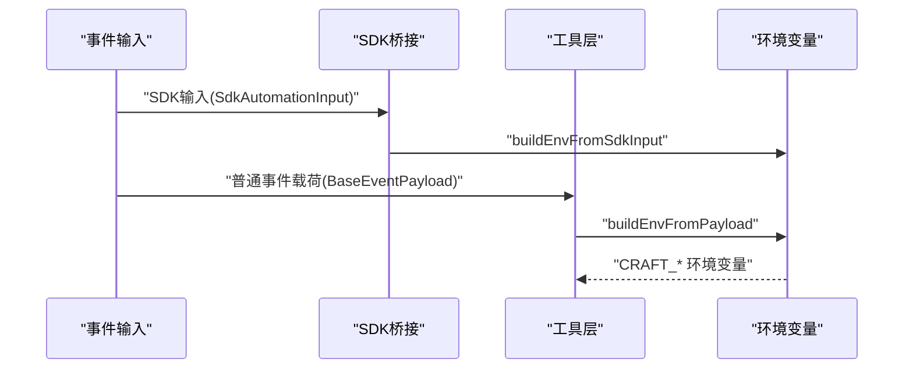
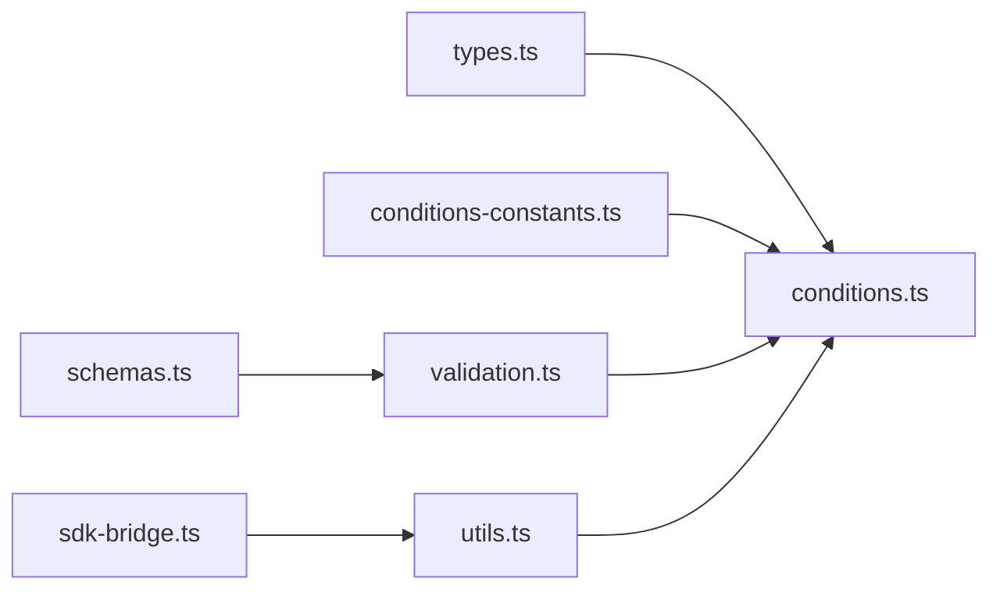

# 条件评估器

<cite>
**本文档引用的文件**
- [conditions.ts](file://packages/shared/src/automations/conditions.ts)
- [validation.ts](file://packages/shared/src/automations/validation.ts)
- [conditions-constants.ts](file://packages/shared/src/automations/conditions-constants.ts)
- [types.ts](file://packages/shared/src/automations/types.ts)
- [schemas.ts](file://packages/shared/src/automations/schemas.ts)
- [utils.ts](file://packages/shared/src/automations/utils.ts)
- [sdk-bridge.ts](file://packages/shared/src/automations/sdk-bridge.ts)
- [conditions.test.ts](file://packages/shared/src/automations/conditions.test.ts)
- [validation.test.ts](file://packages/shared/src/automations/validation.test.ts)
</cite>

## 目录
1. [简介](#简介)
2. [项目结构](#项目结构)
3. [核心组件](#核心组件)
4. [架构总览](#架构总览)
5. [详细组件分析](#详细组件分析)
6. [依赖关系分析](#依赖关系分析)
7. [性能考量](#性能考量)
8. [故障排查指南](#故障排查指南)
9. [结论](#结论)
10. [附录](#附录)

## 简介
本文件面向“条件评估器”的技术文档，系统阐述自动化条件引擎的实现原理与工程实践，覆盖以下主题：
- 条件类型：逻辑条件、时间条件、状态条件的解析与执行机制
- 语法树构建与表达式求值：多层嵌套、短路求值、深度限制
- 变量替换与环境上下文：事件环境变量生成、SDK桥接、Shell注入防护
- 条件验证体系：Zod 模式校验、配置合法性检查、运行时类型安全
- 缓存与性能：深度限制、短路优化、复杂条件组合最佳实践
- 调试与诊断：测试用例覆盖、常见模式示例、错误定位方法
- 扩展指南：自定义条件类型的开发与集成路径

## 项目结构
条件评估器位于共享包的 automations 子模块中，围绕条件类型、求值、验证与工具函数形成清晰分层：
- 类型与常量：定义条件类型、事件类型、深度限制等
- 求值引擎：条件解析、表达式求值、上下文管理
- 验证体系：Zod 模式、语义校验、JSON 内容与工作区校验
- 工具与桥接：环境变量构建、SDK 输入适配、字符串与正则安全处理

图表来源
- [types.ts:105-146](file://packages/shared/src/automations/types.ts#L105-L146)
- [conditions-constants.ts:1-11](file://packages/shared/src/automations/conditions-constants.ts#L1-L11)
- [conditions.ts:1-242](file://packages/shared/src/automations/conditions.ts#L1-L242)
- [schemas.ts:79-134](file://packages/shared/src/automations/schemas.ts#L79-L134)
- [validation.ts:26-47](file://packages/shared/src/automations/validation.ts#L26-L47)
- [utils.ts:1-286](file://packages/shared/src/automations/utils.ts#L1-L286)
- [sdk-bridge.ts:1-33](file://packages/shared/src/automations/sdk-bridge.ts#L1-L33)

章节来源
- [types.ts:105-146](file://packages/shared/src/automations/types.ts#L105-L146)
- [conditions-constants.ts:1-11](file://packages/shared/src/automations/conditions-constants.ts#L1-L11)
- [conditions.ts:1-242](file://packages/shared/src/automations/conditions.ts#L1-L242)
- [schemas.ts:79-134](file://packages/shared/src/automations/schemas.ts#L79-L134)
- [validation.ts:26-47](file://packages/shared/src/automations/validation.ts#L26-L47)
- [utils.ts:1-286](file://packages/shared/src/automations/utils.ts#L1-L286)
- [sdk-bridge.ts:1-33](file://packages/shared/src/automations/sdk-bridge.ts#L1-L33)

## 核心组件
- 条件类型与事件
  - 时间条件：支持时间段与星期过滤，可指定时区回退策略
  - 状态条件：字段精确匹配、from/to 过渡匹配、数组包含、取反匹配
  - 逻辑条件：and/or/not 的短路组合，支持任意层级嵌套
- 求值上下文
  - payload：事件载荷
  - now/matcherTimezone：时间条件的当前时间与时区
- 验证体系
  - Zod 模式：字段格式、互斥操作符、最小子条件数量
  - 语义校验：深度阈值警告、最大深度错误、ReDoS 正则检测、时区与 cron 合法性
- 环境变量与上下文
  - 构建 CRAFT_* 环境变量，支持 SDK 输入映射与 Shell 注入防护

章节来源
- [types.ts:108-146](file://packages/shared/src/automations/types.ts#L108-L146)
- [conditions.ts:13-33](file://packages/shared/src/automations/conditions.ts#L13-L33)
- [validation.ts:421-471](file://packages/shared/src/automations/validation.ts#L421-L471)
- [utils.ts:228-282](file://packages/shared/src/automations/utils.ts#L228-L282)
- [sdk-bridge.ts:15-33](file://packages/shared/src/automations/sdk-bridge.ts#L15-L33)

## 架构总览
条件评估器采用“类型驱动 + 深度限制 + 短路求值”的设计，确保在高复杂度条件下仍保持高性能与可维护性。

图表来源
- [utils.ts:188-204](file://packages/shared/src/automations/utils.ts#L188-L204)
- [conditions.ts:150-242](file://packages/shared/src/automations/conditions.ts#L150-L242)
- [schemas.ts:125-134](file://packages/shared/src/automations/schemas.ts#L125-L134)
- [validation.ts:26-47](file://packages/shared/src/automations/validation.ts#L26-L47)
- [sdk-bridge.ts:15-33](file://packages/shared/src/automations/sdk-bridge.ts#L15-L33)

## 详细组件分析

### 条件求值引擎（conditions.ts）
- 顶层行为
  - 多个顶级条件按隐式 AND 组合；空数组返回真
  - 递归深度从 0 开始，超过上限直接失败
- 时间条件
  - 支持 after/before 边界与“跨夜”区间（after > before）
  - 星期过滤与时区回退（优先条件内 timezone，其次匹配器 timezone）
- 状态条件
  - 字段精确匹配、from/to 过渡映射（permissionMode/sessionStatus）
  - 数组包含 contains、取反 not_value
  - 无操作符或多重互斥操作符时失败
- 逻辑条件
  - and：短路“遇否即停”
  - or：短路“遇真即停”
  - not：对所有子条件取反后整体求值
- 上下文与映射
  - TRANSITION_FIELDS 将用户字段映射到内部 payload 键
  - WEEKDAY_MAP 将 mon-sun 映射到 JS Date 周数

图表来源
- [conditions.ts:150-242](file://packages/shared/src/automations/conditions.ts#L150-L242)
- [conditions.ts:109-136](file://packages/shared/src/automations/conditions.ts#L109-L136)
- [conditions.ts:121-136](file://packages/shared/src/automations/conditions.ts#L121-L136)
- [conditions.ts:169-211](file://packages/shared/src/automations/conditions.ts#L169-L211)
- [conditions.ts:217-242](file://packages/shared/src/automations/conditions.ts#L217-L242)

章节来源
- [conditions.ts:1-242](file://packages/shared/src/automations/conditions.ts#L1-L242)
- [conditions-constants.ts:1-11](file://packages/shared/src/automations/conditions-constants.ts#L1-L11)

### 条件验证系统（schemas.ts + validation.ts）
- Zod 模式
  - TimeConditionSchema：after/before HH:MM 格式校验，weekday 枚举，timezone 可选
  - StateConditionSchema：字段非空，且仅允许一种操作符组（value/from/to/contains/not_value）
  - AutomationConditionSchema：discriminatedUnion + 递归 lazy，保证合法嵌套
- 语义校验
  - 深度阈值警告与最大深度错误
  - 正则 ReDoS 检测（嵌套量词、重复交替、相邻贪婪量词）
  - 时区与 cron 合法性校验
  - 事件名别名转换与未知事件过滤
- JSON 与工作区校验
  - validateAutomationsContent：JSON 解析、Zod 校验、语义校验
  - validateAutomations：磁盘读取、工作区标签/模型可用性等

图表来源
- [schemas.ts:79-134](file://packages/shared/src/automations/schemas.ts#L79-L134)
- [validation.ts:26-47](file://packages/shared/src/automations/validation.ts#L26-L47)
- [validation.ts:421-547](file://packages/shared/src/automations/validation.ts#L421-L547)

章节来源
- [schemas.ts:79-134](file://packages/shared/src/automations/schemas.ts#L79-L134)
- [validation.ts:26-47](file://packages/shared/src/automations/validation.ts#L26-L47)
- [validation.ts:421-547](file://packages/shared/src/automations/validation.ts#L421-L547)

### 环境变量与上下文管理（utils.ts + sdk-bridge.ts）
- 环境变量构建
  - buildEnvFromPayload：合并 process.env 与事件元数据，对会话名与载荷字段进行 Shell 安全处理
  - buildBaseEventEnv：生成基础 CRAFT_* 变量（事件、会话、时间、载荷键）
  - cleanEnv：过滤 undefined 值，避免不安全的 process.env 强转
- SDK 桥接
  - buildEnvFromSdkInput：将 SDK 输入映射为 CRAFT_* 变量，并对用户可控输入进行安全处理
- 匹配器适配
  - matcherMatches / matcherMatchesSdk：将匹配器与条件求值串联，先匹配再求值

图表来源
- [sdk-bridge.ts:15-33](file://packages/shared/src/automations/sdk-bridge.ts#L15-L33)
- [utils.ts:228-282](file://packages/shared/src/automations/utils.ts#L228-L282)
- [utils.ts:188-204](file://packages/shared/src/automations/utils.ts#L188-L204)

章节来源
- [utils.ts:210-282](file://packages/shared/src/automations/utils.ts#L210-L282)
- [sdk-bridge.ts:15-33](file://packages/shared/src/automations/sdk-bridge.ts#L15-L33)

### 条件语法树与表达式求值
- 语法树
  - 由 AutomationCondition[] 表示，支持三种叶子节点与三种逻辑节点
  - 通过 Zod 递归模式保证结构合法
- 求值流程
  - 顶层隐式 AND
  - 逻辑节点短路
  - 时间/状态节点独立分支
  - 深度计数防止过深嵌套

章节来源
- [schemas.ts:125-134](file://packages/shared/src/automations/schemas.ts#L125-L134)
- [conditions.ts:150-242](file://packages/shared/src/automations/conditions.ts#L150-L242)

### 条件调试与测试用例
- 测试覆盖
  - 时间条件：跨夜区间、边界值、星期过滤、时区回退
  - 状态条件：精确匹配、from/to、contains、not_value、缺失字段
  - 逻辑条件：and/or/not、嵌套与短路、最大深度边界
  - 匹配器集成：matcherMatches/matcherMatchesSdk 与条件求值联动
- 常见模式示例
  - (mode=safe OR mode=ask) AND NOT(isFlagged=true)
  - PermissionModeChange(from=“safe”, to=“allow-all”)
  - time(after=“09:00”, before=“17:00”, weekday=[“fri”])

章节来源
- [conditions.test.ts:41-138](file://packages/shared/src/automations/conditions.test.ts#L41-L138)
- [conditions.test.ts:144-271](file://packages/shared/src/automations/conditions.test.ts#L144-L271)
- [conditions.test.ts:277-392](file://packages/shared/src/automations/conditions.test.ts#L277-L392)
- [conditions.test.ts:414-499](file://packages/shared/src/automations/conditions.test.ts#L414-L499)
- [conditions.test.ts:501-548](file://packages/shared/src/automations/conditions.test.ts#L501-L548)

## 依赖关系分析
- 类型与常量
  - types.ts 提供条件与事件类型
  - conditions-constants.ts 提供深度限制
- 求值引擎
  - conditions.ts 依赖类型与常量，实现求值与上下文映射
- 验证体系
  - schemas.ts 定义 Zod 模式
  - validation.ts 使用 schemas.ts 与常量进行语义与工作区校验
- 工具与桥接
  - utils.ts 依赖 security.ts（Shell 注入防护）与 conditions.ts
  - sdk-bridge.ts 依赖 utils.ts 的 cleanEnv 与 security.ts

图表来源
- [types.ts:105-146](file://packages/shared/src/automations/types.ts#L105-L146)
- [conditions-constants.ts:1-11](file://packages/shared/src/automations/conditions-constants.ts#L1-L11)
- [conditions.ts:1-242](file://packages/shared/src/automations/conditions.ts#L1-L242)
- [schemas.ts:125-134](file://packages/shared/src/automations/schemas.ts#L125-L134)
- [validation.ts:26-47](file://packages/shared/src/automations/validation.ts#L26-L47)
- [utils.ts:1-286](file://packages/shared/src/automations/utils.ts#L1-L286)
- [sdk-bridge.ts:1-33](file://packages/shared/src/automations/sdk-bridge.ts#L1-L33)

章节来源
- [types.ts:105-146](file://packages/shared/src/automations/types.ts#L105-L146)
- [conditions-constants.ts:1-11](file://packages/shared/src/automations/conditions-constants.ts#L1-L11)
- [conditions.ts:1-242](file://packages/shared/src/automations/conditions.ts#L1-L242)
- [schemas.ts:125-134](file://packages/shared/src/automations/schemas.ts#L125-L134)
- [validation.ts:26-47](file://packages/shared/src/automations/validation.ts#L26-L47)
- [utils.ts:1-286](file://packages/shared/src/automations/utils.ts#L1-L286)
- [sdk-bridge.ts:1-33](file://packages/shared/src/automations/sdk-bridge.ts#L1-L33)

## 性能考量
- 深度限制
  - 最大嵌套深度为 8，超过即失败并给出错误
  - 深度超过 4 时发出简化建议警告
- 短路求值
  - and/or/not 在布尔空间内短路，减少不必要的子条件计算
- 时间条件
  - 跨夜区间与星期过滤为 O(1)，避免昂贵的时间计算
- 环境变量
  - Shell 注入防护与变量构建在必要时进行，避免无谓开销

章节来源
- [conditions-constants.ts:1-11](file://packages/shared/src/automations/conditions-constants.ts#L1-L11)
- [conditions.ts:217-242](file://packages/shared/src/automations/conditions.ts#L217-L242)
- [validation.ts:432-448](file://packages/shared/src/automations/validation.ts#L432-L448)

## 故障排查指南
- 常见错误与定位
  - 条件嵌套过深：查看深度阈值与最大深度错误信息
  - 状态条件未设置操作符：检查 value/from/to/contains/not_value 是否互斥且至少一个存在
  - 时间条件格式错误：确认 HH:MM 格式与时间范围
  - 正则 ReDoS：避免嵌套量词与重复交替模式
  - 时区与 cron 非法：使用 IANA 时区与标准 5 场 cron
- 调试建议
  - 使用测试用例中的模式作为参考，逐步拆解复杂条件
  - 在 matcherMatches 与 evaluateConditions 之间插入日志，观察短路点
  - 对 SDK 输入使用 buildEnvFromSdkInput 生成环境变量，核对 CRAFT_* 变量

章节来源
- [validation.test.ts:226-251](file://packages/shared/src/automations/validation.test.ts#L226-L251)
- [validation.ts:473-547](file://packages/shared/src/automations/validation.ts#L473-L547)
- [conditions.test.ts:374-391](file://packages/shared/src/automations/conditions.test.ts#L374-L391)

## 结论
条件评估器以类型安全为核心，结合深度限制与短路求值，在保证高性能的同时提供了强大的条件组合能力。通过 Zod 模式与语义校验，系统在编译期与运行期均能有效保障配置正确性。配合完善的环境变量与 SDK 桥接，开发者可以稳定地在不同事件源与上下文中复用同一套条件逻辑。

## 附录

### 自定义条件类型的开发指南
- 设计步骤
  - 在 types.ts 中新增条件接口，扩展 AutomationCondition
  - 在 schemas.ts 中添加对应的 Zod 模式与校验规则
  - 在 conditions.ts 中实现 evaluateCondition 分支与上下文处理
  - 在 validation.ts 中补充语义校验（如需）
  - 在 utils.ts 中根据需要扩展环境变量构建
- 注意事项
  - 保持与现有逻辑一致的短路与深度控制
  - 严格区分“顶层隐式 AND”与“逻辑节点显式 AND/OR/NOT”
  - 对外部输入进行必要的安全处理（如 Shell 注入）

章节来源
- [types.ts:108-146](file://packages/shared/src/automations/types.ts#L108-L146)
- [schemas.ts:125-134](file://packages/shared/src/automations/schemas.ts#L125-L134)
- [conditions.ts:150-242](file://packages/shared/src/automations/conditions.ts#L150-L242)
- [validation.ts:421-471](file://packages/shared/src/automations/validation.ts#L421-L471)
- [utils.ts:228-282](file://packages/shared/src/automations/utils.ts#L228-L282)