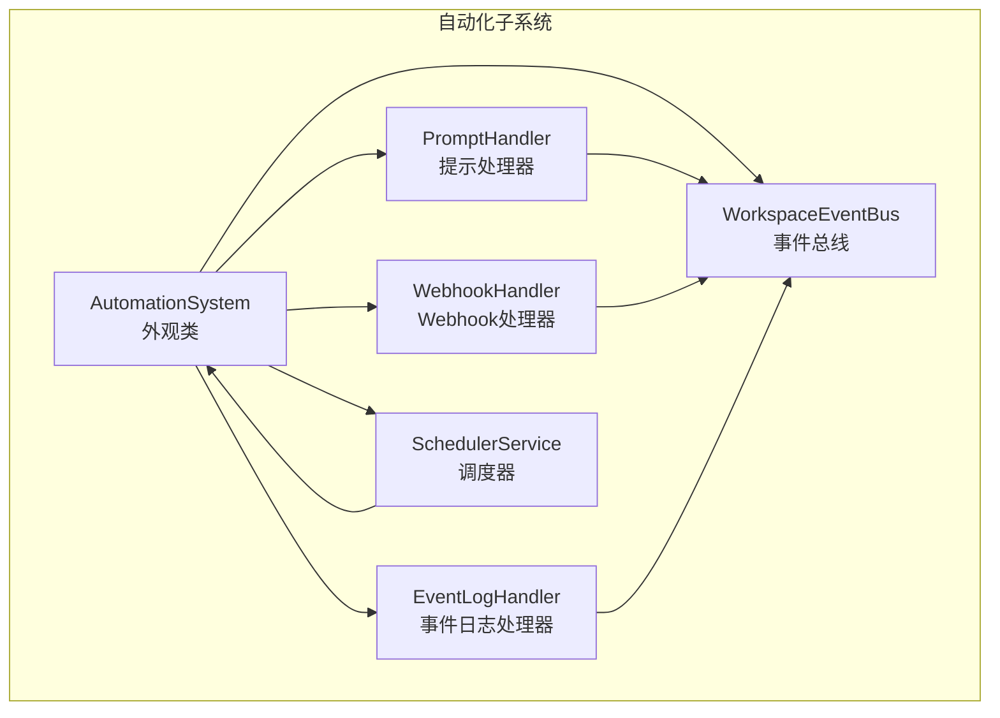
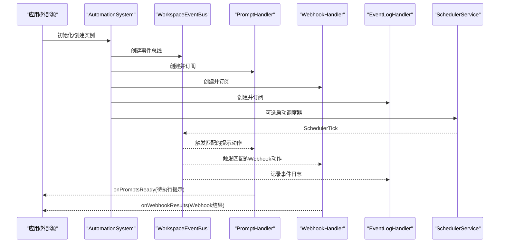
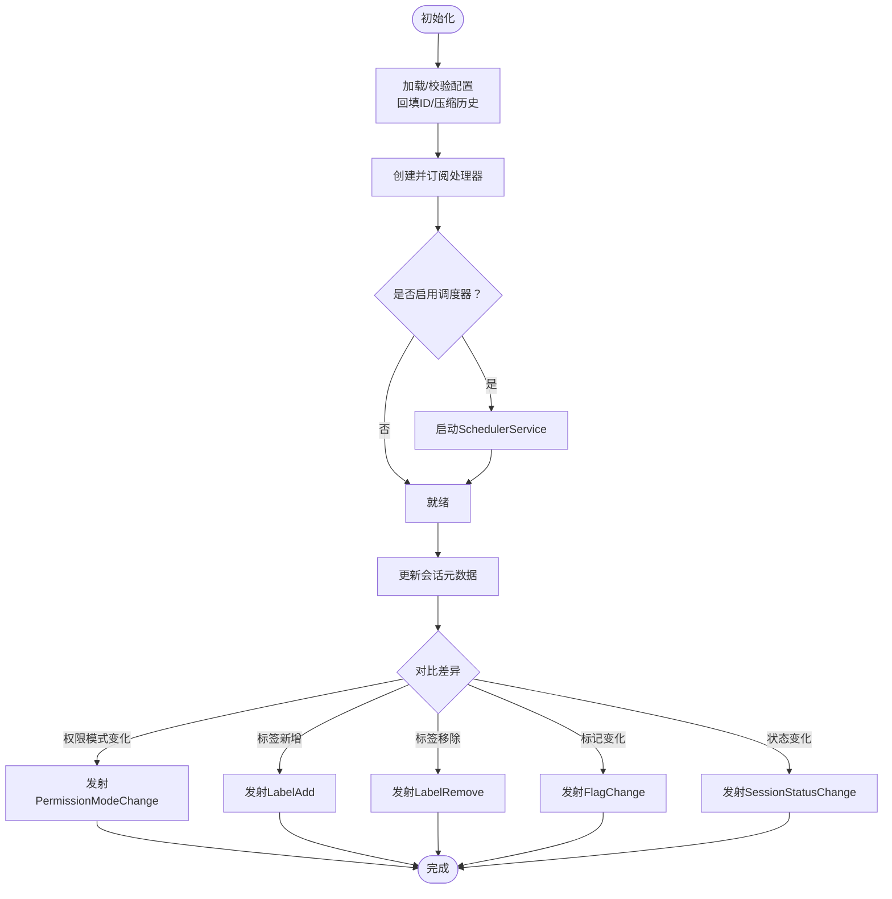
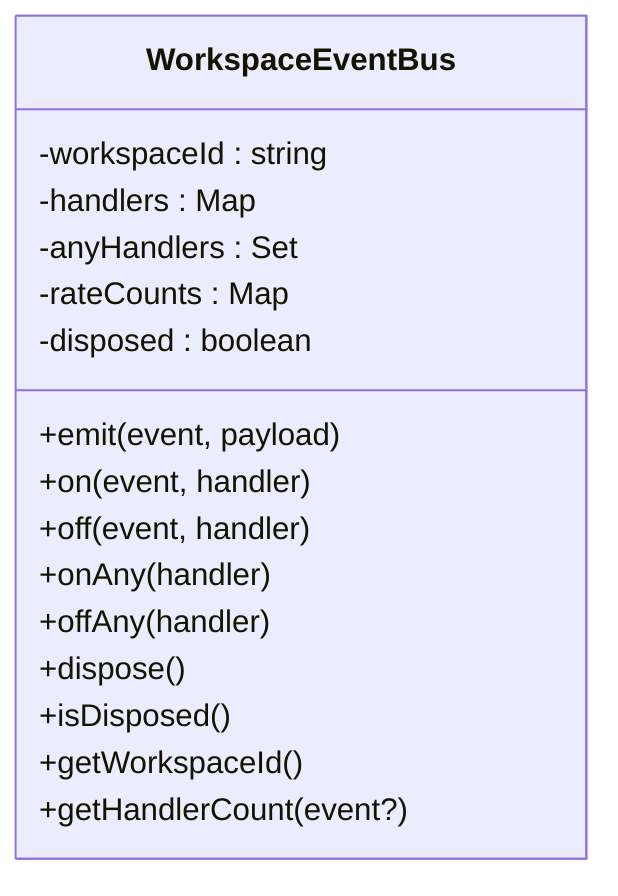
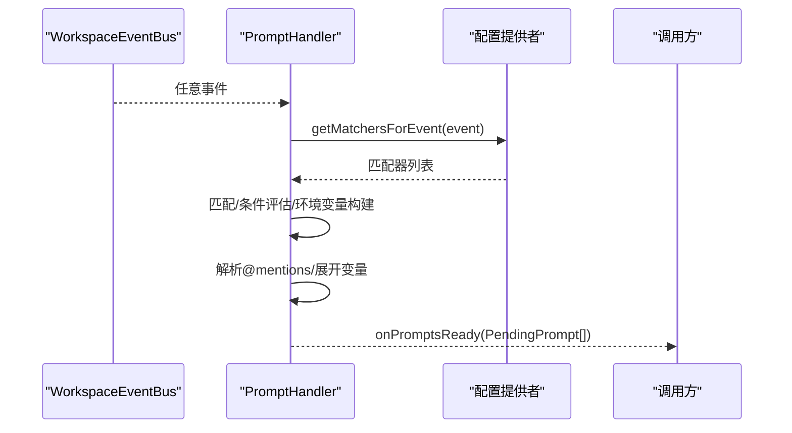
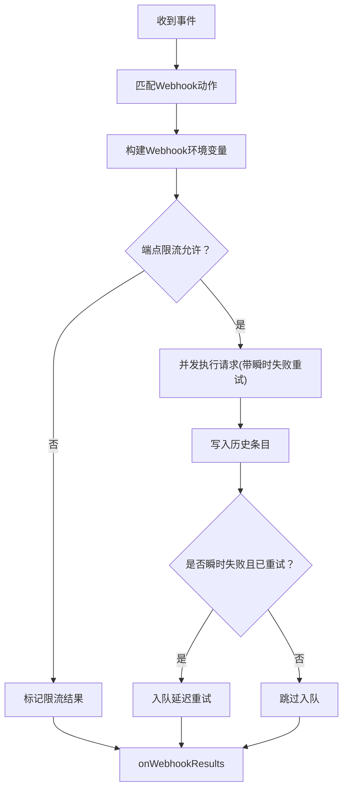
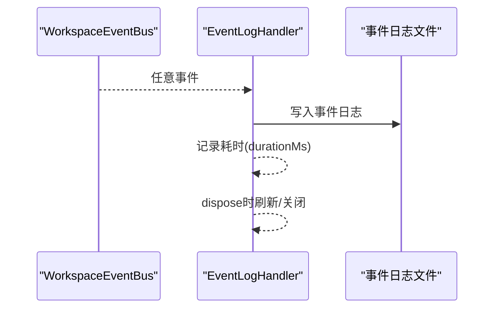
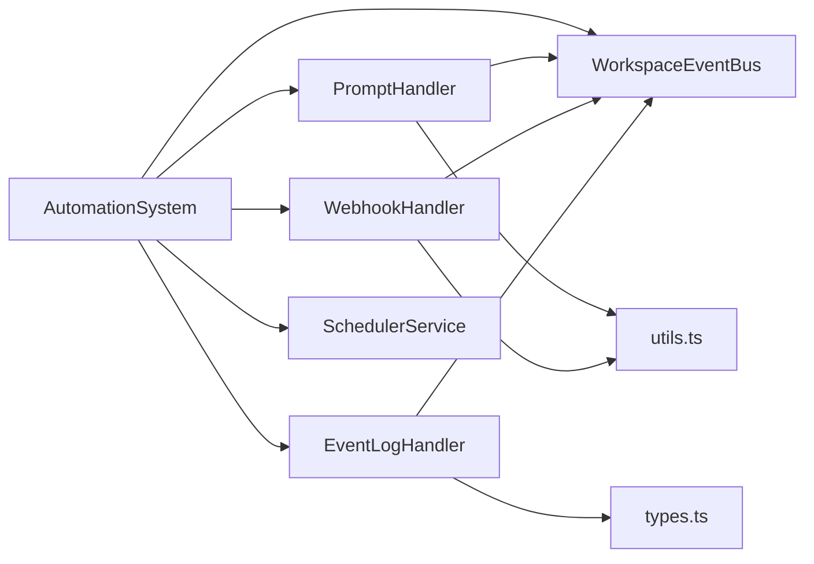

# 自动化引擎

<cite>
**本文引用的文件**
- [automation-system.ts](file://packages/shared/src/automations/automation-system.ts)
- [event-bus.ts](file://packages/shared/src/automations/event-bus.ts)
- [types.ts](file://packages/shared/src/automations/types.ts)
- [utils.ts](file://packages/shared/src/automations/utils.ts)
- [prompt-handler.ts](file://packages/shared/src/automations/handlers/prompt-handler.ts)
- [webhook-handler.ts](file://packages/shared/src/automations/handlers/webhook-handler.ts)
- [event-log-handler.ts](file://packages/shared/src/automations/handlers/event-log-handler.ts)
- [scheduler-service.ts](file://packages/shared/src/scheduler/scheduler-service.ts)
- [automation-system.test.ts](file://packages/shared/src/automations/automation-system.test.ts)
- [prompt-handler.test.ts](file://packages/shared/src/automations/handlers/prompt-handler.test.ts)
</cite>

## 目录
1. [简介](#简介)
2. [项目结构](#项目结构)
3. [核心组件](#核心组件)
4. [架构总览](#架构总览)
5. [详细组件分析](#详细组件分析)
6. [依赖关系分析](#依赖关系分析)
7. [性能考虑](#性能考虑)
8. [故障排查指南](#故障排查指南)
9. [结论](#结论)
10. [附录](#附录)

## 简介
本文件为自动化引擎的技术文档，聚焦于 AutomationSystem 外观类的设计与实现，涵盖自动化配置管理、事件分发机制、处理器注册与调度、生命周期管理、错误恢复与性能优化策略。文档同时深入解析三种核心处理器（PromptHandler、WebhookHandler、EventLogHandler）的实现原理、执行流程与配置选项，并给出扩展指南、自定义处理器开发建议、调试与监控工具使用方法。

## 项目结构
自动化引擎位于 packages/shared/src/automations 目录下，采用“外观类 + 事件总线 + 处理器”的分层设计：
- AutomationSystem：统一外观类，负责配置加载、处理器创建与订阅、调度器启动、会话元数据差异计算与事件发射。
- WorkspaceEventBus：按工作区隔离的事件总线，支持速率限制、任意事件监听、并行处理各处理器回调。
- Handlers：三类处理器分别处理提示生成、Webhook 请求与事件审计日志。
- SchedulerService：定时服务，周期性向总线发射 SchedulerTick 事件，供匹配器按 cron 执行。
- 类型与工具：types.ts 定义事件、动作、匹配器等类型；utils.ts 提供环境变量构建、条件匹配、正则/时间匹配等通用能力。

图表来源
- [automation-system.ts:65-95](file://packages/shared/src/automations/automation-system.ts#L65-L95)
- [event-bus.ts:162-172](file://packages/shared/src/automations/event-bus.ts#L162-L172)
- [prompt-handler.ts:22-41](file://packages/shared/src/automations/handlers/prompt-handler.ts#L22-L41)
- [webhook-handler.ts:107-130](file://packages/shared/src/automations/handlers/webhook-handler.ts#L107-L130)
- [event-log-handler.ts:20-44](file://packages/shared/src/automations/handlers/event-log-handler.ts#L20-L44)
- [scheduler-service.ts:23-45](file://packages/shared/src/scheduler/scheduler-service.ts#L23-L45)

章节来源
- [automation-system.ts:1-95](file://packages/shared/src/automations/automation-system.ts#L1-L95)
- [event-bus.ts:1-172](file://packages/shared/src/automations/event-bus.ts#L1-L172)
- [scheduler-service.ts:1-88](file://packages/shared/src/scheduler/scheduler-service.ts#L1-L88)

## 核心组件
- AutomationSystem 外观类
  - 职责：创建并持有 WorkspaceEventBus；加载/重载 automations.json 并校验；创建并订阅三类处理器；可选启动调度器；提供会话元数据差异计算与事件发射；统一生命周期管理与资源清理。
  - 关键点：无全局状态，按工作区隔离；通过 AutomationsConfigProvider 接口解耦配置读取；支持 onPromptsReady/onWebhookResults/onError/onEventLost 回调。
- WorkspaceEventBus
  - 职责：事件发布/订阅、速率限制、任意事件监听、并行执行处理器回调、资源清理。
  - 关键点：每事件独立速率窗口；SchedulerTick 有更高限流阈值；onAny 用于审计或调试。
- SchedulerService
  - 职责：对齐到分钟边界的周期性触发，向总线推送 SchedulerTick 事件。
  - 关键点：避免并发重叠；失败时记录日志。

章节来源
- [automation-system.ts:65-95](file://packages/shared/src/automations/automation-system.ts#L65-L95)
- [event-bus.ts:162-320](file://packages/shared/src/automations/event-bus.ts#L162-L320)
- [scheduler-service.ts:23-88](file://packages/shared/src/scheduler/scheduler-service.ts#L23-L88)

## 架构总览
自动化引擎以 AutomationSystem 为中心，围绕 WorkspaceEventBus 实现松耦合的事件驱动架构。配置文件 automations.json 决定匹配器与动作，处理器在收到匹配事件后执行相应逻辑并通过回调或日志输出结果。调度器按分钟边界触发，使基于 cron 的匹配器得以生效。

图表来源
- [automation-system.ts:246-280](file://packages/shared/src/automations/automation-system.ts#L246-L280)
- [event-bus.ts:178-229](file://packages/shared/src/automations/event-bus.ts#L178-L229)
- [prompt-handler.ts:36-118](file://packages/shared/src/automations/handlers/prompt-handler.ts#L36-L118)
- [webhook-handler.ts:124-259](file://packages/shared/src/automations/handlers/webhook-handler.ts#L124-L259)
- [event-log-handler.ts:39-63](file://packages/shared/src/automations/handlers/event-log-handler.ts#L39-L63)
- [scheduler-service.ts:58-87](file://packages/shared/src/scheduler/scheduler-service.ts#L58-L87)

## 详细组件分析

### AutomationSystem 外观类
- 配置管理
  - 加载/重载 automations.json，进行结构与语义校验；回填缺失的匹配器 ID；启动时压缩历史文件；统计动作总数。
  - 支持从磁盘不存在到内容无效的稳健降级。
- 事件分发与调度
  - 创建 WorkspaceEventBus；按需启动 SchedulerService；将 SchedulerTick 事件推送到总线。
- 处理器注册与调度
  - 创建 PromptHandler/WebhookHandler/EventLogHandler，均通过 subscribe 注册到总线；处理器内部仅处理 App 事件（非 Agent 事件）。
- 生命周期管理
  - 提供 isDisposed/dispose；停止调度器、逐个处置处理器、释放总线、清空会话元数据映射。
- 会话元数据差异计算
  - 对比上一次快照，按字段差异发射 PermissionModeChange、LabelAdd/Remove、FlagChange、SessionStatusChange 等事件；支持设置初始快照、删除快照、查询快照。

图表来源
- [automation-system.ts:114-142](file://packages/shared/src/automations/automation-system.ts#L114-L142)
- [automation-system.ts:246-280](file://packages/shared/src/automations/automation-system.ts#L246-L280)
- [automation-system.ts:292-314](file://packages/shared/src/automations/automation-system.ts#L292-L314)
- [automation-system.ts:330-425](file://packages/shared/src/automations/automation-system.ts#L330-L425)

章节来源
- [automation-system.ts:65-564](file://packages/shared/src/automations/automation-system.ts#L65-L564)

### WorkspaceEventBus 事件总线
- 事件模型
  - AppEvent 与 AgentEvent 分离；AppEvent 由处理器消费；AgentEvent 保留接口但当前不被处理器直接消费。
- 发布/订阅
  - on/off 按事件类型订阅；onAny 订阅所有事件；支持任意事件处理器。
- 并行执行与错误隔离
  - 各事件处理器并行执行；捕获单个处理器异常并记录，不影响其他处理器。
- 速率限制
  - 每事件独立速率窗口，SchedulerTick 使用更高阈值，防止事件风暴。
- 资源管理
  - dispose 清理所有处理器与计数器，标记为已处置。

图表来源
- [event-bus.ts:162-320](file://packages/shared/src/automations/event-bus.ts#L162-L320)

章节来源
- [event-bus.ts:138-320](file://packages/shared/src/automations/event-bus.ts#L138-L320)

### PromptHandler 提示处理器
- 职责
  - 订阅任意事件（onAny），仅处理 AppEvent；收集匹配的提示动作，构建 PendingPrompt 列表，通过 onPromptsReady 回调交付给调用方。
- 匹配与环境
  - 基于 matcherMatches 进行正则/Cron 匹配；构建 CRAFT_* 环境变量（含进程环境、事件载荷、会话元数据、本地时间等）；对提示文本进行变量展开与 @mentions 解析。
- 输出
  - 返回包含 sessionId、matcherId、automationName、expandedPrompt、mentions、labels、permissionMode、llmConnection、model 等字段的 PendingPrompt 数组。

图表来源
- [prompt-handler.ts:36-118](file://packages/shared/src/automations/handlers/prompt-handler.ts#L36-L118)
- [utils.ts:167-204](file://packages/shared/src/automations/utils.ts#L167-L204)
- [utils.ts:267-282](file://packages/shared/src/automations/utils.ts#L267-L282)
- [utils.ts:58-75](file://packages/shared/src/automations/utils.ts#L58-L75)

章节来源
- [prompt-handler.ts:22-132](file://packages/shared/src/automations/handlers/prompt-handler.ts#L22-L132)
- [prompt-handler.test.ts:1-589](file://packages/shared/src/automations/handlers/prompt-handler.test.ts#L1-L589)
- [utils.ts:1-313](file://packages/shared/src/automations/utils.ts#L1-L313)

### WebhookHandler Webhook 处理器
- 职责
  - 订阅任意事件（onAny），仅处理 AppEvent；收集匹配的 Webhook 动作，按目标端点进行速率限制，执行请求并进行瞬时失败重试；写入历史并根据需要入队延迟重试；通过 onWebhookResults 回调交付结果。
- 速率限制
  - 基于 URL origin 的滑动窗口限流，默认每分钟上限；定期清理过期窗口。
- 执行与重试
  - 对 URL 与请求体进行环境变量展开；对瞬时失败（如 5xx/超时）进行最多一次重试；将失败原因与响应体截断信息写入历史。
- 输出
  - 返回 WebhookActionResult 数组，包含 url、statusCode、success、error、attempts、durationMs、responseBody 等字段。

图表来源
- [webhook-handler.ts:124-259](file://packages/shared/src/automations/handlers/webhook-handler.ts#L124-L259)
- [webhook-handler.ts:46-101](file://packages/shared/src/automations/handlers/webhook-handler.ts#L46-L101)

章节来源
- [webhook-handler.ts:107-275](file://packages/shared/src/automations/handlers/webhook-handler.ts#L107-L275)
- [automation-system.ts:292-314](file://packages/shared/src/automations/automation-system.ts#L292-L314)

### EventLogHandler 事件日志处理器
- 职责
  - 订阅任意事件（onAny），将事件写入 events.jsonl 审计日志；暴露 getLogPath 获取日志路径；在 dispose 时刷新并关闭底层日志器。
- 速率限制
  - 通过 WorkspaceEventBus 的速率限制避免日志风暴。
- 输出
  - 日志条目包含 type、sessionId、workspaceId、data、results、durationMs 等字段。

图表来源
- [event-log-handler.ts:39-85](file://packages/shared/src/automations/handlers/event-log-handler.ts#L39-L85)

章节来源
- [event-log-handler.ts:20-87](file://packages/shared/src/automations/handlers/event-log-handler.ts#L20-L87)

### 类型与工具
- 事件与动作
  - AppEvent/AgentEvent/AutomationEvent 明确事件域；PromptAction/WebhookAction 定义动作结构；PendingPrompt/WebhookActionResult 定义处理器输出。
- 匹配与条件
  - matcherMatches/matcherMatchesSdk 统一匹配流程；支持正则/Cron、时间条件、状态条件、逻辑组合条件。
- 环境变量
  - buildEnvFromPayload/buildWebhookEnv 分别为提示与 Webhook 构建 CRAFT_* 环境变量，前者包含进程环境并进行 Shell 安全净化，后者仅注入用户密钥（CRAFT_WH_*）。

章节来源
- [types.ts:1-324](file://packages/shared/src/automations/types.ts#L1-L324)
- [utils.ts:167-313](file://packages/shared/src/automations/utils.ts#L167-L313)

## 依赖关系分析
- AutomationSystem 依赖
  - WorkspaceEventBus：事件总线
  - PromptHandler/WebhookHandler/EventLogHandler：处理器
  - SchedulerService：调度器
  - 配置校验与工具：validateAutomationsConfig、matcherMatches、buildEnvFromPayload、buildWebhookEnv 等
- 处理器依赖
  - WorkspaceEventBus：订阅/取消订阅
  - 配置提供者（AutomationSystem 实现）：读取匹配器
  - 工具函数：环境变量、条件匹配、重试与历史写入

图表来源
- [automation-system.ts:24-28](file://packages/shared/src/automations/automation-system.ts#L24-L28)
- [prompt-handler.ts:8-14](file://packages/shared/src/automations/handlers/prompt-handler.ts#L8-L14)
- [webhook-handler.ts:9-16](file://packages/shared/src/automations/handlers/webhook-handler.ts#L9-L16)
- [event-log-handler.ts:8-12](file://packages/shared/src/automations/handlers/event-log-handler.ts#L8-L12)

章节来源
- [automation-system.ts:24-28](file://packages/shared/src/automations/automation-system.ts#L24-L28)
- [prompt-handler.ts:8-14](file://packages/shared/src/automations/handlers/prompt-handler.ts#L8-L14)
- [webhook-handler.ts:9-16](file://packages/shared/src/automations/handlers/webhook-handler.ts#L9-L16)
- [event-log-handler.ts:8-12](file://packages/shared/src/automations/handlers/event-log-handler.ts#L8-L12)

## 性能考虑
- 事件总线并行执行
  - 各处理器并行执行，Promise.all 等待全部完成，提升吞吐；处理器内部错误被捕获，避免影响其他处理器。
- 速率限制
  - 每事件独立速率窗口，SchedulerTick 更高阈值，防止事件风暴导致系统过载。
- Webhook 并发与限流
  - per-endpoint 限流避免单目标过载；瞬时失败自动重试一次；历史写入与延迟重试分离，降低阻塞。
- 磁盘 I/O 优化
  - 事件日志使用缓冲写入；历史文件压缩与两阶段保留策略减少磁盘占用。
- 环境变量与字符串展开
  - 仅在必要时进行变量展开与正则匹配，避免重复计算。

[本节为通用指导，无需列出具体文件来源]

## 故障排查指南
- 配置问题
  - 若 automations.json 不存在或无效，系统将以空配置运行并发出警告；可通过 reloadConfig 获取错误详情。
- 事件未触发
  - 确认事件类型为 AppEvent；检查匹配器正则/Cron 是否正确；确认处理器已订阅；查看总线处理器数量与速率限制日志。
- Webhook 失败
  - 查看 onWebhookResults 中的 error 字段；检查瞬时失败是否已重试；确认端点限流；核对环境变量展开后的 URL/Headers/Body。
- 事件日志缺失
  - 检查 EventLogHandler 的 getLogPath；确认 dispose 前的日志刷新；查看 onEventLost 回调。
- 调度器未触发
  - 确认 enableScheduler 选项；检查 SchedulerService 的启动与对齐到分钟边界；查看 SchedulerTick 事件是否被总线接收。

章节来源
- [automation-system.test.ts:59-93](file://packages/shared/src/automations/automation-system.test.ts#L59-L93)
- [automation-system.test.ts:95-191](file://packages/shared/src/automations/automation-system.test.ts#L95-L191)
- [webhook-handler.ts:164-252](file://packages/shared/src/automations/handlers/webhook-handler.ts#L164-L252)
- [event-log-handler.ts:67-85](file://packages/shared/src/automations/handlers/event-log-handler.ts#L67-L85)
- [scheduler-service.ts:33-87](file://packages/shared/src/scheduler/scheduler-service.ts#L33-L87)

## 结论
自动化引擎通过 AutomationSystem 外观类与 WorkspaceEventBus 实现了清晰的职责分离与高内聚低耦合的事件驱动架构。PromptHandler/WebhookHandler/EventLogHandler 三类处理器分别覆盖提示生成、外部集成与审计日志，配合调度器与严格的速率限制，确保系统在复杂场景下的稳定性与可观测性。通过配置校验、历史压缩与延迟重试等机制，系统具备良好的容错与性能表现。

[本节为总结性内容，无需列出具体文件来源]

## 附录

### 处理器间协作模式
- 单一职责：PromptHandler 仅产出 PendingPrompt；WebhookHandler 仅产出 WebhookActionResult；EventLogHandler 仅记录事件。
- 松耦合：通过 WorkspaceEventBus 传递事件，处理器彼此独立。
- 顺序与并行：事件在总线上并行分发给各处理器；处理器内部可选择串行或并行处理自身任务。

章节来源
- [prompt-handler.ts:36-118](file://packages/shared/src/automations/handlers/prompt-handler.ts#L36-L118)
- [webhook-handler.ts:124-259](file://packages/shared/src/automations/handlers/webhook-handler.ts#L124-L259)
- [event-log-handler.ts:39-63](file://packages/shared/src/automations/handlers/event-log-handler.ts#L39-L63)

### 异步执行模型
- 事件总线：emit 内部并行等待所有处理器回调完成，单个处理器异常被捕获并记录。
- Webhook：对允许的请求并发执行，Promise.allSettled 收集结果，失败项转换为标准化错误。
- 调度器：tick 间隔 60 秒，对齐到分钟边界，避免并发重叠。

章节来源
- [event-bus.ts:208-229](file://packages/shared/src/automations/event-bus.ts#L208-L229)
- [webhook-handler.ts:192-212](file://packages/shared/src/automations/handlers/webhook-handler.ts#L192-L212)
- [scheduler-service.ts:33-87](file://packages/shared/src/scheduler/scheduler-service.ts#L33-L87)

### 资源管理最佳实践
- 生命周期：使用 AutomationSystem.dispose 释放调度器、处理器与总线；确保在应用退出前调用。
- 日志与历史：定期检查事件日志路径与历史文件大小；合理配置 onEventLost 回调以捕获丢失事件。
- Webhook：为高并发端点设置合理的重试与限流参数；对敏感头信息进行脱敏记录。

章节来源
- [automation-system.ts:541-562](file://packages/shared/src/automations/automation-system.ts#L541-L562)
- [event-log-handler.ts:75-85](file://packages/shared/src/automations/handlers/event-log-handler.ts#L75-L85)
- [webhook-handler.ts:264-273](file://packages/shared/src/automations/handlers/webhook-handler.ts#L264-L273)

### 扩展指南与自定义处理器开发
- 新增处理器步骤
  - 实现 AutomationHandler 接口：subscribe(bus) 与 dispose()。
  - 在 AutomationSystem.createHandlers 中创建并订阅新处理器。
  - 如需事件发射，可在需要时通过 this.eventBus.emit(...) 或利用现有事件。
- 配置与匹配
  - 在 automations.json 中添加新的动作类型或扩展现有动作字段；确保类型定义与校验逻辑一致。
- 调试与监控
  - 使用 onAny 监听器打印事件摘要；结合 WorkspaceEventBus.getHandlerCount 与日志级别定位问题；利用 onEventLost 与历史记录追踪失败事件。

章节来源
- [automation-system.ts:246-280](file://packages/shared/src/automations/automation-system.ts#L246-L280)
- [event-bus.ts:262-278](file://packages/shared/src/automations/event-bus.ts#L262-L278)
- [types.ts:56-96](file://packages/shared/src/automations/types.ts#L56-L96)