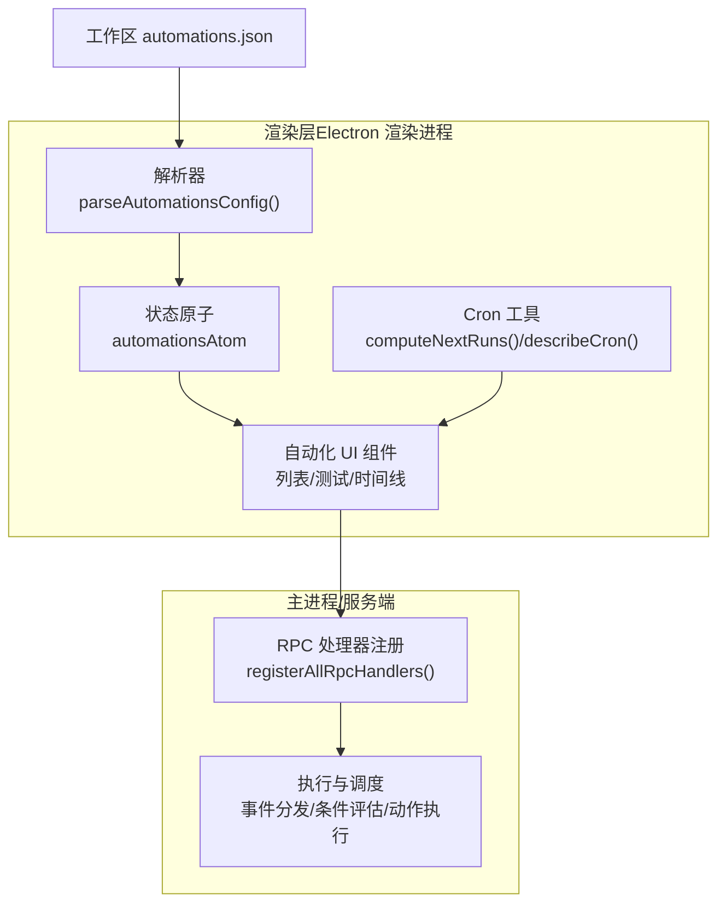
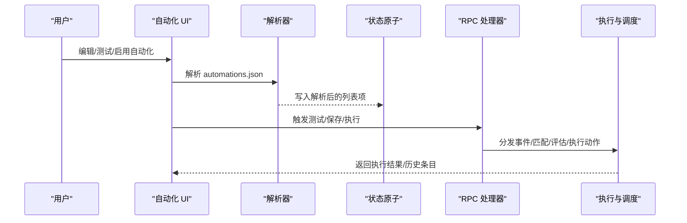
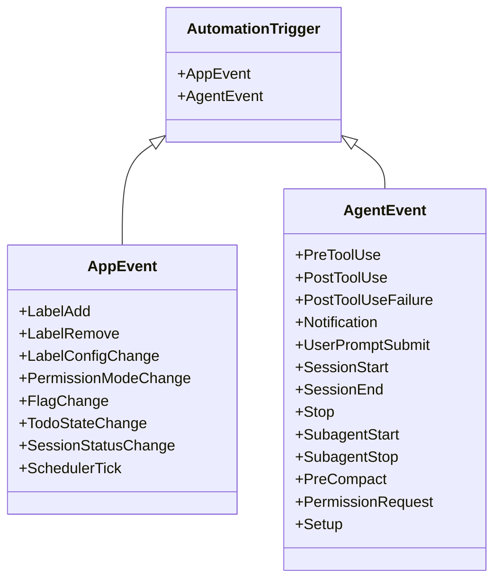
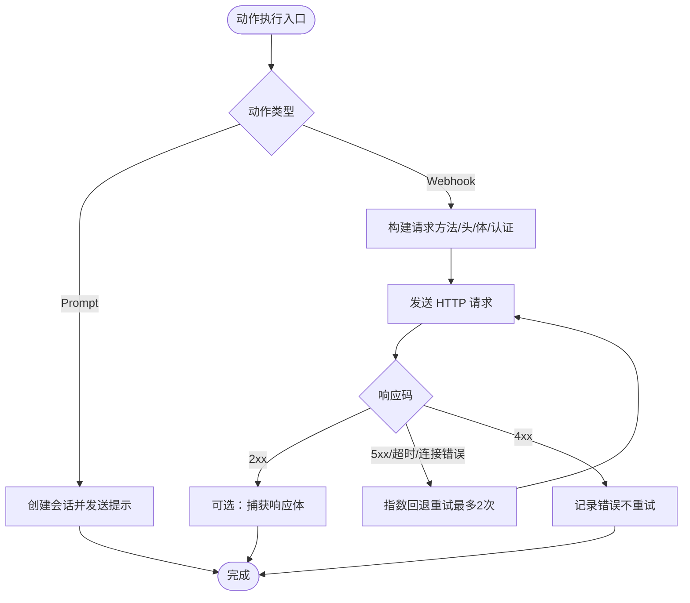
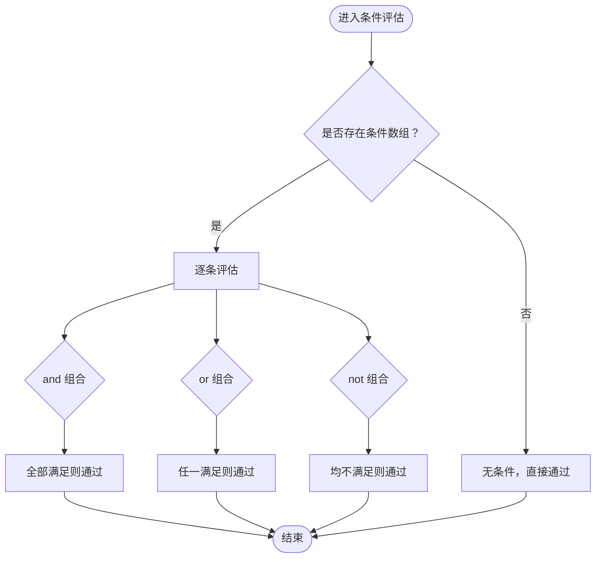
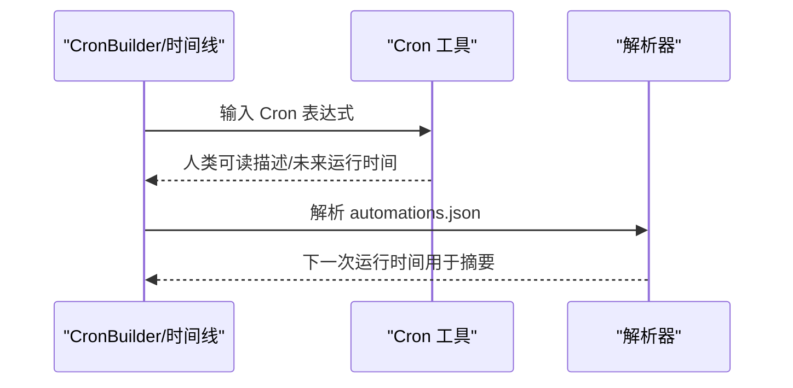
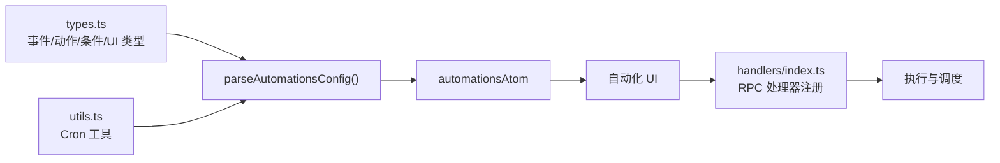

# 自动化系统

<cite>
**本文引用的文件**
- [apps/electron/resources/docs/automations.md](file://apps/electron/resources/docs/automations.md)
- [apps/electron/src/renderer/components/automations/types.ts](file://apps/electron/src/renderer/components/automations/types.ts)
- [apps/electron/src/renderer/components/automations/utils.ts](file://apps/electron/src/renderer/components/automations/utils.ts)
- [apps/electron/src/renderer/components/automations/constants.ts](file://apps/electron/src/renderer/components/automations/constants.ts)
- [apps/electron/src/renderer/atoms/automations.ts](file://apps/electron/src/renderer/atoms/automations.ts)
- [apps/electron/src/main/handlers/index.ts](file://apps/electron/src/main/handlers/index.ts)
</cite>

## 目录
1. [简介](#简介)
2. [项目结构](#项目结构)
3. [核心组件](#核心组件)
4. [架构总览](#架构总览)
5. [详细组件分析](#详细组件分析)
6. [依赖关系分析](#依赖关系分析)
7. [性能考量](#性能考量)
8. [故障排查指南](#故障排查指南)
9. [结论](#结论)
10. [附录](#附录)

## 简介
本技术文档面向需要构建智能工作流的高级用户与开发者，系统性阐述自动化系统的事件驱动架构、触发器系统、条件评估引擎、工作流设计与动作执行机制，并覆盖 Cron 调度、标签变更监听、工具使用追踪等事件类型。同时提供性能监控、执行日志与调试工具的使用方法，以及自定义自动化开发指南、复杂工作流设计模式与批量操作最佳实践。

## 项目结构
自动化系统由“配置文件 + 渲染层解析 + 执行与调度 + 主进程桥接”构成：
- 配置文件：工作区根目录下的 automations.json，描述事件、匹配器、条件与动作。
- 渲染层：负责解析配置、展示列表、可视化 Cron、测试与历史记录。
- 执行与调度：在渲染层进行预校验与可视化，在主进程或服务端完成实际执行（如通过 RPC 调用）。
- 主进程桥接：注册 RPC 处理器，承载 GUI 与核心能力的统一入口。

图表来源
- [apps/electron/src/renderer/components/automations/types.ts:427-470](file://apps/electron/src/renderer/components/automations/types.ts#L427-L470)
- [apps/electron/src/renderer/components/automations/utils.ts:56-63](file://apps/electron/src/renderer/components/automations/utils.ts#L56-L63)
- [apps/electron/src/renderer/atoms/automations.ts:9-16](file://apps/electron/src/renderer/atoms/automations.ts#L9-L16)
- [apps/electron/src/main/handlers/index.ts:19-22](file://apps/electron/src/main/handlers/index.ts#L19-L22)

章节来源
- [apps/electron/resources/docs/automations.md:1-800](file://apps/electron/resources/docs/automations.md#L1-L800)
- [apps/electron/src/renderer/components/automations/types.ts:1-508](file://apps/electron/src/renderer/components/automations/types.ts#L1-L508)
- [apps/electron/src/renderer/components/automations/utils.ts:1-64](file://apps/electron/src/renderer/components/automations/utils.ts#L1-L64)
- [apps/electron/src/renderer/atoms/automations.ts:1-17](file://apps/electron/src/renderer/atoms/automations.ts#L1-L17)
- [apps/electron/src/main/handlers/index.ts:1-23](file://apps/electron/src/main/handlers/index.ts#L1-L23)

## 核心组件
- 事件类型与触发器
  - 应用事件（App Events）：标签增删、标签配置变更、权限模式变更、标记变更、会话状态变更、定时器（SchedulerTick）。
  - 代理事件（Agent Events）：工具使用前后、通知、用户提交提示、会话开始/结束、停止、子代理生命周期、内存压缩前、权限请求、初始化等。
- 动作类型
  - 提示动作（Prompt）：创建新会话并发送提示；可指定 LLM 连接与模型。
  - Webhook 动作：向外部服务发起 HTTP 请求，支持多种方法、头部、体格式与认证方式。
- 条件评估引擎
  - 时间条件（time）：按星期、时间段与时区判断。
  - 状态条件（state）：基于事件载荷字段的精确匹配、转换（from/to）、数组包含、非等于等。
  - 逻辑组合（and/or/not）：支持最多 8 层嵌套。
- 解析与展示
  - 解析器将 automations.json 展平为 UI 列表项，计算下一次运行时间、生成摘要与显示名称。
  - Cron 工具提供人类可读描述与未来运行时间计算。
  - 默认 Webhook 方法常量用于 UI 行为一致性。

章节来源
- [apps/electron/resources/docs/automations.md:61-94](file://apps/electron/resources/docs/automations.md#L61-L94)
- [apps/electron/resources/docs/automations.md:95-213](file://apps/electron/resources/docs/automations.md#L95-L213)
- [apps/electron/resources/docs/automations.md:340-446](file://apps/electron/resources/docs/automations.md#L340-L446)
- [apps/electron/src/renderer/components/automations/types.ts:21-57](file://apps/electron/src/renderer/components/automations/types.ts#L21-L57)
- [apps/electron/src/renderer/components/automations/types.ts:59-75](file://apps/electron/src/renderer/components/automations/types.ts#L59-L75)
- [apps/electron/src/renderer/components/automations/types.ts:81-104](file://apps/electron/src/renderer/components/automations/types.ts#L81-L104)
- [apps/electron/src/renderer/components/automations/types.ts:427-470](file://apps/electron/src/renderer/components/automations/types.ts#L427-L470)
- [apps/electron/src/renderer/components/automations/utils.ts:30-51](file://apps/electron/src/renderer/components/automations/utils.ts#L30-L51)
- [apps/electron/src/renderer/components/automations/constants.ts:1-3](file://apps/electron/src/renderer/components/automations/constants.ts#L1-L3)

## 架构总览
自动化系统采用“配置即代码”的事件驱动架构：
- 配置层：工作区 automations.json 描述事件、匹配规则、条件与动作。
- 渲染层：解析配置、生成 UI 列表、可视化 Cron、提供测试与历史查看。
- 执行层：在主进程或服务端根据事件触发，先进行匹配与条件评估，再顺序执行动作。
- 通信层：通过 RPC 注册处理器，GUI 与核心能力统一接入。

图表来源
- [apps/electron/src/renderer/components/automations/types.ts:427-470](file://apps/electron/src/renderer/components/automations/types.ts#L427-L470)
- [apps/electron/src/renderer/atoms/automations.ts:9-16](file://apps/electron/src/renderer/atoms/automations.ts#L9-L16)
- [apps/electron/src/main/handlers/index.ts:19-22](file://apps/electron/src/main/handlers/index.ts#L19-L22)

## 详细组件分析

### 事件类型与触发器系统
- 支持的事件分为应用事件与代理事件两类，分别对应工作区状态变化与代理内部生命周期。
- 每个事件可配置正则匹配（除 SchedulerTick 使用 Cron），并可附加条件与动作。
- Cron 仅用于 SchedulerTick，支持分钟、小时、月内日、月份、周内日五段式表达式与 IANA 时区。

图表来源
- [apps/electron/src/renderer/components/automations/types.ts:21-57](file://apps/electron/src/renderer/components/automations/types.ts#L21-L57)

章节来源
- [apps/electron/resources/docs/automations.md:61-94](file://apps/electron/resources/docs/automations.md#L61-L94)
- [apps/electron/src/renderer/components/automations/types.ts:48-57](file://apps/electron/src/renderer/components/automations/types.ts#L48-L57)

### 动作执行机制
- 提示动作（Prompt）
  - 创建新会话并发送提示，可指定 LLM 连接与模型；未指定时回退到工作区默认值。
  - 支持环境变量扩展（如 $CRAFT_* 与 $CRAFT_WH_*）。
- Webhook 动作（Webhook）
  - 支持 GET/POST/PUT/PATCH/DELETE，JSON/form/raw 三种体格式，可设置自定义头部与认证（Bearer/Basic）。
  - 支持响应体捕获（截断至 4KB），便于审计与调试。
  - 具备两层重试策略：瞬时失败指数回退重试（2 次），随后持久化延迟队列重试（5 分钟、30 分钟、1 小时）。

图表来源
- [apps/electron/resources/docs/automations.md:132-213](file://apps/electron/resources/docs/automations.md#L132-L213)
- [apps/electron/resources/docs/automations.md:780-800](file://apps/electron/resources/docs/automations.md#L780-L800)

章节来源
- [apps/electron/resources/docs/automations.md:95-213](file://apps/electron/resources/docs/automations.md#L95-L213)
- [apps/electron/resources/docs/automations.md:780-800](file://apps/electron/resources/docs/automations.md#L780-L800)

### 条件评估引擎
- 时间条件（time）
  - 支持 after/before（含跨午夜范围）、weekday 白名单、时区覆盖。
- 状态条件（state）
  - 支持精确匹配、from/to 转换、数组包含（如标签存在）、非等于。
- 逻辑组合（and/or/not）
  - 子条件可任意嵌套，深度限制 8 层；未知类型视为失败（闭包）。

图表来源
- [apps/electron/resources/docs/automations.md:340-446](file://apps/electron/resources/docs/automations.md#L340-L446)
- [apps/electron/src/renderer/components/automations/types.ts:81-104](file://apps/electron/src/renderer/components/automations/types.ts#L81-L104)

章节来源
- [apps/electron/resources/docs/automations.md:340-446](file://apps/electron/resources/docs/automations.md#L340-L446)
- [apps/electron/src/renderer/components/automations/types.ts:81-104](file://apps/electron/src/renderer/components/automations/types.ts#L81-L104)

### Cron 调度与可视化
- Cron 表达式解析与人类可读描述，支持未来多次运行时间计算。
- UI 中提供 CronBuilder 可视化编辑与自动补全，结合时间线展示最近与下次运行。

图表来源
- [apps/electron/src/renderer/components/automations/utils.ts:30-51](file://apps/electron/src/renderer/components/automations/utils.ts#L30-L51)
- [apps/electron/src/renderer/components/automations/utils.ts:56-63](file://apps/electron/src/renderer/components/automations/utils.ts#L56-L63)
- [apps/electron/src/renderer/components/automations/types.ts:398-421](file://apps/electron/src/renderer/components/automations/types.ts#L398-L421)

章节来源
- [apps/electron/src/renderer/components/automations/utils.ts:1-64](file://apps/electron/src/renderer/components/automations/utils.ts#L1-L64)
- [apps/electron/src/renderer/components/automations/types.ts:398-421](file://apps/electron/src/renderer/components/automations/types.ts#L398-L421)

### 标签变更监听与工具使用追踪
- 标签变更：LabelAdd/LabelRemove 监听新增/移除的标签 ID，可配合正则匹配特定标签。
- 工具使用追踪：PreToolUse/PostToolUse/PostToolUseFailure 提供工具调用前后与失败场景的事件，便于审计与告警。
- 会话状态与权限：SessionStatusChange/PermissionModeChange 提供状态与权限切换的精细化控制。

章节来源
- [apps/electron/resources/docs/automations.md:61-94](file://apps/electron/resources/docs/automations.md#L61-L94)
- [apps/electron/resources/docs/automations.md:77-94](file://apps/electron/resources/docs/automations.md#L77-L94)

### 执行日志与历史记录
- 历史条目包含：自动化 ID、事件名、状态（成功/错误/阻塞）、耗时、时间戳、错误信息、动作摘要、会话 ID、Webhook 详情（方法、URL、状态码、耗时、尝试次数、错误、响应体）。
- UI 提供时间线视图，支持展开查看 Webhook 详情与响应体。

章节来源
- [apps/electron/src/renderer/components/automations/types.ts:244-273](file://apps/electron/src/renderer/components/automations/types.ts#L244-L273)

## 依赖关系分析
- 渲染层依赖
  - 类型与条件：types.ts 定义事件、动作、条件与 UI 显示所需的数据结构。
  - Cron 工具：utils.ts 提供 Cron 解析与未来运行时间计算。
  - 状态原子：automations.ts 作为 Jotai 原子存储解析后的自动化列表。
- 主进程桥接
  - handlers/index.ts 注册核心与 GUI 的 RPC 处理器，统一暴露给渲染层调用。

图表来源
- [apps/electron/src/renderer/components/automations/types.ts:427-470](file://apps/electron/src/renderer/components/automations/types.ts#L427-L470)
- [apps/electron/src/renderer/components/automations/utils.ts:56-63](file://apps/electron/src/renderer/components/automations/utils.ts#L56-L63)
- [apps/electron/src/renderer/atoms/automations.ts:9-16](file://apps/electron/src/renderer/atoms/automations.ts#L9-L16)
- [apps/electron/src/main/handlers/index.ts:19-22](file://apps/electron/src/main/handlers/index.ts#L19-L22)

章节来源
- [apps/electron/src/renderer/components/automations/types.ts:1-508](file://apps/electron/src/renderer/components/automations/types.ts#L1-L508)
- [apps/electron/src/renderer/components/automations/utils.ts:1-64](file://apps/electron/src/renderer/components/automations/utils.ts#L1-L64)
- [apps/electron/src/renderer/atoms/automations.ts:1-17](file://apps/electron/src/renderer/atoms/automations.ts#L1-L17)
- [apps/electron/src/main/handlers/index.ts:1-23](file://apps/electron/src/main/handlers/index.ts#L1-L23)

## 性能考量
- 配置解析与 UI 渲染
  - 解析器对每个匹配器生成列表项，建议避免在单事件下配置过多匹配器，以减少渲染压力。
  - Cron 计算仅在需要时触发（如 CronBuilder 或摘要生成），避免频繁计算。
- 动作执行
  - Webhook 响应体捕获会增加内存占用，仅在必要时开启。
  - 瞬时失败重试与持久化重试队列降低外部服务抖动影响，但需关注队列积压。
- 事件风暴防护
  - 对高频事件（如 SchedulerTick）建议使用 Cron 限流与条件过滤，避免重复执行。

## 故障排查指南
- 配置验证
  - 使用内置命令或工具验证 automations.json 的语法、事件名、正则、Cron、时区与动作有效性。
- 常见问题定位
  - Webhook 4xx：检查 URL、认证与请求体格式；确认捕获响应体有助于定位。
  - Webhook 5xx/超时：系统已自动重试；若持续失败，检查外部服务健康与网络连通。
  - 正则/条件不生效：确认匹配字符串大小写与转义；条件嵌套层级不超过 8。
- 调试工具
  - 使用 UI 的“测试”功能模拟事件，观察动作执行路径与输出。
  - 查看执行历史中的时间线与 Webhook 详情，定位失败原因。

章节来源
- [apps/electron/resources/docs/automations.md:747-780](file://apps/electron/resources/docs/automations.md#L747-L780)
- [apps/electron/resources/docs/automations.md:780-800](file://apps/electron/resources/docs/automations.md#L780-L800)

## 结论
该自动化系统以事件驱动为核心，通过清晰的配置文件、完善的条件评估与动作执行机制，覆盖从定时调度到标签与权限变更的多种场景。渲染层提供直观的可视化与测试能力，主进程通过 RPC 统一承接执行与调度。遵循本文的设计模式与最佳实践，可在保证性能与可观测性的前提下，构建复杂而可靠的智能工作流。

## 附录
- 自定义自动化开发指南
  - 使用 CLI 命令管理自动化（创建、更新、启用/禁用、复制、校验、测试、查看历史）。
  - 推荐优先使用 CLI，避免手写 JSON 错误。
- 复杂工作流设计模式
  - 使用逻辑组合（and/or/not）实现多条件联动；利用状态条件进行转换过滤。
  - 将 Webhook 与 Prompt 动作组合，形成“通知 + 处理”的闭环。
- 批量操作最佳实践
  - 合理拆分自动化，避免单条规则过于复杂；通过 Cron 与条件共同限流。
  - 对外部集成使用认证与响应体捕获，确保可追溯性与可维护性。

章节来源
- [apps/electron/resources/docs/automations.md:25-40](file://apps/electron/resources/docs/automations.md#L25-L40)
- [apps/electron/resources/docs/automations.md:483-684](file://apps/electron/resources/docs/automations.md#L483-L684)