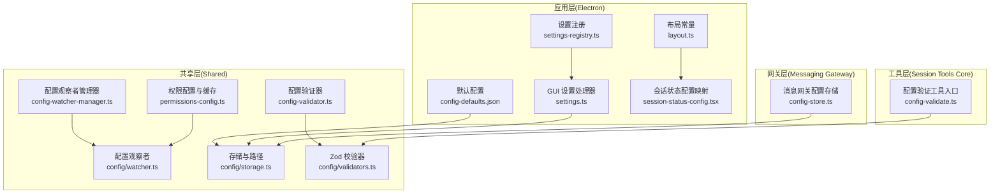
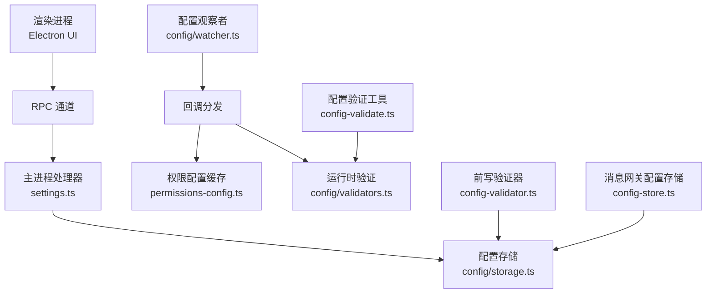
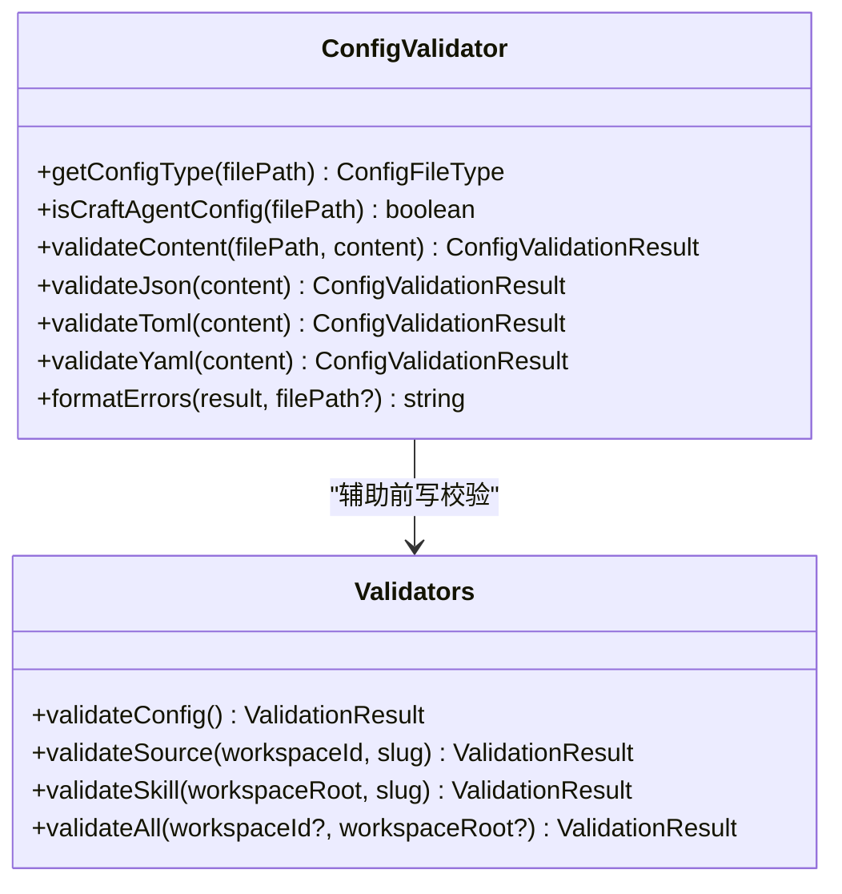
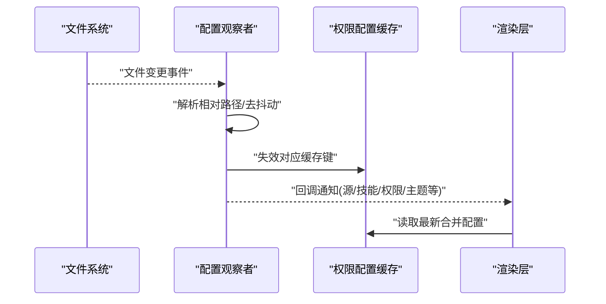
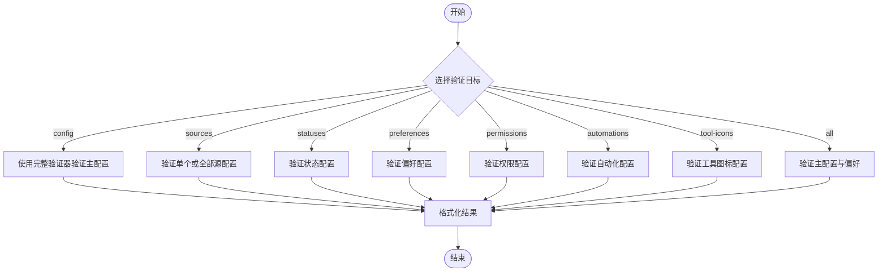
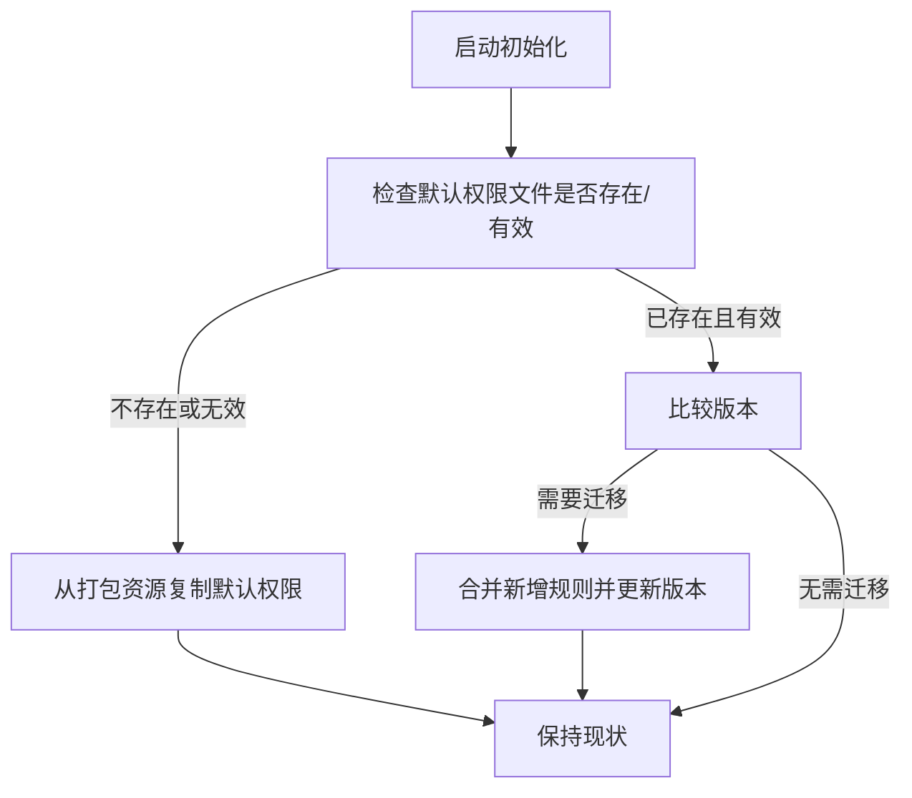
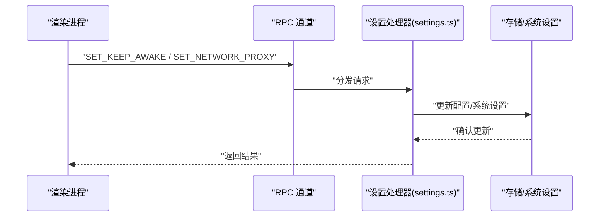
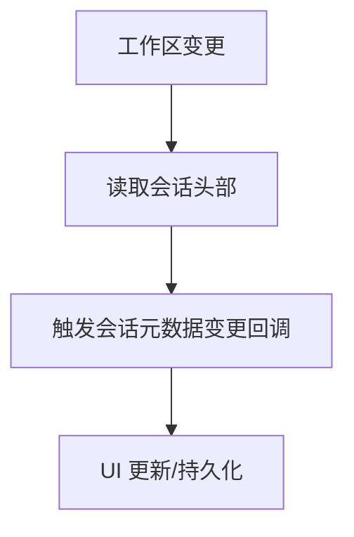
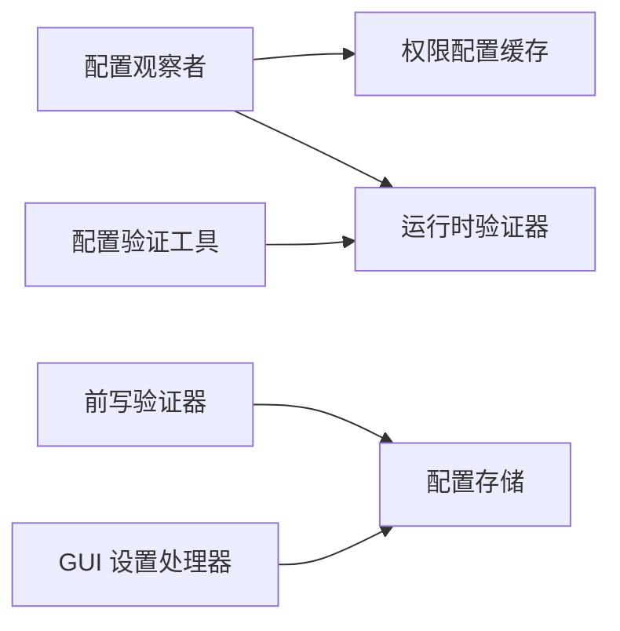

# 配置管理

<cite>
**本文引用的文件**
- [apps/electron/resources/config-defaults.json](file://apps/electron/resources/config-defaults.json)
- [apps/electron/src/main/handlers/settings.ts](file://apps/electron/src/main/handlers/settings.ts)
- [apps/electron/src/renderer/config/layout.ts](file://apps/electron/src/renderer/config/layout.ts)
- [apps/electron/src/renderer/config/session-status-config.tsx](file://apps/electron/src/renderer/config/session-status-config.tsx)
- [apps/electron/src/shared/settings-registry.ts](file://apps/electron/src/shared/settings-registry.ts)
- [apps/electron/src/shared/types.ts](file://apps/electron/src/shared/types.ts)
- [packages/messaging-gateway/src/config-store.ts](file://packages/messaging-gateway/src/config-store.ts)
- [packages/server-core/src/sessions/runtime-config.ts](file://packages/server-core/src/sessions/runtime-config.ts)
- [packages/session-tools-core/src/handlers/config-validate.ts](file://packages/session-tools-core/src/handlers/config-validate.ts)
- [packages/shared/src/agent/core/config-validator.ts](file://packages/shared/src/agent/core/config-validator.ts)
- [packages/shared/src/agent/core/config-watcher-manager.ts](file://packages/shared/src/agent/core/config-watcher-manager.ts)
- [packages/shared/src/agent/permissions-config.ts](file://packages/shared/src/agent/permissions-config.ts)
- [packages/shared/src/agent/permissions-config.ts](file://packages/shared/src/agent/permissions-config.ts)
- [packages/shared/src/config/storage.ts](file://packages/shared/src/config/storage.ts)
- [packages/shared/src/config/validators.ts](file://packages/shared/src/config/validators.ts)
- [packages/shared/src/config/watcher.ts](file://packages/shared/src/config/watcher.ts)
</cite>

## 目录
1. [简介](#简介)
2. [项目结构](#项目结构)
3. [核心组件](#核心组件)
4. [架构总览](#架构总览)
5. [详细组件分析](#详细组件分析)
6. [依赖分析](#依赖分析)
7. [性能考虑](#性能考虑)
8. [故障排查指南](#故障排查指南)
9. [结论](#结论)
10. [附录](#附录)

## 简介
本技术文档围绕自动化配置管理系统进行深入解析，覆盖配置文件结构与模式、字段约束与默认值、验证体系（合法性、依赖关系、运行时更新）、存储与检索（路径解析、缓存策略、热重载）、历史记录管理（执行历史存储与清理）、迁移与版本兼容、备份与恢复，以及最佳实践与常见问题诊断。

## 项目结构
该系统在多端（Electron 主进程、渲染进程、共享包）中协同工作，形成“配置模式定义—验证—存储—监听—热重载—UI 同步”的闭环。关键模块分布如下：
- 应用层（Electron）
  - 默认配置与设置注册：应用默认配置、设置页面注册、GUI 设置处理器
  - 渲染层配置：布局常量、会话状态配置映射
- 共享层（Shared）
  - 配置验证器、配置观察者、权限配置、存储与路径、Zod 模式校验
- 工具层（Session Tools Core）
  - 配置验证工具调用入口
- 网关层（Messaging Gateway）
  - 工作区级消息网关配置持久化

图表来源
- [apps/electron/resources/config-defaults.json:1-24](file://apps/electron/resources/config-defaults.json#L1-L24)
- [apps/electron/src/shared/settings-registry.ts:1-77](file://apps/electron/src/shared/settings-registry.ts#L1-L77)
- [apps/electron/src/main/handlers/settings.ts:1-31](file://apps/electron/src/main/handlers/settings.ts#L1-L31)
- [apps/electron/src/renderer/config/layout.ts:1-10](file://apps/electron/src/renderer/config/layout.ts#L1-L10)
- [apps/electron/src/renderer/config/session-status-config.tsx:1-176](file://apps/electron/src/renderer/config/session-status-config.tsx#L1-L176)
- [packages/shared/src/agent/core/config-validator.ts:1-301](file://packages/shared/src/agent/core/config-validator.ts#L1-L301)
- [packages/shared/src/agent/core/config-watcher-manager.ts:1-267](file://packages/shared/src/agent/core/config-watcher-manager.ts#L1-L267)
- [packages/shared/src/config/watcher.ts:1-1130](file://packages/shared/src/config/watcher.ts#L1-L1130)
- [packages/shared/src/agent/permissions-config.ts:1-935](file://packages/shared/src/agent/permissions-config.ts#L1-L935)
- [packages/shared/src/config/storage.ts:1-200](file://packages/shared/src/config/storage.ts#L1-L200)
- [packages/shared/src/config/validators.ts:1-800](file://packages/shared/src/config/validators.ts#L1-L800)
- [packages/session-tools-core/src/handlers/config-validate.ts:1-193](file://packages/session-tools-core/src/handlers/config-validate.ts#L1-L193)
- [packages/messaging-gateway/src/config-store.ts:1-112](file://packages/messaging-gateway/src/config-store.ts#L1-L112)

章节来源
- [apps/electron/resources/config-defaults.json:1-24](file://apps/electron/resources/config-defaults.json#L1-L24)
- [apps/electron/src/shared/settings-registry.ts:1-77](file://apps/electron/src/shared/settings-registry.ts#L1-L77)
- [apps/electron/src/main/handlers/settings.ts:1-31](file://apps/electron/src/main/handlers/settings.ts#L1-L31)
- [apps/electron/src/renderer/config/layout.ts:1-10](file://apps/electron/src/renderer/config/layout.ts#L1-L10)
- [apps/electron/src/renderer/config/session-status-config.tsx:1-176](file://apps/electron/src/renderer/config/session-status-config.tsx#L1-L176)
- [packages/shared/src/agent/core/config-validator.ts:1-301](file://packages/shared/src/agent/core/config-validator.ts#L1-L301)
- [packages/shared/src/agent/core/config-watcher-manager.ts:1-267](file://packages/shared/src/agent/core/config-watcher-manager.ts#L1-L267)
- [packages/shared/src/config/watcher.ts:1-1130](file://packages/shared/src/config/watcher.ts#L1-L1130)
- [packages/shared/src/agent/permissions-config.ts:1-935](file://packages/shared/src/agent/permissions-config.ts#L1-L935)
- [packages/shared/src/config/storage.ts:1-200](file://packages/shared/src/config/storage.ts#L1-L200)
- [packages/shared/src/config/validators.ts:1-800](file://packages/shared/src/config/validators.ts#L1-L800)
- [packages/session-tools-core/src/handlers/config-validate.ts:1-193](file://packages/session-tools-core/src/handlers/config-validate.ts#L1-L193)
- [packages/messaging-gateway/src/config-store.ts:1-112](file://packages/messaging-gateway/src/config-store.ts#L1-L112)

## 核心组件
- 配置模式与默认值
  - 应用默认配置集中于资源文件，定义全局与工作区默认项，作为初始与回退依据
  - 设置注册表统一管理设置页面元信息，确保路由与校验一致性
- 配置验证系统
  - 前写验证：检测文件类型、语法与格式，提供错误/警告信息
  - 运行时验证：Zod 模式校验主配置、偏好、源、技能、权限等，支持语义校验与建议
- 存储与检索
  - 统一存储接口负责读取/写入配置，路径解析与迁移逻辑内嵌
  - 权限配置具备内存缓存与失效策略，配合观察者实现热重载
- 监听与热重载
  - 观察者递归监听工作区与应用级配置目录，按文件粒度触发回调
  - 观察者管理器封装回调，屏蔽底层细节，支持调试日志
- 历史记录与执行追踪
  - 会话元数据变更监听，仅读取头部以降低开销
  - 自动化执行历史可查询与回放，便于审计与排障
- 迁移与版本兼容
  - 权限配置自动同步默认规则，缺失或损坏时从打包资源恢复
  - 消息网关配置支持一次性从旧位置迁移至新位置
- 备份与恢复
  - 提供导出/导入资源能力，用于跨工作区迁移与备份

章节来源
- [apps/electron/resources/config-defaults.json:1-24](file://apps/electron/resources/config-defaults.json#L1-L24)
- [apps/electron/src/shared/settings-registry.ts:1-77](file://apps/electron/src/shared/settings-registry.ts#L1-L77)
- [packages/shared/src/agent/core/config-validator.ts:1-301](file://packages/shared/src/agent/core/config-validator.ts#L1-L301)
- [packages/shared/src/config/validators.ts:1-800](file://packages/shared/src/config/validators.ts#L1-L800)
- [packages/shared/src/config/storage.ts:1-200](file://packages/shared/src/config/storage.ts#L1-L200)
- [packages/shared/src/agent/permissions-config.ts:1-935](file://packages/shared/src/agent/permissions-config.ts#L1-L935)
- [packages/shared/src/config/watcher.ts:1-1130](file://packages/shared/src/config/watcher.ts#L1-L1130)
- [packages/shared/src/agent/core/config-watcher-manager.ts:1-267](file://packages/shared/src/agent/core/config-watcher-manager.ts#L1-L267)
- [packages/messaging-gateway/src/config-store.ts:1-112](file://packages/messaging-gateway/src/config-store.ts#L1-L112)
- [packages/server-core/src/sessions/runtime-config.ts:1-200](file://packages/server-core/src/sessions/runtime-config.ts#L1-L200)
- [apps/electron/src/shared/types.ts:1-800](file://apps/electron/src/shared/types.ts#L1-L800)

## 架构总览
系统采用分层设计：应用层负责用户交互与默认配置；共享层提供通用验证、存储、观察与权限模型；工具层提供配置验证工具；网关层提供工作区级配置持久化。配置变更通过观察者触发回调，结合缓存与路径解析实现高效热重载。

图表来源
- [apps/electron/src/main/handlers/settings.ts:1-31](file://apps/electron/src/main/handlers/settings.ts#L1-L31)
- [packages/shared/src/config/storage.ts:1-200](file://packages/shared/src/config/storage.ts#L1-L200)
- [packages/shared/src/config/watcher.ts:1-1130](file://packages/shared/src/config/watcher.ts#L1-L1130)
- [packages/shared/src/agent/permissions-config.ts:1-935](file://packages/shared/src/agent/permissions-config.ts#L1-L935)
- [packages/shared/src/config/validators.ts:1-800](file://packages/shared/src/config/validators.ts#L1-L800)
- [packages/shared/src/agent/core/config-validator.ts:1-301](file://packages/shared/src/agent/core/config-validator.ts#L1-L301)
- [packages/session-tools-core/src/handlers/config-validate.ts:1-193](file://packages/session-tools-core/src/handlers/config-validate.ts#L1-L193)
- [packages/messaging-gateway/src/config-store.ts:1-112](file://packages/messaging-gateway/src/config-store.ts#L1-L112)

## 详细组件分析

### 组件A：配置验证系统
- 前写验证（ConfigValidator）
  - 文件类型识别（JSON/TOML/YAML），对未知类型返回“无需验证”
  - JSON：语法解析并尝试定位行列号
  - TOML/YAML：基础语法检查与告警
- 运行时验证（Zod 模式）
  - 主配置：工作区、连接、默认思考级别等
  - 源配置：类型特定块校验、传输参数校验
  - 技能配置：Frontmatter 结构与非空体校验
  - 权限配置：正则有效性、组合合法性、建议提示
- 验证结果
  - 统一结构包含错误、警告与修复建议，便于 UI 展示

图表来源
- [packages/shared/src/agent/core/config-validator.ts:1-301](file://packages/shared/src/agent/core/config-validator.ts#L1-L301)
- [packages/shared/src/config/validators.ts:1-800](file://packages/shared/src/config/validators.ts#L1-L800)

章节来源
- [packages/shared/src/agent/core/config-validator.ts:1-301](file://packages/shared/src/agent/core/config-validator.ts#L1-L301)
- [packages/shared/src/config/validators.ts:1-800](file://packages/shared/src/config/validators.ts#L1-L800)

### 组件B：配置存储与热重载
- 路径解析与存储
  - 统一配置目录与文件路径，提供读写与迁移
  - 支持一次性从旧位置迁移至新位置（消息网关配置）
- 缓存策略
  - 权限配置内存缓存，按上下文键缓存合并结果，文件变更时精确失效
- 热重载
  - 观察者递归监听工作区与应用级目录，按文件粒度触发回调
  - 观察者管理器封装回调，屏蔽底层细节，支持调试日志
  - 会话元数据变更仅读取头部，避免大文件扫描

图表来源
- [packages/shared/src/config/watcher.ts:1-1130](file://packages/shared/src/config/watcher.ts#L1-L1130)
- [packages/shared/src/agent/permissions-config.ts:1-935](file://packages/shared/src/agent/permissions-config.ts#L1-L935)
- [packages/shared/src/agent/core/config-watcher-manager.ts:1-267](file://packages/shared/src/agent/core/config-watcher-manager.ts#L1-L267)

章节来源
- [packages/shared/src/config/storage.ts:1-200](file://packages/shared/src/config/storage.ts#L1-L200)
- [packages/shared/src/config/watcher.ts:1-1130](file://packages/shared/src/config/watcher.ts#L1-L1130)
- [packages/shared/src/agent/permissions-config.ts:1-935](file://packages/shared/src/agent/permissions-config.ts#L1-L935)
- [packages/shared/src/agent/core/config-watcher-manager.ts:1-267](file://packages/shared/src/agent/core/config-watcher-manager.ts#L1-L267)
- [packages/messaging-gateway/src/config-store.ts:1-112](file://packages/messaging-gateway/src/config-store.ts#L1-L112)

### 组件C：配置验证工具（Session Tools Core）
- 工具入口
  - 支持目标：config、sources、statuses、preferences、permissions、automations、tool-icons、all
  - 若存在完整验证器（Claude），优先使用；否则回退到基础 JSON 字段检查
- 结果格式化
  - 将验证结果转换为可展示字符串，便于工具输出

图表来源
- [packages/session-tools-core/src/handlers/config-validate.ts:1-193](file://packages/session-tools-core/src/handlers/config-validate.ts#L1-L193)

章节来源
- [packages/session-tools-core/src/handlers/config-validate.ts:1-193](file://packages/session-tools-core/src/handlers/config-validate.ts#L1-L193)

### 组件D：权限配置与迁移
- 默认权限同步
  - 启动时从打包资源复制默认权限，若安装版本较旧则合并新增规则并更新版本
- 用户自定义
  - 工作区与源级权限文件可扩展默认规则，规则累加更宽松
- 缓存与失效
  - 内存缓存合并结果，文件变更时按作用域精确失效
- 迁移
  - 自动检测并迁移默认权限文件，异常时自动修复

图表来源
- [packages/shared/src/agent/permissions-config.ts:1-935](file://packages/shared/src/agent/permissions-config.ts#L1-L935)

章节来源
- [packages/shared/src/agent/permissions-config.ts:1-935](file://packages/shared/src/agent/permissions-config.ts#L1-L935)

### 组件E：GUI 设置与运行时更新
- GUI 设置处理器
  - 保持唤醒、网络代理等设置通过 RPC 通道更新并即时生效
- 设置注册表
  - 单一真相源，统一设置页面定义、路由与校验派生

图表来源
- [apps/electron/src/main/handlers/settings.ts:1-31](file://apps/electron/src/main/handlers/settings.ts#L1-L31)
- [apps/electron/src/shared/settings-registry.ts:1-77](file://apps/electron/src/shared/settings-registry.ts#L1-L77)
- [apps/electron/src/shared/types.ts:1-800](file://apps/electron/src/shared/types.ts#L1-L800)

章节来源
- [apps/electron/src/main/handlers/settings.ts:1-31](file://apps/electron/src/main/handlers/settings.ts#L1-L31)
- [apps/electron/src/shared/settings-registry.ts:1-77](file://apps/electron/src/shared/settings-registry.ts#L1-L77)
- [apps/electron/src/shared/types.ts:1-800](file://apps/electron/src/shared/types.ts#L1-L800)

### 组件F：历史记录与执行追踪
- 会话元数据变更
  - 仅读取 session.jsonl 的头部，避免全量解析
- 自动化执行历史
  - 可查询执行时间、结果、错误与 Webhook 状态，支持回放

图表来源
- [packages/shared/src/config/watcher.ts:1-1130](file://packages/shared/src/config/watcher.ts#L1-L1130)
- [packages/server-core/src/sessions/runtime-config.ts:1-200](file://packages/server-core/src/sessions/runtime-config.ts#L1-L200)

章节来源
- [packages/shared/src/config/watcher.ts:1-1130](file://packages/shared/src/config/watcher.ts#L1-L1130)
- [packages/server-core/src/sessions/runtime-config.ts:1-200](file://packages/server-core/src/sessions/runtime-config.ts#L1-L200)

## 依赖分析
- 组件耦合
  - 观察者与权限缓存强耦合：文件变更驱动缓存失效
  - 验证器与存储解耦：前写验证独立于存储实现
  - GUI 设置处理器依赖存储与系统能力（如电源管理、网络代理）
- 外部依赖
  - Zod 用于严格模式校验
  - Gray-matter 用于技能 Frontmatter 解析
  - 文件系统监听（fs.watch）与去抖动策略

图表来源
- [packages/shared/src/config/watcher.ts:1-1130](file://packages/shared/src/config/watcher.ts#L1-L1130)
- [packages/shared/src/agent/permissions-config.ts:1-935](file://packages/shared/src/agent/permissions-config.ts#L1-L935)
- [packages/shared/src/agent/core/config-validator.ts:1-301](file://packages/shared/src/agent/core/config-validator.ts#L1-L301)
- [packages/shared/src/config/validators.ts:1-800](file://packages/shared/src/config/validators.ts#L1-L800)
- [apps/electron/src/main/handlers/settings.ts:1-31](file://apps/electron/src/main/handlers/settings.ts#L1-L31)
- [packages/session-tools-core/src/handlers/config-validate.ts:1-193](file://packages/session-tools-core/src/handlers/config-validate.ts#L1-L193)

章节来源
- [packages/shared/src/config/watcher.ts:1-1130](file://packages/shared/src/config/watcher.ts#L1-L1130)
- [packages/shared/src/agent/permissions-config.ts:1-935](file://packages/shared/src/agent/permissions-config.ts#L1-L935)
- [packages/shared/src/agent/core/config-validator.ts:1-301](file://packages/shared/src/agent/core/config-validator.ts#L1-L301)
- [packages/shared/src/config/validators.ts:1-800](file://packages/shared/src/config/validators.ts#L1-L800)
- [apps/electron/src/main/handlers/settings.ts:1-31](file://apps/electron/src/main/handlers/settings.ts#L1-L31)
- [packages/session-tools-core/src/handlers/config-validate.ts:1-193](file://packages/session-tools-core/src/handlers/config-validate.ts#L1-L193)

## 性能考虑
- 监听与去抖动
  - 对频繁写入场景（Windows 上原子写）采用更长去抖间隔，减少重复处理
- 轻量读取
  - 会话元数据仅读取头部，避免大文件扫描
- 缓存命中
  - 权限配置按上下文键缓存，文件变更时精确失效，避免全量重建
- 路径解析与迁移
  - 统一路径解析，迁移逻辑仅在首次缺失或损坏时执行

[本节为通用指导，不直接分析具体文件]

## 故障排查指南
- 配置无法加载
  - 检查配置文件是否存在与 JSON 语法是否正确
  - 使用运行时验证器查看错误与建议
- 权限规则未生效
  - 确认默认权限文件是否被迁移或损坏，必要时重新同步默认权限
  - 查看权限缓存是否被正确失效
- 设置未生效
  - 确认 GUI 设置处理器是否收到 RPC 请求并成功更新系统设置
- 验证工具报错
  - 使用工具入口提供的格式化结果定位具体文件与字段
- 热重载不触发
  - 检查观察者是否在运行，确认文件路径是否匹配监听范围

章节来源
- [packages/shared/src/config/validators.ts:1-800](file://packages/shared/src/config/validators.ts#L1-L800)
- [packages/shared/src/agent/permissions-config.ts:1-935](file://packages/shared/src/agent/permissions-config.ts#L1-L935)
- [apps/electron/src/main/handlers/settings.ts:1-31](file://apps/electron/src/main/handlers/settings.ts#L1-L31)
- [packages/session-tools-core/src/handlers/config-validate.ts:1-193](file://packages/session-tools-core/src/handlers/config-validate.ts#L1-L193)
- [packages/shared/src/config/watcher.ts:1-1130](file://packages/shared/src/config/watcher.ts#L1-L1130)

## 结论
该配置管理系统通过“模式定义—验证—存储—监听—热重载—UI 同步”的完整链路，实现了高可用、可维护的自动化配置管理。其关键优势在于严格的模式校验、灵活的缓存与失效策略、稳健的迁移与恢复机制，以及对性能与用户体验的细致考量。

[本节为总结性内容，不直接分析具体文件]

## 附录
- 最佳实践
  - 使用前写验证器在写入前进行语法与格式检查
  - 优先使用运行时验证器进行语义校验与建议
  - 利用观察者与缓存实现低开销热重载
  - 定期导出资源进行备份，确保可恢复
- 常见配置模式
  - 主配置：工作区列表、活动工作区、LLM 连接与默认思考级别
  - 源配置：MCP/API/本地三类传输参数与品牌信息
  - 技能配置：Frontmatter 必填字段与图标规范
  - 权限配置：默认规则与工作区/源级扩展
- 常见问题与修复
  - 配置损坏：使用默认权限同步或从打包资源恢复
  - 验证失败：根据错误路径修正字段或参考建议
  - 热重载异常：检查观察者状态与文件路径匹配

[本节为通用指导，不直接分析具体文件]