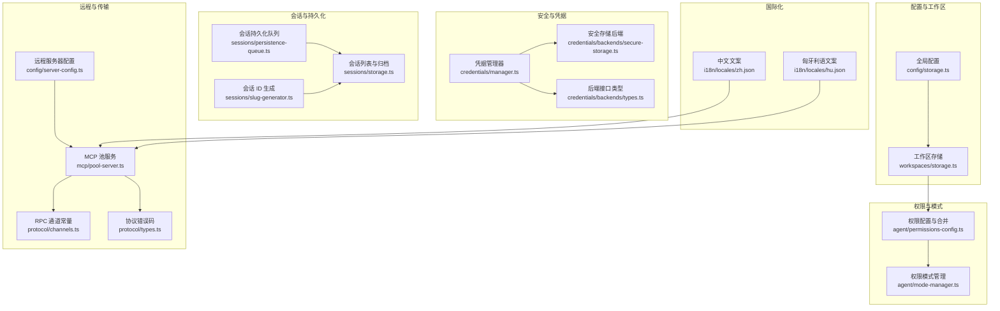
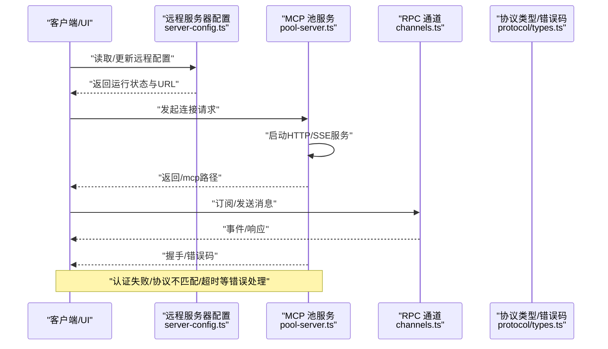
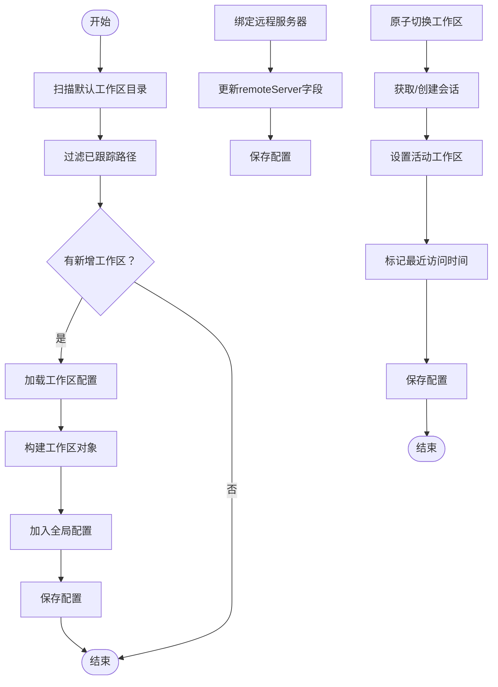
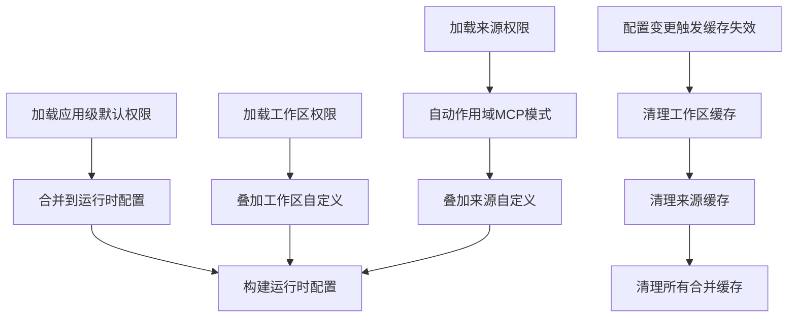
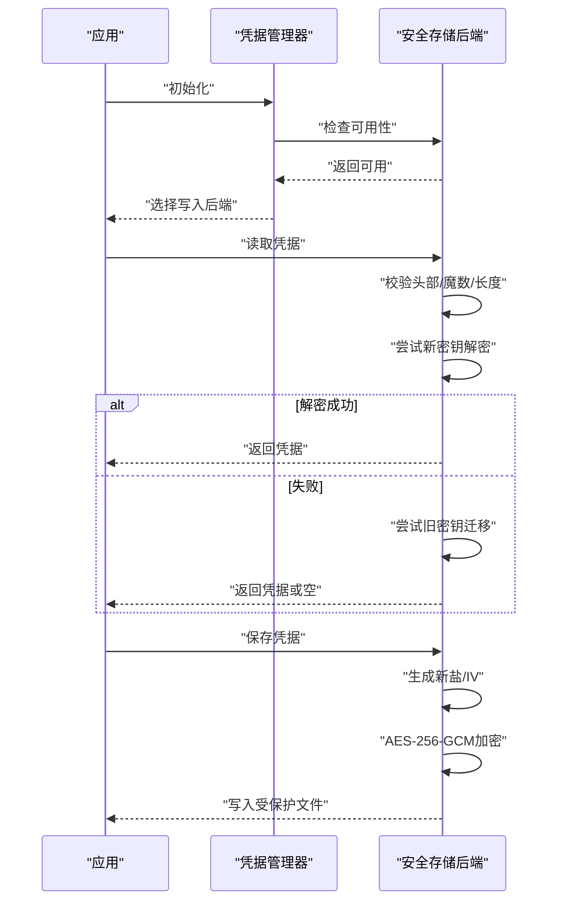
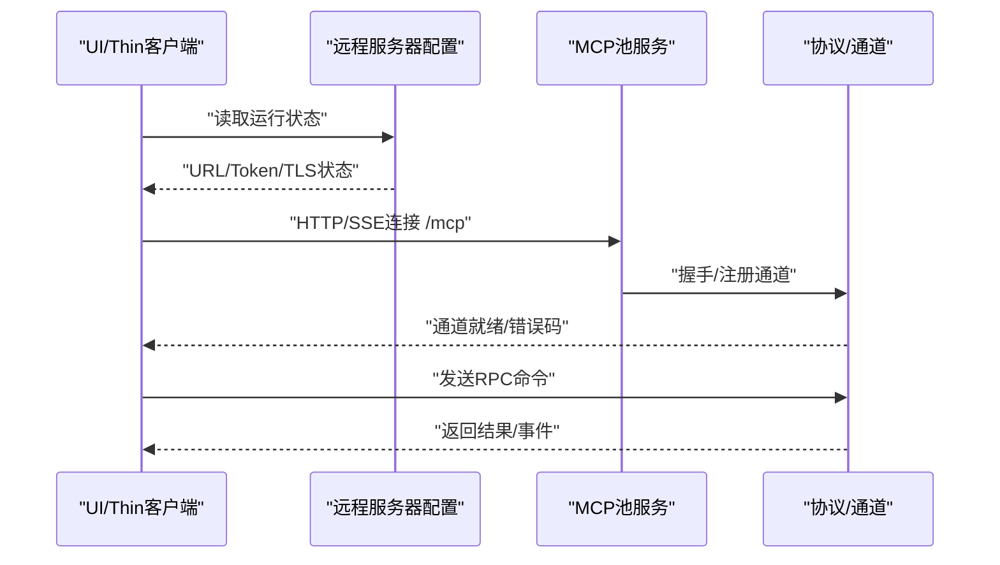
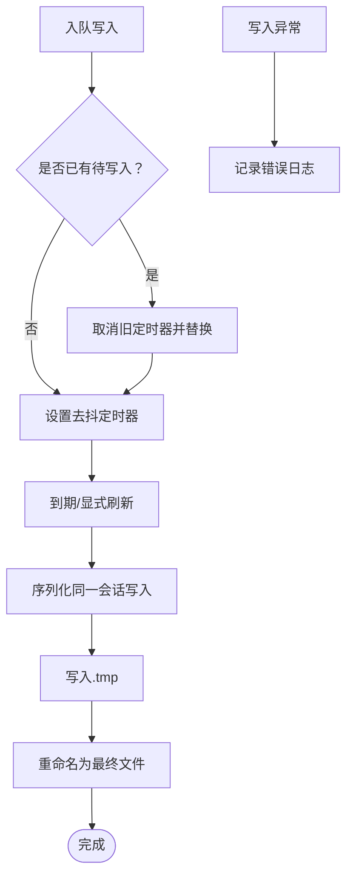
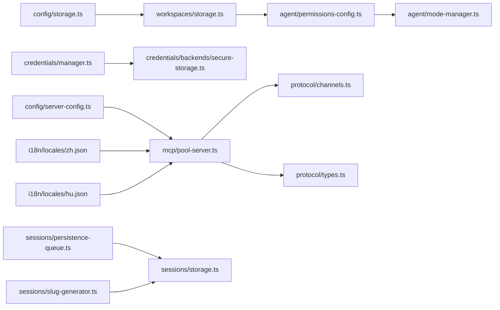

# 工作区共享

<cite>
**本文引用的文件**
- [packages/shared/src/config/storage.ts](file://packages/shared/src/config/storage.ts)
- [packages/shared/src/workspaces/storage.ts](file://packages/shared/src/workspaces/storage.ts)
- [packages/shared/src/agent/permissions-config.ts](file://packages/shared/src/agent/permissions-config.ts)
- [packages/shared/src/agent/mode-manager.ts](file://packages/shared/src/agent/mode-manager.ts)
- [packages/shared/src/credentials/manager.ts](file://packages/shared/src/credentials/manager.ts)
- [packages/shared/src/credentials/backends/secure-storage.ts](file://packages/shared/src/credentials/backends/secure-storage.ts)
- [packages/shared/src/credentials/backends/types.ts](file://packages/shared/src/credentials/backends/types.ts)
- [packages/shared/src/config/server-config.ts](file://packages/shared/src/config/server-config.ts)
- [packages/shared/src/mcp/pool-server.ts](file://packages/shared/src/mcp/pool-server.ts)
- [packages/shared/src/sessions/persistence-queue.ts](file://packages/shared/src/sessions/persistence-queue.ts)
- [packages/shared/src/i18n/locales/zh.json](file://packages/shared/src/i18n/locales/zh.json)
- [packages/shared/src/i18n/locales/hu.json](file://packages/shared/src/i18n/locales/hu.json)
- [packages/shared/src/protocol/channels.ts](file://packages/shared/src/protocol/channels.ts)
- [packages/shared/src/protocol/types.ts](file://packages/shared/src/protocol/types.ts)
- [packages/shared/src/sessions/slug-generator.ts](file://packages/shared/src/sessions/slug-generator.ts)
- [packages/shared/src/sessions/storage.ts](file://packages/shared/src/sessions/storage.ts)
</cite>

## 目录
1. [简介](#简介)
2. [项目结构](#项目结构)
3. [核心组件](#核心组件)
4. [架构总览](#架构总览)
5. [详细组件分析](#详细组件分析)
6. [依赖关系分析](#依赖关系分析)
7. [性能考量](#性能考量)
8. [故障排查指南](#故障排查指南)
9. [结论](#结论)
10. [附录](#附录)

## 简介
本文件系统性阐述“工作区共享”的设计与实现，覆盖远程工作区连接、SSH 配置与网络权限、安全机制（身份验证与访问控制）、同步策略与冲突处理、版本管理、团队协作中的权限与角色、审计日志、配置模板、连接测试与故障诊断，以及网络安全、数据加密与备份策略。内容基于仓库中与工作区、权限、传输、会话持久化等相关的源码进行归纳总结。

## 项目结构
工作区共享能力由多模块协同实现：
- 全局配置与工作区管理：负责工作区的增删改查、默认位置、远程服务器绑定、活动工作区切换等。
- 权限与模式：定义工作区与来源的权限规则、运行模式（安全/询问/允许全部）及切换逻辑。
- 凭据与安全：提供安全存储后端，使用硬件唯一标识派生密钥，AES-256-GCM 加密凭证文件。
- 远程服务与传输：支持本地 MCP 池服务、HTTP/SSE 通道、远程服务器模式（可启用 TLS），并提供稳定认证令牌。
- 会话持久化：通过去抖队列异步写入，保证并发安全与性能。
- 国际化与协议：提供连接状态文案与 RPC 通道常量，便于 UI 展示与客户端交互。

图表来源
- [packages/shared/src/config/storage.ts:670-869](file://packages/shared/src/config/storage.ts#L670-L869)
- [packages/shared/src/workspaces/storage.ts:1-533](file://packages/shared/src/workspaces/storage.ts#L1-L533)
- [packages/shared/src/agent/permissions-config.ts:568-935](file://packages/shared/src/agent/permissions-config.ts#L568-L935)
- [packages/shared/src/agent/mode-manager.ts:224-302](file://packages/shared/src/agent/mode-manager.ts#L224-L302)
- [packages/shared/src/credentials/manager.ts:35-79](file://packages/shared/src/credentials/manager.ts#L35-L79)
- [packages/shared/src/credentials/backends/secure-storage.ts:1-310](file://packages/shared/src/credentials/backends/secure-storage.ts#L1-L310)
- [packages/shared/src/config/server-config.ts:1-44](file://packages/shared/src/config/server-config.ts#L1-L44)
- [packages/shared/src/mcp/pool-server.ts:35-178](file://packages/shared/src/mcp/pool-server.ts#L35-L178)
- [packages/shared/src/sessions/persistence-queue.ts:59-244](file://packages/shared/src/sessions/persistence-queue.ts#L59-L244)
- [packages/shared/src/i18n/locales/zh.json](file://packages/shared/src/i18n/locales/zh.json)
- [packages/shared/src/i18n/locales/hu.json](file://packages/shared/src/i18n/locales/hu.json)
- [packages/shared/src/protocol/channels.ts:1-37](file://packages/shared/src/protocol/channels.ts#L1-L37)
- [packages/shared/src/protocol/types.ts:43-80](file://packages/shared/src/protocol/types.ts#L43-L80)

章节来源
- [packages/shared/src/config/storage.ts:670-869](file://packages/shared/src/config/storage.ts#L670-L869)
- [packages/shared/src/workspaces/storage.ts:1-533](file://packages/shared/src/workspaces/storage.ts#L1-L533)

## 核心组件
- 全局配置与工作区管理
  - 提供工作区的创建、发现、同步、删除、远程服务器绑定、活动工作区切换等功能。
  - 支持在默认目录自动发现并同步工作区，避免重复跟踪。
- 权限与模式
  - 默认安全模式与可循环模式（安全/询问/允许全部），支持按工作区与来源叠加自定义规则。
  - 模式状态按会话隔离，支持上次模式记录与版本号递增。
- 安全与凭据
  - 使用硬件 UUID 派生加密密钥，AES-256-GCM 加密凭证文件；支持迁移旧格式。
  - 后端接口抽象，便于扩展不同平台的密钥/钥匙串存储。
- 远程与传输
  - 支持固定端口监听（0.0.0.0），可选 TLS；内置稳定认证令牌；HTTP/SSE 通道。
  - MCP 池服务以无状态模式对外提供工具发现与调用。
- 会话持久化
  - 去抖队列异步写入，序列化同一会话的并发写入，防止竞态与临时文件冲突。
- 国际化与协议
  - 提供连接状态文案（连接中/失败/重连等），RPC 通道命名空间清晰。

章节来源
- [packages/shared/src/config/storage.ts:670-869](file://packages/shared/src/config/storage.ts#L670-L869)
- [packages/shared/src/agent/permissions-config.ts:568-935](file://packages/shared/src/agent/permissions-config.ts#L568-L935)
- [packages/shared/src/agent/mode-manager.ts:224-302](file://packages/shared/src/agent/mode-manager.ts#L224-L302)
- [packages/shared/src/credentials/manager.ts:35-79](file://packages/shared/src/credentials/manager.ts#L35-L79)
- [packages/shared/src/credentials/backends/secure-storage.ts:1-310](file://packages/shared/src/credentials/backends/secure-storage.ts#L1-L310)
- [packages/shared/src/config/server-config.ts:1-44](file://packages/shared/src/config/server-config.ts#L1-L44)
- [packages/shared/src/mcp/pool-server.ts:35-178](file://packages/shared/src/mcp/pool-server.ts#L35-L178)
- [packages/shared/src/sessions/persistence-queue.ts:59-244](file://packages/shared/src/sessions/persistence-queue.ts#L59-L244)
- [packages/shared/src/i18n/locales/zh.json](file://packages/shared/src/i18n/locales/zh.json)
- [packages/shared/src/i18n/locales/hu.json](file://packages/shared/src/i18n/locales/hu.json)
- [packages/shared/src/protocol/channels.ts:1-37](file://packages/shared/src/protocol/channels.ts#L1-L37)
- [packages/shared/src/protocol/types.ts:43-80](file://packages/shared/src/protocol/types.ts#L43-L80)

## 架构总览
工作区共享涉及“本地工作区”与“远程工作区”的协同：
- 本地工作区：存储于用户主目录下，包含会话、技能、标签、状态等元数据。
- 远程工作区：通过远程服务器配置（URL、Token、远端工作区ID）进行连接，支持 TLS 与固定端口。
- 权限模型：默认安全模式，可按来源自动作用域 MCP 模式，支持动态切换与缓存失效。
- 传输层：MCP 池服务提供 HTTP/SSE 接口；UI 或客户端通过 RPC 通道与服务交互。

图表来源
- [packages/shared/src/config/server-config.ts:1-44](file://packages/shared/src/config/server-config.ts#L1-L44)
- [packages/shared/src/mcp/pool-server.ts:35-178](file://packages/shared/src/mcp/pool-server.ts#L35-L178)
- [packages/shared/src/protocol/channels.ts:1-37](file://packages/shared/src/protocol/channels.ts#L1-L37)
- [packages/shared/src/protocol/types.ts:43-80](file://packages/shared/src/protocol/types.ts#L43-L80)

## 详细组件分析

### 组件A：工作区存储与远程绑定
- 功能要点
  - 创建/删除/重命名工作区，生成唯一路径与 slug。
  - 自动发现默认目录中的有效工作区并同步到全局配置。
  - 绑定远程服务器信息（URL、Token、远端工作区ID），用于跨机协作。
  - 切换活动工作区并原子地加载或创建最新会话。
- 关键流程
  - 同步工作区：扫描默认目录，过滤已跟踪路径，批量添加新工作区。
  - 绑定远程：更新指定工作区的 remoteServer 字段并保存全局配置。
  - 原子切换：先获取/创建会话，再更新活动工作区，最后保存配置。

图表来源
- [packages/shared/src/workspaces/storage.ts:394-416](file://packages/shared/src/workspaces/storage.ts#L394-L416)
- [packages/shared/src/config/storage.ts:774-808](file://packages/shared/src/config/storage.ts#L774-L808)
- [packages/shared/src/config/storage.ts:669-690](file://packages/shared/src/config/storage.ts#L669-L690)
- [packages/shared/src/config/storage.ts:699-715](file://packages/shared/src/config/storage.ts#L699-L715)

章节来源
- [packages/shared/src/workspaces/storage.ts:394-416](file://packages/shared/src/workspaces/storage.ts#L394-L416)
- [packages/shared/src/config/storage.ts:774-808](file://packages/shared/src/config/storage.ts#L774-L808)
- [packages/shared/src/config/storage.ts:669-690](file://packages/shared/src/config/storage.ts#L669-L690)
- [packages/shared/src/config/storage.ts:699-715](file://packages/shared/src/config/storage.ts#L699-L715)

### 组件B：权限与模式管理
- 功能要点
  - 默认安全模式与可循环模式（安全/询问/允许全部），兼容旧版名称映射。
  - 应用级默认权限与工作区/来源级自定义权限叠加合并。
  - 源级 MCP 模式自动作用域为 mcp__<sourceSlug>__ 前缀，避免跨源泄漏。
  - 模式状态按会话隔离，支持上次模式记录与版本号递增。
- 关键流程
  - 合并配置：应用默认 -> 工作区 -> 来源（自动作用域），构建运行时配置。
  - 缓存失效：当默认、工作区或来源配置变更时，清理相关缓存项。
  - 模式切换：记录变更者、时间与版本号，支持恢复场景的过渡上下文。

图表来源
- [packages/shared/src/agent/permissions-config.ts:668-727](file://packages/shared/src/agent/permissions-config.ts#L668-L727)
- [packages/shared/src/agent/permissions-config.ts:846-915](file://packages/shared/src/agent/permissions-config.ts#L846-L915)
- [packages/shared/src/agent/mode-manager.ts:224-302](file://packages/shared/src/agent/mode-manager.ts#L224-L302)

章节来源
- [packages/shared/src/agent/permissions-config.ts:668-727](file://packages/shared/src/agent/permissions-config.ts#L668-L727)
- [packages/shared/src/agent/permissions-config.ts:846-915](file://packages/shared/src/agent/permissions-config.ts#L846-L915)
- [packages/shared/src/agent/mode-manager.ts:224-302](file://packages/shared/src/agent/mode-manager.ts#L224-L302)

### 组件C：安全与凭据存储
- 功能要点
  - 使用硬件 UUID（macOS IOPlatformUUID、Windows MachineGuid、Linux machine-id）派生加密密钥。
  - 文件头包含魔数、盐值、随机 IV 与认证标签，采用 AES-256-GCM。
  - 支持迁移旧格式（含主机名派生）到新稳定密钥，首次加载自动修复损坏文件。
  - 后端接口抽象，当前实现为文件后端，优先级最高。
- 关键流程
  - 初始化：检测可用后端，按优先级排序，选择写入后端。
  - 读取：校验头部魔数与最小长度，尝试新密钥解密；失败则尝试旧密钥迁移。
  - 写入：生成新盐与 IV，加密并写入带权限的文件。

图表来源
- [packages/shared/src/credentials/manager.ts:35-79](file://packages/shared/src/credentials/manager.ts#L35-L79)
- [packages/shared/src/credentials/backends/secure-storage.ts:1-310](file://packages/shared/src/credentials/backends/secure-storage.ts#L1-L310)
- [packages/shared/src/credentials/backends/types.ts:1-31](file://packages/shared/src/credentials/backends/types.ts#L1-L31)

章节来源
- [packages/shared/src/credentials/manager.ts:35-79](file://packages/shared/src/credentials/manager.ts#L35-L79)
- [packages/shared/src/credentials/backends/secure-storage.ts:1-310](file://packages/shared/src/credentials/backends/secure-storage.ts#L1-L310)
- [packages/shared/src/credentials/backends/types.ts:1-31](file://packages/shared/src/credentials/backends/types.ts#L1-L31)

### 组件D：远程服务器与传输
- 功能要点
  - 远程服务器模式：可绑定 0.0.0.0，固定端口，默认 9100；可选 TLS（证书/私钥路径）。
  - 认证：内置稳定认证令牌，首次启用自动生成；HTTP/SSE 通道携带 Bearer Token。
  - MCP 池服务：无状态模式，客户端连接时重新发现工具；支持停止与资源释放。
  - 协议与通道：明确 RPC 通道命名空间；错误码覆盖认证失败、协议不支持、会话非空闲等。
- 关键流程
  - 启动：创建 MCP Server + HTTP 传输，监听 /mcp 路径；返回连接 URL。
  - 连接：校验路径与鉴权头；握手后进入事件通道。
  - 错误处理：根据错误码提示（认证失败/协议不支持/超时/网络错误）。

图表来源
- [packages/shared/src/config/server-config.ts:1-44](file://packages/shared/src/config/server-config.ts#L1-L44)
- [packages/shared/src/mcp/pool-server.ts:35-178](file://packages/shared/src/mcp/pool-server.ts#L35-L178)
- [packages/shared/src/protocol/channels.ts:1-37](file://packages/shared/src/protocol/channels.ts#L1-L37)
- [packages/shared/src/protocol/types.ts:43-80](file://packages/shared/src/protocol/types.ts#L43-L80)

章节来源
- [packages/shared/src/config/server-config.ts:1-44](file://packages/shared/src/config/server-config.ts#L1-L44)
- [packages/shared/src/mcp/pool-server.ts:35-178](file://packages/shared/src/mcp/pool-server.ts#L35-L178)
- [packages/shared/src/protocol/channels.ts:1-37](file://packages/shared/src/protocol/channels.ts#L1-L37)
- [packages/shared/src/protocol/types.ts:43-80](file://packages/shared/src/protocol/types.ts#L43-L80)

### 组件E：会话持久化与同步
- 功能要点
  - 去抖队列：对同一会话的多次写入合并为一次，降低磁盘压力。
  - 并发控制：序列化同一会话的写入，避免 .tmp 文件竞态。
  - 会话生命周期：支持列出进行中/已完成/归档会话，按状态分类管理。
  - 会话 ID：日期前缀 + 人类可读短语，必要时追加数字后缀或随机后缀。
- 关键流程
  - 入队：替换已有定时器，重置去抖计时。
  - 写入：先写 .tmp，再跨平台兼容地重命名为目标文件。
  - 刷新：等待进行中的写入完成后再启动新的写入，确保一致性。

图表来源
- [packages/shared/src/sessions/persistence-queue.ts:59-244](file://packages/shared/src/sessions/persistence-queue.ts#L59-L244)
- [packages/shared/src/sessions/storage.ts:732-769](file://packages/shared/src/sessions/storage.ts#L732-L769)
- [packages/shared/src/sessions/slug-generator.ts:49-78](file://packages/shared/src/sessions/slug-generator.ts#L49-L78)

章节来源
- [packages/shared/src/sessions/persistence-queue.ts:59-244](file://packages/shared/src/sessions/persistence-queue.ts#L59-L244)
- [packages/shared/src/sessions/storage.ts:732-769](file://packages/shared/src/sessions/storage.ts#L732-L769)
- [packages/shared/src/sessions/slug-generator.ts:49-78](file://packages/shared/src/sessions/slug-generator.ts#L49-L78)

## 依赖关系分析
- 组件耦合
  - 工作区存储依赖全局配置与工作区目录结构；远程绑定直接修改全局配置。
  - 权限配置依赖默认权限、工作区与来源配置文件，合并后供模式管理与运行时检查使用。
  - 凭据管理器依赖安全存储后端；安全存储后端独立于其他模块，仅通过接口交互。
  - 远程服务器配置与 MCP 池服务共同构成传输层；协议通道与错误码为上层 UI/客户端提供契约。
  - 会话持久化队列与会话存储相互配合，保障数据一致性。
- 外部依赖
  - 硬件 UUID（平台特定）用于密钥派生。
  - 文件系统用于工作区与凭证存储。
  - 网络栈用于远程连接与传输。

图表来源
- [packages/shared/src/config/storage.ts:670-869](file://packages/shared/src/config/storage.ts#L670-L869)
- [packages/shared/src/workspaces/storage.ts:1-533](file://packages/shared/src/workspaces/storage.ts#L1-L533)
- [packages/shared/src/agent/permissions-config.ts:568-935](file://packages/shared/src/agent/permissions-config.ts#L568-L935)
- [packages/shared/src/agent/mode-manager.ts:224-302](file://packages/shared/src/agent/mode-manager.ts#L224-L302)
- [packages/shared/src/credentials/manager.ts:35-79](file://packages/shared/src/credentials/manager.ts#L35-L79)
- [packages/shared/src/credentials/backends/secure-storage.ts:1-310](file://packages/shared/src/credentials/backends/secure-storage.ts#L1-L310)
- [packages/shared/src/config/server-config.ts:1-44](file://packages/shared/src/config/server-config.ts#L1-L44)
- [packages/shared/src/mcp/pool-server.ts:35-178](file://packages/shared/src/mcp/pool-server.ts#L35-L178)
- [packages/shared/src/protocol/channels.ts:1-37](file://packages/shared/src/protocol/channels.ts#L1-L37)
- [packages/shared/src/protocol/types.ts:43-80](file://packages/shared/src/protocol/types.ts#L43-L80)
- [packages/shared/src/sessions/persistence-queue.ts:59-244](file://packages/shared/src/sessions/persistence-queue.ts#L59-L244)
- [packages/shared/src/sessions/storage.ts:732-769](file://packages/shared/src/sessions/storage.ts#L732-L769)
- [packages/shared/src/sessions/slug-generator.ts:49-78](file://packages/shared/src/sessions/slug-generator.ts#L49-L78)
- [packages/shared/src/i18n/locales/zh.json](file://packages/shared/src/i18n/locales/zh.json)
- [packages/shared/src/i18n/locales/hu.json](file://packages/shared/src/i18n/locales/hu.json)

章节来源
- [packages/shared/src/config/storage.ts:670-869](file://packages/shared/src/config/storage.ts#L670-L869)
- [packages/shared/src/workspaces/storage.ts:1-533](file://packages/shared/src/workspaces/storage.ts#L1-L533)
- [packages/shared/src/agent/permissions-config.ts:568-935](file://packages/shared/src/agent/permissions-config.ts#L568-L935)
- [packages/shared/src/agent/mode-manager.ts:224-302](file://packages/shared/src/agent/mode-manager.ts#L224-L302)
- [packages/shared/src/credentials/manager.ts:35-79](file://packages/shared/src/credentials/manager.ts#L35-L79)
- [packages/shared/src/credentials/backends/secure-storage.ts:1-310](file://packages/shared/src/credentials/backends/secure-storage.ts#L1-L310)
- [packages/shared/src/config/server-config.ts:1-44](file://packages/shared/src/config/server-config.ts#L1-L44)
- [packages/shared/src/mcp/pool-server.ts:35-178](file://packages/shared/src/mcp/pool-server.ts#L35-L178)
- [packages/shared/src/protocol/channels.ts:1-37](file://packages/shared/src/protocol/channels.ts#L1-L37)
- [packages/shared/src/protocol/types.ts:43-80](file://packages/shared/src/protocol/types.ts#L43-L80)
- [packages/shared/src/sessions/persistence-queue.ts:59-244](file://packages/shared/src/sessions/persistence-queue.ts#L59-L244)
- [packages/shared/src/sessions/storage.ts:732-769](file://packages/shared/src/sessions/storage.ts#L732-L769)
- [packages/shared/src/sessions/slug-generator.ts:49-78](file://packages/shared/src/sessions/slug-generator.ts#L49-L78)
- [packages/shared/src/i18n/locales/zh.json](file://packages/shared/src/i18n/locales/zh.json)
- [packages/shared/src/i18n/locales/hu.json](file://packages/shared/src/i18n/locales/hu.json)

## 性能考量
- 权限合并与缓存
  - 通过缓存默认、工作区与来源配置，减少重复解析与正则编译开销。
  - 变更监听触发精确缓存失效，避免全量重建。
- 会话持久化
  - 去抖与序列化写入降低磁盘写放大，提升高并发场景稳定性。
- 远程传输
  - 无状态 MCP 池服务减少会话追踪开销；HTTP/SSE 适合轻量客户端。
- 凭据存储
  - AES-256-GCM 与每写入随机 IV，兼顾安全性与性能；迁移仅在首次加载发生。

[本节为通用指导，无需具体文件分析]

## 故障排查指南
- 连接失败/认证失败
  - 检查远程服务器配置（URL、Token、TLS）与运行状态；确认 Thin 客户端是否携带正确的 Authorization 头。
  - 查看协议错误码，定位是认证失败、协议不支持还是会话非空闲。
- 超时/网络错误
  - 确认服务端已绑定到 0.0.0.0（若需要远程访问）且端口未被占用；检查防火墙与代理。
  - 国际化文案提供“连接超时/网络错误/重连中”等提示，可用于快速定位阶段。
- 权限问题
  - 检查工作区与来源的 permissions.json 是否存在无效正则；查看合并后的运行时配置。
  - 若从旧版升级，确认默认权限文件已同步并版本较新。
- 会话异常
  - 观察持久化队列 pendingCount 与 lastWrittenSignature；必要时手动 flushAll。
  - 归档/清理过期会话时注意保留必要的历史数据。
- 凭据损坏
  - 安全存储后端会在文件损坏时清理并返回空；首次加载会尝试迁移旧密钥；如仍失败，需重新录入。

章节来源
- [packages/shared/src/protocol/types.ts:43-80](file://packages/shared/src/protocol/types.ts#L43-L80)
- [packages/shared/src/i18n/locales/zh.json](file://packages/shared/src/i18n/locales/zh.json)
- [packages/shared/src/i18n/locales/hu.json](file://packages/shared/src/i18n/locales/hu.json)
- [packages/shared/src/agent/permissions-config.ts:568-935](file://packages/shared/src/agent/permissions-config.ts#L568-L935)
- [packages/shared/src/sessions/persistence-queue.ts:59-244](file://packages/shared/src/sessions/persistence-queue.ts#L59-L244)
- [packages/shared/src/credentials/backends/secure-storage.ts:196-248](file://packages/shared/src/credentials/backends/secure-storage.ts#L196-L248)

## 结论
工作区共享通过“本地工作区 + 远程服务器 + 权限与模式 + 安全存储 + 会话持久化”的组合，在保证安全与一致性的前提下，实现了跨机协作与远程连接。默认安全模式与来源级作用域 MCP 模式提供了细粒度的访问控制；硬件 UUID 派生密钥与 AES-256-GCM 加密确保凭据安全；去抖队列与无状态 MCP 池服务兼顾性能与可维护性。建议在生产环境中启用 TLS、定期备份工作区与凭证，并结合权限策略与审计日志进行合规管理。

[本节为总结，无需具体文件分析]

## 附录

### A. 远程工作区连接与网络权限设置
- 远程服务器配置
  - 启用远程模式、设置固定端口（默认 9100）、可选 TLS（证书/私钥路径）。
  - 自动生成稳定认证令牌，Thin 客户端通过 Authorization: Bearer <token> 认证。
- 网络权限
  - 绑定地址：0.0.0.0（允许外部访问）或 127.0.0.1（仅本地）。
  - 防火墙放行端口；如需反向代理，确保透传 Authorization 头与 /mcp 路径。
- SSH 配置（可选）
  - 若通过 SSH 隧道访问，建议在本地建立端口转发至 127.0.0.1:PORT，避免暴露 0.0.0.0。

章节来源
- [packages/shared/src/config/server-config.ts:1-44](file://packages/shared/src/config/server-config.ts#L1-L44)
- [packages/shared/src/mcp/pool-server.ts:35-178](file://packages/shared/src/mcp/pool-server.ts#L35-L178)
- [packages/shared/src/protocol/channels.ts:1-37](file://packages/shared/src/protocol/channels.ts#L1-L37)

### B. 安全机制、身份验证与访问控制
- 身份验证
  - 远程连接使用稳定认证令牌；HTTP/SSE 通道携带 Bearer Token。
  - 协议错误码覆盖认证失败与协议不支持。
- 访问控制
  - 默认安全模式，禁止写操作；可循环切换至“询问/允许全部”。
  - 来源级 MCP 模式自动作用域，避免跨源工具泄漏。
  - API 端点规则支持细粒度控制（GET 默认放行）。
- 凭据安全
  - 硬件 UUID 派生密钥，AES-256-GCM 加密；迁移旧格式；损坏文件自动清理。

章节来源
- [packages/shared/src/protocol/types.ts:43-80](file://packages/shared/src/protocol/types.ts#L43-L80)
- [packages/shared/src/agent/permissions-config.ts:668-727](file://packages/shared/src/agent/permissions-config.ts#L668-L727)
- [packages/shared/src/agent/permissions-config.ts:846-915](file://packages/shared/src/agent/permissions-config.ts#L846-L915)
- [packages/shared/src/credentials/backends/secure-storage.ts:1-310](file://packages/shared/src/credentials/backends/secure-storage.ts#L1-L310)

### C. 同步策略、冲突解决与版本管理
- 同步策略
  - 默认目录自动发现并同步新增工作区；远程绑定后通过远端工作区 ID 对齐。
- 冲突解决
  - 会话持久化队列序列化同一会话写入，避免竞态；失败时记录日志。
  - 权限配置变更触发缓存失效，确保后续读取到最新合并结果。
- 版本管理
  - 默认权限文件具备版本字段，新版本安装时自动迁移并合并新增规则。

章节来源
- [packages/shared/src/workspaces/storage.ts:394-416](file://packages/shared/src/workspaces/storage.ts#L394-L416)
- [packages/shared/src/config/storage.ts:774-808](file://packages/shared/src/config/storage.ts#L774-L808)
- [packages/shared/src/sessions/persistence-queue.ts:59-244](file://packages/shared/src/sessions/persistence-queue.ts#L59-L244)
- [packages/shared/src/agent/permissions-config.ts:104-124](file://packages/shared/src/agent/permissions-config.ts#L104-L124)

### D. 团队协作场景下的权限分配、角色管理与审计日志
- 权限分配
  - 工作区管理员可设置默认权限模式与可循环模式；来源级权限细化工具调用范围。
- 角色管理
  - 通过工作区与来源权限文件控制不同角色的工具与 API 访问范围。
- 审计日志
  - 模式切换记录变更者、时间与版本号；会话持久化记录写入签名，便于变更追踪。

章节来源
- [packages/shared/src/agent/mode-manager.ts:274-302](file://packages/shared/src/agent/mode-manager.ts#L274-L302)
- [packages/shared/src/sessions/persistence-queue.ts:228-230](file://packages/shared/src/sessions/persistence-queue.ts#L228-L230)

### E. 配置模板与连接测试
- 远程服务器配置模板
  - 开启远程模式、设置端口、可选 TLS 证书与私钥路径、生成/使用稳定 Token。
- 连接测试步骤
  - 获取连接 URL 与 Token；在 Thin 客户端中设置 Authorization 头；访问 /mcp 路径。
  - 观察协议握手与错误码；检查 UI 文案提示（连接中/失败/重连）。

章节来源
- [packages/shared/src/config/server-config.ts:1-44](file://packages/shared/src/config/server-config.ts#L1-L44)
- [packages/shared/src/mcp/pool-server.ts:35-178](file://packages/shared/src/mcp/pool-server.ts#L35-L178)
- [packages/shared/src/i18n/locales/zh.json](file://packages/shared/src/i18n/locales/zh.json)
- [packages/shared/src/i18n/locales/hu.json](file://packages/shared/src/i18n/locales/hu.json)

### F. 网络安全、数据加密与备份策略
- 网络安全
  - 建议启用 TLS；限制绑定地址；使用反向代理与 WAF；严格控制 Token 分发。
- 数据加密
  - 凭据文件采用 AES-256-GCM，每写入随机 IV；硬件 UUID 派生密钥。
- 备份策略
  - 定期备份工作区根目录与凭证文件；验证备份完整性与可恢复性。

章节来源
- [packages/shared/src/credentials/backends/secure-storage.ts:1-310](file://packages/shared/src/credentials/backends/secure-storage.ts#L1-L310)
- [packages/shared/src/workspaces/storage.ts:1-533](file://packages/shared/src/workspaces/storage.ts#L1-L533)