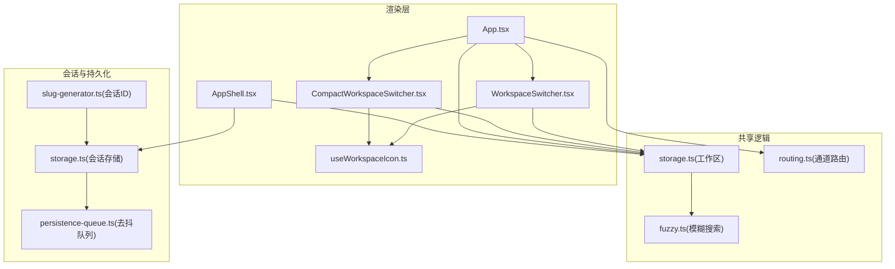
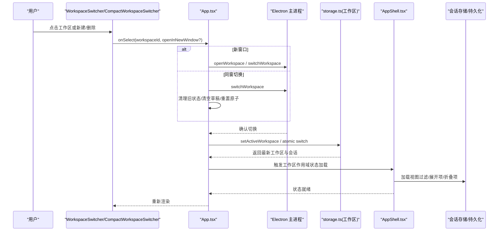
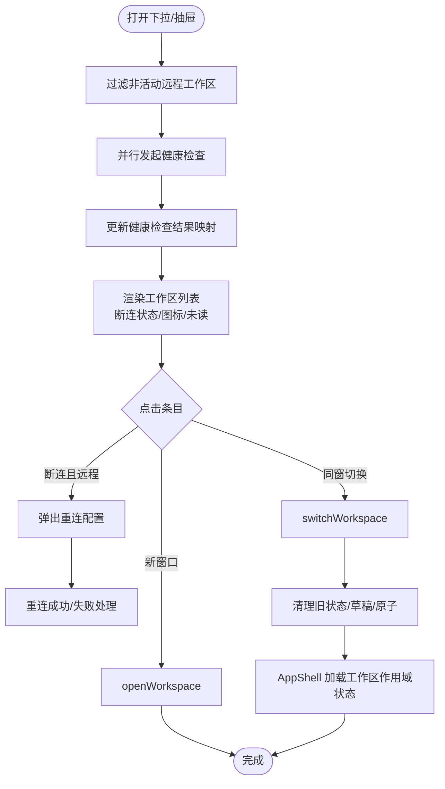
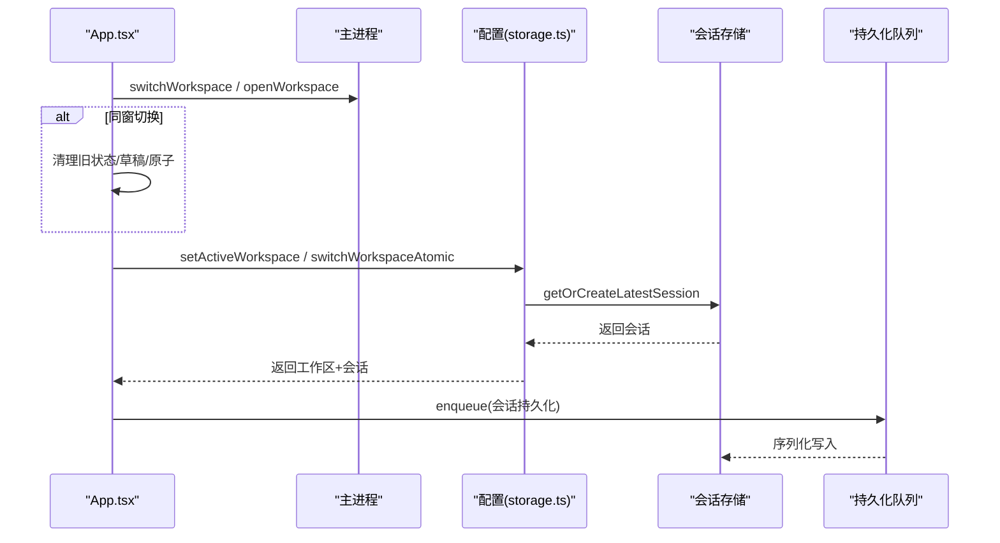
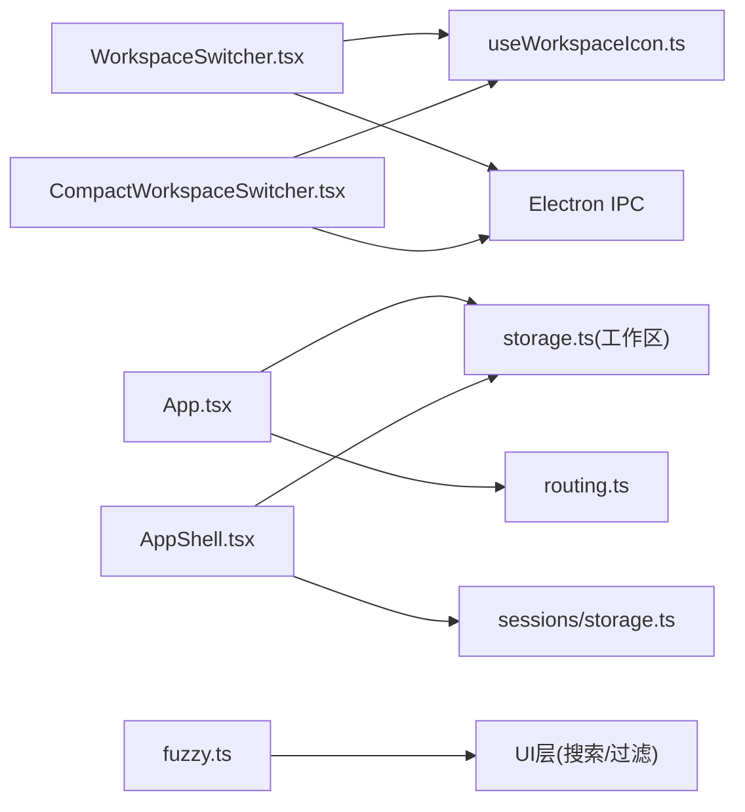

# 工作区切换

<cite>
**本文引用的文件**
- [WorkspaceSwitcher.tsx](file://apps/electron/src/renderer/components/app-shell/WorkspaceSwitcher.tsx)
- [CompactWorkspaceSwitcher.tsx](file://apps/electron/src/renderer/components/app-shell/CompactWorkspaceSwitcher.tsx)
- [useWorkspaceIcon.ts](file://apps/electron/src/renderer/hooks/useWorkspaceIcon.ts)
- [storage.ts](file://packages/shared/src/config/storage.ts)
- [routing.ts](file://packages/shared/src/protocol/routing.ts)
- [App.tsx](file://apps/electron/src/renderer/App.tsx)
- [AppShell.tsx](file://apps/electron/src/renderer/components/app-shell/AppShell.tsx)
- [fuzzy.ts](file://packages/shared/src/search/fuzzy.ts)
- [slug-generator.ts](file://packages/shared/src/sessions/slug-generator.ts)
- [persistence-queue.ts](file://packages/shared/src/sessions/persistence-queue.ts)
- [storage.ts（会话存储）](file://packages/shared/src/sessions/storage.ts)
</cite>

## 目录
1. [简介](#简介)
2. [项目结构](#项目结构)
3. [核心组件](#核心组件)
4. [架构总览](#架构总览)
5. [详细组件分析](#详细组件分析)
6. [依赖关系分析](#依赖关系分析)
7. [性能考量](#性能考量)
8. [故障排查指南](#故障排查指南)
9. [结论](#结论)
10. [附录](#附录)

## 简介
本文件系统性阐述工作区切换功能的设计与实现，覆盖界面组件、切换流程、用户体验设计、图标显示与缓存、最近使用排序、搜索过滤、状态管理与会话保持、数据隔离策略、快捷键与右键菜单、拖拽重排、性能优化与内存管理、状态同步机制，并提供最佳实践与使用技巧。

## 项目结构
工作区切换涉及渲染层 UI 组件、共享配置与状态逻辑、主进程通信通道以及会话持久化等模块。关键位置如下：
- 渲染层 UI：顶部栏与侧边栏触发器、抽屉式紧凑切换器
- 配置与状态：工作区列表、活动工作区、原子式状态更新
- 传输路由：本地/远程通道分类，确保工作区相关操作在本地执行
- 会话与持久化：会话生成、去抖持久化队列、头部签名校验
- 搜索与排序：模糊匹配工具，支持多语言与边界感知

**图表来源**
- [WorkspaceSwitcher.tsx:1-339](file://apps/electron/src/renderer/components/app-shell/WorkspaceSwitcher.tsx#L1-L339)
- [CompactWorkspaceSwitcher.tsx:1-303](file://apps/electron/src/renderer/components/app-shell/CompactWorkspaceSwitcher.tsx#L1-L303)
- [useWorkspaceIcon.ts:1-212](file://apps/electron/src/renderer/hooks/useWorkspaceIcon.ts#L1-L212)
- [storage.ts:617-715](file://packages/shared/src/config/storage.ts#L617-L715)
- [routing.ts:17-35](file://packages/shared/src/protocol/routing.ts#L17-L35)
- [App.tsx:1704-1755](file://apps/electron/src/renderer/App.tsx#L1704-L1755)
- [AppShell.tsx:887-902](file://apps/electron/src/renderer/components/app-shell/AppShell.tsx#L887-L902)
- [fuzzy.ts:1-84](file://packages/shared/src/search/fuzzy.ts#L1-L84)
- [slug-generator.ts:49-78](file://packages/shared/src/sessions/slug-generator.ts#L49-L78)
- [persistence-queue.ts:59-78](file://packages/shared/src/sessions/persistence-queue.ts#L59-L78)
- [storage.ts（会话存储）:321-335](file://packages/shared/src/sessions/storage.ts#L321-L335)

**章节来源**
- [WorkspaceSwitcher.tsx:1-339](file://apps/electron/src/renderer/components/app-shell/WorkspaceSwitcher.tsx#L1-L339)
- [CompactWorkspaceSwitcher.tsx:1-303](file://apps/electron/src/renderer/components/app-shell/CompactWorkspaceSwitcher.tsx#L1-L303)
- [useWorkspaceIcon.ts:1-212](file://apps/electron/src/renderer/hooks/useWorkspaceIcon.ts#L1-L212)
- [storage.ts:617-715](file://packages/shared/src/config/storage.ts#L617-L715)
- [routing.ts:17-35](file://packages/shared/src/protocol/routing.ts#L17-L35)
- [App.tsx:1704-1755](file://apps/electron/src/renderer/App.tsx#L1704-L1755)
- [AppShell.tsx:887-902](file://apps/electron/src/renderer/components/app-shell/AppShell.tsx#L887-L902)
- [fuzzy.ts:1-84](file://packages/shared/src/search/fuzzy.ts#L1-L84)
- [slug-generator.ts:49-78](file://packages/shared/src/sessions/slug-generator.ts#L49-L78)
- [persistence-queue.ts:59-78](file://packages/shared/src/sessions/persistence-queue.ts#L59-L78)
- [storage.ts（会话存储）:321-335](file://packages/shared/src/sessions/storage.ts#L321-L335)

## 核心组件
- WorkspaceSwitcher：顶部栏与侧边栏触发器，支持远程工作区健康检查、断连提示、新建/删除工作区、在新窗口打开、连接重试。
- CompactWorkspaceSwitcher：紧凑模式抽屉式切换器，适配窄屏与触控场景，行为与桌面版一致。
- useWorkspaceIcon：工作区图标加载与缓存，处理 file:// 与 http(s) 图标，跨组件复用。
- App.tsx 中的 handleSelectWorkspace：统一的切换入口，负责窗口内切换与新窗口打开、清理旧状态、触发重新加载。
- AppShell.tsx：工作区切换后加载工作区作用域状态（视图过滤、展开项、折叠项等），保证刷新不丢失状态。
- storage.ts：工作区列表、活动工作区、原子切换、远程服务器更新、同步发现等。
- routing.ts：工作区相关通道归类为 LOCAL_ONLY 或 REMOTE_ELIGIBLE，确保本地配置变更在本地执行。
- 模糊搜索：fuzzy.ts 提供多语言、词边界感知的模糊匹配，用于工作区筛选。
- 会话与持久化：slug-generator.ts 生成会话ID；persistence-queue.ts 去抖写入；storage.ts 会话读写。

**章节来源**
- [WorkspaceSwitcher.tsx:26-339](file://apps/electron/src/renderer/components/app-shell/WorkspaceSwitcher.tsx#L26-L339)
- [CompactWorkspaceSwitcher.tsx:26-303](file://apps/electron/src/renderer/components/app-shell/CompactWorkspaceSwitcher.tsx#L26-L303)
- [useWorkspaceIcon.ts:28-211](file://apps/electron/src/renderer/hooks/useWorkspaceIcon.ts#L28-L211)
- [App.tsx:1704-1755](file://apps/electron/src/renderer/App.tsx#L1704-L1755)
- [AppShell.tsx:887-902](file://apps/electron/src/renderer/components/app-shell/AppShell.tsx#L887-L902)
- [storage.ts:617-715](file://packages/shared/src/config/storage.ts#L617-L715)
- [routing.ts:17-35](file://packages/shared/src/protocol/routing.ts#L17-L35)
- [fuzzy.ts:42-68](file://packages/shared/src/search/fuzzy.ts#L42-L68)
- [slug-generator.ts:49-78](file://packages/shared/src/sessions/slug-generator.ts#L49-L78)
- [persistence-queue.ts:59-78](file://packages/shared/src/sessions/persistence-queue.ts#L59-L78)
- [storage.ts（会话存储）:321-335](file://packages/shared/src/sessions/storage.ts#L321-L335)

## 架构总览
工作区切换从 UI 触发，经由渲染层回调调用主进程接口，再通过共享配置与状态模块完成活动工作区更新与会话加载，最终驱动 UI 重绘与工作区作用域状态恢复。

**图表来源**
- [WorkspaceSwitcher.tsx:256-266](file://apps/electron/src/renderer/components/app-shell/WorkspaceSwitcher.tsx#L256-L266)
- [CompactWorkspaceSwitcher.tsx:209-221](file://apps/electron/src/renderer/components/app-shell/CompactWorkspaceSwitcher.tsx#L209-L221)
- [App.tsx:1704-1755](file://apps/electron/src/renderer/App.tsx#L1704-L1755)
- [storage.ts:681-715](file://packages/shared/src/config/storage.ts#L681-L715)
- [AppShell.tsx:887-902](file://apps/electron/src/renderer/components/app-shell/AppShell.tsx#L887-L902)
- [storage.ts（会话存储）:321-335](file://packages/shared/src/sessions/storage.ts#L321-L335)

## 详细组件分析

### WorkspaceSwitcher 组件
- 功能要点
  - 支持两种触发形态：顶部栏与侧边栏，分别适配不同布局。
  - 远程工作区健康检查：下拉打开时并行检测非活动远程工作区连通性，避免误选不可达目标。
  - 断连提示：根据当前传输状态与健康检查结果展示云朵/断开图标与提示。
  - 新建/删除工作区：新建弹出全屏创建页；删除对活动工作区进行保护；成功后通知与回调。
  - 在新窗口打开：按住元键/控制键点击条目触发。
  - 连接重试：断连时可弹出重连配置并自动重连。
- 图标与未读
  - 使用 useWorkspaceIcon/useWorkspaceIcons 获取图标，支持 file:// 与 http(s)；模块级缓存避免重复请求。
  - 显示未读指示（来自外部传入的映射）。
- 右键菜单与交互
  - 条目悬停显示删除与“在新窗口打开”按钮；活动项显示勾选。
- 性能与体验
  - 下拉/抽屉打开时才发起健康检查，避免常驻开销。
  - 通过淡入头像与文本提升切换时的视觉连续性。

**图表来源**
- [WorkspaceSwitcher.tsx:68-97](file://apps/electron/src/renderer/components/app-shell/WorkspaceSwitcher.tsx#L68-L97)
- [WorkspaceSwitcher.tsx:158-171](file://apps/electron/src/renderer/components/app-shell/WorkspaceSwitcher.tsx#L158-L171)
- [WorkspaceSwitcher.tsx:256-334](file://apps/electron/src/renderer/components/app-shell/WorkspaceSwitcher.tsx#L256-L334)
- [useWorkspaceIcon.ts:129-211](file://apps/electron/src/renderer/hooks/useWorkspaceIcon.ts#L129-L211)

**章节来源**
- [WorkspaceSwitcher.tsx:26-339](file://apps/electron/src/renderer/components/app-shell/WorkspaceSwitcher.tsx#L26-L339)
- [useWorkspaceIcon.ts:28-211](file://apps/electron/src/renderer/hooks/useWorkspaceIcon.ts#L28-L211)

### CompactWorkspaceSwitcher 组件
- 功能要点
  - 抽屉式设计，适合移动端/紧凑界面，行为与桌面版一致。
  - 打开时同样进行远程健康检查。
  - 支持删除、在新窗口打开、断连重连。
- 交互细节
  - 选中项高亮，断连项半透明。
  - 新建按钮位于抽屉底部关闭按钮附近，便于触达。

**章节来源**
- [CompactWorkspaceSwitcher.tsx:26-303](file://apps/electron/src/renderer/components/app-shell/CompactWorkspaceSwitcher.tsx#L26-L303)

### 图标显示与缓存（useWorkspaceIcon）
- 能力
  - 支持 http(s) 直接使用与 file:// 通过 IPC 转换为 data URL。
  - 模块级缓存，键为 workspaceId，值包含 dataUrl 与 sourceUrl，避免重复请求。
  - 多工作区批量获取接口，减少多次 IPC 调用。
- 性能
  - 首次渲染可能返回 undefined，待 IPC 完成后回填；批量接口在一次渲染周期内完成多个图标加载。

**章节来源**
- [useWorkspaceIcon.ts:14-120](file://apps/electron/src/renderer/hooks/useWorkspaceIcon.ts#L14-L120)
- [useWorkspaceIcon.ts:129-211](file://apps/electron/src/renderer/hooks/useWorkspaceIcon.ts#L129-L211)

### 最近使用排序与搜索过滤
- 最近使用排序
  - 切换流程中会更新工作区 lastAccessedAt 字段，配合共享配置模块维护访问时间戳，可用于后续排序。
- 搜索过滤
  - 使用 fuzzy.ts 的模糊匹配工具，支持词边界与 CJK，返回带分数与高亮范围的结果，可用于 UI 层的筛选与排序。
  - 可将工作区名称作为搜索文本提取函数，结合 UI 输入框实现实时过滤。

**章节来源**
- [storage.ts:710-711](file://packages/shared/src/config/storage.ts#L710-L711)
- [fuzzy.ts:42-68](file://packages/shared/src/search/fuzzy.ts#L42-L68)

### 快捷键与右键菜单
- 快捷键
  - 顶层导航动作注册集中于 AppShell，可通过全局快捷键系统触发区域焦点、面板切换等，但未见专门针对“切换到第 N 个工作区”的快捷键绑定。
- 右键菜单
  - WorkspaceSwitcher/CompactWorkspaceSwitcher 在条目悬停时显示删除与“在新窗口打开”按钮，属于鼠标交互范畴；未见上下文菜单（右键）实现。

**章节来源**
- [AppShell.tsx:1068-1079](file://apps/electron/src/renderer/components/app-shell/AppShell.tsx#L1068-L1079)
- [WorkspaceSwitcher.tsx:290-321](file://apps/electron/src/renderer/components/app-shell/WorkspaceSwitcher.tsx#L290-L321)
- [CompactWorkspaceSwitcher.tsx:257-281](file://apps/electron/src/renderer/components/app-shell/CompactWorkspaceSwitcher.tsx#L257-L281)

### 拖拽重排
- 当前仓库未发现工作区列表的拖拽重排实现；若需实现，建议在 UI 层引入可拖拽列表组件，并在拖拽结束时调用共享配置模块的排序/重排接口（如存在）以持久化顺序。

**章节来源**
- 未在现有文件中发现拖拽重排实现

### 状态管理与会话保持
- 状态管理
  - App.tsx 中 handleSelectWorkspace 对切换路径做了清晰分层：新窗口与同窗切换；并在同窗切换时清理旧状态（草稿、权限/凭据、会话选项、消息原子等），防止状态泄漏。
  - AppShell.tsx 在工作区切换后加载工作区作用域状态（视图过滤、展开/折叠项），保证刷新不丢失。
- 会话保持
  - storage.ts 提供 switchWorkspaceAtomic 原子切换：先获取/创建最新会话，再更新活动工作区并保存配置，避免竞态。
  - 会话持久化采用去抖队列，序列化同一会话的写入，避免并发冲突与主线程阻塞。

**图表来源**
- [App.tsx:1704-1755](file://apps/electron/src/renderer/App.tsx#L1704-L1755)
- [storage.ts:681-715](file://packages/shared/src/config/storage.ts#L681-L715)
- [storage.ts（会话存储）:321-335](file://packages/shared/src/sessions/storage.ts#L321-L335)
- [persistence-queue.ts:59-78](file://packages/shared/src/sessions/persistence-queue.ts#L59-L78)

**章节来源**
- [App.tsx:1704-1755](file://apps/electron/src/renderer/App.tsx#L1704-L1755)
- [AppShell.tsx:887-902](file://apps/electron/src/renderer/components/app-shell/AppShell.tsx#L887-L902)
- [storage.ts:681-715](file://packages/shared/src/config/storage.ts#L681-L715)
- [storage.ts（会话存储）:321-335](file://packages/shared/src/sessions/storage.ts#L321-L335)
- [persistence-queue.ts:59-78](file://packages/shared/src/sessions/persistence-queue.ts#L59-L78)

### 数据隔离策略
- 通道路由
  - routing.ts 将工作区相关通道归类为 LOCAL_ONLY 或 REMOTE_ELIGIBLE，确保工作区列表、创建、检查、更新远程服务器等在本地执行，避免跨服务污染。
- 工作区作用域状态
  - AppShell.tsx 在工作区切换后仅加载当前工作区的状态，避免跨工作区数据串扰。

**章节来源**
- [routing.ts:17-35](file://packages/shared/src/protocol/routing.ts#L17-L35)
- [AppShell.tsx:887-902](file://apps/electron/src/renderer/components/app-shell/AppShell.tsx#L887-L902)

## 依赖关系分析
- 组件依赖
  - WorkspaceSwitcher/CompactWorkspaceSwitcher 依赖 useWorkspaceIcon、useTransportConnectionState、Electron IPC 接口。
  - App.tsx 依赖 storage.ts 与 routing.ts，协调主进程与渲染层。
- 状态依赖
  - AppShell.tsx 依赖 storage 读取工作区作用域偏好，依赖会话存储加载视图与标签等。
- 搜索依赖
  - fuzzy.ts 作为通用工具被 UI 层用于过滤与排序。

**图表来源**
- [WorkspaceSwitcher.tsx:1-339](file://apps/electron/src/renderer/components/app-shell/WorkspaceSwitcher.tsx#L1-L339)
- [CompactWorkspaceSwitcher.tsx:1-303](file://apps/electron/src/renderer/components/app-shell/CompactWorkspaceSwitcher.tsx#L1-L303)
- [useWorkspaceIcon.ts:1-212](file://apps/electron/src/renderer/hooks/useWorkspaceIcon.ts#L1-L212)
- [App.tsx:1704-1755](file://apps/electron/src/renderer/App.tsx#L1704-L1755)
- [storage.ts:617-715](file://packages/shared/src/config/storage.ts#L617-L715)
- [routing.ts:17-35](file://packages/shared/src/protocol/routing.ts#L17-L35)
- [AppShell.tsx:887-902](file://apps/electron/src/renderer/components/app-shell/AppShell.tsx#L887-L902)
- [storage.ts（会话存储）:321-335](file://packages/shared/src/sessions/storage.ts#L321-L335)
- [fuzzy.ts:1-84](file://packages/shared/src/search/fuzzy.ts#L1-L84)

**章节来源**
- [WorkspaceSwitcher.tsx:1-339](file://apps/electron/src/renderer/components/app-shell/WorkspaceSwitcher.tsx#L1-L339)
- [CompactWorkspaceSwitcher.tsx:1-303](file://apps/electron/src/renderer/components/app-shell/CompactWorkspaceSwitcher.tsx#L1-L303)
- [useWorkspaceIcon.ts:1-212](file://apps/electron/src/renderer/hooks/useWorkspaceIcon.ts#L1-L212)
- [App.tsx:1704-1755](file://apps/electron/src/renderer/App.tsx#L1704-L1755)
- [storage.ts:617-715](file://packages/shared/src/config/storage.ts#L617-L715)
- [routing.ts:17-35](file://packages/shared/src/protocol/routing.ts#L17-L35)
- [AppShell.tsx:887-902](file://apps/electron/src/renderer/components/app-shell/AppShell.tsx#L887-L902)
- [storage.ts（会话存储）:321-335](file://packages/shared/src/sessions/storage.ts#L321-L335)
- [fuzzy.ts:1-84](file://packages/shared/src/search/fuzzy.ts#L1-L84)

## 性能考量
- 图标加载与缓存
  - useWorkspaceIcon 模块级缓存与批量接口显著降低 IPC 次数与重复请求。
- 健康检查
  - WorkspaceSwitcher/CompactWorkspaceSwitcher 在打开时并行检查非活动远程工作区，避免用户误选不可达目标。
- 状态清理
  - 同窗切换时清理草稿、权限/凭据、会话选项与消息原子，防止内存增长与状态泄漏。
- 会话持久化
  - 去抖队列序列化同一会话写入，避免频繁 IO 与竞态。
- 搜索性能
  - fuzzy.ts 在小规模列表（<1000）上开销可忽略，支持 CJK 与词边界，兼顾准确性与性能。

**章节来源**
- [useWorkspaceIcon.ts:14-120](file://apps/electron/src/renderer/hooks/useWorkspaceIcon.ts#L14-L120)
- [WorkspaceSwitcher.tsx:68-97](file://apps/electron/src/renderer/components/app-shell/WorkspaceSwitcher.tsx#L68-L97)
- [CompactWorkspaceSwitcher.tsx:64-89](file://apps/electron/src/renderer/components/app-shell/CompactWorkspaceSwitcher.tsx#L64-L89)
- [App.tsx:1736-1754](file://apps/electron/src/renderer/App.tsx#L1736-L1754)
- [persistence-queue.ts:59-78](file://packages/shared/src/sessions/persistence-queue.ts#L59-L78)
- [fuzzy.ts:13-19](file://packages/shared/src/search/fuzzy.ts#L13-L19)

## 故障排查指南
- 远程工作区断连
  - 现象：条目显示断开图标，提示“断开/认证失败/服务器不可达”。
  - 排查：检查传输连接状态与健康检查结果；必要时通过重连配置修复。
- 无法删除活动工作区
  - 现象：尝试删除当前活动工作区时报错。
  - 排查：确保先切换到其他工作区后再删除。
- 切换后状态异常
  - 现象：刷新后过滤条件丢失或旧数据残留。
  - 排查：确认 AppShell 是否正确加载工作区作用域状态；检查是否在切换时清理了旧状态。
- 图标不显示或闪烁
  - 现象：首次渲染图标为空，稍后填充。
  - 排查：确认 IPC 成功返回；检查缓存命中情况；确保 file:// URL 包含时间戳参数以触发刷新。

**章节来源**
- [WorkspaceSwitcher.tsx:100-120](file://apps/electron/src/renderer/components/app-shell/WorkspaceSwitcher.tsx#L100-L120)
- [WorkspaceSwitcher.tsx:140-150](file://apps/electron/src/renderer/components/app-shell/WorkspaceSwitcher.tsx#L140-L150)
- [AppShell.tsx:887-902](file://apps/electron/src/renderer/components/app-shell/AppShell.tsx#L887-L902)
- [useWorkspaceIcon.ts:83-110](file://apps/electron/src/renderer/hooks/useWorkspaceIcon.ts#L83-L110)

## 结论
工作区切换功能通过清晰的 UI 分层、可靠的配置与状态管理、严格的通道路由与会话持久化机制，实现了稳定、可扩展且高性能的跨工作区切换体验。图标缓存、健康检查、状态清理与去抖持久化共同保障了性能与一致性。未来可在 UI 层增加搜索与拖拽重排能力，并补充快捷键直达工作区的交互，进一步提升效率。

## 附录
- 最佳实践
  - 切换前先进行远程健康检查，避免误选不可达工作区。
  - 同窗切换时依赖内置状态清理流程，避免手动清理遗漏导致的内存增长。
  - 使用批量图标接口一次性加载多图标，减少 IPC 开销。
  - 利用模糊搜索实现工作区快速筛选，结合词边界与 CJK 支持提升体验。
- 使用技巧
  - 在新窗口打开工作区用于并行任务；在同窗切换用于快速切换上下文。
  - 断连工作区可通过重连配置一键修复并自动重连。
  - 刷新应用后工作区作用域状态会自动恢复，无需手动保存。