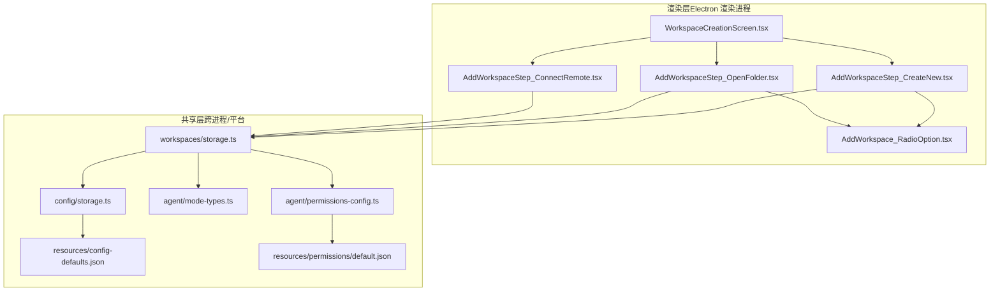
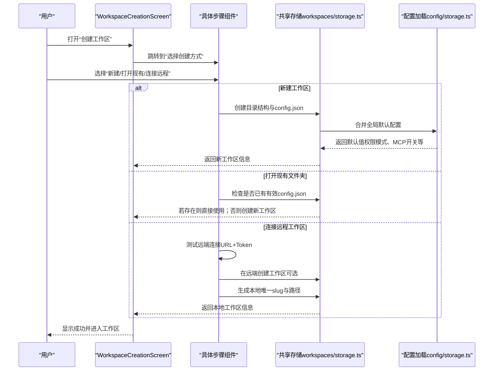
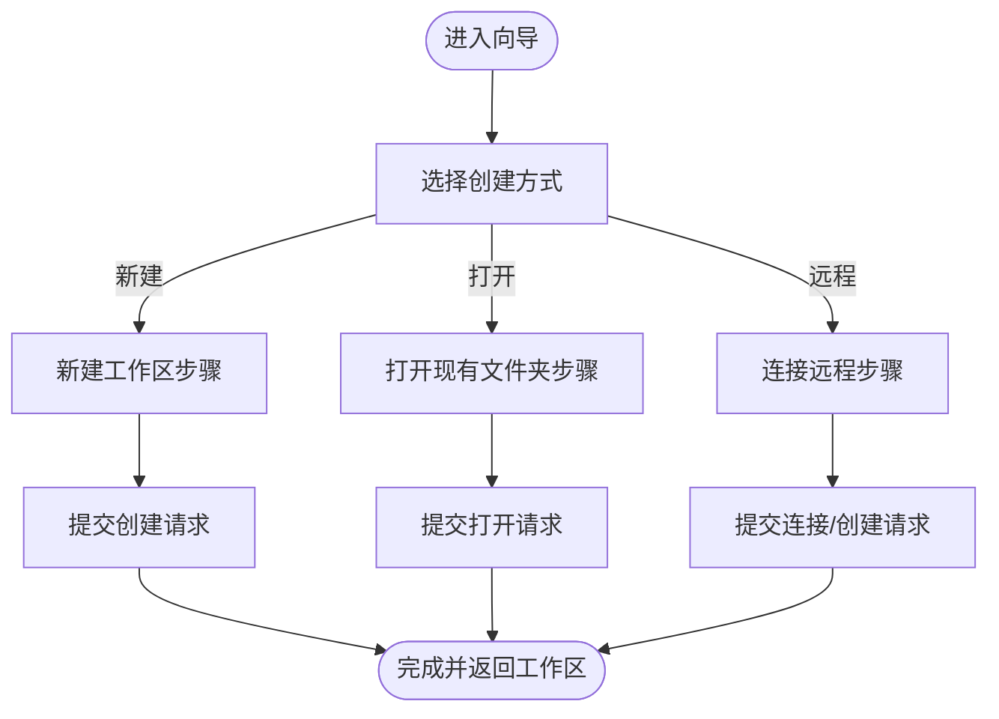
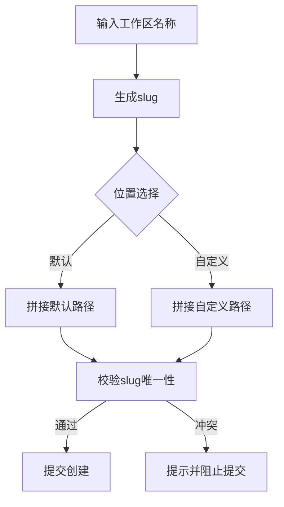
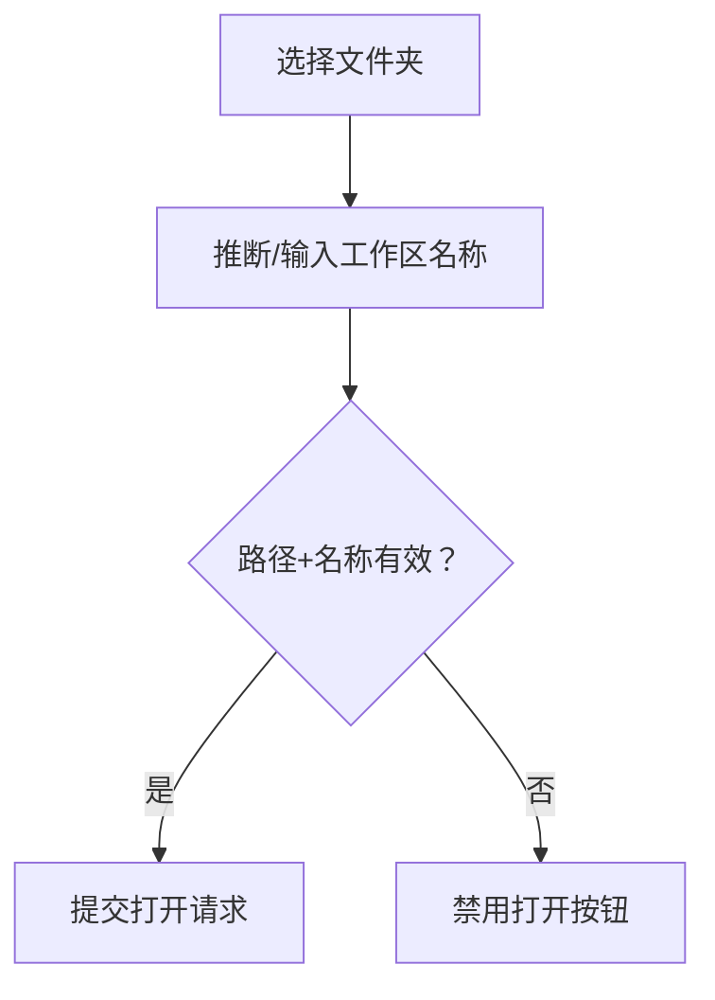
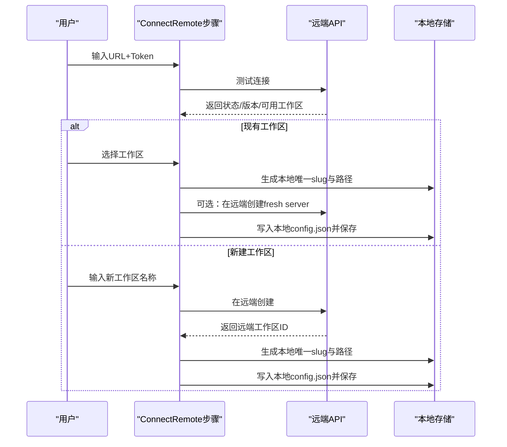
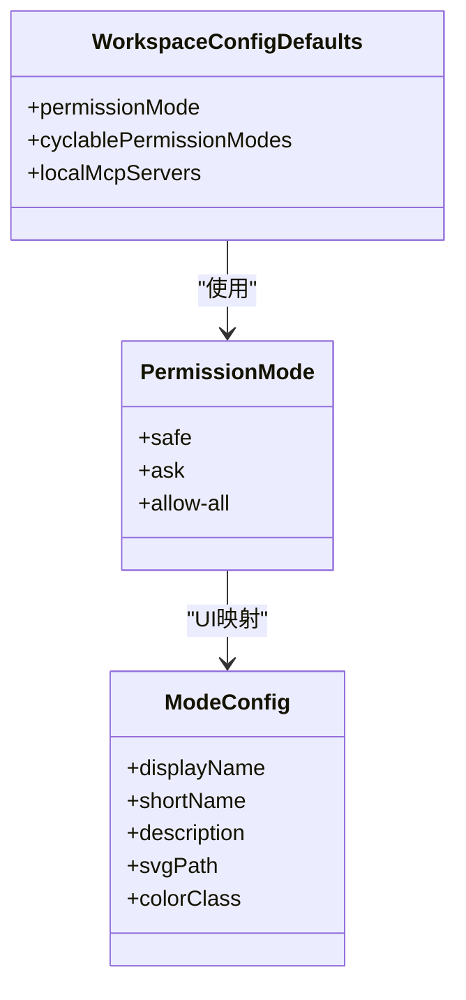
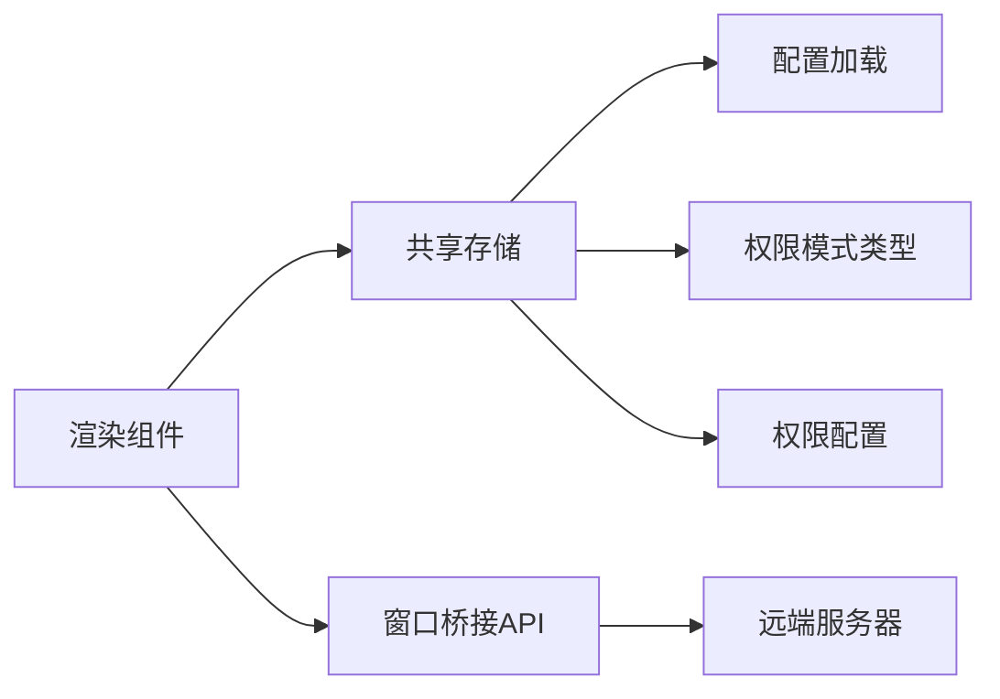

# 工作区创建

<cite>
**本文引用的文件**
- [WorkspaceCreationScreen.tsx](file://apps/electron/src/renderer/components/workspace/WorkspaceCreationScreen.tsx)
- [AddWorkspaceStep_CreateNew.tsx](file://apps/electron/src/renderer/components/workspace/AddWorkspaceStep_CreateNew.tsx)
- [AddWorkspaceStep_OpenFolder.tsx](file://apps/electron/src/renderer/components/workspace/AddWorkspaceStep_OpenFolder.tsx)
- [AddWorkspaceStep_ConnectRemote.tsx](file://apps/electron/src/renderer/components/workspace/AddWorkspaceStep_ConnectRemote.tsx)
- [AddWorkspace_RadioOption.tsx](file://apps/electron/src/renderer/components/workspace/AddWorkspace_RadioOption.tsx)
- [storage.ts（共享）](file://packages/shared/src/workspaces/storage.ts)
- [storage.ts（配置）](file://packages/shared/src/config/storage.ts)
- [mode-types.ts](file://packages/shared/src/agent/mode-types.ts)
- [permissions-config.ts](file://packages/shared/src/agent/permissions-config.ts)
- [config-defaults.json（资源）](file://apps/electron/resources/config-defaults.json)
- [default.json（权限）](file://apps/electron/resources/permissions/default.json)
- [index.ts（CLI）](file://apps/cli/src/index.ts)
</cite>

## 目录
1. [简介](#简介)
2. [项目结构](#项目结构)
3. [核心组件](#核心组件)
4. [架构总览](#架构总览)
5. [详细组件分析](#详细组件分析)
6. [依赖关系分析](#依赖关系分析)
7. [性能考量](#性能考量)
8. [故障排查指南](#故障排查指南)
9. [结论](#结论)
10. [附录](#附录)

## 简介
本文件系统化阐述“工作区创建”功能，覆盖三种创建方式：新建工作区、连接现有文件夹、添加远程工作区；详述工作区配置向导的每一步流程（名称设置、路径选择、MCP服务器配置、权限模式选择）；解释工作区模板系统与默认配置继承机制；给出最佳实践、命名规范与路径选择建议，并提供常见创建错误的排查方法。

## 项目结构
工作区创建由渲染层的多步向导组件与共享层的存储与配置逻辑共同实现：
- 渲染层：负责用户交互与向导流程编排
- 共享层：负责工作区持久化、默认配置加载与合并、权限模式解析与展示

图表来源
- [WorkspaceCreationScreen.tsx:1-232](file://apps/electron/src/renderer/components/workspace/WorkspaceCreationScreen.tsx#L1-L232)
- [AddWorkspaceStep_CreateNew.tsx:1-200](file://apps/electron/src/renderer/components/workspace/AddWorkspaceStep_CreateNew.tsx#L1-L200)
- [AddWorkspaceStep_OpenFolder.tsx:1-129](file://apps/electron/src/renderer/components/workspace/AddWorkspaceStep_OpenFolder.tsx#L1-L129)
- [AddWorkspaceStep_ConnectRemote.tsx:1-368](file://apps/electron/src/renderer/components/workspace/AddWorkspaceStep_ConnectRemote.tsx#L1-L368)
- [AddWorkspace_RadioOption.tsx:1-72](file://apps/electron/src/renderer/components/workspace/AddWorkspace_RadioOption.tsx#L1-L72)
- [storage.ts（共享）:1-533](file://packages/shared/src/workspaces/storage.ts#L1-L533)
- [storage.ts（配置）:142-219](file://packages/shared/src/config/storage.ts#L142-L219)
- [mode-types.ts:1-341](file://packages/shared/src/agent/mode-types.ts#L1-L341)
- [permissions-config.ts:1-737](file://packages/shared/src/agent/permissions-config.ts#L1-L737)
- [config-defaults.json（资源）:1-24](file://apps/electron/resources/config-defaults.json#L1-L24)
- [default.json（权限）:1-800](file://apps/electron/resources/permissions/default.json#L1-L800)

章节来源
- [WorkspaceCreationScreen.tsx:1-232](file://apps/electron/src/renderer/components/workspace/WorkspaceCreationScreen.tsx#L1-L232)
- [storage.ts（共享）:1-533](file://packages/shared/src/workspaces/storage.ts#L1-L533)

## 核心组件
- WorkspaceCreationScreen：全屏覆盖式工作区创建向导，编排“选择创建方式→填写信息→创建/连接”的流程。
- AddWorkspaceStep_CreateNew：新建工作区，支持默认位置或自定义位置，自动校验名称唯一性。
- AddWorkspaceStep_OpenFolder：打开现有文件夹为工作区，自动推断工作区名称。
- AddWorkspaceStep_ConnectRemote：连接远程服务器，支持“现有工作区连接”和“在远端新建后本地连接”，含连接测试与版本提示。
- AddWorkspace_RadioOption：通用单选布局组件，用于位置选择等场景。
- 共享存储与配置：负责工作区目录结构创建、配置写入、默认配置加载与合并、权限模式解析与UI映射。

章节来源
- [WorkspaceCreationScreen.tsx:1-232](file://apps/electron/src/renderer/components/workspace/WorkspaceCreationScreen.tsx#L1-L232)
- [AddWorkspaceStep_CreateNew.tsx:1-200](file://apps/electron/src/renderer/components/workspace/AddWorkspaceStep_CreateNew.tsx#L1-L200)
- [AddWorkspaceStep_OpenFolder.tsx:1-129](file://apps/electron/src/renderer/components/workspace/AddWorkspaceStep_OpenFolder.tsx#L1-L129)
- [AddWorkspaceStep_ConnectRemote.tsx:1-368](file://apps/electron/src/renderer/components/workspace/AddWorkspaceStep_ConnectRemote.tsx#L1-L368)
- [AddWorkspace_RadioOption.tsx:1-72](file://apps/electron/src/renderer/components/workspace/AddWorkspace_RadioOption.tsx#L1-L72)
- [storage.ts（共享）:292-347](file://packages/shared/src/workspaces/storage.ts#L292-L347)
- [storage.ts（配置）:165-196](file://packages/shared/src/config/storage.ts#L165-L196)
- [mode-types.ts:288-340](file://packages/shared/src/agent/mode-types.ts#L288-L340)

## 架构总览
工作区创建的端到端流程如下：

图表来源
- [WorkspaceCreationScreen.tsx:69-82](file://apps/electron/src/renderer/components/workspace/WorkspaceCreationScreen.tsx#L69-L82)
- [AddWorkspaceStep_CreateNew.tsx:94-98](file://apps/electron/src/renderer/components/workspace/AddWorkspaceStep_CreateNew.tsx#L94-L98)
- [AddWorkspaceStep_OpenFolder.tsx:43-46](file://apps/electron/src/renderer/components/workspace/AddWorkspaceStep_OpenFolder.tsx#L43-L46)
- [AddWorkspaceStep_ConnectRemote.tsx:99-176](file://apps/electron/src/renderer/components/workspace/AddWorkspaceStep_ConnectRemote.tsx#L99-L176)
- [storage.ts（共享）:292-347](file://packages/shared/src/workspaces/storage.ts#L292-L347)
- [storage.ts（配置）:165-196](file://packages/shared/src/config/storage.ts#L165-L196)

## 详细组件分析

### 组件A：WorkspaceCreationScreen（创建向导主控）
- 角色：承载四个步骤的切换与回调，统一处理创建状态与错误提示。
- 关键点：
  - 步骤枚举：choice/create/open/remote
  - 统一的创建入口：调用窗口桥接API执行创建工作
  - 重连模式：支持更新现有远程工作区的服务器配置

图表来源
- [WorkspaceCreationScreen.tsx:97-146](file://apps/electron/src/renderer/components/workspace/WorkspaceCreationScreen.tsx#L97-L146)

章节来源
- [WorkspaceCreationScreen.tsx:1-232](file://apps/electron/src/renderer/components/workspace/WorkspaceCreationScreen.tsx#L1-L232)

### 组件B：AddWorkspaceStep_CreateNew（新建工作区）
- 功能：输入工作区名称，选择默认位置或自定义位置，自动校验slug唯一性，提交创建。
- 关键点：
  - 默认位置：用户主目录下的固定工作区目录
  - 自定义位置：通过目录选择器指定
  - 名称唯一性：通过slug生成与服务端校验避免冲突
  - 提交：调用窗口桥接API创建本地工作区

图表来源
- [AddWorkspaceStep_CreateNew.tsx:46-100](file://apps/electron/src/renderer/components/workspace/AddWorkspaceStep_CreateNew.tsx#L46-L100)

章节来源
- [AddWorkspaceStep_CreateNew.tsx:1-200](file://apps/electron/src/renderer/components/workspace/AddWorkspaceStep_CreateNew.tsx#L1-L200)

### 组件C：AddWorkspaceStep_OpenFolder（打开现有文件夹）
- 功能：浏览并选择现有文件夹作为工作区，自动提取文件夹名为工作区名称，提交创建。
- 关键点：
  - 仅当选择了路径且名称有效时才可打开
  - 若目标路径已包含有效config.json，则直接视为有效工作区

图表来源
- [AddWorkspaceStep_OpenFolder.tsx:25-50](file://apps/electron/src/renderer/components/workspace/AddWorkspaceStep_OpenFolder.tsx#L25-L50)

章节来源
- [AddWorkspaceStep_OpenFolder.tsx:1-129](file://apps/electron/src/renderer/components/workspace/AddWorkspaceStep_OpenFolder.tsx#L1-L129)

### 组件D：AddWorkspaceStep_ConnectRemote（连接远程工作区）
- 功能：输入远端服务器URL与Token，测试连接；支持两种模式：
  - 连接到现有工作区：从远端拉取工作区列表，选择后本地创建同名工作区并绑定远端ID
  - 在远端新建工作区：先在远端创建，再在本地创建并绑定
- 关键点：
  - 连接测试：显示连接状态与远端版本
  - 新建/连接按钮文案与加载态随状态变化
  - slug唯一性：在本地生成唯一slug，避免冲突

图表来源
- [AddWorkspaceStep_ConnectRemote.tsx:99-176](file://apps/electron/src/renderer/components/workspace/AddWorkspaceStep_ConnectRemote.tsx#L99-L176)
- [storage.ts（共享）:292-347](file://packages/shared/src/workspaces/storage.ts#L292-L347)

章节来源
- [AddWorkspaceStep_ConnectRemote.tsx:1-368](file://apps/electron/src/renderer/components/workspace/AddWorkspaceStep_ConnectRemote.tsx#L1-L368)

### 组件E：权限模式与MCP配置（UI与存储）
- 权限模式（Explore/Ask/Execute）：由共享层类型与配置提供UI映射与解析。
- MCP本地服务器：可通过环境变量、工作区配置或默认值控制启用/禁用。
- 默认配置：来自资源文件与共享层配置加载，合并到工作区配置中。

图表来源
- [mode-types.ts:288-340](file://packages/shared/src/agent/mode-types.ts#L288-L340)
- [storage.ts（共享）:310-322](file://packages/shared/src/workspaces/storage.ts#L310-L322)
- [storage.ts（配置）:165-196](file://packages/shared/src/config/storage.ts#L165-L196)
- [config-defaults.json（资源）:15-22](file://apps/electron/resources/config-defaults.json#L15-L22)

章节来源
- [mode-types.ts:1-341](file://packages/shared/src/agent/mode-types.ts#L1-L341)
- [storage.ts（共享）:479-494](file://packages/shared/src/workspaces/storage.ts#L479-L494)
- [storage.ts（配置）:165-196](file://packages/shared/src/config/storage.ts#L165-L196)
- [config-defaults.json（资源）:1-24](file://apps/electron/resources/config-defaults.json#L1-L24)

## 依赖关系分析
- 渲染层组件依赖共享存储进行工作区创建与配置写入
- 共享存储依赖配置加载模块获取默认配置
- 权限模式UI与行为由类型与权限配置模块提供
- 远程连接步骤依赖窗口桥接API与远端服务

图表来源
- [WorkspaceCreationScreen.tsx:69-82](file://apps/electron/src/renderer/components/workspace/WorkspaceCreationScreen.tsx#L69-L82)
- [AddWorkspaceStep_ConnectRemote.tsx:157-176](file://apps/electron/src/renderer/components/workspace/AddWorkspaceStep_ConnectRemote.tsx#L157-L176)
- [storage.ts（共享）:292-347](file://packages/shared/src/workspaces/storage.ts#L292-L347)
- [storage.ts（配置）:165-196](file://packages/shared/src/config/storage.ts#L165-L196)
- [mode-types.ts:288-340](file://packages/shared/src/agent/mode-types.ts#L288-L340)
- [permissions-config.ts:702-727](file://packages/shared/src/agent/permissions-config.ts#L702-L727)

章节来源
- [WorkspaceCreationScreen.tsx:1-232](file://apps/electron/src/renderer/components/workspace/WorkspaceCreationScreen.tsx#L1-L232)
- [AddWorkspaceStep_ConnectRemote.tsx:1-368](file://apps/electron/src/renderer/components/workspace/AddWorkspaceStep_ConnectRemote.tsx#L1-L368)
- [storage.ts（共享）:1-533](file://packages/shared/src/workspaces/storage.ts#L1-L533)
- [storage.ts（配置）:142-219](file://packages/shared/src/config/storage.ts#L142-L219)
- [mode-types.ts:1-341](file://packages/shared/src/agent/mode-types.ts#L1-L341)
- [permissions-config.ts:1-737](file://packages/shared/src/agent/permissions-config.ts#L1-L737)

## 性能考量
- 文件系统操作最小化：仅在必要时创建目录与写入配置，避免重复IO
- 异步校验：slug唯一性与远端连接测试采用异步调用，避免阻塞UI
- 配置合并：默认配置一次性加载并缓存，减少重复解析成本
- 路径转换：对跨机器兼容的路径进行便携化存储，降低运行期转换开销

## 故障排查指南
- “无法创建工作区”
  - 检查工作区名称是否为空或包含非法字符
  - 检查目标路径是否存在且可写
  - 查看是否有同名slug冲突（默认位置下）
- “打开现有文件夹失败”
  - 确认所选路径下不存在有效config.json时，是否正确触发了新建流程
  - 确保路径可访问且非只读
- “连接远程工作区失败”
  - 校验URL与Token是否正确
  - 检查远端服务版本与客户端兼容性提示
  - 若远端无工作区，确认是否走“在远端新建”流程
- “权限模式不生效”
  - 确认工作区配置中的permissionMode字段是否被正确解析
  - 检查全局默认配置与工作区覆盖顺序
- “MCP服务器未启用”
  - 检查环境变量、工作区配置与默认值优先级
  - 确认本地MCP开关状态

章节来源
- [AddWorkspaceStep_CreateNew.tsx:54-80](file://apps/electron/src/renderer/components/workspace/AddWorkspaceStep_CreateNew.tsx#L54-L80)
- [AddWorkspaceStep_OpenFolder.tsx:43-46](file://apps/electron/src/renderer/components/workspace/AddWorkspaceStep_OpenFolder.tsx#L43-L46)
- [AddWorkspaceStep_ConnectRemote.tsx:99-128](file://apps/electron/src/renderer/components/workspace/AddWorkspaceStep_ConnectRemote.tsx#L99-L128)
- [storage.ts（共享）:479-494](file://packages/shared/src/workspaces/storage.ts#L479-L494)
- [storage.ts（配置）:165-196](file://packages/shared/src/config/storage.ts#L165-L196)

## 结论
工作区创建功能以清晰的向导分步设计与可靠的共享存储为核心，既支持本地新建与打开，也支持远程工作区连接与新建。通过默认配置继承与权限模式UI映射，用户可在安全与便捷之间灵活切换。遵循本文的最佳实践与排查建议，可显著提升创建成功率与后续使用体验。

## 附录

### 最佳实践与命名规范
- 命名规范
  - 使用简洁、语义化的英文名称，避免特殊字符
  - 自动生成的slug会移除非法字符并截断长度，确保跨平台兼容
- 路径选择建议
  - 优先使用默认位置（用户主目录下的固定工作区目录），便于备份与迁移
  - 自定义路径需确保可写、稳定且具备足够磁盘空间
- 权限模式选择
  - 开发/探索阶段建议使用“Explore（安全）”模式，逐步过渡到“Ask（询问）”或“Execute（执行）”
  - 对于远程工作区，建议在本地保持与远端一致的权限策略

章节来源
- [storage.ts（共享）:245-283](file://packages/shared/src/workspaces/storage.ts#L245-L283)
- [mode-types.ts:288-340](file://packages/shared/src/agent/mode-types.ts#L288-L340)

### 默认配置与模板系统
- 默认配置来源
  - 应用资源中的config-defaults.json提供全局默认值（如权限模式、MCP开关等）
  - 工作区创建时加载全局默认并合并到工作区config.json
- 权限模板
  - 权限规则由权限配置模块加载与合并，支持工作区级与源级定制
- MCP模板
  - 本地MCP服务器开关可通过环境变量、工作区配置或默认值控制

章节来源
- [config-defaults.json（资源）:1-24](file://apps/electron/resources/config-defaults.json#L1-L24)
- [storage.ts（配置）:165-196](file://packages/shared/src/config/storage.ts#L165-L196)
- [permissions-config.ts:702-727](file://packages/shared/src/agent/permissions-config.ts#L702-L727)
- [storage.ts（共享）:310-322](file://packages/shared/src/workspaces/storage.ts#L310-L322)

### CLI集成参考
- CLI侧通过RPC调用工作区创建与会话创建，便于自动化与脚本化集成
- 示例调用路径：[index.ts（CLI）:345-345](file://apps/cli/src/index.ts#L345-L345)、[index.ts（CLI）:666-666](file://apps/cli/src/index.ts#L666-L666)

章节来源
- [index.ts（CLI）:345-345](file://apps/cli/src/index.ts#L345-L345)
- [index.ts（CLI）:666-666](file://apps/cli/src/index.ts#L666-L666)