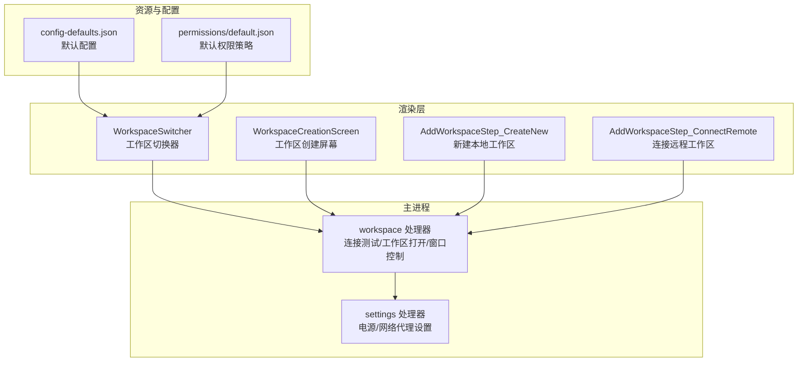
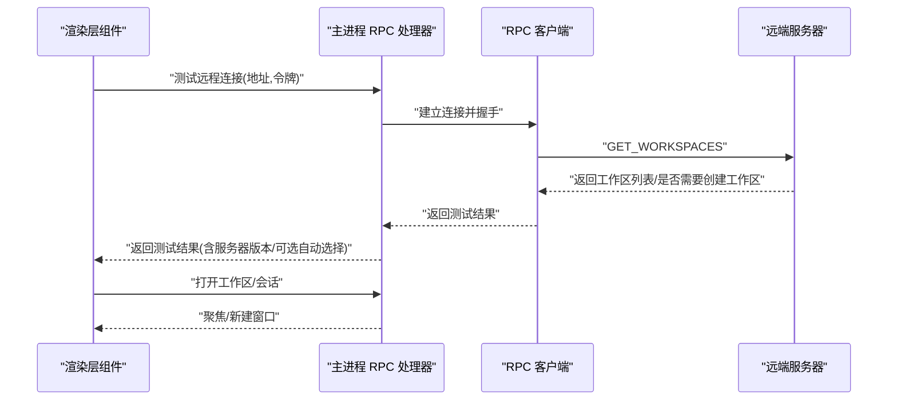
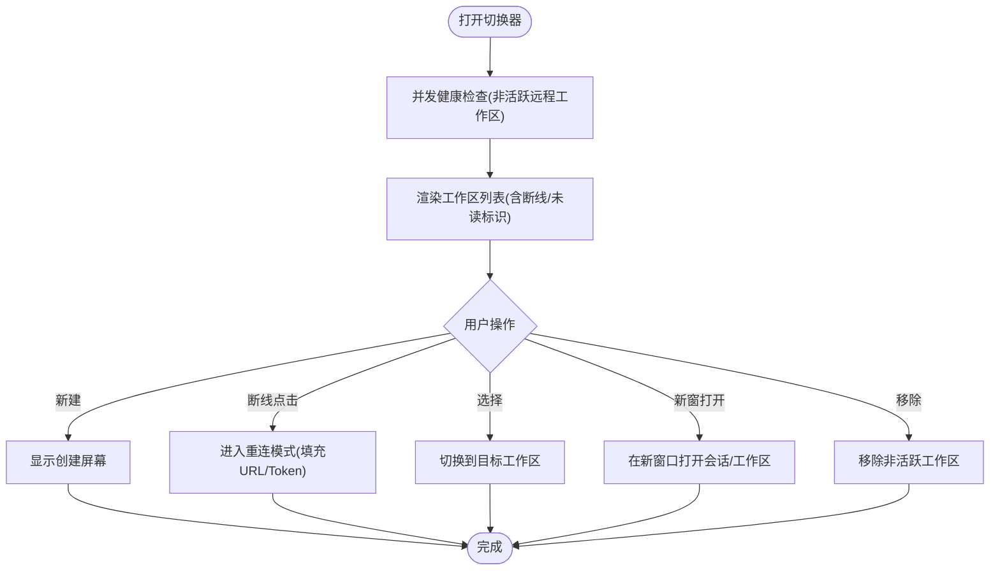
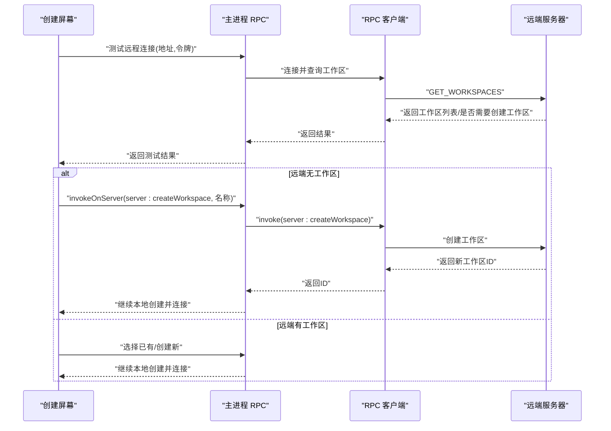
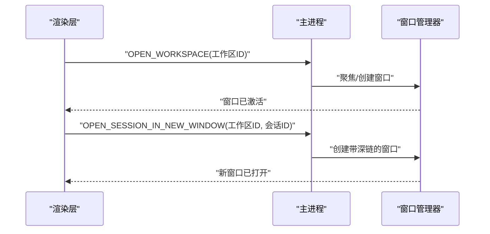
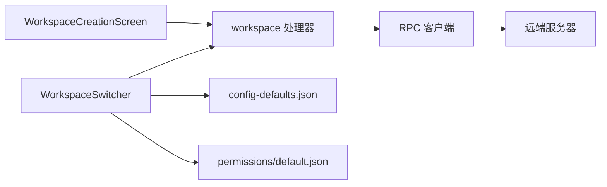

# 工作区管理

<cite>
**本文引用的文件**   
- [apps/electron/src/main/handlers/workspace.ts](file://apps/electron/src/main/handlers/workspace.ts)
- [apps/electron/src/renderer/components/app-shell/WorkspaceSwitcher.tsx](file://apps/electron/src/renderer/components/app-shell/WorkspaceSwitcher.tsx)
- [apps/electron/resources/config-defaults.json](file://apps/electron/resources/config-defaults.json)
- [apps/electron/resources/permissions/default.json](file://apps/electron/resources/permissions/default.json)
- [apps/electron/src/main/handlers/settings.ts](file://apps/electron/src/main/handlers/settings.ts)
- [apps/electron/src/renderer/components/workspace/index.ts](file://apps/electron/src/renderer/components/workspace/index.ts)
- [apps/electron/src/renderer/components/workspace/WorkspaceCreationScreen.tsx](file://apps/electron/src/renderer/components/workspace/WorkspaceCreationScreen.tsx)
- [apps/electron/src/renderer/components/workspace/AddWorkspaceStep_CreateNew.tsx](file://apps/electron/src/renderer/components/workspace/AddWorkspaceStep_CreateNew.tsx)
- [apps/electron/src/renderer/components/workspace/AddWorkspaceStep_ConnectRemote.tsx](file://apps/electron/src/renderer/components/workspace/AddWorkspaceStep_ConnectRemote.tsx)
</cite>

## 目录
1. [简介](#简介)
2. [项目结构](#项目结构)
3. [核心组件](#核心组件)
4. [架构总览](#架构总览)
5. [详细组件分析](#详细组件分析)
6. [依赖关系分析](#依赖关系分析)
7. [性能考虑](#性能考虑)
8. [故障排查指南](#故障排查指南)
9. [结论](#结论)
10. [附录](#附录)

## 简介
本文件为“工作区管理系统”的综合技术文档，面向需要多工作区管理与团队协作的专业用户。内容覆盖工作区创建流程、配置选项、切换机制；解释工作区级权限设置、思考模式配置、MCP 服务器配置；介绍工作区模板与批量配置管理思路；阐述工作区共享机制、数据迁移与备份恢复策略、版本兼容性处理；并提供最佳实践、性能优化与安全配置指南。

## 项目结构
工作区管理功能由桌面端 Electron 应用提供，核心涉及以下模块：
- 主进程处理器：负责远程连接测试、工作区打开、窗口控制等
- 渲染侧组件：工作区切换器、工作区创建向导（本地新建、打开现有、连接远程）
- 默认配置与权限策略：集中定义默认工作区行为与安全基线
- 设置处理器：电源与网络代理等 GUI 特定设置

**图表来源**
- [apps/electron/src/main/handlers/workspace.ts:55-137](file://apps/electron/src/main/handlers/workspace.ts#L55-L137)
- [apps/electron/src/main/handlers/settings.ts:14-30](file://apps/electron/src/main/handlers/settings.ts#L14-L30)
- [apps/electron/src/renderer/components/app-shell/WorkspaceSwitcher.tsx:38-339](file://apps/electron/src/renderer/components/app-shell/WorkspaceSwitcher.tsx#L38-L339)
- [apps/electron/src/renderer/components/workspace/WorkspaceCreationScreen.tsx:30-232](file://apps/electron/src/renderer/components/workspace/WorkspaceCreationScreen.tsx#L30-L232)
- [apps/electron/resources/config-defaults.json:1-24](file://apps/electron/resources/config-defaults.json#L1-L24)
- [apps/electron/resources/permissions/default.json:1-800](file://apps/electron/resources/permissions/default.json#L1-L800)

**章节来源**
- [apps/electron/src/main/handlers/workspace.ts:1-137](file://apps/electron/src/main/handlers/workspace.ts#L1-L137)
- [apps/electron/src/renderer/components/app-shell/WorkspaceSwitcher.tsx:1-339](file://apps/electron/src/renderer/components/app-shell/WorkspaceSwitcher.tsx#L1-L339)
- [apps/electron/resources/config-defaults.json:1-24](file://apps/electron/resources/config-defaults.json#L1-L24)
- [apps/electron/resources/permissions/default.json:1-800](file://apps/electron/resources/permissions/default.json#L1-L800)

## 核心组件
- 工作区切换器：支持在多个工作区之间快速切换，显示远程工作区健康状态，提供新建、移除、新窗打开等操作入口。
- 工作区创建屏幕：提供“选择类型”“新建本地”“打开现有”“连接远程”四步流程，贯穿本地路径解析、远程连接测试、工作区创建与重连。
- 远程连接处理器：负责测试远端服务可达性、列举远端工作区、按需触发远端创建工作区。
- 默认配置与权限：集中定义工作区默认思考模式、权限模式、MCP 服务器开关等；权限策略以白名单正则形式限制危险命令。

**章节来源**
- [apps/electron/src/renderer/components/app-shell/WorkspaceSwitcher.tsx:38-339](file://apps/electron/src/renderer/components/app-shell/WorkspaceSwitcher.tsx#L38-L339)
- [apps/electron/src/renderer/components/workspace/WorkspaceCreationScreen.tsx:30-232](file://apps/electron/src/renderer/components/workspace/WorkspaceCreationScreen.tsx#L30-L232)
- [apps/electron/src/main/handlers/workspace.ts:55-137](file://apps/electron/src/main/handlers/workspace.ts#L55-L137)
- [apps/electron/resources/config-defaults.json:15-23](file://apps/electron/resources/config-defaults.json#L15-L23)
- [apps/electron/resources/permissions/default.json:1-800](file://apps/electron/resources/permissions/default.json#L1-L800)

## 架构总览
工作区管理采用“主进程 RPC + 渲染侧 UI”的分层设计：
- 渲染层通过 Electron Bridge 调用主进程 RPC 接口，完成工作区创建、连接测试、窗口管理等操作
- 主进程通过 RPC 客户端连接远端服务器，执行远端工作区查询或创建
- 切换器根据当前传输连接状态与远程健康检查结果，动态展示工作区图标、断线提示与未读标记

**图表来源**
- [apps/electron/src/main/handlers/workspace.ts:59-94](file://apps/electron/src/main/handlers/workspace.ts#L59-L94)
- [apps/electron/src/renderer/components/app-shell/WorkspaceSwitcher.tsx:68-97](file://apps/electron/src/renderer/components/app-shell/WorkspaceSwitcher.tsx#L68-L97)

## 详细组件分析

### 工作区切换器 WorkspaceSwitcher
- 功能要点
  - 展示当前工作区与候选工作区列表，支持在新窗口中打开、移除非活动工作区
  - 对远程工作区进行健康检查，下拉展开时并发检测非活跃工作区连通性
  - 断线状态以云端图标样式区分，结合传输状态与错误类型提示
  - 支持侧边栏与顶部栏两种触发形态
- 关键交互
  - 断线点击：弹出工作区创建屏幕，进入重连模式
  - 新建工作区：弹出全屏创建屏幕
  - 选择工作区：调用外部回调进行切换

**图表来源**
- [apps/electron/src/renderer/components/app-shell/WorkspaceSwitcher.tsx:68-171](file://apps/electron/src/renderer/components/app-shell/WorkspaceSwitcher.tsx#L68-L171)

**章节来源**
- [apps/electron/src/renderer/components/app-shell/WorkspaceSwitcher.tsx:38-339](file://apps/electron/src/renderer/components/app-shell/WorkspaceSwitcher.tsx#L38-L339)

### 工作区创建流程（本地新建/打开/连接远程）
- 本地新建
  - 输入工作区名称，选择默认路径或自定义路径，校验唯一性后创建
  - 自动解析唯一 slug 并定位最终工作区目录
- 打开现有
  - 浏览本地目录，选择已有工作区目录
- 连接远程
  - 填写远端地址与令牌，测试连接
  - 若远端无工作区：直接创建新工作区并连接
  - 若远端有工作区：可选择已有工作区或创建新工作区
  - 重连模式：更新现有工作区的远端配置并重建传输

**图表来源**
- [apps/electron/src/renderer/components/workspace/WorkspaceCreationScreen.tsx:69-95](file://apps/electron/src/renderer/components/workspace/WorkspaceCreationScreen.tsx#L69-L95)
- [apps/electron/src/renderer/components/workspace/AddWorkspaceStep_ConnectRemote.tsx:99-176](file://apps/electron/src/renderer/components/workspace/AddWorkspaceStep_ConnectRemote.tsx#L99-L176)
- [apps/electron/src/main/handlers/workspace.ts:61-94](file://apps/electron/src/main/handlers/workspace.ts#L61-L94)

**章节来源**
- [apps/electron/src/renderer/components/workspace/index.ts:1-8](file://apps/electron/src/renderer/components/workspace/index.ts#L1-L8)
- [apps/electron/src/renderer/components/workspace/WorkspaceCreationScreen.tsx:30-232](file://apps/electron/src/renderer/components/workspace/WorkspaceCreationScreen.tsx#L30-L232)
- [apps/electron/src/renderer/components/workspace/AddWorkspaceStep_CreateNew.tsx:21-200](file://apps/electron/src/renderer/components/workspace/AddWorkspaceStep_CreateNew.tsx#L21-L200)
- [apps/electron/src/renderer/components/workspace/AddWorkspaceStep_ConnectRemote.tsx:26-368](file://apps/electron/src/renderer/components/workspace/AddWorkspaceStep_ConnectRemote.tsx#L26-L368)

### 远程连接与工作区打开
- 连接测试：建立 WebSocket 连接，等待握手成功或失败，返回远端工作区列表与服务器版本
- 打开工作区：通过窗口管理器聚焦或新建对应工作区窗口
- 会话级深链：支持在新窗口中打开指定会话

**图表来源**
- [apps/electron/src/main/handlers/workspace.ts:96-130](file://apps/electron/src/main/handlers/workspace.ts#L96-L130)

**章节来源**
- [apps/electron/src/main/handlers/workspace.ts:55-137](file://apps/electron/src/main/handlers/workspace.ts#L55-L137)

### 工作区配置选项与默认值
- 默认配置项（来自默认配置文件）包括：
  - 思考模式：默认为“思考”
  - 权限模式：默认为“安全”
  - 可循环切换的权限模式集合
  - 本地 MCP 服务器：默认启用
- 配置来源与作用域
  - 默认配置文件为全局默认值，实际生效受用户设置与工作区覆盖影响
  - 渲染层通过传输连接状态与 UI 组件读取这些默认值

**章节来源**
- [apps/electron/resources/config-defaults.json:15-23](file://apps/electron/resources/config-defaults.json#L15-L23)

### 权限设置与安全基线
- 默认权限策略以白名单正则形式限制危险命令，仅允许只读或受限操作
- 典型范围：文件系统浏览、文档工具读取、版本控制只读命令、包管理器只读命令、网络探测工具等
- 该策略作为工作区默认安全基线，可在工作区层面进一步细化

**章节来源**
- [apps/electron/resources/permissions/default.json:1-800](file://apps/electron/resources/permissions/default.json#L1-L800)

### 思考模式与 MCP 服务器配置
- 思考模式：在默认配置中设定，用于控制工作区的推理与思考深度
- MCP 服务器：默认启用本地 MCP 服务器能力，便于本地工具与模型通信
- 以上配置可通过工作区设置覆盖，实现不同工作区差异化行为

**章节来源**
- [apps/electron/resources/config-defaults.json:15-23](file://apps/electron/resources/config-defaults.json#L15-L23)

### 工作区模板与批量配置管理
- 模板使用：通过“新建本地”或“连接远程”流程中的名称输入与路径解析，结合唯一 slug 规则，实现标准化命名与目录布局
- 批量配置：当前代码未直接暴露批量配置接口；建议通过工作区设置页面或远端服务器提供的批量 API 实现（需在后续扩展中补充）

**章节来源**
- [apps/electron/src/renderer/components/workspace/AddWorkspaceStep_CreateNew.tsx:46-99](file://apps/electron/src/renderer/components/workspace/AddWorkspaceStep_CreateNew.tsx#L46-L99)
- [apps/electron/src/renderer/components/workspace/AddWorkspaceStep_ConnectRemote.tsx:30-50](file://apps/electron/src/renderer/components/workspace/AddWorkspaceStep_ConnectRemote.tsx#L30-L50)

### 工作区共享机制
- 当前实现支持“连接远程工作区”，即通过远端服务器与令牌访问远端工作区
- 共享的具体权限与鉴权细节由远端服务器策略决定；本地侧通过测试连接与工作区列表发现远端可用工作区

**章节来源**
- [apps/electron/src/main/handlers/workspace.ts:61-94](file://apps/electron/src/main/handlers/workspace.ts#L61-L94)
- [apps/electron/src/renderer/components/workspace/AddWorkspaceStep_ConnectRemote.tsx:104-128](file://apps/electron/src/renderer/components/workspace/AddWorkspaceStep_ConnectRemote.tsx#L104-L128)

### 数据迁移、备份恢复与版本兼容
- 数据迁移
  - 本地工作区：通过“打开现有”流程选择旧目录，实现迁移
  - 远程工作区：通过“连接远程”流程复用远端工作区，避免本地迁移
- 备份恢复
  - 建议定期备份工作区目录与远端服务器配置
  - 使用默认配置文件作为回退基线
- 版本兼容
  - 连接测试返回远端服务器版本；若版本缺失，界面提示“旧版服务器”
  - 建议在升级客户端前先确认远端服务器版本满足要求

**章节来源**
- [apps/electron/src/renderer/components/workspace/AddWorkspaceStep_ConnectRemote.tsx:108-128](file://apps/electron/src/renderer/components/workspace/AddWorkspaceStep_ConnectRemote.tsx#L108-L128)
- [apps/electron/src/main/handlers/workspace.ts:65-66](file://apps/electron/src/main/handlers/workspace.ts#L65-L66)

## 依赖关系分析
- 渲染层依赖主进程 RPC 接口完成工作区与窗口管理
- 主进程依赖 RPC 客户端与远端服务器交互
- 切换器依赖传输状态与远程健康检查结果驱动 UI 行为
- 默认配置与权限策略为工作区行为提供全局基线

**图表来源**
- [apps/electron/src/renderer/components/app-shell/WorkspaceSwitcher.tsx:68-97](file://apps/electron/src/renderer/components/app-shell/WorkspaceSwitcher.tsx#L68-L97)
- [apps/electron/src/main/handlers/workspace.ts:61-94](file://apps/electron/src/main/handlers/workspace.ts#L61-L94)
- [apps/electron/resources/config-defaults.json:15-23](file://apps/electron/resources/config-defaults.json#L15-L23)
- [apps/electron/resources/permissions/default.json:1-800](file://apps/electron/resources/permissions/default.json#L1-L800)

**章节来源**
- [apps/electron/src/renderer/components/app-shell/WorkspaceSwitcher.tsx:1-339](file://apps/electron/src/renderer/components/app-shell/WorkspaceSwitcher.tsx#L1-L339)
- [apps/electron/src/main/handlers/workspace.ts:1-137](file://apps/electron/src/main/handlers/workspace.ts#L1-L137)

## 性能考虑
- 并发健康检查：切换器在下拉展开时并发检查非活跃远程工作区，避免阻塞主线程
- 连接超时与握手：主进程连接测试设置超时，失败时及时释放资源
- UI 加载与动画：创建屏幕使用渐入动画与着色背景，提升视觉反馈但不增加计算负担
- 建议
  - 控制健康检查频率，避免频繁重复请求
  - 对工作区列表缓存短期结果，减少不必要的远端查询

[本节为通用性能建议，无需特定文件引用]

## 故障排查指南
- 连接失败
  - 检查远端地址与令牌是否正确
  - 查看连接测试返回的错误信息
  - 若远端版本缺失，提示“旧版服务器”，请升级远端服务
- 断线与重连
  - 切换器显示断线图标时，点击可进入重连模式
  - 更新 URL/Token 后重新测试连接
- 创建失败
  - 本地新建：确认工作区名称唯一且路径可写
  - 远程创建：确认远端服务器可创建工作区并返回有效 ID
- 权限问题
  - 若受限命令被拒绝，请检查默认权限策略白名单是否覆盖所需命令

**章节来源**
- [apps/electron/src/renderer/components/workspace/AddWorkspaceStep_ConnectRemote.tsx:104-128](file://apps/electron/src/renderer/components/workspace/AddWorkspaceStep_ConnectRemote.tsx#L104-L128)
- [apps/electron/src/renderer/components/workspace/AddWorkspaceStep_CreateNew.tsx:61-80](file://apps/electron/src/renderer/components/workspace/AddWorkspaceStep_CreateNew.tsx#L61-L80)
- [apps/electron/resources/permissions/default.json:1-800](file://apps/electron/resources/permissions/default.json#L1-L800)

## 结论
本系统通过清晰的分层架构与直观的 UI 流程，实现了从本地到远程的工作区统一管理。默认配置与权限策略提供了安全基线，切换器与创建屏幕提升了多工作区使用的效率与体验。建议在团队协作场景中结合远端服务器与权限策略，制定标准化的工作区命名与配置规范，确保可维护性与安全性。

[本节为总结性内容，无需特定文件引用]

## 附录

### 最佳实践
- 命名规范：使用语义化工作区名称，配合唯一 slug 保证跨平台一致性
- 权限策略：在“安全”模式下运行，必要时针对特定工具开放白名单
- 远程工作区：优先使用“连接远程”而非本地迁移，降低数据不一致风险
- 备份策略：定期备份工作区目录与远端服务器配置，保留默认配置文件作为回退

[本节为通用建议，无需特定文件引用]

### 安全配置指南
- 令牌管理：妥善保管远端访问令牌，避免泄露
- 权限白名单：仅允许必要的只读或受限命令，避免执行高危操作
- 旧版服务器：遇到“旧版服务器”提示时，优先升级远端服务以获得最新安全补丁

**章节来源**
- [apps/electron/resources/permissions/default.json:1-800](file://apps/electron/resources/permissions/default.json#L1-L800)
- [apps/electron/src/renderer/components/workspace/AddWorkspaceStep_ConnectRemote.tsx:108-128](file://apps/electron/src/renderer/components/workspace/AddWorkspaceStep_ConnectRemote.tsx#L108-L128)