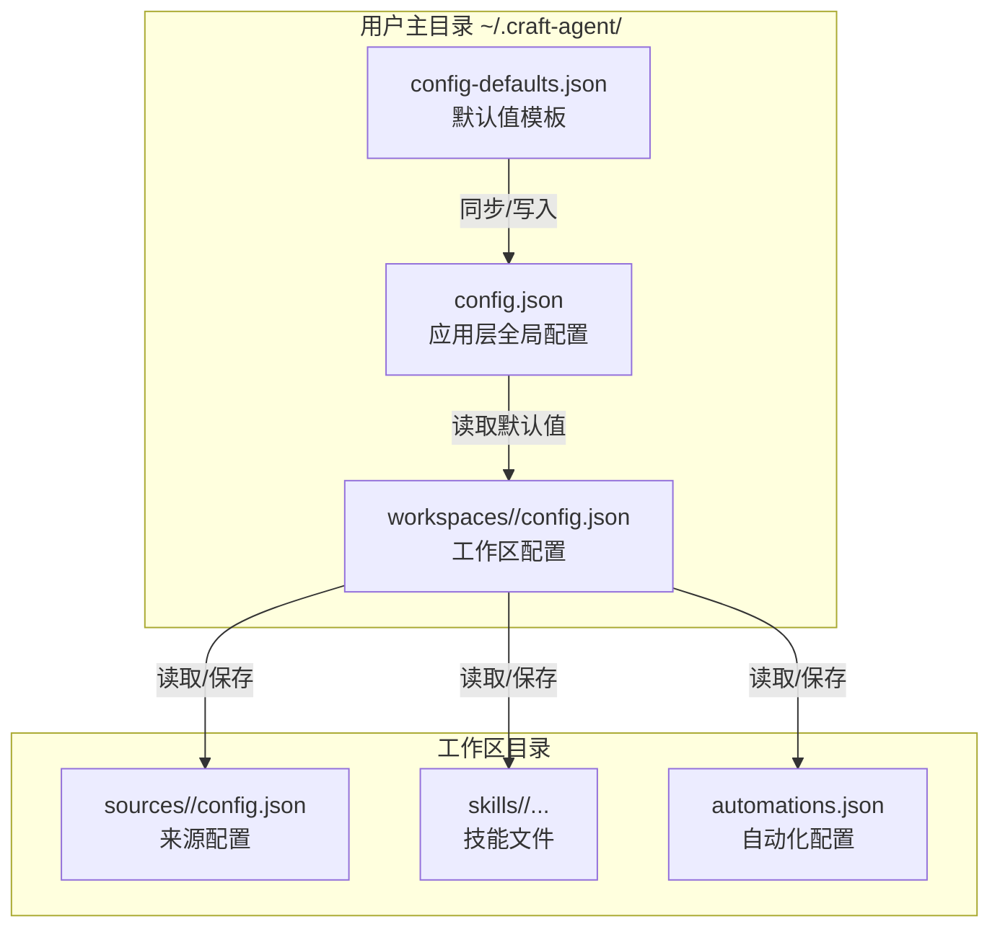
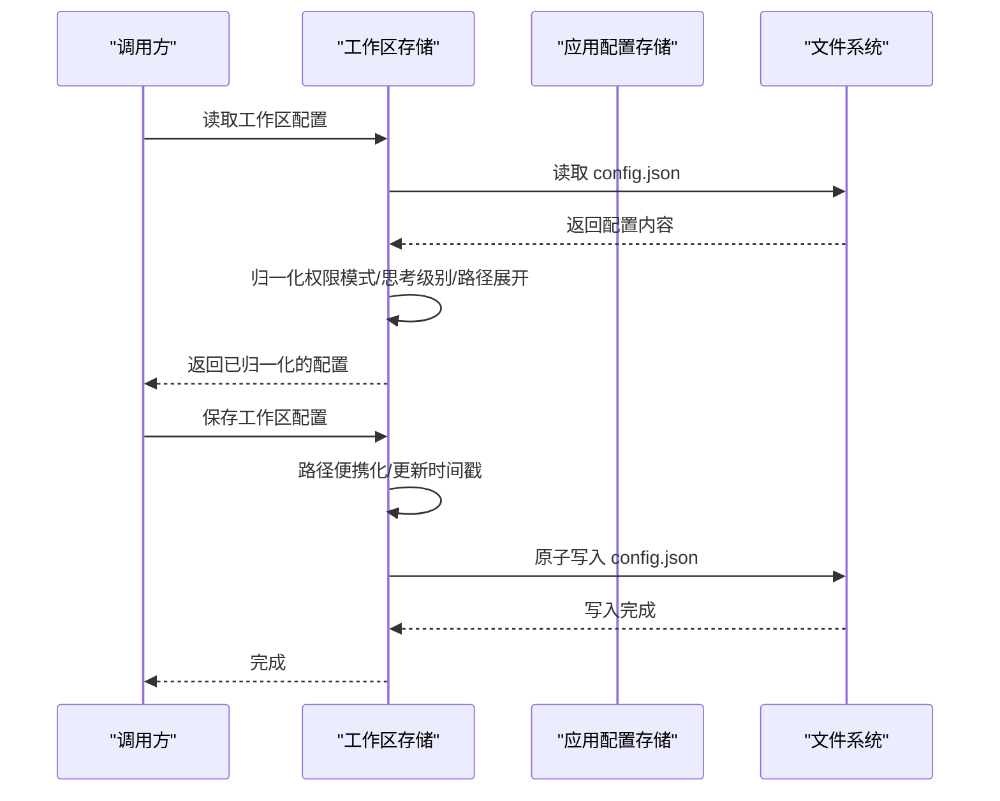
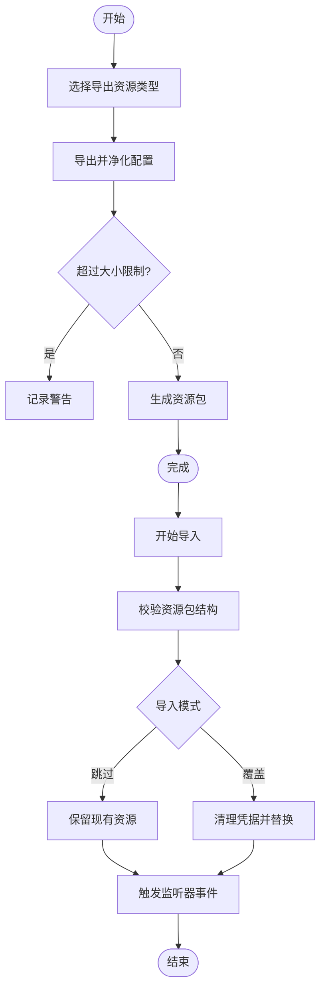
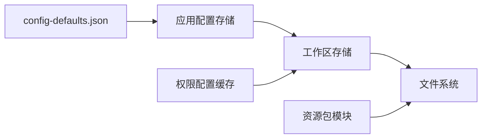

# 工作区配置

<cite>
**本文引用的文件**
- [packages/shared/src/workspaces/storage.ts](file://packages/shared/src/workspaces/storage.ts)
- [packages/shared/src/workspaces/types.ts](file://packages/shared/src/workspaces/types.ts)
- [packages/shared/src/config/storage.ts](file://packages/shared/src/config/storage.ts)
- [packages/shared/src/config/config-defaults-schema.ts](file://packages/shared/src/config/config-defaults-schema.ts)
- [apps/electron/resources/config-defaults.json](file://apps/electron/resources/config-defaults.json)
- [packages/shared/src/resources/resource-bundle.ts](file://packages/shared/src/resources/resource-bundle.ts)
- [packages/shared/src/protocol/dto.ts](file://packages/shared/src/protocol/dto.ts)
- [packages/shared/src/workspaces/__tests__/storage-permission-mode-normalization.test.ts](file://packages/shared/src/workspaces/__tests__/storage-permission-mode-normalization.test.ts)
- [packages/shared/src/agent/permissions-config.ts](file://packages/shared/src/agent/permissions-config.ts)
</cite>

## 目录
1. [简介](#简介)
2. [项目结构](#项目结构)
3. [核心组件](#核心组件)
4. [架构总览](#架构总览)
5. [详细组件分析](#详细组件分析)
6. [依赖关系分析](#依赖关系分析)
7. [性能考量](#性能考量)
8. [故障排除指南](#故障排除指南)
9. [结论](#结论)
10. [附录](#附录)

## 简介
本文件系统化阐述工作区配置管理，覆盖以下方面：
- 工作区配置文件结构与字段语义
- 工作区级LLM提供商设置、思考模式、MCP服务器、权限模式等配置项
- 配置继承机制、默认值覆盖策略、验证规则
- 配置备份、导入/导出与版本管理
- 配置优化建议、性能调优参数、安全配置指南
- 故障排除、回滚机制与兼容性处理

## 项目结构
工作区配置位于独立的工作区目录中，采用“按需加载 + 默认值覆盖”的设计：
- 全局配置（应用层）：存储在用户主目录下的配置文件，包含全局默认项与工作区默认项
- 工作区配置（工作区层）：存储在工作区根目录的config.json，仅包含该工作区的差异化设置
- 资源包（可移植导出/导入）：包含来源、技能、自动化等资源，支持跨机器迁移

图示来源
- [packages/shared/src/config/storage.ts:226-286](file://packages/shared/src/config/storage.ts#L226-L286)
- [packages/shared/src/workspaces/storage.ts:99-164](file://packages/shared/src/workspaces/storage.ts#L99-L164)
- [apps/electron/resources/config-defaults.json:1-24](file://apps/electron/resources/config-defaults.json#L1-L24)

章节来源
- [packages/shared/src/config/storage.ts:226-286](file://packages/shared/src/config/storage.ts#L226-L286)
- [packages/shared/src/workspaces/storage.ts:99-164](file://packages/shared/src/workspaces/storage.ts#L99-L164)
- [apps/electron/resources/config-defaults.json:1-24](file://apps/electron/resources/config-defaults.json#L1-L24)

## 核心组件
- 工作区配置模型与路径工具
  - 工作区配置接口、本地MCP配置、工作区摘要与加载信息
  - 工作区根目录、sources/sessions/skills子目录路径解析
- 工作区配置读写与归一化
  - 加载/保存config.json；路径展开/便携化；权限模式与思考模式归一化
- 应用层默认值与工作区默认值
  - 同步config-defaults.json；工作区默认值合并策略
- 资源包导出/导入
  - 源配置净化（移除敏感字段与运行时状态）；原子替换导入；大小限制与校验
- 权限配置缓存与合并
  - 工作区/来源/默认权限配置缓存；上下文合并；失效与清理

章节来源
- [packages/shared/src/workspaces/types.ts:33-62](file://packages/shared/src/workspaces/types.ts#L33-L62)
- [packages/shared/src/workspaces/storage.ts:99-164](file://packages/shared/src/workspaces/storage.ts#L99-L164)
- [packages/shared/src/config/storage.ts:165-196](file://packages/shared/src/config/storage.ts#L165-L196)
- [packages/shared/src/resources/resource-bundle.ts:119-167](file://packages/shared/src/resources/resource-bundle.ts#L119-L167)
- [packages/shared/src/agent/permissions-config.ts:431-681](file://packages/shared/src/agent/permissions-config.ts#L431-L681)

## 架构总览
工作区配置的读取与写入遵循“环境变量优先 > 工作区配置 > 应用默认”的继承链，并在保存时进行路径便携化与原子写入，确保跨机器一致性与数据安全。

图示来源
- [packages/shared/src/workspaces/storage.ts:99-164](file://packages/shared/src/workspaces/storage.ts#L99-L164)
- [packages/shared/src/config/storage.ts:273-286](file://packages/shared/src/config/storage.ts#L273-L286)

章节来源
- [packages/shared/src/workspaces/storage.ts:99-164](file://packages/shared/src/workspaces/storage.ts#L99-L164)
- [packages/shared/src/config/storage.ts:273-286](file://packages/shared/src/config/storage.ts#L273-L286)

## 详细组件分析

### 工作区配置文件结构与字段
- 文件位置：工作区根目录config.json
- 关键字段
  - defaults：工作区默认会话设置
    - model：默认模型标识（可选）
    - defaultLlmConnection：默认LLM连接标识（可选，覆盖应用层）
    - enabledSourceSlugs：默认启用的来源slug列表
    - permissionMode：默认权限模式（如safe/ask/allow-all）
    - cyclablePermissionModes：可循环切换的权限模式集合（最少2个）
    - workingDirectory：默认工作目录（支持~与${HOME}展开）
    - thinkingLevel：默认思考级别（如medium）
    - colorTheme：主题ID（undefined表示继承应用默认）
  - localMcpServers：本地MCP服务器开关
    - enabled：是否允许通过stdio启动本地MCP服务
  - createdAt/updatedAt：创建与最后更新时间戳

章节来源
- [packages/shared/src/workspaces/types.ts:33-62](file://packages/shared/src/workspaces/types.ts#L33-L62)
- [packages/shared/src/workspaces/storage.ts:99-164](file://packages/shared/src/workspaces/storage.ts#L99-L164)

### 工作区级LLM提供商设置
- 默认LLM连接
  - 工作区层可通过defaultLlmConnection覆盖应用层默认连接
  - 连接有效性由应用层LLM连接管理器保证
- 思考模式配置
  - 支持从旧值“think”归一化为“medium”
  - 新建工作区时继承应用默认思考级别
- 权限模式配置
  - permissionMode与cyclablePermissionModes在读取时自动归一化
  - 不合法或过短的cycle列表将回退到完整顺序

章节来源
- [packages/shared/src/workspaces/storage.ts:117-132](file://packages/shared/src/workspaces/storage.ts#L117-L132)
- [packages/shared/src/config/storage.ts:165-196](file://packages/shared/src/config/storage.ts#L165-L196)
- [packages/shared/src/workspaces/__tests__/storage-permission-mode-normalization.test.ts:20-42](file://packages/shared/src/workspaces/__tests__/storage-permission-mode-normalization.test.ts#L20-L42)

### MCP服务器配置
- 解析顺序
  - 环境变量CRAFT_LOCAL_MCP_ENABLED（最高优先级）
  - 工作区config.json中的localMcpServers.enabled
  - 应用默认（true）
- 作用范围
  - 控制是否允许通过stdio启动本地MCP服务
  - 与HTTP MCP服务互不冲突，可并行使用

章节来源
- [packages/shared/src/workspaces/storage.ts:479-494](file://packages/shared/src/workspaces/storage.ts#L479-L494)

### 权限模式设置
- 归一化规则
  - canonical名称映射到标准枚举
  - 去重与长度校验（至少2个）
- 缓存与合并
  - 工作区/来源/默认权限配置分别缓存
  - 上下文合并采用“自定义扩展默认”的加法式合并
  - 监听变更时精确失效，避免误清空

章节来源
- [packages/shared/src/workspaces/storage.ts:117-126](file://packages/shared/src/workspaces/storage.ts#L117-L126)
- [packages/shared/src/agent/permissions-config.ts:431-681](file://packages/shared/src/agent/permissions-config.ts#L431-L681)

### 配置继承机制与默认值覆盖
- 继承链
  - 环境变量 > 工作区配置 > 应用默认
- 默认值来源
  - 应用默认：config-defaults.json（随应用打包）
  - 工作区默认：应用默认中的workspaceDefaults
- 合并与落盘
  - 新建工作区时，将应用默认中的workspaceDefaults合并到工作区defaults
  - 保存时对路径进行便携化（~与${HOME}），并记录updatedAt

章节来源
- [packages/shared/src/config/storage.ts:165-196](file://packages/shared/src/config/storage.ts#L165-L196)
- [packages/shared/src/workspaces/storage.ts:292-347](file://packages/shared/src/workspaces/storage.ts#L292-L347)
- [apps/electron/resources/config-defaults.json:15-22](file://apps/electron/resources/config-defaults.json#L15-L22)

### 配置验证规则
- 工作区配置
  - 读取时对permissionMode/cyclablePermissionModes进行归一化与长度校验
  - 对thinkingLevel进行旧值归一化
  - workingDirectory支持路径展开与便携化
- 应用默认
  - workspaceDefaults中的permissionMode/cyclablePermissionModes在加载时归一化
- 导入/导出
  - 自动净化敏感字段（如mcp.env、mcp.headers、api.defaultHeaders等）
  - 校验bundle结构、重复slug、事件类型合法性、文件去重与大小限制

章节来源
- [packages/shared/src/workspaces/storage.ts:117-132](file://packages/shared/src/workspaces/storage.ts#L117-L132)
- [packages/shared/src/resources/resource-bundle.ts:62-106](file://packages/shared/src/resources/resource-bundle.ts#L62-L106)
- [packages/shared/src/resources/resource-bundle.ts:414-587](file://packages/shared/src/resources/resource-bundle.ts#L414-L587)

### 配置备份、导入与导出
- 导出
  - 支持选择导出sources/skills/automations
  - 自动净化敏感字段与运行时状态
  - 记录导出时间与来源工作区名称
- 导入
  - 使用临时目录+原子重命名，减少监视器事件与确保替换完整性
  - 覆盖模式下清除来源凭据并删除旧目录
  - 自动化导入时清理历史与重试队列
- 版本管理
  - 导入后automations.json版本号递增
  - bundle版本固定为1，便于未来演进

图示来源
- [packages/shared/src/resources/resource-bundle.ts:119-167](file://packages/shared/src/resources/resource-bundle.ts#L119-L167)
- [packages/shared/src/resources/resource-bundle.ts:627-665](file://packages/shared/src/resources/resource-bundle.ts#L627-L665)

章节来源
- [packages/shared/src/resources/resource-bundle.ts:119-167](file://packages/shared/src/resources/resource-bundle.ts#L119-L167)
- [packages/shared/src/resources/resource-bundle.ts:627-665](file://packages/shared/src/resources/resource-bundle.ts#L627-L665)

### 配置优化建议与性能调优
- 提升响应速度
  - 合理设置workingDirectory，避免频繁跨盘访问
  - 适度开启extendedPromptCache以降低重复请求开销（注意成本与延迟权衡）
- 减少令牌消耗
  - 在支持的平台启用rtk压缩（需要rtk二进制可用）
- 上下文窗口
  - 如需1M上下文，按需开启enable1MContext（需满足提供商Tier要求）

章节来源
- [packages/shared/src/config/storage.ts:438-501](file://packages/shared/src/config/storage.ts#L438-L501)

### 安全配置指南
- 导出时自动净化
  - 移除mcp.env、mcp.headers、api.defaultHeaders等潜在敏感字段
  - 清理运行时认证状态与错误信息
- 导入时凭据清理
  - 覆盖导入来源时清除凭据，防止凭据泄露
- 主题与UI
  - colorTheme支持自定义ID，但需符合ID格式规范（字母数字、连字符、下划线，最多64字符）

章节来源
- [packages/shared/src/resources/resource-bundle.ts:62-106](file://packages/shared/src/resources/resource-bundle.ts#L62-L106)
- [packages/shared/src/workspaces/storage.ts:446-452](file://packages/shared/src/workspaces/storage.ts#L446-L452)

## 依赖关系分析
- 工作区配置依赖应用默认配置（config-defaults.json）
- 工作区配置读取时依赖权限模式解析与思考级别归一化
- 导入/导出依赖资源包校验与文件收集/恢复工具
- 权限配置依赖默认权限与来源/工作区自定义配置的缓存与合并

图示来源
- [apps/electron/resources/config-defaults.json:1-24](file://apps/electron/resources/config-defaults.json#L1-L24)
- [packages/shared/src/config/storage.ts:165-196](file://packages/shared/src/config/storage.ts#L165-L196)
- [packages/shared/src/workspaces/storage.ts:99-164](file://packages/shared/src/workspaces/storage.ts#L99-L164)
- [packages/shared/src/resources/resource-bundle.ts:119-167](file://packages/shared/src/resources/resource-bundle.ts#L119-L167)
- [packages/shared/src/agent/permissions-config.ts:576-681](file://packages/shared/src/agent/permissions-config.ts#L576-L681)

章节来源
- [packages/shared/src/config/storage.ts:165-196](file://packages/shared/src/config/storage.ts#L165-L196)
- [packages/shared/src/workspaces/storage.ts:99-164](file://packages/shared/src/workspaces/storage.ts#L99-L164)
- [packages/shared/src/resources/resource-bundle.ts:119-167](file://packages/shared/src/resources/resource-bundle.ts#L119-L167)
- [packages/shared/src/agent/permissions-config.ts:576-681](file://packages/shared/src/agent/permissions-config.ts#L576-L681)

## 性能考量
- 路径便携化与展开
  - 保存时将绝对路径转换为便携形式（~与${HOME}），提升跨机器迁移性能
- 原子写入
  - 使用原子写入避免崩溃导致的损坏，减少后续修复成本
- 缓存与合并
  - 权限配置采用缓存与精确失效，避免重复构建与无效计算

章节来源
- [packages/shared/src/workspaces/storage.ts:144-164](file://packages/shared/src/workspaces/storage.ts#L144-L164)
- [packages/shared/src/agent/permissions-config.ts:668-681](file://packages/shared/src/agent/permissions-config.ts#L668-L681)

## 故障排除指南
- 配置读取失败
  - 检查config.json是否存在且可解析
  - 若存在旧字段（如旧版thinkingLevel），系统会自动归一化
- 权限模式异常
  - 若cyclablePermissionModes数量不足或包含非法值，将回退到完整顺序
- MCP启用问题
  - 确认环境变量CRAFT_LOCAL_MCP_ENABLED、工作区配置与应用默认三者顺序
- 导入失败
  - 检查bundle结构与大小限制；确认事件类型合法、文件无重复
  - 覆盖导入会清理凭据，若出现认证问题请重新配置来源

章节来源
- [packages/shared/src/workspaces/storage.ts:117-132](file://packages/shared/src/workspaces/storage.ts#L117-L132)
- [packages/shared/src/workspaces/storage.ts:479-494](file://packages/shared/src/workspaces/storage.ts#L479-L494)
- [packages/shared/src/resources/resource-bundle.ts:414-587](file://packages/shared/src/resources/resource-bundle.ts#L414-L587)

## 结论
工作区配置管理通过清晰的继承链、严格的默认值覆盖与强大的归一化机制，实现了在多工作区场景下的灵活与一致。配合资源包的导入/导出与净化策略，既保障了安全性，也提升了可移植性与可维护性。建议在生产环境中结合性能与安全指南，合理配置思考级别、MCP开关与权限模式，并定期导出资源包以实现版本化与快速回滚。

## 附录
- 配置项速查
  - defaults.model：默认模型
  - defaults.defaultLlmConnection：默认LLM连接
  - defaults.enabledSourceSlugs：默认启用来源
  - defaults.permissionMode / defaults.cyclablePermissionModes：权限模式
  - defaults.workingDirectory：默认工作目录
  - defaults.thinkingLevel：默认思考级别
  - defaults.colorTheme：主题ID
  - localMcpServers.enabled：本地MCP开关
- 相关类型定义参考
  - 工作区配置接口与本地MCP配置
  - 工作区设置DTO（用于RPC/前端交互）

章节来源
- [packages/shared/src/workspaces/types.ts:33-62](file://packages/shared/src/workspaces/types.ts#L33-L62)
- [packages/shared/src/protocol/dto.ts:501-511](file://packages/shared/src/protocol/dto.ts#L501-L511)