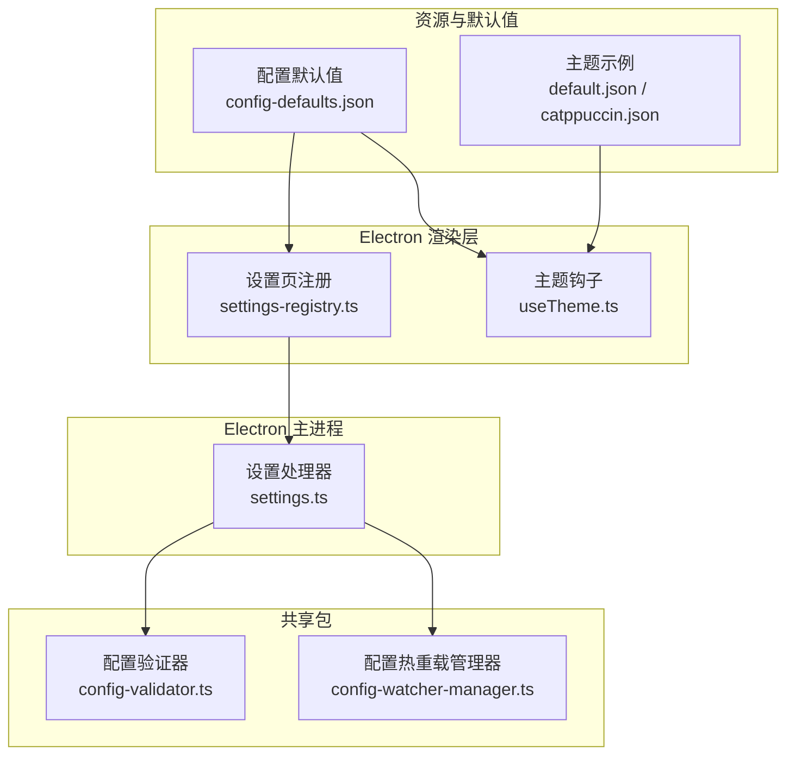
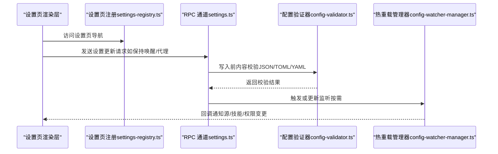
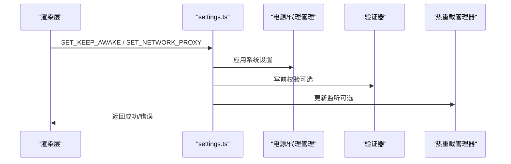
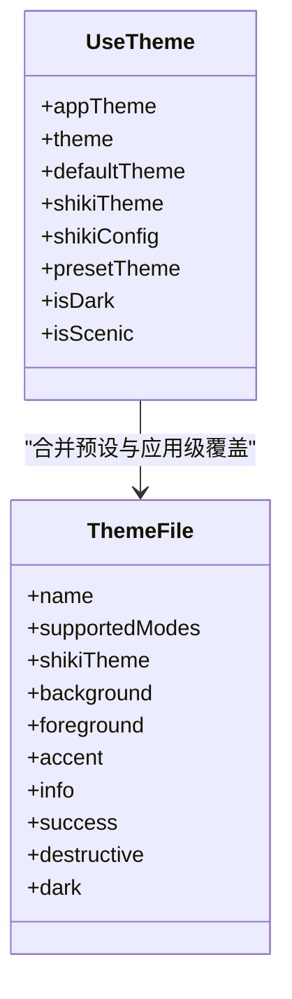
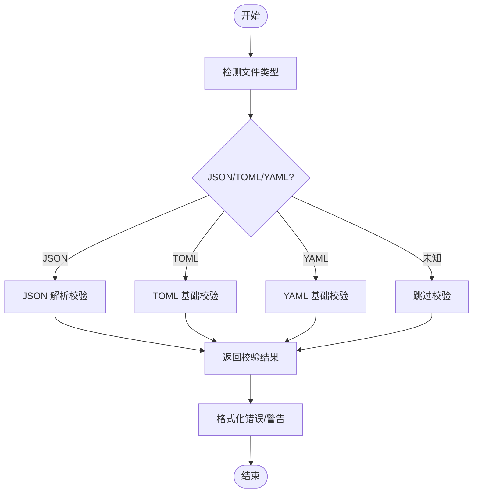
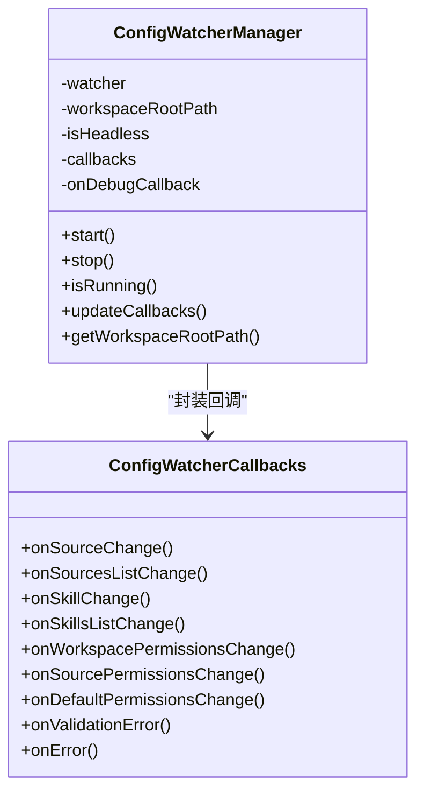
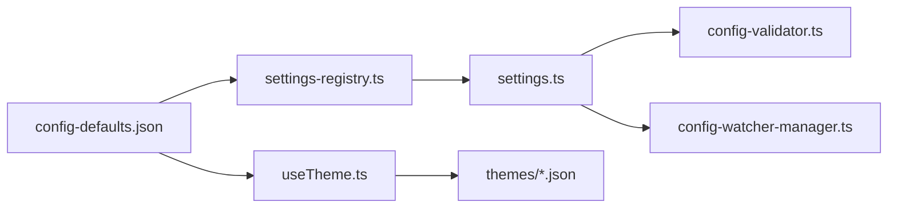

# 应用配置

<cite>
**本文引用的文件**
- [apps/electron/resources/config-defaults.json](file://apps/electron/resources/config-defaults.json)
- [apps/electron/src/main/handlers/settings.ts](file://apps/electron/src/main/handlers/settings.ts)
- [apps/electron/src/shared/settings-registry.ts](file://apps/electron/src/shared/settings-registry.ts)
- [packages/shared/src/config/config-defaults-schema.ts](file://packages/shared/src/config/config-defaults-schema.ts)
- [packages/shared/src/agent/core/config-validator.ts](file://packages/shared/src/agent/core/config-validator.ts)
- [packages/shared/src/agent/core/config-watcher-manager.ts](file://packages/shared/src/agent/core/config-watcher-manager.ts)
- [apps/electron/resources/themes/default.json](file://apps/electron/resources/themes/default.json)
- [apps/electron/resources/themes/catppuccin.json](file://apps/electron/resources/themes/catppuccin.json)
- [apps/electron/src/renderer/hooks/useTheme.ts](file://apps/electron/src/renderer/hooks/useTheme.ts)
</cite>

## 目录
1. [简介](#简介)
2. [项目结构](#项目结构)
3. [核心组件](#核心组件)
4. [架构总览](#架构总览)
5. [详细组件分析](#详细组件分析)
6. [依赖关系分析](#依赖关系分析)
7. [性能考虑](#性能考虑)
8. [故障排除指南](#故障排除指南)
9. [结论](#结论)
10. [附录](#附录)

## 简介
本文件系统性阐述应用配置体系：配置文件结构与默认值、配置项分类（用户界面、输入、通知等）、配置验证与热重载、备份与恢复、环境变量与文件位置、权限管理，以及最佳实践与性能优化建议。目标读者包括需要调整应用行为的普通用户与系统管理员。

## 项目结构
应用配置系统由“默认值定义”“类型约束”“主进程设置处理器”“渲染层主题与设置页注册”“配置验证器”“配置热重载监听器”等模块协同组成。默认值来源于打包资源中的 JSON；类型约束在共享包中定义；主进程通过 RPC 处理器更新运行时设置；渲染层负责主题解析与设置页面导航；共享包提供配置验证与热重载能力。

图表来源
- [apps/electron/src/main/handlers/settings.ts:1-31](file://apps/electron/src/main/handlers/settings.ts#L1-L31)
- [apps/electron/src/shared/settings-registry.ts:1-77](file://apps/electron/src/shared/settings-registry.ts#L1-L77)
- [packages/shared/src/agent/core/config-validator.ts:1-301](file://packages/shared/src/agent/core/config-validator.ts#L1-L301)
- [packages/shared/src/agent/core/config-watcher-manager.ts:1-267](file://packages/shared/src/agent/core/config-watcher-manager.ts#L1-L267)
- [apps/electron/resources/config-defaults.json:1-24](file://apps/electron/resources/config-defaults.json#L1-L24)
- [apps/electron/resources/themes/default.json:1-26](file://apps/electron/resources/themes/default.json#L1-L26)
- [apps/electron/resources/themes/catppuccin.json:1-27](file://apps/electron/resources/themes/catppuccin.json#L1-L27)

章节来源
- [apps/electron/resources/config-defaults.json:1-24](file://apps/electron/resources/config-defaults.json#L1-L24)
- [apps/electron/src/shared/settings-registry.ts:1-77](file://apps/electron/src/shared/settings-registry.ts#L1-L77)
- [apps/electron/src/main/handlers/settings.ts:1-31](file://apps/electron/src/main/handlers/settings.ts#L1-L31)
- [packages/shared/src/config/config-defaults-schema.ts:1-34](file://packages/shared/src/config/config-defaults-schema.ts#L1-L34)
- [packages/shared/src/agent/core/config-validator.ts:1-301](file://packages/shared/src/agent/core/config-validator.ts#L1-L301)
- [packages/shared/src/agent/core/config-watcher-manager.ts:1-267](file://packages/shared/src/agent/core/config-watcher-manager.ts#L1-L267)
- [apps/electron/resources/themes/default.json:1-26](file://apps/electron/resources/themes/default.json#L1-L26)
- [apps/electron/resources/themes/catppuccin.json:1-27](file://apps/electron/resources/themes/catppuccin.json#L1-L27)
- [apps/electron/src/renderer/hooks/useTheme.ts:1-77](file://apps/electron/src/renderer/hooks/useTheme.ts#L1-L77)

## 核心组件
- 配置默认值与类型约束
  - 默认值：集中于资源文件，包含应用级与工作区级默认项。
  - 类型约束：在共享包中以 TypeScript 接口定义默认值结构，确保类型安全。
- 设置处理器（主进程）
  - 通过 RPC 注册 GUI 专属设置通道，如“保持唤醒”“网络代理”，实现对运行时设置的更新与持久化。
- 设置页注册（渲染层）
  - 统一维护设置页清单，决定设置导航顺序与国际化标签键，派生路由与校验逻辑。
- 主题系统
  - 预设主题文件包含明暗模式支持与语法高亮映射；渲染层钩子负责合并应用级覆盖并解析最终主题。
- 配置验证器
  - 支持 JSON/TOML/YAML 的内容预写入校验，提供错误/警告信息与行列定位辅助。
- 配置热重载管理器
  - 针对源/技能/权限等配置变更提供统一回调接口，支持头无模式跳过与调试日志。

章节来源
- [apps/electron/resources/config-defaults.json:1-24](file://apps/electron/resources/config-defaults.json#L1-L24)
- [packages/shared/src/config/config-defaults-schema.ts:1-34](file://packages/shared/src/config/config-defaults-schema.ts#L1-L34)
- [apps/electron/src/main/handlers/settings.ts:1-31](file://apps/electron/src/main/handlers/settings.ts#L1-L31)
- [apps/electron/src/shared/settings-registry.ts:1-77](file://apps/electron/src/shared/settings-registry.ts#L1-L77)
- [apps/electron/src/renderer/hooks/useTheme.ts:1-77](file://apps/electron/src/renderer/hooks/useTheme.ts#L1-L77)
- [packages/shared/src/agent/core/config-validator.ts:1-301](file://packages/shared/src/agent/core/config-validator.ts#L1-L301)
- [packages/shared/src/agent/core/config-watcher-manager.ts:1-267](file://packages/shared/src/agent/core/config-watcher-manager.ts#L1-L267)

## 架构总览
下图展示从设置页到主进程处理、再到配置验证与热重载的整体流程。

图表来源
- [apps/electron/src/shared/settings-registry.ts:1-77](file://apps/electron/src/shared/settings-registry.ts#L1-L77)
- [apps/electron/src/main/handlers/settings.ts:1-31](file://apps/electron/src/main/handlers/settings.ts#L1-L31)
- [packages/shared/src/agent/core/config-validator.ts:1-301](file://packages/shared/src/agent/core/config-validator.ts#L1-L301)
- [packages/shared/src/agent/core/config-watcher-manager.ts:1-267](file://packages/shared/src/agent/core/config-watcher-manager.ts#L1-L267)

## 详细组件分析

### 配置文件结构与默认值
- 结构要点
  - 版本号与描述用于版本追踪与说明。
  - defaults：应用级默认项，涵盖通知开关、颜色主题、自动大写、发送键位、拼写检查、保持唤醒、工具描述丰富度、提示缓存扩展、浏览器工具启用等。
  - workspaceDefaults：工作区级默认项，包含思考层级、权限模式、可循环切换的权限模式列表、本地 MCP 服务器启用开关。
- 类型约束
  - 使用 TypeScript 接口约束字段类型与取值范围，确保默认值与使用方一致。
- 默认值来源
  - 默认值文件为打包资源，类型定义位于共享包，二者保持同步。

章节来源
- [apps/electron/resources/config-defaults.json:1-24](file://apps/electron/resources/config-defaults.json#L1-L24)
- [packages/shared/src/config/config-defaults-schema.ts:1-34](file://packages/shared/src/config/config-defaults-schema.ts#L1-L34)

### 配置项分类与典型场景
- 用户界面配置
  - 颜色主题：通过主题文件定义明暗模式配色与语法高亮映射；渲染层钩子支持应用级覆盖合并。
  - 字体与布局：主题文件包含背景、前景、强调色等，布局由主题与组件样式共同决定。
- 输入配置
  - 键盘快捷键：发送消息键位支持 enter 或 cmd-enter。
  - 自动大写与拼写检查：可按需开启。
  - 工具描述丰富度与浏览器工具启用：影响工具面板显示与可用性。
- 通知配置
  - 通知开关：全局控制是否接收通知。
- 工作区与权限
  - 思考层级与权限模式：影响代理行为与访问控制。
  - 本地 MCP 服务器：控制本地工具服务启用。

章节来源
- [apps/electron/resources/config-defaults.json:1-24](file://apps/electron/resources/config-defaults.json#L1-L24)
- [apps/electron/resources/themes/default.json:1-26](file://apps/electron/resources/themes/default.json#L1-L26)
- [apps/electron/resources/themes/catppuccin.json:1-27](file://apps/electron/resources/themes/catppuccin.json#L1-L27)
- [apps/electron/src/renderer/hooks/useTheme.ts:1-77](file://apps/electron/src/renderer/hooks/useTheme.ts#L1-L77)

### 设置处理器与运行时更新
- GUI 专属设置
  - 保持唤醒：通过主进程电源管理接口更新设置并同步状态。
  - 网络代理：更新 Electron 会话代理配置。
- 更新流程
  - 渲染层触发 RPC 请求 → 主进程处理器执行持久化与系统集成 → 可选触发验证与热重载。

图表来源
- [apps/electron/src/main/handlers/settings.ts:1-31](file://apps/electron/src/main/handlers/settings.ts#L1-L31)
- [packages/shared/src/agent/core/config-validator.ts:1-301](file://packages/shared/src/agent/core/config-validator.ts#L1-L301)
- [packages/shared/src/agent/core/config-watcher-manager.ts:1-267](file://packages/shared/src/agent/core/config-watcher-manager.ts#L1-L267)

章节来源
- [apps/electron/src/main/handlers/settings.ts:1-31](file://apps/electron/src/main/handlers/settings.ts#L1-L31)

### 设置页注册与导航
- 设置页清单集中定义，决定导航顺序与国际化标签键。
- 派生路由与校验逻辑基于该清单生成，新增页面只需在此处登记。

章节来源
- [apps/electron/src/shared/settings-registry.ts:1-77](file://apps/electron/src/shared/settings-registry.ts#L1-L77)

### 主题系统与应用级覆盖
- 预设主题文件包含名称、描述、作者、许可证、支持模式、语法高亮映射及明暗配色。
- 渲染层钩子支持应用级主题覆盖（appTheme），与预设主题合并后解析为最终主题对象，并输出是否深色、是否风景模式等状态。

图表来源
- [apps/electron/src/renderer/hooks/useTheme.ts:1-77](file://apps/electron/src/renderer/hooks/useTheme.ts#L1-L77)
- [apps/electron/resources/themes/default.json:1-26](file://apps/electron/resources/themes/default.json#L1-L26)
- [apps/electron/resources/themes/catppuccin.json:1-27](file://apps/electron/resources/themes/catppuccin.json#L1-L27)

章节来源
- [apps/electron/src/renderer/hooks/useTheme.ts:1-77](file://apps/electron/src/renderer/hooks/useTheme.ts#L1-L77)
- [apps/electron/resources/themes/default.json:1-26](file://apps/electron/resources/themes/default.json#L1-L26)
- [apps/electron/resources/themes/catppuccin.json:1-27](file://apps/electron/resources/themes/catppuccin.json#L1-L27)

### 配置验证机制
- 文件类型检测：根据扩展名识别 JSON/JSONC/TOML/YAML。
- 内容校验：
  - JSON：解析语法校验，提取行列位置信息增强错误提示。
  - TOML：基础语法检查（段落括号闭合、键值对等）。
  - YAML：基础语法检查（缩进、映射键等），警告为主。
- 输出格式化：将错误与警告汇总为可读字符串，便于用户/代理展示。

图表来源
- [packages/shared/src/agent/core/config-validator.ts:1-301](file://packages/shared/src/agent/core/config-validator.ts#L1-L301)

章节来源
- [packages/shared/src/agent/core/config-validator.ts:1-301](file://packages/shared/src/agent/core/config-validator.ts#L1-L301)

### 配置热重载与监听
- 监听范围：源配置、技能配置、权限配置、默认权限、源权限等。
- 运行模式：支持头无模式跳过监听以降低开销。
- 回调简化：对外暴露简化的回调接口，内部统一调试日志与错误映射。
- 生命周期：启动/停止/状态查询/动态更新回调。

图表来源
- [packages/shared/src/agent/core/config-watcher-manager.ts:1-267](file://packages/shared/src/agent/core/config-watcher-manager.ts#L1-L267)

章节来源
- [packages/shared/src/agent/core/config-watcher-manager.ts:1-267](file://packages/shared/src/agent/core/config-watcher-manager.ts#L1-L267)

### 配置备份与恢复
- 建议策略
  - 备份：将用户目录下的配置文件（如主配置、偏好、工作区配置、权限、主题等）进行归档。
  - 恢复：在新环境或重装后，将备份文件还原至对应路径，随后重启应用使热重载生效。
- 注意事项
  - 不同文件类型采用不同校验策略，恢复前建议先进行语法校验。
  - 恢复后可通过热重载回调确认变更已加载。

章节来源
- [packages/shared/src/agent/core/config-validator.ts:1-301](file://packages/shared/src/agent/core/config-validator.ts#L1-L301)
- [packages/shared/src/agent/core/config-watcher-manager.ts:1-267](file://packages/shared/src/agent/core/config-watcher-manager.ts#L1-L267)

### 环境变量与配置文件位置
- 默认值来源：打包资源中的默认值文件。
- 配置文件位置（示例）：共享包中定义了若干已知配置文件路径模式，可用于识别与校验。
- 环境变量：未在现有代码中发现显式环境变量配置项；若需引入，建议在主进程初始化阶段读取并注入默认值。

章节来源
- [apps/electron/resources/config-defaults.json:1-24](file://apps/electron/resources/config-defaults.json#L1-L24)
- [packages/shared/src/agent/core/config-validator.ts:1-301](file://packages/shared/src/agent/core/config-validator.ts#L1-L301)

### 权限管理
- 权限模式：支持安全模式与允许全部等模式，且可循环切换。
- 工作区与默认权限：分别提供工作区级与应用级权限变更回调，便于热重载响应。

章节来源
- [apps/electron/resources/config-defaults.json:1-24](file://apps/electron/resources/config-defaults.json#L1-L24)
- [packages/shared/src/agent/core/config-watcher-manager.ts:1-267](file://packages/shared/src/agent/core/config-watcher-manager.ts#L1-L267)

## 依赖关系分析
- 耦合与内聚
  - 设置页注册与渲染层高度内聚，通过单一清单派生导航与校验。
  - 主进程设置处理器仅处理 GUI 专属设置，职责清晰。
  - 验证器与热重载管理器作为横切关注点被多处调用，耦合度低。
- 外部依赖
  - Electron 平台 API（电源管理、网络代理）。
  - 文件系统（配置文件读写与监听）。
- 循环依赖
  - 当前结构未见循环依赖迹象。

图表来源
- [apps/electron/src/shared/settings-registry.ts:1-77](file://apps/electron/src/shared/settings-registry.ts#L1-L77)
- [apps/electron/src/main/handlers/settings.ts:1-31](file://apps/electron/src/main/handlers/settings.ts#L1-L31)
- [packages/shared/src/agent/core/config-validator.ts:1-301](file://packages/shared/src/agent/core/config-validator.ts#L1-L301)
- [packages/shared/src/agent/core/config-watcher-manager.ts:1-267](file://packages/shared/src/agent/core/config-watcher-manager.ts#L1-L267)
- [apps/electron/resources/config-defaults.json:1-24](file://apps/electron/resources/config-defaults.json#L1-L24)
- [apps/electron/resources/themes/default.json:1-26](file://apps/electron/resources/themes/default.json#L1-L26)
- [apps/electron/resources/themes/catppuccin.json:1-27](file://apps/electron/resources/themes/catppuccin.json#L1-L27)

章节来源
- [apps/electron/src/shared/settings-registry.ts:1-77](file://apps/electron/src/shared/settings-registry.ts#L1-L77)
- [apps/electron/src/main/handlers/settings.ts:1-31](file://apps/electron/src/main/handlers/settings.ts#L1-L31)
- [packages/shared/src/agent/core/config-validator.ts:1-301](file://packages/shared/src/agent/core/config-validator.ts#L1-L301)
- [packages/shared/src/agent/core/config-watcher-manager.ts:1-267](file://packages/shared/src/agent/core/config-watcher-manager.ts#L1-L267)
- [apps/electron/resources/config-defaults.json:1-24](file://apps/electron/resources/config-defaults.json#L1-L24)
- [apps/electron/resources/themes/default.json:1-26](file://apps/electron/resources/themes/default.json#L1-L26)
- [apps/electron/resources/themes/catppuccin.json:1-27](file://apps/electron/resources/themes/catppuccin.json#L1-L27)

## 性能考虑
- 热重载监听
  - 在头无模式下禁用监听，避免不必要的文件系统 IO。
  - 合理选择监听范围，避免对大量无关文件进行监控。
- 验证器
  - 对未知类型文件跳过严格校验，减少无效开销。
  - JSON 校验仅做语法解析，避免深度结构校验带来的额外成本。
- 主题解析
  - 应用级覆盖合并应尽量精简，避免频繁触发重渲染。
- 网络代理与电源管理
  - 更新代理与电源状态时尽量批量处理，减少系统调用次数。

章节来源
- [packages/shared/src/agent/core/config-watcher-manager.ts:1-267](file://packages/shared/src/agent/core/config-watcher-manager.ts#L1-L267)
- [packages/shared/src/agent/core/config-validator.ts:1-301](file://packages/shared/src/agent/core/config-validator.ts#L1-L301)

## 故障排除指南
- 写入配置失败
  - 检查文件类型与扩展名是否匹配（JSON/JSONC/TOML/YAML）。
  - 查看验证器返回的错误/警告信息，定位具体行列。
- 热重载不生效
  - 确认监听器已启动且未处于头无模式。
  - 检查回调是否正确注册，查看调试日志。
- 主题异常
  - 确认主题文件结构完整，明暗模式键齐全。
  - 若使用应用级覆盖，检查覆盖键是否与预设兼容。
- 代理或电源设置未生效
  - 确认主进程处理器已收到 RPC 请求并完成系统调用。
  - 检查平台权限与系统策略限制。

章节来源
- [packages/shared/src/agent/core/config-validator.ts:1-301](file://packages/shared/src/agent/core/config-validator.ts#L1-L301)
- [packages/shared/src/agent/core/config-watcher-manager.ts:1-267](file://packages/shared/src/agent/core/config-watcher-manager.ts#L1-L267)
- [apps/electron/src/main/handlers/settings.ts:1-31](file://apps/electron/src/main/handlers/settings.ts#L1-L31)
- [apps/electron/src/renderer/hooks/useTheme.ts:1-77](file://apps/electron/src/renderer/hooks/useTheme.ts#L1-L77)

## 结论
本配置系统以默认值文件与类型约束为基础，结合主进程设置处理器、渲染层设置页注册与主题钩子，形成完整的配置生命周期。通过配置验证器与热重载管理器，系统在保证安全性的同时实现了灵活的热更新能力。建议在生产环境中遵循备份恢复策略与最小权限原则，并利用验证与调试能力快速定位问题。

## 附录
- 最佳实践
  - 新增设置项时，先在默认值文件与类型约束中定义，再在设置页注册与处理器中实现。
  - 对外部配置文件进行写入前校验，优先使用 JSON 以获得更精确的错误定位。
  - 在头无模式下谨慎启用监听，避免性能损耗。
  - 主题覆盖应遵循预设键集，避免遗漏导致的渲染异常。
- 常见问题速查
  - 无法保存配置：检查文件类型与语法，查看验证器输出。
  - 设置未生效：确认 RPC 处理器已执行，必要时重启应用。
  - 热重载无反应：检查监听器状态与回调注册。