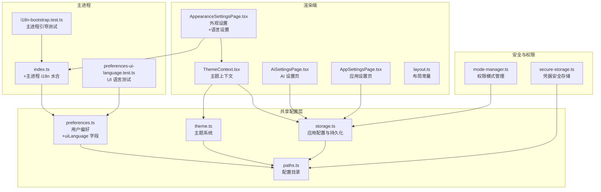
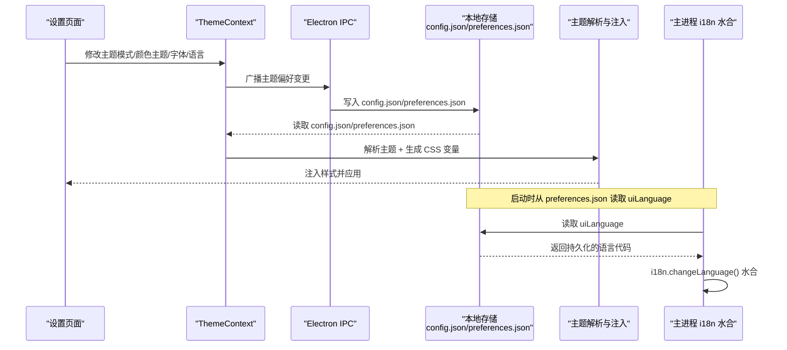
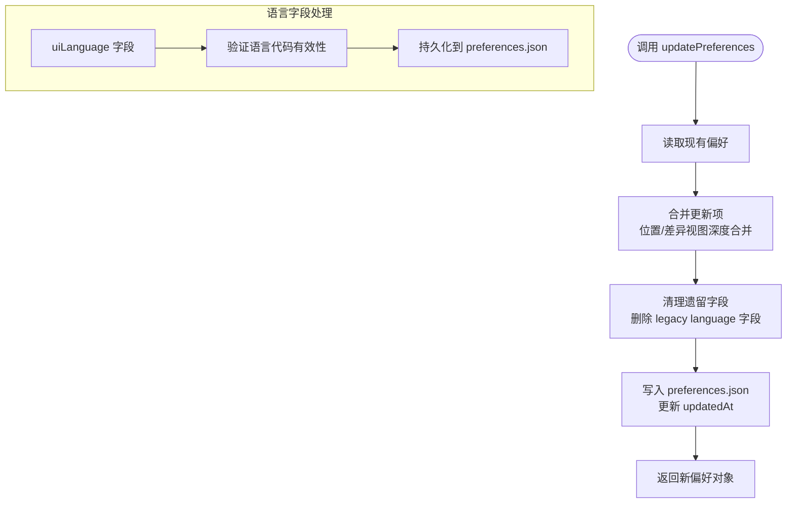
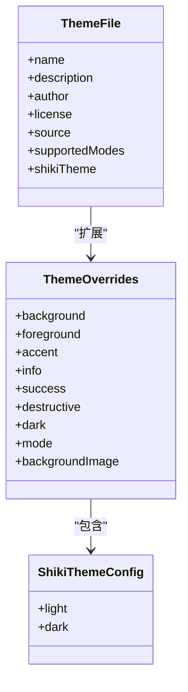
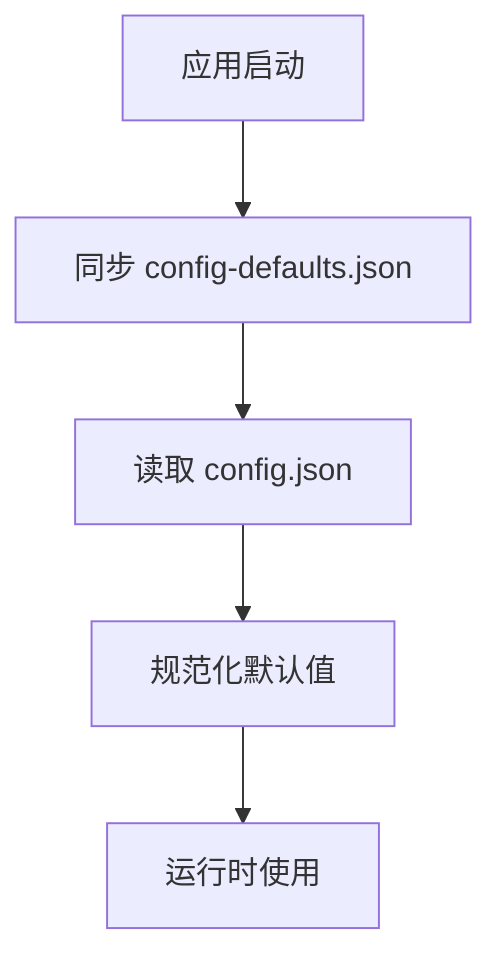
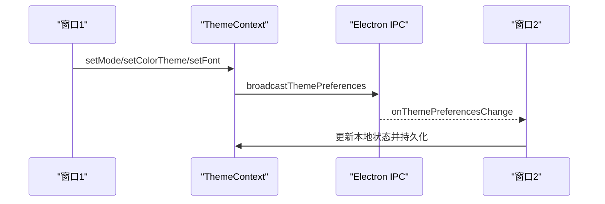
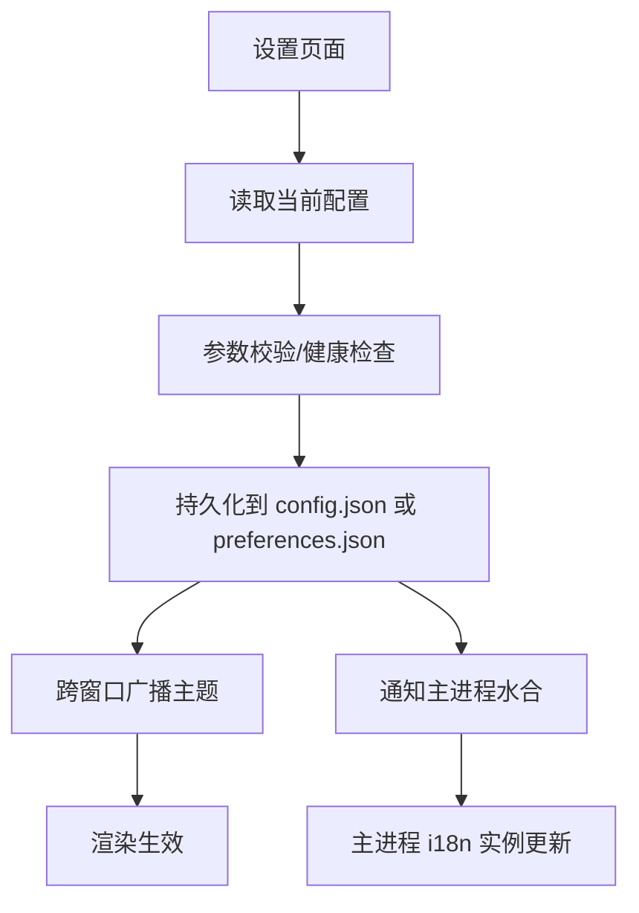
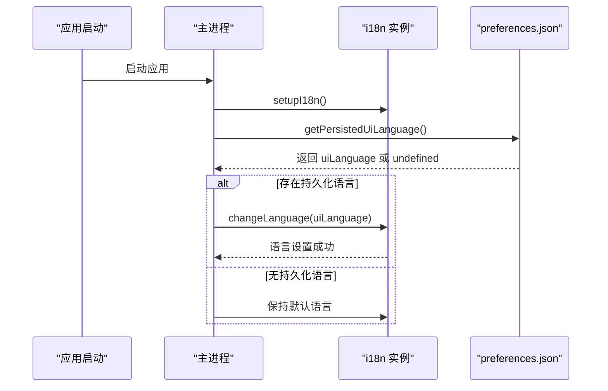
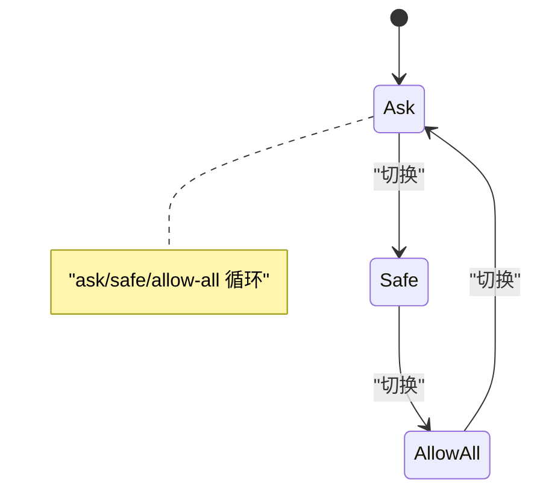
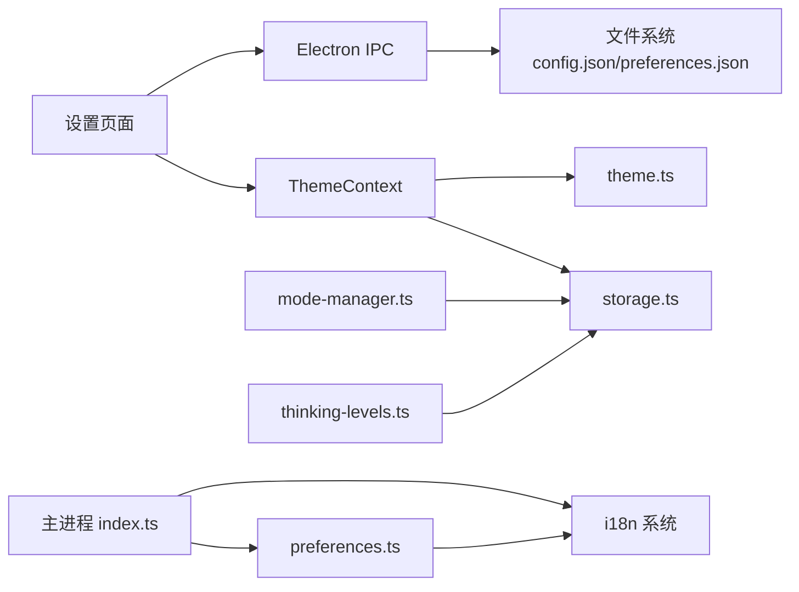

# 用户偏好设置

<cite>
**本文档引用的文件**
- [preferences.ts](file://packages/shared/src/config/preferences.ts)
- [theme.ts](file://packages/shared/src/config/theme.ts)
- [storage.ts](file://packages/shared/src/config/storage.ts)
- [paths.ts](file://packages/shared/src/config/paths.ts)
- [ThemeContext.tsx](file://apps/electron/src/renderer/context/ThemeContext.tsx)
- [AppearanceSettingsPage.tsx](file://apps/electron/src/renderer/pages/settings/AppearanceSettingsPage.tsx)
- [AiSettingsPage.tsx](file://apps/electron/src/renderer/pages/settings/AiSettingsPage.tsx)
- [AppSettingsPage.tsx](file://apps/electron/src/renderer/pages/settings/AppSettingsPage.tsx)
- [layout.ts](file://packages/ui/src/lib/layout.ts)
- [secure-storage.ts](file://packages/shared/src/credentials/backends/secure-storage.ts)
- [mode-manager.ts](file://packages/shared/src/agent/mode-manager.ts)
- [thinking-levels.ts](file://packages/shared/src/agent/thinking-levels.ts)
- [index.ts](file://apps/electron/src/main/index.ts)
- [i18n-bootstrap.test.ts](file://apps/electron/src/main/__tests__/i18n-bootstrap.test.ts)
- [preferences-ui-language.test.ts](file://packages/shared/src/config/__tests__/preferences-ui-language.test.ts)
</cite>

## 更新摘要
**所做更改**
- 新增 UI 语言持久化和水合功能章节
- 更新用户偏好数据结构，增加 uiLanguage 字段
- 新增主进程 i18n 实例水合机制说明
- 增强跨进程语言一致性保障
- 完善语言设置的验证和防护机制

## 目录
1. [简介](#简介)
2. [项目结构](#项目结构)
3. [核心组件](#核心组件)
4. [架构总览](#架构总览)
5. [详细组件分析](#详细组件分析)
6. [依赖关系分析](#依赖关系分析)
7. [性能考虑](#性能考虑)
8. [故障排除指南](#故障排除指南)
9. [结论](#结论)
10. [附录](#附录)

## 简介
本文件面向追求个性化体验的高级用户，系统性阐述 Craft Agents 的用户偏好设置体系：包括主题偏好（深色/浅色/自定义主题）、会话偏好（默认思考模式、权限设置、工具启用状态）、界面偏好（布局选项、显示设置、交互行为）、**UI 语言偏好（跨进程持久化和水合）**；解释偏好数据的本地存储位置与格式、跨窗口同步机制、以及在多实例开发场景下的隔离策略。同时覆盖偏好导入导出、重置恢复、隐私保护等高级能力，并提供性能优化建议与故障诊断方法。

## 项目结构
偏好设置相关的核心代码分布在以下模块：
- 配置与存储：preferences.ts（用户偏好，**新增 uiLanguage 字段**）、theme.ts（主题系统）、storage.ts（应用配置与持久化）、paths.ts（配置目录）
- 渲染端上下文与页面：ThemeContext.tsx（主题上下文与跨窗口同步）、AppearanceSettingsPage.tsx（外观设置，**新增语言设置**）、AiSettingsPage.tsx（AI 设置）、AppSettingsPage.tsx（应用设置）
- 主进程初始化：index.ts（**新增主进程 i18n 水合**）
- 测试验证：i18n-bootstrap.test.ts（主进程 i18n 引导测试）、preferences-ui-language.test.ts（UI 语言偏好测试）

**图表来源**
- [preferences.ts:1-190](file://packages/shared/src/config/preferences.ts#L1-L190)
- [theme.ts:1-318](file://packages/shared/src/config/theme.ts#L1-L318)
- [storage.ts:1-200](file://packages/shared/src/config/storage.ts#L1-L200)
- [paths.ts:1-20](file://packages/shared/src/config/paths.ts#L1-L20)
- [ThemeContext.tsx:1-536](file://apps/electron/src/renderer/context/ThemeContext.tsx#L1-L536)
- [AppearanceSettingsPage.tsx:1-405](file://apps/electron/src/renderer/pages/settings/AppearanceSettingsPage.tsx#L1-L405)
- [AiSettingsPage.tsx:1-800](file://apps/electron/src/renderer/pages/settings/AiSettingsPage.tsx#L1-L800)
- [AppSettingsPage.tsx:1-365](file://apps/electron/src/renderer/pages/settings/AppSettingsPage.tsx#L1-L365)
- [layout.ts:1-97](file://packages/ui/src/lib/layout.ts#L1-L97)
- [index.ts:61-77](file://apps/electron/src/main/index.ts#L61-L77)
- [i18n-bootstrap.test.ts:1-111](file://apps/electron/src/main/__tests__/i18n-bootstrap.test.ts#L1-L111)
- [preferences-ui-language.test.ts:1-168](file://packages/shared/src/config/__tests__/preferences-ui-language.test.ts#L1-L168)
- [secure-storage.ts:235-310](file://packages/shared/src/credentials/backends/secure-storage.ts#L235-L310)
- [mode-manager.ts:224-425](file://packages/shared/src/agent/mode-manager.ts#L224-L425)

## 核心组件
- 用户偏好（preferences.ts，**更新**）
  - 存储位置：~/.craft-agent/preferences.json
  - 支持字段：姓名、时区、位置、语言、备注、diff 视图偏好、Co-authored-by 提交尾注开关、**uiLanguage（内部维护的 UI 语言代码）**、更新时间戳
  - 能力：加载、保存、合并更新、格式化为系统提示词、格式化为可读文本、**UI 语言持久化与验证**
- 主题系统（theme.ts + storage.ts）
  - 应用级主题：preset 主题 + 深色覆盖 + scenic 模式 + 背景图片
  - 存储位置：~/.craft-agent/themes/*.json（预设主题），config.json（颜色主题选择）
  - 运行时解析与 CSS 变量注入，支持深色/浅色/系统模式切换
- 应用配置（storage.ts）
  - 存储位置：~/.craft-agent/config.json
  - 包含：LLM 连接、默认思考级别、通知、颜色主题、输入设置、电源设置、工具开关、网络代理、RTK 等
- 多实例路径（paths.ts）
  - 通过环境变量 CRAFT_CONFIG_DIR 支持多实例开发隔离，默认 ~/.craft-agent/
- 渲染端主题上下文（ThemeContext.tsx）
  - 跨窗口主题偏好广播与同步、工作区主题覆盖、预览主题、错误回退与警告
- 设置页面（AppearanceSettingsPage.tsx，**更新**）
  - 外观设置：主题模式、颜色主题、字体、**语言设置**、连接图标、富工具描述
  - 语言设置：基于 i18n 系统的语言选择，支持系统语言检测
- 主进程 i18n 水合（index.ts，**新增**）
  - 启动时从 preferences.json 读取持久化的 uiLanguage
  - 通过 i18n.changeLanguage() 水合主进程国际化实例
  - 确保主进程菜单、对话框等与渲染进程语言保持一致

**章节来源**
- [preferences.ts:26-76](file://packages/shared/src/config/preferences.ts#L26-L76)
- [theme.ts:248-263](file://packages/shared/src/config/theme.ts#L248-L263)
- [storage.ts:52-94](file://packages/shared/src/config/storage.ts#L52-L94)
- [paths.ts:17-20](file://packages/shared/src/config/paths.ts#L17-L20)
- [ThemeContext.tsx:115-527](file://apps/electron/src/renderer/context/ThemeContext.tsx#L115-L527)
- [AppearanceSettingsPage.tsx:97-405](file://apps/electron/src/renderer/pages/settings/AppearanceSettingsPage.tsx#L97-L405)
- [AiSettingsPage.tsx:602-800](file://apps/electron/src/renderer/pages/settings/AiSettingsPage.tsx#L602-L800)
- [AppSettingsPage.tsx:95-365](file://apps/electron/src/renderer/pages/settings/AppSettingsPage.tsx#L95-L365)
- [index.ts:61-77](file://apps/electron/src/main/index.ts#L61-L77)

## 架构总览
偏好设置的运行时架构由"配置层 + 上下文层 + 页面层 + 主进程水合层"组成，渲染端通过 ThemeContext 实现主题偏好跨窗口同步，应用配置通过 IPC 与主进程交互，用户偏好文件独立于应用配置，便于迁移与备份。**新增的主进程 i18n 水合确保了跨进程的语言一致性**。

**图表来源**
- [ThemeContext.tsx:412-464](file://apps/electron/src/renderer/context/ThemeContext.tsx#L412-L464)
- [storage.ts:1453-1470](file://packages/shared/src/config/storage.ts#L1453-L1470)
- [theme.ts:178-225](file://packages/shared/src/config/theme.ts#L178-L225)
- [index.ts:72-76](file://apps/electron/src/main/index.ts#L72-L76)

## 详细组件分析

### 用户偏好（preferences.ts，**更新**）
- 数据结构
  - UserPreferences：包含 name、timezone、location、language（**已移除**）、notes、diffViewer、includeCoAuthoredBy、**uiLanguage（内部维护）**、updatedAt
  - DiffViewerPreferences：diffStyle（unified/split）、disableBackground
  - **新增 uiLanguage 字段**：仅由主进程 i18n:changeLanguage IPC 处理程序维护，用户不可直接编辑
- 存储与访问
  - 文件：~/.craft-agent/preferences.json
  - 方法：loadPreferences、savePreferences、updatePreferences、**getPersistedUiLanguage**、**setPersistedUiLanguage**、formatPreferencesForPrompt、formatPreferencesDisplay、getCoAuthorPreference
  - **语言字段验证**：getPersistedUiLanguage 会验证语言代码是否在 SUPPORTED_LANGUAGE_CODES 中
- 使用场景
  - 系统提示词注入：formatPreferencesForPrompt 将偏好拼接到系统提示中
  - 可读展示：formatPreferencesDisplay 用于 UI 展示与帮助信息
  - 提交尾注：getCoAuthorPreference 控制是否添加 Co-authored-by
  - **主进程水合**：getPersistedUiLanguage 为主进程 i18n 实例提供初始语言设置

**图表来源**
- [preferences.ts:60-76](file://packages/shared/src/config/preferences.ts#L60-L76)
- [preferences.ts:97-106](file://packages/shared/src/config/preferences.ts#L97-L106)
- [preferences.ts:110-126](file://packages/shared/src/config/preferences.ts#L110-L126)

**章节来源**
- [preferences.ts:26-189](file://packages/shared/src/config/preferences.ts#L26-L189)

### 主题系统（theme.ts + storage.ts）
- 主题类型与解析
  - ThemeOverrides：背景、前景、强调色、表面色、深色覆盖、模式（solid/scenic）、背景图
  - resolveTheme：将预设主题与应用级覆盖合并
  - themeToCSS：生成 CSS 变量声明
- 预设主题与加载
  - 预设主题位于 ~/.craft-agent/themes/*.json
  - 加载顺序：IPC 请求 → 打包内回退 → 错误提示
- 应用级与工作区级覆盖
  - 应用级：config.json 中 colorTheme 字段
  - 工作区级：通过 IPC 设置工作区颜色主题覆盖
- 深色/浅色/系统模式
  - 系统偏好监听与跨窗口同步
  - scenic 主题强制深色或模式不匹配时的视觉处理

**图表来源**
- [theme.ts:55-72](file://packages/shared/src/config/theme.ts#L55-L72)
- [theme.ts:281-289](file://packages/shared/src/config/theme.ts#L281-L289)
- [theme.ts:272-275](file://packages/shared/src/config/theme.ts#L272-L275)

**章节来源**
- [theme.ts:135-225](file://packages/shared/src/config/theme.ts#L135-L225)
- [storage.ts:1387-1443](file://packages/shared/src/config/storage.ts#L1387-L1443)
- [ThemeContext.tsx:185-246](file://apps/electron/src/renderer/context/ThemeContext.tsx#L185-L246)

### 应用配置（storage.ts）
- 配置文件：~/.craft-agent/config.json
- 关键字段
  - llmConnections、defaultLlmConnection、defaultThinkingLevel
  - notificationsEnabled、colorTheme、autoCapitalisation、sendMessageKey、spellCheck
  - keepAwakeWhileRunning、richToolDescriptions、browserToolEnabled
  - extendedPromptCache、enable1MContext、rtkEnabled、networkProxy、gitBashPath
  - setupDeferred、serverConfig、migrationsApplied
- 默认值来源
  - config-defaults.json（启动时从打包资源同步）
  - loadConfigDefaults 对工作区默认值进行规范化（如 permissionMode、cyclablePermissionModes）

**图表来源**
- [storage.ts:132-159](file://packages/shared/src/config/storage.ts#L132-L159)
- [storage.ts:165-196](file://packages/shared/src/config/storage.ts#L165-L196)

**章节来源**
- [storage.ts:52-94](file://packages/shared/src/config/storage.ts#L52-L94)
- [storage.ts:165-196](file://packages/shared/src/config/storage.ts#L165-L196)

### 渲染端主题上下文（ThemeContext.tsx）
- 功能要点
  - 本地存储主题偏好（localStorage），区分用户显式覆盖与自动设置
  - 跨窗口广播与接收：setMode/setColorTheme/setFont 通过 IPC 广播，其他窗口接收后持久化
  - 工作区主题覆盖：setWorkspaceColorTheme 与 onWorkspaceThemeChange 同步
  - 预设主题加载：loadPresetTheme → IPC → 打包内回退 → 错误提示
  - DOM 注入：仅在预设主题加载完成后注入 CSS 变量，避免闪烁
- 同步策略
  - isExternalUpdate 防止广播回环
  - 优先使用 IPC 获取应用级 colorTheme，否则回退到默认

**图表来源**
- [ThemeContext.tsx:412-434](file://apps/electron/src/renderer/context/ThemeContext.tsx#L412-L434)
- [ThemeContext.tsx:437-464](file://apps/electron/src/renderer/context/ThemeContext.tsx#L437-L464)

**章节来源**
- [ThemeContext.tsx:106-156](file://apps/electron/src/renderer/context/ThemeContext.tsx#L106-L156)
- [ThemeContext.tsx:185-246](file://apps/electron/src/renderer/context/ThemeContext.tsx#L185-L246)
- [ThemeContext.tsx:412-464](file://apps/electron/src/renderer/context/ThemeContext.tsx#L412-L464)

### 设置页面（AppearanceSettingsPage.tsx，**更新**）
- 外观设置（AppearanceSettingsPage.tsx）
  - 主题模式：system/light/dark
  - 颜色主题：预设主题列表（含 default）
  - 字体：Inter/System
  - **语言设置**：基于 i18n 系统的语言选择，支持系统语言检测
  - 工作区主题覆盖：逐工作区设置继承或自定义
  - 接口显示：连接图标开关、富工具描述
- 语言设置实现细节
  - 使用 i18n.resolvedLanguage 作为当前语言值
  - 通过 i18n.changeLanguage() 切换语言
  - 调用 window.electronAPI.changeLanguage() 通知主进程
  - 支持所有已注册语言代码的本地化名称显示

**图表来源**
- [AppearanceSettingsPage.tsx:252-302](file://apps/electron/src/renderer/pages/settings/AppearanceSettingsPage.tsx#L252-L302)
- [AppearanceSettingsPage.tsx:283-299](file://apps/electron/src/renderer/pages/settings/AppearanceSettingsPage.tsx#L283-L299)

**章节来源**
- [AppearanceSettingsPage.tsx:97-405](file://apps/electron/src/renderer/pages/settings/AppearanceSettingsPage.tsx#L97-L405)
- [AiSettingsPage.tsx:602-800](file://apps/electron/src/renderer/pages/settings/AiSettingsPage.tsx#L602-L800)
- [AppSettingsPage.tsx:95-365](file://apps/electron/src/renderer/pages/settings/AppSettingsPage.tsx#L95-L365)

### 主进程 i18n 水合（index.ts，**新增**）
- 启动流程
  - setupI18n() 初始化主进程 i18n 实例
  - getPersistedUiLanguage() 从 preferences.json 读取持久化的语言设置
  - 如果存在持久化语言代码，调用 i18n.changeLanguage() 进行水合
- 语言变更处理
  - 通过 IPC 监听 'i18n:changeLanguage' 事件
  - 验证语言代码的有效性（必须在 SUPPORTED_LANGUAGE_CODES 中）
  - 更新主进程 i18n 实例的语言设置
  - 同步更新 preferences.json 中的 uiLanguage 字段
- 重要特性
  - 防御性验证：拒绝无效的语言代码
  - 跨进程一致性：确保主进程菜单、对话框与渲染进程语言一致
  - 启动时自动水合：避免重启后语言回退到默认值

**图表来源**
- [index.ts:70-76](file://apps/electron/src/main/index.ts#L70-L76)
- [index.ts:896-911](file://apps/electron/src/main/index.ts#L896-L911)

**章节来源**
- [index.ts:61-77](file://apps/electron/src/main/index.ts#L61-L77)
- [index.ts:896-911](file://apps/electron/src/main/index.ts#L896-L911)

### 权限与思考模式（mode-manager.ts、thinking-levels.ts）
- 权限模式（mode-manager.ts）
  - 每个会话拥有独立的状态机，支持 ask/safe/allow-all 循环切换
  - 支持消费一次性的用户模式信号，避免重复触发
- 思考级别（thinking-levels.ts）
  - off/low/medium/high/xhigh/max
  - 默认 medium，支持从 config.json 读取与持久化
  - 兼容旧值 "think" 自动归一为 "medium"

**图表来源**
- [mode-manager.ts:414-425](file://packages/shared/src/agent/mode-manager.ts#L414-L425)
- [thinking-levels.ts:53-60](file://packages/shared/src/agent/thinking-levels.ts#L53-L60)

**章节来源**
- [mode-manager.ts:224-425](file://packages/shared/src/agent/mode-manager.ts#L224-L425)
- [thinking-levels.ts:146-150](file://packages/shared/src/agent/thinking-levels.ts#L146-L150)
- [storage.ts:2754-2775](file://packages/shared/src/config/storage.ts#L2754-L2775)

### 布局与界面偏好（layout.ts）
- 布局常量：覆盖模式断点、模态最大宽高、容器内边距、消息间距等
- 响应式：根据窗口宽度动态切换 modal/fullscreen
- 作用：确保 Electron 与 Web Viewer 在布局上保持一致

**章节来源**
- [layout.ts:1-97](file://packages/ui/src/lib/layout.ts#L1-L97)

### 多实例与路径（paths.ts）
- 通过环境变量 CRAFT_CONFIG_DIR 支持多实例开发隔离
- 默认路径 ~/.craft-agent/，实例编号后缀（如 -1、-2）对应不同配置目录

**章节来源**
- [paths.ts:17-20](file://packages/shared/src/config/paths.ts#L17-L20)

## 依赖关系分析
- 组件耦合
  - ThemeContext 依赖 theme.ts 的解析与 CSS 注入逻辑
  - 设置页面通过 IPC 与主进程交互，读写 config.json 与 preferences.json
  - **新增：主进程 index.ts 依赖 preferences.ts 的 getPersistedUiLanguage 和 setPersistedUiLanguage**
  - **新增：AppearanceSettingsPage.tsx 依赖主进程的 changeLanguage IPC 处理**
  - mode-manager 与 thinking-levels 与 storage 的默认值协同
- 外部依赖
  - Electron IPC：跨窗口同步、预设主题加载、工作区主题设置、**语言变更处理**
  - 本地文件系统：配置目录、主题文件、凭据加密文件、**preferences.json**

**图表来源**
- [ThemeContext.tsx:185-246](file://apps/electron/src/renderer/context/ThemeContext.tsx#L185-L246)
- [storage.ts:1453-1470](file://packages/shared/src/config/storage.ts#L1453-L1470)
- [preferences.ts:43-58](file://packages/shared/src/config/preferences.ts#L43-L58)
- [index.ts:70-76](file://apps/electron/src/main/index.ts#L70-L76)

**章节来源**
- [ThemeContext.tsx:1-536](file://apps/electron/src/renderer/context/ThemeContext.tsx#L1-L536)
- [storage.ts:1-200](file://packages/shared/src/config/storage.ts#L1-L200)

## 性能考虑
- 主题渲染
  - CSS 变量注入仅在预设主题加载完成后执行，避免闪烁与无效计算
  - scenic 模式与深色主题强制时，通过 data 属性与 CSS 选择器减少 JS 计算
- 配置读写
  - preferences.json 与 config.json 采用同步写入，建议在批量更新时合并后再写入，减少 IO 次数
  - **新增：UI 语言变更仅影响主进程 i18n 实例，不会触发大量重渲染**
- 跨窗口同步
  - 使用 isExternalUpdate 防止广播回环，降低不必要的状态更新
- **新增：主进程 i18n 水合开销极小**
  - 仅在应用启动时执行一次
  - 语言代码验证通过后立即完成
  - 不会影响渲染进程的性能

## 故障排除指南
- 主题加载失败
  - 现象：主题警告 + 使用打包内回退
  - 排查：确认 ~/.craft-agent/themes/*.json 是否存在且格式正确；检查 IPC 加载是否可用
  - 参考：ThemeContext 的 applyFallback 逻辑
- 跨窗口主题未同步
  - 现象：一处修改其他窗口不生效
  - 排查：确认 onThemePreferencesChange 是否注册；检查 isExternalUpdate 是否被意外置位
- 偏好文件损坏
  - 现象：preferences.json 无法读取
  - 排查：删除或重命名 preferences.json，让系统以空对象回退
- 多实例冲突
  - 现象：多个实例共享配置
  - 处理：设置 CRAFT_CONFIG_DIR 指向不同目录，确保各实例隔离
- 凭据安全存储异常
  - 现象：凭据解密失败或文件损坏
  - 处理：secure-storage 会尝试迁移与重建，必要时删除凭据文件后重新认证
- **新增：UI 语言设置问题**
  - 现象：语言切换无效或回退到默认
  - 排查：检查 preferences.json 中的 uiLanguage 字段是否存在且有效；确认主进程 i18n 水合是否正常；验证 SUPPORTED_LANGUAGE_CODES 中的语言代码
  - 参考：i18n-bootstrap.test.ts 中的测试用例

**章节来源**
- [ThemeContext.tsx:185-246](file://apps/electron/src/renderer/context/ThemeContext.tsx#L185-L246)
- [ThemeContext.tsx:412-434](file://apps/electron/src/renderer/context/ThemeContext.tsx#L412-L434)
- [preferences.ts:43-52](file://packages/shared/src/config/preferences.ts#L43-L52)
- [paths.ts:17-20](file://packages/shared/src/config/paths.ts#L17-L20)
- [secure-storage.ts:235-310](file://packages/shared/src/credentials/backends/secure-storage.ts#L235-L310)
- [i18n-bootstrap.test.ts:42-111](file://apps/electron/src/main/__tests__/i18n-bootstrap.test.ts#L42-L111)

## 结论
本偏好体系以"应用配置 + 用户偏好 + 主题系统 + UI 语言持久化"为核心，结合渲染端上下文实现跨窗口同步与工作区覆盖，既满足高级用户的个性化需求，又保证了性能与稳定性。**新增的主进程 i18n 水合功能确保了跨进程语言一致性，解决了标题生成和系统提示词语言不一致的问题**。通过合理的存储与同步策略、完善的错误回退与多实例隔离、以及防御性的语言代码验证，用户可在不同设备与环境下获得一致的偏好体验。

## 附录

### 偏好数据存储位置与格式
- 用户偏好：~/.craft-agent/preferences.json（JSON，**新增 uiLanguage 字段**）
- 应用配置：~/.craft-agent/config.json（JSON）
- 主题预设：~/.craft-agent/themes/*.json（JSON）

**章节来源**
- [preferences.ts:41-80](file://packages/shared/src/config/preferences.ts#L41-L80)
- [storage.ts:96-97](file://packages/shared/src/config/storage.ts#L96-L97)
- [storage.ts:1387-1443](file://packages/shared/src/config/storage.ts#L1387-L1443)

### 偏好导入导出与重置恢复
- 导入导出
  - 用户偏好：直接编辑 ~/.craft-agent/preferences.json（**注意：uiLanguage 字段由系统自动维护，不建议手动修改**）
  - 应用配置：直接编辑 ~/.craft-agent/config.json
  - 主题预设：复制 ~/.craft-agent/themes/*.json 至目标机器对应目录
- 重置恢复
  - 删除对应 JSON 文件即可重置为默认值
  - 多实例：通过 CRAFT_CONFIG_DIR 指向不同目录实现隔离重置
  - **UI 语言重置**：删除 preferences.json 中的 uiLanguage 字段或将其设置为 undefined

**章节来源**
- [preferences.ts:43-76](file://packages/shared/src/config/preferences.ts#L43-L76)
- [storage.ts:96-97](file://packages/shared/src/config/storage.ts#L96-L97)
- [paths.ts:17-20](file://packages/shared/src/config/paths.ts#L17-L20)

### 隐私保护
- 凭据安全存储：凭据文件采用 AES-256-GCM 加密，限制文件权限（0600），支持硬件 UUID 稳定密钥与迁移
- 偏好数据：preferences.json 不包含敏感信息，可安全备份与分享
- **新增：UI 语言数据保护**
  - uiLanguage 字段仅存储标准化的语言代码，不包含个人身份信息
  - 语言代码在设置时进行严格验证，拒绝无效或不受支持的代码

**章节来源**
- [secure-storage.ts:269-305](file://packages/shared/src/credentials/backends/secure-storage.ts#L269-L305)

### UI 语言持久化技术细节
- **数据结构**：uiLanguage 字段存储 ISO 639-1 语言代码（如 'en'、'zh-Hans'、'hu' 等）
- **验证机制**：使用 SUPPORTED_LANGUAGE_CODES 数组进行白名单验证
- **水合流程**：应用启动时自动从 preferences.json 读取并设置主进程 i18n 实例
- **变更传播**：渲染进程语言变更通过 IPC 通知主进程，确保跨进程一致性

**章节来源**
- [preferences.ts:97-126](file://packages/shared/src/config/preferences.ts#L97-L126)
- [index.ts:70-76](file://apps/electron/src/main/index.ts#L70-L76)
- [i18n-bootstrap.test.ts:42-111](file://apps/electron/src/main/__tests__/i18n-bootstrap.test.ts#L42-L111)
- [preferences-ui-language.test.ts:44-168](file://packages/shared/src/config/__tests__/preferences-ui-language.test.ts#L44-L168)