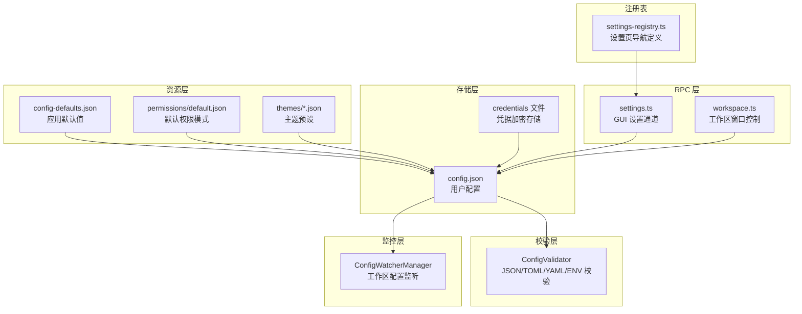
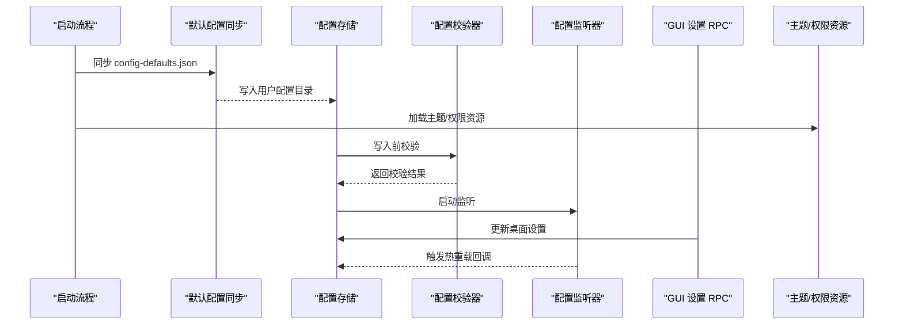
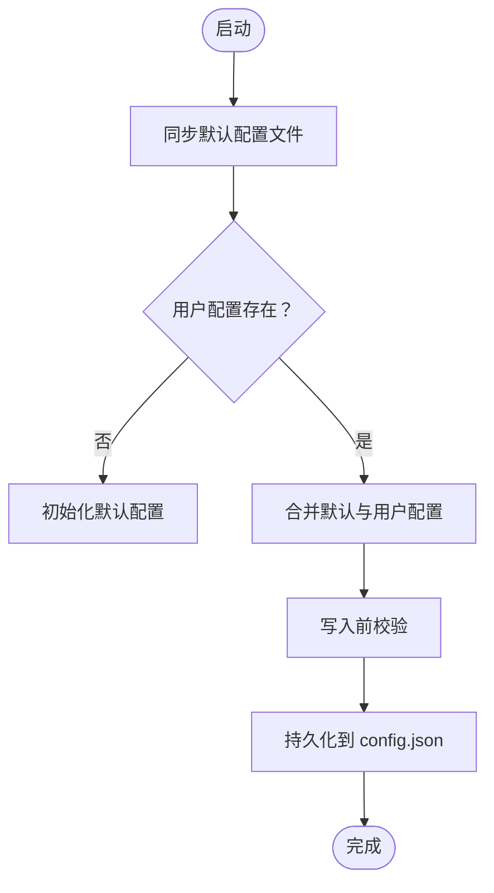
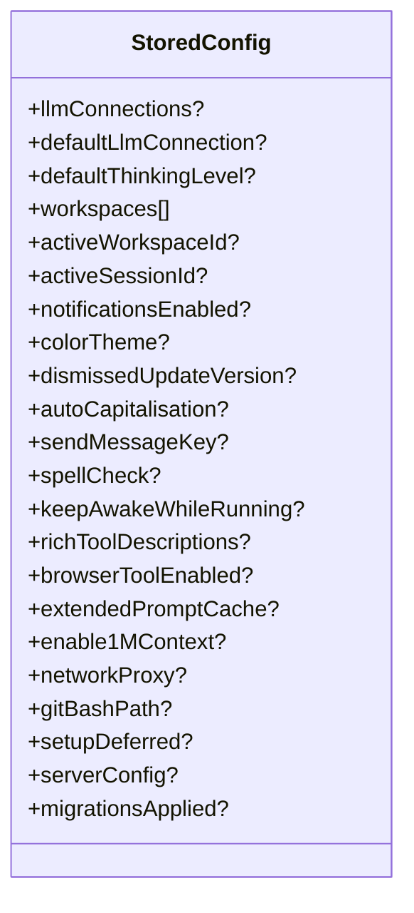
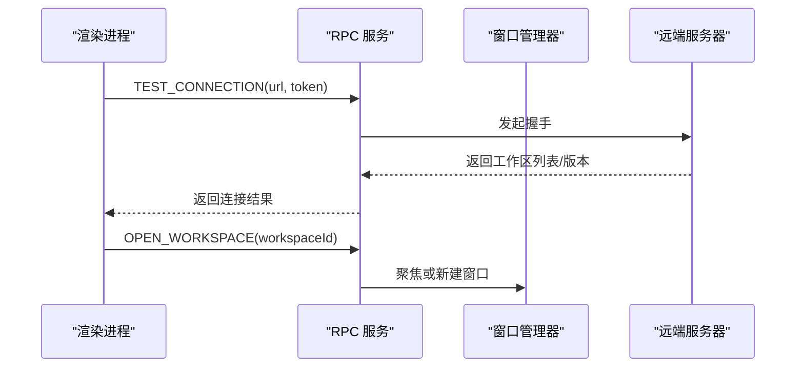
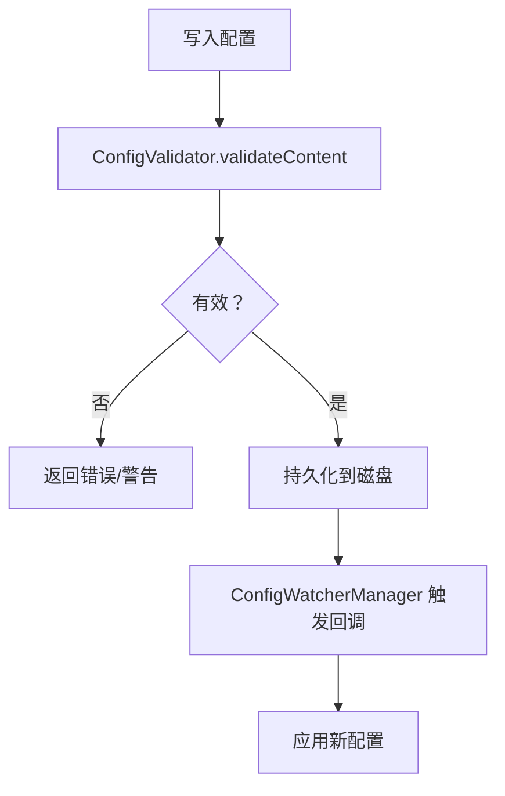
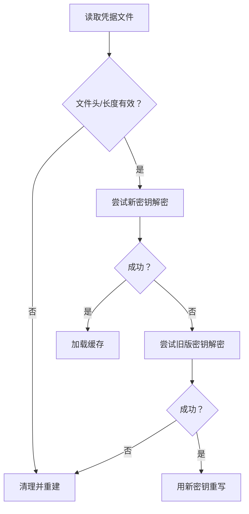
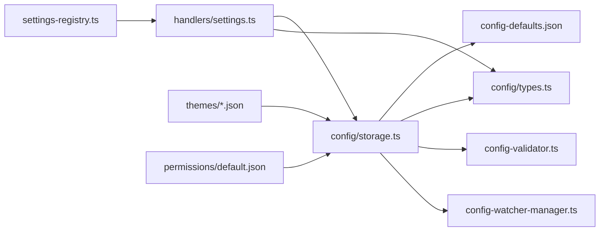

# 配置和设置

<cite>
**本文引用的文件**
- [apps/electron/resources/config-defaults.json](file://apps/electron/resources/config-defaults.json)
- [apps/electron/resources/permissions/default.json](file://apps/electron/resources/permissions/default.json)
- [apps/electron/resources/themes/default.json](file://apps/electron/resources/themes/default.json)
- [apps/electron/src/shared/settings-registry.ts](file://apps/electron/src/shared/settings-registry.ts)
- [apps/electron/src/main/handlers/settings.ts](file://apps/electron/src/main/handlers/settings.ts)
- [apps/electron/src/main/handlers/workspace.ts](file://apps/electron/src/main/handlers/workspace.ts)
- [packages/shared/src/config/types.ts](file://packages/shared/src/config/types.ts)
- [packages/shared/src/config/storage.ts](file://packages/shared/src/config/storage.ts)
- [packages/shared/src/agent/core/config-validator.ts](file://packages/shared/src/agent/core/config-validator.ts)
- [packages/shared/src/agent/core/config-watcher-manager.ts](file://packages/shared/src/agent/core/config-watcher-manager.ts)
- [packages/shared/src/agent/core/path-processor.ts](file://packages/shared/src/agent/core/path-processor.ts)
- [packages/shared/src/credentials/backends/secure-storage.ts](file://packages/shared/src/credentials/backends/secure-storage.ts)
</cite>

## 目录
1. [简介](#简介)
2. [项目结构](#项目结构)
3. [核心组件](#核心组件)
4. [架构总览](#架构总览)
5. [详细组件分析](#详细组件分析)
6. [依赖关系分析](#依赖关系分析)
7. [性能考量](#性能考量)
8. [故障排查指南](#故障排查指南)
9. [结论](#结论)
10. [附录](#附录)

## 简介
本文件为“配置与设置”系统的综合文档，面向需要深度定制应用行为的高级用户与系统管理员。内容涵盖：
- 应用配置文件结构与默认值来源
- 用户偏好与工作区配置管理
- 权限模型与主题定制
- 配置热重载、验证与迁移机制
- 环境变量与配置文件加密、备份与恢复策略
- 自定义配置项开发指南、配置模板使用与批量配置管理技巧

## 项目结构
配置与设置系统由“资源层（默认值/权限/主题）+ 存储层（本地持久化）+ 校验层（格式/语法）+ 监控层（热重载）+ RPC 层（GUI 设置通道）+ 注册表（设置页面导航）”构成。

**图表来源**
- [apps/electron/resources/config-defaults.json:1-24](file://apps/electron/resources/config-defaults.json#L1-L24)
- [apps/electron/resources/permissions/default.json:1-950](file://apps/electron/resources/permissions/default.json#L1-L950)
- [apps/electron/resources/themes/default.json:1-26](file://apps/electron/resources/themes/default.json#L1-L26)
- [packages/shared/src/config/storage.ts:52-92](file://packages/shared/src/config/storage.ts#L52-L92)
- [packages/shared/src/agent/core/config-validator.ts:69-139](file://packages/shared/src/agent/core/config-validator.ts#L69-L139)
- [packages/shared/src/agent/core/config-watcher-manager.ts:197-266](file://packages/shared/src/agent/core/config-watcher-manager.ts#L197-L266)
- [apps/electron/src/main/handlers/settings.ts:1-31](file://apps/electron/src/main/handlers/settings.ts#L1-L31)
- [apps/electron/src/main/handlers/workspace.ts:1-137](file://apps/electron/src/main/handlers/workspace.ts#L1-L137)
- [apps/electron/src/shared/settings-registry.ts:37-49](file://apps/electron/src/shared/settings-registry.ts#L37-L49)

**章节来源**
- [apps/electron/resources/config-defaults.json:1-24](file://apps/electron/resources/config-defaults.json#L1-L24)
- [apps/electron/resources/permissions/default.json:1-950](file://apps/electron/resources/permissions/default.json#L1-L950)
- [apps/electron/resources/themes/default.json:1-26](file://apps/electron/resources/themes/default.json#L1-L26)
- [packages/shared/src/config/storage.ts:100-200](file://packages/shared/src/config/storage.ts#L100-L200)
- [packages/shared/src/agent/core/config-validator.ts:69-139](file://packages/shared/src/agent/core/config-validator.ts#L69-L139)
- [packages/shared/src/agent/core/config-watcher-manager.ts:197-266](file://packages/shared/src/agent/core/config-watcher-manager.ts#L197-L266)
- [apps/electron/src/main/handlers/settings.ts:1-31](file://apps/electron/src/main/handlers/settings.ts#L1-L31)
- [apps/electron/src/main/handlers/workspace.ts:1-137](file://apps/electron/src/main/handlers/workspace.ts#L1-L137)
- [apps/electron/src/shared/settings-registry.ts:37-49](file://apps/electron/src/shared/settings-registry.ts#L37-L49)

## 核心组件
- 默认配置与工作区默认值：来自资源目录中的默认配置文件，启动时同步到用户配置目录。
- 用户配置存储：以 JSON 形式保存在用户配置目录中，包含应用外观、输入、工具、网络代理、服务器等设置。
- 权限模型：内置默认权限模式与 Bash 模式白名单，支持工作区级权限切换。
- 主题系统：多套主题预设，支持明暗模式与配色映射。
- 配置校验器：对 JSON/TOML/YAML/ENV/MD 进行基础格式与语法检查。
- 配置监听器：监听工作区配置变更，触发热重载与回调。
- GUI 设置 RPC：通过 RPC 通道更新桌面级设置（如保持唤醒、网络代理）。
- 设置页注册表：集中定义设置导航页及其显示标签键。

**章节来源**
- [apps/electron/resources/config-defaults.json:1-24](file://apps/electron/resources/config-defaults.json#L1-L24)
- [packages/shared/src/config/storage.ts:52-92](file://packages/shared/src/config/storage.ts#L52-L92)
- [apps/electron/resources/permissions/default.json:1-950](file://apps/electron/resources/permissions/default.json#L1-L950)
- [apps/electron/resources/themes/default.json:1-26](file://apps/electron/resources/themes/default.json#L1-L26)
- [packages/shared/src/agent/core/config-validator.ts:69-139](file://packages/shared/src/agent/core/config-validator.ts#L69-L139)
- [packages/shared/src/agent/core/config-watcher-manager.ts:197-266](file://packages/shared/src/agent/core/config-watcher-manager.ts#L197-L266)
- [apps/electron/src/main/handlers/settings.ts:1-31](file://apps/electron/src/main/handlers/settings.ts#L1-L31)
- [apps/electron/src/shared/settings-registry.ts:37-49](file://apps/electron/src/shared/settings-registry.ts#L37-L49)

## 架构总览
配置系统围绕“默认值同步 -> 用户配置持久化 -> 校验与迁移 -> 热重载 -> GUI RPC 更新”的闭环运行。

**图表来源**
- [packages/shared/src/config/storage.ts:100-200](file://packages/shared/src/config/storage.ts#L100-L200)
- [apps/electron/resources/config-defaults.json:1-24](file://apps/electron/resources/config-defaults.json#L1-L24)
- [apps/electron/resources/themes/default.json:1-26](file://apps/electron/resources/themes/default.json#L1-L26)
- [apps/electron/resources/permissions/default.json:1-950](file://apps/electron/resources/permissions/default.json#L1-L950)
- [packages/shared/src/agent/core/config-validator.ts:69-139](file://packages/shared/src/agent/core/config-validator.ts#L69-L139)
- [packages/shared/src/agent/core/config-watcher-manager.ts:197-266](file://packages/shared/src/agent/core/config-watcher-manager.ts#L197-L266)
- [apps/electron/src/main/handlers/settings.ts:1-31](file://apps/electron/src/main/handlers/settings.ts#L1-L31)

## 详细组件分析

### 应用配置文件结构与默认设置
- 默认值来源：启动时从资源目录同步默认配置文件至用户配置目录，确保版本一致。
- 用户配置字段：包括通知、主题、自动首字母大写、发送消息快捷键、拼写检查、保持唤醒、工具描述丰富度、浏览器工具开关、提示词缓存策略、网络代理、Git Bash 路径、服务器配置、迁移标记等。
- 工作区默认值：包含思考级别、权限模式、可循环权限模式列表、本地 MCP 服务器启用状态等。

**图表来源**
- [packages/shared/src/config/storage.ts:100-200](file://packages/shared/src/config/storage.ts#L100-L200)
- [apps/electron/resources/config-defaults.json:1-24](file://apps/electron/resources/config-defaults.json#L1-L24)

**章节来源**
- [packages/shared/src/config/storage.ts:52-92](file://packages/shared/src/config/storage.ts#L52-L92)
- [packages/shared/src/config/storage.ts:100-200](file://packages/shared/src/config/storage.ts#L100-L200)
- [apps/electron/resources/config-defaults.json:1-24](file://apps/electron/resources/config-defaults.json#L1-L24)

### 用户偏好管理
- 偏好项覆盖：用户配置优先于默认值；未设置项采用默认值。
- 外观与输入：颜色主题、自动首字母大写、发送快捷键、拼写检查、工具描述丰富度、浏览器工具开关。
- 功耗与工具：保持唤醒、提示词缓存策略、扩展上下文能力开关。
- 网络代理：HTTP/HTTPS/NO_PROXY 支持，通过 RPC 更新。

**图表来源**
- [packages/shared/src/config/storage.ts:52-92](file://packages/shared/src/config/storage.ts#L52-L92)

**章节来源**
- [packages/shared/src/config/storage.ts:52-92](file://packages/shared/src/config/storage.ts#L52-L92)
- [packages/shared/src/config/types.ts:16-23](file://packages/shared/src/config/types.ts#L16-L23)
- [apps/electron/src/main/handlers/settings.ts:1-31](file://apps/electron/src/main/handlers/settings.ts#L1-L31)

### 工作区管理功能
- 工作区创建与连接：支持测试远端连接、发现工作区、打开工作区窗口、深链跳转会话。
- 权限设置：工作区级权限模式与可循环模式列表，结合默认权限白名单生效。
- 主题定制：工作区可独立配置主题文件，与全局主题预设协同。

**图表来源**
- [apps/electron/src/main/handlers/workspace.ts:61-94](file://apps/electron/src/main/handlers/workspace.ts#L61-L94)
- [apps/electron/src/main/handlers/workspace.ts:96-100](file://apps/electron/src/main/handlers/workspace.ts#L96-L100)

**章节来源**
- [apps/electron/src/main/handlers/workspace.ts:1-137](file://apps/electron/src/main/handlers/workspace.ts#L1-L137)
- [apps/electron/resources/permissions/default.json:1-950](file://apps/electron/resources/permissions/default.json#L1-L950)
- [apps/electron/resources/themes/default.json:1-26](file://apps/electron/resources/themes/default.json#L1-L26)

### 配置热重载、配置验证与配置迁移
- 热重载：监听工作区配置文件变化，触发回调以刷新运行时行为。
- 验证：对 JSON/TOML/YAML/ENV/MD 执行基础格式与语法检查，提供警告信息。
- 迁移：单次迁移标记，避免重复执行；凭据加密采用硬件稳定密钥与兼容旧版迁移路径。

**图表来源**
- [packages/shared/src/agent/core/config-validator.ts:125-139](file://packages/shared/src/agent/core/config-validator.ts#L125-L139)
- [packages/shared/src/agent/core/config-watcher-manager.ts:197-266](file://packages/shared/src/agent/core/config-watcher-manager.ts#L197-L266)
- [packages/shared/src/credentials/backends/secure-storage.ts:224-247](file://packages/shared/src/credentials/backends/secure-storage.ts#L224-L247)

**章节来源**
- [packages/shared/src/agent/core/config-validator.ts:69-139](file://packages/shared/src/agent/core/config-validator.ts#L69-L139)
- [packages/shared/src/agent/core/config-watcher-manager.ts:197-266](file://packages/shared/src/agent/core/config-watcher-manager.ts#L197-L266)
- [packages/shared/src/credentials/backends/secure-storage.ts:224-247](file://packages/shared/src/credentials/backends/secure-storage.ts#L224-L247)

### 环境变量配置、配置文件加密与备份恢复
- 环境变量：路径处理器识别以点开头的环境文件名，便于在工作区中作为配置源。
- 配置文件加密：凭据文件采用 AES-256-GCM 加密，带魔术头、盐、随机 IV 与认证标签；支持旧版密钥迁移。
- 备份与恢复：凭据文件写入时设置严格权限；建议定期复制用户配置目录进行备份。

**图表来源**
- [packages/shared/src/credentials/backends/secure-storage.ts:196-248](file://packages/shared/src/credentials/backends/secure-storage.ts#L196-L248)
- [packages/shared/src/agent/core/path-processor.ts:174-184](file://packages/shared/src/agent/core/path-processor.ts#L174-L184)

**章节来源**
- [packages/shared/src/agent/core/path-processor.ts:174-184](file://packages/shared/src/agent/core/path-processor.ts#L174-L184)
- [packages/shared/src/credentials/backends/secure-storage.ts:196-248](file://packages/shared/src/credentials/backends/secure-storage.ts#L196-L248)

### 自定义配置项开发指南、配置模板与批量管理
- 自定义配置项：在默认配置文件中添加键值，启动时同步到用户配置；在存储类型中声明对应字段，确保序列化/反序列化正确。
- 配置模板：工作区可放置权限、主题、标签、状态等模板文件，监听器按需应用。
- 批量管理：通过 RPC 批量更新网络代理、批量切换权限模式；在设置注册表中新增页面后，自动派生路由与校验逻辑。

**章节来源**
- [apps/electron/resources/config-defaults.json:1-24](file://apps/electron/resources/config-defaults.json#L1-L24)
- [packages/shared/src/config/storage.ts:52-92](file://packages/shared/src/config/storage.ts#L52-L92)
- [apps/electron/src/shared/settings-registry.ts:37-49](file://apps/electron/src/shared/settings-registry.ts#L37-L49)
- [apps/electron/src/main/handlers/settings.ts:1-31](file://apps/electron/src/main/handlers/settings.ts#L1-L31)

## 依赖关系分析
- 配置存储依赖默认配置同步与资源目录（主题/权限）。
- 校验器与监听器分别在写入前与变更后介入，保证数据质量与实时性。
- GUI 设置 RPC 依赖存储层与平台能力（电源/网络代理）。
- 设置注册表为渲染层提供统一导航定义。

**图表来源**
- [packages/shared/src/config/storage.ts:1-200](file://packages/shared/src/config/storage.ts#L1-L200)
- [apps/electron/resources/config-defaults.json:1-24](file://apps/electron/resources/config-defaults.json#L1-L24)
- [packages/shared/src/config/types.ts:16-23](file://packages/shared/src/config/types.ts#L16-L23)
- [packages/shared/src/agent/core/config-validator.ts:69-139](file://packages/shared/src/agent/core/config-validator.ts#L69-L139)
- [packages/shared/src/agent/core/config-watcher-manager.ts:197-266](file://packages/shared/src/agent/core/config-watcher-manager.ts#L197-L266)
- [apps/electron/src/main/handlers/settings.ts:1-31](file://apps/electron/src/main/handlers/settings.ts#L1-L31)
- [apps/electron/src/shared/settings-registry.ts:37-49](file://apps/electron/src/shared/settings-registry.ts#L37-L49)
- [apps/electron/resources/themes/default.json:1-26](file://apps/electron/resources/themes/default.json#L1-L26)
- [apps/electron/resources/permissions/default.json:1-950](file://apps/electron/resources/permissions/default.json#L1-L950)

**章节来源**
- [packages/shared/src/config/storage.ts:1-200](file://packages/shared/src/config/storage.ts#L1-L200)
- [apps/electron/src/main/handlers/settings.ts:1-31](file://apps/electron/src/main/handlers/settings.ts#L1-L31)
- [apps/electron/src/shared/settings-registry.ts:37-49](file://apps/electron/src/shared/settings-registry.ts#L37-L49)

## 性能考量
- 配置写入前校验仅做基础格式检查，避免引入重型解析器导致延迟。
- 凭据文件每次写入生成新 IV，确保 GCM 安全性的同时增加少量开销。
- 监听器按需触发回调，避免频繁重载；建议在批量更新时合并多次变更。
- 默认配置同步在启动阶段一次性完成，减少后续 IO 压力。

## 故障排查指南
- 配置写入失败：检查校验器返回的警告/错误；确认文件类型与格式是否符合要求。
- 配置未生效：确认是否被用户配置覆盖；检查监听器是否正常运行。
- 凭据读取异常：若文件损坏，系统会清理并重建；请检查文件权限与完整性。
- 网络代理不生效：确认 RPC 调用已成功；检查代理地址格式与系统网络策略。

**章节来源**
- [packages/shared/src/agent/core/config-validator.ts:273-281](file://packages/shared/src/agent/core/config-validator.ts#L273-L281)
- [packages/shared/src/agent/core/config-watcher-manager.ts:209-222](file://packages/shared/src/agent/core/config-watcher-manager.ts#L209-L222)
- [packages/shared/src/credentials/backends/secure-storage.ts:204-208](file://packages/shared/src/credentials/backends/secure-storage.ts#L204-L208)
- [apps/electron/src/main/handlers/settings.ts:26-29](file://apps/electron/src/main/handlers/settings.ts#L26-L29)

## 结论
该配置与设置系统通过“默认值同步 + 存储持久化 + 校验与迁移 + 热重载 + GUI RPC + 导航注册表”的完整链路，实现了对应用行为的灵活定制与安全可控的运维管理。高级用户与系统管理员可通过工作区模板、权限白名单与主题预设实现规模化部署，并借助热重载与迁移机制平滑升级。

## 附录
- 设置页导航：通过设置注册表集中定义，新增页面只需在注册表中添加条目即可自动派生路由与校验。
- 权限白名单：默认权限模式包含大量只读命令与工具调用，支持工作区级权限模式循环切换。
- 主题预设：提供多套主题，支持明暗模式映射与配色体系，便于统一视觉风格。

**章节来源**
- [apps/electron/src/shared/settings-registry.ts:37-49](file://apps/electron/src/shared/settings-registry.ts#L37-L49)
- [apps/electron/resources/permissions/default.json:1-950](file://apps/electron/resources/permissions/default.json#L1-L950)
- [apps/electron/resources/themes/default.json:1-26](file://apps/electron/resources/themes/default.json#L1-L26)