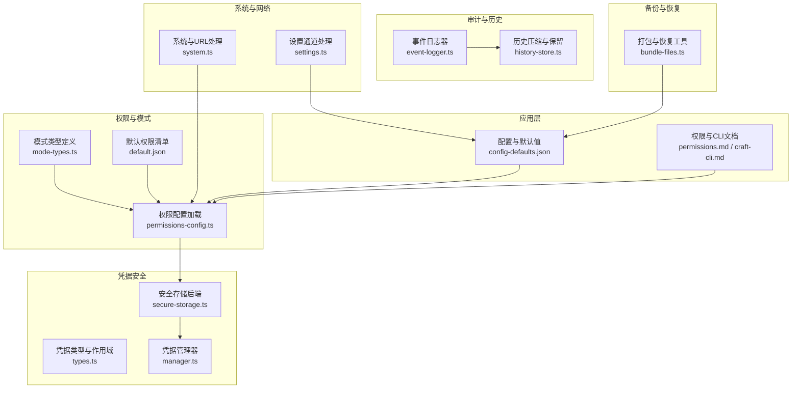
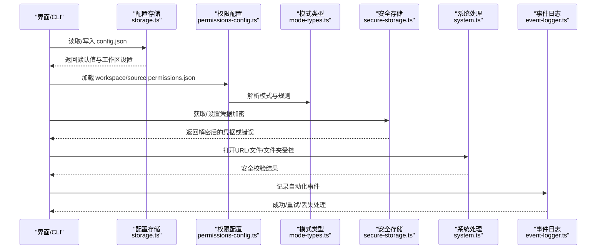
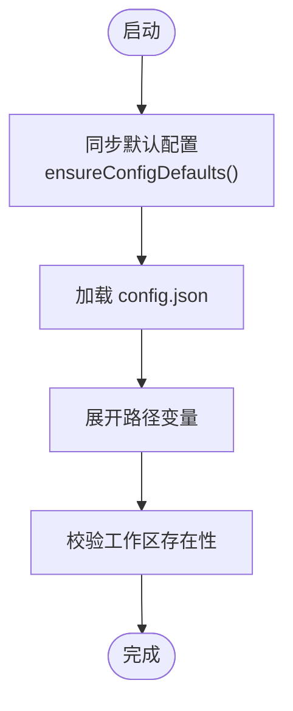
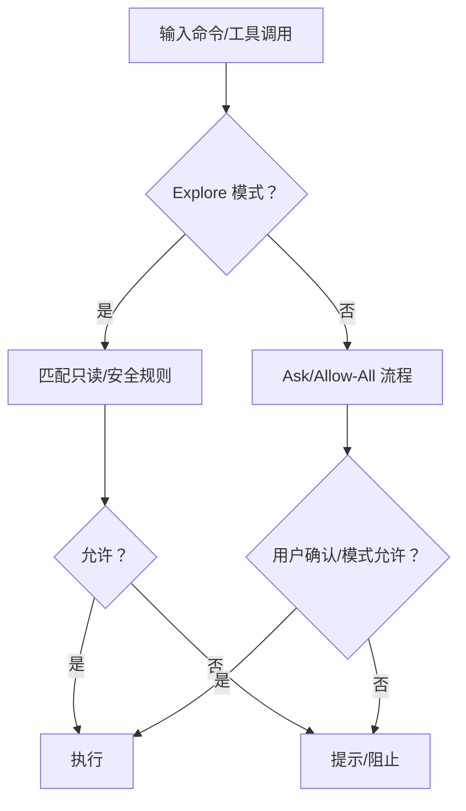
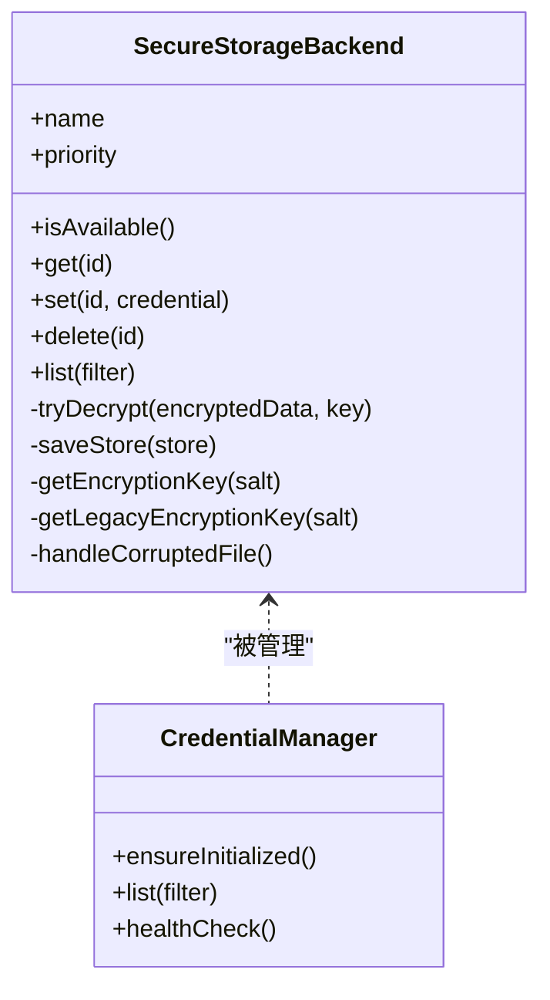
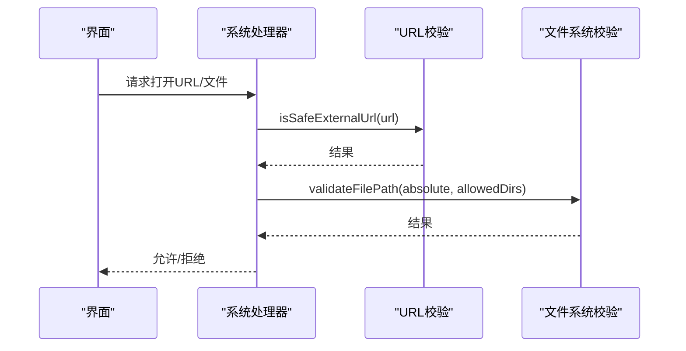
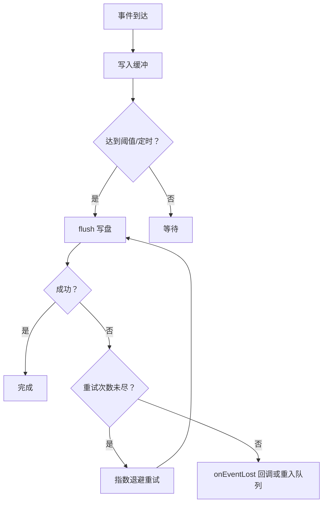
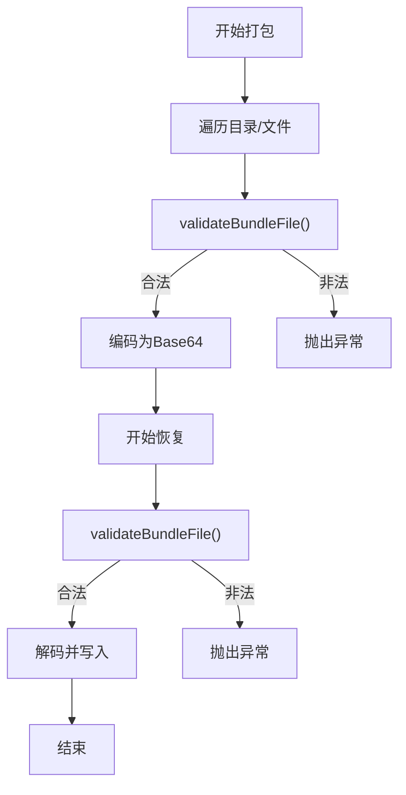
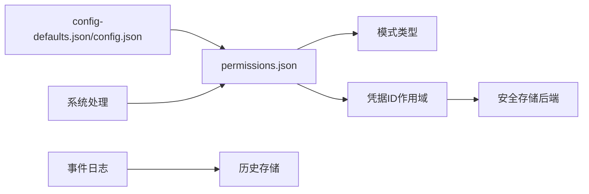

# 配置安全与权限

<cite>
**本文引用的文件**
- [SECURITY.md](file://SECURITY.md)
- [config-defaults.json](file://apps/electron/resources/config-defaults.json)
- [permissions.md](file://apps/electron/resources/docs/permissions.md)
- [default.json](file://apps/electron/resources/permissions/default.json)
- [craft-cli.md](file://apps/electron/resources/docs/craft-cli.md)
- [secure-storage.ts](file://packages/shared/src/credentials/backends/secure-storage.ts)
- [types.ts](file://packages/shared/src/credentials/types.ts)
- [manager.ts](file://packages/shared/src/credentials/manager.ts)
- [settings.ts](file://apps/electron/src/main/handlers/settings.ts)
- [system.ts](file://apps/electron/src/main/handlers/system.ts)
- [storage.ts](file://packages/shared/src/config/storage.ts)
- [mode-types.ts](file://packages/shared/src/agent/mode-types.ts)
- [permissions-config.ts](file://packages/shared/src/agent/permissions-config.ts)
- [powershell-validator.ts](file://packages/shared/src/agent/powershell-validator.ts)
- [event-logger.ts](file://packages/shared/src/automations/event-logger.ts)
- [history-store.ts](file://packages/shared/src/automations/history-store.ts)
- [bundle-files.ts](file://packages/shared/src/utils/bundle-files.ts)
</cite>

## 目录
1. [简介](#简介)
2. [项目结构](#项目结构)
3. [核心组件](#核心组件)
4. [架构总览](#架构总览)
5. [详细组件分析](#详细组件分析)
6. [依赖关系分析](#依赖关系分析)
7. [性能考量](#性能考量)
8. [故障排查指南](#故障排查指南)
9. [结论](#结论)
10. [附录](#附录)

## 简介
本文件面向企业用户与安全管理员，系统化阐述本项目的配置安全与权限管理体系，覆盖以下主题：
- 配置文件的安全存储与访问控制
- 权限验证与模式控制（Explore/Ask/Allow-All）
- 凭据加密存储与健康检查
- 安全传输与外部链接校验
- 权限分级、角色控制与审计日志
- 配置备份加密、恢复验证与完整性检查
- 安全配置最佳实践、漏洞防护与合规要求
- 配置变更审批流程、权限申请管理与安全事件响应

## 项目结构
围绕“配置安全与权限”的关键目录与文件如下：
- 应用层配置与默认值：apps/electron/resources/config-defaults.json、apps/electron/resources/docs/craft-cli.md
- 权限策略与模式：apps/electron/resources/docs/permissions.md、apps/electron/resources/permissions/default.json、packages/shared/src/agent/mode-types.ts、packages/shared/src/agent/permissions-config.ts
- 凭据安全：packages/shared/src/credentials/backends/secure-storage.ts、packages/shared/src/credentials/types.ts、packages/shared/src/credentials/manager.ts
- 外部交互与安全边界：apps/electron/src/main/handlers/system.ts、apps/electron/src/main/handlers/settings.ts
- 自动化审计与历史：packages/shared/src/automations/event-logger.ts、packages/shared/src/automations/history-store.ts
- 备份与恢复：packages/shared/src/utils/bundle-files.ts

图表来源
- [config-defaults.json:1-24](file://apps/electron/resources/config-defaults.json#L1-L24)
- [permissions.md:1-339](file://apps/electron/resources/docs/permissions.md#L1-L339)
- [default.json:1-950](file://apps/electron/resources/permissions/default.json#L1-L950)
- [mode-types.ts:126-157](file://packages/shared/src/agent/mode-types.ts#L126-L157)
- [permissions-config.ts:43-610](file://packages/shared/src/agent/permissions-config.ts#L43-L610)
- [secure-storage.ts:1-358](file://packages/shared/src/credentials/backends/secure-storage.ts#L1-L358)
- [types.ts:104-220](file://packages/shared/src/credentials/types.ts#L104-L220)
- [manager.ts:583-620](file://packages/shared/src/credentials/manager.ts#L583-L620)
- [system.ts:1-441](file://apps/electron/src/main/handlers/system.ts#L1-L441)
- [settings.ts:1-31](file://apps/electron/src/main/handlers/settings.ts#L1-L31)
- [event-logger.ts:125-172](file://packages/shared/src/automations/event-logger.ts#L125-L172)
- [history-store.ts:141-186](file://packages/shared/src/automations/history-store.ts#L141-L186)
- [bundle-files.ts:153-202](file://packages/shared/src/utils/bundle-files.ts#L153-L202)

章节来源
- [config-defaults.json:1-24](file://apps/electron/resources/config-defaults.json#L1-L24)
- [permissions.md:1-339](file://apps/electron/resources/docs/permissions.md#L1-L339)
- [default.json:1-950](file://apps/electron/resources/permissions/default.json#L1-L950)
- [mode-types.ts:126-157](file://packages/shared/src/agent/mode-types.ts#L126-L157)
- [permissions-config.ts:43-610](file://packages/shared/src/agent/permissions-config.ts#L43-L610)
- [secure-storage.ts:1-358](file://packages/shared/src/credentials/backends/secure-storage.ts#L1-L358)
- [types.ts:104-220](file://packages/shared/src/credentials/types.ts#L104-L220)
- [manager.ts:583-620](file://packages/shared/src/credentials/manager.ts#L583-L620)
- [system.ts:1-441](file://apps/electron/src/main/handlers/system.ts#L1-L441)
- [settings.ts:1-31](file://apps/electron/src/main/handlers/settings.ts#L1-L31)
- [event-logger.ts:125-172](file://packages/shared/src/automations/event-logger.ts#L125-L172)
- [history-store.ts:141-186](file://packages/shared/src/automations/history-store.ts#L141-L186)
- [bundle-files.ts:153-202](file://packages/shared/src/utils/bundle-files.ts#L153-L202)

## 核心组件
- 配置与默认值：集中于 ~/.craft-agent/config-defaults.json 与 config.json，确保默认行为与工作区默认模式可追溯、可迁移。
- 权限与模式：通过 permissions.json 与模式类型（safe/ask/allow-all）实现最小权限与可审计的执行路径。
- 凭据安全：使用硬件稳定标识派生密钥的 AES-256-GCM 加密，文件级完整性校验与自动迁移。
- 外部交互：统一的 URL 安全校验与受限的系统调用通道，避免任意命令注入。
- 审计与历史：自动化事件日志持久化与历史压缩，支持失败重试与保留策略。
- 备份与恢复：打包/解包时进行路径合法性校验，防止路径逃逸。

章节来源
- [storage.ts:102-204](file://packages/shared/src/config/storage.ts#L102-L204)
- [permissions.md:1-339](file://apps/electron/resources/docs/permissions.md#L1-L339)
- [mode-types.ts:126-157](file://packages/shared/src/agent/mode-types.ts#L126-L157)
- [secure-storage.ts:1-358](file://packages/shared/src/credentials/backends/secure-storage.ts#L1-L358)
- [system.ts:200-265](file://apps/electron/src/main/handlers/system.ts#L200-L265)
- [event-logger.ts:125-172](file://packages/shared/src/automations/event-logger.ts#L125-L172)
- [bundle-files.ts:153-202](file://packages/shared/src/utils/bundle-files.ts#L153-L202)

## 架构总览
下图展示从配置加载到权限决策、凭据保护与审计记录的关键链路。

图表来源
- [storage.ts:226-286](file://packages/shared/src/config/storage.ts#L226-L286)
- [permissions-config.ts:451-485](file://packages/shared/src/agent/permissions-config.ts#L451-L485)
- [mode-types.ts:126-157](file://packages/shared/src/agent/mode-types.ts#L126-L157)
- [secure-storage.ts:124-152](file://packages/shared/src/credentials/backends/secure-storage.ts#L124-L152)
- [system.ts:200-265](file://apps/electron/src/main/handlers/system.ts#L200-L265)
- [event-logger.ts:125-172](file://packages/shared/src/automations/event-logger.ts#L125-L172)

## 详细组件分析

### 配置安全与访问控制
- 默认值同步：启动时将资源中的 config-defaults.json 同步至 ~/.craft-agent/config-defaults.json，保证版本一致性与最小权限默认值。
- 工作区默认模式：workspaceDefaults 中的 permissionMode 与 cyclablePermissionModes 控制模式切换顺序与默认值。
- 设置通道：仅允许有限的 GUI 设置通过 RPC 写入（如保持唤醒、网络代理），避免任意系统级修改。
- 路径与跨机兼容：保存前将绝对路径转换为可移植形式（~ 前缀），便于迁移；加载时展开路径并校验工作区存在性。

图表来源
- [storage.ts:132-204](file://packages/shared/src/config/storage.ts#L132-L204)
- [storage.ts:226-267](file://packages/shared/src/config/storage.ts#L226-L267)

章节来源
- [storage.ts:102-204](file://packages/shared/src/config/storage.ts#L102-L204)
- [storage.ts:226-286](file://packages/shared/src/config/storage.ts#L226-L286)
- [settings.ts:14-30](file://apps/electron/src/main/handlers/settings.ts#L14-L30)

### 权限验证与模式控制
- 模式类型：定义 Explore/Ask/Allow-All 三种模式，Explore 默认阻断写操作与高风险工具，Ask 需要确认，Allow-All 放宽限制但需谨慎。
- 规则来源：workspace 与 source 的 permissions.json 叠加，source 层自动按源作用域约束 MCP 模式，避免跨源越权。
- Bash/PowerShell 安全：仅允许只读命令与安全构造，禁止后台运行、重定向、命令替换等危险特性；PowerShell 使用 AST 分析与危险 Cmdlet 黑名单。
- 默认白名单：内置大量只读命令与工具，减少误判；可通过 allowed* 规则精确放行。

图表来源
- [permissions.md:188-339](file://apps/electron/resources/docs/permissions.md#L188-L339)
- [mode-types.ts:126-157](file://packages/shared/src/agent/mode-types.ts#L126-L157)
- [powershell-validator.ts:382-650](file://packages/shared/src/agent/powershell-validator.ts#L382-L650)

章节来源
- [permissions.md:1-339](file://apps/electron/resources/docs/permissions.md#L1-L339)
- [mode-types.ts:126-157](file://packages/shared/src/agent/mode-types.ts#L126-L157)
- [permissions-config.ts:43-610](file://packages/shared/src/agent/permissions-config.ts#L43-L610)
- [powershell-validator.ts:382-650](file://packages/shared/src/agent/powershell-validator.ts#L382-L650)

### 凭据加密存储与健康检查
- 加密方案：AES-256-GCM，带认证标签；密钥由 OS 稳定硬件标识（macOS IOPlatformUUID、Windows MachineGuid、Linux machine-id）经 PBKDF2 派生，盐值随文件存储。
- 文件格式：头部含魔数、标志、盐值；随后为随机 IV、认证标签与密文。
- 迁移与容错：支持旧版基于主机名的密钥派生迁移；文件损坏自动删除并提示重新认证；健康检查区分“文件损坏”与“解密失败”两类问题。
- 作用域与分隔：凭据 ID 使用 :: 分隔符，支持全局、工作区、源、消息平台等多级作用域。

图表来源
- [secure-storage.ts:111-358](file://packages/shared/src/credentials/backends/secure-storage.ts#L111-L358)
- [manager.ts:583-620](file://packages/shared/src/credentials/manager.ts#L583-L620)
- [types.ts:104-220](file://packages/shared/src/credentials/types.ts#L104-L220)

章节来源
- [secure-storage.ts:1-358](file://packages/shared/src/credentials/backends/secure-storage.ts#L1-L358)
- [types.ts:104-220](file://packages/shared/src/credentials/types.ts#L104-L220)
- [manager.ts:583-620](file://packages/shared/src/credentials/manager.ts#L583-L620)

### 安全传输与外部交互
- URL 安全校验：仅允许安全协议（http/https 等）打开外部链接，拒绝可疑协议与未知方案。
- 文件/文件夹打开：对路径进行解析与工作区允许目录校验，防止越权访问。
- 代理设置：通过 RPC 更新网络代理，结合系统层代理能力生效。

图表来源
- [system.ts:200-265](file://apps/electron/src/main/handlers/system.ts#L200-L265)

章节来源
- [system.ts:1-441](file://apps/electron/src/main/handlers/system.ts#L1-L441)

### 审计日志与历史管理
- 事件日志：自动化事件写入 JSONL，具备重试与丢失回调；失败事件可回压至缓冲队首，保障顺序与可靠性。
- 历史压缩：按自动化 ID 与总量上限进行两层保留策略，丢弃非法行，维持紧凑历史。
- 关闭与清理：应用退出时 flush 并 dispose，清空缓冲，避免数据丢失。

图表来源
- [event-logger.ts:125-172](file://packages/shared/src/automations/event-logger.ts#L125-L172)
- [history-store.ts:141-186](file://packages/shared/src/automations/history-store.ts#L141-L186)

章节来源
- [event-logger.ts:125-172](file://packages/shared/src/automations/event-logger.ts#L125-L172)
- [history-store.ts:141-186](file://packages/shared/src/automations/history-store.ts#L141-L186)

### 配置备份加密、恢复验证与完整性检查
- 打包：遍历目标目录，进行路径合法性校验与内容编码，生成可移植的 BundleFile 列表。
- 恢复：逐条校验文件合法性，确保解码后写入目标目录且不逃逸；父目录不存在则递归创建。
- 完整性：通过路径校验与 Base64 解码校验，避免恶意内容写入。

图表来源
- [bundle-files.ts:153-202](file://packages/shared/src/utils/bundle-files.ts#L153-L202)

章节来源
- [bundle-files.ts:153-202](file://packages/shared/src/utils/bundle-files.ts#L153-L202)

## 依赖关系分析
- 配置层依赖：config-defaults.json 与 config.json 提供默认值与用户设置；工作区默认模式影响权限决策。
- 权限层依赖：permissions.json 与模式类型共同决定工具/命令允许与否；source 层自动作用域化 MCP 模式。
- 凭据层依赖：凭据 ID 作用域与安全存储后端耦合，健康检查与迁移逻辑保证可用性。
- 审计层依赖：事件日志器与历史存储相互配合，保障事件可追踪与容量可控。

图表来源
- [storage.ts:102-204](file://packages/shared/src/config/storage.ts#L102-L204)
- [permissions-config.ts:43-610](file://packages/shared/src/agent/permissions-config.ts#L43-L610)
- [secure-storage.ts:1-358](file://packages/shared/src/credentials/backends/secure-storage.ts#L1-L358)
- [event-logger.ts:125-172](file://packages/shared/src/automations/event-logger.ts#L125-L172)
- [history-store.ts:141-186](file://packages/shared/src/automations/history-store.ts#L141-L186)

章节来源
- [storage.ts:102-204](file://packages/shared/src/config/storage.ts#L102-L204)
- [permissions-config.ts:43-610](file://packages/shared/src/agent/permissions-config.ts#L43-L610)
- [secure-storage.ts:1-358](file://packages/shared/src/credentials/backends/secure-storage.ts#L1-L358)
- [event-logger.ts:125-172](file://packages/shared/src/automations/event-logger.ts#L125-L172)
- [history-store.ts:141-186](file://packages/shared/src/automations/history-store.ts#L141-L186)

## 性能考量
- 权限匹配：正则与 AST 分析在 Explore 模式中频繁触发，建议：
  - 尽量使用锚点与具体模式，减少过宽匹配。
  - 对常用模式进行缓存与预编译。
- 凭据存储：每次读写涉及随机 IV 与 AEAD 计算，建议：
  - 批量更新时合并写入，降低磁盘 IO。
  - 使用内存缓存短期高频读取。
- 审计日志：JSONL 写入与重试会带来延迟，建议：
  - 合理设置 flush 阈值与定时器。
  - 在高吞吐场景启用异步写入与批量提交。

## 故障排查指南
- 凭据无法读取：
  - 若提示“解密失败”，通常表示机器迁移导致密钥不匹配，需重新认证。
  - 若提示“文件损坏”，将删除损坏文件并提示重新认证。
- 权限规则不生效：
  - 检查 workspace/source 的 permissions.json 是否存在语法错误。
  - 确认 source 层 MCP 模式是否已自动作用域化。
- 外链/文件无法打开：
  - 检查 URL 协议是否在安全白名单内。
  - 检查目标路径是否在工作区允许目录范围内。
- 审计事件丢失：
  - 查看事件日志器的重试次数与最后一次错误原因。
  - 检查历史存储是否因非法行被丢弃。

章节来源
- [manager.ts:583-620](file://packages/shared/src/credentials/manager.ts#L583-L620)
- [permissions.md:1-339](file://apps/electron/resources/docs/permissions.md#L1-L339)
- [system.ts:200-265](file://apps/electron/src/main/handlers/system.ts#L200-L265)
- [event-logger.ts:125-172](file://packages/shared/src/automations/event-logger.ts#L125-L172)

## 结论
本项目通过“默认最小权限 + 明确规则 + 加密凭据 + 审计日志 + 安全校验”的组合，构建了面向企业级使用的配置安全与权限体系。建议在生产环境中：
- 强制使用 Explore 模式，仅在必要时切换至 Ask/Allow-All，并进行变更审批。
- 严格管理 permissions.json 与凭据作用域，定期审查与审计。
- 启用自动化事件日志与历史压缩，确保可追溯与容量可控。
- 对外部链接与文件访问实施严格的白名单与路径校验。

## 附录
- 安全政策与漏洞上报：参见 SECURITY.md，明确披露渠道、响应时间线与支持范围。
- CLI 管理：推荐使用 craft-agent 命令行工具管理标签、源、技能与权限，避免直接编辑 JSON 导致的误配。

章节来源
- [SECURITY.md:1-59](file://SECURITY.md#L1-L59)
- [craft-cli.md:1-200](file://apps/electron/resources/docs/craft-cli.md#L1-L200)