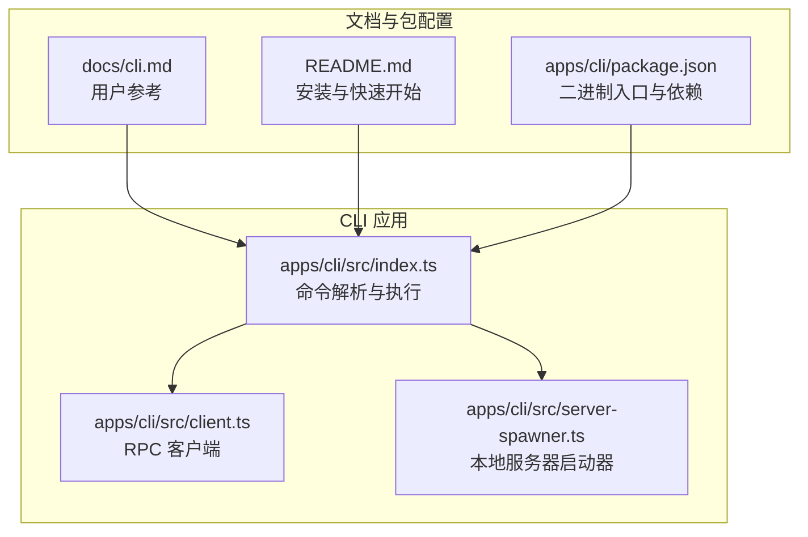
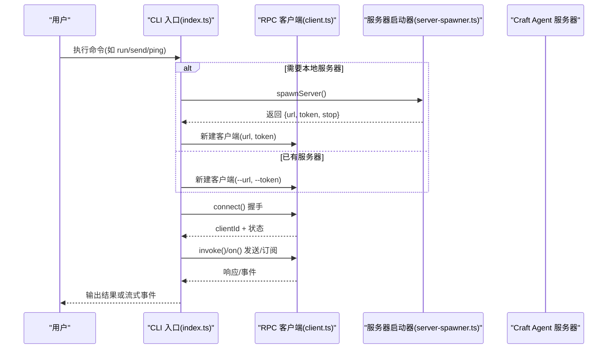
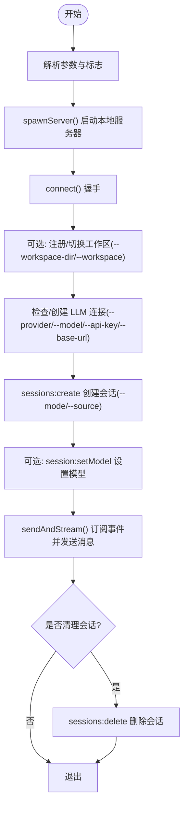
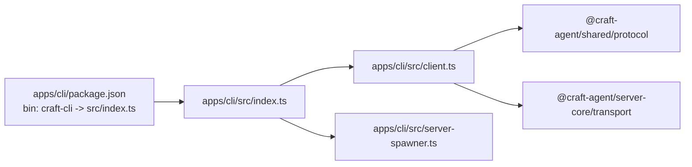

# 命令行客户端

<cite>
**本文引用的文件**
- [apps/cli/src/index.ts](file://apps/cli/src/index.ts)
- [apps/cli/src/client.ts](file://apps/cli/src/client.ts)
- [apps/cli/src/server-spawner.ts](file://apps/cli/src/server-spawner.ts)
- [apps/cli/src/run.test.ts](file://apps/cli/src/run.test.ts)
- [apps/cli/src/commands.test.ts](file://apps/cli/src/commands.test.ts)
- [apps/cli/src/client.test.ts](file://apps/cli/src/client.test.ts)
- [apps/cli/package.json](file://apps/cli/package.json)
- [docs/cli.md](file://docs/cli.md)
- [README.md](file://README.md)
</cite>

## 目录
1. [简介](#简介)
2. [项目结构](#项目结构)
3. [核心组件](#核心组件)
4. [架构总览](#架构总览)
5. [详细组件分析](#详细组件分析)
6. [依赖关系分析](#依赖关系分析)
7. [性能考量](#性能考量)
8. [故障排查指南](#故障排查指南)
9. [结论](#结论)
10. [附录](#附录)

## 简介
Craft Agents CLI 是一个终端客户端，通过 WebSocket（ws:// 或 wss://）连接到运行中的 Craft Agent 服务器，提供资源列举、会话管理、消息发送与实时流式输出等功能，并支持“自包含”的 run 命令：自动启动服务器、创建会话、发送提示词、流式输出响应并退出。CLI 支持多种连接配置（URL、令牌、工作区、超时、TLS 证书）、输出格式（文本/JSON/流式 JSON），并提供脚本化与 CI/CD 集成能力。

## 项目结构
- CLI 应用位于 apps/cli，入口为 src/index.ts，导出可执行命令与参数解析逻辑。
- 核心 RPC 客户端在 src/client.ts，封装 WebSocket 握手、请求/响应、事件订阅与销毁。
- 本地服务器启动器在 src/server-spawner.ts，负责以子进程方式启动 headless 服务器并解析其输出的连接信息。
- 文档位于 docs/cli.md，提供安装、连接选项、命令参考与示例。
- 单元测试覆盖参数解析、RPC 行为、run 命令生命周期与验证步骤。

图表来源
- [apps/cli/src/index.ts:1-200](file://apps/cli/src/index.ts#L1-L200)
- [apps/cli/src/client.ts:1-120](file://apps/cli/src/client.ts#L1-L120)
- [apps/cli/src/server-spawner.ts:1-80](file://apps/cli/src/server-spawner.ts#L1-L80)
- [docs/cli.md:1-60](file://docs/cli.md#L1-L60)
- [README.md:248-345](file://README.md#L248-L345)

章节来源
- [apps/cli/src/index.ts:1-200](file://apps/cli/src/index.ts#L1-L200)
- [apps/cli/src/client.ts:1-120](file://apps/cli/src/client.ts#L1-L120)
- [apps/cli/src/server-spawner.ts:1-80](file://apps/cli/src/server-spawner.ts#L1-L80)
- [docs/cli.md:1-60](file://docs/cli.md#L1-L60)
- [README.md:248-345](file://README.md#L248-L345)

## 核心组件
- 参数解析与全局选项
  - 支持 --url/--token/--workspace/--timeout/--json/--tls-ca/--send-timeout 等。
  - 支持 --help/--version/--validate-server 等辅助命令。
  - 支持 run 特有选项：--workspace-dir/--source/--output-format/--mode/--no-cleanup/--server-entry，以及 LLM 配置：--provider/--model/--api-key/--base-url。
  - 环境变量回退：CRAFT_SERVER_URL、CRAFT_SERVER_TOKEN、CRAFT_TLS_CA、LLM_PROVIDER、LLM_MODEL、LLM_API_KEY、LLM_BASE_URL。
- 连接与认证
  - 通过 WebSocket 连接服务器，握手阶段携带协议版本、可选令牌与工作区 ID。
  - 支持 wss:// 与自定义 CA 证书（--tls-ca 或 CRAFT_TLS_CA）。
- 命令集
  - 健康与信息类：ping、health、versions。
  - 资源类：workspaces、sessions、connections、sources。
  - 会话操作：session create/messages/delete/cancel。
  - 消息发送：send（订阅事件流式输出）。
  - 高级：invoke（原始 RPC 调用）、listen（订阅推送事件）。
  - 自包含：run（自动启动服务器、创建会话、发送提示词、流式输出、清理）。
- 输出与交互
  - 默认人类可读输出；--json 输出原始 JSON；run 可选 --output-format stream-json。
  - TTY 下带旋转指示器与彩色输出；可通过 NO_COLOR 或非 TTY 关闭。
  - send 命令支持从 stdin 读取（--stdin 或无 TTY 时自动读取）。

章节来源
- [apps/cli/src/index.ts:43-158](file://apps/cli/src/index.ts#L43-L158)
- [apps/cli/src/index.ts:247-784](file://apps/cli/src/index.ts#L247-L784)
- [apps/cli/src/client.ts:38-190](file://apps/cli/src/client.ts#L38-L190)
- [docs/cli.md:38-170](file://docs/cli.md#L38-L170)

## 架构总览
CLI 通过最小化的 RPC 客户端与服务器交互，支持两种模式：
- 外部服务器模式：直接连接已有服务器（--url/--token），适用于日常使用与脚本。
- 自包含模式：run/--validate-server 自动启动本地 headless 服务器，完成一次性任务后退出。

图表来源
- [apps/cli/src/index.ts:496-510](file://apps/cli/src/index.ts#L496-L510)
- [apps/cli/src/server-spawner.ts:55-122](file://apps/cli/src/server-spawner.ts#L55-L122)
- [apps/cli/src/client.ts:61-129](file://apps/cli/src/client.ts#L61-L129)

章节来源
- [apps/cli/src/index.ts:496-510](file://apps/cli/src/index.ts#L496-L510)
- [apps/cli/src/server-spawner.ts:55-122](file://apps/cli/src/server-spawner.ts#L55-L122)
- [apps/cli/src/client.ts:61-129](file://apps/cli/src/client.ts#L61-L129)

## 详细组件分析

### 参数解析与全局选项
- 解析规则
  - 位置参数首个非选项作为命令；其余作为命令参数与剩余参数。
  - 支持布尔标志（如 --json、--no-cleanup、--disable-spinner）、数值与字符串值（如 --timeout、--send-timeout、--workspace）。
  - run 特有：--source 可重复累积；--output-format 支持 text/stream-json；--mode 支持 allow-all/safe 等。
  - LLM 配置：--provider/--model/--api-key/--base-url，以及 LLM_* 环境变量回退。
- 环境变量优先级
  - 命令行标志 > 环境变量；未指定时按文档默认值生效。
- 作用域
  - 全局选项影响所有命令；run 专属选项仅在 run 中生效。

章节来源
- [apps/cli/src/index.ts:43-158](file://apps/cli/src/index.ts#L43-L158)
- [apps/cli/src/index.ts:148-157](file://apps/cli/src/index.ts#L148-L157)
- [apps/cli/src/commands.test.ts:8-233](file://apps/cli/src/commands.test.ts#L8-L233)

### RPC 客户端（CliRpcClient）
- 功能要点
  - 握手：connect() 完成握手后进入消息通道。
  - 请求/响应：invoke(channel, ...args) 返回 Promise 结果。
  - 事件订阅：on(channel, callback) 订阅推送事件，返回取消函数。
  - 销毁：destroy() 关闭连接并拒绝待处理请求。
  - 超时控制：connectTimeout/requestTimeout 分别控制握手与请求超时。
- 错误处理
  - 连接失败、握手拒绝、请求超时、断开重连前的错误均抛出明确错误。
- TLS 支持
  - 通过 wss:// 与自定义 CA（--tls-ca 或 CRAFT_TLS_CA）支持自签名证书。

章节来源
- [apps/cli/src/client.ts:38-190](file://apps/cli/src/client.ts#L38-L190)
- [apps/cli/src/client.test.ts:171-384](file://apps/cli/src/client.test.ts#L171-L384)

### 本地服务器启动器（server-spawner）
- 自动检测
  - 在 monorepo 根目录下查找 packages/server/src/index.ts 作为默认入口。
- 启动流程
  - 子进程以 bun run 启动服务器，注入 CRAFT_SERVER_TOKEN、CRAFT_RPC_HOST/CRAFT_RPC_PORT。
  - 从 stdout 逐行读取 CRAFT_SERVER_URL/CRAFT_SERVER_TOKEN，确认服务器就绪。
  - 可选静默模式（--validate-server 时用于减少噪声）。
- 清理
  - 提供 stop() 终止子进程并等待退出。

章节来源
- [apps/cli/src/server-spawner.ts:36-49](file://apps/cli/src/server-spawner.ts#L36-L49)
- [apps/cli/src/server-spawner.ts:55-122](file://apps/cli/src/server-spawner.ts#L55-L122)
- [apps/cli/src/server-spawner.ts:128-149](file://apps/cli/src/server-spawner.ts#L128-L149)

### 命令实现概览
- 健康与信息：ping（连接+延迟）、health（凭据健康检查）、versions（系统版本）。
- 资源类：workspaces（列出工作区）、sessions（列出会话）、connections（LLM 连接列表）、sources（列出数据源）。
- 会话操作：session create（可选 --name/--mode）、session messages（查看历史）、session delete（删除会话）、cancel（取消处理）。
- 发送消息：send（订阅事件流式输出，支持 --stdin 或无 TTY 自动读取）。
- 高级：invoke（任意通道调用，支持 JSON 参数）、listen（订阅推送事件）。
- 自包含：run（自动启动服务器、注册工作区（可选 --workspace-dir）、创建会话、设置模型（可选 --model）、发送提示词、流式输出、清理（可选 --no-cleanup））。

章节来源
- [apps/cli/src/index.ts:247-784](file://apps/cli/src/index.ts#L247-L784)
- [apps/cli/src/index.ts:628-714](file://apps/cli/src/index.ts#L628-L714)

### run 命令自包含流程

图表来源
- [apps/cli/src/index.ts:628-714](file://apps/cli/src/index.ts#L628-L714)
- [apps/cli/src/index.ts:402-470](file://apps/cli/src/index.ts#L402-L470)
- [apps/cli/src/run.test.ts:176-364](file://apps/cli/src/run.test.ts#L176-L364)

章节来源
- [apps/cli/src/index.ts:628-714](file://apps/cli/src/index.ts#L628-L714)
- [apps/cli/src/index.ts:402-470](file://apps/cli/src/index.ts#L402-L470)
- [apps/cli/src/run.test.ts:176-364](file://apps/cli/src/run.test.ts#L176-L364)

### send 命令流式输出机制
- 事件类型与输出行为
  - text_delta：内联流式文本。
  - tool_start/tool_result：工具开始/结果（结果截断至 200 字符）。
  - error：写入 stderr，退出码 1。
  - complete：结束，退出码 0。
  - interrupted：中断，退出码 130。
- 输入来源
  - 位置参数拼接为消息主体；--stdin 或无 TTY 时从 stdin 读取。

章节来源
- [apps/cli/src/index.ts:377-396](file://apps/cli/src/index.ts#L377-L396)
- [apps/cli/src/index.ts:402-470](file://apps/cli/src/index.ts#L402-L470)
- [apps/cli/src/index.ts:94-99](file://apps/cli/src/index.ts#L94-L99)

### LLM 连接自动配置
- 触发条件
  - 无连接存在且 provider 非默认（anthropic）或显式提供 --base-url。
- 支持的提供商与密钥回退
  - ANTHROPIC_API_KEY、OPENAI_API_KEY、GOOGLE_API_KEY、OPENROUTER_API_KEY、GROQ_API_KEY、MISTRAL_API_KEY、DEEPSEEK_API_KEY、XAI_API_KEY、CEREBRAS_API_KEY、HUGGINGFACE_API_KEY。
- 自定义端点
  - 当 --base-url 存在时，使用兼容模式（pi_compat），并设置默认模型与 API 类型。
- Amazon Bedrock
  - 使用 IAM 凭证（AWS_ACCESS_KEY_ID/AWS_SECRET_ACCESS_KEY），可选 AWS_REGION/AWS_SESSION_TOKEN。
- 设置默认连接
  - 创建后调用 LLM_Connection:setDefault 将新连接设为默认。

章节来源
- [apps/cli/src/index.ts:557-626](file://apps/cli/src/index.ts#L557-L626)
- [apps/cli/src/index.ts:516-559](file://apps/cli/src/index.ts#L516-L559)

### 验证服务器（--validate-server）
- 自动模式
  - 无 --url 时，与 run 相同流程自动启动服务器。
- 步骤清单（21 步）
  - 连接握手、凭据健康检查、系统版本、系统主目录、工作区列表、会话列表、LLM 连接列表、数据源列表、创建临时会话、读取消息、发送消息并流式输出（文本）、发送消息并工具调用、创建数据源（Cat Facts API）、发送消息并提及数据源、创建技能（通过 Bash 写入 SKILL.md）、读取技能、发送消息并提及技能、删除技能、删除数据源、删除会话、断开连接。
- 输出
  - 成功时返回 0；失败时返回 1 并报告摘要；可使用 --json 获取机器可读输出。

章节来源
- [apps/cli/src/index.ts:997-1189](file://apps/cli/src/index.ts#L997-L1189)
- [apps/cli/src/index.ts:716-751](file://apps/cli/src/index.ts#L716-L751)
- [apps/cli/src/commands.test.ts:273-403](file://apps/cli/src/commands.test.ts#L273-L403)
- [docs/cli.md:158-195](file://docs/cli.md#L158-L195)

## 依赖关系分析
- CLI 包配置
  - 二进制入口为 craft-cli，指向 src/index.ts。
  - 依赖 @craft-agent/shared 与 @craft-agent/server-core。
- 运行时要求
  - 需要 Bun 运行时；wss:// 场景下可使用 --tls-ca 或 CRAFT_TLS_CA 指定自签 CA。
- 与服务器交互
  - 通过 WebSocket RPC 协议；握手包含协议版本、可选令牌与工作区 ID；请求/响应/事件三类消息。

图表来源
- [apps/cli/package.json:8-10](file://apps/cli/package.json#L8-L10)
- [apps/cli/src/index.ts:10-11](file://apps/cli/src/index.ts#L10-L11)
- [apps/cli/src/client.ts:8-15](file://apps/cli/src/client.ts#L8-L15)

章节来源
- [apps/cli/package.json:1-26](file://apps/cli/package.json#L1-L26)
- [apps/cli/src/index.ts:10-11](file://apps/cli/src/index.ts#L10-L11)
- [apps/cli/src/client.ts:8-15](file://apps/cli/src/client.ts#L8-L15)

## 性能考量
- 超时设置
  - --timeout 控制握手与通用请求超时；--send-timeout 控制 send 命令等待完成事件的超时。
- 流式输出
  - send 命令订阅事件并实时输出，避免阻塞；--output-format stream-json 便于机器解析。
- 服务器启动
  - spawnServer() 采用超时与管道读取 stdout，确保及时发现服务器就绪或失败。
- TTY 与颜色
  - 在非 TTY 或设置 NO_COLOR 时禁用彩色与旋转指示器，减少不必要的开销。

章节来源
- [apps/cli/src/index.ts:48-90](file://apps/cli/src/index.ts#L48-L90)
- [apps/cli/src/index.ts:223-241](file://apps/cli/src/index.ts#L223-L241)
- [apps/cli/src/server-spawner.ts:92-122](file://apps/cli/src/server-spawner.ts#L92-L122)

## 故障排查指南
- 连接问题
  - 连接超时：检查服务器是否启动、URL 是否正确、网络可达性。
  - AUTH_FAILED：核对 CRAFT_SERVER_TOKEN 与服务器一致。
  - PROTOCOL_VERSION_UNSUPPORTED：更新 CLI 与服务器至相同版本。
  - WebSocket 连接错误：若为自签证书，使用 --tls-ca 或 CRAFT_TLS_CA 指定 CA。
- 无工作区
  - 若未创建工作区，CLI 会尝试自动创建临时工作区；也可通过桌面应用或 API 创建后使用 --workspace 指定。
- send 命令异常
  - 无消息体：检查位置参数与 stdin 输入；必要时使用 --stdin。
  - 超时：增大 --send-timeout；检查服务器负载与网络状况。
- run 命令失败
  - API 密钥缺失：确保 --api-key 或 LLM_* 环境变量已设置；不同提供商对应不同环境变量。
  - 自定义端点：--base-url 必须有效；同时需提供 API 密钥。
  - 权限模式：--mode 可选 safe/ask/allow-all，默认 allow-all。

章节来源
- [docs/cli.md:232-241](file://docs/cli.md#L232-L241)
- [apps/cli/src/index.ts:547-555](file://apps/cli/src/index.ts#L547-L555)
- [apps/cli/src/index.ts:672-680](file://apps/cli/src/index.ts#L672-L680)

## 结论
Craft Agents CLI 提供了从日常管理到自动化验证的完整命令体系，既可连接现有服务器进行脚本化操作，也可通过 run/--validate-server 实现自包含的一次性任务与集成测试。通过合理的参数与环境变量配置、完善的错误处理与流式输出机制，CLI 能够满足本地开发、CI/CD 流水线与远程服务器验证等多种场景的需求。

## 附录

### 安装与配置
- 从源码安装
  - 克隆仓库、安装依赖、直接运行或链接到 PATH。
- 添加到 PATH
  - 使用 bun link 将 craft-cli 添加到 PATH，之后可直接使用 craft-cli 命令。
- 连接配置
  - 通过 --url/--token/--workspace/--timeout/--json/--tls-ca/--send-timeout 等标志或对应环境变量配置。
  - TLS：wss:// 场景下使用 --tls-ca 或 CRAFT_TLS_CA 指定自签 CA。

章节来源
- [docs/cli.md:11-27](file://docs/cli.md#L11-L27)
- [docs/cli.md:38-49](file://docs/cli.md#L38-L49)
- [README.md:252-276](file://README.md#L252-L276)

### 常用命令与参数速查
- 健康与信息：ping、health、versions。
- 资源类：workspaces、sessions、connections、sources。
- 会话操作：session create/messages/delete/cancel。
- 发送消息：send（支持 --stdin）。
- 高级：invoke、listen。
- 自包含：run（--workspace-dir/--source/--output-format/--mode/--no-cleanup/--server-entry；--provider/--model/--api-key/--base-url）。
- 验证：--validate-server（自动启动服务器并执行 21 步验证）。

章节来源
- [docs/cli.md:52-170](file://docs/cli.md#L52-L170)
- [apps/cli/src/index.ts:247-784](file://apps/cli/src/index.ts#L247-L784)

### 使用示例（脚本集成与 CI/CD）
- 获取工作区 ID 并统计会话数量。
- 创建会话并发送消息，最后清理。
- 通过 --json 与 jq 进行结构化处理。
- run 命令在 CI 中直接运行提示词，自动处理服务器生命周期。

章节来源
- [docs/cli.md:196-216](file://docs/cli.md#L196-L216)
- [apps/cli/src/run.test.ts:216-307](file://apps/cli/src/run.test.ts#L216-L307)