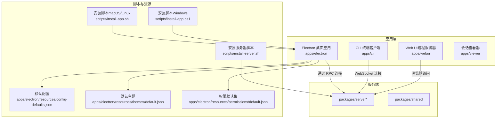
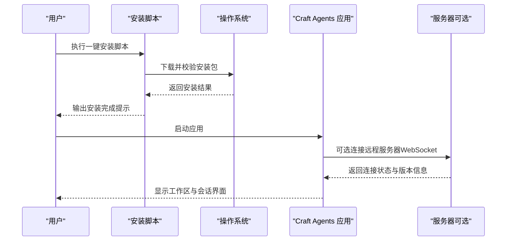
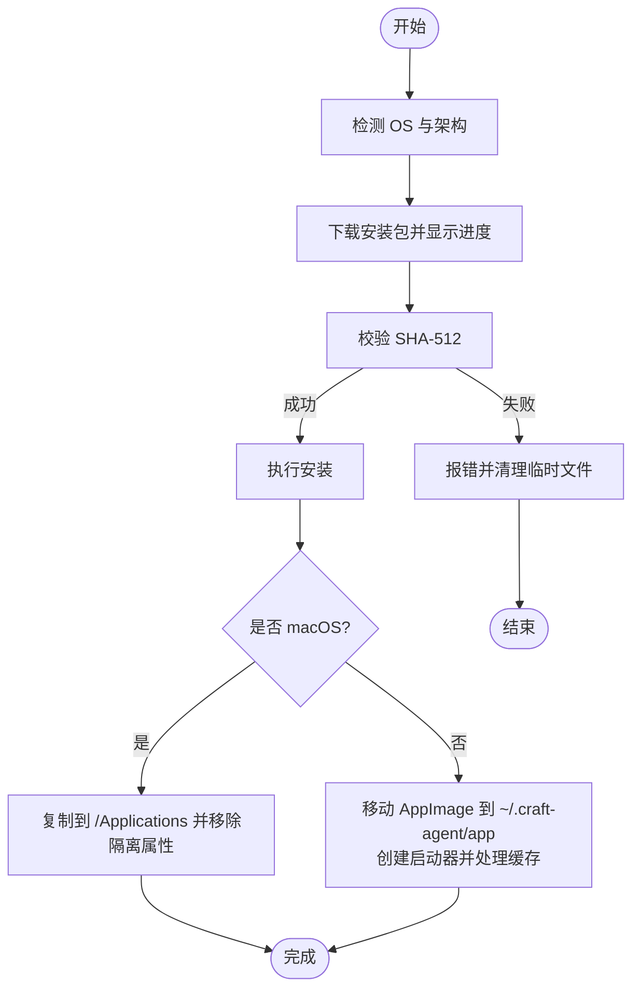
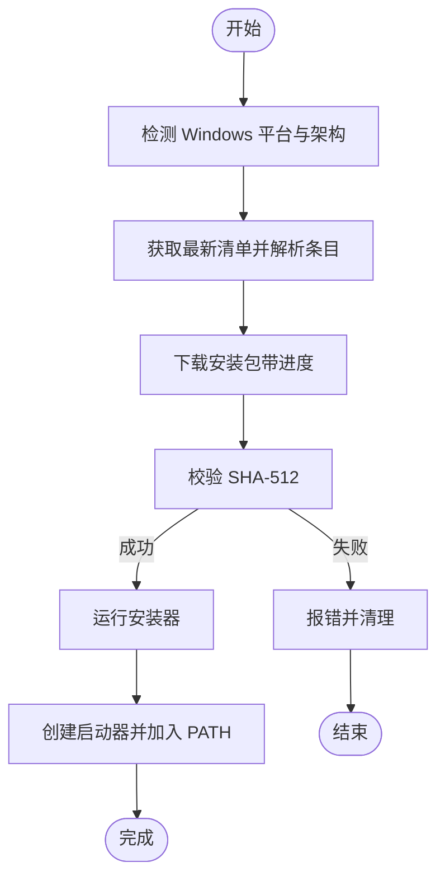
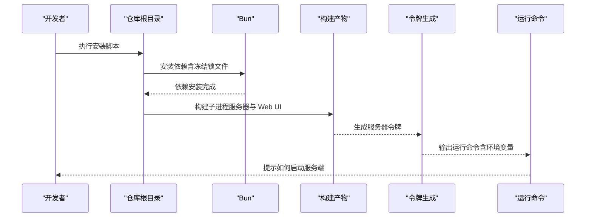
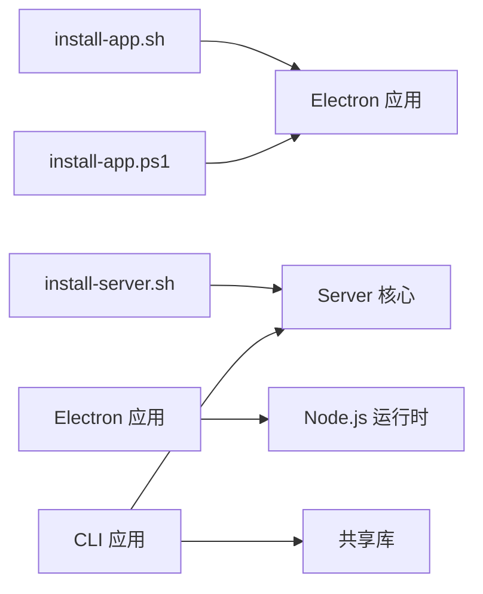

# 安装与配置

<cite>
**本文引用的文件**
- [README.md](file://README.md)
- [install-app.sh](file://scripts/install-app.sh)
- [install-app.ps1](file://scripts/install-app.ps1)
- [install-server.sh](file://scripts/install-server.sh)
- [generate-dev-cert.sh](file://scripts/generate-dev-cert.sh)
- [config-defaults.json](file://apps/electron/resources/config-defaults.json)
- [default.json（主题）](file://apps/electron/resources/themes/default.json)
- [default.json（权限）](file://apps/electron/resources/permissions/default.json)
- [themes.md](file://apps/electron/resources/docs/themes.md)
- [permissions.md](file://apps/electron/resources/docs/permissions.md)
- [package.json（Electron 应用）](file://apps/electron/package.json)
- [package.json（CLI 应用）](file://apps/cli/package.json)
</cite>

## 目录
1. [简介](#简介)
2. [项目结构](#项目结构)
3. [核心组件](#核心组件)
4. [架构总览](#架构总览)
5. [详细组件分析](#详细组件分析)
6. [依赖关系分析](#依赖关系分析)
7. [性能考虑](#性能考虑)
8. [故障排除指南](#故障排除指南)
9. [结论](#结论)
10. [附录](#附录)

## 简介
本指南面向首次部署与长期维护 Craft Agents 的用户，覆盖以下内容：
- 一键安装脚本在 macOS/Linux 与 Windows 上的使用方法
- 从源码构建桌面端与服务端的完整流程
- 配置文件结构与默认设置（工作区、主题、权限）
- 环境变量配置（LLM API 密钥、OAuth 凭据等）
- 常见安装与配置问题的排查
- 安全配置建议（TLS、凭据加密存储）

## 项目结构
仓库采用 Monorepo 结构，主要模块如下：
- apps/electron：Electron 桌面应用（主程序）
- apps/cli：终端客户端
- apps/webui：Web 界面（用于远程服务器）
- apps/viewer：会话查看器
- scripts：安装与打包脚本
- packages/*：共享库与服务端包
- apps/electron/resources/docs：主题与权限配置文档

图表来源
- [README.md](file://README.md)
- [install-app.sh](file://scripts/install-app.sh)
- [install-app.ps1](file://scripts/install-app.ps1)
- [install-server.sh](file://scripts/install-server.sh)
- [config-defaults.json](file://apps/electron/resources/config-defaults.json)
- [default.json（主题）](file://apps/electron/resources/themes/default.json)
- [default.json（权限）](file://apps/electron/resources/permissions/default.json)

章节来源
- [README.md](file://README.md)
- [package.json（Electron 应用）](file://apps/electron/package.json)
- [package.json（CLI 应用）](file://apps/cli/package.json)

## 核心组件
- 一键安装脚本
  - macOS/Linux：通过 curl 下载并校验签名后自动安装到系统路径或应用目录
  - Windows：下载安装包并通过校验后运行安装器，并在 PATH 中添加快捷命令
- 从源码构建
  - 使用 Bun 安装依赖，构建 Electron 主进程、渲染器与资源，支持开发与打包
- 配置与主题
  - 默认配置、工作区默认行为、主题与权限规则均以 JSON 文件形式存储于用户目录
- 环境变量
  - 服务器运行参数（令牌、绑定地址、TLS 证书）、CLI 连接参数（URL、令牌、TLS CA）、OAuth 凭据（桌面端构建时注入）

章节来源
- [README.md](file://README.md)
- [install-app.sh](file://scripts/install-app.sh)
- [install-app.ps1](file://scripts/install-app.ps1)
- [install-server.sh](file://scripts/install-server.sh)
- [config-defaults.json](file://apps/electron/resources/config-defaults.json)
- [default.json（主题）](file://apps/electron/resources/themes/default.json)
- [default.json（权限）](file://apps/electron/resources/permissions/default.json)

## 架构总览
下图展示从安装到运行的关键交互：

图表来源
- [install-app.sh](file://scripts/install-app.sh)
- [install-app.ps1](file://scripts/install-app.ps1)
- [README.md](file://README.md)

## 详细组件分析

### 一键安装脚本（macOS/Linux）
- 自动检测平台与架构，下载对应发行版
- 通过 SHA-512 校验确保完整性
- macOS：解压并安装到 /Applications；Linux：创建 AppImage 包与启动器，并提示安装 FUSE
- 安装完成后输出可执行命令与路径

图表来源
- [install-app.sh](file://scripts/install-app.sh)

章节来源
- [install-app.sh](file://scripts/install-app.sh)

### 一键安装脚本（Windows）
- 通过 PowerShell 获取清单并解析目标架构条目
- 下载安装包并以进度条显示下载过程
- 校验 SHA-512 后运行安装器
- 在用户 PATH 中写入批处理启动器

图表来源
- [install-app.ps1](file://scripts/install-app.ps1)

章节来源
- [install-app.ps1](file://scripts/install-app.ps1)

### 从源码构建（桌面端与服务端）
- 先决条件：Bun 版本满足要求
- 从仓库根目录执行安装与构建脚本，生成 Electron 主进程、渲染器与资源
- 服务端安装脚本会生成服务器令牌并打印运行命令，支持自定义主机、端口与 TLS

图表来源
- [install-server.sh](file://scripts/install-server.sh)
- [README.md](file://README.md)

章节来源
- [install-server.sh](file://scripts/install-server.sh)
- [README.md](file://README.md)

### 配置文件结构与默认设置
- 用户配置根目录：~/.craft-agent/
- 主要文件与目录
  - config.json：主配置（工作区、LLM 连接）
  - credentials.enc：凭据加密存储（AES-256-GCM）
  - preferences.json：用户偏好
  - theme.json：应用级主题覆盖
  - workspaces/{id}/：每个工作区独立配置
    - config.json：工作区设置
    - theme.json：工作区主题覆盖
    - automations.json：自动化规则
    - sessions/：会话数据（JSONL）
    - sources/：已连接的数据源
    - skills/：自定义技能
    - statuses/：动态状态配置

- 默认配置项（应用与工作区）
  - 应用默认：通知开关、颜色主题、输入行为、工具描述丰富度等
  - 工作区默认：思考级别、权限模式、本地 MCP 服务器启用等

- 主题系统
  - 支持应用默认主题、工作区覆盖、预设主题包与局部覆盖
  - 颜色体系：背景、前景、强调色、信息色、成功色、破坏性（错误）色
  - 深色模式：可对深色模式进行单独覆盖
  - 支持“景观模式”（Scenic），可叠加背景图与半透明面板

- 权限系统（Explore/Ask/Auto）
  - Explore：只读，允许有限 Bash 命令与只读 MCP/API 工具
  - Ask：需要审批
  - Allow-All：自动批准
  - 可通过正则与通配符精确控制 MCP 工具、API 端点、Bash 命令与写路径

章节来源
- [README.md](file://README.md)
- [config-defaults.json](file://apps/electron/resources/config-defaults.json)
- [default.json（主题）](file://apps/electron/resources/themes/default.json)
- [default.json（权限）](file://apps/electron/resources/permissions/default.json)
- [themes.md](file://apps/electron/resources/docs/themes.md)
- [permissions.md](file://apps/electron/resources/docs/permissions.md)

### 环境变量配置
- 服务器（远程 Thin Client 模式）
  - 必需：CRAFT_SERVER_TOKEN
  - 可选：CRAFT_RPC_HOST、CRAFT_RPC_PORT、CRAFT_RPC_TLS_CERT、CRAFT_RPC_TLS_KEY、CRAFT_RPC_TLS_CA、CRAFT_DEBUG
- CLI 客户端
  - 连接参数：CRAFT_SERVER_URL、CRAFT_SERVER_TOKEN、TLS CA
  - 运行参数：提供 LLM 提供商、模型、API Key 或自定义基础地址
- OAuth 凭据（桌面端构建）
  - MICROSOFT_OAUTH_CLIENT_ID/SECRET
  - SLACK_OAUTH_CLIENT_ID/SECRET
  - GOOGLE_OAUTH（桌面端不内置，需用户在源配置中提供）

章节来源
- [README.md](file://README.md)
- [package.json（Electron 应用）](file://apps/electron/package.json)
- [package.json（CLI 应用）](file://apps/cli/package.json)

### TLS 与安全配置
- 开发环境：使用脚本生成自签名证书（EC/P-256，有效期 365 天）
- 生产环境：建议使用受信 CA 证书或反向代理终止 TLS
- 服务器启动：通过环境变量启用 wss://，并可配置 CA 验证客户端证书
- 本地 MCP 子进程隔离：敏感环境变量会被过滤，避免泄露至子进程

章节来源
- [README.md](file://README.md)
- [generate-dev-cert.sh](file://scripts/generate-dev-cert.sh)

## 依赖关系分析
- 安装脚本依赖系统工具（curl/wget/yq）与平台特性（macOS/AppImage/Windows 安装器）
- 桌面端 Electron 应用依赖 Node.js 运行时与构建链（esbuild/Vite）
- CLI 客户端依赖共享库与服务端核心库
- 服务器依赖 Bun 运行时与 WebSocket 通道

图表来源
- [install-app.sh](file://scripts/install-app.sh)
- [install-app.ps1](file://scripts/install-app.ps1)
- [install-server.sh](file://scripts/install-server.sh)
- [package.json（Electron 应用）](file://apps/electron/package.json)
- [package.json（CLI 应用）](file://apps/cli/package.json)

章节来源
- [package.json（Electron 应用）](file://apps/electron/package.json)
- [package.json（CLI 应用）](file://apps/cli/package.json)

## 性能考虑
- 使用 AppImage 时注意 FUSE 依赖，缺失可能导致启动异常
- Linux 启动器会清理过期缓存目录，避免因 AppImage 挂载路径变更导致的缓存失效
- 服务器端建议在生产环境启用 TLS，减少网络开销与中间人风险
- CLI 与桌面端均支持多提供商与多模型切换，合理选择模型与基础地址可降低延迟

## 故障排除指南
- macOS 启动器无法打开应用
  - 检查是否被系统隔离属性阻止，尝试移除隔离属性或重新安装
- Linux 启动器报错找不到 AppImage
  - 确认安装路径与启动器脚本中的路径一致，必要时重新执行安装脚本
  - 若提示缺少 FUSE，请按提示安装相应包
- Windows 安装失败或校验失败
  - 确认网络连通性与下载超时设置，重试下载
  - 校验失败请检查 SHA-512 是否与清单一致
- 服务器无法启动或无法建立 WebSocket 连接
  - 检查令牌、绑定地址与端口是否正确
  - 如启用 TLS，确认证书与私钥路径有效且权限正确
- OAuth 登录失败
  - 确认桌面端构建时注入的客户端 ID/Secret 正确
  - Google OAuth 需要在源配置中提供自己的客户端凭据
- 主题或权限未生效
  - 确认 JSON 语法正确，文件位置与命名符合规范
  - Explore 模式下的 Bash 命令与 MCP 工具需通过权限规则显式放行

章节来源
- [install-app.sh](file://scripts/install-app.sh)
- [install-app.ps1](file://scripts/install-app.ps1)
- [README.md](file://README.md)
- [themes.md](file://apps/electron/resources/docs/themes.md)
- [permissions.md](file://apps/electron/resources/docs/permissions.md)

## 结论
通过一键安装脚本与从源码构建两种方式，用户可在不同平台上快速部署 Craft Agents。配合完善的配置文件体系与安全策略（TLS、凭据加密、权限控制），可满足从个人开发到团队协作的多样化需求。

## 附录
- 快速参考
  - 一键安装（macOS/Linux）：curl -fsSL agents.craft.do/install-app.sh | bash
  - 一键安装（Windows）：irm agents.craft.do/install-app.ps1 | iex
  - 从源码构建：git clone + bun install + bun run electron:start
  - 服务器安装与运行：bun scripts/install-server.sh 生成令牌并打印运行命令
  - TLS 证书生成：./scripts/generate-dev-cert.sh
  - 配置根目录：~/.craft-agent/