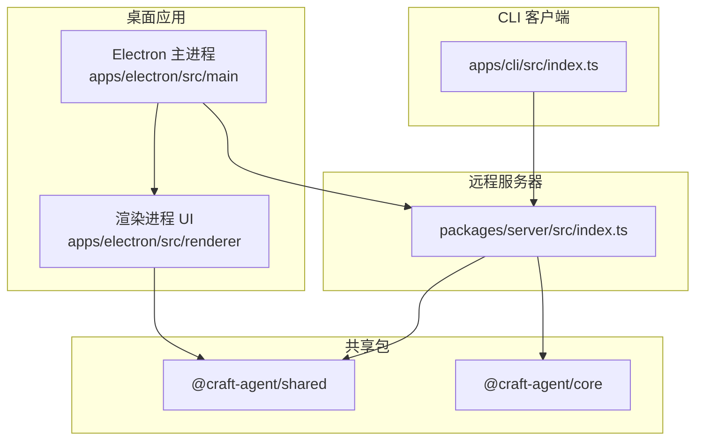
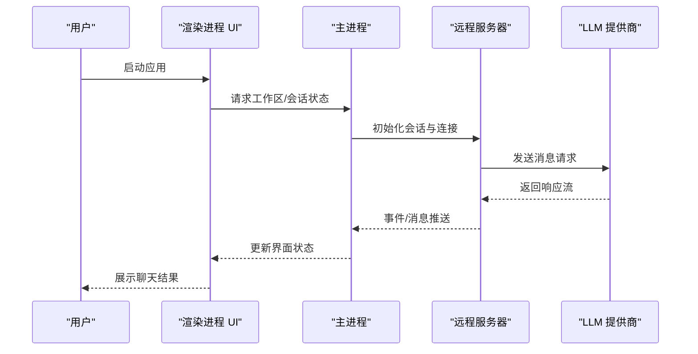
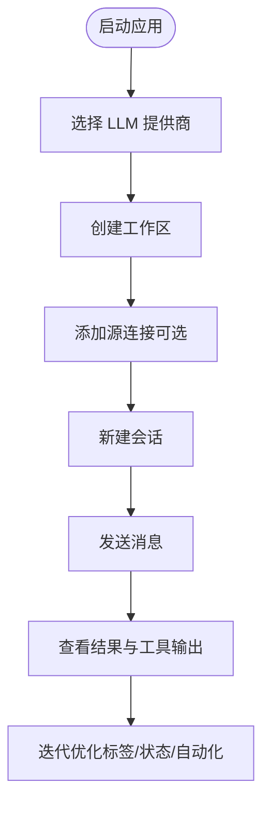
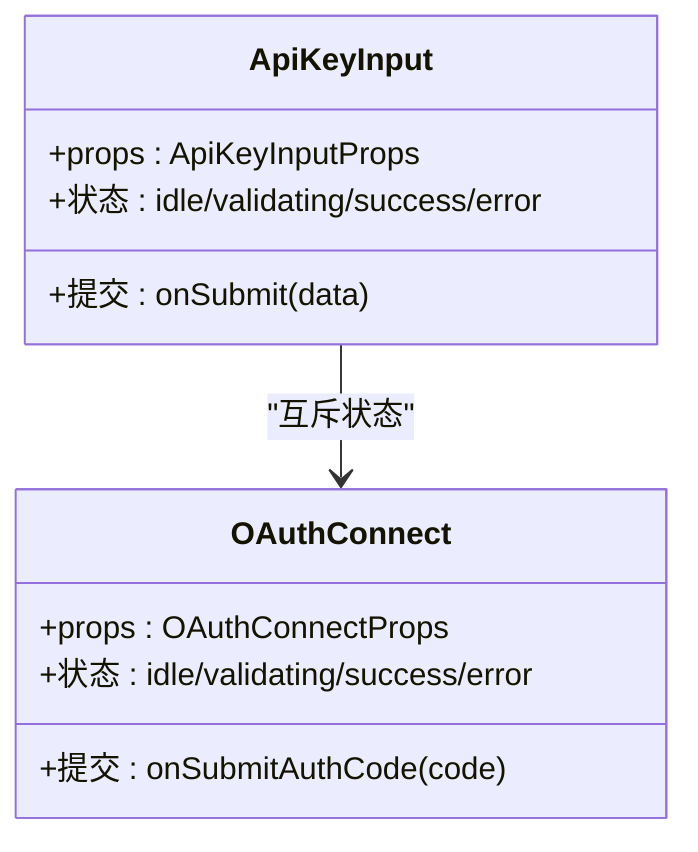
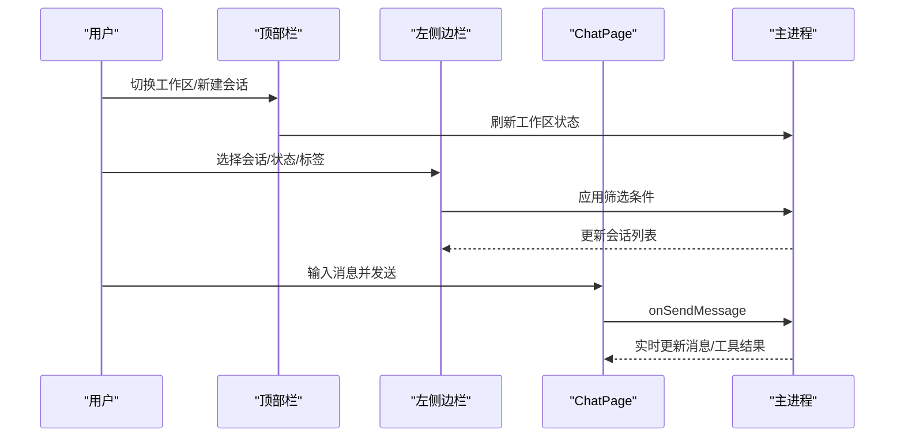
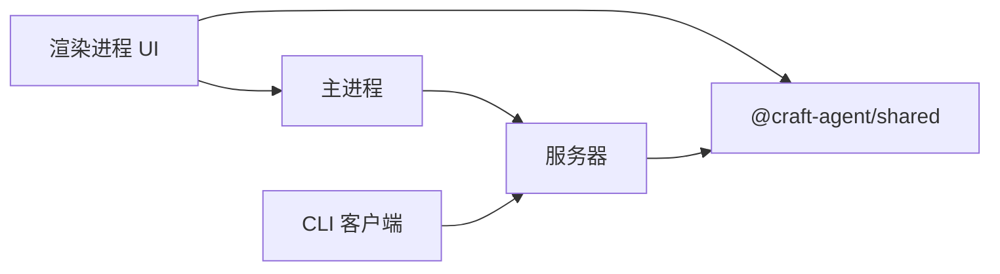

# 快速开始指南

<cite>
**本文档引用的文件**
- [README.md](file://README.md)
- [apps/electron/README.md](file://apps/electron/README.md)
- [apps/electron/resources/config-defaults.json](file://apps/electron/resources/config-defaults.json)
- [apps/electron/src/main/onboarding.ts](file://apps/electron/src/main/onboarding.ts)
- [apps/electron/src/renderer/pages/ChatPage.tsx](file://apps/electron/src/renderer/pages/ChatPage.tsx)
- [apps/electron/src/renderer/components/apisetup/ApiKeyInput.tsx](file://apps/electron/src/renderer/components/apisetup/ApiKeyInput.tsx)
- [apps/electron/src/renderer/components/apisetup/OAuthConnect.tsx](file://apps/electron/src/renderer/components/apisetup/OAuthConnect.tsx)
- [apps/electron/src/renderer/components/app-shell/LeftSidebar.tsx](file://apps/electron/src/renderer/components/app-shell/LeftSidebar.tsx)
- [apps/electron/src/renderer/components/app-shell/TopBar.tsx](file://apps/electron/src/renderer/components/app-shell/TopBar.tsx)
</cite>

## 目录
1. [简介](#简介)
2. [项目结构](#项目结构)
3. [核心组件](#核心组件)
4. [架构总览](#架构总览)
5. [详细组件分析](#详细组件分析)
6. [依赖关系分析](#依赖关系分析)
7. [性能考虑](#性能考虑)
8. [故障排除指南](#故障排除指南)
9. [结论](#结论)
10. [附录](#附录)

## 简介
本指南面向新用户，帮助您在 5 分钟内完成 Craft Agents 的安装、启动与基础使用。您将学会：
- 选择并配置 API 连接（Anthropic、Google AI Studio、ChatGPT Plus、GitHub Copilot）
- 创建工作区
- 配置源连接（MCP、REST API、本地文件）
- 创建会话、发送消息、查看结果
- 使用常用快捷键与界面导航
- 应用最佳实践与常见问题排查

Craft Agents 提供桌面端主应用与远程服务器模式，支持多会话收件箱、流式响应、工具可视化、权限模式、自动化等能力。

**章节来源**
- [README.md:105-112](file://README.md#L105-L112)
- [README.md:143-153](file://README.md#L143-L153)

## 项目结构
Craft Agents 采用多应用架构：
- apps/electron：Electron 桌面应用（React + shadcn/ui），提供聊天界面与工作区管理
- apps/cli：终端客户端，用于脚本化与 CI/CD
- apps/webui：可选 Web UI（当前主要以桌面应用为主）
- apps/viewer：会话分享查看器
- packages：共享业务逻辑与类型定义

**图表来源**
- [apps/electron/README.md:13-47](file://apps/electron/README.md#L13-L47)
- [README.md:347-369](file://README.md#L347-L369)

**章节来源**
- [apps/electron/README.md:13-47](file://apps/electron/README.md#L13-L47)
- [README.md:347-369](file://README.md#L347-L369)

## 核心组件
- 桌面应用（Electron）：提供多会话收件箱、聊天界面、侧边栏导航、设置与主题系统
- CLI 客户端：通过 WebSocket 连接到服务器，支持命令行运行与集成
- 远程服务器：可在远端机器运行，桌面应用作为薄客户端连接

关键特性：
- 多 LLM 连接：Anthropic、Google AI Studio、ChatGPT Plus、GitHub Copilot、OpenAI 等
- 多源连接：MCP 服务器、REST API、本地文件系统
- 权限模式：Explore（只读）、Ask to Edit（询问）、Auto（自动）
- 自动化：基于事件触发的自动化工作流

**章节来源**
- [README.md:88-104](file://README.md#L88-L104)
- [README.md:459-489](file://README.md#L459-L489)

## 架构总览
桌面应用通过 IPC 与主进程通信，主进程负责会话生命周期、工具执行与 LLM 调用；渲染进程负责 UI 呈现与用户交互。

**图表来源**
- [apps/electron/README.md:13-47](file://apps/electron/README.md#L13-L47)
- [README.md:154-184](file://README.md#L154-L184)

**章节来源**
- [apps/electron/README.md:13-47](file://apps/electron/README.md#L13-L47)
- [README.md:154-184](file://README.md#L154-L184)

## 详细组件分析

### 新用户引导流程（5 分钟上手）
1) 启动应用
- macOS/Linux：使用一键安装脚本或从源码构建后启动
- Windows：使用 PowerShell 脚本或从源码构建后启动

2) 选择 API 连接
- Anthropic：API Key 或 Claude Max/Pro OAuth
- Google AI Studio：API Key
- ChatGPT Plus / Pro：Codex OAuth
- GitHub Copilot：OAuth（设备码）

3) 创建工作区
- 在设置中创建新的工作区，用于组织会话与配置

4) 配置源连接（可选）
- MCP 服务器：输入 URL 与可选访问令牌进行验证
- REST API：按需配置（如 Gmail、Calendar、Drive、Slack、Microsoft）
- 本地文件：指向本地目录或仓库

5) 开始聊天
- 新建会话，输入消息，查看流式响应与工具调用结果

**图表来源**
- [README.md:105-112](file://README.md#L105-L112)
- [apps/electron/src/main/onboarding.ts:33-49](file://apps/electron/src/main/onboarding.ts#L33-L49)

**章节来源**
- [README.md:105-112](file://README.md#L105-L112)
- [apps/electron/src/main/onboarding.ts:33-49](file://apps/electron/src/main/onboarding.ts#L33-L49)

### API 连接配置组件
- ApiKeyInput：统一的 API Key 输入表单，支持预设提供商、自定义端点与模型选择
- OAuthConnect：OAuth 授权码输入与状态管理

**图表来源**
- [apps/electron/src/renderer/components/apisetup/ApiKeyInput.tsx:178-422](file://apps/electron/src/renderer/components/apisetup/ApiKeyInput.tsx#L178-L422)
- [apps/electron/src/renderer/components/apisetup/OAuthConnect.tsx:40-103](file://apps/electron/src/renderer/components/apisetup/OAuthConnect.tsx#L40-L103)

**章节来源**
- [apps/electron/src/renderer/components/apisetup/ApiKeyInput.tsx:178-422](file://apps/electron/src/renderer/components/apisetup/ApiKeyInput.tsx#L178-L422)
- [apps/electron/src/renderer/components/apisetup/OAuthConnect.tsx:40-103](file://apps/electron/src/renderer/components/apisetup/OAuthConnect.tsx#L40-L103)

### 工作区与会话管理
- ChatPage：单一会话页面，负责消息加载、发送、权限与凭据处理、分享与重命名
- 左侧边栏：会话列表、状态过滤、标签过滤、视图管理
- 顶部栏：工作区切换、浏览器标签、新建面板、帮助文档

**图表来源**
- [apps/electron/src/renderer/pages/ChatPage.tsx:36-836](file://apps/electron/src/renderer/pages/ChatPage.tsx#L36-L836)
- [apps/electron/src/renderer/components/app-shell/LeftSidebar.tsx:168-592](file://apps/electron/src/renderer/components/app-shell/LeftSidebar.tsx#L168-L592)
- [apps/electron/src/renderer/components/app-shell/TopBar.tsx:64-299](file://apps/electron/src/renderer/components/app-shell/TopBar.tsx#L64-L299)

**章节来源**
- [apps/electron/src/renderer/pages/ChatPage.tsx:36-836](file://apps/electron/src/renderer/pages/ChatPage.tsx#L36-L836)
- [apps/electron/src/renderer/components/app-shell/LeftSidebar.tsx:168-592](file://apps/electron/src/renderer/components/app-shell/LeftSidebar.tsx#L168-L592)
- [apps/electron/src/renderer/components/app-shell/TopBar.tsx:64-299](file://apps/electron/src/renderer/components/app-shell/TopBar.tsx#L64-L299)

### 常用快捷键与界面导航
- 新建聊天：Cmd+N
- 聚焦侧栏/列表/聊天：Cmd+1/2/3
- 打开快捷键对话框：Cmd+/
- 切换权限模式：Shift+Tab
- 发送消息：Enter
- 新行：Shift+Enter

导航要点：
- 顶部栏包含返回/前进、工作区切换、新建面板与帮助入口
- 左侧边栏支持状态/标签/视图筛选与拖拽排序
- 会话列表支持搜索、分组与批量操作

**章节来源**
- [README.md:143-153](file://README.md#L143-L153)
- [apps/electron/src/renderer/components/app-shell/TopBar.tsx:133-299](file://apps/electron/src/renderer/components/app-shell/TopBar.tsx#L133-L299)
- [apps/electron/src/renderer/components/app-shell/LeftSidebar.tsx:168-592](file://apps/electron/src/renderer/components/app-shell/LeftSidebar.tsx#L168-L592)

### 常见初始配置最佳实践
- 默认配置项（来自应用默认配置文件）：
  - 通知启用、颜色主题、自动首字母大写、回车发送、拼写检查、保持唤醒、富工具描述、扩展提示缓存、浏览器工具启用
  - 工作区默认思考级别、权限模式、可循环权限模式、本地 MCP 服务器启用
- 建议：
  - 首次使用保留默认主题与发送键，便于快速上手
  - 逐步开启“扩展提示缓存”以提升长上下文响应速度
  - 为每个工作区设置合适的默认思考级别与权限模式
  - 仅在需要时启用本地 MCP 服务器，避免不必要的资源占用

**章节来源**
- [apps/electron/resources/config-defaults.json:1-24](file://apps/electron/resources/config-defaults.json#L1-L24)

## 依赖关系分析
- Electron 主进程负责会话生命周期、工具执行与 LLM 调用
- 渲染进程负责 UI 呈现、用户交互与状态同步
- CLI 客户端通过 WebSocket 与服务器通信，支持命令行集成
- 共享包提供类型定义、认证、配置与凭证存储

**图表来源**
- [apps/electron/README.md:13-47](file://apps/electron/README.md#L13-L47)

**章节来源**
- [apps/electron/README.md:13-47](file://apps/electron/README.md#L13-L47)

## 性能考虑
- 流式响应：工具响应超过一定大小时自动摘要，减少传输与渲染压力
- 懒加载：会话消息按需加载，首次打开会话时异步拉取历史
- 缓存策略：扩展提示缓存可加速后续请求
- 资源隔离：本地 MCP 服务器环境变量过滤，防止凭据泄露

**章节来源**
- [README.md:557-560](file://README.md#L557-L560)
- [apps/electron/src/renderer/pages/ChatPage.tsx:116-152](file://apps/electron/src/renderer/pages/ChatPage.tsx#L116-L152)
- [README.md:629-638](file://README.md#L629-L638)

## 故障排除指南
- 启用调试日志：在打包应用中通过命令行参数开启详细日志
- 日志位置：根据操作系统写入到特定路径
- 常见问题：
  - SDK 路径解析：esbuild 打包后需显式设置 Claude SDK 可执行路径
  - 认证环境变量：必须在创建代理前设置好认证相关环境变量
  - 事件类型差异：注意 AgentEvent 字段命名差异，避免误用

**章节来源**
- [apps/electron/README.md:51-113](file://apps/electron/README.md#L51-L113)
- [README.md:585-610](file://README.md#L585-L610)

## 结论
通过本指南，您已掌握 Craft Agents 的核心使用流程：选择 API 连接、创建工作区、配置源连接，并在 5 分钟内完成首次会话与消息交互。建议在实际工作中逐步引入权限模式、自动化与标签体系，以获得更高效的工作流体验。

## 附录
- 支持的 LLM 提供商与第三方路由
- 远程服务器部署与 Thin Client 模式
- CLI 客户端命令参考与示例

**章节来源**
- [README.md:459-489](file://README.md#L459-L489)
- [README.md:154-246](file://README.md#L154-L246)
- [README.md:248-345](file://README.md#L248-L345)