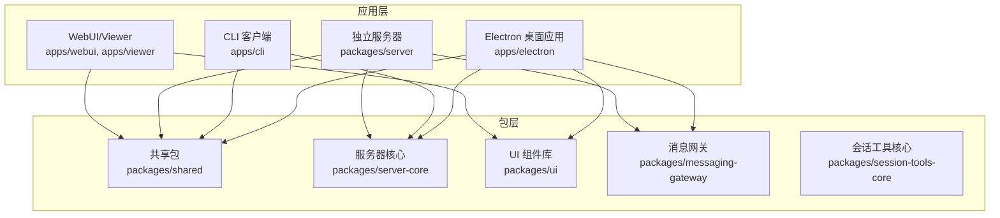
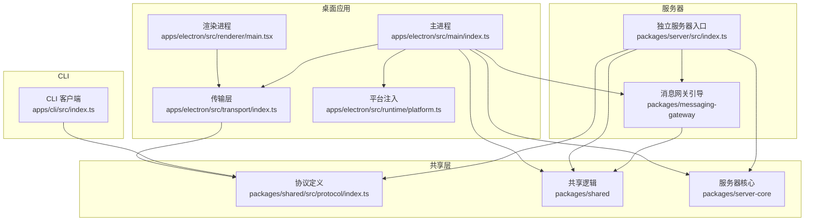
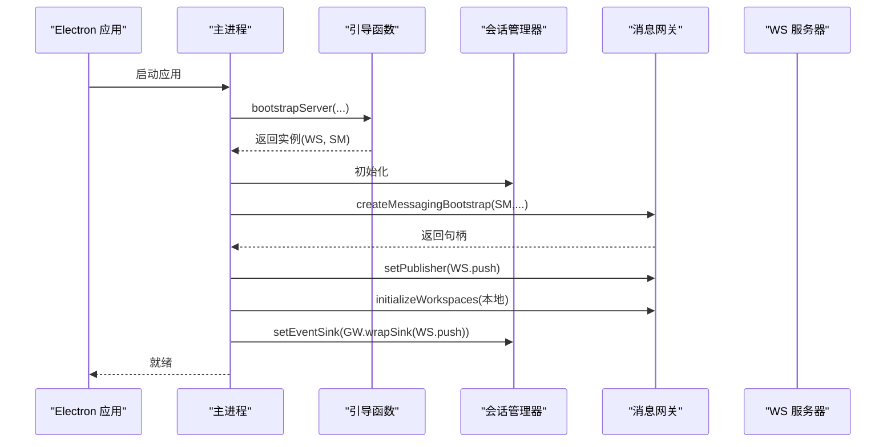
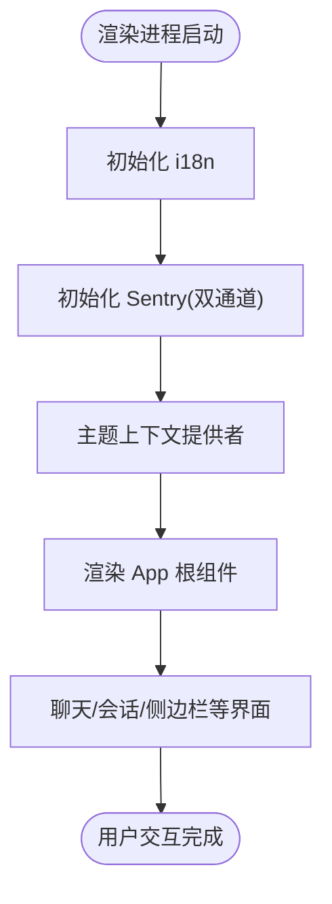
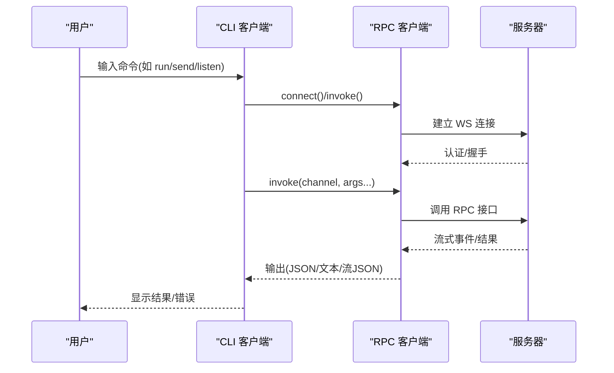
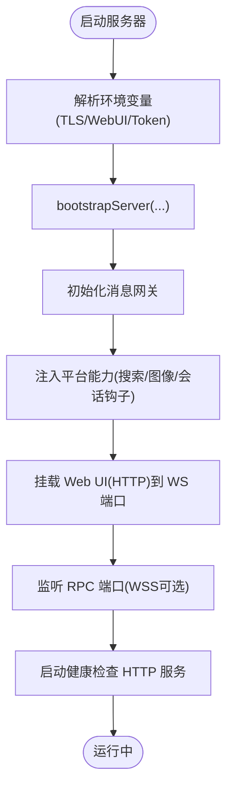
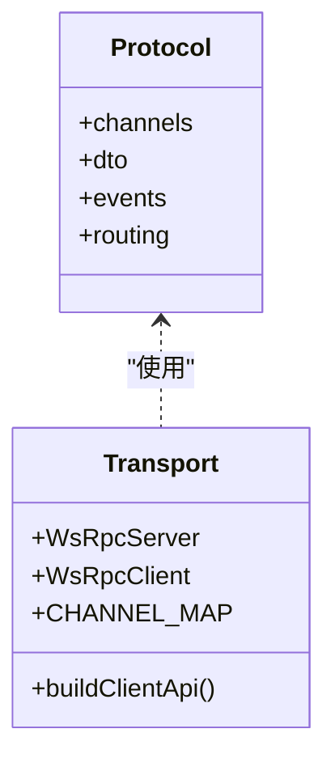
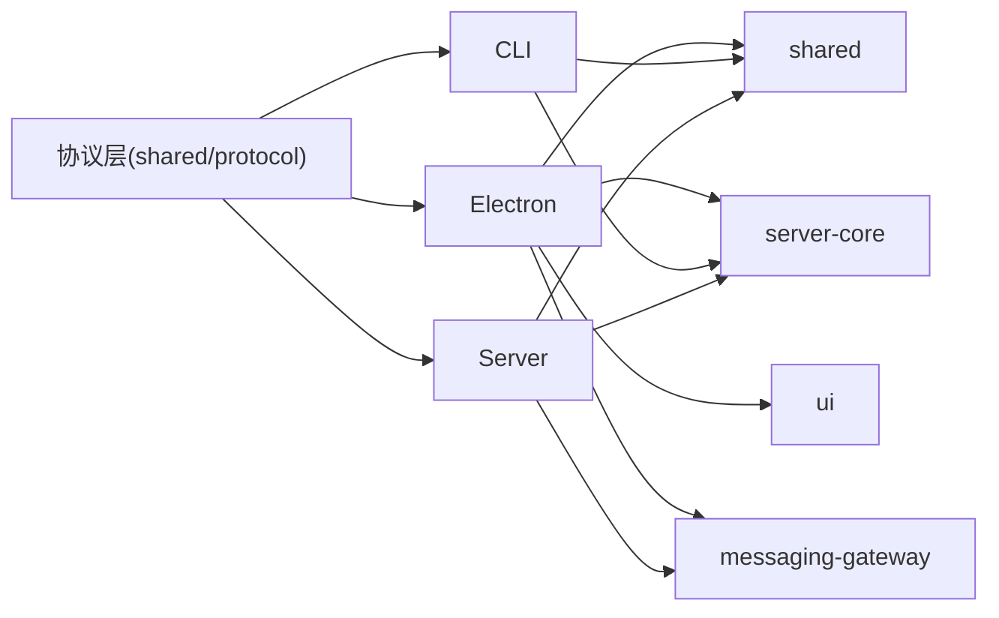

# 技术架构概览

<cite>
**本文档引用的文件**
- [package.json](file://package.json)
- [apps/electron/package.json](file://apps/electron/package.json)
- [apps/cli/package.json](file://apps/cli/package.json)
- [packages/server/package.json](file://packages/server/package.json)
- [packages/shared/package.json](file://packages/shared/package.json)
- [apps/electron/src/main/index.ts](file://apps/electron/src/main/index.ts)
- [apps/electron/src/renderer/main.tsx](file://apps/electron/src/renderer/main.tsx)
- [apps/electron/src/transport/index.ts](file://apps/electron/src/transport/index.ts)
- [apps/electron/src/runtime/platform.ts](file://apps/electron/src/runtime/platform.ts)
- [apps/cli/src/index.ts](file://apps/cli/src/index.ts)
- [packages/server/src/index.ts](file://packages/server/src/index.ts)
- [packages/shared/src/index.ts](file://packages/shared/src/index.ts)
- [packages/shared/src/protocol/index.ts](file://packages/shared/src/protocol/index.ts)
- [packages/ui/package.json](file://packages/ui/package.json)
</cite>

## 目录
1. [引言](#引言)
2. [项目结构](#项目结构)
3. [核心组件](#核心组件)
4. [架构总览](#架构总览)
5. [详细组件分析](#详细组件分析)
6. [依赖关系分析](#依赖关系分析)
7. [性能考量](#性能考量)
8. [故障排查指南](#故障排查指南)
9. [结论](#结论)

## 引言
本文件面向开发者与架构师，系统性阐述 Craft Agents 的技术架构与实现要点。项目采用 Electron 双进程架构（主进程 + 渲染进程），结合独立的 CLI 客户端与可独立部署的服务器，形成“桌面应用 + 命令行 + 无头服务器”的多形态交付方案；同时通过微服务化的包组织与共享层，实现跨应用的代码复用与模块解耦。技术选型方面，主进程与服务器均采用 Bun 运行时，前端使用 React + TypeScript，代理执行引擎基于 Claude Agent SDK，并通过 MCP 协议与外部工具生态集成。

## 项目结构
项目采用 Monorepo 结构，根目录通过工作区管理多个应用与共享包：

- 应用层
  - Electron 桌面应用：负责窗口管理、平台能力注入、IPC 通信与 UI 呈现
  - CLI 终端客户端：通过 WebSocket 连接服务器，提供命令式操作与流式输出
  - 独立服务器：以 Bun 运行，提供无头服务与可选 Web UI
  - Viewer/WebUI：轻量级预览与配置页面
- 包层
  - shared：跨应用共享的业务逻辑、协议、认证、配置、MCP 集成等
  - server-core：RPC 传输、会话管理、处理器注册、模型刷新等核心服务
  - ui：React 组件库，供 Electron 与 WebUI 复用
  - messaging-*：消息网关与特定通道（如 WhatsApp）适配
  - 其他领域包：核心代理、工具集、会话工具等

图表来源
- [apps/electron/package.json:1-84](file://apps/electron/package.json#L1-L84)
- [apps/cli/package.json:1-26](file://apps/cli/package.json#L1-L26)
- [packages/server/package.json:1-39](file://packages/server/package.json#L1-L39)
- [packages/shared/package.json:1-94](file://packages/shared/package.json#L1-L94)
- [packages/ui/package.json:1-73](file://packages/ui/package.json#L1-L73)

章节来源
- [package.json:18-22](file://package.json#L18-L22)
- [apps/electron/package.json:1-84](file://apps/electron/package.json#L1-L84)
- [apps/cli/package.json:1-26](file://apps/cli/package.json#L1-L26)
- [packages/server/package.json:1-39](file://packages/server/package.json#L1-L39)
- [packages/shared/package.json:1-94](file://packages/shared/package.json#L1-L94)
- [packages/ui/package.json:1-73](file://packages/ui/package.json#L1-L73)

## 核心组件
- Electron 主进程：负责应用生命周期、窗口管理、平台能力注入、服务器引导与消息网关初始化、深链处理、通知与自动更新等
- Electron 渲染进程：基于 React + TypeScript 的 UI 层，承载聊天、会话、侧边栏、设置等功能
- CLI 客户端：通过 WebSocket 连接服务器，提供 ping/health/versions/workspaces/sessions 等命令，支持本地服务器启动与验证
- 独立服务器：以 Bun 运行，提供 RPC 服务、可选 Web UI、健康检查、消息网关与工作空间初始化
- 共享包（shared）：统一协议、认证、配置、MCP、会话、资源、工具等跨应用共享逻辑
- 服务器核心（server-core）：RPC 传输、会话管理、处理器注册、模型刷新、平台注入等
- UI 组件库（ui）：React 组件与样式，支撑桌面与 WebUI

章节来源
- [apps/electron/src/main/index.ts:1-1194](file://apps/electron/src/main/index.ts#L1-L1194)
- [apps/electron/src/renderer/main.tsx:1-119](file://apps/electron/src/renderer/main.tsx#L1-L119)
- [apps/cli/src/index.ts:1-2076](file://apps/cli/src/index.ts#L1-L2076)
- [packages/server/src/index.ts:1-353](file://packages/server/src/index.ts#L1-L353)
- [packages/shared/src/index.ts:1-33](file://packages/shared/src/index.ts#L1-L33)

## 架构总览
整体架构由“桌面应用 + CLI + 服务器”三部分组成，三者通过统一的 RPC 协议与共享协议层进行通信。Electron 主进程在本地引导服务器或连接远程服务器，渲染进程通过 IPC 与主进程交互；CLI 通过 WebSocket 直连服务器；服务器通过消息网关与外部系统（如 WhatsApp）对接。

图表来源
- [apps/electron/src/main/index.ts:1-1194](file://apps/electron/src/main/index.ts#L1-L1194)
- [apps/electron/src/renderer/main.tsx:1-119](file://apps/electron/src/renderer/main.tsx#L1-L119)
- [apps/electron/src/transport/index.ts:1-6](file://apps/electron/src/transport/index.ts#L1-L6)
- [apps/electron/src/runtime/platform.ts:1-8](file://apps/electron/src/runtime/platform.ts#L1-L8)
- [apps/cli/src/index.ts:1-2076](file://apps/cli/src/index.ts#L1-L2076)
- [packages/server/src/index.ts:1-353](file://packages/server/src/index.ts#L1-L353)
- [packages/shared/src/protocol/index.ts:1-6](file://packages/shared/src/protocol/index.ts#L1-L6)

## 详细组件分析

### Electron 主进程：服务器引导与消息网关
- 服务器引导：通过共享的引导函数创建 RPC 服务器，注入平台能力（日志、图像处理、电源管理等），注册核心与 GUI RPC 处理器，建立会话事件到消息网关的扇出分发
- 消息网关：在会话管理器就绪后绑定 WebSocket 发布器，初始化本地工作空间，将事件广播至消息通道
- 平台注入：将 Electron 平台能力注入到搜索、模型拉取、会话钩子等子系统
- 深链与通知：处理 craftagents:// 协议、托盘图标与徽章、系统通知与自动更新

图表来源
- [apps/electron/src/main/index.ts:605-742](file://apps/electron/src/main/index.ts#L605-L742)

章节来源
- [apps/electron/src/main/index.ts:441-742](file://apps/electron/src/main/index.ts#L441-L742)

### Electron 渲染进程：React + TypeScript UI
- 初始化 i18n、Sentry 错误监控（双通道：主进程 IPC + React 边界）
- 提供主题上下文、全局状态（Jotai）、会话原子与工作空间标识
- 承载聊天、会话列表、侧边栏、设置等界面

图表来源
- [apps/electron/src/renderer/main.tsx:1-119](file://apps/electron/src/renderer/main.tsx#L1-L119)

章节来源
- [apps/electron/src/renderer/main.tsx:1-119](file://apps/electron/src/renderer/main.tsx#L1-L119)

### CLI 客户端：命令式操作与流式输出
- 参数解析与环境变量回退
- 自动工作空间解析、连接健康检查、版本查询
- 会话创建、消息发送、取消、删除、监听事件
- 支持本地服务器启动与验证（包含 MCP 工具链启动）

图表来源
- [apps/cli/src/index.ts:247-800](file://apps/cli/src/index.ts#L247-L800)

章节来源
- [apps/cli/src/index.ts:1-2076](file://apps/cli/src/index.ts#L1-L2076)

### 独立服务器：Bun 运行时与 Web UI
- 通过引导函数创建 RPC 服务器，支持 TLS/wss、内嵌 Web UI、健康检查 HTTP 服务
- 注入平台能力、初始化消息网关、清理钩子与优雅停机
- 严格禁止非本地绑定且未启用 TLS 的网络暴露，避免明文令牌泄露

图表来源
- [packages/server/src/index.ts:166-353](file://packages/server/src/index.ts#L166-L353)

章节来源
- [packages/server/src/index.ts:1-353](file://packages/server/src/index.ts#L1-L353)

### 共享协议与传输层
- 协议层：统一 RPC 通道、DTO、事件与路由定义，确保主进程、渲染进程、CLI、服务器之间的契约一致
- 传输层：在 Electron 中导出 RPC 服务器/客户端与通道映射，供上层构建 API

图表来源
- [packages/shared/src/protocol/index.ts:1-6](file://packages/shared/src/protocol/index.ts#L1-L6)
- [apps/electron/src/transport/index.ts:1-6](file://apps/electron/src/transport/index.ts#L1-L6)

章节来源
- [packages/shared/src/protocol/index.ts:1-6](file://packages/shared/src/protocol/index.ts#L1-L6)
- [apps/electron/src/transport/index.ts:1-6](file://apps/electron/src/transport/index.ts#L1-L6)

### 技术栈选择与优势
- Bun 运行时：极快的启动与执行速度，降低开发与部署时延；Electron 与服务器共用同一运行时，减少二进制与依赖差异
- React + TypeScript：成熟的前端生态与强类型保障，配合共享 UI 组件库提升一致性与复用率
- Claude Agent SDK：作为代理执行引擎，提供稳定的计划、工具调用与权限控制能力
- MCP 协议：标准化的工具与资源发现/调用协议，便于扩展外部工具链与第三方服务
- Electron：原生桌面体验，结合 IPC 与 WebSocket 实现跨进程与跨网络通信
- 微服务化包组织：通过共享包与工作区管理，实现跨应用复用、测试隔离与独立演进

章节来源
- [package.json:139-200](file://package.json#L139-L200)
- [apps/electron/package.json:38-82](file://apps/electron/package.json#L38-L82)
- [packages/ui/package.json:20-72](file://packages/ui/package.json#L20-L72)

## 依赖关系分析
- 应用对包的依赖：Electron 与 CLI 均依赖 shared、server-core、ui、messaging-gateway 等；服务器独立运行，但同样依赖 shared 与 server-core
- 传输与协议：所有组件通过共享协议与传输层保持接口一致，避免紧耦合
- 平台注入：主进程将 Electron 平台能力注入到搜索、模型拉取、会话钩子等子系统，保证功能可用性与可观测性

图表来源
- [apps/electron/package.json:38-82](file://apps/electron/package.json#L38-L82)
- [apps/cli/package.json:16-25](file://apps/cli/package.json#L16-L25)
- [packages/server/package.json:27-32](file://packages/server/package.json#L27-L32)
- [packages/shared/package.json:67-88](file://packages/shared/package.json#L67-L88)

章节来源
- [apps/electron/package.json:38-82](file://apps/electron/package.json#L38-L82)
- [apps/cli/package.json:16-25](file://apps/cli/package.json#L16-L25)
- [packages/server/package.json:27-32](file://packages/server/package.json#L27-L32)
- [packages/shared/package.json:67-88](file://packages/shared/package.json#L67-L88)

## 性能考量
- 启动与冷启动：Bun 的快速启动显著缩短主进程与服务器启动时间；CLI 支持本地服务器启动，便于快速验证
- 传输效率：RPC 使用 WebSocket，事件流式推送，减少轮询开销；通道映射与 DTO 规范化降低序列化成本
- 资源占用：主进程按需加载平台能力与子系统，避免不必要的初始化；渲染进程通过组件库与状态管理减少重复渲染
- 缓存与复用：共享包中的缓存与工具链（如 uv、脚本工具）在首次使用后缓存，后续调用更快

## 故障排查指南
- 服务器绑定安全：若监听非本地地址且未启用 TLS，将拒绝启动并提示使用 TLS 或显式允许（不推荐生产环境）
- 深链与证书：自签名服务器证书可通过主进程的证书错误回调绕过，仅针对指定来源，避免全局放宽
- 通知与托盘：检查通知服务初始化与徽章图标资源路径，确保在 macOS/Windows 上正常显示
- CLI 连接：确认服务器 URL、令牌与 TLS CA 配置；必要时使用本地服务器启动模式进行验证
- 模型与凭据：通过共享凭据管理器读取 API Key/OAuth 凭据，确保模型刷新服务可用

章节来源
- [packages/server/src/index.ts:314-335](file://packages/server/src/index.ts#L314-L335)
- [apps/electron/src/main/index.ts:222-261](file://apps/electron/src/main/index.ts#L222-L261)
- [apps/cli/src/index.ts:716-751](file://apps/cli/src/index.ts#L716-L751)

## 结论
Craft Agents 通过 Electron 双进程架构、CLI 与独立服务器的分离设计，以及共享包与微服务化组织，实现了高内聚、低耦合、可扩展的系统架构。Bun 运行时、React + TypeScript、Claude Agent SDK 与 MCP 协议的选择，既满足了开发效率与用户体验，也为未来的功能扩展与生态集成奠定了坚实基础。建议在团队内持续完善共享协议与传输层契约，强化测试与可观测性，以保障多形态交付的一致性与稳定性。