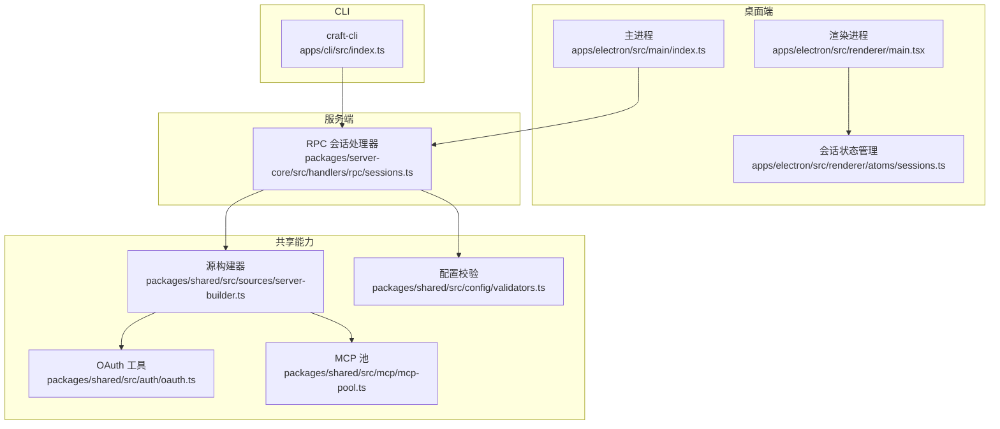
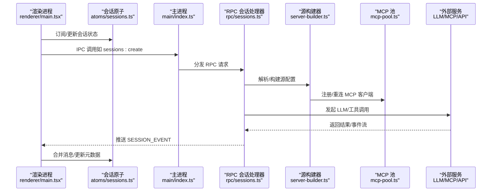
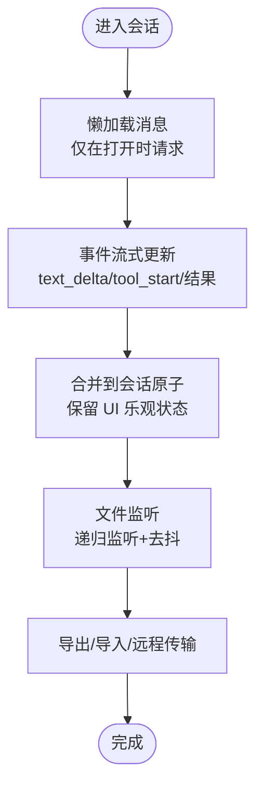
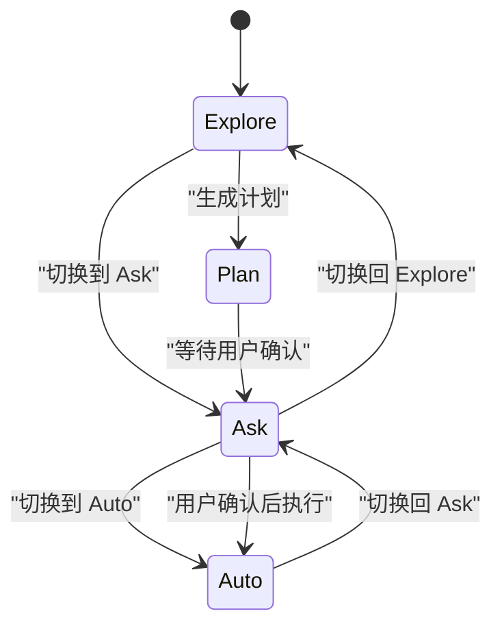
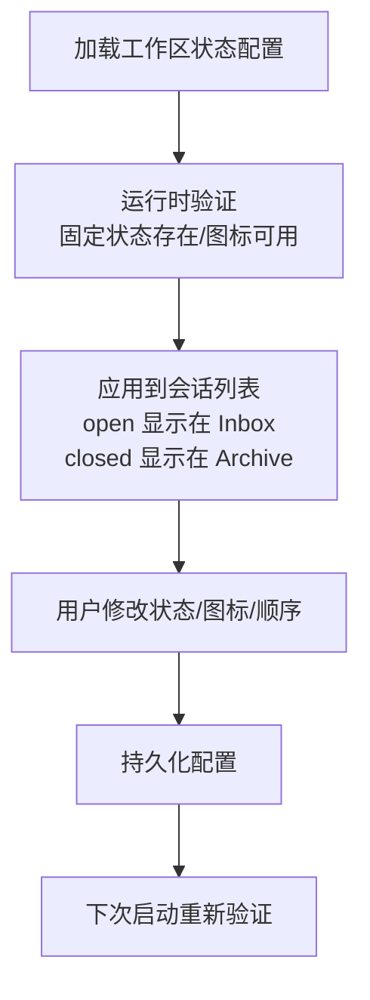
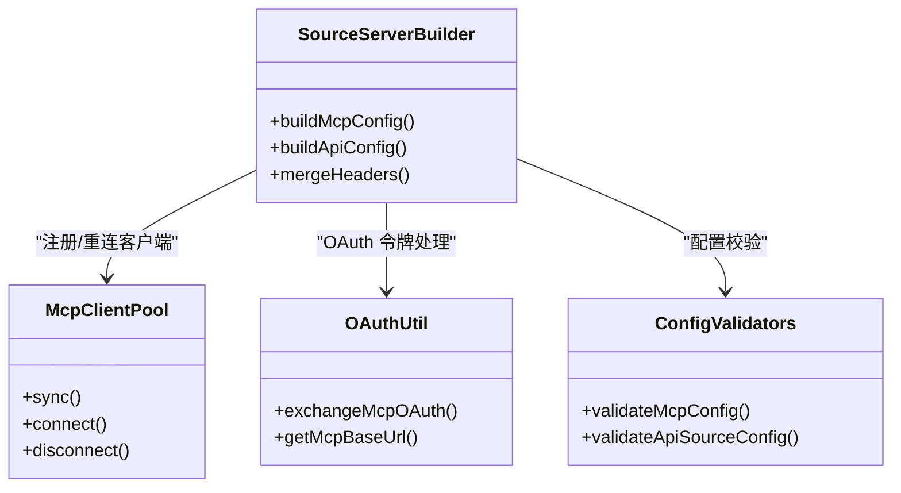
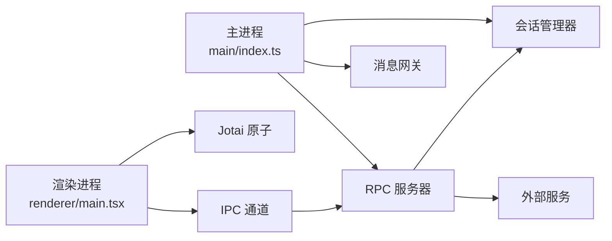

# 核心功能特性

<cite>
**本文引用的文件**
- [apps/electron/src/main/index.ts](file://apps/electron/src/main/index.ts)
- [apps/electron/src/renderer/main.tsx](file://apps/electron/src/renderer/main.tsx)
- [apps/cli/src/index.ts](file://apps/cli/src/index.ts)
- [packages/server-core/src/handlers/rpc/sessions.ts](file://packages/server-core/src/handlers/rpc/sessions.ts)
- [apps/electron/src/renderer/atoms/sessions.ts](file://apps/electron/src/renderer/atoms/sessions.ts)
- [apps/electron/resources/docs/permissions.md](file://apps/electron/resources/docs/permissions.md)
- [apps/electron/resources/docs/statuses.md](file://apps/electron/resources/docs/statuses.md)
- [apps/electron/resources/docs/skills.md](file://apps/electron/resources/docs/skills.md)
- [packages/shared/src/prompts/system.ts](file://packages/shared/src/prompts/system.ts)
- [packages/shared/src/agent/plan-types.ts](file://packages/shared/src/agent/plan-types.ts)
- [packages/shared/src/auth/oauth.ts](file://packages/shared/src/auth/oauth.ts)
- [packages/shared/src/sources/server-builder.ts](file://packages/shared/src/sources/server-builder.ts)
- [packages/shared/src/sources/types.ts](file://packages/shared/src/sources/types.ts)
- [packages/shared/src/mcp/mcp-pool.ts](file://packages/shared/src/mcp/mcp-pool.ts)
- [packages/shared/src/config/validators.ts](file://packages/shared/src/config/validators.ts)
</cite>

## 目录
1. [简介](#简介)
2. [项目结构](#项目结构)
3. [核心组件](#核心组件)
4. [架构总览](#架构总览)
5. [详细组件分析](#详细组件分析)
6. [依赖关系分析](#依赖关系分析)
7. [性能考量](#性能考量)
8. [故障排查指南](#故障排查指南)
9. [结论](#结论)
10. [附录](#附录)

## 简介
本文件聚焦 Craft Agents 的核心功能特性，围绕“多会话管理、智能代理协作、无繁琐连接配置”三大主题展开，系统阐述代理原生软件原则在 AI 自动发现与配置外部服务方面的实现路径；详解会话管理系统的 Inbox/Archive 功能、动态状态系统、权限模式（Explore、Ask、Auto）等关键能力；并深入解析多 LLM 供应商支持、MCP 服务器集成、REST API 连接的技术细节。最后提供可操作的使用场景与最佳实践，帮助用户最大化发挥平台能力。

## 项目结构
本项目采用多包（monorepo）与多应用（桌面端 Electron、CLI、WebUI、Viewer）协同的架构：
- 桌面端主进程负责系统级初始化、平台注入、RPC 服务引导、消息网关与工作区管理；
- 渲染进程负责 UI 呈现、状态管理（Jotai）、事件订阅与交互；
- CLI 提供终端接入，支持本地或远程服务器连接、会话生命周期管理与 LLM 连接自动配置；
- 共享层提供协议、类型、提示词、认证、源构建器、MCP 池等跨模块能力。

**图表来源**
- [apps/electron/src/main/index.ts:1-200](file://apps/electron/src/main/index.ts#L1-L200)
- [apps/electron/src/renderer/main.tsx:1-119](file://apps/electron/src/renderer/main.tsx#L1-L119)
- [apps/cli/src/index.ts:1-200](file://apps/cli/src/index.ts#L1-L200)
- [packages/server-core/src/handlers/rpc/sessions.ts:112-511](file://packages/server-core/src/handlers/rpc/sessions.ts#L112-L511)
- [packages/shared/src/sources/server-builder.ts:113-271](file://packages/shared/src/sources/server-builder.ts#L113-L271)
- [packages/shared/src/mcp/mcp-pool.ts:246-282](file://packages/shared/src/mcp/mcp-pool.ts#L246-L282)
- [packages/shared/src/auth/oauth.ts:480-651](file://packages/shared/src/auth/oauth.ts#L480-L651)
- [packages/shared/src/config/validators.ts:392-432](file://packages/shared/src/config/validators.ts#L392-L432)

**章节来源**
- [apps/electron/src/main/index.ts:1-200](file://apps/electron/src/main/index.ts#L1-L200)
- [apps/electron/src/renderer/main.tsx:1-119](file://apps/electron/src/renderer/main.tsx#L1-L119)
- [apps/cli/src/index.ts:1-200](file://apps/cli/src/index.ts#L1-L200)
- [packages/server-core/src/handlers/rpc/sessions.ts:112-511](file://packages/server-core/src/handlers/rpc/sessions.ts#L112-L511)

## 核心组件
- 多会话管理：基于会话原子家族（atomFamily）实现按会话隔离的状态更新，避免跨会话重渲染；支持懒加载消息、文件监听、导出导入、远程传输等能力。
- 权限模式系统：提供 Explore（只读探索）、Ask（编辑前询问）、Auto（全量自主执行）三种模式，配合系统提示词与策略切换，确保安全可控的代理协作。
- 动态状态系统：工作区级状态配置（statuses），支持自定义状态、颜色、图标与分类（open/closed），实现 Inbox/Archive 的自然流转。
- 无繁琐连接配置：通过源构建器与 MCP 池自动发现与配置外部服务，支持 OAuth、Bearer、Header、Query、Basic 等多种认证方式，并对令牌刷新与变更进行自动重连。
- 多 LLM 供应商与 REST API：CLI 与桌面端均支持多供应商（含自定义 endpoint），REST API 源支持多种认证与测试端点，统一由配置校验保障正确性。

**章节来源**
- [apps/electron/src/renderer/atoms/sessions.ts:1-679](file://apps/electron/src/renderer/atoms/sessions.ts#L1-L679)
- [packages/server-core/src/handlers/rpc/sessions.ts:112-511](file://packages/server-core/src/handlers/rpc/sessions.ts#L112-L511)
- [apps/electron/resources/docs/permissions.md:1-339](file://apps/electron/resources/docs/permissions.md#L1-L339)
- [apps/electron/resources/docs/statuses.md:1-204](file://apps/electron/resources/docs/statuses.md#L1-L204)
- [packages/shared/src/sources/server-builder.ts:113-271](file://packages/shared/src/sources/server-builder.ts#L113-L271)
- [packages/shared/src/mcp/mcp-pool.ts:246-282](file://packages/shared/src/mcp/mcp-pool.ts#L246-L282)
- [packages/shared/src/config/validators.ts:392-432](file://packages/shared/src/config/validators.ts#L392-L432)

## 架构总览
下图展示从桌面端到服务端、再到外部服务的完整链路：主进程引导 RPC 服务与消息网关，渲染进程通过 Jotai 管理会话状态，CLI 直接连接 RPC 或本地服务器；共享层负责认证、源构建与 MCP 池维护。

**图表来源**
- [apps/electron/src/renderer/main.tsx:1-119](file://apps/electron/src/renderer/main.tsx#L1-L119)
- [apps/electron/src/renderer/atoms/sessions.ts:1-679](file://apps/electron/src/renderer/atoms/sessions.ts#L1-L679)
- [apps/electron/src/main/index.ts:434-742](file://apps/electron/src/main/index.ts#L434-L742)
- [packages/server-core/src/handlers/rpc/sessions.ts:112-511](file://packages/server-core/src/handlers/rpc/sessions.ts#L112-L511)
- [packages/shared/src/sources/server-builder.ts:113-271](file://packages/shared/src/sources/server-builder.ts#L113-L271)
- [packages/shared/src/mcp/mcp-pool.ts:246-282](file://packages/shared/src/mcp/mcp-pool.ts#L246-L282)

## 详细组件分析

### 多会话管理与状态系统
- 隔离状态与懒加载：使用 atomFamily 为每个会话创建独立原子，避免跨会话重渲染；消息列表默认为空，按需加载以降低内存占用。
- 文件监听与变更通知：为每个客户端会话注册文件系统监听，去抖后推送 FILES_CHANGED 事件，保持 UI 与文件系统同步。
- 导入/导出与远程传输：支持会话打包导出、目标工作区导入、远程传输摘要生成与导入，保障跨环境迁移与备份。
- 会话命令集：包含标记、归档/取消归档、重命名、设置状态、读取/未读、权限模式切换、思维层级、工作目录、源启用、标签、分享、注解等。

**图表来源**
- [apps/electron/src/renderer/atoms/sessions.ts:514-627](file://apps/electron/src/renderer/atoms/sessions.ts#L514-L627)
- [packages/server-core/src/handlers/rpc/sessions.ts:376-431](file://packages/server-core/src/handlers/rpc/sessions.ts#L376-L431)
- [packages/server-core/src/handlers/rpc/sessions.ts:468-510](file://packages/server-core/src/handlers/rpc/sessions.ts#L468-L510)

**章节来源**
- [apps/electron/src/renderer/atoms/sessions.ts:1-679](file://apps/electron/src/renderer/atoms/sessions.ts#L1-L679)
- [packages/server-core/src/handlers/rpc/sessions.ts:112-511](file://packages/server-core/src/handlers/rpc/sessions.ts#L112-L511)

### 权限模式与智能协作
- 模式定义：Explore（只读）、Ask（编辑前询问）、Auto（全量执行），系统提示词明确各模式边界与行为。
- 模式切换：通过 COMMAND 类型中的 setPermissionMode 实现，配合系统提示词注入，确保代理在不同模式间平滑过渡。
- Explore 模式的计划提交：允许在只读模式下生成实现计划，经用户确认后转入执行模式，形成“探索-规划-执行”的闭环。

**图表来源**
- [packages/shared/src/prompts/system.ts:572-581](file://packages/shared/src/prompts/system.ts#L572-L581)
- [packages/shared/src/agent/plan-types.ts:226-230](file://packages/shared/src/agent/plan-types.ts#L226-L230)
- [packages/server-core/src/handlers/rpc/sessions.ts:256-257](file://packages/server-core/src/handlers/rpc/sessions.ts#L256-L257)

**章节来源**
- [apps/electron/resources/docs/permissions.md:1-339](file://apps/electron/resources/docs/permissions.md#L1-L339)
- [packages/shared/src/prompts/system.ts:572-581](file://packages/shared/src/prompts/system.ts#L572-L581)
- [packages/shared/src/agent/plan-types.ts:226-230](file://packages/shared/src/agent/plan-types.ts#L226-L230)
- [packages/server-core/src/handlers/rpc/sessions.ts:256-257](file://packages/server-core/src/handlers/rpc/sessions.ts#L256-L257)

### 动态状态系统（Inbox/Archive）
- 状态配置：每个工作区独立维护状态配置，支持固定/默认/自定义三类状态，颜色与图标可自定义，分类 open/closed 决定是否出现在 Inbox/Archive。
- 自愈与验证：缺失图标自动重建、非法配置回退默认、启动时验证配置完整性。
- 与会话联动：会话状态字段与 UI 展示一致，支持排序与批量操作。

**图表来源**
- [apps/electron/resources/docs/statuses.md:1-204](file://apps/electron/resources/docs/statuses.md#L1-L204)

**章节来源**
- [apps/electron/resources/docs/statuses.md:1-204](file://apps/electron/resources/docs/statuses.md#L1-L204)

### 技能系统（Skills）
- 格式兼容：与 Claude Code SDK 使用相同 SKILL.md 格式，支持 frontmatter 字段与 Markdown 内容。
- 工作区作用域：工作区技能优先于 SDK 内置技能，支持覆盖、扩展与新增。
- 图标与验证：建议提供 SVG 图标，支持在线下载或本地资源；提供验证命令确保格式与内容有效。

**章节来源**
- [apps/electron/resources/docs/skills.md:1-336](file://apps/electron/resources/docs/skills.md#L1-L336)

### 无繁琐连接配置：LLM 与外部服务
- LLM 连接自动配置：CLI 支持通过参数或环境变量自动创建/更新 LLM 连接，识别 Anthropic/OpenAI/Bedrock 等供应商，必要时生成自定义 endpoint。
- REST API 与 OAuth：支持 Bearer/Header/Query/Basic/OAuth 等认证方式，统一通过源构建器合并静态头、凭证存储头与授权头，优先级明确。
- MCP 服务器：支持 HTTP/SSE/STDIO 三种传输，自动合并多源凭据，检测配置变化并触发重连；支持 OAuth 交换与令牌刷新。

**图表来源**
- [packages/shared/src/sources/server-builder.ts:113-271](file://packages/shared/src/sources/server-builder.ts#L113-L271)
- [packages/shared/src/mcp/mcp-pool.ts:246-282](file://packages/shared/src/mcp/mcp-pool.ts#L246-L282)
- [packages/shared/src/auth/oauth.ts:480-651](file://packages/shared/src/auth/oauth.ts#L480-L651)
- [packages/shared/src/config/validators.ts:392-432](file://packages/shared/src/config/validators.ts#L392-L432)

**章节来源**
- [apps/cli/src/index.ts:516-626](file://apps/cli/src/index.ts#L516-L626)
- [packages/shared/src/sources/server-builder.ts:113-271](file://packages/shared/src/sources/server-builder.ts#L113-L271)
- [packages/shared/src/mcp/mcp-pool.ts:246-282](file://packages/shared/src/mcp/mcp-pool.ts#L246-L282)
- [packages/shared/src/auth/oauth.ts:480-651](file://packages/shared/src/auth/oauth.ts#L480-L651)
- [packages/shared/src/config/validators.ts:392-432](file://packages/shared/src/config/validators.ts#L392-L432)

### 多 LLM 供应商与 REST API 连接
- 供应商适配：CLI 与桌面端均支持多供应商（含自定义 endpoint），自动选择 providerType/authType 并填充凭据。
- REST API 测试：提供测试端点配置，便于连接健康检查与权限验证。
- 认证优先级：静态头 < 凭证存储头 < 授权头（Bearer/OAuth），避免冲突。

**章节来源**
- [apps/cli/src/index.ts:516-626](file://apps/cli/src/index.ts#L516-L626)
- [packages/shared/src/sources/types.ts:260-315](file://packages/shared/src/sources/types.ts#L260-L315)
- [packages/shared/src/sources/server-builder.ts:113-148](file://packages/shared/src/sources/server-builder.ts#L113-L148)

## 依赖关系分析
- 主进程依赖：通过 bootstrap 初始化 RPC 服务器、平台注入、会话管理器与消息网关；注册所有 RPC 处理器，建立事件分发通道。
- 渲染进程依赖：Jotai 管理会话状态，与主进程通过 IPC 通道通信；错误与日志通过 Sentry 统一上报。
- 共享层依赖：认证、源构建、MCP 池、配置校验等能力被主/渲染/CLI 复用，保证一致性与可维护性。

**图表来源**
- [apps/electron/src/main/index.ts:434-742](file://apps/electron/src/main/index.ts#L434-L742)
- [apps/electron/src/renderer/main.tsx:1-119](file://apps/electron/src/renderer/main.tsx#L1-L119)

**章节来源**
- [apps/electron/src/main/index.ts:434-742](file://apps/electron/src/main/index.ts#L434-L742)
- [apps/electron/src/renderer/main.tsx:1-119](file://apps/electron/src/renderer/main.tsx#L1-L119)

## 性能考量
- 懒加载与去抖：会话消息懒加载与文件监听去抖显著降低初始内存与 I/O 压力。
- 隔离更新：atomFamily 避免跨会话重渲染，提升复杂场景下的 UI 响应性。
- 事件流式推送：RPC 事件流式返回，避免阻塞主线程，提升交互流畅度。
- 配置变更最小化：MCP 池仅在配置变更时重连，减少不必要的握手成本。

[本节为通用指导，不直接分析具体文件]

## 故障排查指南
- 会话消息丢失或显示异常：检查是否处于流式处理中，避免在流式期间覆盖原子；必要时强制重新加载消息。
- 文件监听无效：确认监听已启动且未被清理；检查去抖时间与隐藏文件过滤逻辑。
- LLM 连接失败：核对供应商类型与凭据，确认 CLI/桌面端环境变量与配置一致；查看健康检查输出。
- OAuth 交换失败：检查授权端点、令牌端点与回调 URI；确认 code_verifier 与 redirect_uri 匹配。
- MCP 重连频繁：检查凭据变更与网络波动；确认配置校验通过且未遗漏必需字段。

**章节来源**
- [apps/electron/src/renderer/atoms/sessions.ts:514-627](file://apps/electron/src/renderer/atoms/sessions.ts#L514-L627)
- [packages/server-core/src/handlers/rpc/sessions.ts:389-431](file://packages/server-core/src/handlers/rpc/sessions.ts#L389-L431)
- [apps/cli/src/index.ts:516-626](file://apps/cli/src/index.ts#L516-L626)
- [packages/shared/src/auth/oauth.ts:606-629](file://packages/shared/src/auth/oauth.ts#L606-L629)
- [packages/shared/src/config/validators.ts:392-432](file://packages/shared/src/config/validators.ts#L392-L432)

## 结论
Craft Agents 通过“会话原子化管理 + 权限模式 + 动态状态 + 无繁琐连接配置”的组合拳，实现了高可用、可扩展、易协作的代理原生体验。主/渲染/CLI 三层协同，配合共享层的认证、源构建与 MCP 池，既满足日常高效工作流，又兼顾安全与可运维性。建议在团队内推广 Explore-Plan-Auto 的工作流，结合状态与技能系统，持续优化外部服务接入与 LLM 供应商策略。

[本节为总结性内容，不直接分析具体文件]

## 附录
- 使用场景与最佳实践
  - 多会话并行：利用隔离状态与懒加载，同时维护多个长对话而不影响性能。
  - 安全探索：默认 Explore 模式进行代码与资料探索，生成计划后再转入 Ask/Auto 执行。
  - 状态治理：为不同任务类型设计状态（如 Backlog/Todo/Needs Review/Done/Cancelled），实现 Inbox/Archive 的清晰分流。
  - 外部服务接入：优先使用 OAuth/Bearer/多头认证，结合测试端点与配置校验，确保连接稳定与安全。
  - LLM 供应商切换：通过 CLI 或桌面端快速切换供应商与模型，必要时使用自定义 endpoint 适配内部服务。

[本节为概念性内容，不直接分析具体文件]