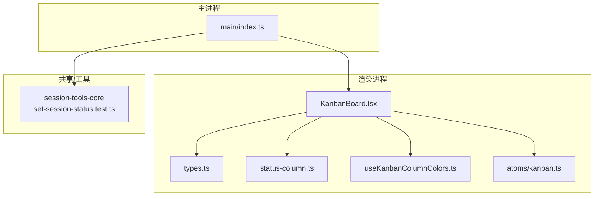
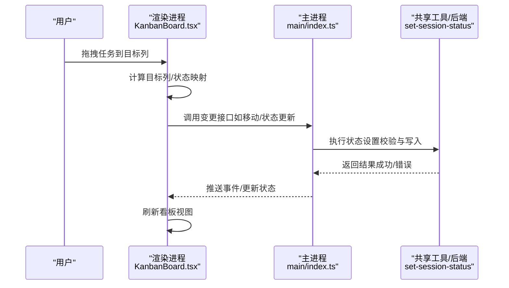
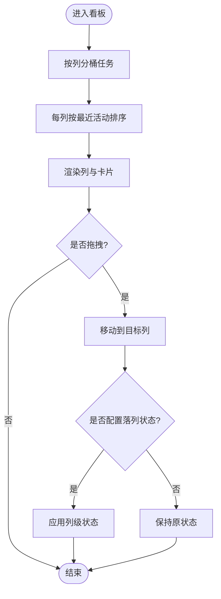
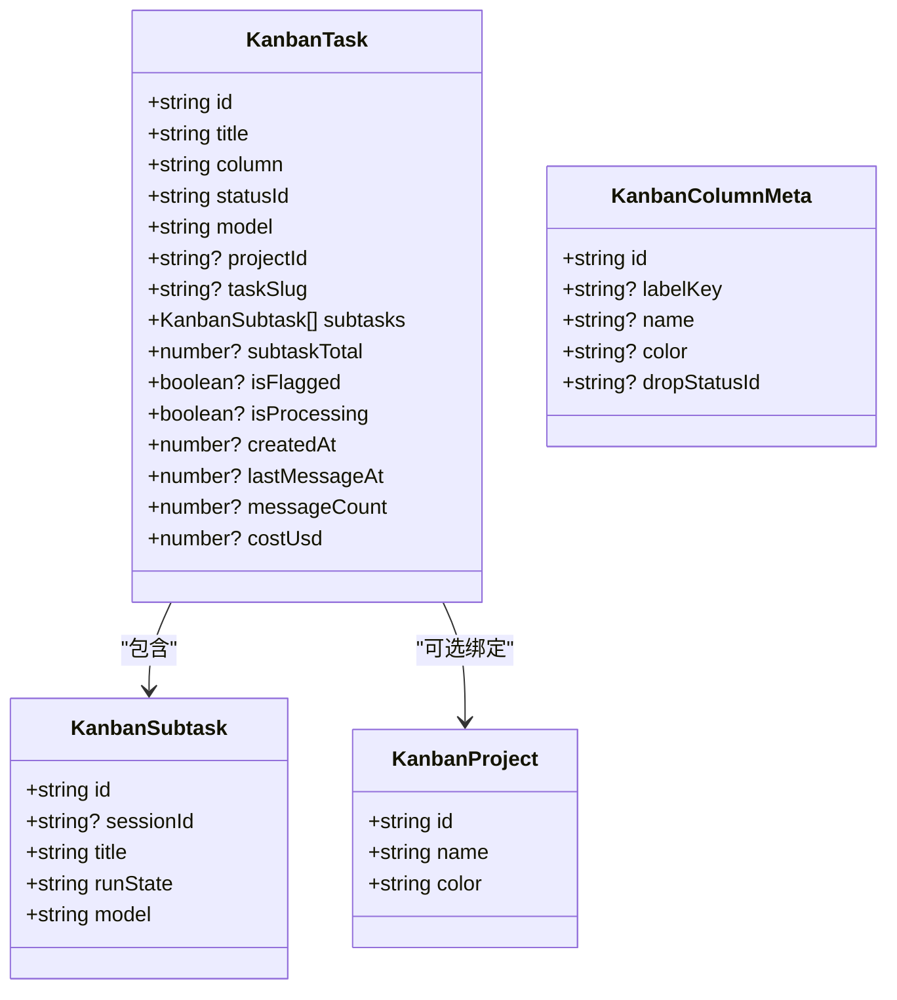
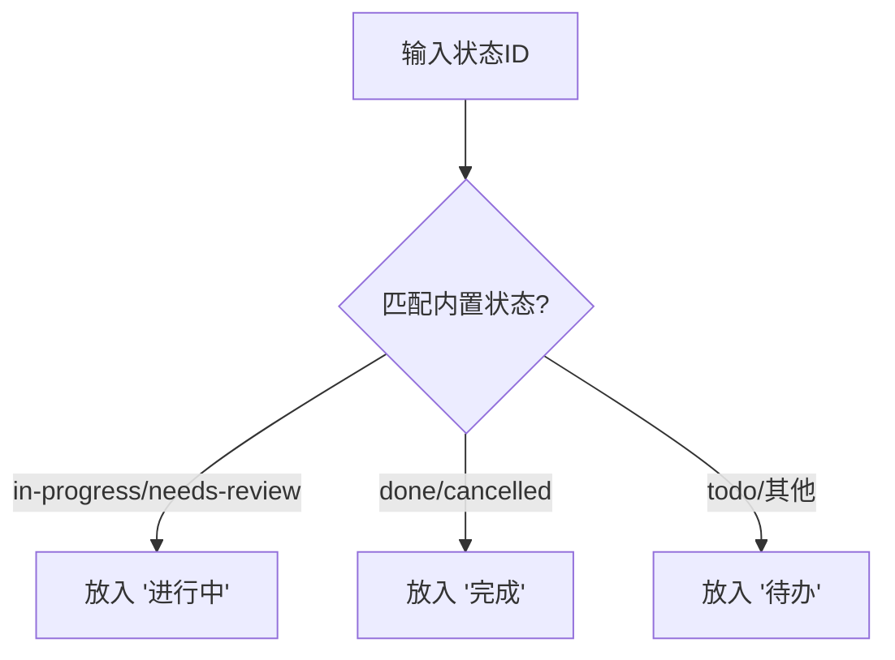
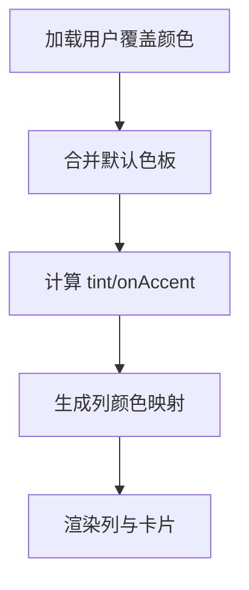
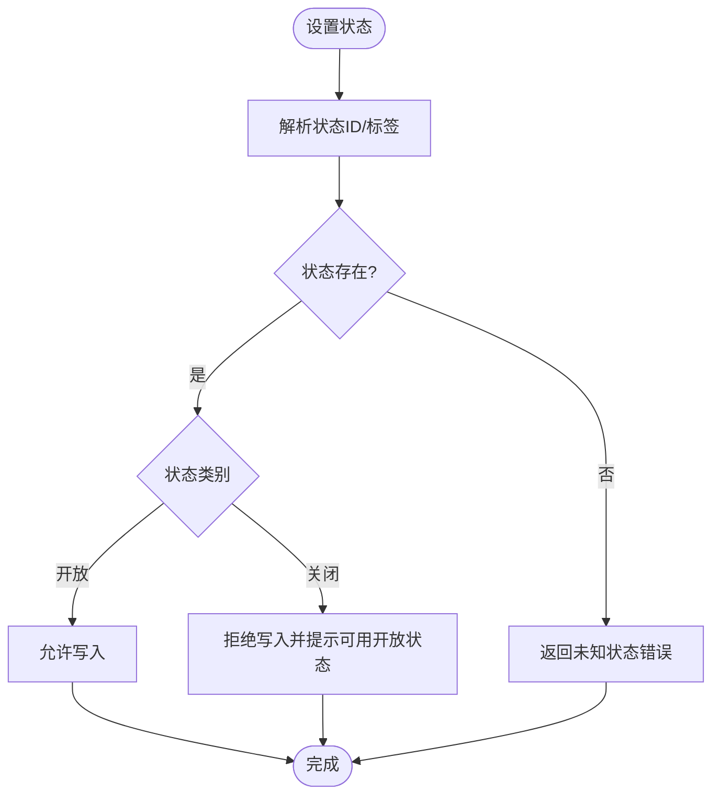
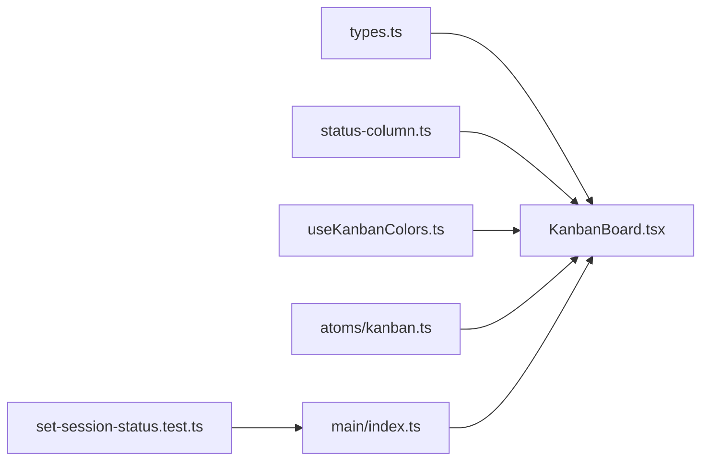

# 看板任务板系统

<cite>
**本文引用的文件**
- [README.md](file://README.md)
- [package.json](file://package.json)
- [apps/electron/src/main/index.ts](file://apps/electron/src/main/index.ts)
- [apps/electron/src/renderer/atoms/kanban.ts](file://apps/electron/src/renderer/atoms/kanban.ts)
- [apps/electron/src/renderer/components/app-shell/kanban/types.ts](file://apps/electron/src/renderer/components/app-shell/kanban/types.ts)
- [apps/electron/src/renderer/components/app-shell/kanban/KanbanBoard.tsx](file://apps/electron/src/renderer/components/app-shell/kanban/KanbanBoard.tsx)
- [apps/electron/src/renderer/components/app-shell/kanban/status-column.ts](file://apps/electron/src/renderer/components/app-shell/kanban/status-column.ts)
- [apps/electron/src/renderer/hooks/useKanbanColumnColors.ts](file://apps/electron/src/renderer/hooks/useKanbanColumnColors.ts)
- [packages/session-tools-core/src/handlers/set-session-status.test.ts](file://packages/session-tools-core/src/handlers/set-session-status.test.ts)
</cite>

## 目录
1. [简介](#简介)
2. [项目结构](#项目结构)
3. [核心组件](#核心组件)
4. [架构总览](#架构总览)
5. [详细组件分析](#详细组件分析)
6. [依赖关系分析](#依赖关系分析)
7. [性能考量](#性能考量)
8. [故障排查指南](#故障排查指南)
9. [结论](#结论)
10. [附录](#附录)

## 简介
本仓库中的“看板任务板系统”是桌面应用（Electron）前端的一部分，提供可视化的任务看板视图。它以“列（列头）+ 卡片（任务）”的形式组织会话/任务，支持拖拽移动、按项目过滤、状态徽章显示、子任务编排与运行、以及列级自动落列状态等能力。该看板与后端服务通过事件处理器和 RPC 通道协作，实现实时状态更新与持久化。

## 项目结构
看板任务板系统主要位于 Electron 渲染进程的前端代码中，围绕以下关键目录与文件组织：
- 原子状态（Jotai）：用于看板视图状态、列颜色、活动脉冲开关、编辑器目标等
- 看板 UI 组件：看板容器、列、任务卡片、状态徽章、子任务进度等
- 类型定义：看板任务、子任务、项目、列元数据、模型选项等
- 默认列与状态映射：内置三列及状态到列的默认放置规则
- 列颜色钩子：合并用户自定义颜色与默认色板，生成亮/暗主题适配的配色方案
- 后端集成：主进程初始化服务端、消息网关、RPC 通道；事件处理器驱动看板状态更新

图表来源
- [apps/electron/src/renderer/components/app-shell/kanban/KanbanBoard.tsx:1-218](file://apps/electron/src/renderer/components/app-shell/kanban/KanbanBoard.tsx#L1-L218)
- [apps/electron/src/renderer/components/app-shell/kanban/types.ts:1-131](file://apps/electron/src/renderer/components/app-shell/kanban/types.ts#L1-L131)
- [apps/electron/src/renderer/components/app-shell/kanban/status-column.ts:1-39](file://apps/electron/src/renderer/components/app-shell/kanban/status-column.ts#L1-L39)
- [apps/electron/src/renderer/hooks/useKanbanColumnColors.ts:1-51](file://apps/electron/src/renderer/hooks/useKanbanColumnColors.ts#L1-L51)
- [apps/electron/src/renderer/atoms/kanban.ts:1-51](file://apps/electron/src/renderer/atoms/kanban.ts#L1-L51)
- [apps/electron/src/main/index.ts:1-800](file://apps/electron/src/main/index.ts#L1-L800)
- [packages/session-tools-core/src/handlers/set-session-status.test.ts:1-62](file://packages/session-tools-core/src/handlers/set-session-status.test.ts#L1-L62)

章节来源
- [README.md:1-640](file://README.md#L1-L640)
- [package.json:1-214](file://package.json#L1-L214)

## 核心组件
- 看板容器与交互：负责列渲染、任务分桶、拖拽移动、新建任务入口、列编辑（重命名/改色/增删列）
- 任务与子任务：任务包含标题、列位置、状态、项目绑定、子任务列表、运行状态、成本与消息计数等
- 列与状态映射：内置三列（待办、进行中、完成），并提供状态到列的默认放置规则
- 列颜色系统：基于 Jotai 存储的用户偏好覆盖默认色板，生成亮/暗主题适配的配色
- 状态设置工具：后端侧的状态设置校验（开放/关闭状态保护）

章节来源
- [apps/electron/src/renderer/components/app-shell/kanban/KanbanBoard.tsx:1-218](file://apps/electron/src/renderer/components/app-shell/kanban/KanbanBoard.tsx#L1-L218)
- [apps/electron/src/renderer/components/app-shell/kanban/types.ts:1-131](file://apps/electron/src/renderer/components/app-shell/kanban/types.ts#L1-L131)
- [apps/electron/src/renderer/components/app-shell/kanban/status-column.ts:1-39](file://apps/electron/src/renderer/components/app-shell/kanban/status-column.ts#L1-L39)
- [apps/electron/src/renderer/hooks/useKanbanColumnColors.ts:1-51](file://apps/electron/src/renderer/hooks/useKanbanColumnColors.ts#L1-L51)
- [apps/electron/src/renderer/atoms/kanban.ts:1-51](file://apps/electron/src/renderer/atoms/kanban.ts#L1-L51)
- [packages/session-tools-core/src/handlers/set-session-status.test.ts:1-62](file://packages/session-tools-core/src/handlers/set-session-status.test.ts#L1-L62)

## 架构总览
看板任务板系统采用“渲染进程 UI + 主进程服务桥接 + 共享工具/后端”的分层架构：
- 渲染进程：React 组件负责展示与交互，使用 Jotai 管理本地视图状态与偏好
- 主进程：初始化并启动嵌入式服务器、消息网关、RPC 通道，将事件分发到各客户端
- 共享工具：提供状态设置、权限、配置等通用能力，确保跨进程一致性

图表来源
- [apps/electron/src/renderer/components/app-shell/kanban/KanbanBoard.tsx:1-218](file://apps/electron/src/renderer/components/app-shell/kanban/KanbanBoard.tsx#L1-L218)
- [apps/electron/src/main/index.ts:1-800](file://apps/electron/src/main/index.ts#L1-L800)
- [packages/session-tools-core/src/handlers/set-session-status.test.ts:1-62](file://packages/session-tools-core/src/handlers/set-session-status.test.ts#L1-L62)

## 详细组件分析

### 看板容器 KanbanBoard
- 职责：渲染列与任务卡片，处理拖拽移动、新建任务、列编辑（重命名/改色/增删列）、子任务操作入口
- 关键点：
  - 任务按列分桶，未知列回退到第一列；每列内按创建时间或最后活动时间倒序
  - 拖拽仅改变物理列位置，不直接修改状态；可配置“落列时自动应用状态”
  - 支持为每个列选择“落列状态”，并在列头提供选择器
  - 支持单项目编辑模式下的列增删改

图表来源
- [apps/electron/src/renderer/components/app-shell/kanban/KanbanBoard.tsx:1-218](file://apps/electron/src/renderer/components/app-shell/kanban/KanbanBoard.tsx#L1-L218)

章节来源
- [apps/electron/src/renderer/components/app-shell/kanban/KanbanBoard.tsx:1-218](file://apps/electron/src/renderer/components/app-shell/kanban/KanbanBoard.tsx#L1-L218)

### 类型与数据模型
- KanbanTask：任务实体，包含 id、标题、列、状态、项目、子任务、成本、消息数等
- KanbanSubtask：子任务，包含运行状态、模型路由等
- KanbanProject：项目信息，含名称与强调色
- KanbanColumnMeta：列元数据，支持内置列标签键或自定义列名、颜色、落列状态
- KanbanModelProviderGroup：模型提供者分组，供子任务编排选择模型

图表来源
- [apps/electron/src/renderer/components/app-shell/kanban/types.ts:1-131](file://apps/electron/src/renderer/components/app-shell/kanban/types.ts#L1-L131)

章节来源
- [apps/electron/src/renderer/components/app-shell/kanban/types.ts:1-131](file://apps/electron/src/renderer/components/app-shell/kanban/types.ts#L1-L131)

### 默认列与状态映射
- 内置三列：待办、进行中、完成
- 状态到列的默认放置：进行中/需评审→进行中；完成/取消→完成；其他→待办

图表来源
- [apps/electron/src/renderer/components/app-shell/kanban/status-column.ts:1-39](file://apps/electron/src/renderer/components/app-shell/kanban/status-column.ts#L1-L39)

章节来源
- [apps/electron/src/renderer/components/app-shell/kanban/status-column.ts:1-39](file://apps/electron/src/renderer/components/app-shell/kanban/status-column.ts#L1-L39)

### 列颜色系统
- 使用 Jotai 的 atomWithStorage 持久化用户自定义列颜色
- 钩子合并用户覆盖与默认色板，生成 solid/tint/onAccent 三色集，适配亮/暗主题
- 支持在设置中重置某列颜色或删除键以恢复默认

图表来源
- [apps/electron/src/renderer/hooks/useKanbanColumnColors.ts:1-51](file://apps/electron/src/renderer/hooks/useKanbanColumnColors.ts#L1-L51)
- [apps/electron/src/renderer/atoms/kanban.ts:1-51](file://apps/electron/src/renderer/atoms/kanban.ts#L1-L51)

章节来源
- [apps/electron/src/renderer/hooks/useKanbanColumnColors.ts:1-51](file://apps/electron/src/renderer/hooks/useKanbanColumnColors.ts#L1-L51)
- [apps/electron/src/renderer/atoms/kanban.ts:1-51](file://apps/electron/src/renderer/atoms/kanban.ts#L1-L51)

### 状态设置与校验（后端侧）
- 提供状态设置工具，支持开放/关闭状态保护：禁止从开放状态直接跳转到关闭状态
- 测试覆盖了合法开放状态、非法关闭状态、未知状态等场景

图表来源
- [packages/session-tools-core/src/handlers/set-session-status.test.ts:1-62](file://packages/session-tools-core/src/handlers/set-session-status.test.ts#L1-L62)

章节来源
- [packages/session-tools-core/src/handlers/set-session-status.test.ts:1-62](file://packages/session-tools-core/src/handlers/set-session-status.test.ts#L1-L62)

### 主进程与服务桥接
- 主进程初始化嵌入服务器、消息网关、RPC 通道，并将事件分发到渲染进程
- 支持远程服务器模式（thin client），渲染进程仅负责 UI，逻辑在远端执行
- 提供 IPC 桥接、通知、代理、深链处理等能力

章节来源
- [apps/electron/src/main/index.ts:1-800](file://apps/electron/src/main/index.ts#L1-L800)

## 依赖关系分析
- 渲染进程看板组件依赖：
  - 类型定义（types.ts）
  - 默认列与状态映射（status-column.ts）
  - 列颜色钩子（useKanbanColumnColors.ts）
  - Jotai 原子（atoms/kanban.ts）
- 主进程依赖：
  - 服务引导与 RPC 通道（main/index.ts）
  - 共享工具（如状态设置校验）
- 外部依赖：
  - React、Tailwind、shadcn/ui、@dnd-kit 等

图表来源
- [apps/electron/src/renderer/components/app-shell/kanban/KanbanBoard.tsx:1-218](file://apps/electron/src/renderer/components/app-shell/kanban/KanbanBoard.tsx#L1-L218)
- [apps/electron/src/renderer/components/app-shell/kanban/types.ts:1-131](file://apps/electron/src/renderer/components/app-shell/kanban/types.ts#L1-L131)
- [apps/electron/src/renderer/components/app-shell/kanban/status-column.ts:1-39](file://apps/electron/src/renderer/components/app-shell/kanban/status-column.ts#L1-L39)
- [apps/electron/src/renderer/hooks/useKanbanColumnColors.ts:1-51](file://apps/electron/src/renderer/hooks/useKanbanColumnColors.ts#L1-L51)
- [apps/electron/src/renderer/atoms/kanban.ts:1-51](file://apps/electron/src/renderer/atoms/kanban.ts#L1-L51)
- [apps/electron/src/main/index.ts:1-800](file://apps/electron/src/main/index.ts#L1-L800)
- [packages/session-tools-core/src/handlers/set-session-status.test.ts:1-62](file://packages/session-tools-core/src/handlers/set-session-status.test.ts#L1-L62)

## 性能考量
- 看板渲染优化：
  - 使用 useMemo 对任务分桶与排序进行缓存，避免频繁重排
  - 拖拽使用 @dnd-kit 的碰撞检测与传感器，减少不必要的重绘
- 状态持久化：
  - 列颜色与偏好使用 atomWithStorage，避免每次启动重新计算
- 事件处理：
  - 主进程通过消息网关与 RPC 通道批量推送事件，降低渲染压力
- 大响应处理：
  - 后端对大型工具响应进行摘要，减少前端负载（见 README 的大响应处理说明）

[本节为通用指导，无需具体文件引用]

## 故障排查指南
- 连接与认证：
  - 检查环境变量 CRAFT_SERVER_URL 与 CRAFT_SERVER_TOKEN 是否正确
  - 若使用自签名证书，确认已启用 TLS 或在开发环境接受证书
- 日志定位：
  - 启用调试模式查看主进程日志路径与内容
  - 关注消息网关日志，排查事件分发问题
- 常见问题：
  - 拖拽无效：检查传感器激活阈值与元素是否标记为不可拖拽
  - 状态设置失败：确认状态是否为开放状态，避免直接写入关闭状态
  - 列颜色未生效：检查 localStorage 中是否存在对应键值，必要时重置

章节来源
- [README.md:1-640](file://README.md#L1-L640)

## 结论
看板任务板系统通过清晰的组件分层、类型化数据模型与灵活的列/状态映射，提供了直观的任务管理能力。结合主进程的服务桥接与共享工具的状态校验，实现了稳定可靠的端到端工作流。未来可在列自定义、状态流转规则、子任务编排等方面继续扩展。

[本节为总结性内容，无需具体文件引用]

## 附录
- 快速开始与安装：参考 README 的安装与构建说明
- 技术栈：Electron、React、Tailwind、shadcn/ui、@dnd-kit、Jotai、Bun 等

章节来源
- [README.md:1-640](file://README.md#L1-L640)
- [package.json:1-214](file://package.json#L1-L214)