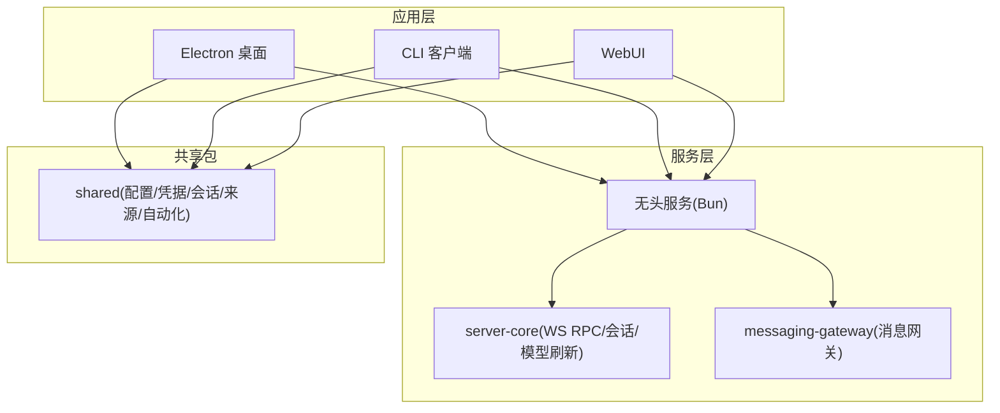
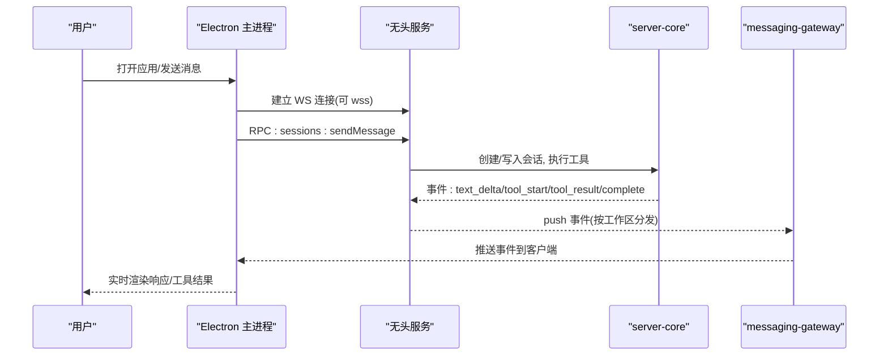
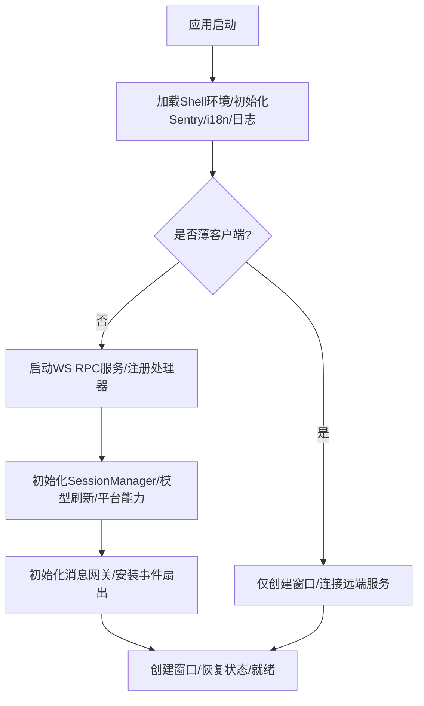
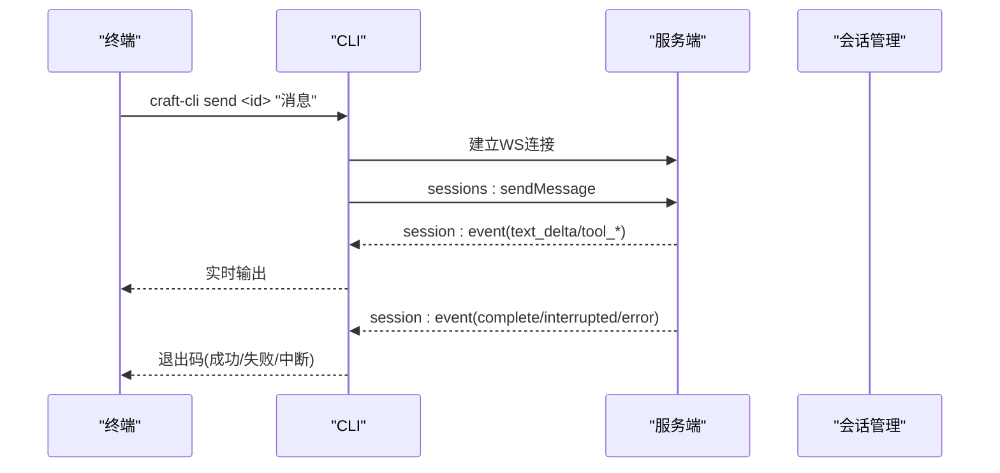
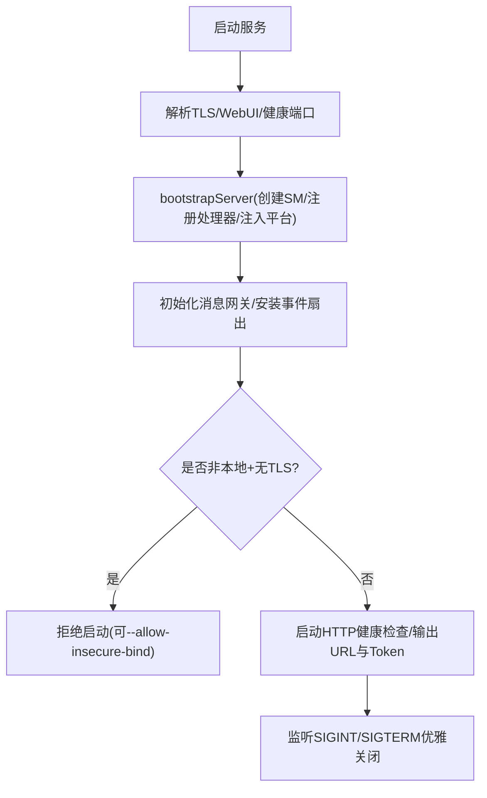
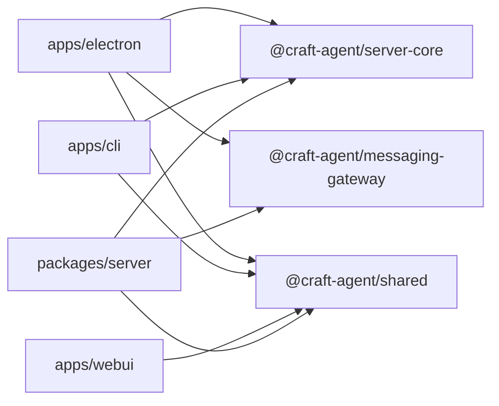

# 项目管理系统

<cite>
**本文引用的文件**
- [README.md](file://README.md)
- [package.json](file://package.json)
- [apps/electron/package.json](file://apps/electron/package.json)
- [apps/cli/package.json](file://apps/cli/package.json)
- [apps/webui/package.json](file://apps/webui/package.json)
- [packages/server/package.json](file://packages/server/package.json)
- [packages/shared/package.json](file://packages/shared/package.json)
- [apps/electron/src/main/index.ts](file://apps/electron/src/main/index.ts)
- [apps/cli/src/index.ts](file://apps/cli/src/index.ts)
- [packages/server/src/index.ts](file://packages/server/src/index.ts)
</cite>

## 目录
1. [简介](#简介)
2. [项目结构](#项目结构)
3. [核心组件](#核心组件)
4. [架构总览](#架构总览)
5. [详细组件分析](#详细组件分析)
6. [依赖关系分析](#依赖关系分析)
7. [性能考虑](#性能考虑)
8. [故障排查指南](#故障排查指南)
9. [结论](#结论)
10. [附录](#附录)

## 简介
本项目是一个“智能体原生”的项目与协作系统，提供桌面端、命令行客户端与无头服务器三种形态。它支持多会话管理、多 LLM 提供商接入、MCP/REST/本地源集成、权限模式、后台任务、动态状态、主题、自动化事件驱动等能力。用户可通过 Electron 桌面应用、CLI 或远程 WebUI 进行交互，后端通过 WebSocket RPC 提供服务。

## 项目结构
仓库采用 monorepo 组织：
- apps：应用层
  - electron：Electron 桌面应用（主进程 + 渲染进程）
  - cli：终端客户端，连接运行中的服务端
  - webui：Web 界面（可嵌入服务端端口）
- packages：共享包
  - server：独立无头服务（Bun 运行时）
  - shared：业务逻辑（配置、凭据、会话、来源、技能、自动化等）
  - server-core、messaging-gateway、session-tools-core 等：基础设施与服务编排
- scripts：构建与发布脚本

图表来源
- [apps/electron/src/main/index.ts:1-120](file://apps/electron/src/main/index.ts#L1-L120)
- [packages/server/src/index.ts:1-120](file://packages/server/src/index.ts#L1-L120)
- [packages/shared/package.json:14-68](file://packages/shared/package.json#L14-L68)

章节来源
- [README.md:347-369](file://README.md#L347-L369)
- [package.json:18-31](file://package.json#L18-L31)

## 核心组件
- 桌面应用（Electron）
  - 负责窗口管理、菜单、通知、代理、深链、缩略图协议、平台能力注入、内置资源路径、Sentry 错误上报、i18n 初始化、自动更新、浏览器面板管理等。
  - 启动时可选择“薄客户端”模式（仅渲染 UI，逻辑在远端），或内嵌服务模式（在同一进程中启动 WS RPC 服务）。
- CLI 客户端
  - 通过 WebSocket 连接服务端，提供 ping/health/workspaces/sessions/send/run/invoke/listen 等命令，支持流式输出、JSON 输出、本地临时服务器自举。
- 无头服务（Bun）
  - 暴露 WS RPC 接口，可选启用 TLS/wss；可选挂载 WebUI；支持健康检查 HTTP 端口；安全限制非本地绑定需 TLS；支持消息网关与 WhatsApp 工作进程。
- 共享包
  - 提供跨进程/跨平台一致的会话、配置、凭据、来源、技能、自动化、标签、视图、搜索、工具名、品牌、特性开关等能力。

章节来源
- [apps/electron/src/main/index.ts:1-120](file://apps/electron/src/main/index.ts#L1-L120)
- [apps/cli/src/index.ts:1-160](file://apps/cli/src/index.ts#L1-L160)
- [packages/server/src/index.ts:1-120](file://packages/server/src/index.ts#L1-L120)
- [packages/shared/package.json:14-68](file://packages/shared/package.json#L14-L68)

## 架构总览
系统由三类入口组成：桌面应用、CLI、WebUI，均通过 WS RPC 与无头服务通信。服务内部基于 server-core 提供会话管理、模型刷新、RPC 处理器注册、事件分发；messaging-gateway 将事件扇出到各工作区；shared 提供统一业务能力。

图表来源
- [apps/electron/src/main/index.ts:620-760](file://apps/electron/src/main/index.ts#L620-L760)
- [packages/server/src/index.ts:166-250](file://packages/server/src/index.ts#L166-L250)
- [packages/server/src/index.ts:257-318](file://packages/server/src/index.ts#L257-L318)

## 详细组件分析

### 桌面应用（Electron 主进程）
- 启动流程要点
  - 加载 Shell 环境、初始化 Sentry、i18n、日志、代理、自定义 URL Scheme、缩略图协议、深链处理。
  - 根据环境变量决定“薄客户端”或“内嵌服务”模式；在非薄客户端模式下启动 WS RPC 服务并注册处理器。
  - 初始化窗口管理器、通知、浏览器面板、平台能力注入、模型刷新服务、消息网关。
  - 将 sessionManager 的事件 sink 包装为 messaging gateway 的 fan-out，实现工作区级事件分发。
- 关键能力
  - 窗口与状态持久化、多实例开发支持、Dock 徽标、自动更新、VC++ 依赖检测、PowerShell 验证器根路径设置。
  - 内置资源路径解析（uv、bun、文档、工具图标、主题等），确保打包与开发一致。

图表来源
- [apps/electron/src/main/index.ts:1-120](file://apps/electron/src/main/index.ts#L1-L120)
- [apps/electron/src/main/index.ts:455-760](file://apps/electron/src/main/index.ts#L455-L760)

章节来源
- [apps/electron/src/main/index.ts:1-120](file://apps/electron/src/main/index.ts#L1-L120)
- [apps/electron/src/main/index.ts:455-760](file://apps/electron/src/main/index.ts#L455-L760)

### CLI 客户端
- 功能概览
  - 参数解析与环境变量回退；自动工作区解析；多种命令（ping/health/versions/workspaces/sessions/sources/session create/session messages/session delete/send/cancel/invoke/listen/run/validate）。
  - 流式订阅 session:event，支持文本增量、工具开始/结果、完成/中断/错误事件；支持 JSON 输出与 spinner。
  - run 子命令可自举本地服务器、自动配置 LLM 连接、创建工作区/会话、发送提示并等待完成。
- 典型调用序列（send）

图表来源
- [apps/cli/src/index.ts:247-470](file://apps/cli/src/index.ts#L247-L470)

章节来源
- [apps/cli/src/index.ts:1-160](file://apps/cli/src/index.ts#L1-L160)
- [apps/cli/src/index.ts:247-470](file://apps/cli/src/index.ts#L247-L470)

### 无头服务（Bun）
- 启动与安全
  - 支持 TLS/wss；若绑定非本地地址且未启用 TLS，默认拒绝启动（可显式覆盖但不推荐）。
  - 可选启用 WebUI（同端口提供 HTTP 静态页面与 WS 升级），支持 JWT Cookie 校验。
  - 可选健康检查 HTTP 端口；打印服务 URL 与 Token。
- 服务编排
  - bootstrapServer 创建 SessionManager、注册 RPC 处理器、注入平台能力、初始化模型刷新、安装事件 sink。
  - 消息网关初始化并安装工作区级 fan-out；支持 WhatsApp 工作进程。
  - 优雅关闭：释放 WebUI、健康检查、消息网关、停止服务。

图表来源
- [packages/server/src/index.ts:93-152](file://packages/server/src/index.ts#L93-L152)
- [packages/server/src/index.ts:166-250](file://packages/server/src/index.ts#L166-L250)
- [packages/server/src/index.ts:304-359](file://packages/server/src/index.ts#L304-L359)

章节来源
- [packages/server/src/index.ts:1-120](file://packages/server/src/index.ts#L1-L120)
- [packages/server/src/index.ts:166-250](file://packages/server/src/index.ts#L166-L250)
- [packages/server/src/index.ts:304-359](file://packages/server/src/index.ts#L304-L359)

### 共享包（业务与协议）
- 导出模块覆盖 agent、auth、config、credentials、sessions、sources、skills、automations、labels、views、search、tools、mentions、i18n、resources 等。
- 作为桌面、CLI、服务的共同基础，保证跨进程行为一致。

章节来源
- [packages/shared/package.json:14-68](file://packages/shared/package.json#L14-L68)

## 依赖关系分析
- 应用与包的耦合
  - Electron 依赖 @craft-agent/server-core、@craft-agent/messaging-gateway、@craft-agent/shared、@craft-agent/ui 等。
  - CLI 依赖 @craft-agent/shared、@craft-agent/server-core。
  - WebUI 依赖 @craft-agent/shared、@craft-agent/ui。
  - 无头服务依赖 @craft-agent/server-core、@craft-agent/messaging-gateway、@craft-agent/shared。
- 版本与工作区
  - 根 package.json 定义 workspaces 包含 packages/* 与 apps/*，统一版本管理与脚本。

图表来源
- [apps/electron/package.json:38-43](file://apps/electron/package.json#L38-L43)
- [apps/cli/package.json:16-18](file://apps/cli/package.json#L16-L18)
- [apps/webui/package.json:13-15](file://apps/webui/package.json#L13-L15)
- [packages/server/package.json:27-31](file://packages/server/package.json#L27-L31)

章节来源
- [package.json:18-31](file://package.json#L18-L31)
- [apps/electron/package.json:38-43](file://apps/electron/package.json#L38-L43)
- [apps/cli/package.json:16-18](file://apps/cli/package.json#L16-L18)
- [apps/webui/package.json:13-15](file://apps/webui/package.json#L13-L15)
- [packages/server/package.json:27-31](file://packages/server/package.json#L27-L31)

## 性能考虑
- 大响应摘要：工具响应超过阈值时自动摘要，减少传输与渲染压力。
- 流式输出：CLI 与桌面均支持增量文本与工具事件流式展示，提升交互体验。
- 资源路径与二进制：打包时预置 uv/bun 与工具脚本，避免首次下载开销。
- 事件扇出：通过消息网关按工作区分发事件，降低单点负载。
- 模型刷新：按需拉取模型元数据，结合凭据缓存减少重复请求。

[本节为通用指导，不直接分析具体文件]

## 故障排查指南
- 调试与日志
  - 桌面应用支持 debug 模式，日志输出至平台指定目录；Sentry 在生产构建中启用并过滤敏感信息。
  - 无头服务支持 CRAFT_DEBUG 开启调试日志；健康检查端口可用于外部探测。
- 常见问题定位
  - 证书问题：薄客户端连接远端 wss 时，允许对目标 origin 放宽证书校验。
  - 依赖缺失：Windows 上缺少 VC++ 运行时会导致文档转换工具崩溃，应用会提示并给出下载链接。
  - 非本地绑定：无头服务在非本地地址下必须启用 TLS，否则拒绝启动。
  - 消息冲突：可通过环境变量禁用消息网关以避免多进程争用。

章节来源
- [apps/electron/src/main/index.ts:20-59](file://apps/electron/src/main/index.ts#L20-L59)
- [apps/electron/src/main/index.ts:247-282](file://apps/electron/src/main/index.ts#L247-L282)
- [apps/electron/src/main/index.ts:553-584](file://apps/electron/src/main/index.ts#L553-L584)
- [packages/server/src/index.ts:304-341](file://packages/server/src/index.ts#L304-L341)
- [packages/server/src/index.ts:262-278](file://packages/server/src/index.ts#L262-L278)

## 结论
该项目以“智能体原生”理念构建，提供桌面、CLI、WebUI 三端一致体验，并通过无头服务集中承载会话、工具执行与模型调用。其模块化设计使前后端解耦，消息网关与工作区机制支撑多租户与并发场景。配合丰富的来源集成、权限模式与自动化能力，适合团队协作与复杂工作流。

[本节为总结性内容，不直接分析具体文件]

## 附录
- 快速开始
  - 桌面：安装后选择 LLM 连接、创建工作区、连接来源、开始对话。
  - 无头服务：生成 Token 并启动服务，桌面或 CLI 连接使用。
  - CLI：通过 flags 或环境变量连接，支持 run 自举模式。
- 环境变量参考
  - 服务端：CRAFT_SERVER_TOKEN、CRAFT_RPC_HOST、CRAFT_RPC_PORT、CRAFT_RPC_TLS_*、CRAFT_DEBUG、CRAFT_WEBUI_* 等。
  - 客户端：CRAFT_SERVER_URL、CRAFT_SERVER_TOKEN、LLM_* 系列等。

章节来源
- [README.md:154-246](file://README.md#L154-L246)
- [README.md:248-345](file://README.md#L248-L345)
- [packages/server/src/index.ts:1-26](file://packages/server/src/index.ts#L1-L26)