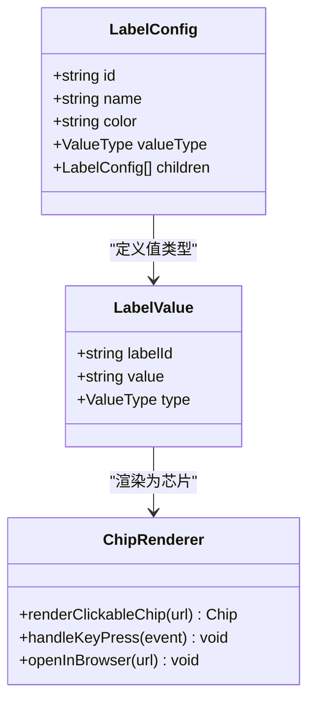
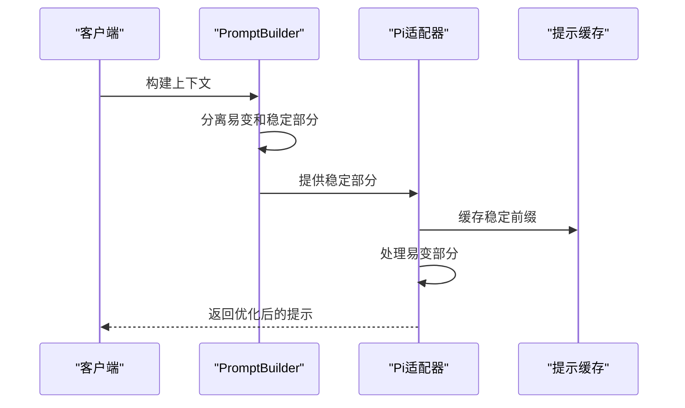
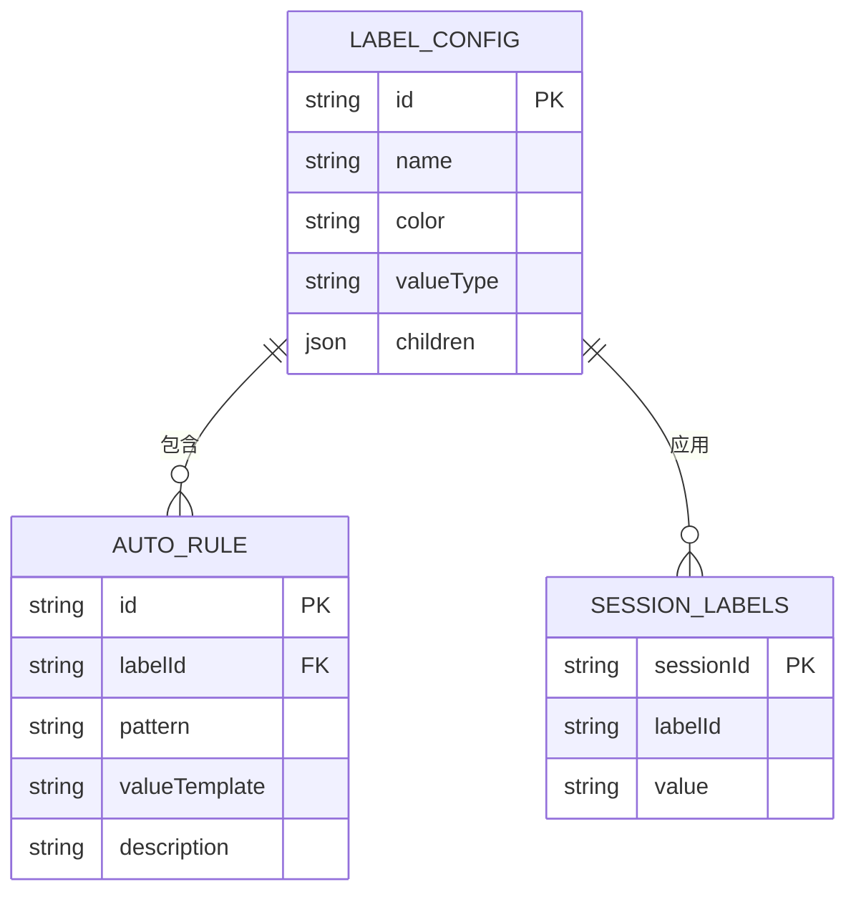
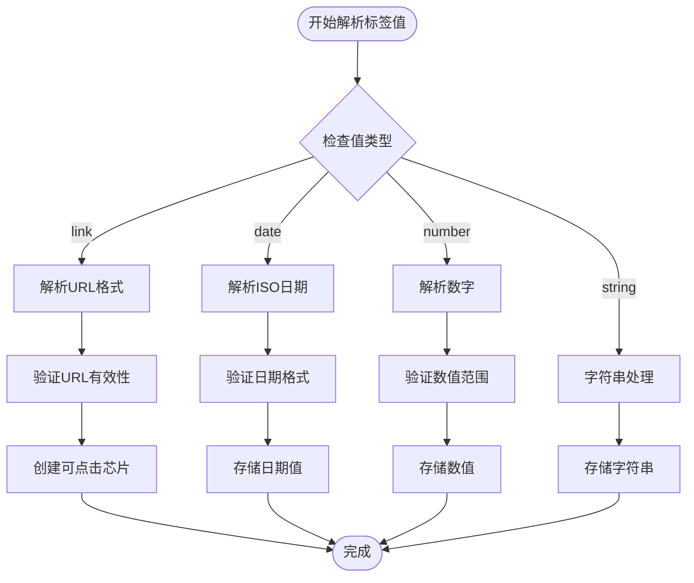
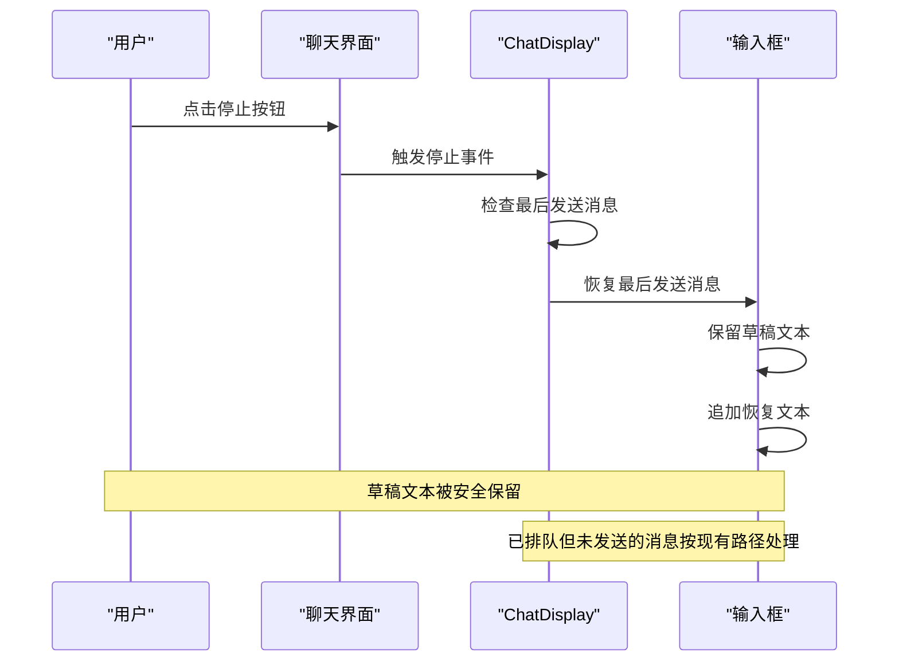
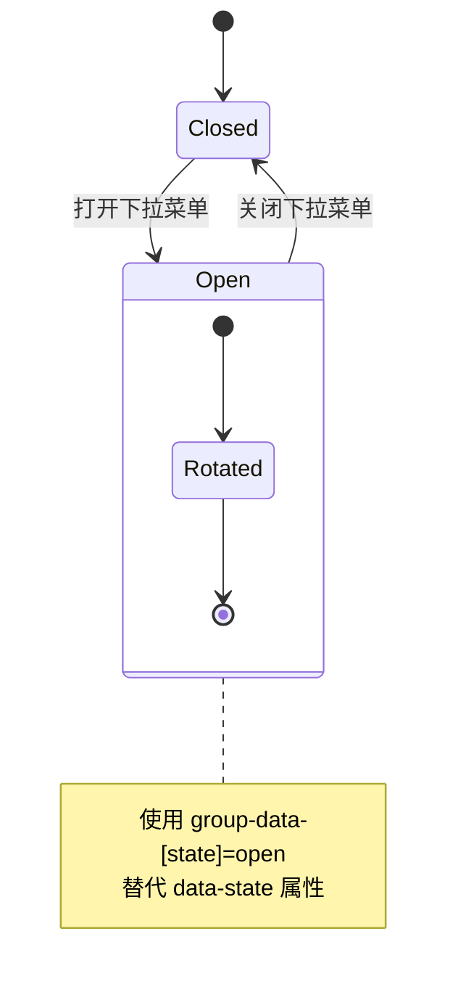
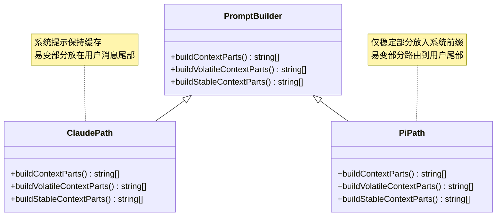
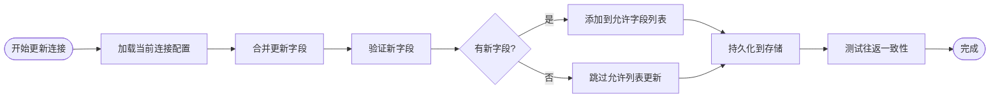

# 版本发布说明 0.10.2

<cite>
**本文档引用的文件**
- [0.10.2.md](file://apps/electron/resources/release-notes/0.10.2.md)
- [labels.md](file://apps/electron/resources/docs/labels.md)
- [prompt-builder.ts](file://packages/shared/src/agent/core/prompt-builder.ts)
- [pi-agent.ts](file://packages/shared/src/agent/pi-agent.ts)
- [llm-connections.ts](file://packages/server-core/src/handlers/rpc/llm-connections.ts)
- [storage.ts](file://packages/shared/src/config/storage.ts)
- [ChatDisplay.tsx](file://apps/electron/src/renderer/components/app-shell/ChatDisplay.tsx)
- [ChatPage.tsx](file://apps/electron/src/renderer/pages/ChatPage.tsx)
- [package.json](file://apps/cli/package.json)
- [package.json](file://apps/electron/package.json)
</cite>

## 目录
1. [简介](#简介)
2. [版本概览](#版本概览)
3. [核心功能特性](#核心功能特性)
4. [详细功能说明](#详细功能说明)
5. [技术架构分析](#技术架构分析)
6. [用户界面更新](#用户界面更新)
7. [性能优化改进](#性能优化改进)
8. [已知问题与解决方案](#已知问题与解决方案)
9. [升级指南](#升级指南)
10. [总结](#总结)

## 简介

Craft Agents 0.10.2 是一个重要的功能增强版本，主要专注于标签系统扩展、Anthropic 账户可见性改进以及提示缓存机制的重大优化。本版本在保持向后兼容性的同时，引入了多项用户体验改进和性能优化。

## 版本概览

**版本号**: 0.10.2  
**发布时间**: 2024年  
**主要目标**: 增强标签系统功能、改进 Anthropic 集成体验、优化提示缓存性能

### 主要变更类别

- **新功能**: 标签链接值类型支持
- **改进**: Anthropic 账户身份显示
- **修复**: 提示缓存机制优化
- **界面**: 下拉菜单旋转动画修复

## 核心功能特性

### 1. 标签链接值类型支持

版本 0.10.2 引入了全新的标签链接值类型，为标签系统增加了更丰富的交互能力。

#### 功能特点
- 支持在标签值中存储 URL 链接
- 链接值以可点击芯片形式渲染
- 自动剥离 URL 协议用于显示
- 键盘可访问的"打开链接"操作
- 在会话列表、聊天显示和聊天输入徽章中一致显示

#### 技术实现


**图表来源**
- [labels.md:90-140](file://apps/electron/resources/docs/labels.md#L90-L140)

**章节来源**
- [0.10.2.md:5](file://apps/electron/resources/release-notes/0.10.2.md#L5)
- [labels.md:126-140](file://apps/electron/resources/docs/labels.md#L126-L140)

### 2. Anthropic 账户身份显示

改进了 Anthropic Claude OAuth 连接的身份验证体验，提供更透明的账户信息展示。

#### 新增功能
- 显示真实的 Anthropic 身份信息（邮箱 · 组织）
- 捕获令牌交换响应中的身份信息
- 持久化连接记录中的身份字段
- 当同一工作区中的多个连接解析到相同账户时显示琥珀色警告

#### 技术修复
修复了 `updateLlmConnection` 函数的一个关键缺陷，该函数之前从硬编码字段白名单重建连接，会在每次保存时静默丢弃任何未列出的字段。

**章节来源**
- [0.10.2.md:7](file://apps/electron/resources/release-notes/0.10.2.md#L7)
- [llm-connections.ts:160](file://packages/server-core/src/handlers/rpc/llm-connections.ts#L160)
- [storage.ts:2666](file://packages/shared/src/config/storage.ts#L2666)

### 3. 提示缓存机制优化

针对 Pi AI 适配器的重大性能优化，解决了每轮都会破坏提示缓存的问题。

#### 性能问题
- Pi AI 将易变上下文（分钟精度日期/时间、`session_state`、源状态）折叠到系统提示中
- Pi AI 将系统提示缓存为所有历史记录之前的前缀
- 每次重新标记都会使 `cacheRead` 降至 0（特别是在非 Claude 模型上）

#### 解决方案
通过拆分 `PromptBuilder.buildContextParts` 为 `buildVolatileContextParts` 和 `buildStableContextParts`：



**图表来源**
- [prompt-builder.ts:104](file://packages/shared/src/agent/core/prompt-builder.ts#L104)
- [pi-agent.ts:2017](file://packages/shared/src/agent/pi-agent.ts#L2017)

**章节来源**
- [0.10.2.md:17](file://apps/electron/resources/release-notes/0.10.2.md#L17)
- [prompt-builder.ts:62](file://packages/shared/src/agent/core/prompt-builder.ts#L62)

## 详细功能说明

### 标签系统架构

#### 数据模型设计
标签系统采用嵌套 JSON 树结构，支持层次化组织：



**图表来源**
- [labels.md:66](file://apps/electron/resources/docs/labels.md#L66)
- [labels.md:188](file://apps/electron/resources/docs/labels.md#L188)

#### 值类型处理流程



**图表来源**
- [labels.md:126](file://apps/electron/resources/docs/labels.md#L126)
- [labels.md:139](file://apps/electron/resources/docs/labels.md#L139)

**章节来源**
- [labels.md:108-140](file://apps/electron/resources/docs/labels.md#L108-L140)

### 用户界面交互

#### 聊天输入恢复机制

当用户点击停止按钮时，系统会智能恢复最后发送的消息：



**图表来源**
- [ChatDisplay.tsx:242](file://apps/electron/src/renderer/components/app-shell/ChatDisplay.tsx#L242)
- [ChatPage.tsx:242](file://apps/electron/src/renderer/pages/ChatPage.tsx#L242)

**章节来源**
- [0.10.2.md:9](file://apps/electron/resources/release-notes/0.10.2.md#L9)

### 界面动画修复

修复了接受计划下拉菜单的旋转动画问题：



**图表来源**
- [0.10.2.md:19](file://apps/electron/resources/release-notes/0.10.2.md#L19)

**章节来源**
- [0.10.2.md:19](file://apps/electron/resources/release-notes/0.10.2.md#L19)

## 技术架构分析

### 提示构建器架构

提示构建器采用了分离策略模式来处理不同类型的上下文：



**图表来源**
- [prompt-builder.ts:62](file://packages/shared/src/agent/core/prompt-builder.ts#L62)
- [prompt-builder.ts:104](file://packages/shared/src/agent/core/prompt-builder.ts#L104)
- [prompt-builder.ts:145](file://packages/shared/src/agent/core/prompt-builder.ts#L145)

**章节来源**
- [prompt-builder.ts:62](file://packages/shared/src/agent/core/prompt-builder.ts#L62)
- [prompt-builder.ts:104](file://packages/shared/src/agent/core/prompt-builder.ts#L104)
- [prompt-builder.ts:145](file://packages/shared/src/agent/core/prompt-builder.ts#L145)

### 配置管理系统

LLM 连接配置管理系统的改进：



**图表来源**
- [storage.ts:2666](file://packages/shared/src/config/storage.ts#L2666)
- [llm-connections.ts:245](file://packages/server-core/src/handlers/rpc/llm-connections.ts#L245)

**章节来源**
- [storage.ts:2666](file://packages/shared/src/config/storage.ts#L2666)
- [llm-connections.ts:450](file://packages/server-core/src/handlers/rpc/llm-connections.ts#L450)

## 用户界面更新

### 设置界面改进

设置 → LLM 连接现在显示真实的 Anthropic 身份信息：

- **显示格式**: "邮箱 · 组织"
- **实时捕获**: 从令牌交换响应中获取
- **持久化存储**: 连接记录中保存身份字段
- **冲突检测**: 同一工作区内的重复账户显示琥珀色警告

### 标签界面增强

标签系统在多个界面中的一致性改进：

- **会话列表**: 标签芯片显示
- **聊天显示**: 值类型感知的渲染
- **聊天输入**: 徽章中的链接值显示
- **侧边栏**: 层级化标签树导航

## 性能优化改进

### 提示缓存优化

针对不同 AI 服务提供商的缓存策略优化：

#### Claude Provider 缓存策略
- 系统提示保持完全可缓存
- 所有易变上下文保留在用户消息尾部
- 字节级兼容性保持不变

#### Pi Provider 缓存策略
- 仅稳定块（工作区能力、工作目录）放入缓存前缀
- 易变块路由到用户消息尾部
- 避免每分钟重新标记导致的缓存失效

**性能指标**
- 缓存命中率显著提升
- 减少不必要的令牌消耗
- 改善响应时间

**章节来源**
- [0.10.2.md:17](file://apps/electron/resources/release-notes/0.10.2.md#L17)

## 已知问题与解决方案

### 兼容性注意事项

- **版本依赖**: CLI 版本为 0.10.4，建议保持版本同步
- **浏览器工具**: 新增的链接值类型在某些旧版浏览器中可能需要 polyfill
- **自定义主题**: 链接芯片的颜色可能需要在自定义主题中调整

### 故障排除指南

1. **标签链接无法点击**
   - 检查浏览器控制台是否有 JavaScript 错误
   - 确认链接 URL 格式正确

2. **Anthropic 身份信息不显示**
   - 重新进行 OAuth 认证流程
   - 检查网络连接和代理设置

3. **提示缓存性能问题**
   - 清除浏览器缓存
   - 检查 AI 服务提供商的限制设置

## 升级指南

### 系统要求

- **Node.js**: >= 18.0.0
- **操作系统**: Windows 10+, macOS 10.15+, Linux
- **内存**: 建议 8GB RAM 以上

### 升级步骤

1. **备份配置**
   ```bash
   # 备份标签配置
   cp ~/.craft-agent/workspaces/*/labels/config.json ./backup/
   ```

2. **更新应用程序**
   ```bash
   # 更新 Electron 应用
   npm run build
   
   # 更新 CLI 工具
   cd apps/cli
   npm install
   ```

3. **验证安装**
   - 启动应用检查标签功能
   - 测试 Anthropic 连接
   - 验证提示缓存性能

### 配置迁移

新版本自动处理大部分配置迁移，但仍需注意：

- 标签值类型字段的向后兼容性
- 新增的链接值类型需要手动配置
- Anthropic 身份字段的自动填充

## 总结

Craft Agents 0.10.2 版本代表了项目在用户体验和性能方面的重大进步。通过引入标签链接值类型、改进 Anthropic 集成体验以及优化提示缓存机制，为用户提供了更加丰富和高效的 AI 辅助工作流。

### 主要成就

1. **功能增强**: 标签系统扩展到支持链接值类型
2. **用户体验**: Anthropic 账户身份透明化显示
3. **性能优化**: 提示缓存机制的重大改进
4. **稳定性**: 修复关键的配置持久化问题

### 未来展望

后续版本将继续关注以下方向：
- 进一步优化多 AI 服务提供商的兼容性
- 增强标签系统的自动化能力
- 改进提示缓存的智能学习机制
- 扩展跨平台桌面应用功能