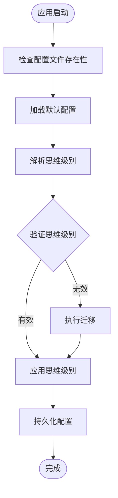

# 版本发布说明 0.10.3

<cite>
**本文档引用的文件**
- [0.10.3.md](file://apps/electron/resources/release-notes/0.10.3.md)
- [package.json](file://apps/electron/package.json)
- [package.json](file://package.json)
- [config-defaults.json](file://apps/electron/resources/config-defaults.json)
- [storage.ts](file://packages/shared/src/config/storage.ts)
- [default-thinking-level.test.ts](file://packages/shared/src/config/__tests__/default-thinking-level.test.ts)
</cite>

## 目录
1. [版本概览](#版本概览)
2. [主要特性更新](#主要特性更新)
3. [依赖升级详情](#依赖升级详情)
4. [配置系统分析](#配置系统分析)
5. [思维级别配置机制](#思维级别配置机制)
6. [版本兼容性说明](#版本兼容性说明)
7. [安装与升级指南](#安装与升级指南)
8. [故障排除](#故障排除)

## 版本概览

Craft Agents 版本 0.10.3 是一个重要的功能增强版本，主要引入了 Anthropic Claude Fable 5 模型的支持。该版本在保持向后兼容性的前提下，为用户提供了更强大的 AI 能力和改进的用户体验。

**章节来源**
- [0.10.3.md:1-18](file://apps/electron/resources/release-notes/0.10.3.md#L1-L18)

## 主要特性更新

### Claude Fable 5 模型支持

版本 0.10.3 最重大的更新是集成了 Anthropic Claude Fable 5 模型。这是一个具有里程碑意义的 AI 模型，具备以下特点：

- **1M 令牌上下文窗口**：提供前所未有的长文本处理能力
- **多平台支持**：可在直接 Anthropic 连接和 AWS Bedrock（us/eu/global 推断配置变体）上使用
- **本地化支持**：模型描述支持所有 7 种语言
- **智能思考模式**：Fable 5 和 Mythos 5 系列模型运行时始终启用自适应思考
- **默认模型策略**：Opus 4.8 仍为默认模型，Fable 5 作为替代选项提供

### 思维级别适配

由于 Fable 5 模型的特殊性（自适应思考始终开启且拒绝显式禁用），系统对思维级别解析器进行了相应调整：

- **"关闭"和"最小化思考"情况**：映射到低努力自适应思考
- **其他模型行为**：Opus、Sonnet 和 Haiku 的行为保持字节级不变

**章节来源**
- [0.10.3.md:5](file://apps/electron/resources/release-notes/0.10.3.md#L5)

## 依赖升级详情

### Claude Agent SDK 升级

版本 0.10.3 将 @anthropic-ai/claude-agent-sdk 从 0.3.154 升级到 0.3.170：

- **完整类型检查通过**：确保所有类型定义正确无误
- **锁文件刷新**：更新了所有相关依赖项
- **无 API 中断**：保持向后兼容性

### 根项目依赖更新

根项目的 package.json 显示了整体依赖关系的维护状态，包括 Electron、React 生态系统和其他核心依赖项的版本管理。

**章节来源**
- [0.10.3.md:9](file://apps/electron/resources/release-notes/0.10.3.md#L9)
- [package.json:141](file://package.json#L141)

## 配置系统分析

### 默认配置结构

应用程序使用集中化的配置系统，通过 config-defaults.json 文件管理默认设置：

```json
{
  "version": "1.0",
  "description": "默认配置值",
  "defaults": {
    "notificationsEnabled": true,
    "colorTheme": "default",
    "autoCapitalisation": true,
    "sendMessageKey": "enter",
    "spellCheck": false,
    "keepAwakeWhileRunning": false,
    "richToolDescriptions": true,
    "extendedPromptCache": false,
    "browserToolEnabled": true,
    "allowRemoteEvaluate": true
  },
  "workspaceDefaults": {
    "thinkingLevel": "think",
    "permissionMode": "safe",
    "cyclablePermissionModes": ["safe", "allow-all"],
    "localMcpServers": { "enabled": true }
  }
}
```

### 配置同步机制

配置系统采用自动同步机制，确保默认配置与应用版本保持一致：

- **启动时同步**：每次应用启动都会同步配置文件
- **资源目录检测**：检查捆绑资源目录的存在性
- **回退机制**：当资源目录不可用时使用内置回退配置

**章节来源**
- [config-defaults.json:1-25](file://apps/electron/resources/config-defaults.json#L1-L25)
- [storage.ts:137-164](file://packages/shared/src/config/storage.ts#L137-L164)

## 思维级别配置机制

### 默认思维级别存储

系统实现了完整的思维级别持久化机制，支持多种思维级别模式：

- **支持的思维级别**：off、min、low、medium、high、max
- **迁移支持**：自动将旧的 "think" 值迁移到新的 "medium"
- **进程间持久化**：支持跨进程的数据一致性

### 存储架构



**图表来源**
- [storage.ts:55-98](file://packages/shared/src/config/storage.ts#L55-L98)
- [default-thinking-level.test.ts:107-125](file://packages/shared/src/config/__tests__/default-thinking-level.test.ts#L107-L125)

### 测试覆盖

测试套件确保了思维级别配置的可靠性：

- **默认值测试**：验证默认思维级别为 "off"
- **持久化测试**：确认思维级别设置能够正确保存
- **值迁移测试**：验证从 "think" 到 "medium" 的自动迁移
- **边界条件测试**：覆盖所有支持的思维级别值

**章节来源**
- [default-thinking-level.test.ts:84-126](file://packages/shared/src/config/__tests__/default-thinking-level.test.ts#L84-L126)

## 版本兼容性说明

### 向后兼容性

版本 0.10.3 在设计时充分考虑了向后兼容性：

- **无破坏性变更**：官方声明无破坏性变更
- **API 兼容**：依赖升级未引入 API 中断
- **配置兼容**：现有配置文件无需修改即可使用

### 模型兼容性

新模型集成遵循严格的兼容性标准：

- **Fable 5 特性**：自适应思考始终开启，拒绝显式禁用
- **传统模型保持**：Opus、Sonnet、Haiku 行为完全不变
- **默认模型策略**：保持 Opus 4.8 为默认选择

## 安装与升级指南

### 升级步骤

1. **备份配置**：启动前自动创建配置备份
2. **下载更新**：从官方渠道获取版本 0.10.3
3. **安装过程**：应用自动同步配置文件
4. **验证安装**：重启应用确认功能正常

### 配置迁移

系统会自动处理配置迁移：

- **默认配置同步**：从捆绑资源复制最新配置
- **用户配置保留**：个人设置保持不变
- **回退机制**：配置损坏时自动恢复

## 故障排除

### 常见问题

1. **模型连接问题**
   - 检查网络连接状态
   - 验证 API 密钥配置
   - 确认模型权限设置

2. **配置同步失败**
   - 检查用户权限
   - 验证磁盘空间
   - 查看应用日志

3. **思维级别异常**
   - 重新启动应用
   - 检查配置文件完整性
   - 执行配置重置

### 支持资源

- **官方文档**：访问项目主页获取详细说明
- **社区支持**：通过 GitHub Issues 获取帮助
- **版本历史**：查看完整的发布记录