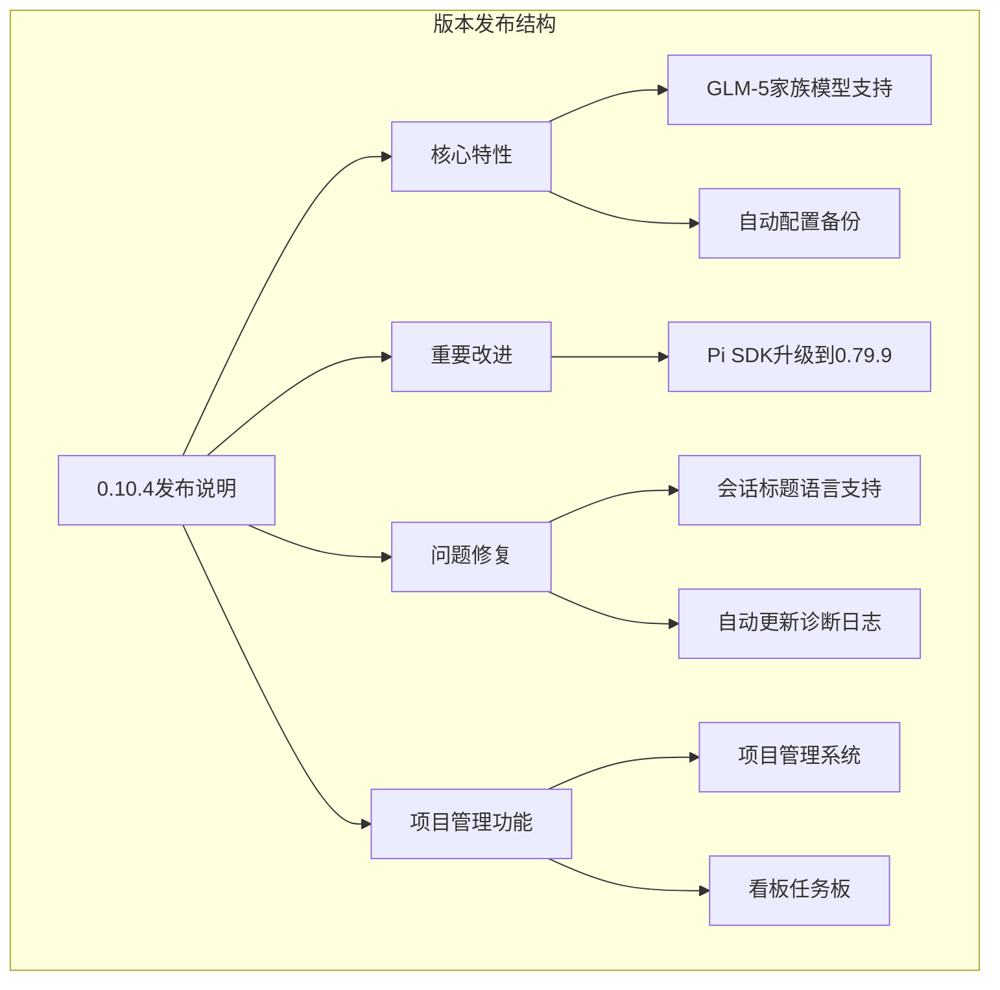
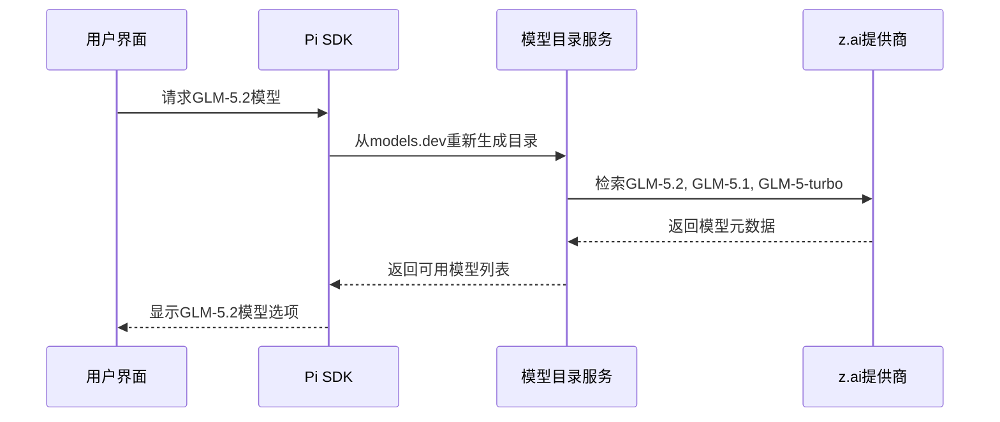
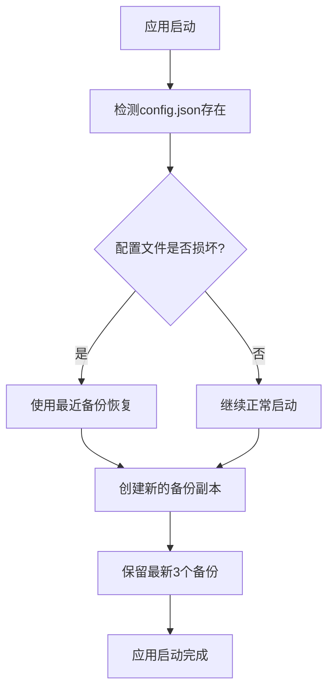
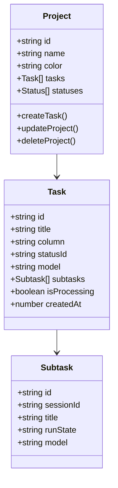
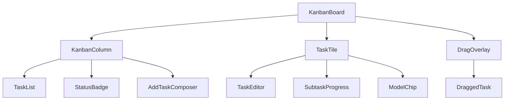
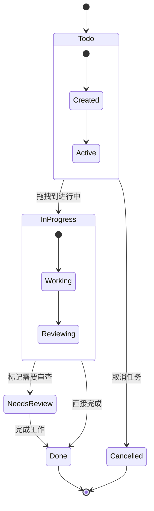
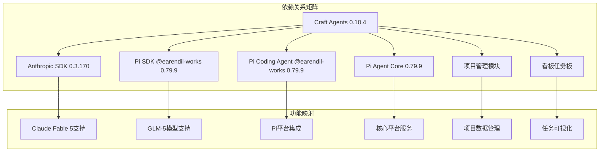

# 版本发布说明 0.10.4

<cite>
**本文引用的文件**
- [0.10.4.md](file://apps/electron/resources/release-notes/0.10.4.md)
- [KanbanBoard.tsx](file://apps/electron/src/renderer/components/app-shell/kanban/KanbanBoard.tsx)
- [types.ts](file://apps/electron/src/renderer/components/app-shell/kanban/types.ts)
- [kanban.ts](file://apps/electron/src/renderer/atoms/kanban.ts)
- [projects.ts](file://apps/electron/src/renderer/atoms/projects.ts)
- [package.json](file://package.json)
- [apps/electron/package.json](file://apps/electron/package.json)
- [apps/electron/src/main/index.ts](file://apps/electron/src/main/index.ts)
</cite>

## 更新摘要
**所做更改**
- 新增项目管理系统和看板任务板功能章节
- 更新核心特性部分以反映新的项目管理能力
- 增强模型支持信息，包含GLM-5家族模型的详细说明
- 添加看板任务板的架构设计和实现细节
- 更新用户影响分析以涵盖新的项目管理功能

## 目录
1. [简介](#简介)
2. [版本概览](#版本概览)
3. [核心特性](#核心特性)
4. [重要改进](#重要改进)
5. [问题修复](#问题修复)
6. [项目管理系统](#项目管理系统)
7. [看板任务板](#看板任务板)
8. [架构影响](#架构影响)
9. [用户影响分析](#用户影响分析)
10. [技术实现细节](#技术实现细节)
11. [升级指南](#升级指南)
12. [故障排除](#故障排除)

## 简介

Craft Agents 0.10.4 是一个重要的功能增强版本，主要引入了 GLM-5 家族模型支持、Pi SDK 升级、全新的项目管理系统和看板任务板等重大功能。该版本在保持向后兼容性的同时，为用户提供了更丰富的 AI 模型选择、更好的系统稳定性和全新的项目管理体验。

## 版本概览

- **版本号**: 0.10.4
- **发布时间**: 2026年6月
- **项目名称**: Craft Agents OSS
- **核心目标**: 扩展模型支持范围，提升系统稳定性，优化用户体验，引入项目管理功能



**图表来源**
- [0.10.4.md:1-21](file://apps/electron/resources/release-notes/0.10.4.md#L1-L21)

## 核心特性

### GLM-5.2 和 GLM-5 家族模型支持

0.10.4 版本最重要的特性是为 z.ai 平台增加了对 GLM-5.2 和整个 GLM-5 家族的支持。这一功能通过 Pi SDK 的重新生成模型目录实现，使得以下模型现在可以在现有的 z.ai 提供商上自动出现：

- **GLM-5.2**: 最初只能通过手写 OpenAI 兼容端点访问，现在可以直接使用
- **GLM-5.1**: 新增支持
- **GLM-5-turbo**: 新增支持

这些模型具有正确的思考处理能力（`reasoning_effort`），这是上游修复的结果。



**图表来源**
- [0.10.4.md](file://apps/electron/resources/release-notes/0.10.4.md#L5)

**章节来源**
- [0.10.4.md:3-6](file://apps/electron/resources/release-notes/0.10.4.md#L3-L6)

### 自动配置备份功能

新版本引入了自动 `config.json` 备份功能，在每次启动时都会拍摄快照，并保留最新的三个备份。这为损坏或错误的配置写入提供了恢复机制。



**图表来源**
- [0.10.4.md](file://apps/electron/resources/release-notes/0.10.4.md#L6)

**章节来源**
- [0.10.4.md:5-7](file://apps/electron/resources/release-notes/0.10.4.md#L5-L7)

## 重要改进

### Pi SDK 升级到 0.79.9

Pi SDK 迁移到了新的 `@earendil-works` 作用域，版本升级至 0.79.9。这次迁移涉及三个核心包：

- `pi-ai`: 从 0.73.1 升级到 0.79.9
- `pi-coding-agent`: 从 0.73.1 升级到 0.79.9  
- `pi-agent-core`: 从 0.73.1 升级到 0.79.9

这次升级带来了以下好处：

1. **新的模型支持**: 现有的 Pi 提供商（OpenRouter、z.ai 等）通过重新生成的 models.dev 目录自动显示更新的模型
2. **GitHub Copilot 设备码登录改进**: 现在使用 SDK 的结构化 `onDeviceCode` 回调，而不是脆弱的正则表达式
3. **完全向后兼容**: 没有用户可见的 API 中断；完整的类型检查和针对性的 Pi 测试套件都通过了

```mermaid
graph LR
subgraph "Pi SDK迁移前"
A[@mariozechner/* 0.73.1] --> B[pi-ai]
A --> C[pi-coding-agent]
A --> D[pi-agent-core]
end
subgraph "Pi SDK迁移后"
E[@earendil-works/* 0.79.9] --> F[pi-ai]
E --> G[pi-coding-agent]
E --> H[pi-agent-core]
end
A -.->|迁移| E
```

**图表来源**
- [0.10.4.md](file://apps/electron/resources/release-notes/0.10.4.md#L10)

**章节来源**
- [0.10.4.md:8-11](file://apps/electron/resources/release-notes/0.10.4.md#L8-L11)

## 问题修复

### 会话标题语言支持修复

修复了 AI 生成标题遵循所选语言的问题。现在 AI 生成的标题会直接从磁盘读取外观 → 语言设置，而不是应用程序的内存本地化，这可以避免在首次生成标题时仍停留在英语回退状态。

如果用户没有选择语言，标题现在会自动检测用户正在编写的语言，而不是默认使用英语。

**章节来源**
- [0.10.4.md:12-15](file://apps/electron/resources/release-notes/0.10.4.md#L12-L15)

### 自动更新诊断日志

自动更新现在会在 `~/.craft-agent/logs/auto-update.log` 中记录生命周期，即使在关闭调试日志的发布构建中也是如此。这使得"下载了更新但从未安装"的报告变得可诊断。

**章节来源**
- [0.10.4.md:14-16](file://apps/electron/resources/release-notes/0.10.4.md#L14-L16)

### 配置备份保护机制

修复了配置备份覆盖同一天现有备份的问题。现在每天最早的良好快照会被保留，而不是被稍后的同日启动覆盖。

**章节来源**
- [0.10.4.md:15-17](file://apps/electron/resources/release-notes/0.10.4.md#L15-L17)

## 项目管理系统

### 项目数据结构和管理

新版本引入了完整的项目管理系统，支持项目的创建、管理和组织。项目数据通过 Jotai 原子状态管理，确保跨组件的数据同步和一致性。



**图表来源**
- [projects.ts](file://apps/electron/src/renderer/atoms/projects.ts)
- [types.ts:51-86](file://apps/electron/src/renderer/components/app-shell/kanban/types.ts#L51-L86)

### 项目状态管理

项目状态通过专门的 Jotai 原子进行管理，包括项目过滤器、编辑器目标和列颜色等配置。这种设计确保了状态的持久化和跨会话的一致性。

**章节来源**
- [projects.ts:1-11](file://apps/electron/src/renderer/atoms/projects.ts#L1-L11)
- [kanban.ts:18-51](file://apps/electron/src/renderer/atoms/kanban.ts#L18-L51)

## 看板任务板

### 看板板组件架构

看板任务板是基于拖拽交互的任务管理界面，支持任务的创建、编辑、移动和状态管理。核心组件 `KanbanBoard` 提供了完整的看板功能。



**图表来源**
- [KanbanBoard.tsx:146-217](file://apps/electron/src/renderer/components/app-shell/kanban/KanbanBoard.tsx#L146-L217)

### 任务状态和列管理

看板支持自定义列和内置列（待办、进行中、已完成），每个任务都有独立的状态标识和物理位置。任务可以在不同列之间拖拽移动，同时保持其状态徽章的独立性。



**图表来源**
- [types.ts:20-22](file://apps/electron/src/renderer/components/app-shell/kanban/types.ts#L20-L22)
- [types.ts:51-86](file://apps/electron/src/renderer/components/app-shell/kanban/types.ts#L51-L86)

### 拖拽交互和用户体验

看板实现了流畅的拖拽体验，支持任务在不同列之间的移动，以及子任务的嵌套管理。拖拽操作通过 `@dnd-kit/core` 库实现，提供了良好的用户体验和性能优化。

**章节来源**
- [KanbanBoard.tsx:122-144](file://apps/electron/src/renderer/components/app-shell/kanban/KanbanBoard.tsx#L122-L144)
- [KanbanBoard.tsx:146-217](file://apps/electron/src/renderer/components/app-shell/kanban/KanbanBoard.tsx#L146-L217)

## 架构影响

### 依赖关系变更

根据项目配置文件，0.10.4 版本的主要依赖关系包括：

- **Anthropic SDK**: `@anthropic-ai/claude-agent-sdk` 升级到 0.3.170
- **Pi SDK**: `@earendil-works/pi-ai` 升级到 0.79.9
- **Pi Coding Agent**: `@earendil-works/pi-coding-agent` 升级到 0.79.9



**图表来源**
- [package.json:140-202](file://package.json#L140-L202)

**章节来源**
- [package.json:140-202](file://package.json#L140-L202)

## 用户影响分析

### 对现有用户的影响

1. **模型选择扩展**: 用户现在可以访问 GLM-5.2、GLM-5.1 和 GLM-5-turbo 模型，而无需手动配置
2. **配置安全性增强**: 自动备份功能为配置损坏提供了保护
3. **语言支持改进**: 会话标题现在正确反映用户的语言偏好
4. **更新体验改善**: 自动更新过程更加透明和可诊断
5. **项目管理能力**: 全新的项目管理系统帮助用户更好地组织和跟踪任务
6. **可视化任务管理**: 看板任务板提供了直观的任务管理界面

### 向后兼容性

- **无破坏性变更**: 0.10.4 版本声明没有破坏性变更
- **SDK迁移透明**: Pi SDK 的迁移对用户完全透明
- **配置迁移平滑**: 自动备份功能确保配置迁移过程安全
- **新功能渐进式**: 项目管理功能作为可选特性提供，不影响现有工作流程

## 技术实现细节

### 自动配置备份实现

应用程序在启动时会执行以下流程：

1. 检测 `config.json` 文件的存在和完整性
2. 如果文件损坏，使用最近的备份进行恢复
3. 创建新的备份副本
4. 保留最新的三个备份版本
5. 清理超出保留限制的旧备份

### 看板任务板实现

看板任务板的核心实现包括：

1. **状态管理**: 使用 Jotai 原子管理看板状态和用户偏好
2. **拖拽交互**: 基于 `@dnd-kit/core` 实现流畅的拖拽体验
3. **数据绑定**: 将任务数据与 UI 组件进行双向绑定
4. **性能优化**: 使用 React.memo 和 useMemo 优化渲染性能

### 会话标题语言处理

标题生成逻辑进行了以下改进：

1. 直接从磁盘读取用户语言设置
2. 避免使用内存中的本地化状态
3. 支持自动语言检测作为后备方案
4. 确保标题与用户首选语言一致

**章节来源**
- [apps/electron/src/main/index.ts:895-920](file://apps/electron/src/main/index.ts#L895-L920)
- [KanbanBoard.tsx:104-118](file://apps/electron/src/renderer/components/app-shell/kanban/KanbanBoard.tsx#L104-L118)
- [kanban.ts:18-51](file://apps/electron/src/renderer/atoms/kanban.ts#L18-L51)

## 升级指南

### 升级前准备

1. **备份当前配置**: 在升级前手动备份 `~/.craft-agent/config.json`
2. **检查网络连接**: 确保能够访问新的模型目录服务
3. **验证存储空间**: 确保有足够的磁盘空间用于备份文件
4. **熟悉新功能**: 了解新的项目管理和看板功能

### 升级步骤

1. 下载并安装 0.10.4 版本
2. 应用程序启动时会自动创建初始备份
3. 验证新模型是否出现在模型选择器中
4. 测试会话标题的语言显示
5. 探索新的项目管理和看板功能

### 验证升级

1. 打开模型设置页面，确认 GLM-5 模型可见
2. 创建新会话，检查标题语言设置
3. 触发一次自动更新，验证诊断日志创建
4. 尝试创建项目和任务，验证项目管理功能
5. 使用看板界面，测试拖拽和状态切换功能

## 故障排除

### 常见问题及解决方案

#### 模型不可见问题

**症状**: GLM-5 模型在模型选择器中不可见

**解决方案**:
1. 检查网络连接是否正常
2. 重启应用程序以重新加载模型目录
3. 清除模型缓存并重新启动

#### 配置备份问题

**症状**: 配置备份文件过多或过少

**解决方案**:
1. 检查 `~/.craft-agent/config-backups/` 目录
2. 确认只保留了最新的三个备份版本
3. 手动清理多余的备份文件

#### 会话标题语言问题

**症状**: 会话标题显示为英语而非用户选择的语言

**解决方案**:
1. 检查外观设置中的语言配置
2. 重新启动应用程序
3. 验证系统语言检测功能

#### 看板功能问题

**症状**: 看板任务无法拖拽或状态不更新

**解决方案**:
1. 刷新页面重新加载看板组件
2. 检查浏览器控制台是否有错误信息
3. 清除应用缓存并重新启动

#### 项目管理问题

**症状**: 项目数据丢失或不同步

**解决方案**:
1. 检查网络连接和服务器连接状态
2. 验证项目数据的完整性
3. 使用应用的导入/导出功能恢复数据

### 联系支持

如果遇到无法解决的问题，请提供以下信息：

1. 应用程序版本号
2. 操作系统信息
3. 错误日志文件路径
4. 重现步骤详细描述
5. 相关截图或录屏