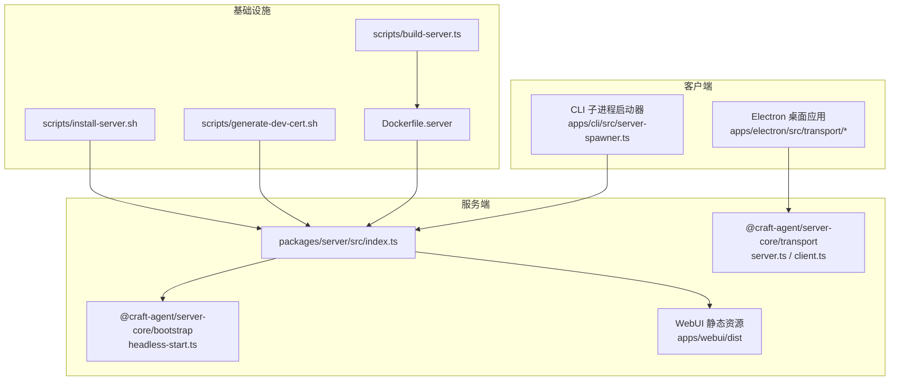
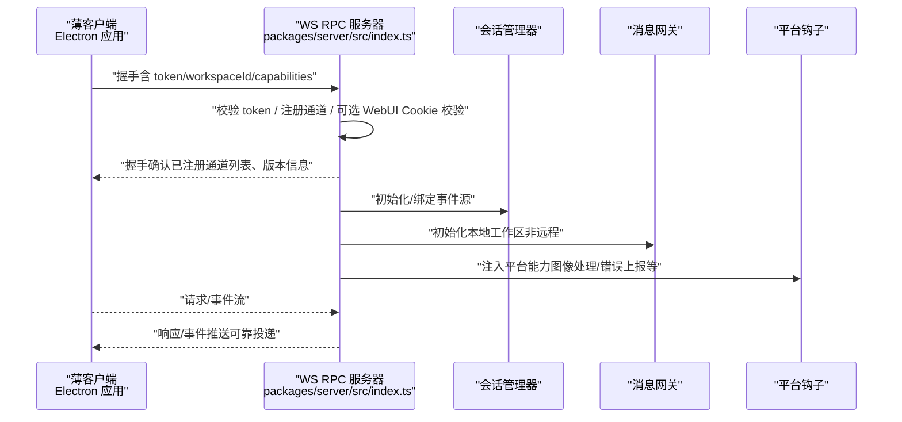
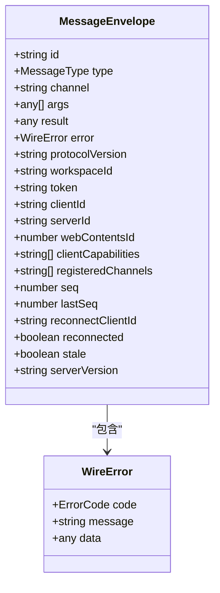
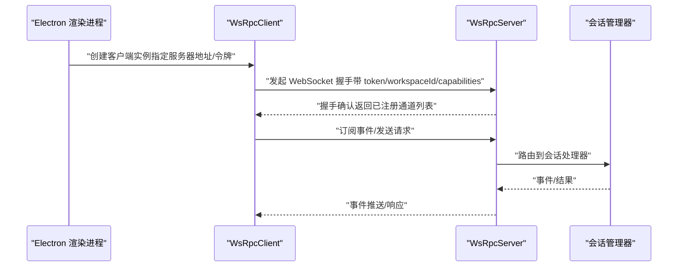
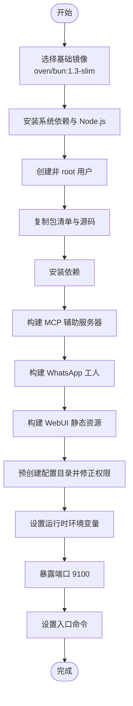
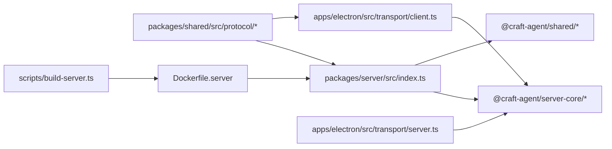

# 远程服务器配置

<cite>
**本文引用的文件**
- [Dockerfile.server](file://Dockerfile.server)
- [packages/server/src/index.ts](file://packages/server/src/index.ts)
- [packages/server/package.json](file://packages/server/package.json)
- [apps/cli/src/server-spawner.ts](file://apps/cli/src/server-spawner.ts)
- [scripts/generate-dev-cert.sh](file://scripts/generate-dev-cert.sh)
- [scripts/install-server.sh](file://scripts/install-server.sh)
- [scripts/build-server.ts](file://scripts/build-server.ts)
- [scripts/docker-smoke-test.sh](file://scripts/docker-smoke-test.sh)
- [packages/shared/src/config/server-config.ts](file://packages/shared/src/config/server-config.ts)
- [packages/server-core/src/index.ts](file://packages/server-core/src/index.ts)
- [apps/electron/src/transport/client.ts](file://apps/electron/src/transport/client.ts)
- [apps/electron/src/transport/server.ts](file://apps/electron/src/transport/server.ts)
- [packages/shared/src/protocol/types.ts](file://packages/shared/src/protocol/types.ts)
- [packages/shared/src/protocol/channels.ts](file://packages/shared/src/protocol/channels.ts)
</cite>

## 目录
1. [简介](#简介)
2. [项目结构](#项目结构)
3. [核心组件](#核心组件)
4. [架构总览](#架构总览)
5. [详细组件分析](#详细组件分析)
6. [依赖关系分析](#依赖关系分析)
7. [性能与扩展性](#性能与扩展性)
8. [故障排查指南](#故障排查指南)
9. [结论](#结论)
10. [附录：部署与运维最佳实践](#附录部署与运维最佳实践)

## 简介
本指南面向需要在远程机器上部署 Craft Agents 无头服务器的用户，帮助您完成从单机开发到生产级部署的全链路配置。内容涵盖：
- 无头服务器的架构原理与使用场景（多设备访问、计算密集型任务）
- 服务器启动流程与环境变量配置（认证令牌、RPC 绑定地址与端口、TLS 设置等）
- 完整的 Docker 部署方案（镜像构建、容器编排、卷挂载、网络与安全）
- 薄客户端模式（桌面应用通过 WebSocket 连接到远程服务器进行渲染）的工作原理
- 生产环境部署最佳实践（负载均衡、监控告警、备份恢复）

## 项目结构
围绕“远程服务器”主题，仓库中与之直接相关的关键模块如下：
- 服务入口与启动逻辑：packages/server/src/index.ts
- 服务打包与分发：packages/server/package.json、scripts/build-server.ts
- Docker 化：Dockerfile.server、scripts/docker-smoke-test.sh
- 开发证书生成：scripts/generate-dev-cert.sh
- 本地/开发安装脚本：scripts/install-server.sh
- 命令行子进程启动器：apps/cli/src/server-spawner.ts
- Electron 传输层（薄客户端连接）：apps/electron/src/transport/*
- 协议与通道定义：packages/shared/src/protocol/*

图表来源
- [packages/server/src/index.ts:1-353](file://packages/server/src/index.ts#L1-L353)
- [packages/server-core/src/index.ts:1-5](file://packages/server-core/src/index.ts#L1-L5)
- [apps/electron/src/transport/server.ts:1-2](file://apps/electron/src/transport/server.ts#L1-L2)
- [apps/electron/src/transport/client.ts:1-18](file://apps/electron/src/transport/client.ts#L1-L18)
- [Dockerfile.server:1-120](file://Dockerfile.server#L1-L120)
- [scripts/generate-dev-cert.sh:1-29](file://scripts/generate-dev-cert.sh#L1-L29)
- [scripts/install-server.sh:1-106](file://scripts/install-server.sh#L1-L106)
- [scripts/build-server.ts:712-764](file://scripts/build-server.ts#L712-L764)

章节来源
- [packages/server/src/index.ts:1-353](file://packages/server/src/index.ts#L1-L353)
- [packages/server/package.json:1-39](file://packages/server/package.json#L1-L39)
- [Dockerfile.server:1-120](file://Dockerfile.server#L1-L120)
- [scripts/build-server.ts:712-764](file://scripts/build-server.ts#L712-L764)

## 核心组件
- 无头服务器入口与配置解析：负责读取环境变量、初始化 TLS、注入 WebUI、启动健康检查、绑定消息网关与会话管理器。
- 传输层（WS RPC）：统一的 WebSocket RPC 协议与通道，支持握手、可靠投递、重连与鉴权。
- 会话与平台钩子：为无头模式设置平台能力、图像处理、模型刷新服务等。
- WebUI 内置：可将 WebUI 静态资源直接嵌入 RPC 端口，便于浏览器直连。
- Docker 镜像：提供多平台构建、非 root 用户、系统依赖与 WebUI 构建流水线。

章节来源
- [packages/server/src/index.ts:1-353](file://packages/server/src/index.ts#L1-L353)
- [packages/server-core/src/index.ts:1-5](file://packages/server-core/src/index.ts#L1-L5)
- [packages/shared/src/protocol/types.ts:1-80](file://packages/shared/src/protocol/types.ts#L1-L80)
- [packages/shared/src/protocol/channels.ts:412-448](file://packages/shared/src/protocol/channels.ts#L412-L448)

## 架构总览
无头服务器采用“单进程多职责”的设计：在单一进程中同时承载 WebSocket RPC 服务、可选的 WebUI HTTP 处理、会话管理、消息网关与平台能力注入。薄客户端（桌面应用或 CLI）通过 WS 连接服务器，握手时携带工作区标识与认证令牌，随后进行可靠事件流与请求响应。

图表来源
- [packages/server/src/index.ts:166-296](file://packages/server/src/index.ts#L166-L296)
- [apps/electron/src/transport/client.ts:1-18](file://apps/electron/src/transport/client.ts#L1-L18)
- [packages/shared/src/protocol/types.ts:20-63](file://packages/shared/src/protocol/types.ts#L20-L63)

## 详细组件分析

### 无头服务器启动流程与环境变量
- 认证与安全
  - 必需参数：CRAFT_SERVER_TOKEN（用于客户端鉴权）
  - 可选参数：CRAFT_RPC_TLS_CERT、CRAFT_RPC_TLS_KEY、CRAFT_RPC_TLS_CA（启用 wss://）
  - 绑定策略：默认仅监听本地回环；若绑定到非本地地址且未启用 TLS，将拒绝启动（除非显式允许）
- 网络与端口
  - CRAFT_RPC_HOST、CRAFT_RPC_PORT 控制 RPC 服务监听地址与端口
  - 若启用 WebUI，WebUI 将与 RPC 端口复用
- WebUI
  - CRAFT_WEBUI_DIR 指向构建后的 WebUI 目录
  - CRAFT_WEBUI_PASSWORD、CRAFT_WEBUI_SECURE_COOKIE、CRAFT_WEBUI_WS_URL 可微调登录与前端连接
- 平台与资源
  - CRAFT_BUNDLED_ASSETS_ROOT、CRAFT_APP_ROOT、CRAFT_RESOURCES_PATH 控制资源定位
  - CRAFT_MESSAGING_WA_WORKER、CRAFT_MESSAGING_NODE_BIN 指定 WhatsApp 子进程适配器路径与 Node 可执行文件
- 健康检查
  - CRAFT_HEALTH_PORT 启动独立 HTTP 健康检查端点

章节来源
- [packages/server/src/index.ts:8-26](file://packages/server/src/index.ts#L8-L26)
- [packages/server/src/index.ts:98-112](file://packages/server/src/index.ts#L98-L112)
- [packages/server/src/index.ts:114-152](file://packages/server/src/index.ts#L114-L152)
- [packages/server/src/index.ts:298-305](file://packages/server/src/index.ts#L298-L305)
- [packages/server/src/index.ts:314-335](file://packages/server/src/index.ts#L314-L335)

### 传输协议与通道
- 协议类型与消息封装：握手、请求/响应、事件、错误、序列确认等
- 关键字段：消息 ID、通道名、工作区 ID、令牌、客户端能力、序列号与重连信息、服务器版本
- 通道命名空间：包含会话、消息、访问控制等命名空间，用于路由与权限控制

图表来源
- [packages/shared/src/protocol/types.ts:20-63](file://packages/shared/src/protocol/types.ts#L20-L63)
- [packages/shared/src/protocol/types.ts:65-69](file://packages/shared/src/protocol/types.ts#L65-L69)

章节来源
- [packages/shared/src/protocol/types.ts:1-80](file://packages/shared/src/protocol/types.ts#L1-L80)
- [packages/shared/src/protocol/channels.ts:412-448](file://packages/shared/src/protocol/channels.ts#L412-L448)

### 薄客户端（桌面应用）连接原理
- 客户端侧导出统一的 WsRpcClient 接口，支持多种传输模式与连接状态
- 服务器侧导出 WsRpcServer，作为无头模式的 RPC 服务端
- 客户端通过握手携带 token 与 workspaceId，建立可靠事件流与请求响应

图表来源
- [apps/electron/src/transport/client.ts:1-18](file://apps/electron/src/transport/client.ts#L1-L18)
- [apps/electron/src/transport/server.ts:1-2](file://apps/electron/src/transport/server.ts#L1-L2)
- [packages/server/src/index.ts:166-249](file://packages/server/src/index.ts#L166-L249)

章节来源
- [apps/electron/src/transport/client.ts:1-18](file://apps/electron/src/transport/client.ts#L1-L18)
- [apps/electron/src/transport/server.ts:1-2](file://apps/electron/src/transport/server.ts#L1-L2)
- [packages/server/src/index.ts:166-249](file://packages/server/src/index.ts#L166-L249)

### Docker 部署方案
- 镜像基础与依赖
  - 基于 oven/bun:1.3-slim，安装 Node.js（WhatsApp 子进程依赖）、证书与工具
  - 非 root 用户运行，确保 Claude Code SDK 正常工作
- 构建步骤
  - 复制包清单与源码，安装依赖
  - 构建 MCP 辅助服务器与 WhatsApp 工人
  - 构建 WebUI 静态资源（提升堆内存上限避免低内存主机失败）
  - 预创建配置目录，修正权限
- 运行参数
  - 默认监听 0.0.0.0:9100，可通过环境变量覆盖
  - 支持通过卷挂载配置目录与证书目录
  - 提供生成自签名证书脚本用于开发测试

图表来源
- [Dockerfile.server:26-120](file://Dockerfile.server#L26-L120)

章节来源
- [Dockerfile.server:1-120](file://Dockerfile.server#L1-L120)
- [scripts/generate-dev-cert.sh:1-29](file://scripts/generate-dev-cert.sh#L1-L29)

### 开发与本地安装脚本
- generate-dev-cert.sh：生成自签名证书，便于本地 TLS 测试
- install-server.sh：检查 Bun 版本、安装依赖、生成服务器令牌、打印启动命令
- build-server.ts：生成 Dockerfile 与 docker-compose.yml，输出二进制与安装脚本，支持 systemd 安装

章节来源
- [scripts/generate-dev-cert.sh:1-29](file://scripts/generate-dev-cert.sh#L1-L29)
- [scripts/install-server.sh:1-106](file://scripts/install-server.sh#L1-L106)
- [scripts/build-server.ts:712-764](file://scripts/build-server.ts#L712-L764)

### CLI 子进程启动器（用于集成测试与自动化）
- 自动检测服务器入口文件
- 以子进程方式启动服务器，读取标准输出中的 CRAFT_SERVER_URL/CRAFT_SERVER_TOKEN
- 支持超时、静默模式与调试日志透传

章节来源
- [apps/cli/src/server-spawner.ts:1-150](file://apps/cli/src/server-spawner.ts#L1-L150)

## 依赖关系分析
- 服务入口对 server-core 的依赖：引导启动、WS 服务器、会话管理、消息网关、平台钩子
- Electron 传输层对 server-core 的再导出，保证薄客户端与服务端协议一致
- 协议与通道定义位于 shared，被 server 与 electron 共享
- Dockerfile 与构建脚本共同决定镜像与分发产物

图表来源
- [packages/server/src/index.ts:33-49](file://packages/server/src/index.ts#L33-L49)
- [apps/electron/src/transport/client.ts:8-17](file://apps/electron/src/transport/client.ts#L8-L17)
- [apps/electron/src/transport/server.ts:1-1](file://apps/electron/src/transport/server.ts#L1-L1)
- [packages/shared/src/protocol/types.ts:1-80](file://packages/shared/src/protocol/types.ts#L1-L80)
- [Dockerfile.server:26-120](file://Dockerfile.server#L26-L120)
- [scripts/build-server.ts:712-764](file://scripts/build-server.ts#L712-L764)

章节来源
- [packages/server/src/index.ts:33-49](file://packages/server/src/index.ts#L33-L49)
- [apps/electron/src/transport/client.ts:8-17](file://apps/electron/src/transport/client.ts#L8-L17)
- [apps/electron/src/transport/server.ts:1-1](file://apps/electron/src/transport/server.ts#L1-L1)
- [packages/shared/src/protocol/types.ts:1-80](file://packages/shared/src/protocol/types.ts#L1-L80)

## 性能与扩展性
- 无头模式优势
  - 在远程高性能机器上运行，桌面应用仅负责渲染与交互，降低本地资源占用
  - 适合多设备访问与集中化计算任务（如大模型推理、批量数据处理）
- 传输层优化
  - 可靠投递与序列确认机制，保障事件一致性
  - 重连握手支持断线恢复
- Docker 与资源限制
  - 使用非 root 用户与最小化依赖，降低容器开销
  - WebUI 构建阶段提升堆内存上限，避免低内存主机失败
- 扩展建议
  - 结合反向代理（Nginx/Traefik）实现 TLS 终止与压缩
  - 使用容器编排（Kubernetes/Docker Compose）实现副本与滚动更新
  - 对会话与消息网关进行水平拆分（按工作区/租户隔离）

[本节为通用指导，不直接分析具体文件]

## 故障排查指南
- 启动被拒绝（未启用 TLS 绑定到非本地地址）
  - 现象：拒绝绑定到网络地址且未配置 TLS
  - 处理：设置 CRAFT_RPC_TLS_CERT 与 CRAFT_RPC_TLS_KEY，或使用 --allow-insecure-bind（不推荐生产）
- WebUI 登录异常
  - 检查 CRAFT_WEBUI_DIR 是否存在且可读
  - 确认 CRAFT_WEBUI_WS_URL 与实际前端访问 URL 一致
  - 如启用 Cookie 安全标志，确认浏览器 HTTPS 环境
- WebSocket 连接失败
  - 校验 token 与握手参数（workspaceId、capabilities）
  - 检查防火墙与反向代理配置
- Docker 容器无法启动
  - 查看容器日志，确认证书路径与权限
  - 确认端口映射与卷挂载正确
- 健康检查失败
  - 检查 CRAFT_HEALTH_PORT 与依赖组件（会话管理器、WS 服务器）状态

章节来源
- [packages/server/src/index.ts:314-335](file://packages/server/src/index.ts#L314-L335)
- [packages/server/src/index.ts:114-152](file://packages/server/src/index.ts#L114-L152)
- [scripts/docker-smoke-test.sh:40-87](file://scripts/docker-smoke-test.sh#L40-L87)

## 结论
Craft Agents 的无头服务器通过统一的 WS RPC 协议与可插拔的平台钩子，实现了在远程机器上的高效渲染与计算。结合 Docker 化与薄客户端模式，可在多设备间共享同一套 AI 工作流能力。生产部署建议配合反向代理、健康检查与可观测性体系，确保高可用与可维护性。

[本节为总结，不直接分析具体文件]

## 附录：部署与运维最佳实践

### 环境变量清单与建议
- 认证与安全
  - CRAFT_SERVER_TOKEN：强随机令牌，妥善保管
  - CRAFT_RPC_TLS_CERT、CRAFT_RPC_TLS_KEY、CRAFT_RPC_TLS_CA：生产环境必须，建议使用受信 CA 签发
- 网络与端口
  - CRAFT_RPC_HOST：生产环境建议固定为 0.0.0.0 或反向代理上游地址
  - CRAFT_RPC_PORT：默认 9100，注意与反向代理映射一致
- WebUI
  - CRAFT_WEBUI_DIR：指向构建产物目录
  - CRAFT_WEBUI_PASSWORD：可选，简化登录体验
  - CRAFT_WEBUI_SECURE_COOKIE：HTTPS 环境下建议开启
  - CRAFT_WEBUI_WS_URL：当反向代理修改协议/域名时使用
- 资源与平台
  - CRAFT_BUNDLED_ASSETS_ROOT：生产分发包根目录
  - CRAFT_APP_ROOT、CRAFT_RESOURCES_PATH：资源定位
  - CRAFT_MESSAGING_WA_WORKER、CRAFT_MESSAGING_NODE_BIN：WhatsApp 子进程适配器路径与 Node 可执行文件
- 健康检查
  - CRAFT_HEALTH_PORT：独立健康检查端口，便于探针与负载均衡

章节来源
- [packages/server/src/index.ts:8-26](file://packages/server/src/index.ts#L8-L26)
- [Dockerfile.server:106-115](file://Dockerfile.server#L106-L115)

### Docker Compose 示例（摘自构建脚本）
- 服务定义：镜像构建、端口映射、环境变量、卷挂载
- 建议：将 CRAFT_SERVER_TOKEN 与证书路径通过环境文件或密钥管理服务注入

章节来源
- [scripts/build-server.ts:742-763](file://scripts/build-server.ts#L742-L763)

### 负载均衡与高可用
- 反向代理
  - Nginx/Traefik 终止 TLS，转发至多个无头服务器实例
  - 配置长连接与压缩（gzip/deflate）
- 会话粘性
  - 通过工作区 ID 或客户端 ID 实现会话亲和
- 健康检查
  - 使用 CRAFT_HEALTH_PORT 提供轻量健康端点
  - 结合探针与自动重启策略

[本节为通用指导，不直接分析具体文件]

### 监控与告警
- 指标采集
  - 连接数、消息吞吐、事件延迟、错误率
- 日志
  - 分离标准输出与错误输出，接入集中式日志系统
- 告警
  - 健康检查失败、连接异常、资源使用率阈值

[本节为通用指导，不直接分析具体文件]

### 备份与恢复
- 数据卷
  - 挂载 ~/.craft-agent 到持久化存储（本地/云盘）
- 配置
  - 证书与令牌通过密钥管理服务或环境文件管理
- 回滚
  - 使用容器编排的滚动更新与回滚策略

[本节为通用指导，不直接分析具体文件]