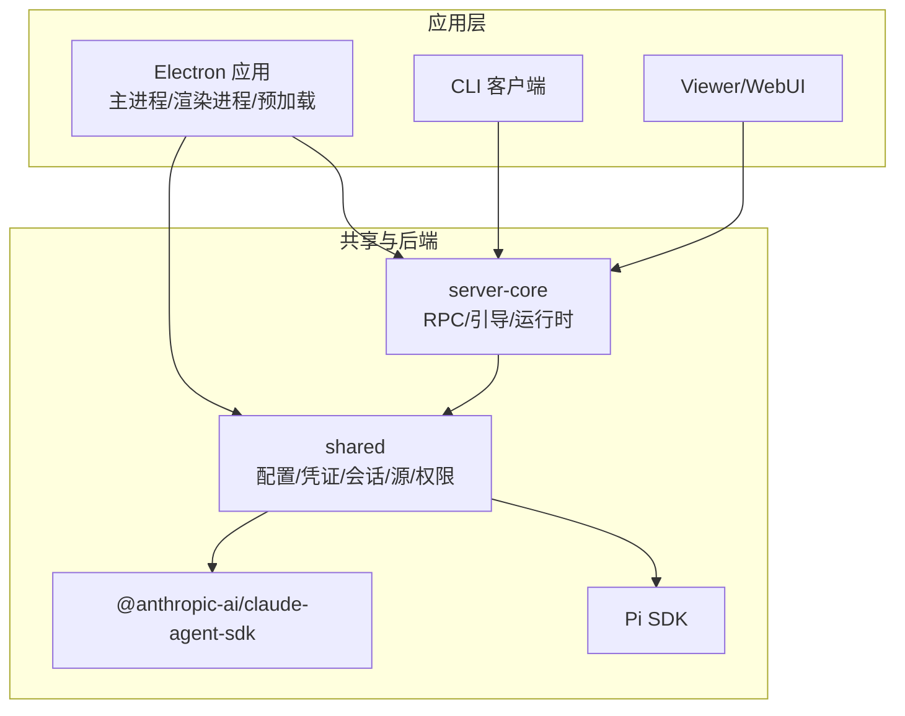
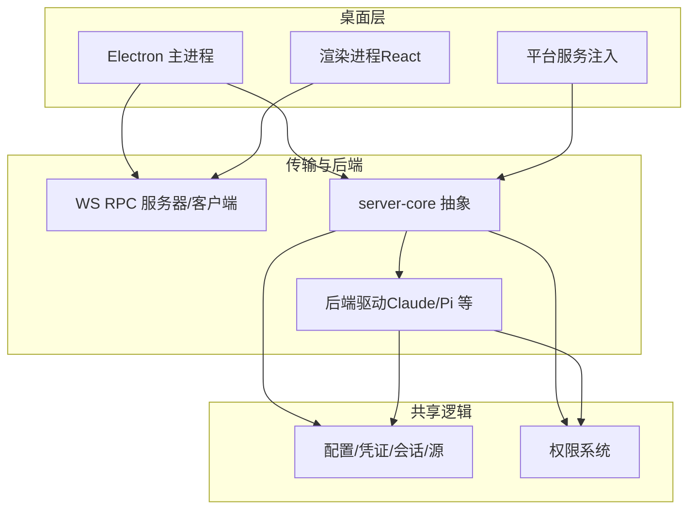
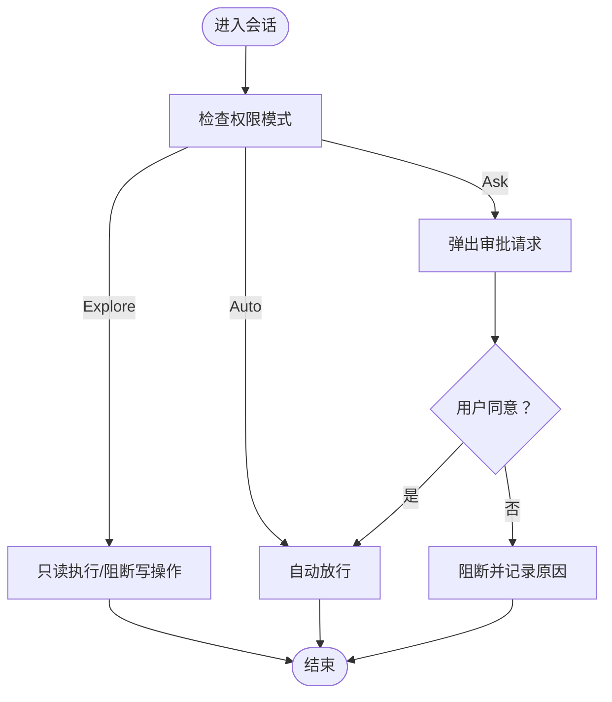
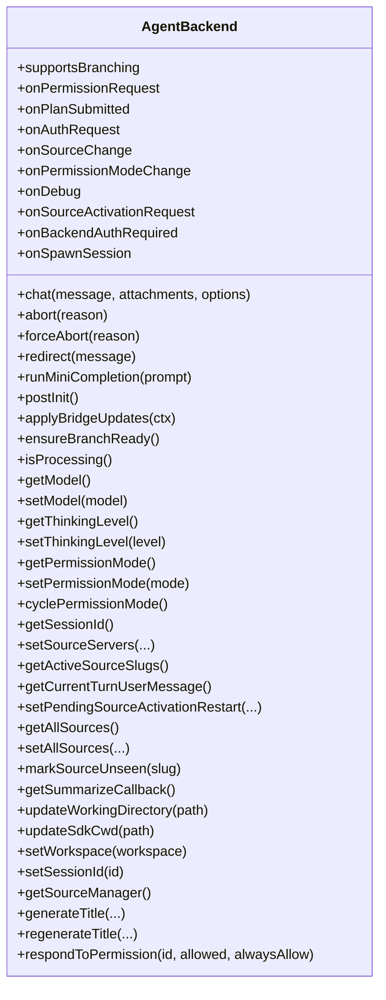
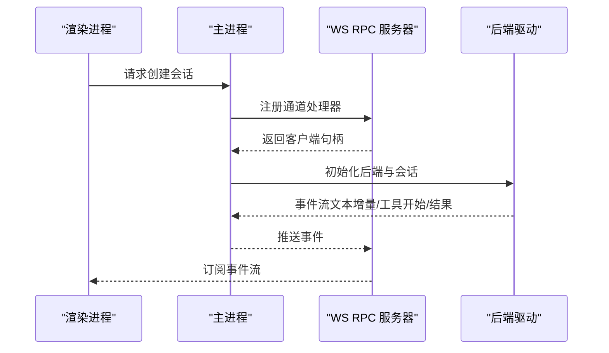
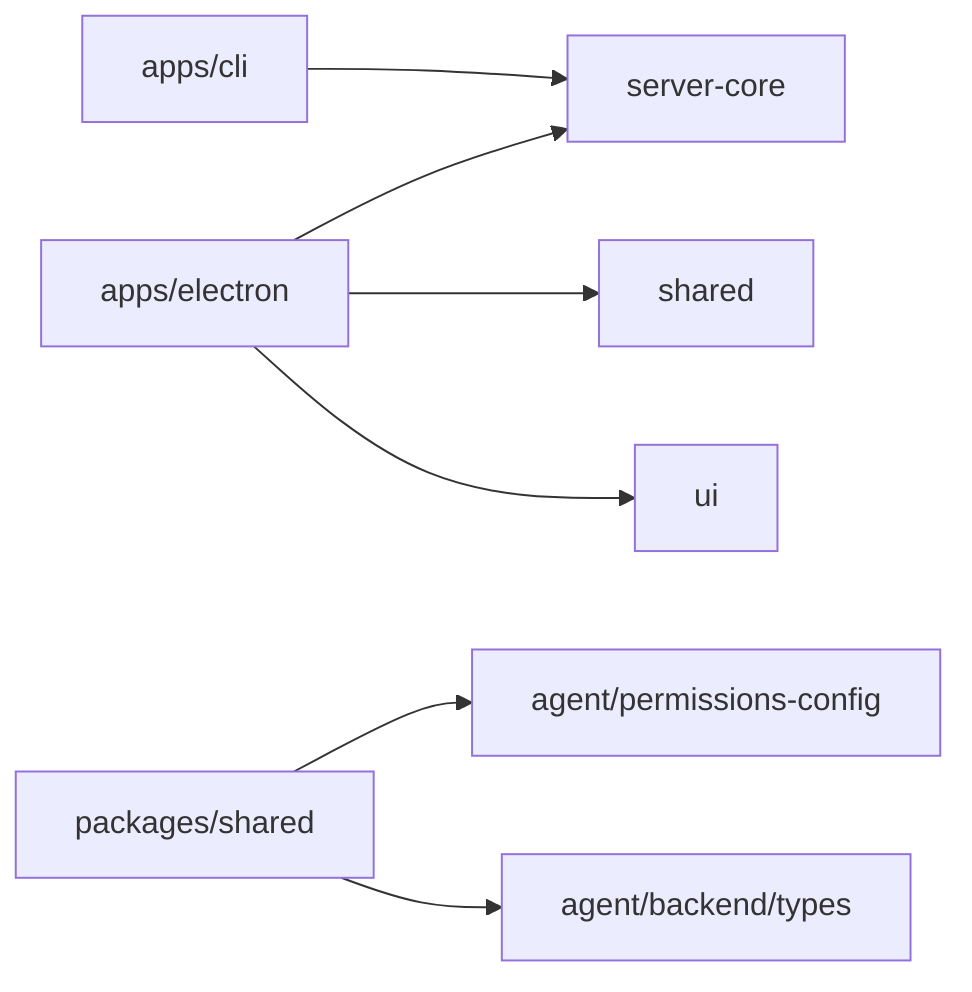

# 项目概述

<cite>
**本文档引用的文件**
- [README.md](file://README.md)
- [package.json](file://package.json)
- [apps/electron/package.json](file://apps/electron/package.json)
- [apps/electron/src/main/index.ts](file://apps/electron/src/main/index.ts)
- [apps/electron/src/renderer/main.tsx](file://apps/electron/src/renderer/main.tsx)
- [apps/electron/src/renderer/App.tsx](file://apps/electron/src/renderer/App.tsx)
- [apps/electron/src/runtime/platform.ts](file://apps/electron/src/runtime/platform.ts)
- [apps/cli/src/index.ts](file://apps/cli/src/index.ts)
- [packages/server-core/src/index.ts](file://packages/server-core/src/index.ts)
- [packages/shared/src/agent/permissions-config.ts](file://packages/shared/src/agent/permissions-config.ts)
- [packages/shared/src/agent/backend/types.ts](file://packages/shared/src/agent/backend/types.ts)
- [packages/shared/tests/session-validation.test.ts](file://packages/shared/tests/session-validation.test.ts)
</cite>

## 目录
1. [简介](#简介)
2. [项目结构](#项目结构)
3. [核心组件](#核心组件)
4. [架构总览](#架构总览)
5. [详细组件分析](#详细组件分析)
6. [依赖关系分析](#依赖关系分析)
7. [性能考虑](#性能考虑)
8. [故障排除指南](#故障排除指南)
9. [结论](#结论)
10. [附录](#附录)

## 简介
Craft Agents 是一款面向代理原生（Agent Native）的桌面应用，旨在以更直观的方式与各类智能体协作，支持多会话管理、零繁琐连接配置、跨平台工作区组织，并提供文档中心化的高效工作流。项目采用“无代码编辑器”理念，通过提示即可实现高度定制化。

核心价值主张包括：
- 代理原生软件：以“描述需求，系统自动推理如何执行”为核心体验
- 多会话 Inbox：按状态工作流组织会话，支持标记、归档与持久化
- 无繁琐连接配置：一键接入 MCP 服务器、REST API、本地工具与第三方服务
- 多模型与多提供商：支持 Anthropic、Google AI Studio、OpenAI、OpenRouter、Ollama 等
- 权限模式与安全：三层权限控制（探索、询问编辑、自动），默认安全且可自定义
- 远程服务器与薄客户端：可在远程服务器上运行，桌面端作为轻客户端连接

## 项目结构
项目采用 Monorepo 结构，核心由以下部分组成：
- apps：应用层
  - electron：Electron 桌面应用（主进程、渲染进程、预加载）
  - cli：命令行客户端
  - viewer、webui：辅助应用
- packages：共享与后端包
  - server-core：RPC 传输、引导、运行时抽象
  - shared：业务逻辑、配置、凭证、会话、源、权限等
  - 其他领域包（如 messaging-gateway、pi-agent-server 等）

图表来源
- [apps/electron/src/main/index.ts:605-705](file://apps/electron/src/main/index.ts#L605-L705)
- [apps/cli/src/index.ts:1-120](file://apps/cli/src/index.ts#L1-L120)
- [packages/server-core/src/index.ts:1-5](file://packages/server-core/src/index.ts#L1-L5)

章节来源
- [README.md:343-366](file://README.md#L343-L366)
- [package.json:17-21](file://package.json#L17-L21)
- [apps/electron/package.json:17-37](file://apps/electron/package.json#L17-L37)

## 核心组件
- 会话管理与状态工作流：支持会话持久化、状态变更、标记与标题生成
- 权限系统：Explore/Ask to Edit/Auto 三层模式，支持规则化扩展
- 多提供商与模型：统一抽象后端，支持 Anthropic、Pi（含 Google、ChatGPT Plus、Copilot）、OpenRouter、Ollama 等
- 传输与 RPC：基于 WebSocket 的 RPC 通道，支持事件推送与分发
- 安全与隔离：本地 MCP 子进程隔离、敏感环境变量过滤、路径安全校验

章节来源
- [README.md:84-118](file://README.md#L84-L118)
- [packages/shared/src/agent/permissions-config.ts:64-124](file://packages/shared/src/agent/permissions-config.ts#L64-L124)
- [packages/shared/src/agent/backend/types.ts:1-643](file://packages/shared/src/agent/backend/types.ts#L1-L643)
- [apps/electron/src/main/index.ts:605-705](file://apps/electron/src/main/index.ts#L605-L705)

## 架构总览
Craft Agents 采用“桌面主进程 + 轻量渲染进程 + 后端服务”的分层设计。主进程负责系统集成、窗口管理、平台服务注入与 RPC 引导；渲染进程负责 UI 与用户交互；共享包提供统一的业务逻辑与抽象接口；后端通过 Claude Agent SDK 与 Pi SDK 提供多提供商能力。

图表来源
- [apps/electron/src/main/index.ts:435-705](file://apps/electron/src/main/index.ts#L435-L705)
- [apps/electron/src/renderer/App.tsx:196-310](file://apps/electron/src/renderer/App.tsx#L196-L310)
- [packages/server-core/src/index.ts:1-5](file://packages/server-core/src/index.ts#L1-L5)

## 详细组件分析

### 代理原生软件原则
- 以“描述需求”为核心输入，系统自动推断工具调用与执行路径
- 支持即时变更：在对话中动态提及新技能或源，无需重启
- 无代码编辑器：通过提示完成定制，降低工程门槛

章节来源
- [README.md:14-23](file://README.md#L14-L23)

### 多会话管理与状态工作流
- Inbox/Archive 组织，支持状态流转（待办 → 进行中 → 需要审核 → 完成）
- 会话持久化到磁盘，支持 AI 自动生成标题与手动命名
- 支持标签与标记，便于快速检索与优先级管理

章节来源
- [README.md:111-118](file://README.md#L111-L118)

### 无繁琐连接配置
- 一键接入：MCP 服务器、REST API、本地文件系统
- 支持本地 MCP（stdio）与远端 MCP（HTTP/SSE）
- 自动发现与配置：粘贴 OpenAPI 规范或公共 API 文档即可自动配置

章节来源
- [README.md:27-59](file://README.md#L27-L59)

### 权限模式与安全
- 三层权限模式：Explore（只读）、Ask to Edit（询问编辑）、Auto（自动）
- 可自定义规则：通过 JSON 文件扩展默认规则，支持 Bash/MCP 模式与 API 端点白名单
- 命令提示与阻断：对被阻断命令提供上下文建议与替代方案
- 路径安全校验：防御路径穿越与不合法标识符

图表来源
- [packages/shared/src/agent/permissions-config.ts:64-124](file://packages/shared/src/agent/permissions-config.ts#L64-L124)
- [packages/shared/src/agent/permissions-config.ts:668-727](file://packages/shared/src/agent/permissions-config.ts#L668-L727)

章节来源
- [README.md:129-137](file://README.md#L129-L137)
- [packages/shared/src/agent/permissions-config.ts:1-800](file://packages/shared/src/agent/permissions-config.ts#L1-L800)
- [packages/shared/tests/session-validation.test.ts:67-107](file://packages/shared/tests/session-validation.test.ts#L67-L107)

### 多提供商与模型抽象
- 后端统一接口：AgentBackend 定义聊天、中断、重定向、模型切换、权限模式等能力
- 提供商适配：Claude（Anthropic SDK）、Pi（Pi SDK，覆盖 Google、ChatGPT Plus、Copilot 等）
- 能力驱动 UI：根据后端能力动态展示模型与思考层级选择

图表来源
- [packages/shared/src/agent/backend/types.ts:310-590](file://packages/shared/src/agent/backend/types.ts#L310-L590)

章节来源
- [README.md:455-485](file://README.md#L455-L485)
- [packages/shared/src/agent/backend/types.ts:1-643](file://packages/shared/src/agent/backend/types.ts#L1-L643)

### 传输与 RPC
- WebSocket RPC：客户端与服务端通过通道映射进行调用与事件订阅
- 事件分发：支持 fan-out sink 将事件同时推送到 RPC 与消息网关
- 客户端生命周期：支持连接建立、超时、TLS、证书校验与重连诊断

图表来源
- [apps/electron/src/main/index.ts:605-705](file://apps/electron/src/main/index.ts#L605-L705)
- [apps/electron/src/transport/index.ts:1-6](file://apps/electron/src/transport/index.ts#L1-L6)

章节来源
- [apps/electron/src/transport/index.ts:1-6](file://apps/electron/src/transport/index.ts#L1-L6)
- [apps/electron/src/main/index.ts:471-512](file://apps/electron/src/main/index.ts#L471-L512)

### 平台服务与运行时
- 平台服务抽象：日志、图像处理、系统能力等通过 PlatformServices 注入
- 运行时初始化：在主进程构建平台实例并注入到后端子系统
- 渲染进程初始化：Sentry 错误上报、主题与国际化、根组件挂载

章节来源
- [apps/electron/src/runtime/platform.ts:1-8](file://apps/electron/src/runtime/platform.ts#L1-L8)
- [apps/electron/src/main/index.ts:459-470](file://apps/electron/src/main/index.ts#L459-L470)
- [apps/electron/src/renderer/main.tsx:1-119](file://apps/electron/src/renderer/main.tsx#L1-L119)

### 命令行客户端（CLI）
- 连接与认证：通过 ws/wss 连接服务器，支持 TLS 证书链
- 资源管理：列出/创建/删除会话、发送消息并实时流式输出
- 自举运行：支持自启动本地服务器、注册工作区、自动配置 LLM 连接

章节来源
- [apps/cli/src/index.ts:1-120](file://apps/cli/src/index.ts#L1-L120)
- [apps/cli/src/index.ts:247-490](file://apps/cli/src/index.ts#L247-L490)
- [apps/cli/src/index.ts:628-714](file://apps/cli/src/index.ts#L628-L714)

## 依赖关系分析
- 技术栈与运行时：Bun、Electron、React、Claude Agent SDK、Pi SDK、WebSocket RPC
- 包依赖：apps/electron 依赖 server-core、shared、ui 等；CLI 依赖 client 与 server-core
- 第三方 SDK：Anthropic Claude SDK、Pi SDK、GitHub Copilot SDK、OpenAI SDK 等

图表来源
- [apps/electron/package.json:38-43](file://apps/electron/package.json#L38-L43)
- [package.json:17-21](file://package.json#L17-L21)

章节来源
- [README.md:569-580](file://README.md#L569-L580)
- [apps/electron/package.json:38-83](file://apps/electron/package.json#L38-L83)
- [package.json:134-194](file://package.json#L134-L194)

## 性能考虑
- 事件驱动与流式输出：渲染进程通过订阅事件流实时更新 UI，避免轮询
- 轻客户端模式：远程服务器承载计算，桌面端仅负责 UI 渲染，降低本地资源占用
- 路径与参数安全：严格的会话 ID 与路径校验，防止越权与路径穿越
- 传输优化：WebSocket 事件聚合与去抖，减少不必要的 UI 刷新

## 故障排除指南
- 启动与调试：开发模式下启用调试日志，查看主进程与渲染进程日志
- 远程连接：自签名证书场景下，确保在连接 URL 上启用证书绕过
- 依赖缺失：Windows 下缺少 VC++ 运行库会导致文档转换工具崩溃，需按提示安装
- 权限问题：Explore 模式下所有写操作被阻断，必要时切换到 Ask 或 Auto 模式

章节来源
- [README.md:581-606](file://README.md#L581-L606)
- [apps/electron/src/main/index.ts:222-261](file://apps/electron/src/main/index.ts#L222-L261)
- [apps/electron/src/renderer/App.tsx:631-651](file://apps/electron/src/renderer/App.tsx#L631-L651)

## 结论
Craft Agents 通过代理原生的设计理念与强大的多提供商后端抽象，实现了“所想即所得”的智能体工作流。其无繁琐连接配置、多会话管理与权限体系，既适合初学者快速上手，也为高级用户提供充分的可定制空间。结合 Electron + React + Claude Agent SDK + Pi SDK 的技术选型，项目在易用性、可扩展性与安全性方面达到了良好平衡。

## 附录

### 快速开始
- 安装：使用一键安装脚本或从源码构建
- 连接提供商：Anthropic、Google AI Studio、OpenAI、OpenRouter、Ollama 等
- 创建工作区：组织会话与资源
- 连接数据源：MCP、REST API、本地文件系统
- 开始对话：直接描述任务，系统自动推理执行

章节来源
- [README.md:61-108](file://README.md#L61-L108)

### 技术架构选择与优势
- Electron + React：成熟的桌面应用生态，UI 与交互体验优秀
- Claude Agent SDK + Pi SDK：统一抽象多提供商能力，简化集成复杂度
- WebSocket RPC：低延迟事件推送，适合流式对话与工具调用
- Bun：高性能运行时，提升构建与启动效率

章节来源
- [README.md:569-580](file://README.md#L569-L580)